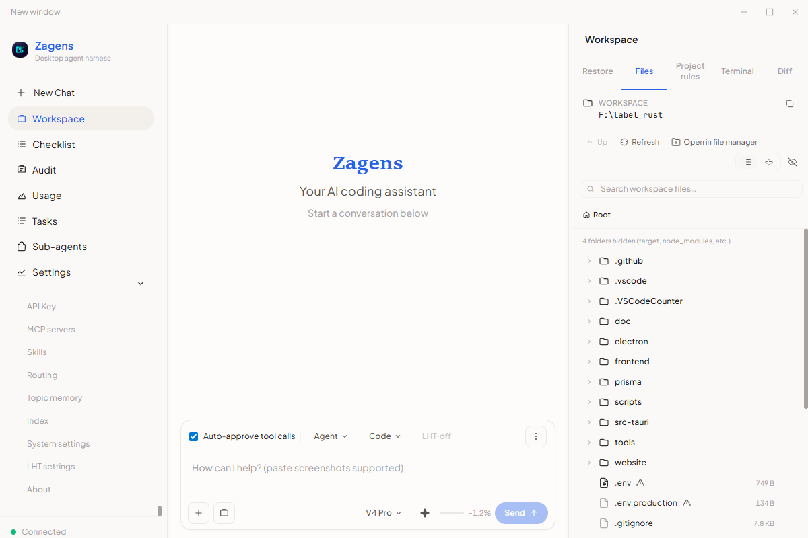

<p align="center">
  
</p>

# Zagens

*Open-source agent harness for [DeepSeek V4](https://deepseek.com/).*

**[中文](README.zh-CN.md)** · **[日本語](README.ja.md)** · **[Português (BR)](README.pt-BR.md)** | English

Long-horizon agent work tends to **stall or “claim done” too early**. Code and office files often live in **separate tools**. Local agents need **replay, approval, and auditability** — not just another chat window.

**Zagens** is an open-source agent harness for **[DeepSeek V4](https://deepseek.com/)**.

> **From the authors:** Don’t believe an AI agent can do anything — it has boundaries. What we can do is expand those boundaries.

> **License:** [MIT](LICENSE). Runtime lineage: [NOTICE.md](NOTICE.md) · [third-party/deepseek-tui/](third-party/deepseek-tui/). Capabilities below reflect **Zagens v0.8.2** — see [CHANGELOG.md](CHANGELOG.md).

| Resource | Link |
|----------|------|
| User guides | [zagens.com/docs](https://zagens.com/docs) |
| Downloads | [GitHub Releases](https://github.com/didclawapp-ai/zagens/releases) (latest **`zagens-v0.8.2`**) · [zagens.com/download](https://zagens.com/download) |
| Design specs | [`docs/README.md`](docs/README.md) |
| Contributing | [`CONTRIBUTING.md`](CONTRIBUTING.md) · [`LOCAL_DEV_VERIFY.md`](LOCAL_DEV_VERIFY.md) |
| Security | [`SECURITY.md`](SECURITY.md) |

---

## Who Zagens is for

| Good fit | Less fit |
|----------|----------|
| **DeepSeek power users** — daily DeepSeek API / V4 coding and agent workflows who want a local agent platform beyond official tools | A hosted SaaS with managed models and billing |
| Developers who want a **standalone agent platform** (desktop, TUI, or CLI — not locked into one IDE extension) | “Chat only” — no tools, no workspace, no replay |
| **Terminal-first users** on macOS / Linux / Windows — full-screen **`zagens-tui`** with the same engine as desktop | Fully autonomous YOLO agents with no guardrails |
| Teams working on **long code refactors** or **Office deliverables** in the same workflow | Zero-setup mobile or browser-only experience |
| People who care about **local sidecar architecture**, MCP/skills, and **exec approval** in the UI | Teams that only want a web copilot with no local execution |
| Windows desktop users today; macOS/Linux via **TUI**, **CLI**, or source build | |

---

## Three things that define Zagens

**1. Harness, not a chat shell** — Long-horizon code tasks use **composable completion gates** (operator / model / toolchain layers), not “the model said it’s finished.” Spec: [LHT](docs/harness/LONG_HORIZON_CODE_TASKS.md) · fixtures: [`fixtures/harness/`](fixtures/harness/).

**2. Multiple surfaces, one engine** — [Tauri 2](https://tauri.app/) desktop **or** full-screen **`zagens-tui`** (ratatui) **or** headless **`zagens`** CLI — all run **Kernel V3** (`LiveTurnMachine` + `EffectInterpreter`, event-sourced turns, log-first session resume). Desktop adds tray, WebView panels, embedded PTY, and sidecar supervision; TUI adds three-column transcript/composer/inspector + LHT panel in the terminal.

**3. Code + Office, one runtime** — **Code** and **Office** task types share tools and config but use different tool surfaces and prompts; switching types starts a **new session** for stable model KV ([architecture](docs/task-type-prompt-architecture.md)). Office: `read_file` / **`write_office`** (xlsx via Rust; docx/pptx/pdf via bundled Python).

Also shipped: **CRAFT multi-agent** (sub-agents, fix-loop verdicts, P1 blackboard — [notes](docs/craft-v2-improvements.md)), lazy **symbol index** (`.zagens/symbols.json`), MCP, skills, hooks, scheduled tasks, **`batch_edit`** / **`refactor_imports`** bulk code tools.

---

## Problems we focus on

| Pain | How Zagens approaches it |
|------|---------------------------|
| Agent stops mid-task or marks work complete prematurely | Layered **completion gates** + long-horizon task panel ([composable harness](docs/harness/COMPOSABLE_HARNESS.md)) |
| IDE plugins vs terminal agents don’t share one session story | Single **sidecar** + SQLite threads, fork/resume, **replay**, workspace snapshots |
| Spreadsheets and docs are outside the coding agent loop | **Office mode** with `write_office` and file previews in the desktop shell |
| Running tools locally without blind trust | Exec policy, network rules, path canonicalization, approval UI, runtime token kept out of the WebView ([sandbox matrix](docs/tech/SANDBOX_CAPABILITY_MATRIX.md)) |

---

## Shipped today (v0.8.2)

**Kernel V3 engine:** event-sourced turn loop — `KernelEvent` log in `sessions.db`, `LiveTurnMachine` planning, `EffectInterpreter` IO, golden replay fixtures. Spec: [AGENT_KERNEL_V3.md](docs/tech/AGENT_KERNEL_V3.md).

**Desktop (Tauri):** multi-session chat (stream/stop/thinking), file tree + previews + diff, PTY terminal (Code), sub-agent panel, tasks/skills UI, MCP + routing rules, usage charts, keyring API key, UI in zh-Hans / en / ja / pt-BR.

**Terminal TUI (`zagens-tui`):** full-screen three-column shell — sessions rail, streaming transcript + thinking/tools, composer with `/model` and `/lht`, approval modal, inspector (files / diff / checklist / agents / MCP), collapsible LHT lower pane, theme presets, session restore (`--fresh` for clean start). Same runtime threads and Kernel V3 path as desktop.

**Runtime:** threads, MCP, skills (`~/.zagens/skills`), lifecycle hooks, multi-provider routing, vision (`describe_image`), ContextCompiler V2 request assembly.

**Tools (representative):** files (`read_file`, `write_file`, `edit_file`, `batch_edit`, `refactor_imports`, …), git, `exec_shell`, `write_office`, optional `web_search` / `fetch_url`, memory tools. Full list: `crates/runtime-server/src/tools/` · [CHANGELOG.md](CHANGELOG.md).

---

## Known limits (read before you rely on us)

We prefer honest scope over marketing checklists.

| Topic | Status |
|-------|--------|
| **Desktop installers** | **Windows** installer on [Releases](https://github.com/didclawapp-ai/zagens/releases). **macOS / Linux desktop packages** — planned. **`zagens` CLI** and **`zagens-tui`** binaries ship for all three platforms today. |
| **OS sandbox enforcement** | **macOS Seatbelt** — enforced when `sandbox-exec` is available. **Windows** — native sandbox enforced after setup (`elevated` recommended: profile read isolation + WFP; `unelevated` fallback: workspace write isolation only). Settings → **Sandbox** first-run wizard. **Linux** — policy declared, **not OS-enforced yet** (degraded). Details: [`SANDBOX_CAPABILITY_MATRIX.md`](docs/tech/SANDBOX_CAPABILITY_MATRIX.md). |
| **Providers** | Optimized for **DeepSeek V4** (Pro / Flash); you bring API keys. Other OpenAI-compatible endpoints supported — we do not host models. |
| **Long-horizon & multi-agent** | Gates and CRAFT are **production-usable but still evolving**; edge cases and new gate types land in active development. |
| **Office depth** | Core read/write paths work; enterprise connectors, voice, and some scenario templates are **future** ([Office scenarios](docs/desktop/OFFICE_SCENARIOS.md)). |

Report security issues via [`SECURITY.md`](SECURITY.md).

---

## Where we’re headed

Public design specs live under [`docs/`](docs/README.md). Directionally:

- **Platform parity** — macOS/Linux desktop installers; **Linux** native sandbox (Landlock/bwrap). Windows native sandbox shipped in 0.7.x.
- **Trustworthy long tasks** — tighter completion gates, harness fixtures, and replay-friendly operator workflows.
- **Office workflows** — richer scenario coverage without splitting away from the shared runtime.
- **Hardening** — security and exec-policy improvements tracked in [CHANGELOG](CHANGELOG.md) and [SECURITY.md](SECURITY.md).

---

## Quick start

### Zagens Desktop (Windows)

[GitHub Releases](https://github.com/didclawapp-ai/zagens/releases) ships the **Windows** desktop installer (`*-setup.exe.zip`). macOS / Linux desktop packages are planned. SmartScreen: [SMARTSCREEN.md](docs/desktop/SMARTSCREEN.md).

### CLI & TUI — by platform

| Surface | Linux | macOS | Windows |
|---------|-------|-------|---------|
| **`zagens-tui`** (full-screen terminal UI) | ✅ | ✅ | ✅ |
| **`zagens`** (headless CLI) | ✅ | ✅ | ✅ |
| **Desktop app** | — (use TUI) | — (use TUI) | ✅ installer |

Install via **pre-built binaries** ([Releases `zagens-v0.8.2`](https://github.com/didclawapp-ai/zagens/releases/tag/zagens-v0.8.2)), **`cargo install`** (crates.io), or **from source** (below).

**Rust prerequisite** (`cargo install` / source only): install [rustup](https://rustup.rs/) (Rust **1.88+**; CI pins 1.96). Then `source "$HOME/.cargo/env"` (Linux/macOS) or open a new terminal (Windows).

#### Linux (Ubuntu / Debian)

```bash
sudo apt update
sudo apt install -y build-essential curl pkg-config libssl-dev libdbus-1-dev
curl --proto '=https' --tlsv1.2 -sSf https://sh.rustup.rs | sh
source "$HOME/.cargo/env"

# TUI (first compile may take 10–30 min)
cargo install zagens-cli --version 0.8.2 --bin zagens-tui --features tui --locked

# Headless CLI (optional)
cargo install zagens-cli --version 0.8.2 --bin zagens --locked
```

**Pre-built** (no Rust required): download `zagens-tui-x86_64-unknown-linux-gnu` and/or `zagens-x86_64-unknown-linux-gnu` from [Releases](https://github.com/didclawapp-ai/zagens/releases/tag/zagens-v0.8.2), verify the matching `.sha256`, `chmod +x`, and move into a directory on your `PATH`.

```bash
zagens-tui              # resume last session
zagens-tui --fresh      # new session
```

#### macOS

```bash
xcode-select --install    # if the C toolchain is missing
curl --proto '=https' --tlsv1.2 -sSf https://sh.rustup.rs | sh
source "$HOME/.cargo/env"

cargo install zagens-cli --version 0.8.2 --bin zagens-tui --features tui --locked
cargo install zagens-cli --version 0.8.2 --bin zagens --locked   # optional
```

**Pre-built:** `zagens-tui-x86_64-apple-darwin` or `zagens-tui-aarch64-apple-darwin` (Intel vs Apple Silicon) on [Releases](https://github.com/didclawapp-ai/zagens/releases/tag/zagens-v0.8.2).

#### Windows

**Pre-built (fastest):** [Releases](https://github.com/didclawapp-ai/zagens/releases/tag/zagens-v0.8.2) — `zagens-tui-x86_64-pc-windows-msvc.exe`, `zagens-x86_64-pc-windows-msvc.exe` (+ `.sha256`). Add the folder to `PATH` or copy the `.exe` files into a directory on `PATH`.

**crates.io** (install [Rust for Windows](https://rustup.rs/) first):

```powershell
cargo install zagens-cli --version 0.8.2 --bin zagens-tui --features tui --locked
cargo install zagens-cli --version 0.8.2 --bin zagens --locked
```

### crates.io (all platforms)

```bash
cargo install zagens-cli --version 0.8.2 --bin zagens-tui --features tui --locked   # TUI
cargo install zagens-cli --version 0.8.2 --bin zagens --locked                   # CLI
cargo install zagens-cli --version 0.8.2 --bin zagens-runtime --locked           # HTTP sidecar (optional)
```

### From source — desktop

```bash
git clone https://github.com/didclawapp-ai/zagens.git
cd zagens

cargo build -p zagens-cli          # copies zagens-runtime into crates/desktop/binaries/

cd crates/desktop/web-ui && npm install
cd .. && cargo tauri dev

# API key: Zagens Settings, or ~/.zagens/config.toml
```

### From source — terminal TUI

```bash
cargo build -p zagens-cli --features tui --bin zagens-tui
./target/debug/zagens-tui          # restore last session; --fresh for new session
```

**API key:** `DEEPSEEK_API_KEY`, `~/.zagens/config.toml`, TUI `/api-key` / first-run onboarding, or `zagens login --api-key <key>`. Legacy `~/.deepseek/config.toml` is read if present but new installs use `~/.zagens/`.

**Headless CLI examples:**

```bash
zagens doctor
zagens exec 'summarize src/' --json
zagens exec 'refactor auth module' --auto
zagens serve --http --port 7878
```

Config reference: [config.example.toml](config.example.toml).

---

## Architecture

```
┌──────────────────┐  ┌──────────────────┐  ┌──────────────────┐
│  Zagens Desktop  │  │   zagens-tui     │  │  zagens CLI      │
│  Tauri + WebView │  │  ratatui TUI     │  │  exec / serve    │
└────────┬─────────┘  └────────┬─────────┘  └────────┬─────────┘
         │ HTTP+SSE (loopback) │ in-process          │ in-process / HTTP
         ▼                     ▼                     ▼
┌─────────────────────────────────────────────────────────────────┐
│  zagens-runtime sidecar  ·  Kernel V3 turn engine               │
│  LiveTurnMachine → EffectInterpreter → V3TurnHost               │
│  /v1/threads · MCP · skills · tools · kernel_events log         │
└───────────────────────────────┬─────────────────────────────────┘
                                ▼
         zagens-core · runtime-orchestrator · runtime-adapters
```

Full boundaries: [`docs/tech/RUNTIME_ARCHITECTURE.md`](docs/tech/RUNTIME_ARCHITECTURE.md) · Kernel V3: [`docs/tech/AGENT_KERNEL_V3.md`](docs/tech/AGENT_KERNEL_V3.md) · HTTP contract: [`docs/tech/API_DESIGN.md`](docs/tech/API_DESIGN.md).

### Security modes (`sandbox_mode`)

| Mode | Description |
|------|-------------|
| `read-only` | No shell execution or file writes |
| `workspace-write` | Shell and writes within the workspace (recommended default) |
| `danger-full-access` | Full filesystem access — use with caution |
| `external-sandbox` | Route `exec_shell` through an OpenSandbox-compatible API |

Approval policies (`on-request` / `untrusted` / `never`), per-domain network rules, OS keyring for credentials. Runtime token never enters the WebView.

---

## Development

**Prerequisites:** Rust 1.88+ (MSRV; CI pins **1.96**), Node.js 20 LTS, Python 3.8+, [Tauri CLI 2](https://v2.tauri.app/start/prerequisites/).

See **[CONTRIBUTING.md](CONTRIBUTING.md)** and **[LOCAL_DEV_VERIFY.md](LOCAL_DEV_VERIFY.md)**.

| Command | Description |
|---------|-------------|
| `bash scripts/ci/verify-lint.sh` | CI lint mirror |
| `bash scripts/ci/verify-workspace.sh` | Lint + full workspace tests |
| `cargo test --workspace --all-features` | Run all tests |
| `cd crates/desktop && cargo tauri dev` | Launch desktop in dev mode |

Windows: `pwsh -File scripts/ci/verify-lint.ps1`

```
zagens/
├── crates/desktop/        # Tauri desktop app
├── crates/runtime-server/ # zagens-runtime sidecar · zagens CLI · zagens-tui (feature `tui`)
├── crates/core/           # Kernel V3 engine (LiveTurnMachine, kernel events)
├── docs/                  # Public design specs
├── fixtures/harness/      # LHT / kernel replay fixtures
└── config.example.toml
```

---

## License

[MIT](LICENSE) — Copyright (c) 2024-2026 Zagens Contributors. Additional attribution: [NOTICE.md](NOTICE.md) · [third-party/deepseek-tui/LICENSE](third-party/deepseek-tui/LICENSE).
