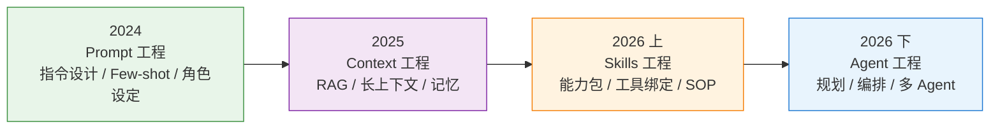
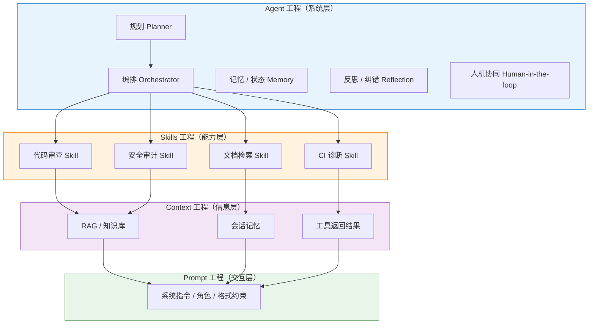
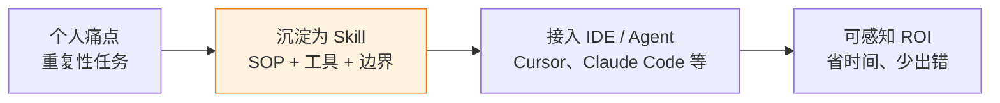
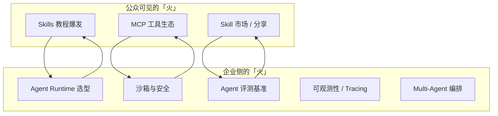
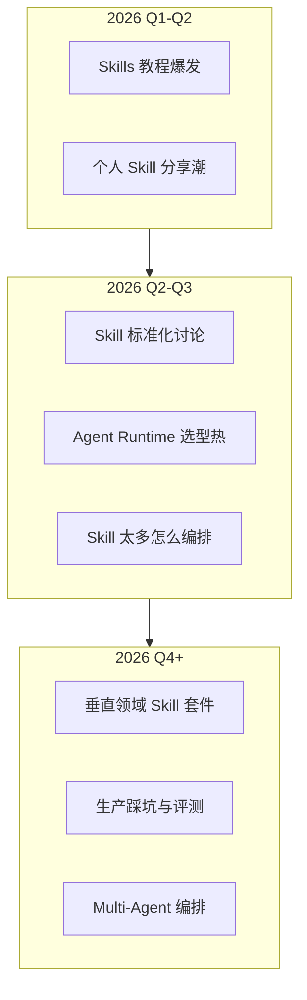
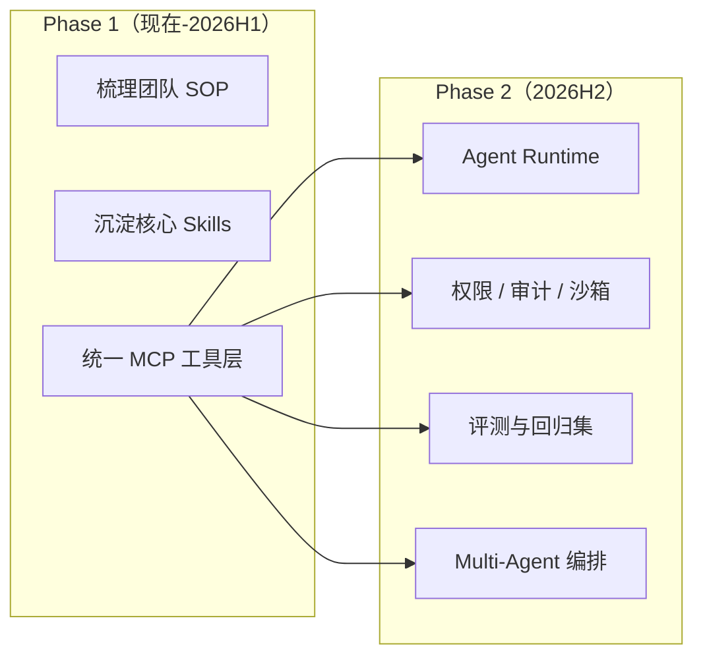
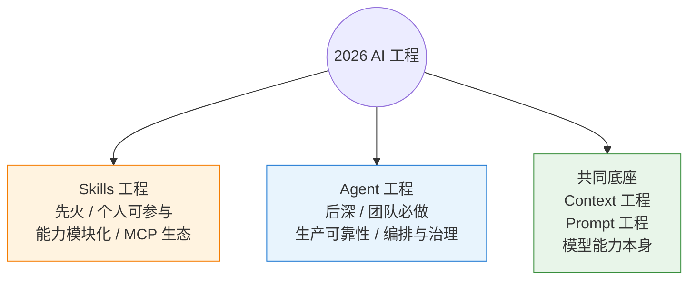

# 2026年，Skills 工程 vs Agent 工程，哪一个会先火？

> 写在前面：这不是二选一的标准答案，而是一条「能力栈」在不同阶段被放大的顺序问题。下面我会尽量把概念讲清楚，再给出我对 2026 年「谁先火」的判断和理由。

---

## 一、先把时间线捋顺：我们到底在「工程化」什么？

知乎题主给出的脉络很有代表性：

| 年份 | 热词 | 核心问题 |
|------|------|----------|
| 2024 | Prompt 工程 | 怎么**说**，模型才听得懂、答得好？ |
| 2025 | Context 工程 | 怎么**喂**，模型才有足够、正确、可控的信息？ |
| 2026 | Skills / Agent 工程 | 怎么**做**，模型才能稳定地完成真实任务？ |

如果把这三层叠起来，本质上是同一条进化链：**从「对话」到「认知环境」再到「行动能力」**。

**一句话总结演进逻辑：**

- Prompt 解决的是 **输入质量**
- Context 解决的是 **信息质量**
- Skills 解决的是 **能力质量**（能调用什么、按什么流程做）
- Agent 解决的是 **系统质量**（谁来做、怎么做、失败了怎么办）

---

## 二、两个概念到底差在哪？

很多人会把 Skills 和 Agent 混为一谈，因为它们在 Demo 里经常一起出现。但工程视角下，它们是不同层级的抽象。

### 2.1 Skills 工程：把「会做的事」打包成模块

**Skills 工程**，可以理解为：

> 将某一类任务的**领域知识 + 操作步骤 + 工具接口 + 边界约束**，封装成可发现、可组合、可版本化的「能力单元」。

典型特征：

- **单点能力**：写 PR、查文档、跑测试、生成 commit message……
- **强 SOP 导向**：「遇到 X 情况做 Y，禁止 Z」
- **低耦合**：Skill 本身不必关心全局任务规划
- **个人也能写**：一个资深工程师把经验沉淀成 Skill，就能被 Agent 反复调用

类比：Skills 像 **SDK 里的函数库 / 插件**，每个函数解决一类问题。

### 2.2 Agent 工程：把「完成任务」变成系统

**Agent 工程**，关注的是：

> 如何让一个（或多个）智能体在**不确定环境**中，通过**规划—执行—观测—修正**的循环，可靠地完成复杂目标。

典型特征：

- **全局目标导向**：「把这个 Bug 修完并提 PR」，而不是「运行一次 grep」
- **编排与状态机**：任务分解、子 Agent 调度、上下文传递
- **工程化要求高**：超时、重试、权限、审计、成本控制、人机协同
- **团队/平台级建设**：Runtime、沙箱、观测、评测

类比：Agent 像 **操作系统 + 调度器**，Skills 是它调用的驱动和库。

### 2.3 关系图：不是并列，而是嵌套

**关键结论：Skills 是 Agent 的「零件」，Agent 是 Skills 的「总装线」。**

---

## 三、2026 年「谁先火」？我的判断

### 结论先行

> **Skills 工程会更先在舆论场和从业者圈子里「火」；Agent 工程会更先在能掏预算的团队里「落地」。**

换句话说：

- **「火」**（话题热度、教程数量、个人实践）→ **Skills 先行**
- **「稳」**（生产可用、ROI 可衡量）→ **Agent 紧随其后，且绑定更深**

---

## 四、为什么 Skills 更容易先「出圈」？

### 4.1 学习曲线更友好

2024 大家学 Prompt，2025 大家学 RAG 和 Context，到 2026 年，自然的问题是：

> 「我能不能把重复劳动变成一份可复用的说明书，让 AI 每次都按我的方式做？」

这正是 Skills 的 sweet spot。你不需要先搭 Runtime、沙箱、多 Agent 框架，**写一份结构化的 Skill 文件，立刻就能感受到收益**。

### 4.2 与 Context 工程自然衔接

2025 年 Context 工程解决的是「模型看到了什么」。Skills 解决的是「模型看到之后**按什么流程行动**」。

Context 是 **静态信息**；Skill 是 **动态程序**（伪代码意义上的）。

所以 Skills 不是凭空冒出来的新概念，而是 Context 工程成熟后的**下一站**——这符合题主给出的年度叙事。

### 4.3 生态已经在推

2026 年初，你其实已经能看到苗头：

- IDE 里的 **Agent Skills**（可安装、可分享的能力包）
- **MCP** 把工具标准化，Skill 只需声明「何时、如何调用哪个 MCP 工具」
- 开源社区开始讨论 Skill 的 **版本、权限、评测**——这就是工程化的信号

**火的前提往往是：门槛够低 + 生态够近 + 上一阶段铺垫够久。** Skills 三点都占。

### 4.4 内容传播友好

知乎、公众号、B 站最爱教的东西，通常是：

- 「10 分钟写一个 xxx Skill」
- 「我把三年 Code Review 经验封装成 Skill」
- 「五个 Skill 组合，替代半个实习生」

Agent 工程的内容则往往是：

- 「我们如何用 K8s 跑 Agent Runtime」
- 「多 Agent 死锁怎么排查」

——**后者重要，但不「好传播」。**

---

## 五、那 Agent 工程就不火了吗？恰恰相反

Skills 先火，不代表 Agent 不重要。实际上 **Agent 工程是 Skills 规模化之后必然撞上的墙**。

### 5.1 单 Skill 的天花板

一个 Skill 再完美，也解决不了：

| 问题 | 单 Skill | Agent 系统 |
|------|----------|------------|
| 跨 Skill 任务分解 | ❌ | ✅ |
| 失败重试与回滚 | ❌ | ✅ |
| 长任务状态保持 | 有限 | ✅ |
| 权限与审计 | 有限 | ✅ |
| 多角色协作（研发/测试/运维） | ❌ | ✅ |
| 成本与延迟控制 | ❌ | ✅ |

当个人用户从「一个 Skill 真好用」走到「十个 Skill 互相打架」，就会自然进入 Agent 工程。

### 5.2 Agent 工程的「火」长什么样？

2026 年 Agent 工程的热度，更可能表现为：

- **C 端 / 独立开发者**：玩 Skills，分享 Skills
- **B 端 / 平台团队**：建 Agent Runtime，做评测、安全、编排

两条线会**互相喂养**，但舆论峰值 Skills 更早。

### 5.3 一个直观的类比

| 年代 | Web 类比 | AI 类比 |
|------|----------|---------|
| 2024 | 学 HTML 怎么写 | Prompt 工程 |
| 2025 | 学 CDN + 数据库 | Context 工程 |
| 2026 上 | npm 包、组件库爆发 | **Skills 工程** |
| 2026 下 | 微服务、K8s、Service Mesh | **Agent 工程** |

组件库先火，架构治理后至——规律类似。

---

## 六、2026 年可能的阶段划分（预测）

**Q1–Q2**：Skills 话题占主导，「我也写了一个 Skill」成为新的社交货币。

**Q2–Q3**：第一批「Skill 太多反而不好用」的反思出现，Agent 编排需求被频繁提起。

**Q4 及以后**：行业讨论焦点从「怎么写 Skill」转向「怎么管 Agent、怎么评测、怎么上线」。

---

## 七、给不同角色的实用建议

### 7.1 如果你是个人开发者 / 独立创作者

**2026 上半年优先投资 Skills 工程：**

1. 选 3–5 个你最高频、最痛的工作流
2. 每个工作流写一份 Skill：触发条件、步骤、禁止项、输出格式、依赖工具
3. 用真实任务做 A/B：有 Skill vs 无 Skill，记录耗时和错误率
4. 把可泛化的部分抽象出来，形成自己的 Skill 库

不必一开始就搭复杂 Agent 框架——**先把「能力模块」做好**。

### 7.2 如果你是团队 Tech Lead / 平台工程师

**Skills 和 Agent 要同步布局，但侧重点不同：**

- **现在**：把团队 Know-how 变成 Skills（这是资产）
- **同时**：选型 Agent Runtime，定义「什么任务允许自主执行、什么必须 Human-in-the-loop」
- **别跳过评测**：Agent 上线最大的坑不是「不够聪明」，而是「不可预测」

### 7.3 如果你只是围观，想判断趋势

看三个信号：

1. **Skill 有没有「版本 + 权限 + 评测」三件套** → 有，说明从玩具走向工程
2. **Agent 讨论是否从「框架对比」转向「生产踩坑」** → 是，说明真实落地在增加
3. **MCP 工具生态是否出现「事实标准」** → 出现，说明 Skills 互操作性成熟，Agent 编排成本下降

---

## 八、常见误区

### 误区 1：「Agent 比 Skill 高级，所以应该直接学 Agent」

不对。跳过 Skills 直接搞 Agent，就像跳过函数库直接写微服务——**能写，但重复劳动极多，且难以维护**。

### 误区 2：「Skills 就是加长版 Prompt」

也不完全对。好的 Skill 包含：

- 触发条件（何时启用）
- 工具绑定（调用什么、参数约束）
- 失败处理（何时停止、何时请求人工）
- 输出契约（下游 Agent 能解析的结构）

这已经超出 Prompt 范畴，进入了**可执行规约**的领域。

### 误区 3：「2026 只会有一个赢家」

更现实的画面是 **Skills 负责「长」——能力生态快速膨胀；Agent 负责「深」——系统能力持续下沉**。两者叠加，才会出现真正可生产的 AI 软件工程。

---

## 九、最终回答（给刷知乎的朋友一个 TL;DR）

**2026 年谁先「火」？—— Skills 工程。**

理由很简单：

1. 它站在 Prompt + Context 的自然延长线上，**个体立刻能用、立刻能晒**
2. 它把「经验」变成「模块」，**符合工程师的直觉**
3. MCP 等基础设施降低了工具绑定成本，**生态窗口已经打开**

**但「火」不等于「够用了」。**

当 Skills 数量爆炸，真正决定谁能把 AI 用进生产线的，是 **Agent 工程**——编排、安全、评测、观测、成本控制。这部分会在 2026 年下半年到 2027 年成为主战场。

---

## 十、一句收尾

2024 我们争论怎么「问」，2025 争论怎么「喂」，2026 我们会争论怎么「做」——而 **「做」的第一波浪潮，会以 Skills 的名字出现；第二波，才会以 Agent 系统的名字留下。**

如果你今天只能投入一个方向：**先写 Skills，再搭 Agent。** 顺序错了，不是不能做，而是会多交很多学费。

---

*以上内容为个人观察与预测，欢迎评论区用真实案例反驳或补充——2026 年最好的「工程」，往往就诞生在这些争论里。*
