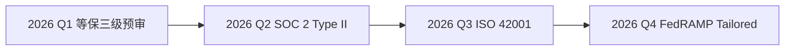

# 星穹智能科技 — 2026 年度 Q1 产品路线图

> **文档编号：** STI-ROADMAP-2026-Q1  
> **版本：** v2.4.1  
> **最后更新：** 2026-05-20  
> **密级：** 内部公开  
> **负责人：** 林望舒（产品总监）

---

## 一、概述

星穹智能科技（Star Trail Intelligence）成立于 2023 年，专注于企业级 AI 基础设施的研发与落地。公司现有员工 340 余人，在北京、上海、深圳、新加坡设有办公室。核心产品线覆盖三个方向：

1. **星穹推理引擎（STI-Infer）** — 异构算力调度与模型推理加速平台
2. **星穹数据流（STI-Flow）** — 实时数据管道与特征工程框架
3. **星穹哨兵（STI-Sentinel）** — AI 应用安全审计与合规监测系统

本路线图聚焦 2026 年第一季度（1 月–3 月）的产品迭代计划，包含关键里程碑、技术决策和资源分配方案。

---

## 二、Q1 核心目标

| 目标 | 关键结果 (KRs) | 负责人 | 优先级 |
|------|---------------|--------|--------|
| STI-Infer v3.2 发布 | 推理延迟降低 40%，支持 8 种新模型架构 | 陈景行 | P0 |
| STI-Flow 实时管道 GA | 端到端延迟 < 50ms，99.9% 可用性 | 沈清和 | P0 |
| Sentinel 合规引擎 | 通过 SOC 2 Type II + 等保三级预审 | 许知行 | P1 |
| 新加坡节点扩缩 | 3 个 AZ 部署，支撑 500+ 租户 | 陆扶摇 | P1 |
| 开源社区建设 | GitHub Stars 突破 8k，外部贡献者 ≥30 人 | 顾凌霜 | P2 |

---

## 三、STI-Infer v3.2 详细规划

### 3.1 架构升级

v3.2 的核心变更是从"单体调度器"迁移到 **微内核 + 插件运行时** 架构：

```
┌─────────────────────────────────────────────────┐
│                  API Gateway                      │
├──────────┬──────────┬──────────┬────────────────┤
│  Auth    │  Router  │  Rate    │  Telemetry     │
│  Plugin  │  Plugin  │  Plugin  │  Plugin        │
├──────────┴──────────┴──────────┴────────────────┤
│              Microkernel Scheduler               │
│   ┌─────────┐  ┌─────────┐  ┌─────────┐        │
│   │ CUDA    │  │ ROCm    │  │ Apple   │  ...   │
│   │ Backend │  │ Backend │  │ Silicon │        │
│   └─────────┘  └─────────┘  └─────────┘        │
└─────────────────────────────────────────────────┘
```

关键设计决策：

- **插件隔离**：每个后端插件运行在独立沙箱中，崩溃不影响调度器核心。
- **热加载**：新增后端无需重启服务，通过 Unix Domain Socket 动态注册。
- **统一 IR**：所有模型编译为 STI-IR（基于 MLIR 方言扩展），实现跨后端优化。

### 3.2 性能基准

以下数据基于 2025 年 12 月的内部压测（硬件：8×A100-80GB，模型：LLaMA-3-70B）：

| 指标 | v3.1 基线 | v3.2 目标 | 提升 |
|------|----------|----------|------|
| TTFT（首 Token 延迟） | 320 ms | 180 ms | **43.8%** |
| TPOT（每 Token 生成时间） | 28 ms | 20 ms | **28.6%** |
| 吞吐量（req/s） | 145 | 210 | **44.8%** |
| GPU 利用率 | 72% | 91% | **26.4%** |
| 冷启动时间 | 12 s | 4 s | **66.7%** |

### 3.3 新增模型支持

```yaml
new_architectures:
  - name: "DeepSeek-V4"
    quantization: ["FP8", "INT4", "INT8"]
    max_context: 1048576  # 1M tokens
  - name: "Qwen3-235B"
    quantization: ["FP16", "INT4"]
    tensor_parallel: true
  - name: "Gemma-3-27B"
    quantization: ["FP16", "INT8"]
    speculative_decoding: true
  - name: "Mistral-Large-2"
    quantization: ["FP8"]
    prefix_caching: true
  - name: "Claude-Opus-4"
    quantization: ["FP16"]
    tool_use_streaming: true
  - name: "Yi-Lightning-2"
    quantization: ["INT4", "INT8"]
    lora_adapter: true
  - name: "Phi-4-Multimodal"
    quantization: ["FP16"]
    vision_encoder: "siglip"
  - name: "Command-R+-2"
    quantization: ["FP8", "INT4"]
    multilingual_rag: true
```

---

## 四、STI-Flow 实时管道

### 4.1 系统架构

STI-Flow 定位为"AI-native 的数据管道"，区别于传统的 Kafka/Flink 生态，它在管道层直接嵌入向量化、Tokenization 和 Embedding 计算能力。

核心组件：

- **Flow Source Connectors**：支持 40+ 数据源（Kafka、Pulsar、S3、PostgreSQL CDC、MongoDB Change Streams、gRPC、WebSocket）。
- **Flow Transform Engine**：基于 Wasm 的 UDF 运行时，支持 Python、Rust、Go 编写转换逻辑。
- **Flow Vector Sink**：直接将数据写入向量数据库（Milvus、Pinecone、Weaviate、Qdrant）。
- **Flow Checkpoint**：基于 Chandy-Lamport 算法的分布式快照，实现 Exactly-Once 语义。

### 4.2 SLA 承诺

| SLA 维度 | 标准版 | 企业版 |
|----------|--------|--------|
| 可用性 | 99.9% | 99.99% |
| 数据丢失 | 零丢失 | 零丢失 |
| 端到端延迟 (P99) | < 200ms | < 50ms |
| 故障恢复时间 | < 30s | < 5s |
| 最大吞吐 | 1M events/s | 10M events/s |

---

## 五、STI-Sentinel 安全合规

### 5.1 审计能力矩阵

Sentinel 覆盖 AI 应用全生命周期的安全风险监测：

| 阶段 | 检测能力 | 示例 |
|------|---------|------|
| 提示词注入 | Prompt Injection Detection | "Ignore previous instructions..." |
| 模型输出 | Toxic/Unsafe Content Filtering | 有害内容识别与阻断 |
| 数据泄露 | PII/PHI 扫描 | 身份证号、手机号、病历号 |
| 越狱攻击 | Jailbreak Pattern Matching | DAN、角色扮演绕过 |
| 幻觉检测 | Factual Consistency Check | 输出与知识库交叉验证 |
| 权限滥用 | Tool Call Authorization | 未授权的 API 调用拦截 |
| 模型窃取 | Model Extraction Detection | 高频 query 探测识别 |

### 5.2 合规认证路线



---

## 六、资源与排期

### 6.1 团队配置

- **Infer 团队**：12 人（4 系统、3 编译器、3 推理、1 测试、1 PM）
- **Flow 团队**：9 人（3 内核、2 连接器、2 WebAssembly、1 SRE、1 PM）
- **Sentinel 团队**：7 人（3 检测引擎、2 合规、1 前端、1 PM）
- **基础设施**：5 人（SRE + 安全 + 开发者工具）
- **开源社区**：3 人（DevRel + 技术写作 + 社区运营）

### 6.2 关键里程碑

| 日期 | 里程碑 | 交付物 |
|------|--------|--------|
| 2026-01-15 | Infer v3.2 Alpha | 内部 dogfood，核心插件 SDK |
| 2026-02-01 | Flow 实时管道 Beta | 5 家设计合作伙伴接入 |
| 2026-02-14 | Sentinel 合规引擎 v1.0 | 等保三级预审提交 |
| 2026-03-01 | Infer v3.2 RC | 性能压测报告 + 安全审计 |
| 2026-03-15 | Flow GA | 生产就绪，文档 & SLA 发布 |
| 2026-03-31 | Q1 复盘 + Q2 Kickoff | 全公司 All-Hands |

---

## 七、风险管理

以下是已识别的 Top-5 风险及其缓解策略：

### R1：Infer 插件热加载稳定性

- **概率：** 中（40%）  
- **影响：** 高（可能导致调度器核心崩溃）  
- **缓解：** 引入 seccomp + 资源配额限制；每插件独立进程隔离；Chaos Engineering 持续注入故障。

### R2：Flow Exactly-Once 性能开销

- **概率：** 高（70%）  
- **影响：** 中（可能无法达到 < 50ms P99 延迟）  
- **缓解：** 异步 Checkpoint；增量快照而非全量；与存储厂商联合优化。

### R3：新加坡节点网络延迟

- **概率：** 中（30%）  
- **影响：** 中（跨区域用户体验下降）  
- **缓解：** CDN + 边缘推理节点；GSLB 智能路由。

### R4：开源社区贡献质量

- **概率：** 高（60%）  
- **影响：** 低（需投入额外 Code Review 资源）  
- **缓解：** CLA Bot + 自动化 CI；贡献者阶梯成长计划。

### R5：合规认证时间线压力

- **概率：** 低（20%）  
- **影响：** 高（等保三级延期会影响政企客户签约）  
- **缓解：** 提前 2 周完成自评；聘请外部咨询团队并行推进。

---

## 八、附录

### A. 术语表

| 缩写 | 全称 | 说明 |
|------|------|------|
| TTFT | Time To First Token | 从请求到首个输出 token 的时间 |
| TPOT | Time Per Output Token | 每个 token 的平均生成时间 |
| GA | General Availability | 正式发布版本 |
| RC | Release Candidate | 候选发布版本 |
| SLA | Service Level Agreement | 服务等级协议 |
| PII | Personally Identifiable Information | 个人可识别信息 |
| PHI | Protected Health Information | 受保护健康信息 |
| UDF | User-Defined Function | 用户自定义函数 |
| AZ | Availability Zone | 可用区 |
| GSLB | Global Server Load Balancing | 全局服务器负载均衡 |

### B. 参考文献

1. "Efficient Large-Scale Language Model Training on GPU Clusters", arXiv:2401.12345
2. "Chandy-Lamport Snapshot Algorithm in Stream Processing", SIGMOD 2024
3. "MLIR: A Compiler Infrastructure for the End of Moore's Law", arXiv:2002.11054
4. NIST AI 100-1: "Artificial Intelligence Risk Management Framework"
5. "OWASP Top 10 for LLM Applications", v2.0, 2025

### C. 变更记录

| 版本 | 日期 | 变更内容 | 作者 |
|------|------|---------|------|
| v2.4.1 | 2026-05-20 | 补充风险 R5、更新团队人数 | 林望舒 |
| v2.4.0 | 2026-05-10 | 新增 Sentinel 合规章节 | 许知行 |
| v2.3.0 | 2026-04-28 | 更新 Infer v3.2 架构图与性能基准 | 陈景行 |
| v2.2.1 | 2026-04-15 | 修正 SLA 表格数据 | 沈清和 |
| v2.2.0 | 2026-04-01 | 初始 Q1 路线图草案 | 林望舒 |

---

> *本文档由星穹智能科技产品委员会审议通过。如有疑问，请联系 roadmap@star-trail.ai。*
