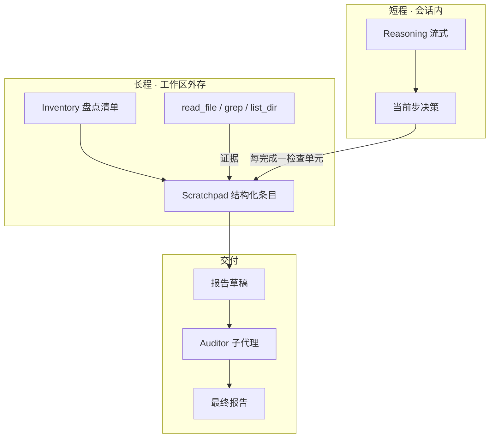

# 审计工作记忆（Audit Scratchpad）方案草稿

> **状态：** Phase A ✅ · **Phase B ✅** · **Phase C0–C3 ✅**（见 [audit-scratchpad-test.md](audit-scratchpad-test.md)）；**C4** 远期（§6.12.9）· **Phase D1/D2** ✅ · **U2/U3** ⬜（§6.13，试跑 [§L8](audit-scratchpad-test.md#l8--phase-d-审计过程可视化规划)）  
> **范围：** DS Pick / TUI 共用 runtime；面向**长程、全库级代码审查**与同类「多步探索 → 最终报告」任务。  
> **相关：** [HARNESS.md](HARNESS.md)（Harness 定位、JD 映射、与 DeepSeek 关系备忘）、[agent-reliability-craft-plan.md](../agent-reliability-craft-plan.md)、[auditor-subagent-design.md](auditor-subagent-design.md)、`crates/tui/src/tools/subagent/blackboard.rs`、`crates/tui/src/prompts/base.md` § Full-repository code review mode。

---

## 1. 问题陈述

### 1.1 现象

用户发起**整仓代码级审核**时，模型会经历很长的「逐步思考 + 大量只读工具」阶段。到中途或收尾时，常出现：

- 早期已确认的模块/检查项在最终报告中**遗漏**或**降级为笼统描述**；
- 后半程**提前收口**（「差不多了」），深度不足；
- 个别发现建立在**类比**而非调用方追溯（见 [auditor-subagent-design.md §1](auditor-subagent-design.md) M4 案例）。

### 1.2 根因（工程视角）

| 误解 | 事实 |
|------|------|
| 「思考流式输出 = 工作记忆可靠」 | Reasoning 在 UI/会话中**有记录**，但在同回合内会被 tool 输出挤占注意力；跨回合可能被 compaction **摘要** |
| 「上下文够长就能审完全库」 | 长窗口缓解「装不下」，不保证「会精读、会坚持 checklist」 |
| 「最后读一遍 thinking 即可汇总」 | Thinking 体积大、非结构化、难验收；不适合作报告唯一依据 |

**结论：** 需要与 reasoning **解耦**的、**结构化、可检索、可机械核对**的外存——下称 **审计工作记忆（Audit Scratchpad）**。

### 1.3 非目标

- 不替代 Auditor 子代理的机械事实核查（scratchpad 记「候选事实」，Auditor 仍核对行号/符号）。
- 不把整段 reasoning 自动 dump 进外存（噪音大、不可验收）。
- 不承诺一次实现即覆盖 Office 文档类任务（首版聚焦 **Code / 全库审查**）。

---

## 2. 设计原则

**产品本质（讨论锚点，2026-05-20）：** 制定一套**可执行、可验收**的规则，提供与之匹配的**工具**（挡位与仪表），让模型这一**超强大脑**通过教材（`base.md` 等）、实操与路考（scratchpad、门禁、未来 optional 教学）**学会按规则做事**——而不是假设「聪明即可无师自通」。规则单独存在不够；工具单独存在也不够；三者加**学习与违约可见**才构成 DS Pick 对人的价值。对外部表述见 **Model + Harness = Agent**：[HARNESS.md §1–§2](HARNESS.md#1-外部信号他们在招什么)。

**Agent 设计哲学依据（维护者）：** **实事求是，实践出真知。**

| 原则 | 在本仓库中的落点 |
|------|------------------|
| **实事求是** | 结论锚在工具输出与磁盘状态（`file`+`line`、`read_file`/`grep`、scratchpad `verified`），不靠推理流或子代理摘要自证；L7b 反例：报告写 0 HIGH 而 `task_read` 有 HIGH |
| **实践出真知** | 规则须**实操与验收**（试跑 §L7、C1 门禁、未来 onboarding）；`base.md` 是教材，**会用**靠 join、`set_area`、横条反馈；见 §2.1 契约、§2.3 规则与学习 |

用户要的是**可信交付**，不是精彩的叙事；哲学表述与 §2.1–§2.5（契约、教材分工、教学构想）同一主线，不另起炉灶。

1. **事实与推理分离** — Scratchpad 只存「可核对条目」；reasoning 仅服务当前步决策。  
2. **增量写入、分段收口** — 每完成一个 inventory **检查单元**（见 §4.2 粒度）必须落盘；允许该单元内**批量只读**，在「检查完成」时一次性写入，禁止「全仓读完再记」。  
3. **证据锚定** — 每条须含 `file` + `line`（或 `line_range`）+ `evidence`（工具结论摘要，非臆测）。  
4. **覆盖率可观测** — 盘点清单 vs 已审模块可 diff；未审项不得静默消失。  
5. **与 CRAFT 黑板互补** — 子代理交接用现有 `blackboard.json`；主代理长回合内用 scratchpad 文件或扩展分区。  
6. **默认可关** — 小范围 PR/单文件审查不强制；全库模式默认开启。

### 2.1 人机契约（「契约」现象）

> **维护者备忘（2026-05-20）：** 来自产品试跑后的反思——模型像**大脑**，DS Pick 像**车/工具软件**；用得顺手之前，需要**学习规则 + 反复实操**；三者（用户、产品、模型）之间的对齐，可归纳为 **契约**，而非单靠「更聪明」。

#### 比喻

| 角色 | 比拟 | 在本方案里 |
|------|------|------------|
| 模型 | 驾驶员的大脑 | 推理、规划、自然语言叙事 |
| DS Pick / runtime | 车辆与交规 | 工具语义、引擎等待/门禁、scratchpad 文件 |
| 用户 | 乘客 / 车主 | 目标（「全库审完」「出报告」）、验收标准 |

大脑可以在对话里**叙述**「我会并行派 14 个子代理审完」；只有车上有**真实挡位**（`task_create` vs `agent_spawn`）、**仪表盘**（`inventory` / 横条）、**路检**（C1、`verified`）时，叙事才与行驶一致。说明书若只写「踩油门」而不写手动挡/自动挡，驾驶员就会踩错踏板——车仍会动，但未必到达约定目的地。

#### 操作性定义

**契约** = **用户目标**、**产品可执行语义**、**模型口头叙事** 三者的**可对齐、可验收、可违约发现**的约定。

- **对齐** — 显式 skill / `base.md` / 工具 `description`（见 §7.1；L7b 前描述不足曾导致混用 Task 与 Sub-agent）。  
- **实操** — 试跑记录（[audit-scratchpad-test.md](audit-scratchpad-test.md)）、续审、回归 R*；模型不会「开箱即会」scratchpad 纪律。  
- **违约可观测** — 横条 0/34、notes 全 `open`、报告 0 HIGH 而 `task_read` 有 HIGH；契约破裂应**在 UI/引擎暴露**，而非仅事后读 transcript。

契约**不是**一份 PDF 用户协议，而是**运行时能检验的行为合同**：例如 P2 只认 `verified`、P1 结束须 `set_area`、并行审区用 `agent_spawn` 而非 `task_create`（§14）。

#### 学车阶段（与产品能力映射）

| 阶段 | 驾驶员 | DS Pick / 审计 scratchpad |
|------|--------|---------------------------|
| 交规与车型 | 学挡位、仪表含义 | §7.1 Task vs Sub-agent；`audit-repo`；工具 schema |
| 教练带练 | 副驾纠错 | Checklist、琥珀横条、`scratchpad_*` 提醒（B4） |
| 考场 | 独立通过检测 | C1 覆盖率、`require_min_notes`、Auditor（C2） |
| 独自上路 | 仍可能违章 | 模型可 `write_file` 抢跑报告（§14 C）；需引擎硬门（§14.3 E1–E2） |

「契约现象」指：**熟练来自契约被反复履行与违反被看见**；不能假设模型读过一次 skill 就永远遵守。

#### 与 L7b 的对应（契约破裂案例）

| 契约方 | L7b 中的表述 / 期望 |
|--------|---------------------|
| 用户 | 全库审核、可信 MD 报告 |
| 产品 | 34 area 交代、`verified`、Sub-agent join 或 Task `task_read` |
| 模型叙事 | 「14 子代理」「0 HIGH」「审计完成」 |

实际：14×**Task**（非 Sub-agent）、34×`pending`、未 `task_read` — **三套叙事未签在同一份合同上**。修复路径是**收紧产品语义（工具描述 + 硬门）+ 试跑验收**，而非仅要求模型「更诚实」。详见 [§14](audit-scratchpad-design.md#14-全仓审计失败模式task-与-sub-agent-混用--未-joinl7b2026-05-20)、[试跑 §L7b](audit-scratchpad-test.md#l7b--全仓试跑-2026-05-20-full-audit2026-05-20)。

#### 设计启示（非代码清单）

1. **产品责任** — 易混概念（Task / Sub-agent、`task_id` 命名）须在**模型必读面**写清；违约尽量**机械发现**。  
2. **用户责任** — 长程审计应用 Code + Agent + scratchpad skill；验收看 **inventory / verified / 横条**，不只看终稿 MD。  
3. **模型局限** — 叙事流畅 ≠ 履约；应用外存与 join 工具**证明**覆盖，而非自述「已完成」。

### 2.2 `base.md` 是「第一本教材」——「写全」指什么

> **状态：** 设计共识（与 §2.1 契约一致）。**不**改变 scratchpad Phase A–C 的已交付范围。

Code 会话进入 DS Pick 后，对产品的**叙述性认知**主要来自系统 prompt 栈；其中 **`prompts/base.md` 是核心一层**（另有 mode / approval / `tasks/code.md`、项目 `AGENTS.md`、`pick-rules`、skills 目录摘要等，见 [prompt-architecture.md](../prompt-architecture.md)）。

若用户问「你具备哪些能力」，模型通常依据 **`base.md` 的 Toolbox、When NOT to use、Task vs Sub-agent** 等回答；但 **`base.md` 写明：tool descriptions are authoritative**——实际能调用什么，以当前 turn 的 **API `tools[]` schema** 为准（含 defer + `tool_search`）。

**「把 base.md 写全」——赞成的方向：**

| 应写进 `base.md` | 不应堆进 `base.md` |
|------------------|-------------------|
| 契约表、易混概念（Task / Sub-agent、`task_id` 命名） | 整份 design doc / 试跑全文 |
| 路由索引（「全仓审计 → `load_skill audit-repo`」） | 与工具 schema 逐字重复的参数说明 |
| 禁止项与 join 义务（派活后必须 `task_read` / `agent_result`） | 单次任务的长流程步骤（放 skill） |

**原因：** 体积与 KV 前缀稳定性；两处不一致时模型更乱；维护成本。分工：**`base.md` = 交规总纲 + 索引；工具 `description` = 挡位与仪表；skill = 专项教练册；引擎 = 违章拍照（横条、C1 BLOCK）。**

### 2.3 规则与学习（法律类比）

> **状态：** 产品哲学备忘（2026-05-20 讨论）。用于约束发散方向，**非**新功能承诺。

**说法成立：** 规则像**法律**——制定出来不会自动被遵守；主体需要**学习 + 实操 + 考核**，才知道如何运用。仅有 `base.md` / pick-rules 而无学习路径，相当于「法条公示」但从未驾校练习，上路仍可能违章（L7b：法条写了 `verified`，实际交卷是 `open` + 抢跑 `deliverables`）。

| 法律体系要素 | DS Pick 对应 |
|--------------|--------------|
| 法条公示 | `base.md`、`pick-rules`、工具 schema、skill |
| 驾校 / 科目一 | 未来 **教学模块**（§2.4）；当前为试跑 + 文档 |
| 路考 / 执法 | scratchpad 横条、C1、`require_min_notes`、Auditor |
| 违法记录 | `notes.jsonl` / inventory 与报告不一致、试跑 §L7b |

**契约（§2.1）** 强调三方对齐；**本节** 强调：对齐需要**习得**，不是单次读 prompt。

### 2.4 教学功能（构想 · 发散记录）

> **状态：构想 / 发散记录 — 尚未立项。** 实现前须单独评审；**不得**与 Phase A–C 已交付 scratchpad 混为同一里程碑。  
> **目的：** 记录「先教学、通过再工作」的思路，避免讨论遗失；也避免思考过度时把主线带偏。

#### 动机

- 模型首次使用 DS Pick 时，不应假设已理解 Task / Sub-agent、scratchpad join 等契约。  
- 与用户设想一致：**发证**后再「日常上路」；未通过则短 L0 提醒 + 限制高危动作（如写 audit 报告）。

#### 四个待决问题（记录现状）

| # | 问题 | 当前倾向（非定案） |
|---|------|-------------------|
| 1 | **教什么** | 按**可机械验收**的课切分，不教「模型有多强」；例：Task vs Sub-agent 各练一次；scratchpad 两 area 过关 |
| 2 | **存什么** | 存 **资格**（`passed_modules` + `syllabus_version`），**不**把模型自拟「学习笔记」注入 prompt |
| 3 | **如何注入** | 未通过模块 → system **短 L0 条**；已通过 → 不再塞长文；可与 `load_skill` 联动拦截 |
| 4 | **如何判断** | **runtime 裁判**（工具序列 + 磁盘状态），禁止「自述学会了」；未过 → 重考（限次） |

#### 存储草案（若做）

| 位置 | 内容 |
|------|------|
| `~/.deepseek/onboarding.json`（用户级） | `{ "syllabus_version": 1, "passed": ["task-vs-agent", "scratchpad-p1"] }` |
| `.deepseek/pick-onboarding.json`（工作区级，可选） | 仓库专项必修（如必须先过 audit 课） |

教材升级时提高 `syllabus_version`，可要求**重考**受影响模块。

#### 与 scratchpad / 契约的关系

- 教学课可复用 scratchpad **小 inventory** 作考场，但 onboarding 与 audit run **分目录 / 分 run_id**，避免污染真实审查。  
- 哲学上与 §2.1 学车表一致：教学 = **科目一/场内**；scratchpad 横条 + C1 = **路考与摄像头**。

### 2.5 路线：短期 / 中期 / 长期

> **短期（已采纳，与当前仓库工作对齐）** — 下列项为**近期真实目标**；教学功能**不在**短期内。

| 阶段 | 范围 | 状态 |
|------|------|------|
| **短期** | 加厚 `base.md` **契约与路由**（非全文搬运 design）；工具 `description` 区分 Task / Sub-agent；`audit-repo` skill P1 parallel；§14 **E1**（`inject_on_report_keywords` 扩展）、**E2**（`write_file`→`deliverables/*audit*` 硬门，`scratchpad_flow`）；**L7 复测**（需重编 sidecar） | **E1/E2 ✅ 代码已落地**；L7 待复测 |
| **中期** | `onboarding` skill + `onboarding.json` + 2–3 节机械考试（Task/Sub-agent、scratchpad）；未通过 L0 注入 | 构想，见 §2.4 |
| **长期** | DS Pick UI「驾校」：进度、重考、与琥珀横条同级的「未发证」提示 | 构想 |

**防跑偏：** 讨论教学、法律类比、base 写全时，**默认不推迟** scratchpad 短期项（§14.3、试跑闭环）。新功能单独开里程碑。

### 2.6 多学科视角（备忘 · 为何「能打的 Agent」不单是写代码）

> **状态：** 维护者讨论备忘（2026-05-20）。**非**招聘说明、**非**功能范围。**不**改变 Phase A–C 交付边界。  
> **目的：** 记录「真正能打」的 Agent 需要**系统化规划**，往往涉及多类学科问题；本仓库由小团队/个人推进时，用**文档 + 机械门禁 + 试跑**压缩这些角色，而非假设一人等于全栈。

#### 核心判断

开发一个**真正能打的 Agent** 不简单：除软件实现外，还需要对**规则如何被理解、如何被违反、如何被学习、如何被验收**做系统设计。模型能力是**必要条件**，不是**充分条件**——与 §2 产品本质、**实事求是 / 实践出真知** 一致。

#### 学科视角 → 本仓库中的落点（映射表）

| 视角（隐喻角色） | 典型问题 | DS Pick / scratchpad 中的对应（示例） |
|------------------|----------|----------------------------------------|
| **工程** | 组件边界、可靠性、可测试 | `task_*` vs `agent_*`、scratchpad store、C1/E2 硬门、sidecar |
| **法学 / 规制** | 规则是什么、违规则何 | `verified`-only 报告、`inventory` 交代、E2 拒写 deliverables |
| **教育学** | 如何学会规则 | `base.md`、skill、`audit-repo`；未来 onboarding（§2.4） |
| **认识论 / 哲学** | 何谓事实、何谓证据 | 实事求是；禁止叙事交卷；Auditor 机械核对 |
| **社会学 / 组织** | 谁指挥谁、平级还是上下级 | Task（peer 工单）vs Sub-agent（派出）；join 义务 |
| **产品设计** | 人如何看见进度与违约 | 琥珀横条、Checklist、子代理/Task 分栏（远期） |
| **经济学 / 运营** | 成本、上下文、按需能力 | prompt 分层、defer 工具、`tool_search`；见 [prompt-architecture.md](../prompt-architecture.md) |
| **安全** | 密钥、路径、沙箱 | 既有 sandbox / keyring 路线（DidClaw 附录 D 等**姊妹项目**） |

表内项**不要求**配备对应学科的专职人员；要求的是：做决策时**有意识**地问到这一类问题，并在产品里留下**可执行的答案**（工具、文件、门禁），而不是只写 prompt 祈祷模型遵守。

#### 与姊妹方向（DidClaw / OpenClaw）的关系

- **DidClaw 数据层重构**（sessions SQLite、密钥不落盘等）：同一哲学下的**地基手术**——数据流不干净，上层 Agent 优化会处处掣肘。  
- **本仓库 scratchpad / §14**：同一哲学下的**行为契约与可观测违约**——不必等对方附录 D 全闭环，短期项可并行（§2.5），但**全仓可信度**在两边都收口后最好。  
- 文档分工：数据架构审计留在 DidClaw 侧；**人机契约、审计外存、L7b 教训**留在本 design doc。

#### 小团队如何「多学科」而不发散

| 做法 | 说明 |
|------|------|
| **文档当立法与备忘** | 本 §2、试跑 [audit-scratchpad-test.md](audit-scratchpad-test.md)；哲学与多学科仅 **备忘**，新功能单独里程碑 |
| **机械门禁当执法** | C1、E2、`require_min_notes`、横条——减少依赖模型自述 |
| **双 grounding 协作** | 长程方案/API 辅助（DeepSeek）+ **真实仓库**复审（IDE/Composer）；生成 ≠ 验收 |
| **试跑当路考** | L7、R* 回归；失败写入 §14，不粉饰为「已完成」 |

#### 非目标（避免思考过度带偏）

- **不**在本里程碑引入完整「驾校平台」或组织咨询流程（见 §2.4 中期）。  
- **不**用本节论证「必须招聘哲学家/社会学家」——而是论证：**问题空间是多学科的，产品可以用工程化手段吸收其中一部分**。  
- **不**把本节当作对外营销话术；对外仍以可验证行为（scratchpad、报告质量）为准。

---

## 3. 概念模型



| 产物 | 路径（建议） | 用途 |
|------|----------------|------|
| **Inventory** | `.deepseek/scratchpad/{run_id}/inventory.json` | 模块/目录 checklist（机器可读 JSON） |
| **Scratchpad** | `.deepseek/scratchpad/{run_id}/notes.jsonl` | 一行一条 JSON；追加写、易 diff |
| **CRAFT Blackboard** | `.deepseek/blackboards/{task_id}.json` | 子代理角色分区（已有）；全库 CRAFT 链路用 `task_id` 对齐 |
| **Report draft** | 用户指定或 thread workspace | 最终 Markdown 报告 |

### 3.1 Scratchpad 目录 ID（`run_id`）

Phase A **不能假设**模型总能拿到 HTTP `thread_id`（纯 TUI session 常见缺口）。目录名统一叫 **`run_id`**，按优先级解析：

| 优先级 | 来源 | 示例 |
|--------|------|------|
| 1 | 运行时注入 / 用户消息中的 `thread_id` | `thread_abc123` |
| 2 | 父代理已知 `task_id`（CRAFT） | `task_fix_auth`（与 blackboard 同名，scratchpad 仍可并列） |
| 3 | **Phase A 兜底** | UTC `YYYY-MM-DD-HHmmss`（如 `2026-05-19-143052`） |

**Phase B：** `scratchpad_append` / `scratchpad_status` 由 runtime 写入正确路径，模型不再自行拼目录名。

`thread_id` 与 `task_id` 关系：

- **仅主代理 solo 审查：** 一个 `run_id` 目录即可。  
- **主代理 + explore/review/auditor：** spawn 时传同一 `task_id`；explorer 结论进 blackboard，主代理 scratchpad 记汇总与缺口（避免子代理双写 scratchpad，见 §10）。

---

## 4. Scratchpad 数据格式（草案）

### 4.1 JSONL 单行 schema（`notes.jsonl`）

```json
{
  "id": "note-042",
  "ts": "2026-05-19T12:00:00Z",
  "area_id": "area-tui-engine",
  "area": "crates/tui/src/core/engine",
  "kind": "finding | todo | cleared | meta",
  "severity": "BLOCKER | HIGH | MEDIUM | LOW | null",
  "title": "short label",
  "file": "crates/tui/src/core/engine/dispatch.rs",
  "line": 120,
  "line_end": 145,
  "claim": "One sentence, falsifiable",
  "evidence": "grep/read summary; symbol names seen on those lines",
  "status": "open | verified | deferred",
  "source": "main | explore | review",
  "supersedes": "note-012"
}
```

- **`area_id`（必填）：** 与 `inventory.json` 中 `areas[].id` 一致；`area` 路径为可读副本，避免拼写漂移导致失联。  
- **`supersedes`（Phase A）：** 升级 severity 或修正 claim 时**只追加一行**新 finding，填 `supersedes: "<old-id>"`。**禁止**重写 JSONL 已有行、禁止再追加一行去改旧条目的 `status`。被指向的旧 `id` **视为已取代**（读时：若某 `id` 被他人 `supersedes`，则不再进入报告）。  
- **`supersedes`（Phase B）：** `scratchpad_append` 可在索引侧标记旧 id 为 `superseded`，对外仍 append-only。  
- **传递闭包：** 若 A→B、B→C（各行 `supersedes` 指向），则 A、B、C 中**被取代的 id**均不参与 P2（实现时对 `supersedes` 图做传递闭包，而非仅查直接边）。  
- **`updates[]`（Phase B，可选）：** runtime 维护修正历史，避免模型手改多行。

**硬规则（prompt + 可选 runtime 校验）：**

- `kind=finding` 且 `severity` 为 HIGH/BLOCKER 时，`file` + `line` 必填；**强烈建议**同时填 `line_end`（Auditor 核对多行上下文）。  
- `status=verified` 仅当本轮或上一轮有对应 `read_file`/`grep_files` 工具成功。  
- 禁止 `claim` 中出现未在 evidence 出现的 API/路径（Auditor 可机械抓）。  
- **P2 报告**仅允许引用 `kind=finding` 且 `status=verified`、且未被 `supersedes` 取代的条目（见 §4.5）。

### 4.2 Inventory（`inventory.json`）

采用 **JSON**（非 Markdown 表格），便于模型读写完成率、Phase B 程序化门禁。

```json
{
  "run_id": "2026-05-19-143052",
  "created_at": "2026-05-19T14:30:52Z",
  "areas": [
    {
      "id": "area-desktop-web-ui",
      "path": "crates/desktop/web-ui",
      "status": "pending",
      "notes": ""
    },
    {
      "id": "area-tui-engine",
      "path": "crates/tui/src/core/engine",
      "status": "in_progress",
      "notes": "3 findings in notes.jsonl"
    },
    {
      "id": "area-tui-tools",
      "path": "crates/tui/src/tools",
      "status": "done",
      "notes": "cleared"
    }
  ]
}
```

**`areas[].id`：** 稳定 slug（如 `area-tui-engine`），P0 生成后**不得改**；`notes.jsonl` 用 `area_id` 关联，不用路径字符串做主键。

**`areas[].notes`（可选字符串）：** 仅**人类可读备注**（如 `"3 findings in notes.jsonl"`），**不参与**程序逻辑。计数、完成率、续审指针一律来自 `notes.jsonl` 与 `scratchpad_status`；Phase B 实现**不得**解析或依赖该字段做门禁。模型勿将其当作计数器手改。

**`status` 枚举：** `pending` | `in_progress` | `done` | `deferred`（`deferred` 须在 `notes` 或 scratchpad `kind=meta` 写明原因）。

**粒度规则（Phase A prompt 强制）：**

- 每行 `areas[].path` = **一次「检查完成」可收口**的独立模块或目录。  
- **建议粒度：** crate 下**一级子目录**（如 `crates/tui/src/core/engine`），不要整仓一行，也不要细到每个 `.rs` 一行。  
- **启发式上限：** 单行 `path` 覆盖的源文件数建议 **≤ 20**（超出则拆行）；全仓 inventory 行数建议 **10～40**（视仓库规模调整）。  
- P0 用 `list_dir` + README 生成后，用 `kind=meta` 在 notes.jsonl 记录 `inventory_version: 1` 与总行数。

每完成一行的**检查**（非「每次 read_file」），更新该行 `status` → `done` 并 append ≥1 条 notes.jsonl。

### 4.3 读取 vs 检查（并行只读）

| 事件 | 含义 | scratchpad 义务 |
|------|------|-----------------|
| **读取完成** | 该行覆盖的文件已 batch `read_file` / `grep` | 无（允许并行读 5～10 个文件） |
| **检查完成** | 已综合证据并形成该区结论 | 必须 append ≥1 条 + 更新 `inventory.json` 该行 |

禁止要求「每 read_file 后写一条」；禁止「多区读完只写一条」。

### 4.4 断点续审（Phase A 即可用）

P0 进入时：若 `.deepseek/scratchpad/{run_id}/` 已存在且 `inventory.json` 非空：

1. **`read_file` `inventory.json`**，取第一个 `status` 为 `pending` / `in_progress` 的 `areas[].id`（续审指针）。**不**重建 inventory（除非用户要求重审）。  
2. **按 `area_id` 读 notes**（不要用「文件尾部 N 行」——尾部可能是已 `done` 的上一区，会错位）：  
   - Phase A：`grep_files` / `read_file` 过滤 `notes.jsonl` 中含该 `"area_id":"<id>"` 的行；或全文较短时读全文件再在上下文中筛选。  
   - Phase B：`scratchpad_status` 返回该 `area_id` 最近 K 条 + 全局 open finding 计数。  
3. `kind=meta` 记录 `resumed_at`、`resume_area_id`。

sidecar / 进程重启后，外存仍在 workspace；续审上下文 = **inventory 指针 + 当前区 notes**，而非全局 tail。

### 4.5 `notes.jsonl` 双用途与 P2 过滤

同一文件兼：**工作笔记**（`kind=todo`、`status=open`）与 **报告证据源**（`kind=finding`、`status=verified`）。

| 阶段 | 约定 |
|------|------|
| **P1** | 可写 `todo` / `open`；检查完成时把结论升为 `finding` + `verified`（或新 append 一条 verified，旧 todo 可留作历史） |
| **P2 前（Phase A）** | 显式规则：写报告前**只**采用 `kind=finding` ∧ `status=verified` ∧ 未被任何行 `supersedes` 的 id；`todo`/`open` 不得进入报告正文 |
| **P2 前（Phase B 可选）** | 拆 `findings.jsonl`（仅 verified finding）由 `scratchpad_append` 晋级写入，降低信噪比 |

---

## 5. 工作流（三阶段）

与 `base.md` § Full-repository code review mode 对齐，**显式阶段**而非一步到底。

| 阶段 | 名称 | 输入 | 输出 | 退出条件 |
|------|------|------|------|----------|
| **P0** | Inventory | `list_dir`、README；或 **续审** 读已有 `inventory.json` | `inventory.json` + `meta: plan` | 所有 area 已列出且粒度符合 §4.2；或续审指针已确定 |
| **P1** | Examine | 按 inventory 顺序只读（可并行读） | 每 **检查完成** 一行：append notes + 更新 `inventory.json` | 所有 area 为 `done` 或 `deferred` |
| **P2** | Synthesize | `inventory.json` + **仅 verified findings**（§4.5） | 报告草稿 | 草稿 HIGH+ 均有 scratchpad id 且 `verified` |
| **P3** | Verify | 草稿 + scratchpad | `agent_spawn(type=auditor)`（已有规则） | PASS 或按重试策略降级 |

**与现有 prompt 的关系：** P2–P3 已部分存在于 `base.md`（Evidence audit、Auditor mandatory）；本方案补的是 **P0–P1 的外存纪律**。

---

## 6. 实现路线（分三期）

### Phase A — 仅 Prompt / Skill（✅ 已落地）

**改动面（已完成）：**

- `.deepseek/pick-rules.md` §7  
- `crates/tui/src/prompts/base.md` § Full-repository code review mode  
- `crates/tui/assets/skills/audit-repo/SKILL.md`（bundled via `install_system_skills` v2）

**规则要点：**

1. 解析 `run_id`（§3.1）：`thread_id` → `task_id` → UTC `YYYY-MM-DD-HHmmss`；创建 `.deepseek/scratchpad/{run_id}/`。  
2. 写入 `inventory.json`（§4.2 粒度）；若目录已存在则走 §4.4 续审。  
3. 每 **检查完成** 一个 inventory 行（§4.3），append ≥1 条 `notes.jsonl` 并更新该行 `status`。  
4. **软规则（Phase A）：** 完成当前 `in_progress` 区的检查前，尽量不要开始下一 `area`；不要「漂移到别区却长期不落盘」。**不设**跨区只读次数硬阈值（模型无法可靠计数）。  
5. 写报告前读 `inventory.json`，且仅依据 §4.5 的 verified findings（Phase B：分层注入，§6.1）。  
6. severity 升级：**只追加**带 `supersedes` 的新行（§4.1）；禁止改旧行。

**验收：** 人工跑 [回归测试 R 类全库题](../tui/回归测试.md)（若有）；对比「有/无 scratchpad 规则」报告遗漏率。

**风险：** 模型可能偷懒不写；靠用户监督 + 后续 Phase B 门禁。

---

### Phase B — 实施方案（✅ 已落地）

**依据：** [audit-scratchpad-test.md](audit-scratchpad-test.md) 多区试跑（`2026-05-19-tui-src-review`，14 area / 36 notes）。  
**目标：** 把 Phase A 的「靠 prompt 自律」升级为 **runtime 保证 schema、可见进度、P2 可扩展、长会话不丢指针**。

**明确不做（仍属 Phase B 边界外或 B 尾）：**

- 不自动把 ThinkingDelta 写入 scratchpad  
- 不把 scratchpad 与 CRAFT blackboard 合并（Phase C）  
- 不做 P2 前覆盖率硬拦（Phase C）

---

### 6.2 分层摘要策略（P2 注入）

全库 20～40 area × 每区数条 finding 时，扁平摘要易超上下文。`build_p2_summary` / `build_layered_summary` 采用分层注入：

| 层 | 内容 | 约略上限 |
|----|------|----------|
| **L0** | `inventory.json` 完成率、`in_progress` / 下一 `area_id`、open verified 计数 | ~500 字 |
| **L1** | 所有 `severity ∈ {BLOCKER,HIGH}` 且 `verified`、且未 superseded 的 finding 一行一条 | ~2000 字 |
| **L2** | 按 `area_id` 均匀采样：每区最多 2 条 MEDIUM verified | 填满剩余预算 |
| **按需** | `scratchpad_list_notes(area_id=…)` 拉完整行 | 工具调用 |

超出预算：**优先 L1 → L0 → L2**；HIGH 条目禁止拦腰截断（省略则记入 `omitted_high_ids`）。

读取 `notes.jsonl` 时须兼容 **Phase A 遗留行**（缺 `ts`/`title`/`source`）：解析设默认值，不因缺字段 panic（见 §6.3）。

---

### 6.3 实施分期与优先级

| 里程碑 | 交付 | 预估 | 依赖 |
|--------|------|------|------|
| **B1** | `scratchpad_*` 四工具 + Store 核心校验 + 注册 Code 面 | ✅ | — |
| **B2** | run_id/thread 绑定 + 并发锁 + Phase A 兼容读 | ✅ | B1 |
| **B3** | Engine：分层摘要注入 + compact handoff 指针 | ✅ | B2 |
| **B4** | Engine：只读无写入轻提醒（可配置关闭） | ✅ | B2 |
| **B5** | 桌面审查进度横条 + thread 绑定 run_id（逐 area 面板 → **Phase D** §6.13） | ✅ | B2 |
| **B6** | `audit-repo` skill / pick-rules 收紧 + 文档 | ✅ | B1 |
| **B7** | scratchpad 目录清理策略（文档 + 可选 TTL） | ✅ | B2 |

建议 **B1→B2→B3** 先合入一条 PR；**B4–B7** 可跟第二条 PR。

---

### 6.4 模块布局（Rust）

```
crates/tui/src/
  scratchpad/
    mod.rs          # ScratchpadStore, paths, parse/validate
    schema.rs       # NoteLine, Inventory, area status enums
    summary.rs      # §6.2 分层摘要 + superseded 传递闭包
  tools/
    scratchpad.rs   # scratchpad_append | status | list_notes
```

**路径规则（与 Phase A 一致）：**

- 根：`<workspace>/.deepseek/scratchpad/{run_id}/`
- 文件：`inventory.json`、`notes.jsonl`
- `run_id`：thread 元数据 `scratchpad_run_id`（HTTP thread API 扩展可选字段）→ 否则工具参数显式传入 → 否则 UTC slug

**`ScratchpadStore` 职责：**

- `canonical_run_dir(workspace, run_id)` — `canonicalize` + 禁止 `..`
- `read_inventory` / `write_inventory` — 原子写（`.tmp` + `rename`，对齐 blackboard）
- `append_note(line) -> NoteId` — 校验 schema、**校验 `area_id` 存在于 inventory**（`_global` 除外）、分配 `note-{seq}`、**互斥锁下**追加 JSONL
- `list_notes(area_id?, limit)` — 按区过滤，返回**完整 JSON 行**（非摘要）
- `build_p2_summary(max_chars) -> String` — §6.2
- `superseded_ids(notes) -> HashSet<NoteId>` — **`supersedes` 传递闭包**（A→B→C 则 A、B 均排除）
- `count_notes_for_area(area_id) -> usize` — 供 `scratchpad_set_area` 门禁

**并发：** 同一 `run_id` 下 `append_note` / `write_inventory` 使用 **进程内 `Mutex<()>`**（或 `flock` 锁 `notes.jsonl`），防止并行 tool 调用交错行。子代理 **不**写 scratchpad（§10 #3）；主代理单进程内串行化即可。

**Phase A 兼容读：** 解析 JSONL 时 `ts`/`title`/`source`/`status` 缺省 → 默认值；`kind` 缺省 → 视上下文推断或 `meta`；旧行无 `id` 的可在读时合成 `legacy-{line_no}` 仅供内部引用。

---

### 6.5 工具面（注册到主 agent Code 面）

#### `scratchpad_status`

**输入：** `{ "run_id": "optional" }`  
**输出（JSON）：**

```json
{
  "run_id": "2026-05-19-tui-src-review",
  "path": ".deepseek/scratchpad/2026-05-19-tui-src-review",
  "areas_total": 14,
  "areas_done": 14,
  "areas_deferred": 0,
  "areas_in_progress": 0,
  "areas_pending": 0,
  "resume_area_id": null,
  "notes_total": 36,
  "findings_verified": 3,
  "findings_open": 0,
  "notes_per_area": { "area-core": 8, "area-tui-display": 1 }
}
```

`resume_area_id` = 第一个 `pending` | `in_progress`。

#### `scratchpad_append`

**输入：** `{ "run_id"?, "line": { ... NoteLine fields ... } }`  
**行为：**

- 必填：`area_id`（除 `kind=meta` 且 `area_id=_global`）
- **`area_id` 存在性：** 必须出现在当前 `inventory.json` 的 `areas[].id` 中；否则 **reject**，并在错误中返回 `valid_area_ids: [...]`
- `kind=finding` + HIGH/BLOCKER → 必填 `file`、`line`；建议填 `line_end`
- `kind=finding` → 默认 `status=verified` 若未传（可要求调用方显式传）
- 自动：`id`（`note-{n}`）、`ts`（RFC3339）
- 拒绝：改写已有行；缺字段；未知 `area_id`

**输出：** `{ "id": "note-037", "path": ".../notes.jsonl" }`

#### `scratchpad_list_notes`

**输入：** `{ "run_id"?, "area_id": "area-core", "limit": 20 }`  
**输出：** JSON **array**，元素为与 `notes.jsonl` **一致的完整对象**（含 `claim`、`evidence`、`file`、`line` 等），按时间顺序取该区最近 N 条——**非**摘要字符串。对齐 §4.4 续审，模型无需再 `read_file` 拼详情。

```json
{
  "area_id": "area-core",
  "notes": [ { "id": "note-008", "kind": "finding", ... } ]
}
```

#### `scratchpad_set_area`（建议一并做）

**输入：** `{ "run_id"?, "area_id", "status": "in_progress|done|deferred", "notes": "optional human remark", "require_min_notes": 1 }`  
**行为：** 更新 `inventory.json` 对应行的 `status` 与可选 `areas[].notes`（仅备注，见 §4.2）。

**与 append 的顺序 / 原子性：**

- **Prompt（Phase A/B）：** 默认 **先 `scratchpad_append`（≥1 条）再 `scratchpad_set_area(done)`**
- **Runtime（B1）：** 当 `status` 为 `done` 且 `require_min_notes` ≥ 1（默认 **1**）时，若该区在 `notes.jsonl` 中条目数 &lt; N → **reject**，提示先 append
- `deferred`：Phase B 为软校验 + 文档；**Phase C1** 硬化为 runtime reject（须 `kind=meta` 说明原因，§6.12.4）

**Prompt 迁移：** `audit-repo` skill 改为优先调用上述工具；`write_file` 整文件写 scratchpad 降为 fallback。

---

### 6.6 Engine 集成

#### B3 — P2 分层摘要注入（§6.2，**必做**）

**触发：** 检测到 scratchpad 存在且用户消息含「写报告 / synthesize / 审查报告」或模型即将进入无工具的最终回答且 inventory 全 `done|deferred`。

**行为：** 在下一请求前注入一条 **user 侧**（或 system 附录）消息：

```text
<scratchpad_summary run_id="...">
[L0 inventory status]
[L1 all HIGH/BLOCKER/MEDIUM verified findings, one line each]
[L2 sampled MEDIUM/low per area if budget remains]
omitted_high_ids: []
</scratchpad_summary>
```

实现：`scratchpad::summary::build_layered_summary(store, config.inject_summary_max_chars)`。

多区试跑 36 行未爆窗，但全库 + 多 finding 时 **数学上必爆**；与「偷懒提醒」无关，**与 B1 同批交付**。

#### B4 — 只读无 append 提醒（**可选默认开**）

**状态机（per turn, per run_id）：**

- **每次提醒前**从磁盘 **重读** `inventory.json`，取当前 `in_progress` 的 `area_id`（若无则取第一个 `pending`）——保证文案中的 `{area_id}` 与实时状态一致
- 统计**本 step 内**只读工具成功次数（`read_file`、`grep_files`、`list_dir` 等）。**不**尝试把每次 read 归属到 area（模型可能跨区读）；计数绑定「当前 in_progress 区」，作软 nudge 而非硬证据
- 若 ≥ `remind_after_readonly_tools`（默认 **8**）且本 step 未调用 `scratchpad_append` / `scratchpad_set_area` → 注入 system 提醒，**必须含** `area_id` 与 `path`：

  > 当前审查区 **`area-core`**（`crates/tui/src/core/…`）已连续 8+ 次只读工具调用但未更新 scratchpad。请先 `scratchpad_append`（≥1 条，含 area_id），再 `scratchpad_set_area`。

**试跑结论：** 多区未观察到「不写」；默认 **enabled=true**，`config.toml` 可关。实现成本低，作为保险丝保留。

#### B3b — Compaction / handoff 指针（**B 尾，小改**）

`cycle_handoff` / capacity refresh 时，若 workspace 存在 scratchpad：

- handoff 文本强制包含：`Active audit scratchpad: .deepseek/scratchpad/{run_id}/ (resume_area_id: …)`
- **不删除** workspace 下 scratchpad 文件

---

### 6.7 桌面（DS Pick）

**B5 — 审查进度（只读）**

- 当 thread 带 `scratchpad_run_id`（或最近工具写入的 run_id）时，右栏或 Composer 上方显示：
  - 完成率：`areas_done / areas_total`
  - 当前 `resume_area_id`
  - 可选：每 area 一行（读 `inventory.json` + `notes_per_area` 计数）
- 实现：`web-ui` 通过现有 workspace 读文件 API / Tauri 读 `.deepseek/scratchpad/...`（与预览面板同路径安全）
- **不写** scratchpad（只读）

**Thread API（可选同 PR）：**

- `ThreadRecord.scratchpad_run_id?: string`
- 首次 `scratchpad_append` 时由 runtime 回写 thread（sidecar SQLite）

---

### 6.8 配置（`~/.deepseek/config.toml`）

```toml
[scratchpad]
enabled = true
max_notes_per_run = 2000
remind_after_readonly_tools = 8
remind_enabled = true
inject_summary_max_chars = 6000
inject_on_report_keywords = ["审查报告", "final report", "synthesize", "write the report"]
retention_days = 30
```

Phase C 拟新增字段见 **§6.12.7**（实现前勿依赖）。

---

### 6.9 验收标准（Phase B Done）

| # | 标准 |
|---|------|
| 1 | 多区 Prompt 复跑：`scratchpad_append` 写入行 100% 含 `id`、`area_id`；finding 含 `status` |
| 2 | 非法 `area_id` reject 且返回 `valid_area_ids` |
| 3 | `set_area(done)` 在 notes&lt;1 时 reject（默认 `require_min_notes=1`） |
| 4 | `supersedes` 链 A→B→C 时 A 不出现在 P2 摘要 |
| 5 | `scratchpad_status` 与磁盘计数一致；orphan `area_id` 数为 0 |
| 6 | 续审 + `scratchpad_list_notes` 返回完整 JSON 行 |
| 7 | 80+ 条 finding 时分层注入 ≤ 预算且含全部 HIGH |
| 8 | `cargo test`：路径逃逸、并发 append、Phase A 旧行解析 |
| 9 | 桌面进度与 status 一致 |

---

### 6.10 Scratchpad 目录清理

| 阶段 | 策略 |
|------|------|
| **Phase B 首版** | 文档说明路径 `<workspace>/.deepseek/scratchpad/`，用户可手动删旧 `run_id` 目录 |
| **B7（✅ 已落地）** | `RuntimeThreadManager::open` 时调用 `cleanup_stale_scratchpads`：删除 **mtime &gt; retention_days**（默认 30）的子目录；**不删** 任一活跃 `thread.scratchpad_run_id` 指向的 run |
| **配置** | `[scratchpad] retention_days = 30` |

---

### 6.11 Phase B 后的 Prompt 调整

- `audit-repo` SKILL：工具优先；`write_file` 仅 fallback  
- `pick-rules` §7：列出工具名  
- `base.md`：P1/P2 引用 `scratchpad_set_area` + `scratchpad_append`

---

### 6.12 Phase C — 与 CRAFT / Auditor 深集成（✅ C0–C3 已落地）

**依据：** Phase B 试跑（`2026-05-19-phase-b-smoke`，测试 1–4 ✅）；[audit-scratchpad-test.md §4](audit-scratchpad-test.md#4-未覆盖项留待-phase-c) 未覆盖项。  
**目标：** 解决 **早收口写报告**、**报告与 scratchpad 事实脱节**（含 [auditor-subagent-design.md](auditor-subagent-design.md) M4 类误报）、**长会话 compact 丢 run 指针**；可选与 CRAFT blackboard 对齐。

**Auditor 前提：** `SubAgentType::Auditor` 与 `AUDITOR_AGENT_PROMPT` **已落地**；C2 做的是 **引擎侧结构化喂数**，非新建子代理类型。

#### 6.12.1 设计原则

| # | 原则 |
|---|------|
| 1 | **单一事实源** — `inventory.json` + `notes.jsonl` 为准；blackboard / compaction 只存指针与统计，不复制全文 finding |
| 2 | **门禁分两层** — **area 完成率**（首版必做）；**file 级覆盖率**（`git ls-files` vs `areas[].path`，成本高，放 C4） |
| 3 | **`deferred` 语义** — 仅当区内有 **defer 原因**（`kind=meta`，见 §6.12.4）才计入 `accounted`；不计入 `reviewed`；P2 L0 必须列出 deferred 区及原因摘录 |
| 4 | **Auditor 双向核对** — 主输入为 scratchpad `note_id` 列表；另核查 prose 草稿中 HIGH/MEDIUM 是否均有对应 `note_id`（`UNVERIFIED_CLAIM`，§6.12.5） |
| 5 | **子代理不写 scratchpad 文件** — explore 只写 blackboard（§10 #3）；C3 为 **镜像分区**，非双写 |
| 6 | **可配置、可关** — 阈值与 `hard_block` 进 `[scratchpad]`，避免个人项目被硬拦死 |

#### 6.12.2 子阶段与排期（推荐）

```text
C0 Compaction 指针  →  C1 覆盖率门禁  →  C2 Auditor 结构化  →  C3 Blackboard 镜像  →  C4 远期
     (~0.5 PR)              (~1 PR)            (~1 PR)              (按需)           (有数据再做)
```

| 子阶段 | 能力 | 主要改动位置 | 优先级 |
|--------|------|----------------|--------|
| **C0** | Compaction **pin** 路径 + **L0-only** 一行（非全文分层摘要） | `capacity_flow.rs`、`scratchpad/summary.rs`（`build_l0_status_line`） | **高** |
| **C1** | P2 前 **覆盖率门禁**（软/硬） | `scratchpad_flow.rs`（`coverage_gate`）、`engine.rs`（报告关键词 + `maybe_summary_before_final_answer` 前） | **高** |
| **C2** | **Auditor ← scratchpad** 结构化输入与 `note_id` 核查闭环 | spawn 路径、`AUDITOR_AGENT_PROMPT`、`summary.rs` 导出 finding 列表 | **高** |
| **C3** | Blackboard 分区 **`scratchpad`**（统计镜像） | `blackboard.rs`；主代理在 status 变更或 P2 前写一次 | 中（常做 CRAFT+全库审查时） |
| **C4** | File 级覆盖率、JSONL→SQLite、Office TaskType、导出排除 scratchpad | 见 §10 | 低 |

#### 6.12.3 C0 — Compaction 保留

**现状：** B3b 已在 `cycle_handoff` / capacity refresh 注入 `Active audit scratchpad: … (resume_area_id: …)`；**未**把 scratchpad 目录 pin 进 compaction。

**行为：**

- 当 `thread.scratchpad_run_id` 存在：将 `.deepseek/scratchpad/{run_id}/` 加入 compaction **pins** / `top_paths`（与现有 workspace 读路径安全一致）。
- `merge_compaction_summary` 时若 store 可读：追加 **L0-only** 一行 — **禁止**塞入 `build_layered_summary` 全文（L1/L2 可达数千字，会撑爆 compact 摘要）。

**L0-only 格式（实现：`scratchpad::summary::build_l0_status_line`，与 P2 注入的 L0 同源、无 L1/L2）：**

```text
[scratchpad L0] run_id=2026-05-19-tui-src-review areas 12/14 done (86%), 2 deferred, resume_area_id=area-tools-io; verified_findings=28
```

**验收：** 人工触发 compact 后，下一轮 `scratchpad_status` 与续审 prompt 仍指向同一 `run_id`；compact 摘要中 **无** 逐条 finding 列表。

#### 6.12.4 C1 — 覆盖率门禁

**解决的问题：** inventory 未审完就 synthesize / 写报告（试跑 §4「100% done 门禁延到 C」）。

**指标（区分语义）：**

| 指标 | 公式 | 用途 |
|------|------|------|
| `areas_accounted` | 满足 **区质量门**（下表）的 `done` + `deferred` 行数 | 分子；防止「全 deferred 无 note」冒充完成 |
| `accounted_ratio` | `areas_accounted / areas_total` | 能否进入 P2（软/硬拦） |
| `reviewed_ratio` | `areas_done` 且通过 **done 质量门** / `areas_total` | 报告「完整度」、桌面横条副标题（可选） |
| `pending_areas` | `status ∈ {pending, in_progress}` 的 `areas[].id` | 注入续审列表 |

**区质量门（C1，P2 准入用；与 B1 分工见下）：**

| `inventory` 状态 | 计入 `accounted` 条件 |
|------------------|------------------------|
| `done` | 该区 ≥1 条 `kind ∈ {finding, cleared}`（任意 `status`） |
| `deferred` | 该区 ≥1 条 `kind=meta`，且 `claim` 含明确 defer 原因（实现可要求 `status=verified`） |
| `pending` / `in_progress` | 不计入 |

**`scratchpad_set_area(deferred)`（C1 硬化 §6.5）：** 除 B1 `require_min_notes`（区 notes 总数 ≥1）外，**必须**已有或紧接 append 一条 `kind=meta` 说明 defer 原因；否则 **reject**（与 `done` 对称，禁止空 deferred）。

**C1 质量门 vs B1 `require_min_notes`（职责边界）：**

| 检查 | 时机 | 职责 |
|------|------|------|
| **C1 `area_quality_ok`** | `coverage_gate`（P2 / 注入摘要前） | **P2 准入**：done 须有 finding/cleared；deferred 须有 meta 原因 |
| **B1 `require_min_notes`** | `scratchpad_set_area(done\|deferred)` | **区收口**：防止 0 条 note 就改状态；错误文案指向先 `scratchpad_append` |

实现顺序建议：**先**在 `set_area` 路径满足 B1，**再**在 `coverage_gate` 用 C1 过滤；二者错误信息须区分（`require_min_notes` vs `area quality: deferred requires kind=meta`）。

**默认阈值（可配置）：**

| 条件 | 行为 |
|------|------|
| `accounted_ratio` &lt; **0.85** | **Soft：** 注入 **一条 user 消息**，包在 `<scratchpad_summary>` 内（与 B3 同风格），L0 后追加 WARNING（见下） |
| `accounted_ratio` &lt; **0.60** 且 `coverage_hard_block_enabled` | **Hard：** **不注入** 完整 P2 分层摘要；仅允许 L0 + 缺口说明 |
| `reviewed_ratio` &lt; **0.70** 且 `accounted_ratio` ≥ 0.85 | **允许** P2，但 L0 **必须**含 `deferred_areas: [{id, reason_excerpt}, …]` |

**Soft warn 注入格式（复用 B3，非独立 system 块）：**

```text
<scratchpad_summary run_id="...">
[L0] areas 3/10 accounted (30%), 7 pending; resume_area_id=area-tools-io; verified_findings=12
WARNING: 7 areas pending — continue review or scratchpad_set_area(deferred) with kind=meta reason.
pending_area_ids: ["area-a", "area-b", ...]
</scratchpad_summary>
```

**挂钩点：** 与 B3 相同 — 用户消息命中 `inject_on_report_keywords` 时（`engine.rs`）；以及无工具终稿前（`maybe_summary_before_final_answer`）。

**API 草案：** `scratchpad_flow::coverage_gate(store, config) -> Allow | Warn { pending, ratios, message } | Block { reason }`。

**首版不做：** `git ls-files` 与 `areas[].path` 的 file 级 diff（→ C4）。

#### 6.12.5 C2 — Auditor + scratchpad 深绑

**现状：** Auditor 走「父代理粘贴报告草稿」路径 B；scratchpad 的 `note_id`、`supersedes`、verified 集未进入核查闭环。

**行为：**

1. **引擎组装 Auditor assignment**（父代理不必手写全文）  
   - 从 store 取 `kind=finding` + `status=verified` 且 **未**在 `superseded_ids` 中的行；  
   - 按 `base.md` 阈值：**HIGH/BLOCKER 强制**；MEDIUM 当条数 ≥ `auditor_include_medium_min`（默认 3）时强制；  
   - 固定表格：`note_id | severity | file:line[-line_end] | title | claim`（JSON 数组亦可）。

2. **扩展 `AUDITOR_AGENT_PROMPT`** — **两条核查轨**  
   - **轨 A（scratchpad 机械核对）：** 以 **`note_id`** 为主键逐条 `read_file` cited range；FAIL 必须引用 `note_id`；父代理修正仅 `scratchpad_append` + `supersedes`。  
   - **轨 B（prose ↔ scratchpad 一致性）：** 父代理仍会写面向用户的 prose 报告。Assignment 同时附上 prose 草稿（或 HIGH/MEDIUM 摘录）。Auditor 检查：草稿中每条声称的 **HIGH/MEDIUM** 是否在 scratchpad verified 列表中有对应 `note_id`；若无 → `UNVERIFIED_CLAIM`（FAIL 项，不新增 finding）。  
   - Auditor **禁止**新增 finding（保持现有约束）。

3. **MEDIUM 条数 &lt; `auditor_include_medium_min`（默认 3）时的 gap（须写进 prompt / `base.md`）：**  
   - 这些 MEDIUM **不**进入 Auditor 轨 A；**不**违反现有「3+ MEDIUM 才强制 Auditor」规则。  
   - 父代理在 P2 前须对每条 such MEDIUM 自行 `read_file`/`grep_files` 核实，或在 scratchpad 标 `status=verified` 后再提升 severity。C2 文档与 `base.md` 显式声明此缺口，避免误以为「进报告 = 已机械核查」。

4. **可选 spawn 参数：** `scratchpad_run_id` 或 `audit_note_ids: ["note-008", …]`，runtime 自动拼 prompt（轨 A 列表）；`report_draft` 字段供轨 B。

5. **与 `base.md` 对齐：** Auditor **主输入** = scratchpad verified 列表；prose = 轨 B 交叉验证，非唯一事实源。

**验收：** 故意错行号 → 轨 A FAIL → supersede → PASS；prose 中捏造 finding → 轨 B `UNVERIFIED_CLAIM` FAIL。

#### 6.12.6 C3 — Blackboard `scratchpad` 分区（镜像）

**原则：** **Explore 仍只写 `explorer`**；主代理在固定时间点写一次 **只读镜像**（非 findings 全文）：

**写入时机（写死）：** 父代理在本轮 **`scratchpad_status` 已返回** 且 **`accounted_ratio` 允许进入 P2** 之后、**`agent_spawn(type=auditor)` 之前**。保证 Auditor 可读 `high_note_ids` 与统计一致；Explore 子代理仍不写 scratchpad 文件。

```json
"scratchpad": {
  "run_id": "2026-05-19-tui-src-review",
  "path": ".deepseek/scratchpad/2026-05-19-tui-src-review",
  "areas_done": 12,
  "areas_total": 14,
  "findings_verified": 28,
  "high_note_ids": ["note-042"]
}
```

**读侧：** CRAFT 链路上 Auditor（`task_id` 存在）可读 `high_note_ids` 作交叉引用；Implementer/Review **不**依赖此分区。

#### 6.12.7 Phase C 配置（`~/.deepseek/config.toml`）

Phase B 已有字段见 §6.8。Phase C **拟新增**（实现时同步 `config.example.toml` 与 `ScratchpadConfig`）：

```toml
[scratchpad]
# --- Phase C (planned) ---
coverage_soft_ratio = 0.85
coverage_hard_ratio = 0.60
coverage_hard_block_enabled = true
coverage_count_deferred_as_accounted = true   # 仅当 deferred 区通过 meta 质量门才计入 accounted（§6.12.4）
require_deferred_meta = true                  # set_area(deferred) 须 kind=meta 原因
auditor_from_scratchpad = true
auditor_include_medium_min = 3                # 1–2 条 MEDIUM 不进 Auditor 轨 A；见 §6.12.5
```

`coverage_count_deferred_as_accounted = true` **不再**表示「inventory 标 deferred 即算完成」——须同时满足 deferred **区质量门**，与 Issue「全 deferred 无 note」修复联动。

#### 6.12.8 Phase C 验收标准

| # | 标准 |
|---|------|
| C0-1 | Compact 后同 thread 仍可 `scratchpad_status`，`run_id` 不变 |
| C0-2 | Compaction 摘要仅含 **L0-only** 一行，无 L1/L2 finding 列表 |
| C1-1 | `accounted_ratio` &lt; 0.60 时不注入完整 P2 分层摘要（hard 开时） |
| C1-2 | `accounted_ratio` &lt; 0.85 时注入 `<scratchpad_summary>` + L0 + WARNING + `pending_area_ids` |
| C1-3 | 存在 `deferred` 区时，P2 的 L0 含 `deferred_areas` 及每条 **meta 原因摘录** |
| C1-4 | 无 `kind=meta` 的 `set_area(deferred)` **reject**；全区 deferred 且无合格 meta 时 `accounted_ratio` &lt; 0.60 |
| C2-1 | 轨 A：Auditor prompt 含 `note_id` 列表；FAIL 引用 `note_id` |
| C2-2 | 修正仅经 `supersedes` append，旧行不出现在 Auditor 二次输入 |
| C2-3 | 轨 B：prose 中无对应 `note_id` 的 HIGH/MEDIUM → `UNVERIFIED_CLAIM` FAIL |
| C2-4 | MEDIUM 仅 1–2 条时文档/prompt 声明父代理须自行核实（不进轨 A） |
| C3-1 | `task_id` 存在时 blackboard 含 `scratchpad` 分区且与 `scratchpad_status` 一致 |
| C3-2 | Explore 子代理不写 `notes.jsonl`（回归） |

#### 6.12.9 C4 — 远期（有试点数据再定）

| 项 | 触发条件 |
|----|----------|
| File 级覆盖率 | 多次「代表性文件」偷懒；`inventory.path` vs `git ls-files` |
| JSONL → SQLite | 单 run `notes` &gt; `max_notes_per_run` 或 append 变慢（§10 #2） |
| Office TaskType | 有需求再复用 schema（§10 #4） |
| 导出 thread 排除 scratchpad | 隐私 / 分享场景（§8） |

**依赖：** [auditor-subagent-design.md](auditor-subagent-design.md)（Auditor 类型 ✅）；Phase B store/tools（✅）。

---

### 6.13 Phase D — 审计过程可视化（路线图，⬜ 未实现）

> **动机：** Harness 可把 scratchpad **落盘、门禁、横条** 做齐，但用户若只读聊天叙事，仍无法对照「模型真在做什么」。可视化是 **人机契约的仪表盘**（§2.1）：违约应 **在 UI 暴露**（accounted 0/34、notes 无 `set_area`、子代理面板空却口述 spawn），而不是仅靠事后读 transcript。  
> **试跑与验收：** [audit-scratchpad-test.md §L8](audit-scratchpad-test.md#l8--phase-d-审计过程可视化规划) · 实证 run：`2026-05-20-audit`（[§L7c](audit-scratchpad-test.md#l7c--全仓试跑-2026-05-20-audit2026-05-20)）。

#### 6.13.1 产品上限 vs 模型上限（为何要做 D）

| 层 | 能做什么 | 不能做什么 |
|----|----------|------------|
| **产品（Harness）** | 外存、C1/E2/E5 门禁、横条、`verified` 规则、断连清「生成中」、续跑 | 替模型 **派子代理**、替模型 **逐文件深审**、保证地狱四维清单每条有证据 |
| **模型** | 规划 inventory、工具纪律、证据诚实、超时后重规划 | 在百轮规模下稳定不抽样、不叙事完工、不为主会话 cache 牺牲 P1 并行 |

**结论（2026-05-20）：** `2026-05-20-audit` 证明 Harness **可托住** 一次全库审（35/35 `done`、`REPORT.md`、~+515 万 token/日）；模型仍常选 **主代理批读 + 高 prefix cache**，子代理面板无数据。Phase D **不提高模型智商**，让用户 **早看见契约破裂** 并决定是否停跑/续跑。

#### 6.13.2 现状（已 shipped）

| 组件 | 位置 | 能力 | 缺口 |
|------|------|------|------|
| **琥珀横条** | `AuditScratchpadBar.tsx` | `accounted/total`、done/in_progress/deferred、notes/verified、`resume_area_id` | 无 **逐 area 列表**；违约提示弱 |
| **`GET …/scratchpad/status`** | `runtime_api` | 与磁盘计数一致；**C 通道** `panel.scratchpad` SSE 主推，B 轮询 60s 兜底 | 冷启动仍靠 GET |
| **Checklist 侧栏** | `ChecklistPanel` | **`panel.checklist` SSE** + 慢速 B 兜底 | 与 **inventory area** 常双轨，易脱节 |
| **上下文环** | `panel.context` SSE | 流式期间停 6s B 轮询 | — |
| **子代理面板** | SSE `agent_*` | spawn/progress/complete | 主代理路径下 **常为空**（L7c） |
| **聊天区** | 工具卡 / Reasoning | 细粒度事件 | 信息淹没，**非审计驾驶舱** |

B5（§6.7）首版只交付 **横条 + status API**；§6.13 是 B5 的 **二期产品路线**。

#### 6.13.3 分档实施（投入 / 收益）

**档 D1 — 高 ROI（建议下一 PR 簇）**

| ID | 交付 | 实现要点 | 验收 |
|----|------|----------|------|
| D1.1 | **Inventory 面板** | 右栏或横条展开：读 `inventory.json` 或扩展 `scratchpad/status` 返回 `areas[]` | 35 行 status 与磁盘一致；点击 path 打开工作区文件树 |
| D1.2 | **U1 违约高亮** | `notes_total > 0 && areas_done + in_progress + deferred === 0` → 横条红色 +「待 scratchpad_set_area」 | 模拟 L7b：有 notes 无 accounted 时必可见 |
| D1.3 | **事件刷新** | 每次 `scratchpad_append` / `scratchpad_set_area` 成功 → `deepseek-scratchpad-changed`（已有则补漏） | 流式中进度无需等 12s 轮询 |

**档 D2 — 契约可视化（模型长任务配套）**

| ID | 交付 | 实现要点 | 验收 |
|----|------|----------|------|
| D2.1 | **双轨进度** | 横条或面板同时显示 **inventory accounted** vs **checklist 完成数**；不一致黄标 | 仅 checklist 完成、inventory 全 pending 时出现警告 |
| D2.2 | **子代理轨** | 子代理列表关联 `task_id=run_id`；**0 行 agent 且 transcript 含 agent_spawn** →「口述 spawn / 未派出」 | 对照 L7c `source:main` |
| D2.3 | **Findings 条带** | `verified` / `open` / `deferred` 按 severity 计数；只读过滤 `notes.jsonl` | 与 P2「仅 verified」规则一致 |
| U2 | **Task vs Sub-agent 分栏** | Task 面板与子代理面板分离；各自 **Completed 未读** 徽章 | 对齐 §14、§7.1 |
| U3 | **审计模式开关** | thread 绑定 `scratchpad_run_id` 后，C1 **hard block** 直至 accounted ≥ 85%（可配置） | 未达标时 `write_file` deliverables 被拦且 UI 说明原因 |

**档 D3 — 远期（有 schema 再做）**

| ID | 交付 | 前提 |
|----|------|------|
| D3.1 | 每 area **四维检查表**（功能/设计/安全/可靠） | 模型按 meta 写入固定字段；见 [§L9 地狱级审计](audit-scratchpad-test.md#l9--地狱级四维审计暂缓) |
| D3.2 | 时间线 / token burn / Gantt | 与官方计费页重复；低优先级 |
| D3.3 | 实时「正在读的文件」热图 | 需 runtime 事件扩展 |

**明确不做（短期）：** 全动画大屏、替代 `notes.jsonl` 的可写 UI、无磁盘依据的「100% 完成」勾选。

#### 6.13.4 API / 数据（建议）

```typescript
// 扩展 GET /v1/threads/{id}/scratchpad/status（或 GET …/scratchpad/inventory）
{
  run_id, path,
  areas_total, areas_done, areas_in_progress, areas_deferred, areas_pending,
  notes_total, findings_verified, findings_open,
  resume_area_id,
  areas: [{ id, path, status, notes_count }],  // D1.1
  checklist_completed?: number,                 // D2.1 可选，来自 thread checklist
  subagents_running?: number,                   // D2.2 可选，来自 SubAgentManager 快照
  contract_warnings: string[]                   // e.g. "notes_without_accounted", "checklist_inventory_mismatch"
}
```

只读；**不写** scratchpad。路径安全与 B5 相同（workspace + `.deepseek/scratchpad/`）。

#### 6.13.5 与 §14.3 档 3 的关系

§14.3 原 **U1–U3** 并入本节 **D1.2 / D2 / U2 / U3**；实现状态以 **Phase D** 为准，§14.3 保留引擎/Prompt 档 1–2 摘要。

#### 6.13.6 建议排期（插入 §11）

| 顺序 | 交付 | 依赖 |
|------|------|------|
| D-a | D1.1 + D1.2 + D1.3 | B5 ✅ |
| D-b | D2.1 + D2.2 | D-a；子代理 SSE ✅ |
| D-c | U2 + U3 + D2.3 | C1 hard gate（E2）可选 |

**不建议与「地狱级四维 Prompt」同 PR** — 见 test §L9；先可视化违约，再收紧审查维度。

---

## 7. 与现有组件对照

### 7.1 Task（`task_*`）与 Sub-agent（`agent_*`）——两套对象，不可混称

产品里 **Task** 与 **Sub-agent** 是不同子系统（`tasks.rs` / `TaskManager` vs `subagent/mod.rs` / `SubAgentManager`）。全仓审计 L7b 的失败，很大程度来自模型把 **`task_create` 当成「派子代理」**——类别用错，而不是「子代理没跑」。

| 维度 | **Task**（`task_create` / `task_list` / `task_read` …） | **Sub-agent**（`agent_spawn` / `agent_result` / `agent_wait` …） |
|------|--------------------------------------------------------|------------------------------------------------------------------|
| **关系** | **工作包 / 可恢复的后台作业**；与当前主会话线程**并列**（各自 `thread` + `turn` 时间线），协调方是「负责人」而非组织上的父节点 | **主代理派出**的执行体；**上下级**：`spawn_depth`、父 `CancellationToken` 级联取消、子集工具面 |
| **能力等级** | 常为**完整 Agent 回合**（TaskManager worker 跑独立 turn 循环）；模型与工具权限可与主 Agent **同级**（非天然只读） | 按 `type` **收窄**工具（explore / auditor / implementer …）；为分工与隔离而设 |
| **生命周期** | 入队 → queued/running → completed；**跨会话可恢复**；`task_create` **立即返回**，主 turn **不等待** | 随父回合 spawn；父 turn 在「无 tool call」时仍可 **等待** running 子代理并注入 `<deepseek:subagent.done>` |
| **结果怎么回主会话** | 主代理必须主动 **`task_read`**（timeline / artifact）；**无**自动 sentinel | **`agent_result` / `agent_wait`**；引擎可 **推送** completion 进父 transcript |
| **CRAFT 黑板** | 可选：用 **`task_id`** 作黑板文件名（工作包 id，**不等于**「必须是 TaskManager 任务」） | 推荐：`agent_spawn(..., task_id=…)` 写 **blackboard 分区** |
| **全仓 audit P1 并行审区** | ❌ **不适用**（除非明确要做「与主 Agent 平行的长期后台工单」） | ✅ **适用**（explorer/worker + `task_id` = `run_id`） |

**命名陷阱：** CRAFT 的 `task_id` 是 **工作包 / 黑板键**，与工具名 `task_create` 的 **Task 记录** 同名不同义。可以只用 `agent_spawn` + `task_id=run_id` 而从未调用 `task_create`。

**L7b 用语校正：** 那 14 个 `task_create` 应称为 **14 个后台 Task**，不是 sub-agent。它们可以全部 **completed** 且产出 HIGH，但若主代理从未 `task_read`，对**当前主会话**仍等于「未接入」——这与「子代理跑完但父代理没 `agent_result`」是**不同机制下的同一种协调失误**。

**Prompt / 工具描述缺口（2026-05-20 前）：** `task_create` 仅一句 “distinct from sub-agents”；`task_list`/`task_read` 未对比 `agent_*`；`agent_spawn` 用 “focused **task**” 且 `task_id` 易被误解为 TaskManager。已补强：`prompts/base.md` § Task vs Sub-agent、`tasks.rs` / `subagent/mod.rs` 工具 `description`（与 TOOLS_PRINCIPLES §3.7.1 一致）。

| 现有能力 | 关系 |
|----------|------|
| **Reasoning UI** | 保留；用户可回看，但不作为报告源 |
| **CRAFT blackboard** | **Sub-agent** 间快照（按 `task_id`）；Phase C3：`scratchpad` **镜像分区**（统计 + `high_note_ids`），非 findings 全文 |
| **cycle_handoff / compact** | B3b handoff ✅；Phase C0：compaction **pin** 路径 + L0 摘要 |
| **Auditor** | P3：C2 轨 A = scratchpad `note_id` 列表；轨 B = prose 与 verified 列表一致性（`UNVERIFIED_CLAIM`） |
| **topic-memory-graph** | **远期**跨会话话题图（独立库，未接入本仓库）；scratchpad 管**单次任务**事实。若将来并入，注入顺序与字数上限见 [agent-reliability-craft-plan.md §3.1](../agent-reliability-craft-plan.md) |

---

## 8. 安全与隐私

- 路径限制在 **thread workspace** 或 `.deepseek/scratchpad/` 下；遵循现有 `canonicalize` + 禁止 `..` 逃逸。  
- Scratchpad 可能含代码片段摘要；**默认不**进入 telemetry；导出 thread 时可选排除（后续）。  
- 多用户共用机器时，scratchpad 目录随 workspace 隔离。  
- 保留策略见 **§6.10**（避免 `.deepseek/scratchpad/` 无限增长）。

---

## 9. 成功指标（试点）

| 指标 | 测量方式 |
|------|----------|
| 报告遗漏率 | 同一仓库，固定题库，专家标注「应有 finding」vs 报告 |
| Inventory 完成率 | `reviewed_ratio` 与 **质量门后的** `accounted_ratio`（`areas_accounted/total`），见 §6.12.4 |
| HIGH 可核对率 | Auditor PASS 比例 / 人工 spot-check `file:line` 存在 |
| 用户主观 | 「是否明显更早放弃深度」Likert 1–5 |

**基线：** Phase A 前后各 3 次全库审查（同一模型、同一 repo 快照）。

---

## 10. 开放问题

| # | 问题 | 状态 |
|---|------|------|
| 1 | TUI / 桌面统一向模型暴露 `thread_id` | Phase A 用 `run_id` 兜底（§3.1）；Phase B 工具侧解决 |
| 2 | JSONL 条目 &gt;2000 是否迁 SQLite | ⬜ 待试点数据 |
| 3 | 子代理双写 scratchpad | **已定：** explore 只写 blackboard |
| 4 | Office TaskType 复用 schema | ⬜ 二期 |
| 5 | scratchpad TTL 自动清理 | **✅ B7** §6.10（`retention_days`） |
| 6 | 全仓并行审区禁止 `task_create`-only；父代理 join → scratchpad | **已定** §14；skill § P1 parallel |
| 7 | 教学 / onboarding 模块 | **构想** §2.4；**非**短期 |
| 8 | `base.md`「写全」= 契约+路由，非 design 全文 | **已定** §2.2 |
| 9 | 审计过程可视化 vs 模型长任务能力边界 | **路线** §6.13、§6.13.1；**不替代**模型规划 |

---

## 11. 建议排期（个人项目尺度）

| 顺序 | 交付 | 状态 |
|------|------|------|
| 1 | Phase A + 试跑记录 | ✅ |
| 2 | Phase B（B1–B7 + 桌面横条 + 试跑 1–4） | ✅ `cfc1e72` |
| 3 | Phase C0 — Compaction 指针 | ⬜ 下一 PR 建议 |
| 4 | Phase C1 — 覆盖率门禁 | ⬜ |
| 5 | Phase C2 — Auditor ← scratchpad | ⬜ |
| 6 | Phase C3 — Blackboard 镜像 | ⬜ 按需 |
| 7 | Phase C4 — 远期 | ⬜ 有数据再做 |
| 8 | **L7b join 修复** — §14（E5 ✅；子代理纪律待复测） | 🔄 见 §14.3、L7c |
| 9 | **`base.md` 契约层 + 工具描述**（§2.2、§2.5 短期） | 🔄 部分已落地 |
| 10 | **Phase D — 审计过程可视化**（§6.13 D1→D2→U2/U3） | ⬜ 见 [test §L8](audit-scratchpad-test.md#l8--phase-d-审计过程可视化规划) |
| — | **教学 / onboarding**（§2.4） | ⏸ 中期，不阻塞 8–10 |
| — | **地狱级四维审计 Prompt**（§L9） | ⏸ 待 D1 + 模型 meta schema |

---

## 14. 全仓审计失败模式：Task 与 Sub-agent 混用 + 未 join（L7b，2026-05-20）

> **试跑记录：** [audit-scratchpad-test.md §L7b](audit-scratchpad-test.md#l7b--全仓试跑-2026-05-20-full-audit2026-05-20) · **产物：** `2026-05-20-full-audit` · **报告：** `deliverables/DS_Pick_Audit_2026-05-20.md`

### 14.1 现象（用户可见）

| 信号 | 实际磁盘/报告 |
|------|----------------|
| 琥珀横条 **0/34**（accounted） | `inventory.json` **34×`pending`** |
| Checklist / P1「进行中」 | 无 `in_progress` / `done` |
| 报告声称 **0 HIGH** | 多个 `task_read` 显示**后台 Task** **completed**，含 HIGH/CRITICAL（父报告未收录） |
| `notes.jsonl` 有 18 行 | 多为 `status: open`，非 P2 要求的 `verified` |

模型在对话中曾给出两种互相矛盾的解释；**经 `task_read` 证伪**后，可信结论如下。

### 14.2 根因（工程 + 行为，按优先级）

#### A. 类别错误：把 Task 当成 Sub-agent 派出（主因）

| 事实 | 说明 |
|------|------|
| 主代理 **`task_create`×14**，口头称「并行审计子代理」 | 实际创建的是 **TaskManager 后台 Task**（§7.1），与主 Agent **平级作业**，**不是** `agent_spawn` 下级 |
| `task_create` **立即返回** | 主 turn **不阻塞**；也**不会**走 sub-agent 的 `subagent.done` 注入（`tasks.rs`） |
| 只调 **`task_list`** | Task 状态表快照，**不等于** `task_read` 正文 |
| **零次 `task_read`**（直至用户追问） | 后台 Task 数千 runtime 事件、HIGH **从未进入**主会话 / scratchpad / 报告 |
| 主路径改为 **父代理 `read_file` ~40 文件 + `write_file` 报告** | 满足「交 MD」；**跳过** P1 `set_area` 与 P2 `verified` |

**结论：** 后台 Task **多数确实跑完**；失败点是 **用错对象类型 + 未 `task_read` join**，不是 TaskManager 故障。若当初用 **`agent_spawn`**，则还应 **`agent_result` / blackboard**，并受父级 sub-agent 等待语义约束（§7.1）。

#### B. 该用 Sub-agent 时误用 Task（对照 §7.1）

| 维度 | **Task** `task_create` | **Sub-agent** `agent_spawn` |
|------|------------------------|----------------------------|
| 组织关系 | 并列后台工单 | 主代理**派出**的下级 |
| 主 turn 等待完成 | ❌ 须自管 `task_read` | ✅ 可 `agent_wait`；无 tool 时引擎可等 running 子代理（§756） |
| 全仓 P1 并行审区 | ❌ 易与「派子代理」混淆 | ✅ explorer/worker + `task_id`=`run_id` → blackboard |
| 协调失误表现 | 未 `task_read` | 未 `agent_result` / 未读 blackboard |

全仓并行审区：**`agent_spawn` + `task_id`（工作包 id）= `run_id`**。禁止用 `task_create` 冒充 sub-agent；若业务上确需长期后台 Task，须单独设计 **`task_read` 回灌** scratchpad，且不与 sub-agent 混称。

#### C. 覆盖率门禁（C1）未拦住本次 P2

`coverage_gate` 在 `accounted_ratio < 0.60` 时可 **BLOCK** 并注入 `<scratchpad_summary>`（§6.12.4），但触发依赖：

1. 用户句含 **`写报告` / `synthesize` / `审查报告`** 等关键词（`scratchpad/config.rs` `inject_on_report_keywords`），或  
2. **`inventory_complete`** 时的 `maybe_summary_before_final_answer`（`scratchpad_flow.rs`）。

本次用户 Prompt 为「代码级审核」「输出 md 报告」——**可能未命中**关键词；inventory 全 **pending** 时路径 (2) **不触发**。父代理用 **`write_file` → `deliverables/`** 写报告是**工具步**，不经过「无 tool call 收尾」分支，**进一步绕过** C1。

#### D. 软约束 vs 目标错位

| 约束来源 | 要求 | 模型实际优化 |
|----------|------|----------------|
| `audit-repo` P1 | 每区 append → `set_area(done)` | 只 append（且未 verified） |
| `audit-repo` P2 | 仅 `verified` findings | 报告从 `open` + 自选读码合成 |
| 用户 | 尽快有 MD 报告 | `write_file` 终稿优先 |

无引擎级 **「存在未 terminal 的 sub-agent / 未 `task_read` 的 completed Task 时禁止写 deliverables 报告」** 时，模型在长回合中**理性地**选择可见交付物。

#### E. 错误叙事（过程风险，非产品缺陷）

压力追问下，模型曾声称「task 全 queued、没跑」——与 **`task_read` 显示 completed + 数千事件** 矛盾。根因归类应用 **证据（task_read / notes / inventory）**，不应采信未验证的自救解释。

### 14.3 优化路线

按 **投入 / 收益** 分三档；实现时同步 [audit-repo SKILL](../../crates/tui/assets/skills/audit-repo/SKILL.md)、[base.md](../../crates/tui/src/prompts/base.md) § Full-repository、试跑 [§L7b](audit-scratchpad-test.md#l7b--全仓试跑-2026-05-20-full-audit2026-05-20)。

#### 档 1 — Prompt / Skill（低成本，先做）

| # | 措施 | 目的 |
|---|------|------|
| S1 | **禁止**全仓 P1 用 `task_create` 冒充 sub-agent；**必须** `agent_spawn` + `task_id` = `run_id`（§7.1） | 上下级分工 + blackboard + `subagent.done` |
| S2 | P1 并行后：**`agent_list`** 至无 `Running`；每子代理 **`agent_result`** 或读 blackboard → `scratchpad_append` + `set_area` | Sub-agent join |
| S2b | 若确需 **Task**：`task_read` **每一个** completed Task 后再 P2；**禁止**与 sub-agent 混称 | Task join（平级工单） |
| S3 | P2 前：`scratchpad_status` accounted ≥ 软阈值；**无**未读 sub-agent / 未 `task_read` 的 audit Task | 人工可核对 |
| S4 | 报告仅 `scratchpad_list_notes` + `verified`；`write_file` 路径写在 skill 里：先过 `scratchpad_status` | 减少 bypass 话术 |
| S5 | 子代理 HIGH：**父代理 `read_file` 核实后** 才 `verified`（已有 base.md，skill 加粗） | 避免丢 HIGH |

**验收：** 复跑 L7 Prompt；`inventory` 非全 pending；报告严重度与 `task_read`/blackboard **一致**；横条 accounted &gt; 0。

#### 档 2 — 引擎 / Runtime（中成本，推荐）

| # | 措施 | 实现要点 |
|---|------|----------|
| E1 | **扩大 C1 触发词** | `inject_on_report_keywords` 增加：`全库`、`代码级审核`、`audit`、`deliverables`、`输出.*报告`；或 `scratchpad_run_id` 已绑定且 `accounted_ratio < hard` 时**任意** `write_file` 到 `deliverables/*` 前 inject BLOCK |
| E2 | **`write_file` 硬门（audit run 活跃时）** | `scratchpad_flow`：若 `open_store` 且 `!inventory_complete` 且 path 匹配 `deliverables/*Audit*` / `CODE_REVIEW*` → `ToolError` + 提示先 `scratchpad_set_area` |
| E3 | **Task 完成 → scratchpad（可选）** | 仅当**故意**用 Task 做 audit 时：timeline 摘要 → `scratchpad_append(meta)`；与 sub-agent 路径**分开** |
| E4 | **未读 completed Task 提醒** | `task_list`：`completed_unread_count`；与 **sub-agent** 的 `agent_list` 未完成提醒**分开展示** |
| E5 | **全仓 audit defer `task_create`** | ✅ `tool_catalog` defer + `check_task_create_audit_gate`；eager `agent_spawn` / `spawn_agent` / `agent_list` / `agent_result` / `agent_wait` when `scratchpad_run_id` set |

#### 档 3 — DS Pick / 产品（Phase D，⬜）

→ **完整路线图：** [§6.13 Phase D — 审计过程可视化](#613-phase-d--审计过程可视化路线图-未实现) · 试跑验收 [§L8](audit-scratchpad-test.md#l8--phase-d-审计过程可视化规划)。

| # | 措施 | Phase D ID |
|---|------|------------|
| U1 | 横条：`notes N` 且 accounted=0 时红色提示「未 set_area」 | D1.2 |
| U2 | **分栏**：Sub-agent 面板（`agent_*`）与 Task 面板（`task_*`）；各自 **Completed 未读** 徽章 | U2 / D2 |
| U3 | 审计模式开关：绑定 thread 后强制 C1 hard block 直至 accounted ≥ 85% | U3 |

### 14.4 与 §10 开放问题的关系

| §10 # | 更新 |
|-------|------|
| 3 子代理双写 | 维持 explore→blackboard；**新增**：父代理 **join** 后写入 scratchpad（§14.2 A） |
| — | **新 #6**：全仓 P1 用 **sub-agent** 而非 Task；§7.1 Task/Sub-agent 对照 |

### 14.5 复测标准（L7b 闭环）

1. `scratchpad_status`：`areas_done + areas_deferred ≥ 34`（或显式 deferred+meta）。  
2. P2 报告 findings 均来自 `status=verified` 的 note id。  
3. 若 P1 用 **sub-agent**：父 transcript 含 **`agent_result` 或 blackboard**；HIGH 经父代理 `read_file` 后 `verified`。  
4. 若 P1 用 **Task**（少见）：每个 completed Task 有对应 **`task_read`** 与 scratchpad 行。  
5. 无「未跑」类声明除非 `task_read` / `agent_list` 证据支持；**不得**把 Task 称为 sub-agent。

---

## 15. 多区试跑 Prompt

见 [audit-scratchpad-test.md §7](audit-scratchpad-test.md#7-复现用-prompt-清单)。

---

## 12. 附录：Phase A Skill 片段（可直接粘贴试跑）

```markdown
## Audit scratchpad (full-repo reviews only)

1. **run_id:** thread_id → task_id → UTC `YYYY-MM-DD-HHmmss` under `.deepseek/scratchpad/`.
2. **Resume:** Read `inventory.json`; continue first pending/in_progress `areas[].id`. Load notes for that **area_id only** (grep/filter), not tail-of-file.
3. **inventory.json:** Each row: stable `id` (area-*), `path`, status. Granularity: ~crate first-level subdir, ≤20 files/row, 10–40 rows.
4. **notes.jsonl:** Every line includes `area_id`. Batch-read within one area OK; on **check complete**, append ≥1 line and update inventory row.
5. **Soft:** Finish current area before starting the next; no cross-area read-count hard limit in Phase A.
6. **Severity upgrade:** Append ONE new finding with `supersedes: "<old-id>"` only — never rewrite prior JSONL lines.
7. **Report (P2):** Only `kind=finding` + `status=verified`, not superseded. HIGH/BLOCKER need file:line (prefer line_end). Auditor per base.md.
```

---

## 13. 评审纪要

### 13.1 第一轮（2026-05-19）

| 反馈 | 采纳 |
|------|------|
| `thread_id` Phase A 硬阻塞 | ✅ §3.1 `run_id` |
| Inventory 粒度 | ✅ §4.2 |
| 检查完成 ≠ 读取完成 | ✅ §4.3 |
| 续审 | ✅ §4.4（后续第二轮再修读取策略） |
| `inventory.json` | ✅ §4.2 |
| Phase B 工具优先 | ✅ §6 |

### 13.2 第二轮（2026-05-19）— Phase A 可执行性

| 反馈 | 采纳 |
|------|------|
| **#1** `supersedes` 与 append-only 矛盾 | ✅ 旧 id **隐式取代**；禁止改旧行；§4.1 |
| **#2** N=10 跨区 guardrail 不可执行 | ✅ Phase A 降为软规则；硬计数移 Phase B §6 |
| **#3** notes 双用途信噪比 | ✅ §4.5 P2 仅 `verified`；可选 `findings.jsonl` |
| **#4** 续审「尾部 20 行」错位 | ✅ §4.4 按 `area_id` 过滤 |
| **#5** inventory ↔ notes 关联脆弱 | ✅ `areas[].id` + `area_id` |
| **#6** 4000 字摘要不够 | ✅ §6.2 分层注入 |
| `line_end` 建议 | ✅ §4.1 硬规则补充 |
| topic-memory 引用 | ✅ §7 标为远期 + 链到 craft-plan |
| 试跑门槛 | ✅ 修 #1/#2/#4/#5 后再 Phase A |

**总体：** 核心架构不变；Phase A 试跑通过；**Phase B 实施方案 §6.2–6.11**（含第三轮评审补充）。

### 13.3 多区试跑 → Phase B 裁剪（2026-05-19）

| 数据 | 决策 |
|------|------|
| 14/14 area 有 notes，无偷懒 | 提醒 **保留但可关**，不阻塞 B |
| 后段 1 条/区 | `scratchpad_status.notes_per_area` 暴露；prompt 可加质量提示，**不硬拦** |
| schema 缺字段 | **`scratchpad_append` 必做** |
| 36 行 P2 未爆 | 分层注入仍 **同批做**（全库尺度） |
| 100% done | 覆盖率门禁 → **Phase C** |

### 13.4 第三轮 — Phase B 设计评审（DS Pick，2026-05-19）

| # | 反馈 | 采纳 |
|---|------|------|
| 1 | `append` 校验 `area_id` 在 inventory 中存在 | ✅ §6.5；reject + `valid_area_ids` |
| 2 | `set_area` 与 `append` 原子性 | ✅ `require_min_notes` + 先 append 再 set_area |
| 3 | `supersedes` 传递闭包 | ✅ §4.1、§6.4 `superseded_ids` |
| 4 | scratchpad 目录清理 | ✅ §6.10、B7 |
| 5 | `list_notes` 返回完整 JSON 行 | ✅ §6.5 |
| 6 | 并发 append 锁 | ✅ §6.4 Mutex/flock |
| 7 | `inventory.areas[].notes` 语义 | ✅ §4.2 仅人类备注 |
| 8 | Phase A 旧行兼容读 | ✅ §6.2、§6.4 |
| 9 | B4 提醒含实时 `area_id` | ✅ §6.6 重读 inventory |
| 10 | §6.1 编号错乱 | ✅ 改为 §6.2，删除文末重复节 |

**B1 必做项：** #1、#2、#3、#8（与 Store 同 PR）。

### 13.5 第四轮 — Phase C 设计评审（DS Pick，2026-05-19）

| # | 严重度 | 反馈 | 采纳 |
|---|--------|------|------|
| 1 | MEDIUM | `deferred` 无 notes 可冒充 100% accounted | ✅ §6.12.4 区质量门 + `set_area(deferred)` 须 `kind=meta`；`accounted_ratio` 用 `areas_accounted` |
| 2 | MEDIUM | prose 与 scratchpad 脱节，Auditor 不看 prose | ✅ §6.12.5 轨 B `UNVERIFIED_CLAIM` |
| 3 | LOW | C1 质量门 vs B1 `require_min_notes` 边界不清 | ✅ §6.12.4 职责表 + 错误信息区分 |
| 4 | LOW | soft warn 注入格式未定义 | ✅ `<scratchpad_summary>` + L0 + WARNING（§6.12.4） |
| 5 | LOW | `auditor_include_medium_min=3` 导致 ≤2 MEDIUM 未核查 | ✅ §6.12.5 gap 声明 + C2-4 验收 |
| — | — | C0 handoff 勿用全文 `build_layered_summary` | ✅ §6.12.3 `build_l0_status_line` / L0-only |
| — | — | C3 写入时机写死 | ✅ `scratchpad_status` 后、spawn Auditor 前 |
| — | — | C1-3 与 accounted 口径统一 | ✅ C1-3 改为 deferred_areas + meta 摘录；新增 C1-4 |

**实现优先：** Issue 1（deferred 门禁）、Issue 2（轨 B）；其余随 C0–C2 PR 文档/配置一并落地。

---

*（实现时同步更新 [DEV_NOTES.md](DEV_NOTES.md) 状态列与 [CHANGELOG.md](../../CHANGELOG.md)。）*
