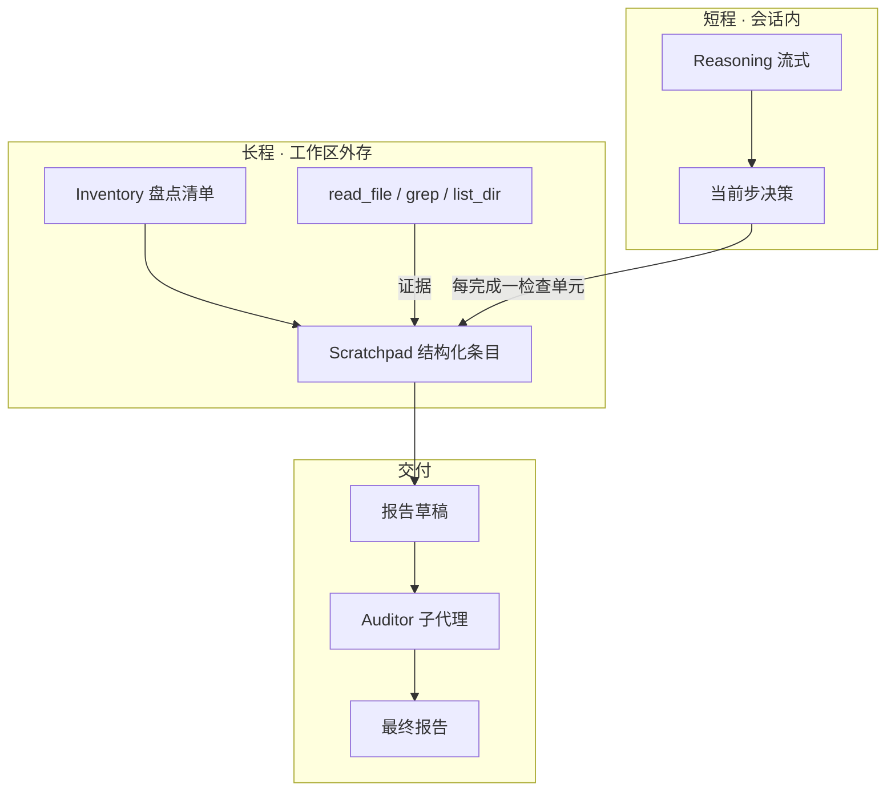

# 审计工作记忆（Audit Scratchpad）方案草稿

> **状态：** Phase A ✅ · **Phase B ✅**（见 [audit-scratchpad-test.md](audit-scratchpad-test.md)）；**Phase C** 方案已定（§6.12，C0→C4 分 PR）  
> **范围：** DS Pick / TUI 共用 runtime；面向**长程、全库级代码审查**与同类「多步探索 → 最终报告」任务。  
> **相关：** [agent-reliability-craft-plan.md](../agent-reliability-craft-plan.md)、[auditor-subagent-design.md](auditor-subagent-design.md)、`crates/tui/src/tools/subagent/blackboard.rs`、`crates/tui/src/prompts/base.md` § Full-repository code review mode。

---

## 1. 问题陈述

### 1.1 现象

用户发起**整仓代码级审核**时，模型会经历很长的「逐步思考 + 大量只读工具」阶段。到中途或收尾时，常出现：

- 早期已确认的模块/检查项在最终报告中**遗漏**或**降级为笼统描述**；
- 后半程**提前收口**（「差不多了」），深度不足；
- 个别发现建立在**类比**而非调用方追溯（见 [auditor-subagent-design.md §1](auditor-subagent-design.md) M4 案例）。

### 1.2 根因（工程视角）

| 误解 | 事实 |
|------|------|
| 「思考流式输出 = 工作记忆可靠」 | Reasoning 在 UI/会话中**有记录**，但在同回合内会被 tool 输出挤占注意力；跨回合可能被 compaction **摘要** |
| 「上下文够长就能审完全库」 | 长窗口缓解「装不下」，不保证「会精读、会坚持 checklist」 |
| 「最后读一遍 thinking 即可汇总」 | Thinking 体积大、非结构化、难验收；不适合作报告唯一依据 |

**结论：** 需要与 reasoning **解耦**的、**结构化、可检索、可机械核对**的外存——下称 **审计工作记忆（Audit Scratchpad）**。

### 1.3 非目标

- 不替代 Auditor 子代理的机械事实核查（scratchpad 记「候选事实」，Auditor 仍核对行号/符号）。
- 不把整段 reasoning 自动 dump 进外存（噪音大、不可验收）。
- 不承诺一次实现即覆盖 Office 文档类任务（首版聚焦 **Code / 全库审查**）。

---

## 2. 设计原则

1. **事实与推理分离** — Scratchpad 只存「可核对条目」；reasoning 仅服务当前步决策。  
2. **增量写入、分段收口** — 每完成一个 inventory **检查单元**（见 §4.2 粒度）必须落盘；允许该单元内**批量只读**，在「检查完成」时一次性写入，禁止「全仓读完再记」。  
3. **证据锚定** — 每条须含 `file` + `line`（或 `line_range`）+ `evidence`（工具结论摘要，非臆测）。  
4. **覆盖率可观测** — 盘点清单 vs 已审模块可 diff；未审项不得静默消失。  
5. **与 CRAFT 黑板互补** — 子代理交接用现有 `blackboard.json`；主代理长回合内用 scratchpad 文件或扩展分区。  
6. **默认可关** — 小范围 PR/单文件审查不强制；全库模式默认开启。

---

## 3. 概念模型



| 产物 | 路径（建议） | 用途 |
|------|----------------|------|
| **Inventory** | `.deepseek/scratchpad/{run_id}/inventory.json` | 模块/目录 checklist（机器可读 JSON） |
| **Scratchpad** | `.deepseek/scratchpad/{run_id}/notes.jsonl` | 一行一条 JSON；追加写、易 diff |
| **CRAFT Blackboard** | `.deepseek/blackboards/{task_id}.json` | 子代理角色分区（已有）；全库 CRAFT 链路用 `task_id` 对齐 |
| **Report draft** | 用户指定或 thread workspace | 最终 Markdown 报告 |

### 3.1 Scratchpad 目录 ID（`run_id`）

Phase A **不能假设**模型总能拿到 HTTP `thread_id`（纯 TUI session 常见缺口）。目录名统一叫 **`run_id`**，按优先级解析：

| 优先级 | 来源 | 示例 |
|--------|------|------|
| 1 | 运行时注入 / 用户消息中的 `thread_id` | `thread_abc123` |
| 2 | 父代理已知 `task_id`（CRAFT） | `task_fix_auth`（与 blackboard 同名，scratchpad 仍可并列） |
| 3 | **Phase A 兜底** | UTC `YYYY-MM-DD-HHmmss`（如 `2026-05-19-143052`） |

**Phase B：** `scratchpad_append` / `scratchpad_status` 由 runtime 写入正确路径，模型不再自行拼目录名。

`thread_id` 与 `task_id` 关系：

- **仅主代理 solo 审查：** 一个 `run_id` 目录即可。  
- **主代理 + explore/review/auditor：** spawn 时传同一 `task_id`；explorer 结论进 blackboard，主代理 scratchpad 记汇总与缺口（避免子代理双写 scratchpad，见 §10）。

---

## 4. Scratchpad 数据格式（草案）

### 4.1 JSONL 单行 schema（`notes.jsonl`）

```json
{
  "id": "note-042",
  "ts": "2026-05-19T12:00:00Z",
  "area_id": "area-tui-engine",
  "area": "crates/tui/src/core/engine",
  "kind": "finding | todo | cleared | meta",
  "severity": "BLOCKER | HIGH | MEDIUM | LOW | null",
  "title": "short label",
  "file": "crates/tui/src/core/engine/dispatch.rs",
  "line": 120,
  "line_end": 145,
  "claim": "One sentence, falsifiable",
  "evidence": "grep/read summary; symbol names seen on those lines",
  "status": "open | verified | deferred",
  "source": "main | explore | review",
  "supersedes": "note-012"
}
```

- **`area_id`（必填）：** 与 `inventory.json` 中 `areas[].id` 一致；`area` 路径为可读副本，避免拼写漂移导致失联。  
- **`supersedes`（Phase A）：** 升级 severity 或修正 claim 时**只追加一行**新 finding，填 `supersedes: "<old-id>"`。**禁止**重写 JSONL 已有行、禁止再追加一行去改旧条目的 `status`。被指向的旧 `id` **视为已取代**（读时：若某 `id` 被他人 `supersedes`，则不再进入报告）。  
- **`supersedes`（Phase B）：** `scratchpad_append` 可在索引侧标记旧 id 为 `superseded`，对外仍 append-only。  
- **传递闭包：** 若 A→B、B→C（各行 `supersedes` 指向），则 A、B、C 中**被取代的 id**均不参与 P2（实现时对 `supersedes` 图做传递闭包，而非仅查直接边）。  
- **`updates[]`（Phase B，可选）：** runtime 维护修正历史，避免模型手改多行。

**硬规则（prompt + 可选 runtime 校验）：**

- `kind=finding` 且 `severity` 为 HIGH/BLOCKER 时，`file` + `line` 必填；**强烈建议**同时填 `line_end`（Auditor 核对多行上下文）。  
- `status=verified` 仅当本轮或上一轮有对应 `read_file`/`grep_files` 工具成功。  
- 禁止 `claim` 中出现未在 evidence 出现的 API/路径（Auditor 可机械抓）。  
- **P2 报告**仅允许引用 `kind=finding` 且 `status=verified`、且未被 `supersedes` 取代的条目（见 §4.5）。

### 4.2 Inventory（`inventory.json`）

采用 **JSON**（非 Markdown 表格），便于模型读写完成率、Phase B 程序化门禁。

```json
{
  "run_id": "2026-05-19-143052",
  "created_at": "2026-05-19T14:30:52Z",
  "areas": [
    {
      "id": "area-desktop-web-ui",
      "path": "crates/desktop/web-ui",
      "status": "pending",
      "notes": ""
    },
    {
      "id": "area-tui-engine",
      "path": "crates/tui/src/core/engine",
      "status": "in_progress",
      "notes": "3 findings in notes.jsonl"
    },
    {
      "id": "area-tui-tools",
      "path": "crates/tui/src/tools",
      "status": "done",
      "notes": "cleared"
    }
  ]
}
```

**`areas[].id`：** 稳定 slug（如 `area-tui-engine`），P0 生成后**不得改**；`notes.jsonl` 用 `area_id` 关联，不用路径字符串做主键。

**`areas[].notes`（可选字符串）：** 仅**人类可读备注**（如 `"3 findings in notes.jsonl"`），**不参与**程序逻辑。计数、完成率、续审指针一律来自 `notes.jsonl` 与 `scratchpad_status`；Phase B 实现**不得**解析或依赖该字段做门禁。模型勿将其当作计数器手改。

**`status` 枚举：** `pending` | `in_progress` | `done` | `deferred`（`deferred` 须在 `notes` 或 scratchpad `kind=meta` 写明原因）。

**粒度规则（Phase A prompt 强制）：**

- 每行 `areas[].path` = **一次「检查完成」可收口**的独立模块或目录。  
- **建议粒度：** crate 下**一级子目录**（如 `crates/tui/src/core/engine`），不要整仓一行，也不要细到每个 `.rs` 一行。  
- **启发式上限：** 单行 `path` 覆盖的源文件数建议 **≤ 20**（超出则拆行）；全仓 inventory 行数建议 **10～40**（视仓库规模调整）。  
- P0 用 `list_dir` + README 生成后，用 `kind=meta` 在 notes.jsonl 记录 `inventory_version: 1` 与总行数。

每完成一行的**检查**（非「每次 read_file」），更新该行 `status` → `done` 并 append ≥1 条 notes.jsonl。

### 4.3 读取 vs 检查（并行只读）

| 事件 | 含义 | scratchpad 义务 |
|------|------|-----------------|
| **读取完成** | 该行覆盖的文件已 batch `read_file` / `grep` | 无（允许并行读 5～10 个文件） |
| **检查完成** | 已综合证据并形成该区结论 | 必须 append ≥1 条 + 更新 `inventory.json` 该行 |

禁止要求「每 read_file 后写一条」；禁止「多区读完只写一条」。

### 4.4 断点续审（Phase A 即可用）

P0 进入时：若 `.deepseek/scratchpad/{run_id}/` 已存在且 `inventory.json` 非空：

1. **`read_file` `inventory.json`**，取第一个 `status` 为 `pending` / `in_progress` 的 `areas[].id`（续审指针）。**不**重建 inventory（除非用户要求重审）。  
2. **按 `area_id` 读 notes**（不要用「文件尾部 N 行」——尾部可能是已 `done` 的上一区，会错位）：  
   - Phase A：`grep_files` / `read_file` 过滤 `notes.jsonl` 中含该 `"area_id":"<id>"` 的行；或全文较短时读全文件再在上下文中筛选。  
   - Phase B：`scratchpad_status` 返回该 `area_id` 最近 K 条 + 全局 open finding 计数。  
3. `kind=meta` 记录 `resumed_at`、`resume_area_id`。

sidecar / 进程重启后，外存仍在 workspace；续审上下文 = **inventory 指针 + 当前区 notes**，而非全局 tail。

### 4.5 `notes.jsonl` 双用途与 P2 过滤

同一文件兼：**工作笔记**（`kind=todo`、`status=open`）与 **报告证据源**（`kind=finding`、`status=verified`）。

| 阶段 | 约定 |
|------|------|
| **P1** | 可写 `todo` / `open`；检查完成时把结论升为 `finding` + `verified`（或新 append 一条 verified，旧 todo 可留作历史） |
| **P2 前（Phase A）** | 显式规则：写报告前**只**采用 `kind=finding` ∧ `status=verified` ∧ 未被任何行 `supersedes` 的 id；`todo`/`open` 不得进入报告正文 |
| **P2 前（Phase B 可选）** | 拆 `findings.jsonl`（仅 verified finding）由 `scratchpad_append` 晋级写入，降低信噪比 |

---

## 5. 工作流（三阶段）

与 `base.md` § Full-repository code review mode 对齐，**显式阶段**而非一步到底。

| 阶段 | 名称 | 输入 | 输出 | 退出条件 |
|------|------|------|------|----------|
| **P0** | Inventory | `list_dir`、README；或 **续审** 读已有 `inventory.json` | `inventory.json` + `meta: plan` | 所有 area 已列出且粒度符合 §4.2；或续审指针已确定 |
| **P1** | Examine | 按 inventory 顺序只读（可并行读） | 每 **检查完成** 一行：append notes + 更新 `inventory.json` | 所有 area 为 `done` 或 `deferred` |
| **P2** | Synthesize | `inventory.json` + **仅 verified findings**（§4.5） | 报告草稿 | 草稿 HIGH+ 均有 scratchpad id 且 `verified` |
| **P3** | Verify | 草稿 + scratchpad | `agent_spawn(type=auditor)`（已有规则） | PASS 或按重试策略降级 |

**与现有 prompt 的关系：** P2–P3 已部分存在于 `base.md`（Evidence audit、Auditor mandatory）；本方案补的是 **P0–P1 的外存纪律**。

---

## 6. 实现路线（分三期）

### Phase A — 仅 Prompt / Skill（✅ 已落地）

**改动面（已完成）：**

- `.deepseek/pick-rules.md` §7  
- `crates/tui/src/prompts/base.md` § Full-repository code review mode  
- `crates/tui/assets/skills/audit-repo/SKILL.md`（bundled via `install_system_skills` v2）

**规则要点：**

1. 解析 `run_id`（§3.1）：`thread_id` → `task_id` → UTC `YYYY-MM-DD-HHmmss`；创建 `.deepseek/scratchpad/{run_id}/`。  
2. 写入 `inventory.json`（§4.2 粒度）；若目录已存在则走 §4.4 续审。  
3. 每 **检查完成** 一个 inventory 行（§4.3），append ≥1 条 `notes.jsonl` 并更新该行 `status`。  
4. **软规则（Phase A）：** 完成当前 `in_progress` 区的检查前，尽量不要开始下一 `area`；不要「漂移到别区却长期不落盘」。**不设**跨区只读次数硬阈值（模型无法可靠计数）。  
5. 写报告前读 `inventory.json`，且仅依据 §4.5 的 verified findings（Phase B：分层注入，§6.1）。  
6. severity 升级：**只追加**带 `supersedes` 的新行（§4.1）；禁止改旧行。

**验收：** 人工跑 [回归测试 R 类全库题](../tui/回归测试.md)（若有）；对比「有/无 scratchpad 规则」报告遗漏率。

**风险：** 模型可能偷懒不写；靠用户监督 + 后续 Phase B 门禁。

---

### Phase B — 实施方案（✅ 已落地）

**依据：** [audit-scratchpad-test.md](audit-scratchpad-test.md) 多区试跑（`2026-05-19-tui-src-review`，14 area / 36 notes）。  
**目标：** 把 Phase A 的「靠 prompt 自律」升级为 **runtime 保证 schema、可见进度、P2 可扩展、长会话不丢指针**。

**明确不做（仍属 Phase B 边界外或 B 尾）：**

- 不自动把 ThinkingDelta 写入 scratchpad  
- 不把 scratchpad 与 CRAFT blackboard 合并（Phase C）  
- 不做 P2 前覆盖率硬拦（Phase C）

---

### 6.2 分层摘要策略（P2 注入）

全库 20～40 area × 每区数条 finding 时，扁平摘要易超上下文。`build_p2_summary` / `build_layered_summary` 采用分层注入：

| 层 | 内容 | 约略上限 |
|----|------|----------|
| **L0** | `inventory.json` 完成率、`in_progress` / 下一 `area_id`、open verified 计数 | ~500 字 |
| **L1** | 所有 `severity ∈ {BLOCKER,HIGH}` 且 `verified`、且未 superseded 的 finding 一行一条 | ~2000 字 |
| **L2** | 按 `area_id` 均匀采样：每区最多 2 条 MEDIUM verified | 填满剩余预算 |
| **按需** | `scratchpad_list_notes(area_id=…)` 拉完整行 | 工具调用 |

超出预算：**优先 L1 → L0 → L2**；HIGH 条目禁止拦腰截断（省略则记入 `omitted_high_ids`）。

读取 `notes.jsonl` 时须兼容 **Phase A 遗留行**（缺 `ts`/`title`/`source`）：解析设默认值，不因缺字段 panic（见 §6.3）。

---

### 6.3 实施分期与优先级

| 里程碑 | 交付 | 预估 | 依赖 |
|--------|------|------|------|
| **B1** | `scratchpad_*` 四工具 + Store 核心校验 + 注册 Code 面 | ✅ | — |
| **B2** | run_id/thread 绑定 + 并发锁 + Phase A 兼容读 | ✅ | B1 |
| **B3** | Engine：分层摘要注入 + compact handoff 指针 | ✅ | B2 |
| **B4** | Engine：只读无写入轻提醒（可配置关闭） | ✅ | B2 |
| **B5** | 桌面审查进度面板 + thread 绑定 run_id | ✅ | B2 |
| **B6** | `audit-repo` skill / pick-rules 收紧 + 文档 | ✅ | B1 |
| **B7** | scratchpad 目录清理策略（文档 + 可选 TTL） | ✅ | B2 |

建议 **B1→B2→B3** 先合入一条 PR；**B4–B7** 可跟第二条 PR。

---

### 6.4 模块布局（Rust）

```
crates/tui/src/
  scratchpad/
    mod.rs          # ScratchpadStore, paths, parse/validate
    schema.rs       # NoteLine, Inventory, area status enums
    summary.rs      # §6.2 分层摘要 + superseded 传递闭包
  tools/
    scratchpad.rs   # scratchpad_append | status | list_notes
```

**路径规则（与 Phase A 一致）：**

- 根：`<workspace>/.deepseek/scratchpad/{run_id}/`
- 文件：`inventory.json`、`notes.jsonl`
- `run_id`：thread 元数据 `scratchpad_run_id`（HTTP thread API 扩展可选字段）→ 否则工具参数显式传入 → 否则 UTC slug

**`ScratchpadStore` 职责：**

- `canonical_run_dir(workspace, run_id)` — `canonicalize` + 禁止 `..`
- `read_inventory` / `write_inventory` — 原子写（`.tmp` + `rename`，对齐 blackboard）
- `append_note(line) -> NoteId` — 校验 schema、**校验 `area_id` 存在于 inventory**（`_global` 除外）、分配 `note-{seq}`、**互斥锁下**追加 JSONL
- `list_notes(area_id?, limit)` — 按区过滤，返回**完整 JSON 行**（非摘要）
- `build_p2_summary(max_chars) -> String` — §6.2
- `superseded_ids(notes) -> HashSet<NoteId>` — **`supersedes` 传递闭包**（A→B→C 则 A、B 均排除）
- `count_notes_for_area(area_id) -> usize` — 供 `scratchpad_set_area` 门禁

**并发：** 同一 `run_id` 下 `append_note` / `write_inventory` 使用 **进程内 `Mutex<()>`**（或 `flock` 锁 `notes.jsonl`），防止并行 tool 调用交错行。子代理 **不**写 scratchpad（§10 #3）；主代理单进程内串行化即可。

**Phase A 兼容读：** 解析 JSONL 时 `ts`/`title`/`source`/`status` 缺省 → 默认值；`kind` 缺省 → 视上下文推断或 `meta`；旧行无 `id` 的可在读时合成 `legacy-{line_no}` 仅供内部引用。

---

### 6.5 工具面（注册到主 agent Code 面）

#### `scratchpad_status`

**输入：** `{ "run_id": "optional" }`  
**输出（JSON）：**

```json
{
  "run_id": "2026-05-19-tui-src-review",
  "path": ".deepseek/scratchpad/2026-05-19-tui-src-review",
  "areas_total": 14,
  "areas_done": 14,
  "areas_deferred": 0,
  "areas_in_progress": 0,
  "areas_pending": 0,
  "resume_area_id": null,
  "notes_total": 36,
  "findings_verified": 3,
  "findings_open": 0,
  "notes_per_area": { "area-core": 8, "area-tui-display": 1 }
}
```

`resume_area_id` = 第一个 `pending` | `in_progress`。

#### `scratchpad_append`

**输入：** `{ "run_id"?, "line": { ... NoteLine fields ... } }`  
**行为：**

- 必填：`area_id`（除 `kind=meta` 且 `area_id=_global`）
- **`area_id` 存在性：** 必须出现在当前 `inventory.json` 的 `areas[].id` 中；否则 **reject**，并在错误中返回 `valid_area_ids: [...]`
- `kind=finding` + HIGH/BLOCKER → 必填 `file`、`line`；建议填 `line_end`
- `kind=finding` → 默认 `status=verified` 若未传（可要求调用方显式传）
- 自动：`id`（`note-{n}`）、`ts`（RFC3339）
- 拒绝：改写已有行；缺字段；未知 `area_id`

**输出：** `{ "id": "note-037", "path": ".../notes.jsonl" }`

#### `scratchpad_list_notes`

**输入：** `{ "run_id"?, "area_id": "area-core", "limit": 20 }`  
**输出：** JSON **array**，元素为与 `notes.jsonl` **一致的完整对象**（含 `claim`、`evidence`、`file`、`line` 等），按时间顺序取该区最近 N 条——**非**摘要字符串。对齐 §4.4 续审，模型无需再 `read_file` 拼详情。

```json
{
  "area_id": "area-core",
  "notes": [ { "id": "note-008", "kind": "finding", ... } ]
}
```

#### `scratchpad_set_area`（建议一并做）

**输入：** `{ "run_id"?, "area_id", "status": "in_progress|done|deferred", "notes": "optional human remark", "require_min_notes": 1 }`  
**行为：** 更新 `inventory.json` 对应行的 `status` 与可选 `areas[].notes`（仅备注，见 §4.2）。

**与 append 的顺序 / 原子性：**

- **Prompt（Phase A/B）：** 默认 **先 `scratchpad_append`（≥1 条）再 `scratchpad_set_area(done)`**
- **Runtime（B1）：** 当 `status` 为 `done` 且 `require_min_notes` ≥ 1（默认 **1**）时，若该区在 `notes.jsonl` 中条目数 &lt; N → **reject**，提示先 append
- `deferred` 须在随后 `scratchpad_append` 写 `kind=meta` 或 finding 说明原因（软校验 + 文档）

**Prompt 迁移：** `audit-repo` skill 改为优先调用上述工具；`write_file` 整文件写 scratchpad 降为 fallback。

---

### 6.6 Engine 集成

#### B3 — P2 分层摘要注入（§6.2，**必做**）

**触发：** 检测到 scratchpad 存在且用户消息含「写报告 / synthesize / 审查报告」或模型即将进入无工具的最终回答且 inventory 全 `done|deferred`。

**行为：** 在下一请求前注入一条 **user 侧**（或 system 附录）消息：

```text
<scratchpad_summary run_id="...">
[L0 inventory status]
[L1 all HIGH/BLOCKER/MEDIUM verified findings, one line each]
[L2 sampled MEDIUM/low per area if budget remains]
omitted_high_ids: []
</scratchpad_summary>
```

实现：`scratchpad::summary::build_layered_summary(store, config.inject_summary_max_chars)`。

多区试跑 36 行未爆窗，但全库 + 多 finding 时 **数学上必爆**；与「偷懒提醒」无关，**与 B1 同批交付**。

#### B4 — 只读无 append 提醒（**可选默认开**）

**状态机（per turn, per run_id）：**

- **每次提醒前**从磁盘 **重读** `inventory.json`，取当前 `in_progress` 的 `area_id`（若无则取第一个 `pending`）——保证文案中的 `{area_id}` 与实时状态一致
- 统计**本 step 内**只读工具成功次数（`read_file`、`grep_files`、`list_dir` 等）。**不**尝试把每次 read 归属到 area（模型可能跨区读）；计数绑定「当前 in_progress 区」，作软 nudge 而非硬证据
- 若 ≥ `remind_after_readonly_tools`（默认 **8**）且本 step 未调用 `scratchpad_append` / `scratchpad_set_area` → 注入 system 提醒，**必须含** `area_id` 与 `path`：

  > 当前审查区 **`area-core`**（`crates/tui/src/core/…`）已连续 8+ 次只读工具调用但未更新 scratchpad。请先 `scratchpad_append`（≥1 条，含 area_id），再 `scratchpad_set_area`。

**试跑结论：** 多区未观察到「不写」；默认 **enabled=true**，`config.toml` 可关。实现成本低，作为保险丝保留。

#### B3b — Compaction / handoff 指针（**B 尾，小改**）

`cycle_handoff` / capacity refresh 时，若 workspace 存在 scratchpad：

- handoff 文本强制包含：`Active audit scratchpad: .deepseek/scratchpad/{run_id}/ (resume_area_id: …)`
- **不删除** workspace 下 scratchpad 文件

---

### 6.7 桌面（DS Pick）

**B5 — 审查进度（只读）**

- 当 thread 带 `scratchpad_run_id`（或最近工具写入的 run_id）时，右栏或 Composer 上方显示：
  - 完成率：`areas_done / areas_total`
  - 当前 `resume_area_id`
  - 可选：每 area 一行（读 `inventory.json` + `notes_per_area` 计数）
- 实现：`web-ui` 通过现有 workspace 读文件 API / Tauri 读 `.deepseek/scratchpad/...`（与预览面板同路径安全）
- **不写** scratchpad（只读）

**Thread API（可选同 PR）：**

- `ThreadRecord.scratchpad_run_id?: string`
- 首次 `scratchpad_append` 时由 runtime 回写 thread（sidecar SQLite）

---

### 6.8 配置（`~/.deepseek/config.toml`）

```toml
[scratchpad]
enabled = true
max_notes_per_run = 2000
remind_after_readonly_tools = 8
remind_enabled = true
inject_summary_max_chars = 6000
inject_on_report_keywords = ["审查报告", "final report", "synthesize", "write the report"]
retention_days = 30
```

Phase C 拟新增字段见 **§6.12.7**（实现前勿依赖）。

---

### 6.9 验收标准（Phase B Done）

| # | 标准 |
|---|------|
| 1 | 多区 Prompt 复跑：`scratchpad_append` 写入行 100% 含 `id`、`area_id`；finding 含 `status` |
| 2 | 非法 `area_id` reject 且返回 `valid_area_ids` |
| 3 | `set_area(done)` 在 notes&lt;1 时 reject（默认 `require_min_notes=1`） |
| 4 | `supersedes` 链 A→B→C 时 A 不出现在 P2 摘要 |
| 5 | `scratchpad_status` 与磁盘计数一致；orphan `area_id` 数为 0 |
| 6 | 续审 + `scratchpad_list_notes` 返回完整 JSON 行 |
| 7 | 80+ 条 finding 时分层注入 ≤ 预算且含全部 HIGH |
| 8 | `cargo test`：路径逃逸、并发 append、Phase A 旧行解析 |
| 9 | 桌面进度与 status 一致 |

---

### 6.10 Scratchpad 目录清理

| 阶段 | 策略 |
|------|------|
| **Phase B 首版** | 文档说明路径 `<workspace>/.deepseek/scratchpad/`，用户可手动删旧 `run_id` 目录 |
| **B7（✅ 已落地）** | `RuntimeThreadManager::open` 时调用 `cleanup_stale_scratchpads`：删除 **mtime &gt; retention_days**（默认 30）的子目录；**不删** 任一活跃 `thread.scratchpad_run_id` 指向的 run |
| **配置** | `[scratchpad] retention_days = 30` |

---

### 6.11 Phase B 后的 Prompt 调整

- `audit-repo` SKILL：工具优先；`write_file` 仅 fallback  
- `pick-rules` §7：列出工具名  
- `base.md`：P1/P2 引用 `scratchpad_set_area` + `scratchpad_append`

---

### 6.12 Phase C — 与 CRAFT / Auditor 深集成（⬜ 排队）

**依据：** Phase B 试跑（`2026-05-19-phase-b-smoke`，测试 1–4 ✅）；[audit-scratchpad-test.md §4](audit-scratchpad-test.md#4-未覆盖项留待-phase-c) 未覆盖项。  
**目标：** 解决 **早收口写报告**、**报告与 scratchpad 事实脱节**（含 [auditor-subagent-design.md](auditor-subagent-design.md) M4 类误报）、**长会话 compact 丢 run 指针**；可选与 CRAFT blackboard 对齐。

**Auditor 前提：** `SubAgentType::Auditor` 与 `AUDITOR_AGENT_PROMPT` **已落地**；C2 做的是 **引擎侧结构化喂数**，非新建子代理类型。

#### 6.12.1 设计原则

| # | 原则 |
|---|------|
| 1 | **单一事实源** — `inventory.json` + `notes.jsonl` 为准；blackboard / compaction 只存指针与统计，不复制全文 finding |
| 2 | **门禁分两层** — **area 完成率**（首版必做）；**file 级覆盖率**（`git ls-files` vs `areas[].path`，成本高，放 C4） |
| 3 | **`deferred` 语义** — 计入 **已交代**（`accounted`），不计入 **已审**（`reviewed`）；报告 L0 必须列出 deferred 区及原因 |
| 4 | **Auditor 吃结构化 note 列表** — 以 `note_id` + `file:line` 为键；父代理 prose 报告仅作说明，核查以 scratchpad 为准 |
| 5 | **子代理不写 scratchpad 文件** — explore 只写 blackboard（§10 #3）；C3 为 **镜像分区**，非双写 |
| 6 | **可配置、可关** — 阈值与 `hard_block` 进 `[scratchpad]`，避免个人项目被硬拦死 |

#### 6.12.2 子阶段与排期（推荐）

```text
C0 Compaction 指针  →  C1 覆盖率门禁  →  C2 Auditor 结构化  →  C3 Blackboard 镜像  →  C4 远期
     (~0.5 PR)              (~1 PR)            (~1 PR)              (按需)           (有数据再做)
```

| 子阶段 | 能力 | 主要改动位置 | 优先级 |
|--------|------|----------------|--------|
| **C0** | Compaction / capacity refresh **保留** scratchpad 路径 + L0 摘要 | `capacity_flow.rs`、`engine.rs`（衔接已有 `scratchpad_handoff_line` / B3b） | **高** |
| **C1** | P2 前 **覆盖率门禁**（软/硬） | `scratchpad_flow.rs`（`coverage_gate`）、`engine.rs`（报告关键词 + `maybe_summary_before_final_answer` 前） | **高** |
| **C2** | **Auditor ← scratchpad** 结构化输入与 `note_id` 核查闭环 | spawn 路径、`AUDITOR_AGENT_PROMPT`、`summary.rs` 导出 finding 列表 | **高** |
| **C3** | Blackboard 分区 **`scratchpad`**（统计镜像） | `blackboard.rs`；主代理在 status 变更或 P2 前写一次 | 中（常做 CRAFT+全库审查时） |
| **C4** | File 级覆盖率、JSONL→SQLite、Office TaskType、导出排除 scratchpad | 见 §10 | 低 |

#### 6.12.3 C0 — Compaction 保留

**现状：** B3b 已在 `cycle_handoff` / capacity refresh 注入 `Active audit scratchpad: … (resume_area_id: …)`；**未**把 scratchpad 目录 pin 进 compaction。

**行为：**

- 当 `thread.scratchpad_run_id` 存在：将 `.deepseek/scratchpad/{run_id}/` 加入 compaction **pins** / `top_paths`（与现有 workspace 读路径安全一致）。
- `merge_compaction_summary` 时若 store 可读：追加 **L0 一行**（复用 `build_layered_summary` 的 inventory 头），避免 compact 后只剩模糊 handoff。

**验收：** 人工触发 compact 后，下一轮 `scratchpad_status` 与续审 prompt 仍指向同一 `run_id`。

#### 6.12.4 C1 — 覆盖率门禁

**解决的问题：** inventory 未审完就 synthesize / 写报告（试跑 §4「100% done 门禁延到 C」）。

**指标（区分语义）：**

| 指标 | 公式 | 用途 |
|------|------|------|
| `accounted_ratio` | `(areas_done + areas_deferred) / areas_total` | 能否进入 P2（软/硬拦） |
| `reviewed_ratio` | `areas_done / areas_total` | 报告「完整度」、桌面横条副标题（可选） |
| `pending_areas` | `status ∈ {pending, in_progress}` 的 `areas[].id` | 注入续审列表 |

**默认阈值（可配置）：**

| 条件 | 行为 |
|------|------|
| `accounted_ratio` &lt; **0.85** | **Soft：** 注入 user 消息，列出 `pending_areas`，要求续审或显式 `scratchpad_set_area(deferred)` + 原因 |
| `accounted_ratio` &lt; **0.60** 且 `coverage_hard_block_enabled` | **Hard：** **不注入** `<scratchpad_summary>`；固定 system/user 文案说明缺口 |
| `accounted_ratio` ≥ 0.85 且 `reviewed_ratio` &lt; **0.70** | **允许** P2，但 L0 强制 `deferred_areas: [...]` |

**挂钩点：** 与 B3 相同 — 用户消息命中 `inject_on_report_keywords` 时（`engine.rs`）；以及无工具终稿前（`maybe_summary_before_final_answer`）。

**API 草案：** `scratchpad_flow::coverage_gate(store, config) -> Allow | Warn { pending, ratios } | Block { reason }`。

**C1 可选质量门（低成本）：** 除现有 `require_min_notes` 外，标 `done` 的 area 至少 1 条 `kind ∈ {finding, cleared}`（`deferred` 区除外），防止「空 done」。

**首版不做：** `git ls-files` 与 `areas[].path` 的 file 级 diff（→ C4）。

#### 6.12.5 C2 — Auditor + scratchpad 深绑

**现状：** Auditor 走「父代理粘贴报告草稿」路径 B；scratchpad 的 `note_id`、`supersedes`、verified 集未进入核查闭环。

**行为：**

1. **引擎组装 Auditor assignment**（父代理不必手写全文）  
   - 从 store 取 `kind=finding` + `status=verified` 且 **未**在 `superseded_ids` 中的行；  
   - 按 `base.md` 阈值：**HIGH/BLOCKER 强制**；MEDIUM 当条数 ≥ `auditor_include_medium_min`（默认 3）时强制；  
   - 固定表格：`note_id | severity | file:line[-line_end] | title | claim`（JSON 数组亦可）。

2. **扩展 `AUDITOR_AGENT_PROMPT`**  
   - 以 **`note_id`** 为主键逐条 `read_file`；FAIL 必须引用 `note_id`；  
   - 父代理修正：**仅** `scratchpad_append` + `supersedes`，禁止改旧 JSONL 行；  
   - Auditor **禁止**新增 finding（保持现有约束）。

3. **可选 spawn 参数：** `scratchpad_run_id` 或 `audit_note_ids: ["note-008", …]`，runtime 自动拼 prompt。

4. **与 `base.md` 对齐：** 「Auditor 输入 **必须** 来自 scratchpad verified 列表」；prose 报告为辅。

**验收：** 故意错行号 → Auditor FAIL → supersede 修正 → PASS（smoke 中 note-002/008 流程产品化）。

#### 6.12.6 C3 — Blackboard `scratchpad` 分区（镜像）

**原则：** **Explore 仍只写 `explorer`**；主代理在 `scratchpad_status` 显著变更或 P2 前写一次 **只读镜像**（非 findings 全文）：

```json
"scratchpad": {
  "run_id": "2026-05-19-tui-src-review",
  "path": ".deepseek/scratchpad/2026-05-19-tui-src-review",
  "areas_done": 12,
  "areas_total": 14,
  "findings_verified": 28,
  "high_note_ids": ["note-042"]
}
```

**读侧：** CRAFT 链路上 Auditor（`task_id` 存在）可读 `high_note_ids` 作交叉引用；Implementer/Review **不**依赖此分区。

#### 6.12.7 Phase C 配置（`~/.deepseek/config.toml`）

Phase B 已有字段见 §6.8。Phase C **拟新增**（实现时同步 `config.example.toml` 与 `ScratchpadConfig`）：

```toml
[scratchpad]
# --- Phase C (planned) ---
coverage_soft_ratio = 0.85
coverage_hard_ratio = 0.60
coverage_hard_block_enabled = true
coverage_count_deferred_as_accounted = true
auditor_from_scratchpad = true
auditor_include_medium_min = 3
```

#### 6.12.8 Phase C 验收标准

| # | 标准 |
|---|------|
| C0-1 | Compact 后同 thread 仍可 `scratchpad_status`，`run_id` 不变 |
| C0-2 | Compaction 摘要含 scratchpad L0 或 handoff 行 |
| C1-1 | `accounted_ratio` &lt; 0.60 时不注入 `<scratchpad_summary>`（hard 开时） |
| C1-2 | `accounted_ratio` &lt; 0.85 时注入 pending 列表（soft） |
| C1-3 | 全 `deferred` 冒充完成时，L0 列出 deferred 区 |
| C2-1 | Auditor prompt 含 `note_id` 列表；FAIL 引用 `note_id` |
| C2-2 | 修正仅经 `supersedes` append，旧行不出现在 Auditor 二次输入 |
| C3-1 | `task_id` 存在时 blackboard 含 `scratchpad` 分区且与 `scratchpad_status` 一致 |
| C3-2 | Explore 子代理不写 `notes.jsonl`（回归） |

#### 6.12.9 C4 — 远期（有试点数据再定）

| 项 | 触发条件 |
|----|----------|
| File 级覆盖率 | 多次「代表性文件」偷懒；`inventory.path` vs `git ls-files` |
| JSONL → SQLite | 单 run `notes` &gt; `max_notes_per_run` 或 append 变慢（§10 #2） |
| Office TaskType | 有需求再复用 schema（§10 #4） |
| 导出 thread 排除 scratchpad | 隐私 / 分享场景（§8） |

**依赖：** [auditor-subagent-design.md](auditor-subagent-design.md)（Auditor 类型 ✅）；Phase B store/tools（✅）。

---

## 7. 与现有组件对照

| 现有能力 | 关系 |
|----------|------|
| **Reasoning UI** | 保留；用户可回看，但不作为报告源 |
| **CRAFT blackboard** | 子代理间快照；Phase C3：`scratchpad` **镜像分区**（统计 + `high_note_ids`），非 findings 全文 |
| **cycle_handoff / compact** | B3b handoff ✅；Phase C0：compaction **pin** 路径 + L0 摘要 |
| **Auditor** | P3 消费者；Phase C2：输入 **必须** 来自 scratchpad verified `note_id` 列表 |
| **topic-memory-graph** | **远期**跨会话话题图（独立库，未接入本仓库）；scratchpad 管**单次任务**事实。若将来并入，注入顺序与字数上限见 [agent-reliability-craft-plan.md §3.1](../agent-reliability-craft-plan.md) |

---

## 8. 安全与隐私

- 路径限制在 **thread workspace** 或 `.deepseek/scratchpad/` 下；遵循现有 `canonicalize` + 禁止 `..` 逃逸。  
- Scratchpad 可能含代码片段摘要；**默认不**进入 telemetry；导出 thread 时可选排除（后续）。  
- 多用户共用机器时，scratchpad 目录随 workspace 隔离。  
- 保留策略见 **§6.10**（避免 `.deepseek/scratchpad/` 无限增长）。

---

## 9. 成功指标（试点）

| 指标 | 测量方式 |
|------|----------|
| 报告遗漏率 | 同一仓库，固定题库，专家标注「应有 finding」vs 报告 |
| Inventory 完成率 | `reviewed_ratio`（`done/total`）与 `accounted_ratio`（`(done+deferred)/total`），见 §6.12.4 |
| HIGH 可核对率 | Auditor PASS 比例 / 人工 spot-check `file:line` 存在 |
| 用户主观 | 「是否明显更早放弃深度」Likert 1–5 |

**基线：** Phase A 前后各 3 次全库审查（同一模型、同一 repo 快照）。

---

## 10. 开放问题

| # | 问题 | 状态 |
|---|------|------|
| 1 | TUI / 桌面统一向模型暴露 `thread_id` | Phase A 用 `run_id` 兜底（§3.1）；Phase B 工具侧解决 |
| 2 | JSONL 条目 &gt;2000 是否迁 SQLite | ⬜ 待试点数据 |
| 3 | 子代理双写 scratchpad | **已定：** explore 只写 blackboard |
| 4 | Office TaskType 复用 schema | ⬜ 二期 |
| 5 | scratchpad TTL 自动清理 | **✅ B7** §6.10（`retention_days`） |

---

## 11. 建议排期（个人项目尺度）

| 顺序 | 交付 | 状态 |
|------|------|------|
| 1 | Phase A + 试跑记录 | ✅ |
| 2 | Phase B（B1–B7 + 桌面横条 + 试跑 1–4） | ✅ `cfc1e72` |
| 3 | Phase C0 — Compaction 指针 | ⬜ 下一 PR 建议 |
| 4 | Phase C1 — 覆盖率门禁 | ⬜ |
| 5 | Phase C2 — Auditor ← scratchpad | ⬜ |
| 6 | Phase C3 — Blackboard 镜像 | ⬜ 按需 |
| 7 | Phase C4 — 远期 | ⬜ 有数据再做 |

---

## 15. 多区试跑 Prompt

见 [audit-scratchpad-test.md §7](audit-scratchpad-test.md#7-复现用-prompt-清单)。

---

## 12. 附录：Phase A Skill 片段（可直接粘贴试跑）

```markdown
## Audit scratchpad (full-repo reviews only)

1. **run_id:** thread_id → task_id → UTC `YYYY-MM-DD-HHmmss` under `.deepseek/scratchpad/`.
2. **Resume:** Read `inventory.json`; continue first pending/in_progress `areas[].id`. Load notes for that **area_id only** (grep/filter), not tail-of-file.
3. **inventory.json:** Each row: stable `id` (area-*), `path`, status. Granularity: ~crate first-level subdir, ≤20 files/row, 10–40 rows.
4. **notes.jsonl:** Every line includes `area_id`. Batch-read within one area OK; on **check complete**, append ≥1 line and update inventory row.
5. **Soft:** Finish current area before starting the next; no cross-area read-count hard limit in Phase A.
6. **Severity upgrade:** Append ONE new finding with `supersedes: "<old-id>"` only — never rewrite prior JSONL lines.
7. **Report (P2):** Only `kind=finding` + `status=verified`, not superseded. HIGH/BLOCKER need file:line (prefer line_end). Auditor per base.md.
```

---

## 13. 评审纪要

### 13.1 第一轮（2026-05-19）

| 反馈 | 采纳 |
|------|------|
| `thread_id` Phase A 硬阻塞 | ✅ §3.1 `run_id` |
| Inventory 粒度 | ✅ §4.2 |
| 检查完成 ≠ 读取完成 | ✅ §4.3 |
| 续审 | ✅ §4.4（后续第二轮再修读取策略） |
| `inventory.json` | ✅ §4.2 |
| Phase B 工具优先 | ✅ §6 |

### 13.2 第二轮（2026-05-19）— Phase A 可执行性

| 反馈 | 采纳 |
|------|------|
| **#1** `supersedes` 与 append-only 矛盾 | ✅ 旧 id **隐式取代**；禁止改旧行；§4.1 |
| **#2** N=10 跨区 guardrail 不可执行 | ✅ Phase A 降为软规则；硬计数移 Phase B §6 |
| **#3** notes 双用途信噪比 | ✅ §4.5 P2 仅 `verified`；可选 `findings.jsonl` |
| **#4** 续审「尾部 20 行」错位 | ✅ §4.4 按 `area_id` 过滤 |
| **#5** inventory ↔ notes 关联脆弱 | ✅ `areas[].id` + `area_id` |
| **#6** 4000 字摘要不够 | ✅ §6.2 分层注入 |
| `line_end` 建议 | ✅ §4.1 硬规则补充 |
| topic-memory 引用 | ✅ §7 标为远期 + 链到 craft-plan |
| 试跑门槛 | ✅ 修 #1/#2/#4/#5 后再 Phase A |

**总体：** 核心架构不变；Phase A 试跑通过；**Phase B 实施方案 §6.2–6.11**（含第三轮评审补充）。

### 13.3 多区试跑 → Phase B 裁剪（2026-05-19）

| 数据 | 决策 |
|------|------|
| 14/14 area 有 notes，无偷懒 | 提醒 **保留但可关**，不阻塞 B |
| 后段 1 条/区 | `scratchpad_status.notes_per_area` 暴露；prompt 可加质量提示，**不硬拦** |
| schema 缺字段 | **`scratchpad_append` 必做** |
| 36 行 P2 未爆 | 分层注入仍 **同批做**（全库尺度） |
| 100% done | 覆盖率门禁 → **Phase C** |

### 13.4 第三轮 — Phase B 设计评审（DS Pick，2026-05-19）

| # | 反馈 | 采纳 |
|---|------|------|
| 1 | `append` 校验 `area_id` 在 inventory 中存在 | ✅ §6.5；reject + `valid_area_ids` |
| 2 | `set_area` 与 `append` 原子性 | ✅ `require_min_notes` + 先 append 再 set_area |
| 3 | `supersedes` 传递闭包 | ✅ §4.1、§6.4 `superseded_ids` |
| 4 | scratchpad 目录清理 | ✅ §6.10、B7 |
| 5 | `list_notes` 返回完整 JSON 行 | ✅ §6.5 |
| 6 | 并发 append 锁 | ✅ §6.4 Mutex/flock |
| 7 | `inventory.areas[].notes` 语义 | ✅ §4.2 仅人类备注 |
| 8 | Phase A 旧行兼容读 | ✅ §6.2、§6.4 |
| 9 | B4 提醒含实时 `area_id` | ✅ §6.6 重读 inventory |
| 10 | §6.1 编号错乱 | ✅ 改为 §6.2，删除文末重复节 |

**B1 必做项：** #1、#2、#3、#8（与 Store 同 PR）。

---

*（实现时同步更新 [DEV_NOTES.md](DEV_NOTES.md) 状态列与 [CHANGELOG.md](../../CHANGELOG.md)。）*
