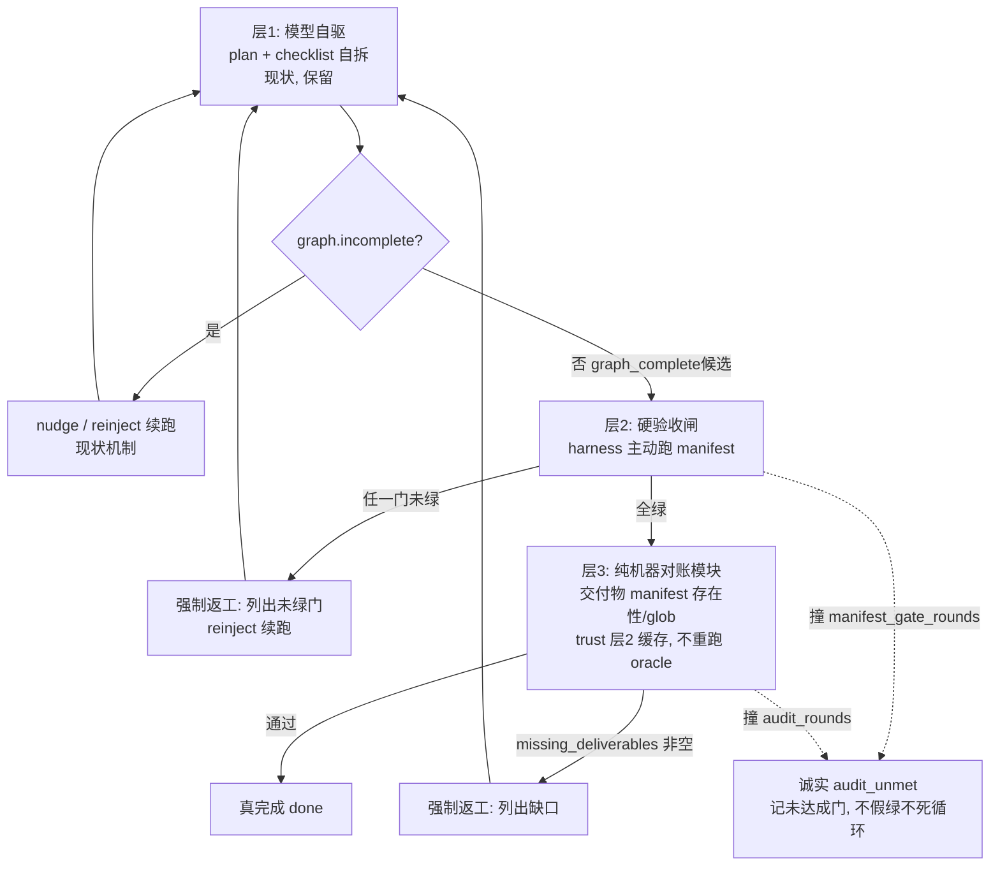

# 组合式 Harness — 规格锚定的完成门禁（Composable Harness / Spec-Anchored Completion Gate）

**状态:** 设计草案 **v0.7** + **P0/P1/P2 已实现** + **任务无关层2（§6.5）已实现** + **通用 stub/半成品门（§6.6）已实现**（面板见下 §11；MicroStack manifest 见 [`fixtures/harness/microstack-completion-gate.toml`](../../fixtures/harness/microstack-completion-gate.toml)）。**enforce 来源**已落 `CompletionGateConfig::sanitized_for_source(trusted)` 防御性护栏。**§6.5 新增**两个**零 per-task 配置、一个全局开关覆盖所有任务**的层2来源：模型 `[verify:]` 主动复跑 + 工具链探测 build/test 门。**§0.1** 新增设计动机的外部研究锚定（grounding signal 质量×独立性）；**§3.1 / §6.7** 钉死「法官 vs 缺口枚举器」边界，为对抗式审核员（路线图 #2）立设计原则。**仍未做:** §6.7 对抗式审核员、内置 `coverage-gate` 子命令。
**所属:** [`LHT_TEST_SUITE.md`](./LHT_TEST_SUITE.md) / [`LONG_HORIZON_CODE_TASKS.md`](./LONG_HORIZON_CODE_TASKS.md) / [`test-cases/microstack-framework.md`](./test-cases/microstack-framework.md)
**一句话:** 在「模型自产任务图清零」之上，叠加一道**算子声明、harness 主动真跑、exit-code 裁决**的完成门禁 + 一道**纯机器交付物对账**，未达标即强制返工迭代，有界循环直到按 manifest 真完成或诚实记 `audit_unmet`。**全程无 LLM 当法官**——裁决只取决于退出码与路径/glob 命中。

---

## 0. 为什么需要它（一句话动机）

现状的 LHT「完成」= **模型自产 checklist 的 `open_items` 清零**。这衡量的是「对自己计划的忠实度」，**不是「对规格目标的完成度」**。模型欠拆一个不完整的清单 → 跑到 0 → 合法 `graph_complete` 收尾。**「无早停」是真完成的必要不充分条件。**

### 0.1 外部研究锚定：grounding signal 的「质量 × 独立性」

本门禁体系不是临时补丁，而是与近期「持续学习 / 自我改进」研究的核心判断**同构**。Deli Chen（DeepSeek agent+harness 负责人）2026-06 的 continual-learning survey 给出一条对工程直接有约束力的结论：

> **自我改进的轨迹不取决于生成机制有多复杂，而取决于 grounding signal（锚定/评估信号）的质量，以及它相对于模型自身的独立性。没有可靠且独立的锚定信号，自我改进的循环最终必然退化——尤其在缺少外部验证器的语言任务中，模型会陷入「自我确认」：不断强化自己已相信的模式，而不一定更接近真实目标。**

「模型自报全部完成、build 也绿」正是**自我确认**的工程实例；本 harness 的完成门禁就是那个**外部 grounding signal**。由此推出本文件三条贯穿性设计原则（后续各层都服从）：

1. **信号质量 = 退出码 / 路径命中 oracle**，不是 LLM 散文判断（§3 铁律）。
2. **信号独立性有两层**——**规则独立**（机器扫描，不经模型推理，如 §6.6 stub 门）与**主体独立**（由建造者之外的主体产出，如 §6.7 对抗式审核员）。两层独立性叠加，才是论文所说「不退化」的锚定。
3. **独立性绝不能换成「另一个 LLM 盖章」**——否则把「建造者自我确认」平移成「审核者—建造者合谋确认」，独立性形同虚设（见 §3 与 §6.7 的「法官 vs 缺口枚举器」之分）。

> 同时认账一条边界（survey 同一判断）：**上下文管理 + 文档化记忆**（我们的 cycle / `handoff.md` / memory）能维持注意力、保留经验，但**注意力窗口终会填满，届时需要把知识参数化**——那属于训练侧，harness 层够不到。本 harness 只负责「**情节记忆 + 外部锚定**」这一半；参数化是另一条轴。

---

## 1. 背景与触发实证（MicroStack02）

把 [`microstack-framework.md`](./test-cases/microstack-framework.md) §1-B「生产级」prompt（目标 1.5–4 万行、24 类交付物、四门禁 + `[verify:]`）丢给模型执行，结果（线程 `thr_be2f4f1a` 同类欠拆 run）：

| 观测 | 值 |
|------|----|
| `incomplete_stop` | **0**（引擎不认为早停） |
| `gate_skip: graph_complete` | 3 次，`open_items:0` |
| `step_limit_continue` | 1 次（`open_items:8` 时确实续跑过——反早停在该步生效） |
| `nudge` / `reinject` | 0 / 0（图提前判完，自驱无机会触发） |
| git 基线 / `git diff contracts/` | ✅ 已建 / 空（接口稳定性纪律达标） |
| 产物 | 61 文件 / **7045 行**（远低于目标） |
| 覆盖率 | app **16.3%** / orm **4.7%** / config 62.4% / logger 68.4%（多包不达标） |
| 漏做 | gzip 中间件、`cmd/microstack/main.go`、交付物24「重构对抗」未执行、`e2e_todo.sh` 未实跑 |

**关键:** checklist / 进度条 / 节点**全部显示 100% 完成**——漏做项是「**压根没进任务图**」（欠拆解），不是谎标。模型甚至在收尾时自己列出「缺失的小功能」并反问「要继续吗?」——它知道没做完，但任务图说做完了。

---

## 2. 根因（代码定位）

`crates/runtime-server/src/long_horizon/mod.rs` 的 `maybe_continue_incomplete_code_task`：

```text
graph = CodeTaskGraph::from_snapshots(plan, checklist)
if graph.is_empty()         -> Skip("graph_empty")
if !graph.incomplete()      -> [DEMO3 防假绿闸] -> Skip("graph_complete")
...
```

- 完成判据 **完全来自 `plan` + `checklist` 两个模型自产快照**。
- 唯一的防假绿闸（DEMO3 guard）只**遍历 `checklist.items` 中已完成项**，抓「看着像验收却没真跑」的项（依赖 `verify.rs::verify_gate_verdict`）。
- **它抓不到「从未被加进 checklist 的交付物」**——因为遍历范围就是模型自己写的清单。

> **结论:** 完成度的上界 = 模型自拆清单的完整度。没有任何东西把「完成」绑定到外部规格的必需交付物 / 验收门。这是 MicroStack02「100% 完成却漏一半」的机制根因。

---

## 3. 第一性原则：oracle 锚定，不让任何 LLM 当法官

直觉方案是「完成后让一个 LLM 子代理审核，不过就返工」。方向对（要一道独立于建造者的门），但**走子代理是错的**，否则把「建造者欠拆」换成「审核者盖章放水」——两个模型合谋假绿：

> **一个靠「读一读、给 LGTM」的 LLM 审核员，本身是软的、非确定、可被忽悠、不可离线回放的 oracle**，直接违背本 harness 的核心铁律（见各测试用例与 DEMO3 横幅）：**最强信号是 exit-code oracle**（`go test`、`git diff --exit-code contracts/`、`[verify:]` 命令），「**全勾 ⇔ oracle 全 exit 0**」。

因此正确分工——**两道门都由机器裁决，exit code 与路径命中当「法官」，全程不引入 LLM 推理**：

| 判定项 | 谁裁决 | 怎么裁 |
|--------|--------|--------|
| **硬验收门** | **exit code（法官）** | harness **主动真跑** manifest 命令，逐条看退出码；**不**依赖模型「曾经跑过」的历史 |
| **交付物覆盖**（欠拆解失败模式） | **机器 manifest 对账（法官）** | 算子预声明 `{id, path\|glob, optional_verify_cmd}` 清单；默认用 **workspace 工作树路径/glob 存在性**对账（生成但未 `git add` 的文件也算产物），仅当条目显式 `tracked = true` 时才要求 `git ls-files` 命中；可选 per-item exit-code。**必须举出具体缺失项**（如「交付物24：无 `router/trie.go`、git log 无 refactor commit」），而非「看起来不完整」 |

第二行那种「**你压根没拆进清单的交付物**」——静态验收命令表达不了、而我们这次栽的洞——靠的不是 LLM 的「理解力」，而是**算子把规格里的必需交付物离线翻译成一张显式 manifest**，运行时只做存在性/命中对账。第一行硬门仍由退出码裁决，二者都**可离线回放、可回归比较**。

**关键决策（v0.3）:** 层3 **不是 LLM headless runner，而是与层2 同性质的纯 Rust 对账模块**。在本 harness 的 oracle 铁律下，交付物清单必须算子显式声明、机器对账，LLM 没有任何**非自由裁量**的活可干（自由读规格 = 把「欠拆解」换成「审核者漏读规格」，禁止）。因此层3 不需要 `agent_spawn`、不需要独立 LLM context、不产生 token 成本——这也大幅降低原 v0.2 把「headless audit runner」列为 P1 阻塞项的代价。§6.3 的结构化 JSON 是该模块的**纯函数输出**，不是某个 LLM 的回答。

### 3.1 例外的边界：「法官」禁止，「缺口枚举器」允许（§6.7 设计原则）

§3 反对的是**让 LLM 子代理当「法官」**——即赋予它**否决 / 盖章（pass/fail veto）**的权力。这与「能不能用一个独立的 LLM 主体**找出**缺口」是**两件事**，必须分清，否则会误杀 §6.7 的对抗式审核员（路线图 #2）：

| | 法官型审核员（**禁止**） | 缺口枚举器型审核员（**允许**，§6.7） |
|---|---|---|
| 权力 | 直接判 `pass`/`fail`、放行或拦截 | **无放行/否决权**；只产出「疑似缺口」候选 |
| 输出 | 「LGTM / 不通过」散文 | **机器可检验的断言**：`{file:line, 缺什么, 建议 [verify: cmd]}` |
| 谁最终裁决 | 它自己（软、可被忽悠、不可回放） | **仍是机器 oracle**——候选回灌后由 stub 门 / 退出码 / 路径对账裁决 |
| 失败模式 | 审核者—建造者合谋盖章（自我确认平移） | 最坏只是「多报几个假缺口」，被机器门一跑即证伪，**不会放水** |

**设计原则（写死）:** 对抗式审核员的产物**绝不直接进入 `graph_complete` 的放行/拦截判定**；它只能**扩大机器门的检查面**（把"模型没拆进 checklist、stub 门正则也没覆盖"的缺口，转译成新的 `[verify:]` / deliverable 条目或 stub 模式），最终绿不绿仍由退出码与路径命中说了算。这样它满足 §0.1 的「**主体独立**」却不违反「**信号质量 = 机器 oracle**」——独立性用来**拓宽**锚定信号，而非**替代**它。

---

## 4. 架构：三层组合（Composable）



- **层1（保留）:** 现有自驱（自拆 plan/checklist + nudge/reinject/step_limit_continue）。它是「让模型一直往前」的引擎，本身没问题。
- **层2 硬验收闸（exit-code manifest）:** 算子带进 run 的一组**必须 exit 0 的验收命令**（来自受信算子 config / 规格 `[verify:]` 表）。在 `!graph.incomplete()` → `Skip("graph_complete")` 之前插入：**gate 时刻由 harness 主动 exec 每条 manifest 命令**（受控 shell 或 `argv` 直接执行），任一非 0 即强制返工。纯机器判定，最便宜、最硬。**与现有 `recent_verification_cmds` 无关**——那是模型侧「跑过且 exit 0」的历史记录，层 2 不信任它。
- **层3 交付物对账（纯机器，无 LLM）:** 层2 全绿后，由 **runtime 侧纯 Rust 模块**（非 `agent_spawn`、非 LLM）同步执行：输入 = 交付物 manifest + 层2 本轮 oracle 缓存；动作 = workspace 工作树路径/glob 存在性对账（仅 `tracked = true` 条目额外查 `git ls-files`）+ 可选 per-item exit-code verify；输出结构化 `{pass, missing_deliverables[]}`（纯函数输出，非 LLM 回答）。**不重跑**层2 已缓存的 oracle 结果（同轮次 trust cache，控成本，见 §7.7「同轮」原子边界）。
- **闭环 + 有界:** 任一层失败 → 缺口作为合成 user 消息 reinject → 模型续做 → 再审。独立计数器封顶；耗尽 → **诚实 `audit_unmet`**（列出未达成门），不假绿、不死循环。

> **组合式 = 三层可独立开关。** 只跑层1=现状；层1+2=纯 exit-code 门禁（无 LLM，最确定）；层1+2+3=完整。算子按任务选组合。

> **Macro 第四维（Phase 4 规格，未实现）：** 大 refactor（~1.5–2W 行）在 micro 层1–3 之上叠加 **LHT 实现段 ↔ CRAFT 质检段 ↔ LHT 补全段** 宏观循环。完整规格：[`LONG_HORIZON_CODE_TASKS.md`](./LONG_HORIZON_CODE_TASKS.md) §6 Phase 4。**产品迭代 P0–P3**（strict/mismatch/manifest/测量）：同文档 **§6 产品迭代**。

---

## 5. 挂载点与可复用件

### 5.1 确定可复用

| 用途 | 现有件 | 路径 |
|------|--------|------|
| 完成判定 / 闸挂载点 | `maybe_continue_incomplete_code_task` 的 `!graph.incomplete()` 分支 | `long_horizon/mod.rs` |
| `[verify:]` 解析 / 模糊匹配（层2 **不**直接信任） | `parse_verify_command` / `verification_satisfied` / `verify_gate_verdict` | `long_horizon/verify.rs` |
| reinject 消息模式（合成 user 逼续跑） | `build_unverified_acceptance_nudge` 等 | `long_horizon/nudge.rs` |
| 覆盖不达标阻止收尾（audit scratchpad 专用） | `coverage_gate → CoverageGateOutcome::Block` | `scratchpad/` + `scratchpad_flow.rs` |
| 有界 nudge 计数模式 | `MAX_UNVERIFIED_ACCEPTANCE_NUDGES` / `LongHorizonSessionState` | `long_horizon/nudge.rs` |
| 状态扩展位（**禁止**给 `Engine` 加字段） | `EngineRuntimeExt.long_horizon_state` 字段于 `core/engine/runtime_ext.rs`；类型 `LongHorizonSessionState` 于 `long_horizon/nudge.rs` | 见 [`HARNESS_INTEGRATION_PROPOSAL.md`](./HARNESS_INTEGRATION_PROPOSAL.md) §7.1 |

### 5.2 仅借鉴模式，非直接复用

| 文档初稿误引 | 实际语义 | 本方案用法 |
|--------------|----------|------------|
| `maybe_continue_incomplete_audit` | **audit scratchpad P2** 未完成时逼续跑；且会 `audit_owns_path` **阻断 LHT** | 借鉴「合成 user 消息 + 列出缺口」格式；**不**走 audit scratchpad 路径 |
| `scratchpad/auditor.rs` | **安全审计** verified findings 筛选（track A） | **不**用于规格交付物对账；层3 需新 `long_horizon/completion_audit.rs`（名待定），**纯 Rust 模块、非 LLM** |
| `tools/subagent/factory.rs` 工厂 | 模型通过 `agent_spawn` 触发 LLM 子代理 | **不用**——v0.3 层3 已去 LLM 化为纯机器对账，无需 spawn/headless LLM runner（见 §3 关键决策） |

### 5.3 模型侧 exit 0 记录（现状，层2 不依赖）

`host_impl/mod.rs::record_long_horizon_tool_outcome` 在 `success`（工具层 exit 0）+ `exec_shell`/`run_tests` + 命令匹配 `VERIFICATION_RE` 时写入 `recent_verification_cmds`（仅命令文本，LRU 有界）。这支撑 DEMO3 **checklist 项级** verify gate，**不能**替代层2 harness 主动 manifest oracle。

---

## 6. Manifest 与审核协议（草案）

### 6.1 验收 manifest（层2）

算子 config 或测试案例文档显式列出；可选从规格文件抽取 `[verify:]` 行作辅助，**不以散文规格为唯一来源**。enforce 模式下的可执行 manifest **只接受用户全局配置或内置/受信测试夹具**；workspace 内 `.deepseek/config.toml`、issue/PR 文本、模型生成文档最多进入 observe/草案态，不能静默升级为会自动执行命令的 enforce manifest。

```toml
# ~/.zagens/config.toml 或算子 task config（草案字段名）
[long_horizon.completion_gate]
mode = "enforce"   # observe | enforce — 见 §7.3
max_manifest_rounds = 5

[[long_horizon.completion_gate.verify]]
id = "build"
cmd = "go build ./..."

[[long_horizon.completion_gate.verify]]
id = "contracts_stable"
cmd = "git diff --exit-code contracts/"

[[long_horizon.completion_gate.verify]]
id = "coverage_app"
# 裸 go test -cover exit 0 ≠ 覆盖率达标；须阈值门。
# 优先用仓库内置跨平台门（Windows 无 bash），shell=none 必须用 argv：
shell = "none"
argv = ["zagens", "coverage-gate", "--pkg", "app", "--min", "75"]
# 退路（仅 *nix 算子）：shell="bash", cmd="scripts/check_coverage.sh app 75"
```

> **覆盖率门跨平台（H2）:** 不要把验收正确性外包给每个算子手写的 `bash` 脚本（`win32` 无 bash、易写错）。优先提供**仓库内置子命令**做 `-coverprofile` 解析 + 包级阈值判定，`shell=none` 直接 `argv` 执行；手写脚本仅作 *nix 退路。`shell=none` **禁止**接收待拆分的 `cmd` 字符串，避免 Windows quoting / 路径空格 / 转义语义漂移。

层2 gate 逻辑：对每条 `verify` **harness 主动 exec** → 记录 `{id, command|argv, exit, stdout_tail}` → 任一 `exit != 0` → `LhtGateOutcome::NudgeManifestFailed`（新变体，待定名）+ reinject 未绿门列表。

### 6.2 交付物 manifest（层3）

```toml
[[long_horizon.completion_gate.deliverable]]
id = "gzip_middleware"
path = "middleware/gzip.go"

[[long_horizon.completion_gate.deliverable]]
id = "main_entry"
path = "cmd/microstack/main.go"

[[long_horizon.completion_gate.deliverable]]
id = "deliverable_24_refactor"
# 可选：除存在性外再跑一条 oracle
glob = "router/*trie*"
optional_verify_cmd = "go test ./router/... -run Refactor"

[[long_horizon.completion_gate.deliverable]]
id = "public_contract"
path = "contracts/server.go"
tracked = true  # 少数确需纳入 git 索引/基线的交付物才打开
```

MicroStack 完整 24 项清单应固化在 [`microstack-framework.md`](./test-cases/microstack-framework.md) 或算子 config，**不**在运行时从 v1.1 散文规格解析。层3 默认检查 workspace 当前工作树（路径存在、glob 命中、可选内容/命令 oracle），不要求模型执行 `git add`；`tracked = true` 是显式加强语义，适合 `contracts/` 这类本来就依赖 git 基线的探针。

### 6.3 层3 对账输出（纯函数结构化 JSON，非 LLM 回答）

```json
{
  "pass": false,
  "failing_gates": [],
  "missing_deliverables": [
    {"id": "gzip_middleware", "what": "middleware/gzip.go 不存在", "evidence": "workspace path 不存在"},
    {"id": "deliverable_24_refactor", "what": "Router trie 重构未执行", "evidence": "glob router/*trie* 零命中; git log 无 refactor commit"}
  ],
  "manifest_round": 2,
  "layer2_cache_trusted": true
}
```

- **裁决:** `pass = failing_gates.is_empty() && missing_deliverables.is_empty()`。
- 层3 正常路径 `failing_gates` 应为空（层2 已绿 + trust cache）；非空仅作层2/层3 不一致时的诊断字段。
- **`pass` 不取决于任何 LLM「觉得」**，只取决于 exit code 与 manifest 路径/glob 命中——本 JSON 是 Rust 对账模块的确定性输出，可离线回放、可快照回归。

### 6.4 层2 主动执行模型（实现契约，编码前必须钉死）

层2 要 harness **主动 exec** 任意 manifest 命令，这与 §7.5「对账只读」是两件事（层2 跑验收**必然有副作用**：build cache、`go test` 生成物、脚本写文件），必须先定执行契约：

| 维度 | 约定 |
|------|------|
| **平台** | 本仓库目标含 `win32`。manifest **不得假设 `bash` 存在**：每条 `verify` 用 `{cmd, shell?}` 或 `{argv, shell="none"}`；`shell` ∈ `pwsh`/`bash`/`cmd`/`none(直接 argv)`，缺省按平台选默认 shell；`shell="none"` 时必须提供 `argv: string[]`，禁止 runtime 自行 split 字符串；**优先提供仓库内置跨平台门子命令**（见 §6.1 覆盖率门），减少手写 `bash` 脚本 |
| **cwd** | 任务 workspace 根（与被测产物同根）；不得在 runtime 安装目录跑。所有 cwd / manifest 相对路径都必须 canonicalize 后确认仍在 workspace 内，禁止 `..` 逃逸与符号链接绕出 |
| **超时** | 每条命令独立 `timeout_secs`（缺省如 300s）；超时 = 视作该门**未绿**（非 crash），计入返工，stderr_tail 记 `timeout` |
| **崩溃 vs 断言失败** | 退出码 `!= 0` 一律判该门未绿并返工；但**区分记录** `exit_class`：`assertion`（test red 等正常红）vs `infra`（命令找不到 / 段错误 / OOM / 超时）。`infra` 类连续 N 次 → 倾向 `audit_unmet(reason=gate_infra_error)` 而非无限逼模型「修一个其实是环境的问题」 |
| **副作用** | **接受**层2 命令改 workspace（build/test 产物）；§7.5 的「只读」仅约束**层3 对账**与任何审核逻辑，不约束层2 跑验收。实现上必须在 gate 前后记录 harness-side-effect signature，并在更新 `last_nudge_git_signature` / `progress_via_git` 基线时排除本轮 gate 自己造成的变化，确保层2 跑完后的 git 工作树变化**不算**模型的交付进展 |
| **沙箱 / 授信** | enforce manifest 来自用户全局配置 / 内置测试夹具 / 明确受信算子配置；workspace 项目配置、issue/PR 文本、模型生成文件不得自动获得 enforce 执行权（由 `CompletionGateConfig::sanitized_for_source(trusted=false)→observe` 强制）。**已实现的安全链路：** ① 危险命令分析（`analyze_command`→`Dangerous` 拦截）**两条执行路径都过**（shell 包装路径 + `shell=none` 的 argv 路径）；② shell 路径走 `ShellManager.execute_with_options_env`，**继承该 manager 已配置的 sandbox policy**；③ 每条命令独立取消/超时；④ `manifest_gate_start/result` 结构化事件 + sidecar 审计。**注意：** `shell=none` 的 argv 走 `std::process::Command` 直执（不经 shell 包装、避免 quoting 漂移），已加危险分析但不额外套 sandbox 包装——因 manifest 仅来自受信来源。`VERIFICATION_CMD_RE` 是**记录**用正则，**不**作为 manifest 命令的准入白名单 |
| **turn loop / UI** | 层2 运行发生在 no-tool 收尾候选路径，会阻塞放行 `graph_complete`。必须发 `long_horizon.manifest_gate_start/result` 状态事件，支持用户取消，输出只保留 tail/摘要，禁止多个 gate 评估并发重入同一 session |

---

## 6.5 任务无关的层2来源（零配置，覆盖所有任务）

§6.1 的算子 manifest 是 **per-task 手写**的——它能拦"欠拆解"，但天然不可规模化（§7.9：把"模型欠拆"平移成"算子欠写 manifest"）。**层2 的价值内核不是那张命令表，而是"harness 主动跑、退出码当法官"这个动作**，而这个动作可以由两个**任务无关、零 per-task 配置**的来源喂命令，用**一个全局开关**覆盖所有代码任务：

| 来源 | `VerifySource` | 命令从哪来 | 授信 |
|------|----------------|------------|------|
| **算子 manifest** | `operator` | §6.1 手写 `verify` 列表（per-task） | 受信全局配置 / 夹具 |
| **模型 `[verify:]` 复跑** | `model_declared` | 收尾时扫描**已完成 checklist 项**里模型自己写的 `[verify: cmd]`，主动 exec | **无新增授信面**——这些命令本就在模型既有 exec 权限内，它自己就能跑；仅多了"harness 替它再真跑一遍看退出码" |
| **工具链探测门** | `toolchain` | 探测 workspace 根的 `go.mod`/`Cargo.toml`/`package.json`/`pyproject.toml`/`pom.xml`/`build.gradle*` → 跑该工具链 canonical build/test | 内置固定命令 |
| **stub/半成品门** | （非 verify 条目，独立扫描层） | 收尾时对工作区**纯文件扫描**高信号「故意未完成」标记（`todo!()`/`unimplemented!()`/`NotImplementedError`/"not implemented" 抛出） | 内置；不可信来源 enforce 自动降 observe |

```toml
[long_horizon.completion_gate]
# 现状（per-task）：
mode = "observe"            # 管 operator manifest 的 enforce/observe
# 新增（任务无关，一个全局开关覆盖所有任务）：
auto_verify_replay = "enforce"   # off | observe | enforce —— 复跑模型自己的 [verify:]
toolchain_gate     = "observe"   # off | observe | enforce —— 工具链 build/test 门
stub_gate          = "observe"   # off | observe | enforce —— stub/半成品扫描（省略=observe）
```

> **stub/半成品门**（表中第 4 行）不是 verify 命令条目，而是一条**独立的纯扫描层**，完整规格见 **§6.6**。它与上面三类 verify 来源正交：先跑、不 exec。

**评估模型（每条 verify 按自己来源的 mode 裁决，单轮可混合 enforce/observe）：**
- 三来源命令合并去重（按归一化命令，优先级 **operator > toolchain > model**），一次 harness-active 跑完；
- 失败按来源拆成 **enforced**（该来源 mode=enforce）与 **observed**（mode=observe）：
  - 有 enforced 失败 → 走 §7 的有界返工/诚实耗尽，**不放行 `graph_complete`**；列表只列 enforced 失败项；
  - 只有 observed 失败 → 记 `first_gap_count` + `ObserveManifestGate` 遥测，**允许收尾**；
  - infra-strike 只在 **enforced 失败子集** 上累计（observe 的环境错误绝不逼模型）；
- 层3 只在**无 enforced 层2 失败**时进入（§7.7 同轮 trust）。
- 全 `off` 且无算子 manifest → 行为与现状逐字节一致（`is_active()=false`）。

**遥测：** `manifest_gate_result` 载荷新增 `sources:{operator,model_declared,toolchain}` 计数 + `enforced_failing`/`observed_failing`；面板摘要卡新增一行 `通用层2：[verify:] 复跑 X · 工具链门 Y`。

**与算子 manifest 的分工（结论）：** 层2 的 **build/test/lint 类假绿**这一半，应优先靠**任务无关来源**覆盖（零配置、对所有任务生效）；算子 manifest 收窄为**回归夹具 + 少数高价值任务的层3 交付物对账**（"欠拆解"那一半，不可规模化、永远是少数派）。

实现：`crates/runtime-server/src/long_horizon/generic_gate.rs`（提取/探测/去重）+ `completion_gate_flow.rs`（按来源拆 enforce/observe）。

---

## 6.6 通用 stub/半成品门（规则独立的锚定信号，**已实现**）

**定位（§0.1 第 1 类独立性「规则独立」）：** 堵最常见的假完成——**「项目能编译、`cargo build --release` exit 0、二进制也产出，但功能其实还是 stub」**。绿色构建掩盖了缺失实现；§6.5 的 build/test 门**证明不了**这一点（stub 恰恰能编过）。本门用**机器正则扫描**做一道与模型推理无关的锚定，是论文「grounding signal 独立性」中**不经模型自由裁量**的那一极。

**触发点：** 在 `graph_complete` 候选时、**先于** §6.5 层2/层3 跑——因为它是**纯文件系统扫描、零命令执行**：既然有 stub 就没必要再花分钟级去跑 build「证明」一个掩盖了缺失功能的绿。

**判定（两档，严格区分以防 enforce 误伤）：**

| 档 | 标记 | enforce 行为 |
|----|------|--------------|
| **阻断级**（高信号「故意未完成」） | `todo!()` / `unimplemented!()`（Rust 宏，编过但运行即 panic）、`NotImplementedError` / `raise NotImplementedError`、`throw`/`panic!`/`raise`/`return`/`reject` 携带 "not implemented" 的句子（语言无关） | **命中即顶回** `graph_complete` |
| **仅记录** | `TODO` / `FIXME` 裸注释 | **永不阻断**（真实代码里太常见，enforce 会误伤；只进遥测计数） |

**配置：** `[long_horizon.completion_gate] stub_gate = "off" | "observe" | "enforce"`，**省略即 `observe`**（先量后调）——一旦 operator 启用任何完成门禁，默认就把 stub 计数浮现到遥测；要静默显式 `"off"`，要阻断设 `"enforce"`。不可信来源的 `enforce` 由 `sanitized_for_source` 自动降 `observe`（drive-by 配置不得阻断 turn）。

**有界 + 诚实停：** `enforce` 命中即回灌强制返工的双语 nudge（`build_stubs_found_nudge`，列 `file:line` + 片段，上限 12 行），由 `max_manifest_rounds` 兜底防止对模型修不掉的 stub 空转；耗尽记 `audit_unmet`（`reason=stub_rounds_exhausted`）。

**扫描边界（成本/噪声）：** 跳过 `node_modules`/`target`/`dist`/`.git` 等依赖产物目录、仅看源码扩展名、按文件数 / 命中数 / 单文件字节封顶，跑在 `spawn_blocking`（不占 async reactor）。

**可观测：** 遥测 `long_horizon.stub_gate`（`{mode, blocking, todo, total, sample}`）；阻断走**独立的** `LhtGateOutcome::NudgeStubsFound` 节点，与 verify 命令失败（`NudgeManifestFailed`）区分，面板/`sidecar.log` 一眼看出是「编过但功能缺」被顶回。

**实现：** `crates/runtime-server/src/long_horizon/stub_gate.rs`（扫描器 + 4 单测）+ `completion_gate_flow.rs::evaluate_stub_gate`；config 见 `crates/core/src/long_horizon/completion_gate.rs`。

---

## 6.7 对抗式只读审核员（**待实现 · 路线图 #2 · 主体独立的锚定信号**）

**定位（§0.1 第 2 类独立性「主体独立」+ §3.1 边界）：** stub 门（§6.6）是「规则独立」，但正则覆盖不了的缺口（如「函数体只 `return Ok(())` 占位、却无任何标记」「整模块没进 checklist」）需要**另一个主体**来发现。这正是论文强调的「评估信号相对模型自身的**独立性**」——但**必须**按 §3.1 实现为**缺口枚举器**，而非法官。

**设计原则（写死，不可违反）：**
1. **无放行/否决权。** 审核员的输出**绝不直接进入** `graph_complete` 放行/拦截判定。
2. **只读。** 读 plan + diff + 工作树，**不许改被测产物**（同 §7.5：防替建造者把活干了，污染「模型能否自完成」的测量）。
3. **产物必须机器可检验。** 输出形如 `{file:line, 缺什么, 建议 [verify: cmd] 或 deliverable 条目 或 stub 模式}`，而非「LGTM / 看起来不完整」散文。
4. **回灌后仍由机器裁决。** 候选缺口转译成 §6.5 的 `[verify:]` / §6.2 的 deliverable / §6.6 的 stub 模式，**最终绿不绿由退出码与路径命中说了算**。最坏失败模式只是「多报几个假缺口」，被机器门一跑即证伪，**不会放水**。
5. **有界 + 成本可控。** 复用 `subagent` 设施，但每轮调用次数 / token 有上限；与 §7.1 的有界循环、诚实耗尽对齐。

**与既有 §3 铁律的关系：** §3 禁止的是「LLM 法官」（软、可被忽悠、不可回放、会与建造者合谋盖章）；§6.7 是「LLM 缺口枚举器」（独立主体**拓宽**机器锚定信号的检查面，而非**替代**它）。二者经 §3.1 表格严格区分，互不矛盾。

**状态：** 设计已定，待实现。实现时落 `crates/runtime-server/src/long_horizon/` 下新模块 + 复用 `tools/subagent`，遥测节点 `long_horizon.adversarial_audit`。

---

## 7. 护栏（缺一不可）

1. **有界循环 + 诚实耗尽:** 独立计数器 `manifest_gate_rounds`（层2）与 `audit_rounds`（层3），与 `MAX_UNVERIFIED_ACCEPTANCE_NUDGES`（DEMO3，当前=2）**分开**；各自 config 可调。耗尽 → 记 `audit_unmet` + 未达成门列表，**不假绿、不死循环**。重集成模块（Kafka/gRPC/哨兵）起不了真服务时尤其靠这条兜底。
2. **opt-in:** 仅当算子提供 `completion_gate.verify` / `deliverable` manifest 时启用对应层；否则行为与现状完全一致（不污染 DEMO3/CCR 等任务）。
3. **observe vs enforce（测量语义）:** `mode = observe` 时层2/3 **只记录**缺口与遥测、**不** reinject（保留「模型能否自驱完成」的观测价值，MicroStack02 即此类发现）；`mode = enforce` 时才强制返工。**把 `audit_unmet`、各轮缺口数、首轮缺口数本身当成新评测指标**，既能在 enforce 下强制完成、又能在 observe 下保留「模型一开始欠拆了多少」。
4. **与 step 预算的关系:** manifest/audit reinject **消耗正常 step 预算**（与 nudge 相同语义）；撞 `max_steps` 时现有 `step_limit_continue` 仍优先于 `graph_complete`，但 manifest 未绿时 **`graph_complete` 不得放行**。若 step 与 manifest 轮次同时耗尽 → `audit_unmet`（注明 `reason=steps_and_manifest_exhausted`）。
5. **层3 对账只读:** 层3 交付物对账（及任何审核逻辑）**不许改被测产物**（防替建造者把活干了 → 污染「模型能否自完成」的测量）。注意：**层2 主动跑验收命令允许有副作用**（见 §6.4），二者边界不同。
6. **成本有界:** 层2 oracle 每轮一次（7K 行秒级、40K 行分钟级）；层3 纯对账几乎零成本、不重跑层2 cache；N 轮封顶。
7. **层2→层3「同轮」原子边界:** 「层3 信任层2 cache、不重跑 oracle」只在**同一次 gate 评估的原子区间**内成立——即从「层2 全绿」到「层3 对账」之间**模型不得插入任何工具调用 / step**。该区间内顺序执行层2 exec → 层3 对账，二者共享同一份 oracle 缓存与 git 工作树快照。任一层判未达标 → 退出原子区间、reinject、模型续做 → **下一轮重新跑层2**（cache 不跨轮复用），避免基于陈旧绿灯放行。
8. **返工与 nudge tracker 的优先级（必须明确，否则死结）:** 层2/3 的强制返工**优先于** `NudgeTracker` 的 `Blocked` / `max_nudges_per_item`（见 `nudge.rs::prepare_nudge`）——只要 manifest 未达标且 `manifest_gate_rounds`/`audit_rounds` 未耗尽，就继续 reinject，**不被 `blocked` 静默吞掉**（`blocked` 是「自驱续跑」语义的给气阀，而 gate 是「按规格必须达标」的硬约束，后者更强）。但**两套有界计数器各自独立封顶**：gate 轮次耗尽 → `audit_unmet`，与 nudge `blocked` 互不重置。若 gate 仍想返工但 nudge 已 `blocked` 且本轮无 git 进展 → 仍 reinject（消耗 gate 轮次），但遥测记 `gate_reinject_while_blocked` 以便观测「模型卡死但被门反复逼」的病态。
9. **适用边界（诚实声明，不可省）:** 本机制完成度上界 = **manifest 完整度**，**不是规格散文本身**。它保证「**manifest 内的交付物/门不被漏做**」，但**不解决「规格里有、manifest 没列」**——那等于把 v0.2 之前的「模型欠拆清单」平移为「算子欠写 manifest」。净收益在于：manifest 是规格的**离线、可评审、可回归、可复用**的人工子集，比「模型每次临场自拆」稳定得多。§0 动机里「衡量对规格目标的完成度」应理解为「衡量对 manifest 化规格的完成度」。
10. **交付物对账默认看工作树:** 层3 的 `path`/`glob` 默认判定对象是 workspace 当前工作树，而不是 git 索引；否则模型已生成但未暂存的文件会被误判缺失。需要“必须纳入 git 基线”的条目用 `tracked = true` 显式声明，并在 evidence 中区分 `path_missing`、`glob_empty`、`untracked`、`verify_failed`。

---

## 8. Plan 阶段待定项（含已核实结论）

| # | 项 | 状态 / 建议默认 |
|---|-----|----------------|
| 1 | manifest 来源 | 算子 config 显式列表（推荐）+ 可选从规格抽 `[verify:]`；交付物必须显式 manifest。enforce 可执行命令只接受用户全局配置 / 内置测试夹具 / 明确受信算子配置，workspace/issue/模型生成内容默认只能 observe |
| 2 | exit-code 追踪 | **已核实:** 模型侧 `success`→exit 0 才记入 `recent_verification_cmds`。**层2 仍须新建** harness 主动 exec + 本轮 `ManifestGateResult` 缓存；不可复用 recent 历史 |
| 3 | 层2 与层3 顺序 | **层2 全绿 → 层3**；层3 trust 层2 cache，不重跑 oracle |
| 4 | `audit_unmet` 落点 | 新 `LhtGateOutcome` 变体（如 `AuditUnmet` / `NudgeManifestFailed`）+ `long_horizon.manifest_gate` / `long_horizon.audit_unmet` 节点 + 遥测字段（首轮缺口数、轮次） |
| 5 | 层3 对账模块（**已去 LLM**） | **v0.3 定:** 纯 Rust 模块 `long_horizon/completion_audit.rs`，非 `agent_spawn`、非 headless LLM runner、零 token 成本；层2 exec 走 sandbox（执行模型见 §6.4），不再是 P1「LLM runner」阻塞项 |
| 6 | 覆盖率门 | manifest 须用阈值脚本/内置子命令（`-coverprofile` + 包级阈值），禁止裸 `go test -cover` 当唯一门；`shell=none` 必须使用 `argv` |
| 7 | 与 audit scratchpad 互斥 | 当 `audit_owns_path` 时 LHT 已被阻断；completion gate 与 audit scratchpad **不同时**拥有完成路径 |
| 8 | 层3 路径语义 | 默认工作树路径/glob 存在性；仅 `tracked = true` 时要求 `git ls-files` 命中 |

---

## 9. 机制自身的验收 oracle（怎么证明它有效）

用 **MicroStack02 同款欠拆场景**做回归（manifest 见 [`microstack-framework.md`](./test-cases/microstack-framework.md)）：

| 场景 | 开关 | 期望 |
|------|------|------|
| **负样本 — 欠拆解** | enforce + 层2+3 | **不再 `graph_complete`**；reinject 列出 gzip/main/交付物24/覆盖率缺口；补齐后 manifest 全绿 + `missing_deliverables` 空才 done。**仅层2 拦不住「压根没进图」的交付物** → 负样本必须层2+3 全开 |
| **负样本 — 仅清单假绿** | enforce + 仅层2 | 覆盖率/script 门未绿 → reinject；可验 DEMO3 式「清单全勾但 oracle 未绿」 |
| **正样本** | enforce + 层2+3 | 真按规格做完 → 一轮即 `pass`，不误伤 |
| **诚实耗尽** | enforce，故意 impossible 门（如必需真 Kafka） | N 轮后 `audit_unmet`，不死循环、不假绿 |
| **观测模式** | observe + 层2+3 | 欠拆 run 仍 `graph_complete` 收尾，但遥测记录首轮缺口（保留 MicroStack02 类发现） |
| **默认零影响** | 无 manifest | 行为与现状逐字节一致（快照对比） |

---

## 10. 分期实施建议

- **P0（纯机器，先落）:** 层2 harness 主动 manifest oracle（执行模型见 §6.4，先落安全执行适配层）+ `ManifestGateResult` 缓存 + `NudgeManifestFailed` / `audit_unmet` + `observe`/`enforce` config 骨架 + **observe 缺口数据最小落点**（先写 `sidecar.log` `[lht-probe]` 行 + 一个 `long_horizon.manifest_gate` 节点，不依赖 P2 面板）。**独立受益场景（不依赖 P1）:** 覆盖率/script 门、`git diff contracts/`、清单**已列**但没真跑的 `[verify:` 等价门（DEMO3 式假绿的强化版）——这些 P0 单独就能拦。**不能拦住:** 压根没进 checklist、也没进 deliverable manifest 的项（MicroStack02 的 gzip/交付物24 属于此类，要 P1）。
- **P1（欠拆解核心，纯机器）:** 交付物 manifest + 层3 纯 Rust 对账模块 `long_horizon/completion_audit.rs`（**非 LLM、非 spawn**，见 §3 关键决策）。**MicroStack02 负样本回归依赖 P0+P1 同时就绪。**
- **P2（可观测性）:** 把 P0 的最小落点升级进 LHT 面板 Nodes Tab（`manifest_gate` / `audit_unmet` / 首轮缺口数 / 轮次 / `gate_reinject_while_blocked`）+ 离线 `[lht-probe]` grep 模板 + `microstack-framework.md` §5 判定矩阵引用本方案。

---

## 11. P2 可观测性（已实现）

### 11.1 LHT 面板 · Nodes Tab

当 `harness.task_graph` 载荷含 `completion_gate.active=true` 时，**Nodes** 页顶部展示摘要卡：

| 字段 | 含义 |
|------|------|
| `mode` | `observe` / `enforce` |
| `manifest_round` / `audit_round` | 层2/层3 已评估轮次 |
| `first_gap_count` | 首轮记录的缺口数（observe/enforce 均可作评测指标） |
| `gate_reinject_while_blocked` | gate 返工时 nudge 已 blocked 的次数 |
| `last_manifest_passed` / `last_audit_pass` | 最近一次层2/层3 结果 |
| `last_unmet_reason` | 诚实 `audit_unmet` 原因 |

节点流（时间倒序）着色：`manifest_gate_*` / `completion_audit` / `audit_unmet` 与既有 `verify_gate` / `gate_skip` 并列。

实现：`crates/desktop/web-ui/src/components/LongHorizonPanel.tsx`；遥测缓存 `runtime_threads/manager.rs` + `long_horizon/completion_gate_panel.rs`。

### 11.2 离线 `[lht-probe]` grep 模板

```powershell
$log = "$env:USERPROFILE\.zagens\logs\sidecar.log"

# 组合式门禁全流程
Select-String -Path $log -Pattern 'manifest_gate_start|manifest_gate_result|completion_audit|audit_unmet|manifest_gate:'

# 与 LHT 通用节点并列
Select-String -Path $log -Pattern '\[lht-probe\].*long_horizon\.'

# MicroStack 欠拆回归：不应在缺口未补前 graph_complete（enforce）
Select-String -Path $log -Pattern 'gate_skip.*graph_complete'
Select-String -Path $log -Pattern 'audit_unmet|manifest_gate_result.*"passed":false'

# 首轮缺口（observe 模式保留 MicroStack02 类发现）
Select-String -Path $log -Pattern 'first_gap_count|observe.:true'
```

bash 等价：

```bash
LOG=~/.zagens/logs/sidecar.log
rg 'manifest_gate_start|manifest_gate_result|completion_audit|audit_unmet' "$LOG"
rg '\[lht-probe\].*long_horizon\.' "$LOG"
```

### 11.3 测试案例交叉引用

- [`test-cases/microstack-framework.md`](./test-cases/microstack-framework.md) §5–§7：规格锚定完成判定 + manifest 夹具 + grep 扩展
- [`LHT_TEST_SUITE.md`](./LHT_TEST_SUITE.md) §观测准则：Nodes Tab + `[lht-probe]` 并用

---

**修订记录:**
- 2026-06-01 修订 v0.7（grounding-signal 锚定 + stub 门落地 + 审核员设计原则）：① **§0.1 外部研究锚定**——把整套门禁的设计动机对齐近期「持续学习/自我改进」survey（Deli Chen，DeepSeek agent+harness 负责人，2026-06）的核心判断「**自我改进取决于 grounding signal 的质量×独立性，缺独立锚定必然退化为自我确认**」；提炼三条贯穿性原则（信号质量=机器 oracle、独立性分「规则独立/主体独立」两层、独立性不得换成另一个 LLM 盖章），并认账「上下文/文档化记忆有界、参数化属训练侧」的边界。② **§6.6 通用 stub/半成品门（已实现）**——规则独立的锚定：`graph_complete` 时纯文件扫描高信号「故意未完成」标记（`todo!()`/`unimplemented!()`/`NotImplementedError`/"not implemented" 抛出）即顶回，`TODO`/`FIXME` 只记不拦；`stub_gate=off|observe|enforce`（省略=observe），先于层2/3 跑、`spawn_blocking`、`max_manifest_rounds` 兜底、独立 `NudgeStubsFound` 节点 + `long_horizon.stub_gate` 遥测；不可信来源 enforce 自动降 observe。③ **§3.1 + §6.7 「法官 vs 缺口枚举器」**——为对抗式只读审核员（路线图 #2，主体独立）立设计原则：**无放行/否决权、只读、产物机器可检验、回灌后仍由机器裁决**，以此调和 §3「禁止 LLM 当法官」铁律（独立性用来**拓宽**锚定信号而非替代）。Files: `crates/core/src/long_horizon/completion_gate.rs`、`crates/runtime-server/src/long_horizon/{stub_gate.rs(新),completion_gate_flow.rs,nudge.rs,gate_telemetry.rs,mod.rs}`、`.../turn_loop/host_impl/no_tool_uses.rs`、本文件、`CHANGELOG.md`。
- 2026-05-31 创建 v0.1：基于 MicroStack02 实证提出三层组合 harness；核心结论：审核子代理 oracle 锚定，exit code 当法官。
- 2026-05-31 修订 v0.2（Plan 审核吸收）：① 层2 明确为 **harness 主动 exec**，不依赖 `recent_verification_cmds`；② 层3 交付物改为 **机器 manifest**，禁止 LLM 自由读规格；③ 收窄 §5 可复用件（auditor/audit_continue/subagent _factory 仅借鉴模式）；④ 补充 observe/enforce、独立轮次计数、step 预算交互；⑤ 核实模型侧 exit 0 记录已有；⑥ P0/P1 能力边界写清；⑦ 新增 manifest schema 草案与 headless runner P1 阻塞项；⑧ 架构约束：状态进 `LongHorizonSessionState`，不给 `Engine` 加字段。
- 2026-05-31 修订 v0.3（第二轮代码核对吸收）：**C1** 解决「层3 LLM 在 oracle 铁律下无活可干」的自相矛盾——层3 **去 LLM 化**为纯 Rust 对账模块 `completion_audit.rs`，删除 headless LLM runner / `agent_spawn` 依赖，P1 不再是 LLM 阻塞项（§3 关键决策 / §4 / §5.2 / §6.3 / §8#5 / §10）；**C2** §7.9 诚实声明适用边界：完成度上界 = manifest 完整度，非规格散文本身（「模型欠拆」→「算子欠写 manifest」的平移）；**H1/H2** 新增 §6.4「层2 主动执行模型」（Windows/shell 选择、cwd、超时、crash vs assertion 的 `exit_class`、副作用边界、sandbox 授信）+ §6.1 覆盖率门改仓库内置跨平台子命令；**H3** §7.8 定 gate 返工 vs `NudgeTracker.Blocked`/`max_nudges` 优先级；**H4** §7.7 定层2→层3「同轮」原子边界（中间不得插模型 step，cache 不跨轮）；**M1** §10 写清 P0 独立受益场景；**M2** §10 给 observe 模式 P0 最小遥测落点；**S1** §5.1 修正 `long_horizon_state` 字段路径（`runtime_ext.rs` vs `nudge.rs`）。核对结论：方案对代码的全部论断（`maybe_continue_incomplete_code_task` 根因、DEMO3 guard 遍历范围、`verify.rs`/`nudge.rs` 可复用件、`record_long_horizon_tool_outcome`→`recent_verification_cmds`、`EngineRuntimeExt.long_horizon_state`、scratchpad/subagent 现状）经逐一核实属实。
- 2026-05-31 **P2 落地：** LHT Nodes Tab 完成门禁摘要 + 节点着色；`completion_gate` 字段进入 `harness/task-graph`；§11 离线 grep 模板；`microstack-framework.md` §5–§7 交叉引用更新。
- 2026-05-31 修订 v0.4（安全与执行契约收紧）：① enforce manifest 可执行命令的来源收紧为用户全局配置 / 内置测试夹具 / 明确受信算子配置，workspace/issue/模型生成内容默认只可 observe；② `shell=none` 改为强制 `argv`，禁止 runtime 拆分字符串；③ 层3 `path`/`glob` 默认对账 workspace 工作树，只有 `tracked = true` 才要求 `git ls-files`；④ §6.4 明确必须走与 `exec_shell` 等价或更强的安全链路（exec policy、危险命令分析、sandbox、取消/超时、审计），并补 canonicalize/no-escape、gate start/result 事件、防并发重入；⑤ 层2 副作用不得污染 `progress_via_git`，实现需记录并排除 harness-side-effect signature。
- 2026-05-31 修订 v0.6（任务无关层2 / 规模化补集）：吸收"改进应面向所有任务、而非一个个手写 per-task 配置"的结论，新增 **§6.5 任务无关的层2来源**——把"harness 主动跑、退出码当法官"这个价值内核从手写 manifest 解耦出来，由两个**零 per-task 配置、一个全局开关覆盖所有代码任务**的来源喂命令：① **模型 `[verify:]` 复跑**（收尾时主动 exec 已完成 checklist 项里模型自己声明的验证命令，把"声称跑过"变成退出码 oracle；**无新增授信面**——命令本就在模型 exec 权限内）；② **工具链探测门**（探测 `go.mod`/`Cargo.toml`/`package.json`/… 跑 canonical build/test）。三来源（operator/model/toolchain）合并去重后一次跑完，**每条按自己来源的 mode 裁决**（单轮可混合 enforce/observe）；infra-strike 只在 enforced 子集累计；层3 只在无 enforced 层2 失败时进入。算子 manifest 据此**重新定位**为回归夹具 + 少数高价值任务的层3交付物对账（"欠拆解"那一半不可规模化、永远少数派）。`manifest_gate_result` 遥测 + 面板摘要新增来源计数与 enforced/observed 拆分。新增单测：`[verify:]` 提取/去重、工具链探测、合并优先级；`long_horizon` 45/0、core 2/0、web-ui 严格构建全绿。Files: `crates/core/src/long_horizon/completion_gate.rs`、`crates/runtime-server/src/long_horizon/{generic_gate,completion_gate_flow,gate_telemetry,completion_audit,manifest_gate,nudge,completion_gate_panel}.rs`、`.../runtime_threads/manager.rs`、`crates/desktop/web-ui/{.../LongHorizonPanel.tsx,.../types/longHorizon.ts,.../i18n/locales/*}`。
- 2026-05-31 修订 v0.5（实施审查吸收）：依据对 P0/P1/P2 落地代码的逐文件审查补齐四项：**①【安全链路】** `shell=none` 的 argv 直执路径补 `analyze_command` 危险命令分析（此前仅 shell 包装路径有），消除危险命令绕过；§6.4 据实校正——shell 路径已继承 `ShellManager` 的 sandbox policy、argv 路径因受信来源直执不另套 sandbox。**②【enforce 来源护栏】** 新增 `CompletionGateConfig::sanitized_for_source(trusted)`：非受信来源的 enforce 自动降级 observe；当前 loader 只读单一受信路径（`resolve_load_config_path`）故传 `true`，留作未来 workspace overlay 的强制钩子（须传 `false`）。**③【observe 语义】** infra-strike 的 `AuditUnmet` 仅在 enforce 触发，observe 维护计数器但绝不强停（§7.3）。**④【shell 引号加固】** `wrap_shell_command` 改用单引号转义（pwsh `''`、bash `'\''`）、cmd 双引号包裹，并补单测；复杂命令仍推荐 `shell=none`+argv。配套单测：argv/分类/wrap、来源降级，全绿。
