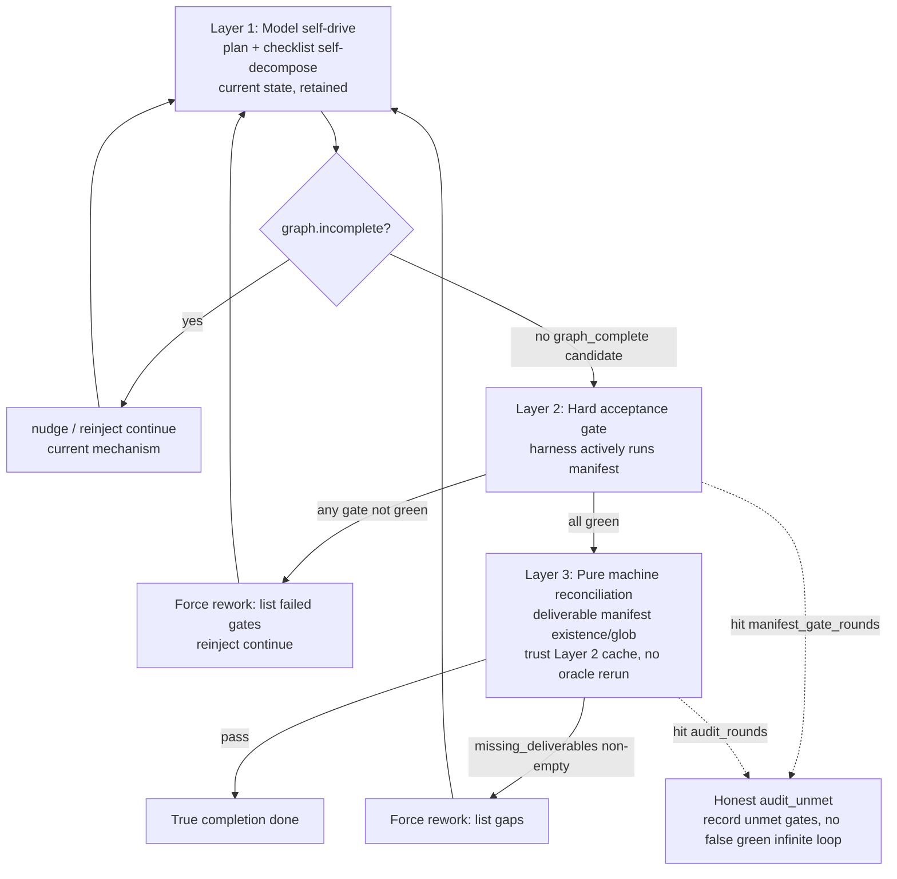

# Composable Harness — Spec-Anchored Completion Gate

**Status:** Design draft **v0.7** + **P0/P1/P2 implemented** + **task-agnostic Layer 2 (§6.5) implemented** + **generic stub/incomplete gate (§6.6) implemented** (panel see §11 below; MicroStack manifest at [`fixtures/harness/microstack-completion-gate.toml`](../../fixtures/harness/microstack-completion-gate.toml)). **enforce source** landed via `CompletionGateConfig::sanitized_for_source(trusted)` defensive guard. **§6.5 adds** two **zero per-task config, one global switch covering all tasks** Layer 2 sources: model `[verify:]` proactive replay + toolchain-detected build/test gates. **§0.1** adds external research grounding for design motivation (grounding signal quality × independence); **§3.1 / §6.7** nail down the "judge vs gap enumerator" boundary, establishing design principles for the adversarial auditor (roadmap #2). **Still TODO:** §6.7 adversarial auditor, built-in `coverage-gate` subcommand.
**Part of:** [`LHT_TEST_SUITE.md`](./LHT_TEST_SUITE.md) / [`LONG_HORIZON_CODE_TASKS.md`](./LONG_HORIZON_CODE_TASKS.md) / [`test-cases/microstack-framework.md`](./test-cases/microstack-framework.md)
**One-liner:** On top of "model self-produced task graph cleared to zero", add a **operator-declared, harness-actively-runs, exit-code adjudicated** completion gate + a **pure machine deliverable reconciliation** layer; if not met, force rework iterations in a bounded loop until manifest-true completion or honest `audit_unmet`. **No LLM as judge anywhere** — adjudication depends only on exit codes and path/glob hits.

---

## 0. Why We Need It (One-Line Motivation)

Today's LHT "completion" = **model self-produced checklist `open_items` cleared to zero**. That measures "fidelity to one's own plan", **not "completion against spec goals"**. Model under-decomposes an incomplete checklist → runs to 0 → legitimately ends with `graph_complete`. **"No early stop" is necessary but not sufficient for true completion.**

### 0.1 External Research Grounding: Grounding Signal "Quality × Independence"

This gate system is not a stopgap patch; it is **isomorphic** to a core judgment in recent continual-learning / self-improvement research. Deli Chen (DeepSeek agent+harness lead), in a June 2026 continual-learning survey, gives an engineering-constraining conclusion:

> **Self-improvement trajectories do not depend on how complex the generation mechanism is, but on the quality of the grounding signal and its independence relative to the model itself. Without a reliable, independent grounding signal, self-improvement loops inevitably degenerate — especially in language tasks lacking external validators, models fall into "self-confirmation": reinforcing patterns they already believe without necessarily moving closer to the true goal.**

"Model reports all done, build is green" is an engineering instance of **self-confirmation**; this harness completion gate is that **external grounding signal**. Three overarching design principles follow (all subsequent layers obey):

1. **Signal quality = exit code / path-hit oracle**, not LLM prose judgment (§3 iron law).
2. **Signal independence has two layers** — **rule-independent** (machine scan, no model reasoning, e.g. §6.6 stub gate) and **agent-independent** (produced by an entity other than the builder, e.g. §6.7 adversarial auditor). Stacked independence is what the paper calls non-degenerating grounding.
3. **Independence must never be swapped for "another LLM stamp"** — that merely shifts "builder self-confirmation" to "auditor–builder collusion confirmation", independence becomes nominal (see §3 vs §6.7 "judge vs gap enumerator" distinction).

> Also acknowledge a boundary (same survey judgment): **context management + documented memory** (our cycle / `handoff.md` / memory) sustains attention and retains experience, but **the attention window eventually fills, then knowledge must be parameterized** — that belongs on the training side, harness cannot reach it. This harness only covers the "episodic memory + external grounding" half; parameterization is another axis.

---

## 1. Background and Triggering Evidence (MicroStack02)

Throw the [`microstack-framework.md`](./test-cases/microstack-framework.md) §1-B "production-grade" prompt (target 15K–40K lines, 24 deliverable types, four gates + `[verify:]`) at the model. Results (thread `thr_be2f4f1a` class under-decomposition run):

| Observation | Value |
|-------------|-------|
| `incomplete_stop` | **0** (engine does not consider early stop) |
| `gate_skip: graph_complete` | 3 times, `open_items:0` |
| `step_limit_continue` | 1 time (`open_items:8` did continue — anti-early-stop worked that step) |
| `nudge` / `reinject` | 0 / 0 (graph judged complete early, self-drive never triggered) |
| git baseline / `git diff contracts/` | ✅ established / empty (interface stability discipline met) |
| Artifacts | 61 files / **7045 lines** (far below target) |
| Coverage | app **16.3%** / orm **4.7%** / config 62.4% / logger 68.4% (multiple packages below threshold) |
| Missed work | gzip middleware, `cmd/microstack/main.go`, deliverable 24 "refactor adversary" not executed, `e2e_todo.sh` not actually run |

**Key:** checklist / progress bar / nodes **all showed 100% complete** — missed items were "**never added to the task graph**" (under-decomposition), not falsely marked. The model even listed "missing small features" at wrap-up and asked "continue?" — it knew it wasn't done, but the task graph said done.

---

## 2. Root Cause (Code Location)

`maybe_continue_incomplete_code_task` in `crates/runtime-server/src/long_horizon/mod.rs`:

```text
graph = CodeTaskGraph::from_snapshots(plan, checklist)
if graph.is_empty()         -> Skip("graph_empty")
if !graph.incomplete()      -> [DEMO3 anti-false-green guard] -> Skip("graph_complete")
...
```

- Completion criterion **comes entirely from two model self-produced snapshots: `plan` + `checklist`**.
- The only anti-false-green guard (DEMO3 guard) only **iterates completed items in `checklist.items`**, catching items that "look like acceptance but weren't really run" (depends on `verify.rs::verify_gate_verdict`).
- **It cannot catch "deliverables never added to checklist"** — because the iteration scope is the model's own list.

> **Conclusion:** Completion ceiling = completeness of model self-decomposed checklist. Nothing binds "completion" to external spec required deliverables / acceptance gates. This is the mechanistic root cause of MicroStack02 "100% complete but half missing".

---

## 3. First Principles: Oracle Grounding — No LLM as Judge

The intuitive approach is "after completion, let an LLM sub-agent audit; if fail, rework". Direction is right (need a gate independent of the builder), but **using a sub-agent is wrong**, otherwise swapping "builder under-decomposition" for "auditor stamp-and-approve":

> **An LLM auditor that "reads and gives LGTM" is itself a soft, non-deterministic, persuadable, non-offline-replayable oracle**, directly violating this harness core iron law (see test cases and DEMO3 banner): **strongest signal is exit-code oracle** (`go test`, `git diff --exit-code contracts/`, `[verify:]` commands); "**all checked ⇔ all oracles exit 0**".

Correct division of labor — **both gates machine-adjudicated, exit code and path hits as "judge", no LLM reasoning introduced**:

| Judgment | Who adjudicates | How |
|----------|-----------------|-----|
| **Hard acceptance gates** | **exit code (judge)** | harness **actively runs** manifest commands, checks exit code per item; **does not** rely on model "ran before" history |
| **Deliverable coverage** (under-decomposition failure mode) | **machine manifest reconciliation (judge)** | Operator pre-declares `{id, path\|glob, optional_verify_cmd}` list; default **workspace working-tree path/glob existence** reconciliation (generated but not `git add` files count as artifacts); only when entry explicitly `tracked = true` require `git ls-files` hit; optional per-item exit-code. **Must cite specific missing items** (e.g. "deliverable 24: no `router/trie.go`, git log has no refactor commit"), not "looks incomplete" |

The second row — "**deliverables you never decomposed into the checklist**" — the hole we hit this time — is not expressed by static acceptance commands; it relies not on LLM "understanding" but on **operator offline-translating spec required deliverables into an explicit manifest**, runtime only does existence/hit reconciliation. First row hard gates still exit-code adjudicated; both **offline-replayable, regression-comparable**.

**Key decision (v0.3):** Layer 3 **is not an LLM headless runner, but a pure Rust reconciliation module same nature as Layer 2**. Under this harness oracle iron law, deliverable lists must be operator-explicit, machine-reconciled; LLM has no **non-discretionary** work (free-read spec = swapping "under-decomposition" for "auditor missed reading spec", forbidden). Therefore Layer 3 needs no `agent_spawn`, no independent LLM context, no token cost — also greatly reduces v0.2 cost of listing "headless audit runner" as P1 blocker. §6.3 structured JSON is that module's **pure function output**, not an LLM answer.

### 3.1 Exception Boundary: "Judge" Forbidden, "Gap Enumerator" Allowed (§6.7 Design Principle)

§3 opposes **letting an LLM sub-agent be "judge"** — i.e. granting **veto / stamp (pass/fail veto)** power. That is **distinct** from "can an independent LLM entity **find** gaps" — two different things; must not conflate or §6.7 adversarial auditor (roadmap #2) gets killed by mistake:

| | Judge-type auditor (**forbidden**) | Gap-enumerator-type auditor (**allowed**, §6.7) |
|---|---|---|
| Power | Directly judge `pass`/`fail`, release or block | **No release/veto power**; only outputs "suspected gap" candidates |
| Output | "LGTM / fail" prose | **Machine-testable assertions**: `{file:line, what's missing, suggested [verify: cmd]}` |
| Who ultimately adjudicates | Itself (soft, persuadable, non-replayable) | **Still machine oracle** — candidates reinjected, then stub gate / exit code / path reconciliation adjudicates |
| Failure mode | Auditor–builder collusion stamp (self-confirmation shifted) | Worst case "reports a few false gaps", machine gates disprove on run, **cannot approve falsely** |

**Design principle (fixed):** Adversarial auditor output **never directly enters** `graph_complete` release/block judgment; it can only **expand machine gate check surface** (translate gaps "not in checklist, stub regex didn't cover" into new `[verify:]` / deliverable entries or stub patterns); final green still decided by exit code and path hits. Thus it satisfies §0.1 "**agent-independent**" without violating "**signal quality = machine oracle**" — independence **widens** grounding signal, does not **replace** it.

---

## 4. Architecture: Three Composable Layers



- **Layer 1 (retained):** Current self-drive (self-decompose plan/checklist + nudge/reinject/step_limit_continue). Engine to keep model moving forward; fine on its own.
- **Layer 2 hard acceptance gate (exit-code manifest):** Operator brings into run a set of **must exit 0 acceptance commands** (from trusted operator config / spec `[verify:]` table). Insert before `!graph.incomplete()` → `Skip("graph_complete")`: **at gate moment harness actively exec each manifest command** (controlled shell or direct `argv` exec), any non-0 forces rework. Pure machine judgment, cheapest, hardest. **Unrelated to existing `recent_verification_cmds`** — that's model-side "ran and exit 0" history; Layer 2 does not trust it.
- **Layer 3 deliverable reconciliation (pure machine, no LLM):** After Layer 2 all green, **runtime-side pure Rust module** (not `agent_spawn`, not LLM) runs synchronously: input = deliverable manifest + Layer 2 round oracle cache; action = workspace working-tree path/glob existence reconciliation (only `tracked = true` entries additionally check `git ls-files`) + optional per-item exit-code verify; output structured `{pass, missing_deliverables[]}` (pure function output, not LLM answer). **Does not rerun** Layer 2 cached oracle results (same-round trust cache, cost control, see §7.7 "same round" atomic boundary).
- **Closed loop + bounded:** Any layer fails → gaps as synthetic user message reinject → model continues → re-audit. Independent counters cap; exhausted → **honest `audit_unmet`** (list unmet gates), no false green, no infinite loop.

> **Composable = three layers independently switchable.** Layer 1 only = current state; Layer 1+2 = pure exit-code gate (no LLM, most deterministic); Layer 1+2+3 = full. Operator picks combination per task.

> **Macro fourth dimension (Phase 4 spec, not implemented):** Large refactor (~15K–20K lines) stacks **LHT implementation segment ↔ CRAFT QA segment ↔ LHT completion segment** macro loop on micro Layer 1–3. Full spec: [`LONG_HORIZON_CODE_TASKS.md`](./LONG_HORIZON_CODE_TASKS.md) §6 Phase 4. **Product iteration P0–P3** (strict/mismatch/manifest/measurement): same doc **§6 product iteration**.

---

## 5. Mount Points and Reusable Pieces

### 5.1 Confirmed Reusable

| Purpose | Existing piece | Path |
|---------|----------------|------|
| Completion judgment / gate mount | `maybe_continue_incomplete_code_task` `!graph.incomplete()` branch | `long_horizon/mod.rs` |
| `[verify:]` parse / fuzzy match (Layer 2 **does not** directly trust) | `parse_verify_command` / `verification_satisfied` / `verify_gate_verdict` | `long_horizon/verify.rs` |
| reinject message pattern (synthetic user force continue) | `build_unverified_acceptance_nudge` etc. | `long_horizon/nudge.rs` |
| Coverage below threshold blocks wrap-up (audit scratchpad only) | `coverage_gate → CoverageGateOutcome::Block` | `scratchpad/` + `scratchpad_flow.rs` |
| Bounded nudge counter pattern | `MAX_UNVERIFIED_ACCEPTANCE_NUDGES` / `LongHorizonSessionState` | `long_horizon/nudge.rs` |
| State extension slot (**forbidden** add fields to `Engine`) | `EngineRuntimeExt.long_horizon_state` in `core/engine/runtime_ext.rs`; type `LongHorizonSessionState` in `long_horizon/nudge.rs` | See [`HARNESS_INTEGRATION_PROPOSAL.md`](../../doc_Private/docs/harness/HARNESS_INTEGRATION_PROPOSAL.md) §7.1 |

### 5.2 Pattern Reference Only, Not Direct Reuse

| Doc draft mis-citation | Actual semantics | This plan usage |
|------------------------|------------------|-----------------|
| `maybe_continue_incomplete_audit` | **audit scratchpad P2** forces continue when incomplete; also `audit_owns_path` **blocks LHT** | Borrow "synthetic user message + list gaps" format; **do not** take audit scratchpad path |
| `scratchpad/auditor.rs` | **Security audit** verified findings filter (track A) | **Not** for spec deliverable reconciliation; Layer 3 needs new `long_horizon/completion_audit.rs` (name TBD), **pure Rust module, not LLM** |
| `tools/subagent/factory.rs` factory | Model triggers LLM sub-agent via `agent_spawn` | **Not used** — v0.3 Layer 3 de-LLM-ized to pure machine reconciliation, no spawn/headless LLM runner (see §3 key decision) |

### 5.3 Model-Side exit 0 Record (Current State, Layer 2 Does Not Depend)

`host_impl/mod.rs::record_long_horizon_tool_outcome` on `success` (tool layer exit 0) + `exec_shell`/`run_tests` + command matches `VERIFICATION_RE` writes `recent_verification_cmds` (command text only, LRU bounded). Supports DEMO3 **checklist-item-level** verify gate, **cannot** replace Layer 2 harness-active manifest oracle.

---

## 6. Manifest and Audit Protocol (Draft)

### 6.1 Acceptance Manifest (Layer 2)

Operator config or test-case doc lists explicitly; optional extract `[verify:]` lines from spec file as auxiliary, **not prose spec as sole source**. Enforce-mode executable manifest **only accepts user global config or built-in/trusted test fixtures**; workspace `.deepseek/config.toml`, issue/PR text, model-generated docs at most enter observe/draft state, cannot silently upgrade to enforce manifest that auto-executes commands.

```toml
# ~/.zagens/config.toml or operator task config (draft field names)
[long_horizon.completion_gate]
mode = "enforce"   # observe | enforce — see §7.3
max_manifest_rounds = 5

[[long_horizon.completion_gate.verify]]
id = "build"
cmd = "go build ./..."

[[long_horizon.completion_gate.verify]]
id = "contracts_stable"
cmd = "git diff --exit-code contracts/"

[[long_horizon.completion_gate.verify]]
id = "coverage_app"
# Bare go test -cover exit 0 ≠ coverage threshold met; need threshold gate.
# Prefer repo built-in cross-platform gate (Windows has no bash), shell=none must use argv:
shell = "none"
argv = ["zagens", "coverage-gate", "--pkg", "app", "--min", "75"]
# Fallback (*nix operator only): shell="bash", cmd="scripts/check_coverage.sh app 75"
```

> **Coverage gate cross-platform (H2):** Do not outsource acceptance correctness to per-operator hand-written `bash` scripts (`win32` has no bash, easy to get wrong). Prefer **repo built-in subcommand** for `-coverprofile` parse + package-level threshold, `shell=none` direct `argv` exec; hand-written scripts only as *nix fallback. `shell=none` **forbids** receiving splittable `cmd` string, avoids Windows quoting / path spaces / escape semantic drift.

Layer 2 gate logic: for each `verify` **harness actively exec** → record `{id, command|argv, exit, stdout_tail}` → any `exit != 0` → `LhtGateOutcome::NudgeManifestFailed` (new variant, name TBD) + reinject failed gate list.

### 6.2 Deliverable Manifest (Layer 3)

```toml
[[long_horizon.completion_gate.deliverable]]
id = "gzip_middleware"
path = "middleware/gzip.go"

[[long_horizon.completion_gate.deliverable]]
id = "main_entry"
path = "cmd/microstack/main.go"

[[long_horizon.completion_gate.deliverable]]
id = "deliverable_24_refactor"
# Optional: run one more oracle beyond existence
glob = "router/*trie*"
optional_verify_cmd = "go test ./router/... -run Refactor"

[[long_horizon.completion_gate.deliverable]]
id = "public_contract"
path = "contracts/server.go"
tracked = true  # Only open for deliverables that must be in git index/baseline
```

MicroStack full 24-item list should be solidified in [`microstack-framework.md`](./test-cases/microstack-framework.md) or operator config, **not** parsed from v1.1 prose spec at runtime. Layer 3 default checks workspace current working tree (path exists, glob hit, optional content/command oracle), does not require model `git add`; `tracked = true` is explicit strengthened semantics, suitable for `contracts/` probes that depend on git baseline.

### 6.3 Layer 3 Reconciliation Output (Pure Function Structured JSON, Not LLM Answer)

```json
{
  "pass": false,
  "failing_gates": [],
  "missing_deliverables": [
    {"id": "gzip_middleware", "what": "middleware/gzip.go does not exist", "evidence": "workspace path missing"},
    {"id": "deliverable_24_refactor", "what": "Router trie refactor not executed", "evidence": "glob router/*trie* zero hits; git log has no refactor commit"}
  ],
  "manifest_round": 2,
  "layer2_cache_trusted": true
}
```

- **Adjudication:** `pass = failing_gates.is_empty() && missing_deliverables.is_empty()`.
- Layer 3 normal path `failing_gates` should be empty (Layer 2 green + trust cache); non-empty only as Layer 2/3 inconsistency diagnostic field.
- **`pass` does not depend on any LLM "feeling"**, only exit code and manifest path/glob hits — this JSON is Rust reconciliation module deterministic output, offline-replayable, snapshot-regressionable.

### 6.4 Layer 2 Active Execution Model (Implementation Contract, Must Nail Before Coding)

Layer 2 requires harness **actively exec** arbitrary manifest commands; this differs from §7.5 "reconciliation read-only" (Layer 2 running acceptance **necessarily has side effects**: build cache, `go test` artifacts, scripts writing files), execution contract must be fixed first:

| Dimension | Convention |
|-----------|------------|
| **Platform** | This repo targets include `win32`. Manifest **must not assume `bash` exists**: each `verify` uses `{cmd, shell?}` or `{argv, shell="none"}`; `shell` ∈ `pwsh`/`bash`/`cmd`/`none(direct argv)`; default shell by platform if omitted; `shell="none"` must provide `argv: string[]`, forbid runtime string split; **prefer repo built-in cross-platform gate subcommands** (see §6.1 coverage gate), reduce hand-written `bash` scripts |
| **cwd** | Task workspace root (same root as artifacts under test); must not run in runtime install dir. All cwd / manifest relative paths must canonicalize and confirm still inside workspace, forbid `..` escape and symlink breakout |
| **Timeout** | Each command independent `timeout_secs` (default e.g. 300s); timeout = treat gate **not green** (not crash), count toward rework, stderr_tail record `timeout` |
| **Crash vs assertion failure** | Exit code `!= 0` always judge gate not green and rework; but **distinguish record** `exit_class`: `assertion` (test red etc. normal red) vs `infra` (command not found / segfault / OOM / timeout). `infra` class N consecutive times → lean `audit_unmet(reason=gate_infra_error)` vs infinite force model "fix what's actually an environment problem" |
| **Side effects** | **Accept** Layer 2 commands modify workspace (build/test artifacts); §7.5 "read-only" only constrains **Layer 3 reconciliation** and any audit logic, not Layer 2 running acceptance. Implementation must record harness-side-effect signature before/after gate, and when updating `last_nudge_git_signature` / `progress_via_git` baseline exclude this round's gate-caused changes, ensure post-Layer-2 git working-tree changes **do not count** as model delivery progress |
| **Sandbox / trust** | enforce manifest from user global config / built-in test fixtures / explicitly trusted operator config; workspace project config, issue/PR text, model-generated files must not auto-get enforce exec rights (`CompletionGateConfig::sanitized_for_source(trusted=false)→observe` forces). **Implemented security chain:** ① dangerous command analysis (`analyze_command`→`Dangerous` block) on **both exec paths** (shell wrap path + `shell=none` argv path); ② shell path via `ShellManager.execute_with_options_env`, **inherits manager configured sandbox policy** — on **Windows**, elevated path (post–G2) enforces workspace write + offline WFP when setup complete (`doc_Private/docs/tech/WINDOWS_SANDBOX_DESIGN.md`); unelevated remains write-only + weak network; ③ each command independent cancel/timeout; ④ `manifest_gate_start/result` structured events + sidecar audit. **Note:** `shell=none` argv via `std::process::Command` direct exec (no shell wrap, avoid quoting drift), has dangerous analysis but no extra sandbox wrap — because manifest only from trusted sources. `VERIFICATION_CMD_RE` is for **recording** regex, **not** manifest command admission whitelist |
| **turn loop / UI** | Layer 2 runs on no-tool wrap-up candidate path, blocks `graph_complete` release. Must emit `long_horizon.manifest_gate_start/result` state events, support user cancel, output only tail/summary, forbid multiple gate evaluations concurrent re-entry same session |

---

## 6.5 Task-Agnostic Layer 2 Sources (Zero Config, Covers All Tasks)

§6.1 operator manifest is **per-task hand-written** — it can block "under-decomposition", but inherently does not scale (§7.9: shifting "model under-decompose" to "operator under-write manifest"). **Layer 2 value kernel is not that command table, but the "harness actively runs, exit code as judge" action**, which two **task-agnostic, zero per-task config** sources can feed commands, with **one global switch** covering all code tasks:

| Source | `VerifySource` | Where commands come from | Trust |
|--------|----------------|--------------------------|-------|
| **Operator manifest** | `operator` | §6.1 hand-written `verify` list (per-task) | Trusted global config / fixtures |
| **Model `[verify:]` replay** | `model_declared` | At wrap-up scan **completed checklist items** for model-written `[verify: cmd]`, actively exec | **No new trust surface** — commands already in model's existing exec permissions; only adds "harness runs again for exit code" |
| **Toolchain probe gate** | `toolchain` | Probe workspace root `go.mod`/`Cargo.toml`/`package.json`/`pyproject.toml`/`pom.xml`/`build.gradle*` → run that toolchain canonical build/test | Built-in fixed commands |
| **stub/incomplete gate** | (not verify entry, independent scan layer) | At wrap-up **pure file scan** high-signal "intentionally incomplete" markers (`todo!()`/`unimplemented!()`/`NotImplementedError`/"not implemented" throws) | Built-in; untrusted source enforce auto-downgrades observe |

```toml
[long_horizon.completion_gate]
# Current (per-task):
mode = "observe"            # controls operator manifest enforce/observe
# New (task-agnostic, one global switch covers all tasks):
auto_verify_replay = "enforce"   # off | observe | enforce — replay model's own [verify:]
toolchain_gate     = "observe"   # off | observe | enforce — toolchain build/test gate
stub_gate          = "observe"   # off | observe | enforce — stub/incomplete scan (omit=observe)
```

> **stub/incomplete gate** (row 4 in table) is not a verify command entry, but an **independent pure-scan layer**; full spec see **§6.6**. Orthogonal to three verify sources above: runs first, no exec.

**Evaluation model (each verify adjudicated by its source mode, single round can mix enforce/observe):**
- Three sources merged deduped (by normalized command, priority **operator > toolchain > model**), one harness-active run;
- Failures split by source into **enforced** (that source mode=enforce) and **observed** (mode=observe):
  - enforced failures → §7 bounded rework/honest exhaustion, **do not release `graph_complete`**; list only enforced failures;
  - only observed failures → record `first_gap_count` + `ObserveManifestGate` telemetry, **allow wrap-up**;
  - infra-strike only accumulates on **enforced failure subset** (observe environment errors never force model);
- Layer 3 only enters when **no enforced Layer 2 failures** (§7.7 same-round trust).
- All `off` and no operator manifest → behavior byte-identical to current (`is_active()=false`).

**Telemetry:** `manifest_gate_result` payload adds `sources:{operator,model_declared,toolchain}` counts + `enforced_failing`/`observed_failing`; panel summary card adds line `Generic Layer 2: [verify:] replay X · toolchain gate Y`.

**Division with operator manifest (conclusion):** Layer 2 **build/test/lint false-green** half should prefer **task-agnostic sources** (zero config, all tasks); operator manifest narrows to **regression fixtures + few high-value tasks Layer 3 deliverable reconciliation** ("under-decomposition" half, not scalable, always minority).

Implementation: `crates/runtime-server/src/long_horizon/generic_gate.rs` (extract/probe/dedup) + `completion_gate_flow.rs` (split enforce/observe by source).

---

## 6.6 Generic Stub/Incomplete Gate (Rule-Independent Grounding Signal, **Implemented**)

**Positioning (§0.1 class 1 independence "rule-independent"):** Blocks most common false completion — **"project compiles, `cargo build --release` exit 0, binary produced, but functionality is still stub"**. Green build masks missing implementation; §6.5 build/test gates **cannot prove** this (stubs compile). This gate uses **machine regex scan** as grounding independent of model reasoning — the pole of paper "grounding signal independence" that **does not go through model discretion**.

**Trigger point:** At `graph_complete` candidate, **before** §6.5 Layer 2/3 run — because it's **pure filesystem scan, zero command exec**: if stubs exist, no need to spend minutes on build to "prove" green that masks missing functionality.

**Judgment (two tiers, strictly distinguished to prevent enforce false positives):**

| Tier | Markers | enforce behavior |
|------|---------|------------------|
| **Blocking** (high-signal "intentionally incomplete") | `todo!()` / `unimplemented!()` (Rust macros, compile but panic at runtime), `NotImplementedError` / `raise NotImplementedError`, `throw`/`panic!()`/`raise`/`return`/`reject` carrying "not implemented" sentence (language-agnostic) | **Hit immediately blocks** `graph_complete` |
| **Record only** | bare `TODO` / `FIXME` comments | **Never block** (too common in real code, enforce would false-positive; telemetry count only) |

**Config:** `[long_horizon.completion_gate] stub_gate = "off" | "observe" | "enforce"`, **omit = `observe`** (measure first, tune later) — once operator enables any completion gate, default surfaces stub count to telemetry; silence explicitly `"off"`, block set `"enforce"`. Untrusted source `enforce` auto-downgrades observe via `sanitized_for_source` (drive-by config must not block turn).

**Bounded + honest stop:** `enforce` hit reinjects bilingual nudge (`build_stubs_found_nudge`, lists `file:line` + snippet, cap 12 lines), `max_manifest_rounds` caps infinite spin on stubs model cannot fix; exhausted records `audit_unmet` (`reason=stub_rounds_exhausted`).

**Scan boundary (cost/noise):** Skip `node_modules`/`target`/`dist`/`.git` etc. dependency artifact dirs, source extensions only, cap by file count / hit count / per-file bytes, runs on `spawn_blocking` (does not occupy async reactor).

**Observability:** Telemetry `long_horizon.stub_gate` (`{mode, blocking, todo, total, sample}`); block uses **independent** `LhtGateOutcome::NudgeStubsFound` node, distinct from verify command failure (`NudgeManifestFailed`), panel/`sidecar.log` shows at a glance "compiled but functionality missing" blocked.

**Implementation:** `crates/runtime-server/src/long_horizon/stub_gate.rs` (scanner + 4 unit tests) + `completion_gate_flow.rs::evaluate_stub_gate`; config in `crates/core/src/long_horizon/completion_gate.rs`.

---

## 6.7 Adversarial Read-Only Auditor (**Pending · Roadmap #2 · Agent-Independent Grounding Signal**)

**Positioning (§0.1 class 2 independence "agent-independent" + §3.1 boundary):** stub gate (§6.6) is "rule-independent", but regex cannot cover gaps like "function body only `return Ok(())` placeholder with no marker" or "whole module never in checklist" — needs **another agent** to find. This is paper's "evaluation signal **independence** relative to model" — but **must** implement per §3.1 as **gap enumerator**, not judge.

**Design principles (fixed, non-violable):**
1. **No release/veto power.** Auditor output **never directly enters** `graph_complete` release/block judgment.
2. **Read-only.** Read plan + diff + working tree, **must not modify artifacts under test** (same §7.5: prevent doing builder's work, polluting "can model self-complete" measurement).
3. **Output must be machine-testable.** Form `{file:line, what's missing, suggested [verify: cmd] or deliverable entry or stub pattern}`, not "LGTM / looks incomplete" prose.
4. **After reinject, still machine adjudicates.** Candidate gaps translated to §6.5 `[verify:]` / §6.2 deliverable / §6.6 stub patterns; **final green still exit code and path hits**. Worst failure mode "reports a few false gaps", machine gates disprove on run, **cannot approve falsely**.
5. **Bounded + cost controlled.** Reuse `subagent` facility, but per-round call count / token capped; aligned with §7.1 bounded loop, honest exhaustion.

**Relation to existing §3 iron law:** §3 forbids "LLM judge" (soft, persuadable, non-replayable, colludes with builder); §6.7 is "LLM gap enumerator" (independent agent **widens** machine grounding check surface, does not **replace** it). Distinct per §3.1 table, not contradictory.

**Status:** Design fixed, pending implementation. Land new module under `crates/runtime-server/src/long_horizon/` + reuse `tools/subagent`, telemetry node `long_horizon.adversarial_audit`.

---

## 7. Guardrails (All Required)

1. **Bounded loop + honest exhaustion:** Independent counters `manifest_gate_rounds` (Layer 2) and `audit_rounds` (Layer 3), **separate** from `MAX_UNVERIFIED_ACCEPTANCE_NUDGES` (DEMO3, current=2); each config-tunable. Exhausted → record `audit_unmet` + unmet gate list, **no false green, no infinite loop**. Heavy integration modules (Kafka/gRPC/sentinel) that cannot start real services especially rely on this fallback.
2. **opt-in:** Only when operator provides `completion_gate.verify` / `deliverable` manifest enable corresponding layer; otherwise behavior byte-identical to current (no pollution of DEMO3/CCR etc.).
3. **observe vs enforce (measurement semantics):** `mode = observe` Layer 2/3 **only record** gaps and telemetry, **no** reinject (preserves "can model self-drive complete" observation value, MicroStack02 is such discovery); `mode = enforce` then force rework. **Treat `audit_unmet`, per-round gap counts, first-round gap count as new eval metrics** — can force completion under enforce, preserve "how much model under-decomposed initially" under observe.
4. **Relation to step budget:** manifest/audit reinject **consumes normal step budget** (same semantics as nudge); on `max_steps` existing `step_limit_continue` still precedes `graph_complete`, but when manifest not green **`graph_complete` must not release**. If step and manifest rounds both exhausted → `audit_unmet` (note `reason=steps_and_manifest_exhausted`).
5. **Layer 3 reconciliation read-only:** Layer 3 deliverable reconciliation (and any audit logic) **must not modify artifacts under test** (prevent doing builder's work → pollute "can model self-complete" measurement). Note: **Layer 2 actively running acceptance commands allows side effects** (see §6.4), different boundary.
6. **Cost bounded:** Layer 2 oracle once per round (7K lines seconds, 40K lines minutes); Layer 3 pure reconciliation near-zero cost, no Layer 2 cache rerun; N rounds capped.
7. **Layer 2→Layer 3 "same round" atomic boundary:** "Layer 3 trusts Layer 2 cache, no oracle rerun" only holds within **same gate evaluation atomic interval** — from "Layer 2 all green" to "Layer 3 reconciliation" **model must not insert any tool call / step**. Sequential Layer 2 exec → Layer 3 reconciliation in that interval, share same oracle cache and git working-tree snapshot. Any layer not met → exit atomic interval, reinject, model continues → **next round rerun Layer 2** (cache not reused across rounds), avoid releasing on stale green.
8. **Rework vs nudge tracker priority (must be explicit or deadlock):** Layer 2/3 forced rework **takes priority over** `NudgeTracker` `Blocked` / `max_nudges_per_item` (see `nudge.rs::prepare_nudge`) — as long as manifest not met and `manifest_gate_rounds`/`audit_rounds` not exhausted, continue reinject, **not silently swallowed by `blocked`** (`blocked` is "self-drive continue" semantic relief valve; gate is "must meet spec" hard constraint, latter stronger). But **two bounded counters cap independently**: gate rounds exhausted → `audit_unmet`, independent of nudge `blocked`. If gate wants rework but nudge `blocked` and no git progress this round → still reinject (consumes gate round), telemetry records `gate_reinject_while_blocked` to observe "model stuck but gate keeps forcing" pathology.
9. **Applicability boundary (honest declaration, non-optional):** This mechanism completion ceiling = **manifest completeness**, **not prose spec itself**. It guarantees "**deliverables/gates in manifest are not missed**", but **does not solve "in spec but not in manifest"** — that equals shifting v0.2 "model under-decompose checklist" to "operator under-write manifest". Net benefit: manifest is spec's **offline, reviewable, regressionable, reusable** human subset, far more stable than "model self-decomposes on the spot each time". §0 motivation "measure completion against spec goals" means "measure against manifest-ified spec goals".
10. **Deliverable reconciliation default working tree:** Layer 3 `path`/`glob` default judgment object is workspace current working tree, not git index; otherwise model-generated but unstaged files misjudged missing. Entries requiring "must be in git baseline" use `tracked = true` explicitly, evidence distinguishes `path_missing`, `glob_empty`, `untracked`, `verify_failed`.

---

## 8. Plan Phase Open Items (Including Verified Conclusions)

| # | Item | Status / Suggested Default |
|---|------|---------------------------|
| 1 | manifest source | Operator config explicit list (recommended) + optional extract `[verify:]` from spec; deliverables must explicit manifest. Enforce executable commands only user global config / built-in test fixtures / explicitly trusted operator config; workspace/issue/model-generated default observe only |
| 2 | exit-code tracking | **Verified:** model-side `success`→exit 0 only then into `recent_verification_cmds`. **Layer 2 still must add** harness-active exec + this round `ManifestGateResult` cache; cannot reuse recent history |
| 3 | Layer 2 vs Layer 3 order | **Layer 2 all green → Layer 3**; Layer 3 trust Layer 2 cache, no oracle rerun |
| 4 | `audit_unmet` landing | New `LhtGateOutcome` variant (e.g. `AuditUnmet` / `NudgeManifestFailed`) + `long_horizon.manifest_gate` / `long_horizon.audit_unmet` nodes + telemetry fields (first-round gap count, rounds) |
| 5 | Layer 3 reconciliation module (**de-LLM-ized**) | **v0.3 fixed:** pure Rust module `long_horizon/completion_audit.rs`, not `agent_spawn`, not headless LLM runner, zero token cost; Layer 2 exec via sandbox (execution model §6.4), no longer P1 "LLM runner" blocker |
| 6 | Coverage gate | manifest must use threshold script/built-in subcommand (`-coverprofile` + package threshold), forbid bare `go test -cover` as sole gate; `shell=none` must use `argv` |
| 7 | vs audit scratchpad mutual exclusion | When `audit_owns_path` LHT already blocked; completion gate and audit scratchpad **do not** simultaneously own completion path |
| 8 | Layer 3 path semantics | Default working-tree path/glob existence; only `tracked = true` requires `git ls-files` hit |

---

## 9. Mechanism Acceptance Oracle (How to Prove It Works)

Use **MicroStack02 same under-decomposition scenario** for regression (manifest see [`microstack-framework.md`](./test-cases/microstack-framework.md)):

| Scenario | Switch | Expected |
|----------|--------|----------|
| **Negative — under-decomposition** | enforce + Layer 2+3 | **No longer `graph_complete`**; reinject lists gzip/main/deliverable 24/coverage gaps; only done after manifest all green + `missing_deliverables` empty. **Layer 2 alone cannot block deliverables never in graph** → negative must Layer 2+3 full |
| **Negative — checklist false green only** | enforce + Layer 2 only | coverage/script gate not green → reinject; can verify DEMO3-style "checklist all checked but oracle not green" |
| **Positive** | enforce + Layer 2+3 | Truly done per spec → one round `pass`, no false positive |
| **Honest exhaustion** | enforce, deliberately impossible gate (e.g. requires real Kafka) | After N rounds `audit_unmet`, no infinite loop, no false green |
| **Observe mode** | observe + Layer 2+3 | Under-decompose run still `graph_complete` wrap-up, but telemetry records first-round gaps (preserve MicroStack02-class discovery) |
| **Default zero impact** | no manifest | Behavior byte-identical to current (snapshot compare) |

---

## 10. Phased Implementation Suggestions

- **P0 (pure machine, land first):** Layer 2 harness-active manifest oracle (execution model §6.4, land safe exec adapter first) + `ManifestGateResult` cache + `NudgeManifestFailed` / `audit_unmet` + `observe`/`enforce` config skeleton + **observe gap data minimal landing** (write `sidecar.log` `[lht-probe]` lines + one `long_horizon.manifest_gate` node first, no P2 panel dependency). **Independent benefit scenarios (no P1 dependency):** coverage/script gate, `git diff contracts/`, checklist **listed** but not really run `[verify:` equivalent gates (DEMO3-style false-green strengthened) — P0 alone can block these. **Cannot block:** never in checklist, never in deliverable manifest (MicroStack02 gzip/deliverable 24 class, needs P1).
- **P1 (under-decomposition core, pure machine):** Deliverable manifest + Layer 3 pure Rust reconciliation `long_horizon/completion_audit.rs` (**not LLM, not spawn**, see §3 key decision). **MicroStack02 negative regression depends on P0+P1 both ready.**
- **P2 (observability):** Upgrade P0 minimal landing into LHT panel Nodes Tab (`manifest_gate` / `audit_unmet` / first-round gap count / rounds / `gate_reinject_while_blocked`) + offline `[lht-probe]` grep template + `microstack-framework.md` §5 judgment matrix references this plan.

---

## 11. P2 Observability (Implemented)

### 11.1 LHT Panel · Nodes Tab

When `harness.task_graph` payload contains `completion_gate.active=true`, **Nodes** page top shows summary card:

| Field | Meaning |
|-------|---------|
| `mode` | `observe` / `enforce` |
| `manifest_round` / `audit_round` | Layer 2/3 evaluation rounds |
| `first_gap_count` | First-round recorded gap count (observe/enforce both usable as eval metrics) |
| `gate_reinject_while_blocked` | Times gate rework while nudge already blocked |
| `last_manifest_passed` / `last_audit_pass` | Latest Layer 2/3 results |
| `last_unmet_reason` | Honest `audit_unmet` reason |

Node stream (reverse chronological) coloring: `manifest_gate_*` / `completion_audit` / `audit_unmet` alongside existing `verify_gate` / `gate_skip`.

Implementation: `crates/desktop/web-ui/src/components/LongHorizonPanel.tsx`; telemetry cache `runtime_threads/manager.rs` + `long_horizon/completion_gate_panel.rs`.

### 11.2 Offline `[lht-probe]` grep Template

```powershell
$log = "$env:USERPROFILE\.zagens\logs\sidecar.log"

# Composable gate full flow
Select-String -Path $log -Pattern 'manifest_gate_start|manifest_gate_result|completion_audit|audit_unmet|manifest_gate:'

# Alongside general LHT nodes
Select-String -Path $log -Pattern '\[lht-probe\].*long_horizon\.'

# MicroStack under-decompose regression: should not graph_complete before gaps filled (enforce)
Select-String -Path $log -Pattern 'gate_skip.*graph_complete'
Select-String -Path $log -Pattern 'audit_unmet|manifest_gate_result.*"passed":false'

# First-round gaps (observe mode preserves MicroStack02-class discovery)
Select-String -Path $log -Pattern 'first_gap_count|observe.:true'
```

bash equivalent:

```bash
LOG=~/.zagens/logs/sidecar.log
rg 'manifest_gate_start|manifest_gate_result|completion_audit|audit_unmet' "$LOG"
rg '\[lht-probe\].*long_horizon\.' "$LOG"
```

### 11.3 Test Case Cross-References

- [`test-cases/microstack-framework.md`](./test-cases/microstack-framework.md) §5–§7: spec-anchored completion judgment + manifest fixtures + grep extensions
- [`LHT_TEST_SUITE.md`](./LHT_TEST_SUITE.md) §observation criteria: Nodes Tab + `[lht-probe]` together

---

**Revision history:**
- 2026-06-01 Rev v0.7 (grounding-signal grounding + stub gate landed + auditor design principles): ① **§0.1 external research grounding** — align whole gate design motivation with recent continual-learning/self-improvement survey (Deli Chen, DeepSeek agent+harness lead, June 2026) core judgment "**self-improvement depends on grounding signal quality×independence; lacking independent grounding inevitably degenerates to self-confirmation**"; distill three overarching principles (signal quality=machine oracle, independence split "rule-independent/agent-independent", independence must not swap for another LLM stamp), acknowledge "context/documented memory bounded, parameterization is training-side" boundary. ② **§6.6 generic stub/incomplete gate (implemented)** — rule-independent grounding: at `graph_complete` pure file scan high-signal "intentionally incomplete" markers (`todo!()`/`unimplemented!()`/`NotImplementedError`/"not implemented" throws) immediately block, `TODO`/`FIXME` record only; `stub_gate=off|observe|enforce` (omit=observe), runs before Layer 2/3, `spawn_blocking`, `max_manifest_rounds` fallback, independent `NudgeStubsFound` node + `long_horizon.stub_gate` telemetry; untrusted source enforce auto-downgrades observe. ③ **§3.1 + §6.7 "judge vs gap enumerator"** — design principles for adversarial read-only auditor (roadmap #2, agent-independent): **no release/veto, read-only, output machine-testable, after reinject still machine adjudicates**, reconciling §3 "forbid LLM judge" iron law (independence **widens** grounding, not replaces). Files: `crates/core/src/long_horizon/completion_gate.rs`, `crates/runtime-server/src/long_horizon/{stub_gate.rs(new),completion_gate_flow.rs,nudge.rs,gate_telemetry.rs,mod.rs}`, `.../turn_loop/host_impl/no_tool_uses.rs`, this file, `CHANGELOG.md`.
- 2026-05-31 Created v0.1: Based on MicroStack02 evidence proposed three-layer composable harness; core conclusion: audit sub-agent oracle grounding, exit code as judge.
- 2026-05-31 Rev v0.2 (Plan review absorption): ① Layer 2 explicit **harness active exec**, not `recent_verification_cmds`; ② Layer 3 deliverables **machine manifest**, forbid LLM free-read spec; ③ narrow §5 reusables (auditor/audit_continue/subagent factory pattern reference only); ④ add observe/enforce, independent round counters, step budget interaction; ⑤ verify model-side exit 0 recording exists; ⑥ P0/P1 capability boundaries clear; ⑦ add manifest schema draft and headless runner P1 blocker; ⑧ architecture constraint: state in `LongHorizonSessionState`, no `Engine` fields.
- 2026-05-31 Rev v0.3 (second code review absorption): **C1** resolve "Layer 3 LLM has no work under oracle iron law" contradiction — Layer 3 **de-LLM-ized** to pure Rust `completion_audit.rs`, remove headless LLM runner / `agent_spawn` dependency, P1 no longer LLM blocker (§3 key decision / §4 / §5.2 / §6.3 / §8#5 / §10); **C2** §7.9 honest applicability boundary: completion ceiling = manifest completeness, not prose spec ("model under-decompose"→"operator under-write manifest" shift); **H1/H2** add §6.4 "Layer 2 active execution model" (Windows/shell choice, cwd, timeout, crash vs assertion `exit_class`, side-effect boundary, sandbox trust) + §6.1 coverage gate to repo built-in cross-platform subcommand; **H3** §7.8 gate rework vs `NudgeTracker.Blocked`/`max_nudges` priority; **H4** §7.7 Layer 2→Layer 3 "same round" atomic boundary (no model step between, cache not cross-round); **M1** §10 P0 independent benefit scenarios; **M2** §10 observe mode P0 minimal telemetry landing; **S1** §5.1 fix `long_horizon_state` field path (`runtime_ext.rs` vs `nudge.rs`). Review conclusion: all plan claims against code (`maybe_continue_incomplete_code_task` root cause, DEMO3 guard iteration scope, `verify.rs`/`nudge.rs` reusables, `record_long_horizon_tool_outcome`→`recent_verification_cmds`, `EngineRuntimeExt.long_horizon_state`, scratchpad/subagent current state) verified true one by one.
- 2026-05-31 **P2 landed:** LHT Nodes Tab completion gate summary + node coloring; `completion_gate` fields enter `harness/task-graph`; §11 offline grep template; `microstack-framework.md` §5–§7 cross-reference update.
- 2026-05-31 Rev v0.4 (security and execution contract tightened): ① enforce manifest executable command sources tightened to user global config / built-in test fixtures / explicitly trusted operator config, workspace/issue/model-generated default observe only; ② `shell=none` requires `argv`, forbid runtime string split; ③ Layer 3 `path`/`glob` default reconcile workspace working tree, only `tracked = true` requires `git ls-files`; ④ §6.4 must use exec path equivalent or stronger to `exec_shell` (exec policy, dangerous command analysis, sandbox, cancel/timeout, audit), add canonicalize/no-escape, gate start/result events, prevent concurrent re-entry; ⑤ Layer 2 side effects must not pollute `progress_via_git`, implementation must record and exclude harness-side-effect signature.
- 2026-05-31 Rev v0.6 (task-agnostic Layer 2 / scale complement): Absorb conclusion "improvements should face all tasks, not hand-write per-task config one by one", add **§6.5 task-agnostic Layer 2 sources** — decouple "harness actively runs, exit code as judge" value kernel from hand-written manifest, fed by two **zero per-task config, one global switch covering all code tasks** sources: ① **model `[verify:]` replay** (at wrap-up actively exec model-declared verify commands in completed checklist items, turn "claimed ran" into exit-code oracle; **no new trust surface**); ② **toolchain probe gate** (probe `go.mod`/`Cargo.toml`/`package.json`/… run canonical build/test). Three sources (operator/model/toolchain) merge dedupe, one run, **each adjudicated by its source mode** (single round can mix enforce/observe); infra-strike only on enforced subset; Layer 3 only when no enforced Layer 2 failures. Operator manifest **repositioned** as regression fixtures + few high-value tasks Layer 3 deliverable reconciliation ("under-decomposition" half not scalable, always minority). `manifest_gate_result` telemetry + panel summary add source counts and enforced/observed split. New tests: `[verify:]` extract/dedup, toolchain probe, merge priority; `long_horizon` 45/0, core 2/0, web-ui strict build all green. Files: `crates/core/src/long_horizon/completion_gate.rs`, `crates/runtime-server/src/long_horizon/{generic_gate,completion_gate_flow,gate_telemetry,completion_audit,manifest_gate,nudge,completion_gate_panel}.rs`, `.../runtime_threads/manager.rs`, `crates/desktop/web-ui/{.../LongHorizonPanel.tsx,.../types/longHorizon.ts,.../i18n/locales/*}`.
- 2026-05-31 Rev v0.5 (implementation review absorption): Based on P0/P1/P2 landed code file-by-file review, added four items: **①【security chain】** `shell=none` argv direct exec path adds `analyze_command` dangerous command analysis (previously only shell wrap path had), eliminate dangerous command bypass; §6.4 corrected per fact — shell path inherits `ShellManager` sandbox policy, argv path direct exec no extra sandbox due to trusted source. **②【enforce source guard】** add `CompletionGateConfig::sanitized_for_source(trusted)`: untrusted source enforce auto-downgrades observe; current loader reads single trusted path (`resolve_load_config_path`) so passes `true`, hook for future workspace overlay (must pass `false`). **③【observe semantics】** infra-strike `AuditUnmet` only on enforce, observe maintains counters but never hard-stop (§7.3). **④【shell quoting hardening】** `wrap_shell_command` uses single-quote escape (pwsh `''`, bash `'\''`), cmd double-quote wrap, add unit tests; complex commands still recommend `shell=none`+argv. Matching tests: argv/classify/wrap, source downgrade, all green.
