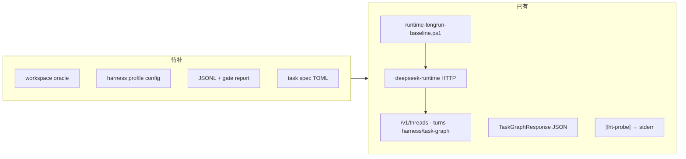

# LHT Harness 端到端测试基建

**状态:** 方案 v0.2 + **Phase 0–1 已实现**（2026-06-02）  
**定位:** Zagens runtime **长程 Harness 的正规化、可复跑、可 gate 的端到端测试方法** —— 不是论文专用统计流水线，而是产品级质量基建。  
**关联:** [`LHT_TEST_SUITE.md`](./LHT_TEST_SUITE.md)（案例与 oracle 纪律）· [`COMPOSABLE_HARNESS.md`](./COMPOSABLE_HARNESS.md) · [`runtime-longrun-baseline.ps1`](../../scripts/runtime-longrun-baseline.ps1)

---

## 0. 要解决的问题

今天 LHT 的质量保障主要靠：

| 方式 | 局限 |
|------|------|
| `cargo test` | 测模块逻辑，**不跑**完整 agent loop + 模型 |
| 人工桌面实跑 DEMO2–5 | 可发现真 bug，但**不可批量、不可 PR gate、不可对比** |
| `LHT_TEST_SUITE.md` 里的 markdown 案例 | 有人类可读 prompt/oracle，但**非机器可编排** |

缺的是中间层：**headless 端到端测试** —— 固定 prompt、固定 harness 配置、独立 oracle 判 pass/fail、结构化落盘、可与基线对比。改 gates / nudge / completion_gate 之后，维护者能**系统性地**问：「有没有把 DEMO3 式假绿又放出来了？」

> 论文统计（N 次采样、置信区间）可以**复用同一套 JSONL**，但不是本基建的一等目标。一等目标是 **回归、发布门禁、配置对照、失败分诊**。

---

## 1. 测试体系：三层金字塔

```text
                    ┌─────────────────────────┐
                    │  L2  E2E Harness 测试    │  ← 本文（lht-harness-run）
                    │  真实模型 + 完整 loop    │
                    │  oracle 判终态行为       │
                    └───────────┬─────────────┘
                                │
                    ┌───────────▼─────────────┐
                    │  L1  离线 Eval Harness   │  deepseek eval（无 LLM）
                    │  工具链 / 步骤确定性      │
                    └───────────┬─────────────┘
                                │
                    ┌───────────▼─────────────┐
                    │  L0  单元 / 集成测试      │  cargo test（long_horizon/*）
                    └─────────────────────────┘
```

| 层 | 命令 / 入口 | 测什么 | 何时跑 |
|----|-------------|--------|--------|
| **L0** | `cargo test -p deepseek-runtime-server long_horizon` | gate 逻辑、verify 解析、task-graph 组装 | 每个 PR |
| **L1** | `deepseek eval` | 工具步骤、shell 期望 token | PR / CI |
| **L2** | `scripts/lht-harness-run.ps1`（规划名） | **整轮** agent：续写、门禁、假绿、早停 | LHT 相关 PR；nightly；发版前 |

**L2 与 LHT_TEST_SUITE 的关系：**

- `LHT_TEST_SUITE.md` = **测什么**（案例库、钓鱼点、验收纪律）
- 本文 = **怎么跑**（驱动、oracle、配置 profile、结果格式、gate）
- `fixtures/lht-harness-tasks*.toml` = 机器可读的任务目录（从 test-cases 沉淀）

---

## 2. 设计原则（正规测试方法）

1. **Oracle 独立于 Harness** — pass/fail 由 workspace 内命令 exit code 决定，不用模型 prose、不用 task-graph 自报完成度。
2. **Harness 不变量单独断言** — 除 oracle 外，对 **harness 行为**做结构化检查（例：`lht_enabled` 与 profile 一致、`[lht-probe]` 无意外 `graph_complete` 假绿、DEMO3 场景必须出现 `unverified_acceptance_nudge`）。
3. **配置 profile 显式** — 每次 run 绑定一份 `--config`；禁止依赖桌面 `settings.toml` 的隐式 `lht_strict`（脚本须 WARN / 隔离）。
4. **可复跑、可对比** — 每 run 一行 JSONL：`git_sha` + `harness_profile` + `task_id` + oracle + probe 摘要；支持与 **checked-in baseline** 或 **上次 nightly** diff。
5. **分级执行** — smoke（分钟、无 API 或 trivial turn）→ standard（单任务单遍）→ regression（多任务 / 多 profile / 可选重复 run 看 flaky）。
6. **失败可分诊** — `outcome_class` 区分：oracle 红、harness 违约、infra 红、timeout —— 方便定位是「模型没做完」还是「门坏了」。

---

## 3. 现状：已有 80% 驱动层



| 能力 | 锚点 |
|------|------|
| Headless HTTP | `runtime_serve/mod.rs` — `deepseek-runtime --port N --config PATH`（**无** `serve` 子命令） |
| Turn 生命周期 | `runtime-longrun-baseline.ps1` — idle = `status ∉ {in_progress, queued}` |
| Harness 可观测 | `GET …/harness/task-graph` + stderr `[lht-probe]` |

---

## 4. 架构

```
┌──────────────────────────────────────────────────────────────┐
│  lht-harness-run.ps1                                          │
│  profile → sidecar → thread → turn → 采集 → oracle → 断言      │
└──────────────────────────┬───────────────────────────────────────┘
                           │ append
                           ▼
┌──────────────────────────────────────────────────────────────┐
│  results/lht-harness/<run_id>/runs.jsonl                      │
└──────────────────────────┬───────────────────────────────────────┘
                           │
                           ▼
┌──────────────────────────────────────────────────────────────┐
│  lht-harness-report.py                                        │
│  汇总 pass/fail · outcome 分布 · 与 baseline diff · -Gate 退出码 │
└──────────────────────────────────────────────────────────────┘
```

### 4.1 规划文件

| 路径 | 角色 |
|------|------|
| `scripts/lht-harness-smoke.ps1` | L2 smoke（**已实现**） |
| `scripts/lht-harness-run.ps1` | L2 主驱动（**已实现**） |
| `scripts/lht-harness-report.py` | 汇总 + regression gate（**已实现**） |
| `scripts/lht_harness_util.py` | TOML 任务加载、config 合并、probe 解析 |
| `scripts/lht-harness-lib.ps1` | PowerShell 共享库 |
| `docs/harness/fixtures/lht-harness-tasks*.toml` | 任务目录 |
| `docs/harness/fixtures/lht-harness-profiles/` | harness 配置 profile（现 `lht-eval-arms/`，可 rename） |
| `docs/harness/fixtures/lht-harness-baseline.json` | 可选：checked-in 基线摘要（非原始 JSONL） |
| `results/lht-harness/` | 本地输出（gitignore） |

> **命名说明：** 初稿用 `lht-eval`；实现时建议改为 `lht-harness-*`，避免与「学术 eval」混淆。下文 CLI 以 `lht-harness-run.ps1` 为准；现有 `lht-eval-arms/` 目录语义 = **harness profile**。

---

## 5. 测试分级

### 5.1 L2-Smoke（PR 可选，~2–5 分钟）

- sidecar 起停、`--config` 生效（`task-graph.lht_enabled` 与 profile 一致）
- 可选：trivial turn（「回复 OK」）验证 API 链
- **不需要**完整长程任务；无 `DEEPSEEK_API_KEY` 时 skip

### 5.2 L2-Standard（LHT 改动必跑，~15–45 分钟/任务）

- 单任务、单 profile、**单次** run
- 例：`redis-s1-ping` + `profile=lht_on`
- 用途：改 gate 逻辑后快速确认「还能绿 / 假绿被拦住」

### 5.3 L2-Regression（nightly / 发版前）

- **最小回归集**（与 `LHT_TEST_SUITE.md` §6 对齐，机器可读子集）：

| 优先级 | 任务 ID | 测什么 | 预计时长 |
|--------|---------|--------|----------|
| P0 | `redis-s1-ping` | 快 proxy + RESP oracle | ~15–30 min |
| P0 | `demo3-monkey-smoke` | 验收塌缩 / `[verify:]` 纪律（可截断 prompt 子集） | ~30–60 min |
| P1 | `microstack-gate-fixture` | completion_gate manifest（配合 `microstack-completion-gate.toml` profile） | ~45+ min |
| P2 | `demo3-monkey-full` | 完整 2W 行解释器 | ~45 min × N |

- 可选：**同一任务跑 2–3 遍**仅用于标记 flaky（模型非确定性），**不作为 PR 硬 gate**；硬 gate 用 oracle + harness 不变量。

### 5.4 Profile 对照（改 harness 行为时）

同一任务、不同 **harness profile**，验证「开/关/strict/仅层1」行为符合预期 —— 这是**产品行为测试**，不是论文消融：

| Profile | 预期行为（示例） |
|---------|------------------|
| `harness_off` | 无 continue 注入；允许 prose 早停（负向对照） |
| `harness_default` | LHT on，子门 observe |
| `harness_strict` | plan /bootstrap 更硬，子门 enforce |
| `harness_layer1_only` | 有续写，无 completion_gate |

---

## 6. 主驱动规格：`lht-harness-run.ps1`

### 6.1 CLI

```powershell
param(
    [string]$TaskSpec = "docs/harness/fixtures/lht-harness-tasks.example.toml",
    [string]$TaskId = "",              # 空 = spec 内全部
    [string]$Profile = "harness_default",
    [int]$Repeat = 1,                  # 同一任务重复（flaky 观察）
    [string]$Model = "",
    [int]$TurnTimeoutSec = 3600,
    [string]$OutDir = "results/lht-harness",
    [string]$RunLabel = "",            # 如 pr-123 / nightly-20260602
    [switch]$DryRun,
    [switch]$KeepWorkspace,
    [switch]$SkipBuild
)
```

### 6.2 单次 run 步骤

1. 隔离环境：`DEEPSEEK_RUNTIME_DIR` 临时目录；检查 `settings.toml` 的 `lht_strict`
2. 合并 profile → 临时 config → `deepseek-runtime --port P --config …`
3. `POST /v1/threads` + `POST …/turns` + `Wait-ForTurnIdle`
4. 采集：`task-graph`、turn `usage`、`[lht-probe]` 日志
5. **Oracle：** workspace 执行 `oracle_cmd` / `oracle_argv`
6. **Harness 断言（可选 per-task）：** spec 里 `[[task.invariant]]` 规则
7. 写 JSONL；汇总 `passed = oracle.passed && harness_assertions.ok`

### 6.3 Harness 断言示例（task spec 扩展）

```toml
[[task]]
id = "demo3-verify-discipline"
prompt = "…"
oracle_cmd = "bash scripts/run_examples.sh"

[[task.invariant]]
name = "must_not_graph_complete_while_open"
when = "oracle.passed == false"
assert = "task_graph.open_items > 0 || probe_summary.gate_skip_graph_complete == 0"

[[task.invariant]]
name = "unverified_nudge_on_bad_checklist"
when = "oracle.passed == false"
assert = "probe_summary.unverified_acceptance_nudge >= 1"
```

---

## 7. 任务规格

见 [`fixtures/lht-harness-tasks.example.toml`](./fixtures/lht-harness-tasks.example.toml)（由 `lht-eval-tasks.example.toml` 演进）。

| 字段 | 说明 |
|------|------|
| `id` | 稳定 ID，对齐 `LHT_TEST_SUITE` 案例编号 |
| `prompt` | 发给 turn 的全文 |
| `oracle_cmd` / `oracle_argv` | **权威 pass/fail** |
| `requires` | 跑前检查：`cargo`, `redis-cli`, `bash` |
| `suite_ref` | 链接 `test-cases/*.md` |
| `tier` | `smoke` / `standard` / `regression` |
| `[[task.invariant]]` | harness 行为断言（可选） |

---

## 8. Harness Profile（配置）

目录：[`fixtures/lht-eval-arms/`](./fixtures/lht-eval-arms/)（待 rename → `lht-harness-profiles/`）

| 文件 | 用途 |
|------|------|
| `harness_off.toml` | LHT disabled（负向 / 对照） |
| `harness_default.toml` | 产品默认（现 `lht_on.toml`） |
| `harness_strict.toml` | strict + enforce 子门 |
| `harness_layer1_only.toml` | 仅续写层，gate 全 off |

**约束：** `[long_horizon]` 不走 workspace project config 合并；必须 `--config` 注入。

---

## 9. 结果格式（`runs.jsonl`）

每行一条 run 记录（NDJSON）。核心字段：

```json
{
  "schema_version": 1,
  "run_label": "nightly-20260602",
  "task_id": "redis-s1-ping",
  "harness_profile": "harness_default",
  "git_sha": "abc1234",
  "passed": true,
  "oracle": { "exit_code": 0, "passed": true },
  "harness_assertions": { "ok": true, "failures": [] },
  "task_graph": { "completion_pct": 100, "open_items": 0, "lht_enabled": true },
  "outcome_class": "ok",
  "probe_summary": { "continue_injected": 2, "gate_skip_graph_complete": 0 },
  "duration_sec": 842
}
```

### 9.1 `outcome_class`（分诊用）

| 类 | 含义 | 谁修 |
|----|------|------|
| `ok` | oracle 绿 + harness 断言过 | — |
| `task_failed` | oracle 红，harness 正常拦截或耗尽 | 模型/任务难度（回归集预期内） |
| `harness_regression` | oracle 红 + 本应拦住的 early-stop 没拦 | **修 harness** |
| `false_green` | task_graph 显示完成但 oracle 红 | **修 gate / verify 纪律** |
| `harness_misconfig` | profile 与 `lht_enabled` 等不一致 | 修测试基建 |
| `infra` | 缺 redis-cli、sidecar 崩 | 环境 |
| `timeout` | turn 超时 | 调 timeout 或任务分级 |

---

## 10. 报告与 Gate：`lht-harness-report.py`

**目的：** CI / 维护者一眼看「这轮有没有 harness 回归」，不是算 p 值。

```powershell
python scripts/lht-harness-report.py results/lht-harness/nightly/runs.jsonl `
  --baseline docs/harness/fixtures/lht-harness-baseline.json `
  --gate
```

| 输出 | 说明 |
|------|------|
| 按 task × profile 的 pass 表 | 绿/红计数 |
| `harness_regression` / `false_green` 计数 | **gate 失败条件：>0** |
| 与 baseline diff | 新失败 / 新修复 |
| flaky 提示 | 同 task 重复 run 结果不一致（警告，不硬 fail） |

可选：Wilson 区间、重复 run 方差 —— 仅 **nightly 报告附录**，不进 PR gate。

---

## 11. 何时跑（维护者约定）

| 触发 | 跑什么 |
|------|--------|
| 改 `long_horizon/*`、completion_gate、verify | L2-Standard 至少 1 个 P0 任务 |
| 改 nudge / turn 终止 / scratchpad 交互 | P0 + 相关 DEMO 不变量 |
| PR CI（有 API key） | L2-Smoke |
| PR CI（无 API key） | L2-Smoke 无 LLM 部分 + L0 全量 |
| Weekly nightly | P0 全 + P1 轮换 |
| 发版前 | P0 + 上次 green 的 P1 |

---

## 12. 实施路线图

### Phase 0 — 基建可信（0.5 天）

- [x] `lht-harness-smoke.ps1`：config profile 注入断言
- [x] 修正 `runtime-longrun-baseline.ps1` 的 `serve --http` 启动方式
- [x] 文档化 `lht_strict` 隔离（smoke WARN）

### Phase 1 — 最小闭环（2–3 天）

- [x] `lht-harness-run.ps1` + JSONL
- [x] `redis-s1-ping` 等任务 spec（`lht-eval-tasks.example.toml`）
- [x] `lht-harness-report.py` + `-Gate`
- [x] profiles：`harness_off` / `harness_default`（`lht-eval-arms/`）
- [ ] 首次真实 E2E 跑通 `redis-s1-ping`（需 API key + ~15–30 min）

### Phase 2 — 回归集（1 周）

- [ ] DEMO3 smoke 任务 + invariants
- [ ] microstack manifest profile 对照
- [ ] nightly 文档 + baseline.json 更新流程
- [ ] rename `lht-eval-*` → `lht-harness-*`（可选一次性）

---

## 13. 风险

| 风险 | 对策 |
|------|------|
| 模型非确定性 | PR gate 看 **harness_regression** 类，不看单次 oracle 红 |
| 成本高 | tier 分级；P0 用 Redis 子集 |
| `lht_strict` 污染 | smoke WARN；长期 env 覆盖 |
| 与人工 DEMO 漂移 | `suite_ref` 链到 `LHT_TEST_SUITE.md`，改 prompt 同步 TOML |

---

## 14. 参考命令（实现后）

```powershell
# PR smoke
.\scripts\lht-harness-smoke.ps1

# 改 gate 后本地标准跑
.\scripts\lht-harness-run.ps1 -TaskId redis-s1-ping -Profile harness_default

# LHT strict 完整路径（推荐）
.\scripts\lht-harness-run.ps1 `
  -TaskSpec docs\harness\fixtures\lht-harness-tasks.strict.toml `
  -TaskId demo3-strict-smoke `
  -Profile harness_strict `
  -RunLabel strict-demo3 `
  -KeepWorkspace

# strict + Redis
.\scripts\lht-harness-run.ps1 -TaskId redis-s1-strict -Profile harness_strict

# Nightly 回归 + gate
.\scripts\lht-harness-run.ps1 -TaskSpec docs\harness\fixtures\lht-harness-tasks.regression.toml `
  -RunLabel nightly-20260602
python scripts\lht-harness-report.py results\lht-harness\nightly-20260602\runs.jsonl --gate
```

### 14.1 Strict 专用任务

| 任务 ID | 说明 |
|---------|------|
| **`demo3-strict-smoke`** | DEMO3 缩小版 + `workspace_seed` + `harness_strict`（enforce 子门 + verify 纪律） |
| **`redis-s1-strict`** | Redis stage1 在 strict 下 |

规格：[`fixtures/lht-harness-tasks.strict.toml`](./fixtures/lht-harness-tasks.strict.toml)，种子：[`fixtures/strict-task-seed/`](./fixtures/strict-task-seed/)。

---

*维护：案例增删改同步 [`LHT_TEST_SUITE.md`](./LHT_TEST_SUITE.md)；脚本变更记 [`CHANGELOG.md`](../../CHANGELOG.md)。*
