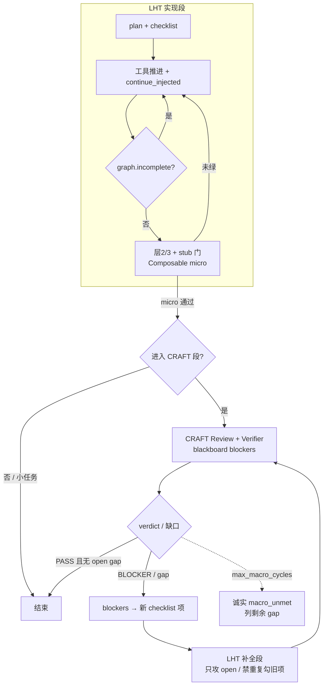
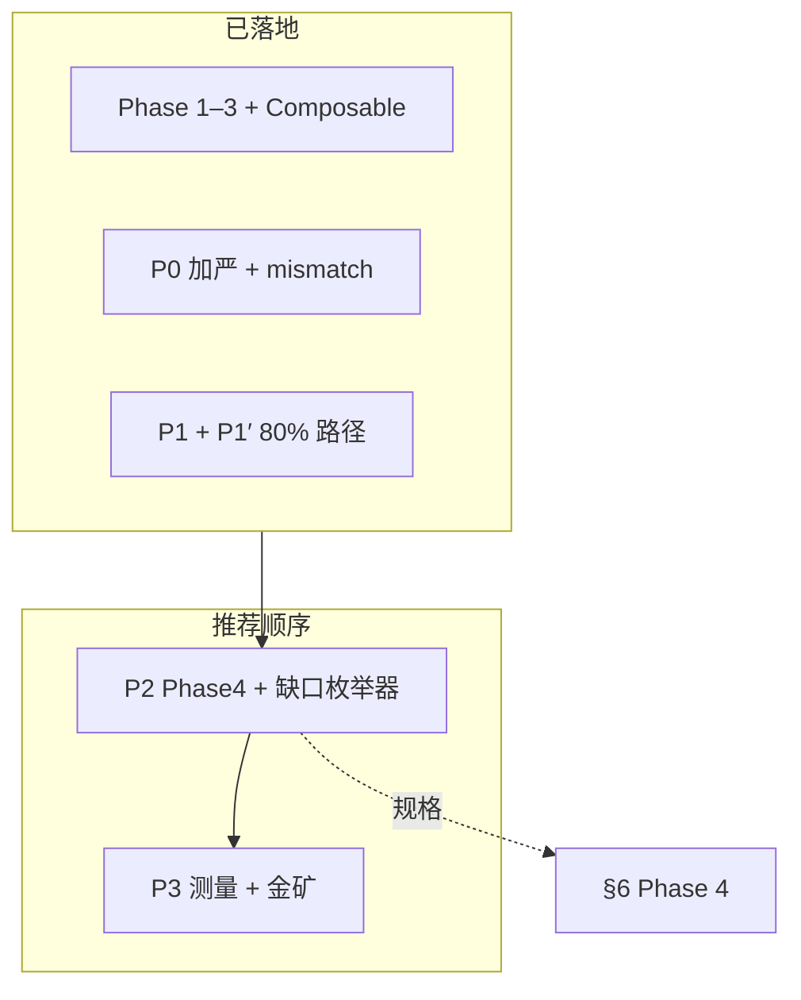
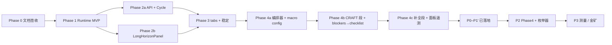

# 长程代码任务 Harness 方案

**状态:** **已实施**（Phase 1 / 2 / 2.x / 3 主体落地；**§6 产品迭代 P0 / P1 / P1′ 已落地**；**Phase 4 规格已定**）— 详见 §6 与下方总览  
**日期:** 2026-05-28（创建）· 2026-05-29（实施状态更新）· 2026-06-01（Phase 4 宏观循环 + **产品迭代路线图** + **P0–P1′ 对齐修订**）  
**范围:** 代码**生成**、**修复**、**重构**等多步执行任务 — Phase 4 规格含 **LHT↔CRAFT 组合式宏观循环**（见 §6 Phase 4）；**不含** 全库审计 scratchpad 主线  
**上游:** 组合式 Harness 远景方案（维护者私有：`doc_Private/docs/harness/Agent+Harness组合式编程方案.md`）  
**相关:** CRAFT 审查计划（`doc_Private/docs/agent-reliability-craft-plan.md`）、`crates/runtime-server/src/prompts/base.md`

### 实施状态总览（2026-06-01）

| Phase | 主题 | 状态 | 关键落点 |
|-------|------|------|----------|
| **0** | 文档 + 双轮评审签收 | ✅ 完成 | §13 / §14 |
| **1** | 强制续写 MVP（gate + NudgeTracker + config + events） | ✅ 已落地 | `long_horizon/{mod,graph,nudge,objective}.rs`、`no_tool_uses.rs` 分支 6 |
| **2** | 任务图 API + Cycle 联动 + 交接 + 左下面板 | ✅ 已落地 | `harness/task-graph`·`cycles`、`LongHorizonPanel`、`[verify:]`、预警带 cycle |
| **2.x** | 客观 progress 信号（git）+ nudge 遥测 | ✅ 本期落地 | `progress.rs`、`progress_via_git`、`telemetry`、`nudge_outcome` 事件（§4.8 / §4.9） |
| **3** | 格内 tab + Context 阈值线 + Handoff + sidecar 恢复 | ✅ 主体落地 | `LongHorizonPanel` tabs、`.zagens/handoff.md` auto 块 |
| **4** | **LHT↔CRAFT 组合式宏观循环**（实现段 + 质检段交替） | 📋 规格已定 | §6 Phase 4；上游 [`COMPOSABLE_HARNESS.md`](./COMPOSABLE_HARNESS.md) §3.1 / §6.7 |
| **P0** | 加严可信度 + mismatch 假绿 | ✅ 已落地 | §6 · P0a/P0b（`strict_completion_gate`、mismatch nudge、UI 有条件完成） |
| **P1** | 大 refactor 清单 / manifest / 工具链 / 跨层验收 | ✅ 已落地 | §6 · P1a–P1d |
| **P1′** | 80% 路径补强（shim / electron enforce / lib.rs IPC / cargo build） | ✅ 已落地 | §6 · P1′ 实施清单 |
| **P2** | 宏观循环落地 + 缺口枚举器 | 📋 规格已定 | §6 Phase 4 + §6 产品迭代 · P2 |
| **P3** | 规模化测量 + 金矿 backlog | 📋 规格已定 | §6 产品迭代 · P3 |

**已修复缺陷（实施期）：** 进度条填充、qualified-progress 误判（read-only exec）、`max_nudges_per_item` 硬上限可达、stop-steer 放宽匹配。详见 [`../../CHANGELOG.md`](../../CHANGELOG.md) `[Unreleased]`。

**待积累数据后再做：** §4.9 遥测 conversion_pct 反推阈值（先量后调）；Phase 4 编排层；遥测跨 session 持久化；Desktop **LHT 高级设置**（`LhtSettingsPanel`）与跑批回归自动化。

**实证基线（2026-06 · label_rust 首轮 ~35min）：** 驱动 P0→P1′ 的 harness 观测见 §6 产品迭代 · **实证摘要**（历史记录；对应项已在 P0/P1/P1′ 修复，**第二轮压测**用于验证 ~80% 路径）。

**金矿 backlog（并入 §6 P3-5）：** ① 设计评审前置；② 可追溯矩阵 — 详见 [`../agent-reliability-craft-plan.md` §11.5](../agent-reliability-craft-plan.md)。并行生成见 [`PARALLEL_FRESH_GENERATION.md`](./PARALLEL_FRESH_GENERATION.md)（P0.5 / P1.5）。

---

## 0. TL;DR

| 问题 | 立场 |
|------|------|
| 模型做 refactor / 生成 / 修复时，常在一阶段 prose 收尾 | **Harness 不信任自我声明**；checklist/plan 未空 → 强制续写 |
| CRAFT 能否直接复用？ | **不能当 LHT 主线**；Phase 4 作为 **质检段** 与 LHT **宏观交替**（blockers→checklist→再 LHT），见 §6 Phase 4 |
| 新建第四套持久化？ | **否**。任务图从 `update_plan` + `checklist_write` **derived**；行为与 audit `maybe_continue_incomplete_audit` 同族 |
| 第一刀改什么？ | `no_tool_uses.rs` 增加 **`maybe_continue_incomplete_code_task`** + 配置开关 + Desktop 侧栏进度 |

**长程三支柱（本方案主干）：** **Cycle**（同 thread 换脑）→ **交接**（StructuredState + `<carry_forward>`）→ **可视化**（任务图 + cycle 时间线）。同 cycle 内的「不早停」靠 **强制续写**（§4）。

**产品名（对内）:** **LHT** — Long-Horizon Task harness for **Code**（与 CRAFT、Audit Scratchpad 并列，不抢品牌）。

---

## 1. 背景与问题

### 1.1 现象

在 Code TaskType 下，模型对非平凡请求通常能：

1. 调用 `checklist_write` / `update_plan` 拆步（`base.md` 已要求）；
2. 完成若干 `edit_file` / `apply_patch`；
3. 输出一段「已完成 / 总结」类 prose，**不再发起 tool call**，turn 结束。

对用户而言，sidebar 仍显示 pending 项，或 plan 阶段未全部 `completed`，但会话已停 — **长程任务在认知层提前终止**。

根因（与组合式方案 §4.1 一致）：初始目标注意力衰减；模型更在「延续刚写的总结」，而非对照任务图。

### 1.2 与 CRAFT / Audit 的边界

| 子系统 | 典型用户意图 | 完成判定 | 已有硬门禁 |
|--------|-------------|----------|-----------|
| **Audit scratchpad** | 全库 / 大范围 **审查** | inventory 区域 closed + P2 gate | ✅ `maybe_continue_incomplete_audit` |
| **CRAFT** | 审查 → 修复 **闭环** | review/verifier structured verdict | ✅ `<deepseek:craft.fix_loop>` |
| **LHT（本方案）** | **写**代码：生成 / 修 bug / 重构 | checklist + plan **未全部 completed** + completion/stub 门（Composable） | ✅ 续跑 / verify / 完成门禁 |
| **LHT + CRAFT 宏观循环（Phase 4）** | 大 refactor **多轮收口**（~80%→~90%+） | LHT 段 checklist 清空 + 机器门绿 → CRAFT 枚举 gap → 补全段 | 📋 规格已定，编排未落地 |

**不重复建设：**

- 不把 CRAFT **verdict 绑为** `graph_complete` 的唯一法官（与 [`COMPOSABLE_HARNESS.md`](./COMPOSABLE_HARNESS.md) §3 铁律一致）；
- 不把 audit inventory 套在 refactor 上；
- 小任务 / bugfix **不必** 走 CRAFT 段（见 §7.2）；大 refactor 走 **LHT→CRAFT→LHT** 宏观循环（§7.4）。

### 1.3 非目标（本方案首版不承诺）

- DAG 任务图、跨文件硬锁、git worktree 隔离（Proposal Phase 3+）；
- 替代人类对需求与 merge 的最终签字；
- 新 Engine struct 字段：Phase 1 **例外** — 与 audit 同级的 `long_horizon_continue_injected_this_turn`（**方案 A**，§13.1）；其余仍遵守 [D17 Architecture Freeze](../tech/adr/D17_ARCHITECTURE_FREEZE.md)。
- 新顶层 `/v1/*` 路径（D8 前扩容 `threads/{id}/harness/*` 即可）。

---

## 2. 设计原则

1. **事实源 > 模型声明** — 任务是否完成由 **结构化 checklist/plan 状态** 决定，不由 assistant  prose 决定。
2. **归并优先** — 任务图 = `SharedPlanState` ⊕ `SharedTodoList` 的只读视图（[`HARNESS_INTEGRATION_PROPOSAL.md`](./HARNESS_INTEGRATION_PROPOSAL.md) §3）。
3. **模板复用 audit 续写** — `scratchpad_flow::maybe_continue_incomplete_audit` 已证明「无 tool call → 注入 user 消息 → `TurnLoopControl::Continue`」路径有效。
4. **可关闭、可分级** —  trivial 单步任务不应被误续写；通过启发式 + 配置 `[long_horizon]` 控制。
5. **可见性** — Desktop sidebar Plan/Todos 与 Harness 门禁使用同一 snapshot，避免「面板空但引擎在赶工」或反之。

---

## 3. 长程三支柱：Cycle · 交接 · 可视化

LHT 不是只有「模型停了再踹一脚」。数小时级代码任务靠三层能力叠在一起：

```
                    ┌─────────────────┐
                    │   可视化         │  人：进度、cycle、交接摘要可盯
                    └────────┬────────┘
                             │ 同一 snapshot
                    ┌────────▼────────┐
                    │   交接           │  跨 cycle：任务图 + carry_forward
                    └────────┬────────┘
                             │ 同 runtime_thread_id
                    ┌────────▼────────┐
                    │   Cycle          │  换脑不换聊天；archive 可检索
                    └────────┬────────┘
                             │ 同一 cycle 内
                    ┌────────▼────────┐
                    │  强制续写 (§4)   │  checklist 未空 → 不许 prose 收尾
                    └─────────────────┘
```

| 支柱 | 解决什么 | 仓库现状 | LHT 增量 |
|------|----------|----------|----------|
| **Cycle** | 1M 窗仍不够 / 深窗检索衰减 | ✅ `cycle_manager` + `cycle_hooks` | 与 checklist **断点**联动 schedule；LHT 上下文策略（§10.2） |
| **交接** | 换脑后「还记得要干什么」 | ✅ 双层：`StructuredState` + `<carry_forward>` | briefing 模板 **显式带 CodeTaskGraph**；LHT objective pin |
| **可视化** | 黑盒焦虑、无法 steer | ✅ `LongHorizonPanel`（任务图 / Cycle / Context / Nodes）+ Composer LHT chip | completion_gate 摘要、有条件完成态（P0/P1′） |

---

### 3.1 Cycle（checkpoint-restart）

**定义：** 在同一 `runtime_thread_id` 内，当**下一请求**的 live input 估算越过阈值时，归档当前 transcript、清空 message buffer、用 **seed messages** 启动新 cycle — 用户仍在同一条聊天里。

**实现 SSOT：** [`cycle_manager.rs`](../../crates/runtime-server/src/cycle_manager.rs)、[`cycle_hooks.rs`](../../crates/runtime-server/src/core/engine/cycle_hooks.rs)。

#### 3.1.1 触发条件

| 条件 | 说明 |
|------|------|
| `[cycle].enabled` | 默认 on（见 config） |
| `active_input_tokens ≥ threshold` | 默认 **768K**（约 1M 窗 **75%**）；`[cycle.per_model]` 可覆盖 |
| **干净边界** | 无 in-flight tool / stream / approval（`should_advance_cycle(..., in_flight: false)`） |
| **LHT 增强（Phase 2）** | 进入「预警带」(~75–85%) 时 **优先**在 checklist/plan 项 `completed` 后立刻 `maybe_advance_cycle`，避免在 edit 半道换脑 |

**与 compact 分工：** compact = 同 buffer 有损摘要；cycle = **整段 archive + 新 buffer**。LHT **主路径是 cycle**（§10.2）。

#### 3.1.2 Cycle 内发生了什么（引擎）

```mermaid
sequenceDiagram
  participant E as Engine
  participant LLM as Briefing LLM
  participant Disk as ~/.zagens/sessions/.../cycles/

  E->>E: should_advance_cycle (threshold)
  E->>LLM: produce_briefing (cycle_handoff.md)
  LLM-->>E: carry_forward text
  E->>Disk: archive_cycle → {n}.jsonl
  E->>E: StructuredState.capture (plan/todo/ws/subagents)
  E->>E: build_seed_messages → session.messages =
  Note over E: [CYCLE STATE] + [CYCLE BRIEFING] + pending user
  E->>E: cycle_count += 1; refresh system prompt
```

#### 3.1.3 归档与检索

| 产物 | 路径 / 工具 | 用途 |
|------|-------------|------|
| Cycle JSONL | `~/.zagens/sessions/{session_id}/cycles/{n}.jsonl` | 全量 transcript 冷存 |
| `recall_archive` | [`tools/recall_archive.rs`](../../crates/runtime-server/src/tools/recall_archive.rs) | 新 cycle 内 BM25 搜旧 cycle（briefing 漏细节时） |
| `session.cycle_briefings` | 内存 + 随 session 持久化路径 | 历次 `<carry_forward>` 摘要链 |

**LHT 约定：** 模型在 carry_forward 里写 **失败方案 / 约束 / open checklist id**，不要复述 tool 输出字节（见 [`cycle_handoff.md`](../../crates/runtime-server/src/prompts/cycle_handoff.md)）。

#### 3.1.4 失败与降级

| 情况 | 行为 |
|------|------|
| Briefing LLM 失败 | **不 advance**；status「cycle handoff failed」；留在当前 cycle |
| Archive 写盘失败 | 仍 swap（briefing + StructuredState 够续） |
| 阈值已到但边界不干净 | 等到下一干净 turn |
| Cycle 反复失败 + 上下文爆满 | fallback `compact_messages_safe`（§10.2） |

---

### 3.2 上下 Cycle 交接

交接分 **两层** — 确定性层不依赖模型判断，模型层只补「不可结构化」的上下文。

#### 3.2.1 第一层：自动保留（StructuredState）

`StructuredState::capture` 在每次 cycle 边界快照（**已在生产**）：

| 字段 | 来源 | 新 cycle 中形态 |
|------|------|-----------------|
| mode / workspace / cwd | session | `## Cycle State` markdown |
| **plan** | `SharedPlanState` | `[ ] / [~] / [x]` 阶段列表 |
| **checklist** | `SharedTodoList` | 完成率 % + 条目 |
| working set | `WorkingSet` | 最近读过/改过的路径摘要 |
| 运行中 sub-agent | `SubAgentManager` | agent_id + role + objective |
| audit scratchpad（若有） | `scratchpad_handoff_line` | run_id + resume area |

渲染进 seed 的第一条 user 消息：`[CYCLE STATE — auto-preserved ...]`（见 `build_seed_messages`）。

**LHT 要求：** plan + checklist 是 **跨 cycle 任务图的 SSOT** — 只要模型在换脑前维护 sidebar，交接后 **open 项不会丢**。

#### 3.2.2 第二层：模型交接（carry_forward）

| 项 | 说明 |
|----|------|
| 模板 | [`prompts/cycle_handoff.md`](../../crates/runtime-server/src/prompts/cycle_handoff.md) |
| 上限 | 默认 ~3000 tokens（`briefing_max_for(model)`） |
| 必写 | 决策+原因、约束、在测假设、**已失败方案**、待用户澄清 |
| 禁写 | tool 输出全文、文件全文、逐步操作流水账 |
| Seed 形态 | `[CYCLE BRIEFING — written by you on cycle N]` + `<carry_forward>...</carry_forward>` |

**LHT Phase 2 — briefing 提示增强（不改 cycle 主流程）：**

在 `CYCLE_HANDOFF_TEMPLATE` 或 LHT overlay 追加：

```markdown
Also include in <carry_forward>:
- Long-horizon objective (one line)
- Open checklist/plan item ids or labels still pending
- Last verification command and outcome (pass/fail/not run)
- Files currently being edited (paths only)
```

#### 3.2.3 第三层：LHT 任务图注入（Phase 2）

在 `StructuredState.to_system_block()` **之后**、archive **之前**，合并 derived `CodeTaskGraph` JSON 或进度条 — 与 §4.1 同一视图，保证 briefing 稀疏时仍有 **机器可读** open 项。

#### 3.2.4 交接验收标准

| # | 验收 |
|---|------|
| H1 | cycle N→N+1 后 sidebar checklist/plan **与换脑前一致**（除非模型在边界前刚 update） |
| H2 | 新 cycle 第一轮能继续 **in_progress** 项，不重复 completed 项 |
| H3 | carry_forward 含至少 1 条 **failed approach** 或 **constraint**（人工 spot-check） |
| H4 | 用户 **不**需要新开聊天；`runtime_thread_id` 不变 |
| H5 | `recall_archive` 能搜到 cycle N 里某次 `cargo test` 输出关键词（可选回归） |

---

### 3.3 可视化

**原则（组合式方案 §2.2）：** Harness 产生事实，可视化让人看见 — 长程任务没有任务图 + cycle 线，用户只能看 prose，必然过早 steer 或误以为已完成。

#### 3.3.1 现状（2026-06-01，对齐仓库）

| 能力 | Desktop | Runtime 事件 / API |
|------|---------|-------------------|
| Checklist 进度条 | ✅ [`ChecklistPanel.tsx`](../../crates/desktop/web-ui/src/components/ChecklistPanel.tsx) — **AuditGrid 左上** | `panel_checklist` / poll |
| Audit scratchpad | ✅ [`AuditScratchpadPanel.tsx`](../../crates/desktop/web-ui/src/components/AuditScratchpadPanel.tsx) — **AuditGrid 右上** | `GET …/scratchpad/status` |
| 子代理 / CRAFT | ✅ [`AgentPanel.tsx`](../../crates/desktop/web-ui/src/components/AgentPanel.tsx) — **AuditGrid 右下** | `/v1/blackboards` |
| **LHT 任务图** | ✅ [`LongHorizonPanel.tsx`](../../crates/desktop/web-ui/src/components/LongHorizonPanel.tsx) — **AuditGrid 左下** | `GET …/harness/task-graph` + SSE |
| Plan 阶段 | ✅ LongHorizonPanel「计划」区 + plan outline 淡化 | derived from `SharedPlanState` |
| Context 使用率 | ✅ Composer 页脚 / Context tab 768K 线 | `contextUsage.ts` |
| Cycle 序号 / 时间线 | ✅ LongHorizonPanel Cycle tab | `GET …/harness/cycles` |
| carry_forward 预览 | ✅ Cycle tab briefing 预览 | cycle archive + API |
| LHT 续写 / 门禁节点 | ✅ Nodes tab + Composer chip | `long_horizon.*` status 事件 |
| LHT 加严开关 | ✅ [`LhtModeToggle.tsx`](../../crates/desktop/web-ui/src/components/LhtModeToggle.tsx)（Composer） | `get/set_lht_strict` → `settings.toml` |
| LHT 高级门禁 | ✅ [`LhtSettingsPanel.tsx`](../../crates/desktop/web-ui/src/components/LhtSettingsPanel.tsx)（侧栏） | `get/save_lht_settings` → completion 子门 |
| 工作区 deliverable 覆盖 | ✅ 可选 `{workspace}/.zagens/lht-deliverables.toml` | `merge_runtime_deliverables` |

**仍缺 / 后续：** macro 段面板节点（Phase 4）；跨 session 遥测持久化（P3）。

**缺口一句话：** 右侧 **2×2 Harness 网格**（[`AuditGridPanel.tsx`](../../crates/desktop/web-ui/src/components/AuditGridPanel.tsx)）已承载清单 / 审计 / 子代理；**左下预留格** 即 LHT 可视化落点 — 与审计对称，不另开顶层面板。

#### 3.3.2 UI 落点（签收：对齐审计网格，2026-05-28）

**结论：** LHT 可视化放在 **Composer 右侧 `AuditGridPanel` 左下 GridCell**（i18n 键 `auditGrid.reserved` → Phase 2 改为 `长程任务` / `Long-horizon`），**不**新建独立侧栏或全屏 Harness 页。

```
┌─ 右侧 Harness Grid（AuditGridPanel，与截图一致）────────────┐
│ [清单]              │ [审计 scratchpad]     ← 审查会话专用   │
│ ChecklistPanel      │ AuditScratchpadPanel                   │
├─────────────────────┼────────────────────────────────────────┤
│ [长程任务] ★ LHT    │ [子代理 / CRAFT]                       │
│ LongHorizonPanel    │ AgentPanel                             │
│ （Phase 2 替换预留）│                                        │
└─────────────────────────────────────────────────────────────┘
```

| 格子 | 组件 | LHT 关系 |
|------|------|----------|
| 左上 | `ChecklistPanel` | **共用** — checklist 叶子进度（LHT derived view 同源） |
| 右上 | `AuditScratchpadPanel` | **互斥** — 有 active scratchpad 时 LHT engine off（§4.4）；格内仍显示审计 |
| **左下** | **`LongHorizonPanel`（新，Phase 2）** | **LHT 主可视化** — plan 阶段、objective、完成率、in_progress 高亮、nudge/blocked |
| 右下 | `AgentPanel` | 共用 — implementer / verifier 子代理 |

**网格显隐：** 沿用 [`useAuditGridData`](../../crates/desktop/web-ui/src/lib/useAuditGridData.ts) — 有 checklist / audit / agents 任一即 `hasAnyData`。Phase 2 扩展为 `useHarnessGridData`，增加 `hasLongHorizon`（graph incomplete + LHT enabled + 非 audit-only）。

**Phase 分档（修正原「HarnessPanel 三 tab 独立面板」表述）：**

| Phase | UI 交付 |
|-------|---------|
| **1** | 无左下全面板；Composer 页脚或 status chip 显示 `long_horizon.continue_injected` / `blocked`（可选） |
| **2** | 左下 **`LongHorizonPanel`** — 单视图任务图（plan + checklist + objective + nudge 计数）；poll `GET …/harness/task-graph` |
| **3** | 左下格内 **子 tab**：`[任务图] [Cycle] [上下文]` — Cycle 时间线 + carry_forward 预览 + 768K 阈值线（**不**拆成第四格） |

**与 HARNESS_INTEGRATION_PROPOSAL 关系：** Proposal 的「AuditScratchpadPanel → HarnessPanel rename」**降级为 Phase 3 可选** — LHT 优先占用 **预留格**，避免 Phase 2 大 refactor。审计格保持 `AuditScratchpadPanel` 命名直至网格整体 rename（`HarnessGridPanel`）。

**左下格 Phase 2 内容（任务图视图）：**

```
  · Plan 阶段（3–6 行，状态符）
  · Checklist 摘要（与左上同源，此处强调 plan↔todo 层级）
  · 完成率 % · in_progress 高亮 · LHT nudge / blocked 状态
  · objective 一行（§4.5 derive_objective）
```

**Phase 3 左下格子 tab（格内，非新面板）：**

```
│ [任务图] [Cycle] [上下文]  ← 仅 Phase 3 在 LongHorizonPanel 内加 tab │
│ Cycle：cycle #N、时间线、carry_forward 折叠预览                      │
│ 上下文：768K 阈值线 vs 1M 顶、下次换脑提示                            │
```

#### 3.3.3 Runtime → UI 契约（已落地 + 后续）

| 事件 / API |  payload 要点 | 状态 |
|------------|---------------|------|
| `GET /v1/threads/{id}/harness/task-graph` | §4.1 `CodeTaskGraph` JSON + `completion_gate` | ✅ |
| `GET /v1/threads/{id}/harness/cycles` | cycle 列表 + briefing 摘要 | ✅ |
| SSE `harness.task_graph` | panel push | ✅ |
| `long_horizon.continue_injected` / `blocked` / `gate_skip` / `integration_gate` / … | harness 节点流 | ✅ |
| `panel_plan`（可选） | 与 checklist 对称的 plan snapshot emit | 🔶 未做（derived view 已够） |

**持久化：** cycle 边界写入 thread event（`kind: cycle_advance`），便于 **replay** 与跨天 resume 时渲染时间线（D7 JSONL 衍生，不新表）。

#### 3.3.4 可视化与 steer 闭环

| 用户动作 | Harness 响应 |
|----------|--------------|
| 看任务图发现卡在某 checklist 项 | steer「跳过 X，先做 Y」→ working_set + LHT 下一 nudge 对齐 |
| 看 cycle 线发现 briefing 漏了约束 | steer 补充；必要时手动 `/compact` **或** 触发 re-brief（P3 探索） |
| 点击「暂停 LHT」 | `long_horizon_paused`（§4.4） |

---

## 4. 架构概览（强制续写）

```
┌─────────────────────────────────────────────────────────────────┐
│  User: 「把这个模块 refactor 成 …」                              │
└────────────────────────────┬────────────────────────────────────┘
                             ▼
┌─────────────────────────────────────────────────────────────────┐
│  Agent turn loop                                                 │
│  1. checklist_write / update_plan（软引导，已有）                 │
│  2. 工具执行（edit / test / read …）                              │
│  3. 模型返回 0 tool calls                                        │
│       ↓                                                          │
│  handle_no_tool_uses_turn_loop                                   │
│       ├─ audit continue（已有，审查专用）                         │
│       └─ ★ maybe_continue_incomplete_code_task（新增）           │
│              · 读 plan + checklist snapshot                      │
│              · 未完成 → 注入续写 nudge → Continue                │
│              · 已完成 / 豁免 → Break                             │
└────────────────────────────┬────────────────────────────────────┘
                             ▼
┌─────────────────────────────────────────────────────────────────┐
│  可选：周期目标重注入（Phase 2）                                  │
│  · 每 N turn 或每 checklist 项 completed                         │
│  · cycle_hooks / carry_forward 携带 plan 摘要 + 进度条           │
└─────────────────────────────────────────────────────────────────┘
```

### 4.1 任务图（derived view）

**输入源（已有，内存 + 可选 task SQLite）：**

| 源 | 类型 | 粒度 |
|----|------|------|
| `PlanState` / `update_plan` | 3–6 阶段 | 战略 |
| `TodoList` / `checklist_*` | 叶子步骤 | 可验证 |
| `plan.explanation`（若有） | 一句战略说明 | 摘要（非独立 struct 字段） |

**Derived `CodeTaskGraph`（只读，不落新表）：**

```json
{
  "objective": "Refactor auth module to trait-based backend",
  "objective_source": "plan_in_progress",
  "phases": [
    { "step": "Inventory call sites", "status": "completed" },
    { "step": "Introduce AuthBackend trait", "status": "in_progress" }
  ],
  "checklist": [
    { "id": 3, "content": "Update tests", "status": "pending" }
  ],
  "completion_pct": 42,
  "open_items": 4,
  "in_progress_id": 2
}
```

`objective` 由 **fallback 链** 解析（§4.5），**不是** `StructuredState` 的字段（该 struct 仅含 plan/todo snapshot，见 [`cycle_manager.rs`](../../crates/runtime-server/src/cycle_manager.rs)）。

**完成判定（LHT gate，基础）：**

```
incomplete := ∃ plan step ∈ {pending, in_progress}
           ∨ ∃ checklist item ∈ {pending, in_progress}
```

当 graph 双空 → **不激活 LHT**。

### 4.2 强制续写（核心机制）

**触发条件（全部满足）：** 无 tool calls；LHT enabled；graph incomplete（§4.3）；本 turn 未注入；未豁免。Gate / NudgeTracker 详 §4.3。

**注入消息（示例）：**

```markdown
Long-horizon code task incomplete — do **not** end this turn with prose-only output.

Objective: Refactor auth module to trait-based backend
Progress: ████░░░░░░ 42% (plan 1/3 phases done; checklist 2/5 items open)

Still open:
- [plan ◎] Introduce AuthBackend trait
- [todo ○] Update integration tests
- [todo ○] Run scoped cargo test -p auth

Continue with tools: complete the current in-progress item, verify (e.g. cargo check/test), then checklist_update / update_plan before summarizing again.
```

**Nudge 语言：** 跟随 session `lang`（与 `base.md` Environment 一致）— `zh-Hans` / `zh` → 中文模板；否则 English。Phase 1 至少中英两版。

<details><summary>zh-Hans 模板示例</summary>

```markdown
长程代码任务尚未完成 — 请勿仅用文字总结结束本轮。

目标：将 auth 模块重构为基于 trait 的后端
进度：████░░░░░░ 42%（plan 1/3 阶段；checklist 2/5 项未完成）

仍待完成：
- [plan ◎] 引入 AuthBackend trait
- [todo ○] 更新集成测试

请继续用工具完成当前 in_progress 项，验证（如 cargo check/test），再 checklist_update / update_plan。
```

</details>

#### 4.2.1 `no_tool_uses` 完整分支链（代码 SSOT）

LHT 插入在 **audit_continue 之后、Break 之前**（二次评审 🔴#2）：

```
1. scratchpad_summary + pending steers     → Continue
2. pending steers (alone)                  → Continue
3. sub-agent completions (drain / wait)    → Continue
4. REPL blocks                             → Continue or Break
5. maybe_inject_incomplete_audit_continue  → Continue   ← audit 独占
6. ★ maybe_continue_incomplete_code_task   → Continue   ← LHT
7. Break
```

锚点：[`no_tool_uses.rs`](../../crates/runtime-server/src/core/engine/turn_loop/host_impl/no_tool_uses.rs)（audit ≈ L306；LHT 插在 L309 前）。

**实现锚点：**

| 文件 | 动作 |
|------|------|
| `long_horizon/{mod,nudge,graph}.rs` | graph、continue、**NudgeTracker** |
| `no_tool_uses.rs` | 分支 6（§4.2.1：audit #5 → LHT #6 → Break） |
| `core/src/engine/runtime.rs` | **`long_horizon_continue_injected_this_turn`**（**方案 A**，§13.1） |
| `message_handlers.rs` | 每 turn 重置 audit + LHT one-shot |

### 4.3 完成判定与 NudgeTracker

**基础：** 见 §4.1 `incomplete` 公式。

| 规则 | 行为 |
|------|------|
| Explicit finish | snapshot 全 **completed** → 不 nudge |
| Blocked | 同 `in_progress_id` **3** 次 nudge 且无 **qualified progress**（§4.3.1）→ `long_horizon_blocked` |
| 换项重置 | `in_progress_id` 变化 → 重置计数 |
| **Stale checklist** | 同 `in_progress_id` 连续 **8** 个 assistant 回合无 tool call → nudge 改为「请 steer 或更新 checklist」，不再机械续写（🟡#7） |
| max_nudges | 同项 ≥ **5** → 停止 nudge；**下一条 user 消息**清除 `long_horizon_blocked` / paused（验收 🟡#6） |

#### 4.3.1 Qualified progress（「无进展」判定，二次评审 🔴#3；Phase 2.x 升级为客观信号）

**设计哲学（实事求是）：** 「有没有进展」不该由命令正则**主观断言**，而应尽量由**客观痕迹**（文件是否真的变了、测试是否真的跑绿）说话。Phase 1 用正则白名单是「先能跑」的务实起点；Phase 2.x 加入 **git 工作树变更**作为语言无关的客观信号——正则只是其中一条，不再是唯一裁判。

`had_progress`（自上次 nudge 以来是否有进展）= 以下任一为真：

| 信号 | 计为进展当且仅当 | 性质 | Phase |
|------|------------------|------|-------|
| `edit_file` / `write_file` / `apply_patch` | tool result **success** | 客观（写盘成功） | 1 |
| `exec_shell` / `run_tests` | 命令匹配 `VERIFICATION_CMD_RE` 且 exit 0 | 启发式（白名单） | 1 |
| `checklist_update` / `update_plan` | 成功的状态迁移 | 客观 | 1 |
| **git 工作树变更** | `git status --porcelain` 签名相对**上次 nudge** 发生变化 | **客观、语言无关** | **2.x** |
| 其他 read-only（`ls`/`echo`/`cat`…） | — | **永不**计为进展 | 1 |

```rust
// Phase 1 — 粗粒度但可测（白名单仍保留，用于「测试跑绿」这类无文件变更的进展）
const VERIFICATION_CMD_RE: &str =
    r"(?i)\b(cargo\s+(test|check|build|clippy)|npm\s+test|pnpm\s+test|yarn\s+test|pytest|go\s+test)\b";
```

**git 客观信号（Phase 2.x，§4.8）：** 解决正则白名单对 `make` / 自定义脚本 / 非 Rust-JS-Go 项目失真的问题——只要工作树自上次 nudge 后**真的变了**（tracked 文件 add/modify/delete、新文件 untracked），无论用什么命令产生，都算进展。仅依赖 gitignore 的产物（编译二进制等）不计入，符合「源未变即无实质进展」。可经 `[long_horizon] progress_via_git` 关闭（非 git 仓库自动降级为纯 Phase 1 判定）。

NudgeTracker 在每次 nudge 前检查自上次 nudge 以来是否有 qualified progress（含 git 信号）。

```rust
struct NudgeTracker {
    no_progress_streak: HashMap<u32, u32>, // 驱动 blocked（进展时清零）
    total_per_item: HashMap<u32, u32>,     // 驱动 max 硬上限（进展不清零，§4.3 #5）
    last_in_progress_id: Option<u32>,
    blocked: bool,
}
```

Plan-only：key = `0xFFFF_0000 | plan_index`。

**`had_progress` 的作用边界（DEMO2 实证修正，2026-05）：** qualified progress **只**清零 `no_progress_streak`（保护正在干活的模型不被误判为 `blocked` 放弃续写），**不**跳过 nudge。理由：gate 只在「模型不调工具、prose 收尾、任务未完成」时触发，而「先写了点东西、然后中途撒手」恰恰是 LHT 要抓的认知早停形态——这一轮 `had_progress` 几乎必然为真。早期实现里 `had_progress=true` 会直接 `SkipProgressReset`（不 nudge），导致模型写了文件、清单停在 0% 就让它收尾。修正后：进展轮仍照常 nudge，由 `max_nudges_per_item` 硬上限兜底；只有 `!had_progress` 的轮次才累加 streak 趋近 `blocked`。实证见线程 `thr_0eda7dcc`（`long_horizon.gate_skip: reason=nudge_skip_progress_reset`，turn `Completed` 且 `incomplete=true`）。

**「验收塌缩成创建项」假绿（DEMO3 实证修正，2026-05）：** 一次 2W 行 Go 解释器压测里，任务**完整跑完、checklist 全勾、turn `Completed`**，但事后实跑示例脚本 4 个崩 2 个（`%` 取模未实现、带数字标识符 `counter1` 词法器不认）。根因不是模型谎报，而是**分解时把「可运行的验收」语义降级成了「创建文件」项**：验收「REPL 能跑通全部示例」被拆成 checklist 第 13 项「创建示例脚本(.monkey)」——创建文件即算完成；唯一带 `[verify:]` gate 的只有 `go build/vet/test` 项，而单测没覆盖那两个特性，于是 `go test` 真绿 → 全勾 → 收尾。`max_tokens=393216` 全程在位、零 length 截断（截断修复有效），所以这是**纯验证闭环漏洞**，不是截断或早停。两处修复：①（根因）`base.md` checklist 纪律新增 `[verify: <command>]` 教学——凡「运行/构建/测试通过/跑示例」类验收**必须**写成 `[verify: cmd] <label>`，并明示「创建文件 ≠ 验证通过」；② `verify::unverified_acceptance_suffix` + `host_impl` gate 加固：标 `completed` 的项若**读起来像可运行验收却没带 `[verify:]` 前缀**，在 `checklist_update`/`todo_update` 结果后追加硬提示，专抓这类假绿。前者让 `[verify:]` 真正被模型使用，后者兜住漏标的情况。

**step 耗尽型早停（DEMO4 实证修正，2026-05）：** 一次 2W 行 Go 解释器压测跑到 ~29 分钟**卡在 40%、turn 空转**。`sidecar.log` 证明**不是流/length 截断**：`[stream-probe]` **恰好 100 条**、全 `stop_reason=tool_calls`、`stream_errors=0`、`chunk_timeout=0`、`max_tokens=393216`、`rx_backlog` 个位数——即撞满了**默认 `max_steps: 100`** 工具步预算，`run.rs` 用一句 `break`（`Reached maximum steps`）就终止了。这是继 length 截断、prose 早停之后的**第三种静默早停**：LHT 续写 nudge 只挂在 *no-tool-uses* 路径，而工具密集型 turn 打满步数预算时**完全绕过了 harness**，任务直接停摆（所以全程无 `[lht-probe]`、无 checklist 完成项）。修复见 §4.6「step 耗尽自动续写」：`maybe_continue_at_step_limit` 钩子在 cap 处给长程任务**再发预算窗口 + 注入续写**，受 `MAX_STEP_LIMIT_CONTINUATIONS=3` 约束。关键教训：**任何「turn 结束」的出口都必须经过 LHT 续写闸门**，否则就是一个新的 silent early-stop 漏点（length / prose / step 耗尽是同一类问题的三个出口）。

**plan/checklist 双重计数 → 进度卡死 + 假 `incomplete_stop`（DEMO5 实证修正，2026-05）：** 一次全新 Go 项目（Monkey 双后端解释器）生成任务**实际全部完成、产物可 build**，但 UI 进度条卡 **61%**、显示 **12 个未完成项**，收尾还报了 `incomplete_stop` 假阳性放弃信号。现场数据：模型 `update_plan` 只调 1 次建了 12 个 plan 项、此后全程 `pending` 弃用；`checklist_update` 多次、19 项全 `completed`。进度 = `19/(12+19) ≈ 61%`。根因：`long_horizon/graph.rs::from_snapshots` 把 plan 项数与 checklist 项数**当成不相交工作量直接相加**（`total = phases.len() + checklist.len()`，`open_items`/`incomplete()` 两边 OR）。12 个 pending plan 变「僵尸未完成项」：进度卡死、`incomplete()` 误真、checklist 收尾后 `in_progress_id` 回退到 plan（再 → `None`）→ nudge gate `Skip`（`reason=nudge_skip`，`continue_injected` 全程没触发）→ 最终落点把真完成误判为放弃。修复（Option 1 — **checklist 为完成权威**）：checklist 非空时，完成度/`open_items`/`incomplete()`/`in_progress_id` **只**以 checklist 为准（不再回退僵尸 plan 的 InProgress），plan 仅作大纲展示不计入工作量；仅 checklist 为空时回退 plan（plan-only 行为不变）。验收：DEMO5 快照（12 plan pending + 19 checklist completed）→ 100% / 0 open / not incomplete / `in_progress_id=None`。改 `graph.rs` + 单测。软性补充：`base.md` 新增「plan 与 checklist 是同一份工作、不是两份」纪律，防模型「建完 plan 即弃用、只推 checklist」造僵尸项。

**verify_gate 全 `mismatch` 假绿噪声（DEMO5 实证修正，2026-05）：** 同一 DEMO5 run 里 `[lht-probe] verify_gate` 对 items 12–19（带 `[verify:]` 的项：`go build`/`go vet`/`gofmt`/`go test`/`go test -cover`/`bash scripts/run_examples.sh`/`bash scripts/conformance.sh`/`./monkey run …`）**全部 `verdict=mismatch`**，但 thread 实锤模型**真跑了**验证（`go test ./...` 全包 `ok`、`go test -cover` 覆盖率，均 exit 0）。定性为 **(a) matcher 过严的假 mismatch**（非 (b) 未验先标），根因是**两个叠加 bug**：① **`result_contains_success` 检错字符串**——记录验证命令的门除了已表示 exit 0 的 `success` 布尔外，还要求结果**文本**含 `"exit code: 0"`/`"success: true"`；但 `exec_shell` **成功**路径只返回裸 stdout（`ok  monkey/lexer 0.078s`），**不含**任何 exit code 行（只有失败才打印 `Command failed (exit code: …)`），于是记录门对每个成功命令都判 false → `recent_verification_cmds` **永远为空** → 所有 `[verify:]` 项必然 mismatch（与语言无关）。② **`VERIFICATION_CMD_RE` 过窄**——Go 只认 `go test`，不认 `go build/vet/run`、`gofmt`、`bash 脚本`、`./monkey`，即便修了①这 6 项也记录不到。修复：去掉记录门与 qualified-progress 处冗余且写错的 `result_contains_success`（依赖 `success`，函数删除）；扩 `VERIFICATION_CMD_RE` 补 `go build|vet|run`、`gofmt`、`make`、`bash …`/`sh …`/`./…`；LRU `MAX_RECENT_VERIFICATION_CMDS` 12→24（收尾批量标完成时仍能匹配早先的 run）。改 `nudge.rs`/`verify.rs`/`mod.rs`/`host_impl` + 单测。**教训：`success` 已是 exit-0 权威，别再用结果文本二次确认成功——成功路径根本不打印 exit code。**

**cycle 阈值只在「回合之间」评估、长 turn 内不周期评估（DEMO5 实证修正，2026-05）：** checkpoint-restart 的 cycle 闸门（`should_advance_cycle` 阈值 + 长程提前换脑预警带）**全仓唯一评估点**是回合之间的 `maybe_advance_cycle`（`message_handlers.rs`，turn 返回 `Completed` 之后）。一个长程 turn 在 turn loop 内连跑上百个 tool step 不返回时，该闸门**一次都不评估**——即使实时上下文涨过 ~75% 预警带，**干净的提前换脑也不会在 turn 内发生**，只剩 backlog C 的硬溢出兜底（撞模型硬上限才切，非干净断点）；warning-band checklist 完成置的 `pending_cycle_at_checkpoint` flag 也一直等不到被消费的回合边界。修复：新增有界钩子 `TurnLoopHost::maybe_advance_cycle_at_checkpoint`，在每个 tool step 的**安全断点**（stream + 工具执行都已完成、`next_step()` 之前 → `in_flight=false`，无半道 edit/stream 切断）复用同一套阈值闸门 + `perform_cycle_advance` 主体；换脑后 loop 用小 briefing seed 重新请求。门控 LHT 代码任务（`cycle.enabled`+`long_horizon.enabled`+code surface；plan 模式不换），由 `MAX_IN_TURN_CYCLE_ADVANCES=8` 兜底防病态 seed。与 backlog C 互补：**#5 是干净、提前；backlog C 是到顶、应急**。`maybe_advance_cycle` 改返回 `bool`（回合间调用方忽略）。改 `streaming.rs`（const）/`turn_loop/{host,run}.rs`/`cycle_hooks.rs`/`host_impl`。DEMO5 本身只到 34% 未触发，但任何冲过 77% 的长 turn 都会踩到。

**LHT 面板「节点」Tab — 决策流搬进 UI（DEMO5 实证改进，2026-05）：** 本次诊断靠离线 grep `sidecar.log` 才看出 `continue_injected` 全程没触发——`long_horizon.*` 节点决策流（`continue_injected`/`gate_skip`/`incomplete_stop`/`blocked`/`context_warning`/`step_limit_continue`/`loop_guard_continue`/`cycle_advanced`/`verify_gate`）此前 UI 不可见。这些状态事件**本就持久化**（monitor 把每条 `long_horizon.*` 存成 Status 型 `TurnItemRecord`），所以 harness 遥测缓存（`HarnessTelemetryCacheEntry`）新增一个有界 ring（`MAX_HARNESS_NODE_RECORDS=80`）记录最近节点决策，挂进面板**已在轮询**的 `harness/task-graph` 负载（`recent_nodes` 字段）——**免新后端端点**。前端新增 **Nodes** Tab，按时间倒序渲染，颜色编码：续写/换脑类绿、skip/blocked/warning 黄、`incomplete_stop`/halt 红、verify `mismatch` 橙，并展示 `reason`/`open_items`/`nudge_count`/`verdict` 关键字段。`verify_gate` verdict（原仅 `eprintln`）现也发 `long_horizon.verify_gate` 状态事件，使其进入节点流。改 `manager.rs`/`host_impl` + `LongHorizonPanel.tsx`/`types/longHorizon.ts`/`i18n/locales/*`。

**DEMO6 实证验证 + verify 闸门补 `checklist_write` 盲区（2026-05-30）：** 用与 DEMO5 同一道题（2W 行级 Go Monkey 双后端解释器，全新空目录生成）做了一次干净复跑，验证 DEMO5 #1/#5 的修复，耗时 45:39 任务通过。**节点流实证（这次终于有数据）：** ① `step_limit_continue open_items=10` —— turn 内打满 100 步预算时正确**续写而非停摆**(#5/§4.6 生效)；② 收尾 `gate_skip reason=graph_complete open_items=0` —— 完成闸门看到 0 未完成项(checklist 权威化 = #1 生效)正确跳过强制续写、让 turn 干净 `Completed`；③ **全程无 `incomplete_stop`** —— DEMO5 那个卡 61% 的假阳性 P1 不再出现，这是 #1 的直接实证。**离线复核(在 `F:\DEMO6` 实跑全部 `[verify:]`)：** `go build`/`go vet`/`gofmt -l`/`go test ./...`/`bash scripts/run_examples.sh`(40/40 双后端)/`bash scripts/conformance.sh`/`./monkey run … --engine=vm`(=55) **全部 exit 0**；唯一未达标项是 `go test -cover` 的「每包 ≥80%」(ast 37.5% / object 47.1% / evaluator 77.2% / compiler 77.9% / vm 78.1% 未达、cmd/repl 无测试)——命令 exit 0 但**语义阈值未满足，闸门无法据 exit code 拦截**(这是 harness verify 闸门的固有边界:只能确认「命令跑过且 exit 0」，不能判「≥80%」这类人读阈值)。**本次唯一代码修复:verify 闸门补 `checklist_write` 盲区。** DEMO6 节点流里**一个 `verify_gate` 都没有**——因为模型这轮用 bulk `checklist_write`(整表替换)标完成，而闸门此前只挂 per-item `checklist_update`/`todo_update`，该路径下 verdict 逻辑从不运行(#2 的修复这轮根本没被触发)。修复:闸门现也在 `checklist_write` 上触发——三种工具任一成功后**扫写后 checklist 快照里的 `Completed` 项**，对每个**新**完成项跑 verdict，用会话级 `gated_completed_ids` 去重(bulk write 重发整表时每项只触发一次)。verdict 逻辑抽成可单测的纯函数 `verify::verify_gate_verdict`(verified/mismatch/unverified_acceptance/untagged_ok)。改 `long_horizon/{verify.rs,nudge.rs,mod.rs}` + `host_impl` + 单测。**后续候选(未做):** 把覆盖率类验收改成「任一包 <80% 即非零退出」的脚本，让 exit code 真正反映阈值，闸门才拦得住。

**turn 终止出口审计（DEMO4 之后的系统排查，2026-05）：** 顺着上面的教训，对 `core/engine/turn_loop/{run,streaming_phase,tool_phase}.rs` 的**全部 turn 终止出口**做了一次走查。结构性结论：**外层循环里所有 `break` 最终都汇到 `run.rs` 同一个 `Completed` 落点**（除非 `turn_error` 被置则走 `Failed`）——所以判定标准很简单：**任何「绕过 no-tool-uses LHT 续写闸门就 break、且没置 `turn_error`」的出口 = 任务未完成却标 `Completed` 的假绿**。逐出口结论：① 顶部 cancel → `Interrupted`（合理）；② `at_max_steps` → 已接续写（上一条）；③ context 溢出恢复耗尽 → 原 `Failed` 提示 `/compact`（会上抛、非假绿，但长任务被硬打断，缺 LHT 感知的 cycle 交接——**backlog C 已修**：硬失败前先经 `maybe_cycle_handoff_on_context_overflow` 强制 cycle 交接，见 §4.6「context 溢出 cycle 交接」）；④ 流内 duration/overflow/stream-error 耗尽 → 置 `turn_error` → `Failed`（合理）；⑤ chunk_timeout 思维链空闲截断 → 走 no-tool-uses → 进 LHT 闸门续写（已兜住）；⑥ `stop_after_plan_tool` → 仅 `is_plan_mode && update_plan`，LHT 在 agent 模式，**非缺口**；⑦ **loop_guard 停机 → `break` → `Completed`，完全绕过 LHT 闸门 = 第四种静默早停**（见下）。**第四种：loop_guard 停机型早停。** 同一工具连续失败 `FAILURE_HALT_THRESHOLD=8` 次时 `LoopGuard` 用 `OutcomeDecision::Halt` 中断 turn，`tool_phase` 直接 `break_outer_loop`，不经 no-tool-uses 路径。修复见 §4.6「loop_guard 停机续写」：`tool_phase` outcome 新增 `loop_guard_halted` 标志，`run.rs` 在该出口经 `maybe_continue_after_loop_guard_halt` 钩子，对未完成的长程任务**清空每工具失败计数**（`LoopGuard::reset_failures`，identical-call 阻断保留）并注入「你卡在重复调用同一失败工具了——换方法：换工具/改参数/先读错误定位根因，别停」的 nudge，由 `MAX_LOOP_GUARD_CONTINUATIONS=2` 兜底。**防御层：给放弃出口装可观测探针。** 根因是「所有 break 都长成干净的 `Completed`，不区分真完成 vs 放弃」。`run.rs` 最终落点新增 `note_incomplete_stop_if_lht` 钩子:若收尾为 `Completed` 但 LHT 图仍 incomplete（nudge 预算用尽 / 续写次数耗尽 / REPL / no-tool break …），发 `long_horizon.incomplete_stop: {open_items:n}` 探针(经 `[lht-probe]` tee 落 `sidecar.log`),让压测和 UI 一眼区分「真干完」vs「放弃了」。纯观测，不改 outcome 类型。

### 4.4 豁免

| 场景 | 行为 |
|------|------|
| steer stop / 先停 | `long_horizon_paused` |
| graph 空 | 不注入 |
| trivial 单步 | 不注入 |
| Plan mode | 尊让 `should_stop_after_plan_tool` |
| Office | LHT off |
| audit scratchpad | **仅** audit continue（§4.2.1 #5） |
| **approval_mode ≠ Auto** | LHT **仍注入** nudge；模型发起需审批的 write 时走现有 approval 流。审批 **拒绝/超时** 导致 turn 结束 → **不**在本 turn 再 nudge；**下一条 user 消息**或审批完成后可再评估 incomplete（🔴#4） |

### 4.5 Objective — `derive_objective` 规格（二次评审 🔴#1）

Phase 1 必须实现：

```rust
/// Returns (objective_one_line, source_tag)
pub fn derive_objective(
    plan: &PlanSnapshot,
    checklist: &TodoListSnapshot,
    messages: &[Message],
) -> (String, &'static str)
```

**算法（按序，命中即返回）：**

| Step | 条件 | 输出 | 裁剪 |
|------|------|------|------|
| 1 | `plan.explanation` 非空 | 首句（按 `.` / `。` / `\n` 分句，取第一句） | ≤ **120** chars |
| 2 | plan 存在 `in_progress` step | **该 step 的 `text` 全文**（非拼所有 pending） | ≤ **120** chars |
| 3 | 无 plan in_progress，有 `pending` step | **第一个** pending step 的 `text` | ≤ **120** chars |
| 4 | checklist 存在 `in_progress` 项 | 该项 `content`（去掉 `[verify: …]` 前缀） | ≤ **80** chars |
| 5 | 最近一条 **user** 消息（从后往前） | `summarize_text(text, 280)` | 已截断 |
| 6 | fallback | `"Long-horizon code task"` / `"长程代码任务"`（按 lang） | — |

**不**使用第一个 user 消息；**必须**用 **最近** user 消息（step 5）。

### 4.6 max_steps 与 nudge

- **`LoopGuard`**（[`loop_guard.rs`](../../crates/core/src/engine/loop_guard.rs)）：同 turn 相同 tool+args — 与 LHT **无直接冲突**。
- **`max_steps`（默认 100）：** LHT harness nudge 路径 **不 bump** step（`continue_without_step_bump` 或等价）。
- **边界（🔵#12）：** 模型在 nudge 后发起的 **正常 tool call 仍 bump step**。当 `turn.steps_remaining() ≤ 3` 且 graph incomplete 时，nudge 模板追加一行：`Approaching turn step limit — consider cycle refresh or steer.` / 中文等价句。
- **与 blocked 区别：** 用户看到 `Reached maximum steps` 表示 **step 预算耗尽**，不是 `long_horizon_blocked`；UI 应区分二者。
- **step 耗尽自动续写（DEMO4 实证修正，2026-05）：** `at_max_steps` 不再无脑 `break`。在终止前先经 `TurnLoopHost::maybe_continue_at_step_limit` 钩子：若 **LHT enabled + code task-surface + 任务图仍 incomplete 且非 trivial**，注入一条聚焦续写 nudge 并**再发一个步数预算窗口**（`turn.max_steps += 原预算`），由 `MAX_STEP_LIMIT_CONTINUATIONS=3` 兜底（≤4× 基准，如 100→400）防失控。plan 模式不续写；非 LHT host 默认返回 `false` 维持原 cap 行为。发 `Step budget reached; continuing long-horizon task (n/N)` 状态 + `long_horizon.step_limit_continue` 事件。详见下方 DEMO4 实证。
- **loop_guard 停机续写（turn 终止出口审计，2026-05）：** 同一工具连续失败 8 次时 `LoopGuard::Halt` 让 `tool_phase` 直接 `break`，原本绕过 LHT 闸门标 `Completed`（第四种静默早停）。现 `tool_phase` outcome 带 `loop_guard_halted` 标志，`run.rs` 在此出口经 `TurnLoopHost::maybe_continue_after_loop_guard_halt` 钩子：对未完成长程任务**清空每工具失败计数**（`reset_failures`，identical-call 阻断保留）并注入「换方法别重复」nudge，由 `MAX_LOOP_GUARD_CONTINUATIONS=2` 兜底。发 `Loop-guard halt; nudging long-horizon task to change approach (n/N)` 状态 + `long_horizon.loop_guard_continue` 事件。plan 模式与非 LHT host 维持原 halt（默认 `false`）。
- **放弃出口可观测（同审计）：** `run.rs` 最终 `Completed` 落点新增 `note_incomplete_stop_if_lht`：收尾时若 LHT 图仍 incomplete，发 `long_horizon.incomplete_stop: {open_items:n}`（经 `[lht-probe]` 落 `sidecar.log`），区分真完成 vs 放弃。纯观测、不改 outcome。
- **context 溢出 cycle 交接（turn 终止出口审计 backlog C，2026-05）：** turn 内对话涨过模型输入预算时，原先 `recover_context_overflow`（应急压缩：保留最近消息 + 摘要）压不下去 `MAX_CONTEXT_RECOVERY_ATTEMPTS=2` 次后直接 `Failed` 甩锅 `/compact`。根因是真正能把上下文重置成「极小 briefing seed」的 **cycle 交接（`maybe_advance_cycle`）只在回合之间（`message_handlers.rs`，turn 返回 `Completed` 后）跑**——长程任务在 turn loop 内连跑多步不返回,cycle 永远轮不到,而应急压缩对「被大 tool result 撑爆的 buffer」缩不动。修复：硬失败前先经 `TurnLoopHost::maybe_cycle_handoff_on_context_overflow` 钩子**在 turn 内强制一次 cycle 交接**——`cycle_hooks.rs` 把轮换主体抽成 `perform_cycle_advance`（正常 `maybe_advance_cycle` 仍走阈值闸门），`force_cycle_handoff_for_overflow` 跳过闸门把 buffer 换成小 briefing seed + 保留的 plan/todos/working-set/handoff.md，然后重置恢复预算重试。由 `MAX_CONTEXT_CYCLE_HANDOFFS=2` 兜底；briefing 调用预留输出远小于整轮，整轮溢出时通常仍放得下；连小 seed 都放不下才回退原硬 Failed。门控 `cycle.enabled`（plan 模式不交接；默认钩子 `false`）。

### 4.7 目标重注入（Phase 2）

audit 靠 scratchpad L0 行；LHT 靠 **plan/checklist 摘要**：

| 触发 | 注入位置 | 内容 |
|------|----------|------|
| 每 checklist 项 → `completed` | tool result metadata 已部分存在 | 强化：下一 pending 项 + 剩余计数 |
| 每 **K** 个 assistant step（默认 K=8） | `cycle_hooks` / pre-request | 压缩 plan + checklist 进度条 |
| compaction 后 | `<carry_forward>` | open checklist ids + 最后失败验证命令 |

与 [`capacity_flow/replay.rs`](../../crates/runtime-server/src/core/engine/capacity_flow/replay.rs) 的 `open_loops` **对齐文案**，避免两套「未完成」语义。

### 4.8 客观 progress 信号 — git 工作树变更（Phase 2.x，「让事实说话」）

**动机：** §4.3.1 的正则白名单是对「进展」的主观断言，在 `make` / 自定义脚本 / C·C++ / 非主流语言项目里直接失真——这些项目里 exec 永远不被计为验证进展，`blocked` 因此可能误判。更符合「实事求是」的判据是**工作树是否真的变了**。

**规格：**

| 项 | 约定 |
|----|------|
| 信号源 | `git status --porcelain=v1`（复用 [`runtime_api::workspace::run_git`](../../crates/runtime-server/src/runtime_api/workspace.rs)，不新增 git 封装） |
| 签名 | porcelain 全文的稳定哈希（`workspace_change_signature`）；`None` = 非 git 仓库 / git 不可用 |
| 判定 | nudge gate 评估时，当前签名 ≠ **上次 nudge 时存的签名** → `git_progress = true` |
| 基线 | 每次**实际发出 nudge** 后存当前签名；首个 nudge 无基线（不误判） |
| 调用时机 | **仅** LHT gate 触发（无 tool call 的收尾轮）时算一次，经 `spawn_blocking`；**不**在每个 tool result 上跑 git |
| 合并 | `had_progress = progress_since_last_nudge(Phase 1 工具信号) ∨ git_progress` |
| 开关 | `[long_horizon] progress_via_git`（默认 true）；非 git 仓库自动降级 |
| 边界 | 仅 gitignore 的产物（编译二进制）不出现在 porcelain → 不计进展（源未变=无实质进展，符合预期） |

**为何不在每个 tool result 上跑 git：** 成本 + 噪声。收尾轮（gate 触发）频率低，一轮一次足够，且语义恰好是「这轮收尾前，相对上次催促，代码到底动没动」。

### 4.9 Nudge 遥测 — 先量后调（Phase 2.x，「实践出真知」）

**动机：** §4.3 的阈值（stale=8、blocked=3、max=5、预警带 75–85%）目前是先验拍定，**无数据**支撑。在调参之前必须先能**度量** nudge 是否真的有用——即「催了之后到底有没有产生 qualified progress」。

**最小遥测（内存派生，不新建持久化）：**

| 指标 | 含义 | 采集点 |
|------|------|--------|
| `nudges_emitted` | 本会话实际发出的续写 nudge 数 | 决策 = Nudge 且注入成功 |
| `nudges_converted` | 其中「下一次评估前观察到 qualified progress」的数量 | gate 评估 `had_progress` 且存在未结 nudge |
| `nudges_blocked` | 触发 `blocked`（放弃）的次数 | 决策 = Blocked |
| `conversion_pct` | `converted / emitted`（派生） | task-graph JSON 计算 |

**暴露：**

| 通道 | 内容 |
|------|------|
| `long_horizon.continue_injected` 事件 | 追加 `emitted` / `converted` 运行值 |
| `long_horizon.nudge_outcome`（新，可选） | 检测到一次 conversion 时 emit `{ item_id, turns_to_progress }` |
| `GET …/harness/task-graph` JSON | 追加 `telemetry: { emitted, converted, blocked, conversion_pct }` |

**用途：** 跑若干真实长程会话后，用 conversion_pct 反推阈值是否合理（如长期 <30% 说明 nudge 在做无用功，应调高 blocked 阈值或改 nudge 文案）。**本期只埋点不调参**——调参本身要等数据，这正是「实践出真知」。

**不做（留后续）：** 持久化遥测到 thread events（跨会话聚合）、Desktop 遥测面板——先验证内存信号有用再投入。

### 4.9.1 离线节点日志 `[lht-probe]`（调试/测试用）

遥测进 UI 面板 + DB，**不落 `sidecar.log`**——离线复盘一次卡死/false-green 跑时面板已关、DB 难直读，没有可 grep 的 LHT 足迹。补两条 `eprintln!` 探针（sidecar 无 `tracing` subscriber，stderr → `sidecar.log` 是唯一落点，与 `[stream-probe]`/`[thinking-probe]` 同约定，低频 ≈1–2 行/轮、无门控、纯诊断）：

| 探针 | 落点 | 输出 |
|------|------|------|
| **中心 tee** | `runtime-orchestrator/.../monitor.rs`（`long_horizon.*` 咽喉点） | `[lht-probe] long_horizon.<kind>: {…} thread=… turn=…` —— 镜像每个节点：`gate_skip`（哪条 guard 抑制了 nudge）/`continue_injected`（nudge 已发 + emitted/converted/open_items）/`blocked`/`context_warning`/`nudge_outcome` |
| **verify gate 判定** | `runtime-server/.../host_impl/mod.rs`（每次 checklist/todo 标 `completed`） | `[lht-probe] verify_gate tool=… item=<id> verdict=<verified\|mismatch\|unverified_acceptance\|untagged_ok\|no_item> content="…"` —— 把 false-green 守卫的逐项判定打出来 |

**用法：** `Select-String -Path $env:USERPROFILE\.zagens\logs\sidecar.log -Pattern '\[lht-probe\]'`（PowerShell）即可按时序重放整条 harness 决策环。DEMO4「全 `[verify:]` 项」压测时，直接看 `verdict=` 是否出现 `untagged_ok`（漏标）或 `mismatch`（标了没跑）。

---

## 5. 配置与 Harness 预置

### 5.1 `config.toml` 草案

**Phase 1（MVP）：**

```toml
[long_horizon]
enabled = true
max_nudges_per_item = 5
blocked_nudges_without_progress = 3   # 同 in_progress 项无 qualified progress（§4.3.1）
```

**Phase 2（追加，勿与 Phase 1 混读）：**

```toml
reinject_every_steps = 8              # Phase 2 — 目标重注入（§4.7）
require_checklist_for_writes = false  # Phase 2 — 可选警告
```

**一推到底（C1+C2，跨阶段连续推进）：**

```toml
auto_continue = true                  # 开启「跨 give-up 续跑」兜底（默认 false）
max_auto_continue_rounds = 16         # 每 turn 自动续跑硬上限（防真卡死空转）
```

- **C1（默认生效）：** 同一 turn 内，模型每次有质量工具进展后，prose-only 早停会被再次 nudge（不再每 turn 仅一次）；上限仍由 `max_nudges_per_item` / `blocked_nudges_without_progress` 按进展兜底。
- **C2（`auto_continue=true` 才生效）：** 当常规 nudge 网关已 give-up 但任务图仍真实未完成时，清除 give-up 并重注入更强硬续跑消息，保持 turn 存活，至多 `max_auto_continue_rounds` 轮；遥测见 `long_horizon.auto_continue` / `long_horizon.auto_continue_exhausted`。
- 模型侧纪律由 `prompts/base.md`「Run to completion（一推到底）」段约束：handoff / cycle / 清单清空 / 目标重注入**都不是停止信号**，仅「真实需用户决策的阻断」与「全部完成且验证通过」才停。

**Phase 2.x（客观信号 + 遥测）：**

```toml
progress_via_git = true               # Phase 2.x — git 工作树变更作为客观 progress 信号（§4.8）
                                      # 非 git 仓库自动降级为纯 Phase 1 判定
```

> 遥测（§4.9）无需配置项——默认随 LHT enabled 采集（内存派生）。

**验证项约定（Phase 1 设计，Phase 2 自动化）：** 不用 checklist 正文正则。checklist `content` 可选前缀 **`[verify: cargo test -p auth]`** — **Phase 2** 引擎解析前缀、UI 隐藏；`completed` 时对照近期 qualified `exec_shell`（§4.3.1、§13.6）。

### 5.2 Desktop Harness 预置（对齐 DEV_NOTES P1）

| 预置 id | 适用场景 | 叠加配置 |
|---------|----------|----------|
| `code-default` | 一般编码 | LHT on，max_nudges=5 |
| `long-refactor` | 大重构 | LHT on，reinject_every_steps=5，建议先 `update_plan` |
| `long-fix` | 多文件 bug 修复 | LHT on，verification hint 强调 test |
| `craft-audit` | 全库审查 | LHT **off**，走 scratchpad + CRAFT |

预置仅改 config + prompt overlay 指针，不新 binary。

---

## 6. 分阶段交付

### Phase 0 — 本文档 + 评审（NOW）

- [x] 维护者评审（§13，2026-05-28）  
- [x] 二次评审 🔴 规格写入（§14，2026-05-28）  
- [x] Phase 1 字段位置（方案 A）与 gate 增强签收  
- [x] 更新 [`harness/README.md`](./README.md) 索引  
- [x] `base.md` 增加 LHT 一句（Phase 1 合入时）

### Phase 1 — 强制续写 MVP（P0，~1 PR）— ✅ **已落地**

**交付（~200–300 LOC + config + tests）：**

- [x] `long_horizon/{mod,nudge,graph,objective}.rs`  
- [x] `no_tool_uses.rs` 分支 6 + `NudgeTracker`  
- [x] `core::Engine::long_horizon_continue_injected_this_turn`（方案 A）  
- [x] `TurnContext::steps_remaining()`；LHT nudge 不 bump step（§4.6）  
- [x] `[long_horizon]` config  
- [x] Events：`long_horizon.continue_injected`、`long_horizon.blocked`

**验收（手工 + unit）— 单测已覆盖 graph / tracker / objective / 模板 / progress：**

1. 5 步 checklist，完成 2 步后 prose → **自动续写**  
2. 全部 completed 后 prose → **正常结束**  
3. Audit 会话 **不变**（audit 优先，无双注入）  
4. 同一 `in_progress` **3** 次 nudge 无 qualified progress → `long_horizon_blocked` + Event  
5. 同一 `in_progress` **5** 次 nudge（max）→ 停止；**下一条 user 消息**可重新激活（§4.3）  
6. steer「stop」→ `long_horizon_paused`  
7. `in_progress_id` 变化 → nudge 计数重置  
8. `exec_shell ls` **不算**进展；`cargo test` exit 0 **算**（§4.3.1）  
9. `max_steps` 余量 ≤3 时 nudge 含 turn limit 警告（§4.6）

**测试：** unit（graph、gate、tracker、derive_objective）+ mock turn loop integration（`no_tool_uses` 注入路径）；Phase 2 再加 mock LLM 全链。

**逐步实施：** 见 **§15 Phase 1 Playbook**（推荐按 Step 1→9 顺序合入，可单 PR 多 commit）。

### Phase 2 — Cycle 联动 + 交接增强 + 任务图 API（P1）— ✅ **已落地**

- [x] `GET /v1/threads/{id}/harness/task-graph` + `Op::QueryHarnessTaskGraph`（live engine）  
- [x] SSE `harness.task_graph` + panel push  
- [x] `update_plan` → `task_updates.plan` + in-memory plan cache  
- [x] `[verify:]` 前缀解析与 UI 展示  
- [x] `StructuredState` cycle 块内 LHT open 摘要  
- [x] Desktop `LongHorizonPanel` + `useHarnessGridData`  
- [x] 预警带 checklist 断点主动 `maybe_advance_cycle`（Phase 2 余量）  
- [x] `reinject_every_steps` 目标重注入（§4.7）；`[long_horizon] reinject_every_steps`  
- [x] completed 时 exec 对照 `[verify:]` 自动化（§5.1 Phase 2 余量）

### Phase 2 — Cycle 联动 + 交接增强 + 任务图 API（P1）— 规格

**Cycle / 交接：**

- [x] LHT 在 ~75% **预警带** + checklist 项 completed 时 **主动** `maybe_advance_cycle`（§10.2 — **提前换脑**，非与 `cycle_manager` 768K 阈值重复触发）  
- [x] `StructuredState` cycle 块注入 LHT open 摘要（§3.2.3；briefing 模板增强为后续余量）  
- [x] Thread event `cycle.advanced` + SSE `harness.cycle_advanced`  
- [x] `GET /v1/threads/{id}/harness/task-graph` — **非新顶层 `/v1/*`**（§13.7，与 [`HARNESS_INTEGRATION_PROPOSAL.md`](./HARNESS_INTEGRATION_PROPOSAL.md) §5 Phase 2 一致）  
- [x] 可选 `panel.plan` emit  
- [x] **`[verify: …]`** 前缀 + completed 时 exec 对照（§5.1 Phase 2）

**可视化（§3.3.2）：** Phase 2 左下 **`LongHorizonPanel`**（替换 `AuditGridPanel` 预留格）；Cycle / Context → Phase 3 格内 tab。

### Phase 2.x — 客观 progress 信号 + nudge 遥测（P1，「实事求是」加固）— **本期落地**

- [x] `[long_horizon] progress_via_git`（core config + toml + runtime merge）  
- [x] `workspace_change_signature`（复用 `run_git`，`git status --porcelain` 哈希）  
- [x] git 工作树变更接入 LHT gate（`had_progress` 合并，仅 gate 触发时 `spawn_blocking` 跑一次，§4.8）  
- [x] nudge 遥测 `{ emitted, converted, blocked, conversion_pct }`（内存派生，§4.9）  
- [x] `long_horizon.nudge_outcome` 事件 + `continue_injected` 追加遥测值  
- [x] task-graph JSON 追加 `telemetry` 字段  

> 本期**只埋点不调参**：阈值调整须等真实会话 conversion_pct 数据（实践出真知）。

### Phase 3 — 可视化 + 长跑稳定（P1，L3 产品化）— ✅ **主体落地**

- [x] `GET /v1/threads/{id}/harness/cycles` + `Op::QueryHarnessCycles`  
- [x] `LongHorizonPanel` 格内 tab：任务图 / Cycle / 上下文（§3.3.2 Phase 3）  
- [x] LHT Composer footer chip（`long_horizon.continue_injected` / blocked / context_warning）  
- [x] Handoff Report 携带 open checklist + cycle #（3b — `.zagens/handoff.md` `<!-- lht-handoff:auto -->` on cycle advance）

**可视化（§3.3）：**

- Harness 侧栏：**Cycle 时间线** + carry_forward 只读预览（任务图 tab 已在 Phase 2；格内 Cycle tab 已接 API）  
- [x] Context 面板：cycle 阈值线（768K）vs 1M 顶 + LHT 75–85% 预警带（`LongHorizonPanel` Context tab）  
- [x] LHT chip：`blocked` 含 `reason`（`max_nudges_without_progress`）  

**稳定：**

- [x] Sidecar 就绪后面板 B 通道恢复（`sidecar://ready` → `deepseek-sidecar-ready`； harness / LHT 轮询重拉）  
- Sidecar supervisor 架构硬化（见 [`SIDECAR_SUPERVISOR_HARDENING_PLAN.md`](../desktop/SIDECAR_SUPERVISOR_HARDENING_PLAN.md) — v1 已落地，非 LHT 专属）  
- [x] Handoff Report 携带未完成 checklist + 当前 cycle #（跨天续 — cycle advance 写入 handoff）

### Phase 4 — LHT↔CRAFT 组合式宏观循环（P2，规格已定，未启动）

**动机（2026-06 设计对话 + label_rust 实测）：** 单次 LHT 长 turn（加严 + Composable 层2/3）realistic 上界约 **70–80%** 功能覆盖——主干能跑、边缘与欠拆解项仍漏。要到 **85–90%+**，需要 **宏观多轮**：实现段跑完后进入质检段，把缺口 **写回 checklist**，再开补全段；而非仅靠同 turn 内 `continue_injected` 续写。

**与 Composable Harness 的关系：** Phase 1–3 + [`COMPOSABLE_HARNESS.md`](./COMPOSABLE_HARNESS.md) 的 **层1–3** 解决 **micro 闭环**（同 turn / 同 graph_complete 候选内的 reinject）。Phase 4 解决 **macro 闭环**（实现轮 ↔ 质检轮）。二者 **compose**，不互相替代：

| 层级 | 机制 | 裁决者 |
|------|------|--------|
| **Micro** | 层1 nudge / 层2 exit 0 / 层3 manifest / stub 门 | **机器 oracle** |
| **Macro** | LHT 实现段 → CRAFT 质检段 → LHT 补全段 | CRAFT = **缺口枚举器**；绿不绿仍由机器门 |

> **组合式 Harness 完整形态（产品叙述）：** `Layer₁(LHT 执行) ⊕ Layer₂₋₃(机器完成门) ⊕ Macro(LHT↔CRAFT 交替)`。详见 COMPOSABLE §3.1「法官 vs 缺口枚举器」。

#### 4.1 宏观流程



**段切换 SSOT：**

| 持久化 | 写入方 | 用途 |
|--------|--------|------|
| plan + checklist | LHT 各段 | 任务图 SSOT；补全段 **追加** gap 项，不删已完成历史 |
| `.zagens/blackboards/{task_id}` | CRAFT | structured verdict、blockers、rounds[] |
| `.zagens/handoff.md` `<!-- lht-handoff:auto -->` | cycle / 段边界 | open 项 + cycle #（已有 Phase 3b） |
| completion_gate 遥测 | Composable | micro 门结果；**不**替代 CRAFT 段 |

#### 4.2 CRAFT 角色边界（必须写死）

对齐 [`COMPOSABLE_HARNESS.md`](./COMPOSABLE_HARNESS.md) §3.1 / §6.7：

| | 禁止（法官） | 允许（缺口枚举器） |
|---|-------------|-------------------|
| CRAFT Review/Verifier | 直接 `pass`/`fail` 放行 `graph_complete` | 产出 `blockers[]`、coverage 缺口、IPC 漏迁列表 |
| 最终完成 | ❌ CRAFT verdict  alone | ✅ blockers 转 checklist + **`[verify:]`** 后仍由 exit 0 / stub 门裁决 |

**Review 输入（大 refactor 必喂）：** 算子或 Phase 1 产物——Electron IPC 清单 / 架构对照表 / stub 扫描摘要 / 本轮 git diff 范围。否则 Review 只能泛泛 prose，无法枚举可检验 gap。

**Verifier 范围：** 补全轮可缩为 **Verifier + 轻量 Review（仅 delta）**，不必每轮跑满 Explorer→Implementer 全链（控 token / 延迟）。

#### 4.3 blockers → checklist 转换（编排器职责）

Phase 4 **新增编排层**（非 Engine 新字段；状态挂 `long_horizon_state` 或独立 `harness_orchestrator` 模块，实施时定）：

1. CRAFT 段结束 → 读 blackboard `blockers[]` + structured verdict  
2. 对每条 blocker：**幂等**写入 checklist（`pending`），content 含 `[verify: <cmd>]` 或指向 deliverable path（可机器对账）  
3. 注入合成 user 消息：「补全段：只完成下列 open 项，勿重复标记已完成项」  
4. 切回 **LHT 补全段**（`long_horizon.enabled` + 同 thread；可选 `macro_phase = "remediation"` 遥测标签）

**与现有 fix-loop 分工：** `craft_fix_loop_hint` / `<deepseek:craft.fix_loop>` 仍可在 **CRAFT 段内** 驱动 implementer 子代理；Phase 4 宏观循环在 **段末** 把未消 blockers **批量** 落 checklist，由 **主 agent LHT** 补全（适合 2W 行迁移，避免子代理与主 agent 双轨改同一文件）。

#### 4.4 终止条件与有界

| 计数器 | 建议默认 | 耗尽行为 |
|--------|----------|----------|
| `max_macro_cycles` | 2–3 | 发 `long_horizon.macro_unmet` + 列剩余 blockers；**不假绿** |
| `max_craft_rounds_per_cycle` | 2 | 同 macro cycle 内 CRAFT 重审上限 |
| 既有 `manifest_gate_rounds` / `audit_rounds` | 不变 | micro 门独立计数 |

**合法结束：** ① CRAFT PASS **且** micro 层2/3 绿 **且** checklist open=0；② 用户签收「接受 macro_unmet」；③ 真实 L3/L4 阻断（互斥方案需人决）。

**完成度预期（诚实）：**

| 组合 | realistic 上界 |
|------|----------------|
| 仅 LHT + Composable micro | ~70–80% |
| + Phase 4 宏观 1–2 轮 | ~85–90% |
| 98%+ | 仍须人工 QA + 真实用户场景；非单次 harness 承诺 |

#### 4.5 配置草案（Phase 4 实施时落地）

```toml
[long_horizon.macro_loop]
enabled = false              # opt-in；大 refactor 预置可默认 true
max_macro_cycles = 3
max_craft_rounds_per_cycle = 2
auto_enter_craft = "on_micro_pass"   # on_micro_pass | user_confirm | off
craft_on_small_tasks = false         # bugfix / <N checklist 项跳过 CRAFT 段
```

**Desktop 预置对齐 §5.2：** `long-refactor` 预置可设 `macro_loop.enabled = true`；`code-default` / `long-fix` 保持 false。

#### 4.6 遥测与面板（Phase 4）

| 事件 | 载荷要点 |
|------|----------|
| `long_horizon.macro_phase` | `{phase:"implement"|"craft"|"remediation", cycle, macro_cycle}` |
| `long_horizon.macro_craft_start` | `{task_id, review_scope}` |
| `long_horizon.macro_craft_result` | `{verdict, blockers_count, converted_to_checklist}` |
| `long_horizon.macro_unmet` | `{remaining_blockers[], macro_cycles_used}` |

`LongHorizonPanel`：Nodes 流区分 micro（现有）与 macro 段；可选 Composer chip「审查轮 / 补全轮」。

#### 4.7 实施清单（Phase 4 — 未启动）

- [ ] **4a 编排器** — `macro_loop` config；micro pass → 触发 CRAFT 段；blockers→checklist 纯函数 + 单测  
- [ ] **4b CRAFT 段** — spawn review/verifier + blackboard 写入；复用 `craft.rs` / `emit_craft_events`  
- [ ] **4c LHT 补全段** — 合成 nudge + `macro_phase=remediation`；与 `continue_injected` / completion 门顺序文档化  
- [ ] **4d Desktop** — 预置、`macro_loop` 设置项（高级，可仅 toml）；面板 macro 节点 + i18n  
- [ ] **4e 回归** — label_rust 类迁移：baseline「仅 LHT」vs「LHT+1 macro 轮」gap 数 / Rust LOC / verify 命中率  

**非阻塞：** Phase 4 未落地前，用户可 **手动** 在同一 thread 触发 CRAFT 子代理，再 steer「只补 blockers」——与 Phase 4 自动化等价但无编排器。

### 产品迭代路线图（2026-06 · label_rust 类大 refactor 实测驱动）

**目标完成度（产品诚实预期）：**

| 组合 | realistic 上界 | 说明 |
|------|----------------|------|
| 仅 LHT micro（续跑 + checklist） | ~70–80% | 防早停有效，清单可假绿 |
| LHT + Composable micro（层2/3 observe） | ~65–75% **可运行面** | 记缺口但不强制返工 |
| LHT + Composable **enforce** + P0 | ~75–80% | 收尾 oracle 真拦 |
| + P1 细清单 / IPC manifest | ~78–83% | 减欠拆解 |
| + **P1′** shim / `electron/` enforce / `cargo build` | ~**80–85%** | label_rust 类第二轮目标 |
| + P2 宏观 LHT↔CRAFT 1–2 轮 | ~85–90% | 补系统性漏项 |
| 98%+ | 多轮 + 人工 QA | 非单次 harness 承诺 |

**组合式完整形态：** `Layer₁(LHT 执行) ⊕ Layer₂₋₃(机器完成门) ⊕ Macro(LHT↔CRAFT)` — 见 [`COMPOSABLE_HARNESS.md`](./COMPOSABLE_HARNESS.md) §4 macro 第四维。

#### 实证摘要（label_rust 首轮 · 历史驱动项，**已在 P0/P1/P1′ 修复**）

一次 **Electron→Tauri · 加严 LHT · ~35min** 长 turn 的 harness 侧结论（只看 log + 产物 oracle，不看模型 prose）：

| 观测 | 结论 | 修复 |
|------|------|------|
| `plan_gate` enforce、`continue_injected`×2、`nudge_outcome converted=1` | **micro 续跑链正常** | — |
| P2 item 5/6 `verify_gate mismatch` 仍 completed | mismatch 未阻断假绿 | **P0-2** |
| 收尾 `toolchain_npm_test` exit 1，`enforced_failing=0` | strict 未联动层2 子门 | **P0-1** |
| checklist 100%，plan 灰字 pending | 清单/plan 语义错位 | **P1-5** |
| checklist 粗粒度，IPC 未进清单 | 欠拆解 | **P1b/P1c** |
| 删旧栈 + 前端未接适配层 | 跨层无验收 | **P1d → P1′ enforce** |
| `electron/` 仍在 + shim 误报 observe | 集成假绿 | **P1′ integration′** |
| 单体 `lib.rs` IPC 未 manifest | 层3 漏扫 | **P1c+** |
| `cargo test` 0 tests 空绿 | 工具链假绿 | **P1′ toolchain′** |
| enforce gap 但 UI 纯绿 | 误导 prose 100% | **P0-3+** |
| `stub_gate` blocking=0 | stub 门符合设计 | — |

---

#### P0 — 加严可信度 + verify 假绿（✅ 已落地）

**原问题（label_rust 首轮）：** 加严只抬 `completion_gate.mode` + `stub_gate`，层2 子来源仍 observe → checklist 100% 但 gap 仍结束 turn。

**实现要点：** `strict_completion_gate()` 在 `LhtMode::Strict` 下把 **已开启**（`observe` 或 `enforce`）的 `auto_verify_replay` / `toolchain_gate` 同步提到 `enforce`；默认 `off` 的子门不会被 silent 打开——需在 `~/.zagens/config.toml` 或 **`LhtSettingsPanel`** 显式开启 observe/enforce。

| ID | 改进 | 落点 | 验收 |
|----|------|------|------|
| P0-1 | **Strict 全链路 enforce**（子门须已 `on`） | `long_horizon/mod.rs` · `strict_completion_gate` | 加严 + 子门 on → `enforced_failing>0` reinject |
| P0-2 | **`verify_gate mismatch` graph_complete 阻断** | `verify.rs` · `mod.rs` · `no_tool_uses.rs` | 贴标签不真跑 → 无干净 `graph_complete` |
| P0-3 | **有 gap 的 UI 态**（P0-3+ 扩展为任意 gap） | `LongHorizonPanel.tsx` · i18n | `first_gap_count` / `integration_gap_count` → amber |
| P0-4 | **Composer 加严说明** | `LhtModeToggle` · 文档 | tooltip 覆盖 plan/stub/completion 子门 |

**实施清单：**

- [x] **P0a Runtime** — `strict_completion_gate` 扩展 + mismatch nudge 变体 + 单测  
- [x] **P0b Desktop** — 有条件完成态 + 加严说明 copy  

---

#### P1 — 大 refactor 完成度（✅ 已落地）

| ID | 改进 | 落点 | 验收 |
|----|------|------|------|
| P1-1 | **模块级 checklist 模板** | `base.md` · prompt overlay | long-refactor 纪律段（P1b） |
| P1-2 | **IPC / 交付物 manifest（层3）** | `deliverable_manifest.rs` · `.zagens/lht-deliverables.toml` | `commands/*.rs` + 算子 overlay |
| P1-3 | **工具链门任务感知** | `generic_gate.rs` | polyglot：`cargo check` + **`cargo build`**（P1′），跳过根 `npm test` |
| P1-4 | **跨层集成验收** | `integration_gate.rs` | observe 启发式 + **P1′ strict 下 `electron/` enforce** |
| P1-5 | **Plan 与 checklist 一致性** | `plan_drift.rs` · `LongHorizonPanel` | plan 灰字 + checklist 全勾 → nudge |

**与金矿 backlog 关系：** P1-1 承接 **② 可追溯矩阵**；P1-1 前置可接 **① 设计评审前置**（0.8+）。

**实施清单：**

- [x] **P1a** — 工具链门任务感知 + 单测  
- [x] **P1b** — `long-refactor` checklist 模板 / prompt 段  
- [x] **P1c** — IPC manifest（`.zagens/lht-deliverables.toml` + `commands/*.rs` 自动发现）  
- [x] **P1d** — 跨层集成门（observe + plan 一致性；**P1′** 增 enforce）  

---

#### P1′ — 80% 路径补强（label_rust 第二轮）

**问题：** P1 落地后单次 enforce run 仍 ~70%：`lib.rs` 单体 IPC 未 manifest、`electron/` 残留、shim 误报、`cargo test` 空绿、enforce gap 时 UI 仍纯绿。

| ID | 改进 | 验收 |
|----|------|------|
| P1c+ | 扫描 `lib.rs` `#[tauri::command]` + 迁移 deliverable | 单体 Tauri 也有层3 IPC 条目 |
| integration′ | shim 识别 + `electron/` enforce | strict 下残留旧栈 → reinject |
| P0-3+ | 任意 gap → UI 有条件完成 | enforce + `first_gap_count>0` 也 amber |
| toolchain′ | polyglot `cargo build` 替 `cargo test` | 无空 test 假绿 |

**实施清单：**

- [x] **P1c+** — lib.rs command scan + migration deliverables  
- [x] **integration′** — shim-aware + electron/ enforce + nudge  
- [x] **P0-3+** — UI 有条件完成（不限 observe）  
- [x] **toolchain′** — polyglot cargo build  
- [x] **round2 fixture** — `doc_Private/docs/harness/fixtures/lht-refactor-round2-checklist.md`（维护者本地）  

---

#### P2 — 90%+ 路径（宏观循环 + 缺口枚举）

**问题：** 单次 LHT turn 即使用 P0+P1，realistic 仍 ~80–85%；**系统性漏项**（架构级、清单外）需 **质检段**。

| ID | 改进 | 关系 |
|----|------|------|
| P2-1 | **Phase 4 编排器落地**（§6 Phase 4.7 4a–4e） | LHT → CRAFT → LHT 有界循环 |
| P2-2 | **§6.7 对抗式审核员**（缺口枚举器，非法官） | [`COMPOSABLE_HARNESS.md`](./COMPOSABLE_HARNESS.md) · blockers→checklist |
| P2-3 | **`auto_continue` 与 strict 预置对齐** | 无人值守多 Phase：`long-refactor` 可默认 `auto_continue=true`（文档化风险） |

**实施清单：** 合并 §6 Phase 4.7；COMPOSABLE §6.7 单独立项。

---

#### P3 — 规模化与测量

| ID | 改进 | 说明 |
|----|------|------|
| P3-1 | **conversion_pct 数据驱动调参** | §4.9 埋点已有；积累后调 `max_nudges` / blocked |
| P3-2 | **遥测跨 session 持久化** | 10 次/N 次通过率统计 |
| P3-3 | **Headless 回归跑批** | `doc_Private/docs/harness/LHT_TEST_SUITE.md` · Cursor SDK / 脚本 + oracle |
| P3-4 | **长 turn 压力场景集** | 35min+ refactor 进回归：续跑次数、cycle、manifest、step_limit |
| P3-5 | **金矿 ① 设计评审前置 · ② 可追溯矩阵** | 见文首 backlog · [`PARALLEL_FRESH_GENERATION.md`](./PARALLEL_FRESH_GENERATION.md) P0.5/P1.5 |
| P3-6 | **内置 `coverage-gate` 子命令** | COMPOSABLE §6.1 H2 · 跨平台覆盖率门 |

---

#### 迭代顺序总览



**与 Phase 4 关系：** P2-1 = Phase 4 代码落地；P0/P1/P1′ 已在生产路径验证 micro 假绿修复；macro 轮仍待 Phase 4。

---

## 7. 场景走查

### 7.1 多文件重构

1. `update_plan`：Inventory → Trait 引入 → 迁移 call sites → Tests  
2. `checklist_write`：每 phase 下 3–8 叶子项  
3. 实现中：LHT 在 prose 早停时拉回  
4. 末 phase checklist 含 `cargo test -p crate` → Phase 2 验证提示  
5. 全部 completed → turn 正常结束  

### 7.2 Bug 修复（多轮）

1. checklist：复现 → 定位 → 修复 → 回归测试  
2. 模型修一处就总结 → LHT 续写指向「回归测试」pending 项  
3. 无需 CRAFT，除非用户要求 review 子代理  

### 7.3 生成新功能

1. plan + checklist 含「接口 / 实现 / 测试 / 文档」  
2. 子代理并行只读探索（已有 `agent_spawn`）— LHT **不**替代 sub-agent join  
3. 可选末段 CRAFT verifier（用户 opt-in）；Phase 4 落地后见 §7.4 宏观循环  

### 7.4 大 refactor + 组合式宏观循环（Phase 4 目标场景）

**典型：** Electron→Tauri、1.5–2W 行后端迁移（label_rust 类）。

1. **LHT 实现段：** 8 phase plan + 模块级 checklist（带 `[verify: cargo check …]`）；加严 `plan_gate` + `continue_injected` 推过 P1/P2…  
2. **Micro 门：** checklist 清零候选 → 层2 `[verify:]` 复跑 + 工具链门 + stub 门（Composable）  
3. **CRAFT 质检段（Phase 4）：** Review 对照 IPC 清单 + Verifier 跑 smoke；blockers 写入 blackboard  
4. **LHT 补全段：** blockers → 新 checklist 项；主 agent 只补 gap，**禁止**重复勾已完成项  
5. **再 CRAFT / 再 micro 门** — 至多 `max_macro_cycles`；PASS → 结束（~85–90%）；否则 `macro_unmet` 诚实停  

**与 §7.1 差异：** §7.1 假定单次 turn 内跑完；§7.4 假定 **多 macro 轮** 才 realistic。

---

## 8. 测试策略

| 层级 | 内容 |
|------|------|
| **Unit** | `CodeTaskGraph::incomplete()` — 空/plan only/checklist only/全 completed |
| **Unit** | 豁免：Plan mode stop、max_nudges、Office disabled |
| **Integration** | mock turn loop：0 tools + incomplete checklist → 第二条 user message 含 "prose-only" |
| **Regression** | audit `maybe_continue_incomplete_audit` 优先级 **高于** LHT（审查会话不双注入） |
| **Regression** | §6 P0：`strict` + 层2 enforce；mismatch → 无干净 `graph_complete` |
| **Regression** | §6 P1/P1′：polyglot `cargo build`；`lib.rs` IPC manifest；`electron/` enforce；shim 降噪 |
| **Manual** | 10+ checklist 项 refactor 剧本；记录是否中途停 turn |
| **Manual** | 大 refactor 35min+ 压测（§6 产品迭代 · 实证摘要）— 记录 `first_gap_count` / conversion |

---

## 9. 风险与开放问题

| # | 风险 | 缓解 |
|---|------|------|
| R1 | 续写 loop 烦人 | max_nudges + 用户 pause |
| R2 | checklist 从未创建 | Phase 2 `require_checklist_for_writes` 可选警告 |
| R3 | 与 audit 同时激活 | 审查模式检测 scratchpad run → **仅 audit continue** |
| R4 | Plan 模式语义冲突 | LHT 显式 skip `should_stop_after_plan_tool` 路径 |
| R5 | 冻结期 Engine 字段 | 状态放 `EngineRuntimeExt` / session flags |
| R6 | Strict 开但层2 子门仍 observe | ✅ P0-1（子门须已 `on`）；`LhtSettingsPanel` 可配 |
| R7 | `[verify:]` 贴标签不真跑（mismatch） | ✅ P0-2 |
| R8 | 大 refactor 清单过粗 / 跨层假绿 | ✅ P1 + P1′ |

**开放问题（评审待定）：**

1. checklist **空**但 plan 有 pending — 是否续写？（**建议：是**）  
2. 用户删除 sidebar checklist 后是否视为放弃 LHT？（**建议：是，graph 空则不注入**）  
3. 是否在 Phase 1 就持久化 graph 到 thread events？（**建议：否**，Phase 2 用 derived view）

---

## 10. 设计决策（已确认）

### 10.1 是否新增「生成 / 修复 / 重构」专用子代理？

**结论：Phase 1–2 不新增 `SubAgentType`；复用现有角色 + 主代理 LHT 编排。**

| 做法 | 决策 | 理由 |
|------|------|------|
| 新增 `refactor` / `fix` / `generator` 等类型 | ❌ 不做 | 与 `implementer` 职责重叠；多一套 prompt/工具面/测试矩阵，维护成本高 |
| 主代理 + checklist/plan + LHT 强制续写 | ✅ 主干 | 长程的「不早停」靠 Harness，不靠子代理 taxonomy |
| `explore` | ✅ 按需 | 并行只读：影响面、call site、测试定位（`base.md` 已推荐） |
| `implementer` | ✅ 按需 | **分区明确**的独立叶子项（不同 crate/模块）；主代理集成 + `cargo check` |
| `verifier` | 🔶 可选 | checklist 末项「跑测试」；**轻量**调用，不默认走完整 CRAFT review 链 |
| `review` / CRAFT 黑板 | 🔶 末段 opt-in | 高风险大 refactor 用户显式要求时再开 |
| `custom` + Harness 预置 | Phase 3+ | 仅当需要极窄工具面（如「只跑测试不写盘」） |

**编排原则（写进 LHT prompt / 预置）：**

```
主代理 = 集成者 + 任务图 owner（update_plan / checklist_*）
子代理 = 并行 leaf worker，不是「每个 phase 一个常驻角色」
写路径默认主代理串行或单 implementer；不默认多 implementer 并行写同一 repo（见 agent-reliability §3.2.4）
```

与 CRAFT 差异：CRAFT 用多角色 **串行 pipeline + 黑板**；LHT 用 **单主线程任务图 + 可选并行 leaf**，审查不是默认环节。

### 10.2 上下文 &gt;80%：压缩 vs「新会话」？

**结论：优先同 thread 的 cycle（checkpoint-restart）；不要新建 Desktop 会话；compact 仅作兜底。**

先区分三个概念（用户说「会话不能中断」= **同一聊天线程 / 同一 `runtime_thread_id` 连续**）：

| 手段 | 用户是否感到「换会话」 | LHT 任务图 | 代码库事实 |
|------|------------------------|-----------|-----------|
| **Cycle**（`cycle_manager`） | 否 — 同 thread，状态条「context refreshing」 | ✅ `StructuredState` 保留 plan/todo/working_set | 默认 **768K** 输入估算触发（约 1M 窗 **75%**） |
| **`/compact` 摘要压缩** | 否 — 同 thread | ⚠️ 靠摘要 + open loops，易丢不可概括细节 | `capacity_flow` 有损；**打碎 prefix cache** |
| **新建 Desktop session / thread** | 是 — 新聊天 | ❌ 除非 Handoff MVP | **LHT 禁止**作为 mid-task 默认策略 |

**V4 1M 窗口下的 LHT 策略（Harness 自动，不依赖用户记 `/compact`）：**

```
上下文压力
  │
  ├─ ~60–75%  「正常带」— 追加 turn；LHT 目标重注入（Phase 2）；不 compact
  │
  ├─ ~75–85%  「预警带」— Event + Desktop chip
  │              └─► LHT **主动**在 checklist/plan 项 **completed** 断点 schedule `maybe_advance_cycle`
  │                  · **提前换脑** — 不等 `cycle_manager` 固定 768K 阈值在任意位置切
  │                  · 与 cycle_manager phase guard 一致；**非**重复触发同一 cycle
  │                  · 归档旧 cycle JSONL → 新 cycle：system + StructuredState + `<carry_forward>`
  │                  · plan/todo **不丢**（cycle 设计 § Auto-preserved）
  │
  └─ cycle 不可用（无 API / briefing 失败）或 emergency capacity
         └─► compact_messages_safe（兜底），并 pin LHT 相关路径（open checklist 摘要、最近 edit 路径）
```

**为何不用「压缩」作主路径？**

- `cycle_manager.rs` 头注释：有损 compaction 会产生「半原文半摘要」的 Frankenstein 上下文，模型易在缺口处幻觉 — 与长程 **修复/重构**（依赖精确路径、版本、失败尝试）冲突。  
- [`KV_CACHE_OBSERVABILITY.md`](../tech/KV_CACHE_OBSERVABILITY.md)：`/compact` 会打碎 prefix cache；**勿为小幅省 token 频繁压缩** — 80% 对 V4 仍属「深窗可用区」（`base.md` Degradation curve）。

**为何不用「新会话」？**

- 打断 `runtime_thread_id`、事件回放、sidebar checklist 绑定；违背 L3「可恢复、可盯进度」。  
- 跨天续作应走 **Handoff Report**（DEV_NOTES P2）+ 同 thread resume，不是 mid-task 新开 chat。

**与 `base.md`「~80% 建议 `/compact`」的关系：** 对用户 **一般编码** 仍为软提示；**LHT 激活** 时 Harness **优先 schedule cycle**，仅 cycle 失败才 compact，并在 UI 说明原因。

**Phase 2 交付：** LHT 在预警带内 **augment** `cycle_manager`（断点主动 cycle），而非与其在 768K 处 **重复**切 cycle；`maybe_advance_cycle` 前注入 `CodeTaskGraph` 进 `StructuredState` / briefing 模板。

**与 cycle_manager 固定阈值：** 768K（75%）仍是 **兜底** — 若预警带内无合适断点，仍由 `cycle_manager` 在阈值处切；LHT 预警带职责是 **有断点时提前**，不是替代兜底。

---

## 11. 相关文档与代码索引

| 文档 | 用途 |
|------|------|
| [`COMPOSABLE_HARNESS.md`](./COMPOSABLE_HARNESS.md) | 层2/3 完成门禁 · macro 第四维 · §6.7 缺口枚举器 |
| `doc_Private/.../LHT_TEST_SUITE.md` | DEMO2–5 回归 · 非确定性 · 跑批基建（§6 P3-3） |
| [`agent-reliability-craft-plan.md`](../agent-reliability-craft-plan.md) | CRAFT · Phase 4 质检段 |
| **§6 产品迭代 P0–P3** | **2026-06 路线图 SSOT**（优先于 scattered backlog 行） |

| 资源 | 关系 |
|------|------|
| [`Agent+Harness组合式编程方案.md`](./Agent+Harness组合式编程方案.md) §4 | 理论 SSOT |
| [`HARNESS_INTEGRATION_PROPOSAL.md`](./HARNESS_INTEGRATION_PROPOSAL.md) §3 | 名词映射、Phase 搭车 |
| [`scratchpad_flow.rs`](../../crates/runtime-server/src/core/engine/scratchpad_flow.rs) | audit continue **模板** |
| [`no_tool_uses.rs`](../../crates/runtime-server/src/core/engine/turn_loop/host_impl/no_tool_uses.rs) | 集成点 |
| [`tools/todo.rs`](../../crates/runtime-server/src/tools/todo.rs) | checklist 状态源 |
| [`tools/plan.rs`](../../crates/runtime-server/src/tools/plan.rs) | plan 状态源 |
| [`prompts/base.md`](../../crates/runtime-server/src/prompts/base.md) | 软约束 § Checklist discipline |
| [`cycle_manager.rs`](../../crates/runtime-server/src/cycle_manager.rs) | checkpoint-restart（LHT 上下文主路径） |
| [`cycle_hooks.rs`](../../crates/runtime-server/src/core/engine/cycle_hooks.rs) | cycle 触发与 briefing |
| [`prompts/cycle_handoff.md`](../../crates/runtime-server/src/prompts/cycle_handoff.md) | carry_forward 模板 |
| [`tools/recall_archive.rs`](../../crates/runtime-server/src/tools/recall_archive.rs) | 跨 cycle 检索 archive |
| [`ChecklistPanel.tsx`](../../crates/desktop/web-ui/src/components/ChecklistPanel.tsx) | 可视化现状（checklist） |
| [`loop_guard.rs`](../../crates/core/src/engine/loop_guard.rs) | 同 turn 相同 tool+args（≠ max_steps） |
| [`KV_CACHE_OBSERVABILITY.md`](../tech/KV_CACHE_OBSERVABILITY.md) | compact 与 cache 代价 |

---

## 12. 维护

| 变更 | 动作 |
|------|------|
| Phase 1 合入 | 更新本文 §6 勾选 + CHANGELOG |
| 与 D8 task-graph API 对齐 | 更新 §4.1 JSON schema |
| Harness 预置上架 | 更新 §5.2 + DEV_NOTES P1 表 |
| §10 决策变更 | 同步子代理 / 上下文策略 |
| §3 三支柱变更 | 同步 Cycle / 交接 / 可视化契约 |
| §13–§14 评审结论 | 同步 Phase 1 门禁与签收项 |
| §15 Playbook 变更 | 同步 Step 表与 Phase 边界 |

**Changelog：** 根目录 [CHANGELOG.md](../../CHANGELOG.md) `[Unreleased]` → Docs。

---

## 13. 方案评审与签收（2026-05-28）

**总体：** 方向正确；**批准 Phase 1 开工**（第一次评审）。**二次评审（§14）** 要求补全 4 项 🔴 规格后再写代码；🟡 项不阻塞。

| 维度 | 评价 |
|------|------|
| 问题定义 | ✅ 长程代码任务认知早停 — 精准 |
| 架构 | ✅ `no_tool_uses` + derived view |
| 冻结合规 | ⚠️ → **方案 A**（§13.1） |
| 完成判定 | ⚠️ → **§4.3 + §4.3.1** |
| max_steps | ⚠️ → **§4.6**（非 loop_guard） |
| 验证提示 | ⚠️ → **`[verify:]` 前缀**（§13.6，Phase 2 解析） |
| Phase 1 可落地性 | ✅ ~200–300 LOC |

### 13.1 🔴 Engine 字段位置 — **签收：方案 A**

`scratchpad_audit_continue_injected_this_turn` 已在 [`core::Engine`](../../crates/core/src/engine/runtime.rs:57)。LHT 新增 **`long_horizon_continue_injected_this_turn` 同级放置**，不再坚持「仅 EngineRuntimeExt」。

- **理由：** audit 已破「零 Engine 字段」；再拆 ext 层只会 guard 分散。  
- **P2 债：** 合并为 `TurnContinueGuards { audit, long_horizon }` 或迁 session 扩展，文档标注 `#[doc(hidden)]` 暂存。

### 13.2 🔴 `no_tool_uses` 插入位置 — **确认：§4.2.1 分支 6**

完整链：`steer → sub-agent → REPL → audit_continue (#5) → LHT_continue (#6) → Break`。LHT **必须**排在 audit 之后（避免审查会话双注入）。

### 13.3 🟡 二元 completion gate — **Phase 1 增强 §4.3 + §4.3.1**

加入 explicit finish、3 次无 **qualified** progress blocked、换项重置、stale checklist（8 回合）、`NudgeTracker` per-item 计数。

### 13.4 🟡 Objective 来源 — **§4.5 `derive_objective` 规格**

纠正：无 `StructuredState.objective`；精确 fallback 链见 §4.5（二次评审 🔴#1 已写入）。

### 13.5 🟡 loop_guard / max_steps — **澄清 + §4.6**

- **`LoopGuard`：** 同 turn 相同 tool+args ≥3 次 block — 与 LHT nudge **无直接冲突**。  
- **`max_steps`（默认 100）：** LHT nudge **不 bump** step；正常 tool call 仍 bump；余量 ≤3 时附加 turn limit 警告（§4.6）。

### 13.6 🟡 验证提示 — **弃用 hint_patterns 正则**

Phase 1 文档约定 **`[verify: cmd]`** checklist 前缀；Phase 2 引擎解析 + UI 隐藏前缀。

### 13.7 🟢 `/v1/threads/{id}/harness/*` — **不违规**

[`HARNESS_INTEGRATION_PROPOSAL.md`](./HARNESS_INTEGRATION_PROPOSAL.md) Phase 2 已定义为 **threads 子路径扩容**，非新顶层 `/v1/*`。Phase 2 PR 描述显式引用该条款。

### 13.8 ✅ 保留项（评审认可）

Derived view、豁免矩阵、不扩子代理 taxonomy、cycle>compact>禁新会话、Phase 1 范围收紧、audit/LHT 优先级。

---

## 14. 二次评审签收（2026-05-28）

**总体：** 方向正确、Phase 1 范围务实；**4 项 🔴 已写入 §4–§6**，Phase 1 代码可开工。🟡 / 🔵 已吸收或标注 Phase，不阻塞 PR。

| # | 级别 | 主题 | 处置 | 文档锚点 |
|---|------|------|------|----------|
| 1 | 🔴 | `derive_objective` 精确算法 | ✅ 已写 | §4.5 |
| 2 | 🔴 | `no_tool_uses` 完整分支链 | ✅ 已写 | §4.2.1、§13.2 |
| 3 | 🔴 | NudgeTracker qualified progress | ✅ 已写 | §4.3.1 |
| 4 | 🔴 | `approval_mode` 交互 | ✅ 已写 | §4.4 |
| 5 | 🟡 | LHT 预警带 vs cycle_manager | ✅ 已写 | §10.2 |
| 6 | 🟡 | 验收 #6 替换 | ✅ 已写 | §6 Phase 1 #6 |
| 7 | 🟡 | stale checklist | ✅ 已写 | §4.3 |
| 8 | 🟡 | nudge i18n | ✅ 已写 | §4.2 |
| 9 | 🔵 | Phase 1/2 config 拆分 | ✅ 已写 | §5.1 |
| 10 | 🔵 | Phase 2 仅任务图 tab | ✅ 已写 — **左下预留格** `LongHorizonPanel`（§3.3.2） | §3.3.2、§6 Phase 2 |
| 11 | 🔵 | D17 路径 | ✅ 无需改 — [`D17_ARCHITECTURE_FREEZE.md`](../tech/adr/D17_ARCHITECTURE_FREEZE.md) 存在 | §1.3 |
| 12 | 🔵 | max_steps 边界警告 | ✅ 已写 | §4.6 |

**Phase 1 开工门禁：** §14 表内 4 项 🔴 = **已满足**（文档层）。实现 PR 须对照 §4.2.1、§4.3.1、§4.5、§4.6 单测覆盖；**逐步顺序见 §15**。

---

## 15. 实施步骤（Playbook）

本节把 §6 交付清单展开为 **可执行的 PR 顺序**。Phase 1 建议 **单 PR、9 步 commit**（或 9 个 stacked PR）；Phase 2–3 仅列里程碑，细节随 Phase 1 落地再拆 ticket。

### 15.1 Phase 1 — Runtime 强制续写（~200–300 LOC）

**依赖：** 无新 crate；复用 `SharedPlanState` / `SharedTodoList`（Engine 已有引用，见 `tool_setup.rs`）。

| Step | 任务 | 文件 / 动作 | 完成标志 |
|------|------|-------------|----------|
| **1** | Config 类型 | `long_horizon/config.rs` 或并入 `engine/types.rs` — `LongHorizonConfig { enabled, max_nudges_per_item, blocked_nudges_without_progress }`；从 `config.toml` `[long_horizon]` 解析 | `Config::default()` 含 sensible default；缺段 = enabled false |
| **2** | Derived graph | `long_horizon/graph.rs` — `CodeTaskGraph::from_snapshots(plan, todo)`、`incomplete()`、`completion_pct`、`in_progress_id` | unit：空 / plan-only / checklist-only / 全 completed |
| **3** | Objective | 同文件或 `objective.rs` — `derive_objective(plan, checklist, messages, lang)` 按 §4.5 六步 | unit：每步 fallback + 120/80 字符裁剪 |
| **4** | NudgeTracker | `long_horizon/nudge.rs` — per-item 计数、blocked、stale（8 回合）、`record_qualified_progress(tool, result)` + `VERIFICATION_CMD_RE` | unit：3 无进展 blocked、换项重置、5 max 停止 |
| **5** | 消息模板 | `long_horizon/nudge.rs` — `build_nudge_message(graph, objective, lang, turn_limit_warning)` 中英两版（§4.2） | snapshot test 或字符串包含关键字段 |
| **6** | 续写入口 | `long_horizon/mod.rs` — `maybe_continue_incomplete_code_task(engine_snapshot) -> Option<Message>`：读 config、豁免矩阵 §4.4、graph、tracker；返回 user 消息 | unit：audit active → None；graph 空 → None |
| **7** | Engine 接线 | `core/src/engine/runtime.rs` — `long_horizon_continue_injected_this_turn: bool`；`message_handlers.rs` turn 开始 reset；`long_horizon/mod.rs` 注册到 `engine/mod` | 编译通过；与 audit 字段同级 |
| **8** | no_tool_uses | `no_tool_uses.rs` — `maybe_inject_incomplete_lht_continue()` 仿 audit 模式；插在 L306–309 之间；**不** `turn.next_step()`（§4.6，与 audit 不同） | integration：0 tools + incomplete → 注入 + Continue；audit 路径 regression |
| **9** | Events + 文档 | `Event::…` — `long_horizon.continue_injected` / `long_horizon.blocked` payload；`prompts/base.md` 一句 checklist discipline；`harness/README.md` 索引；CHANGELOG | 手工：§6 验收 1–9 |

**Step 8 细节（与 audit 差异）：**

```rust
// no_tool_uses.rs — audit 之后、Break 之前
if self.maybe_inject_incomplete_lht_continue(turn).await {
    // LHT harness nudge：Continue 但不 bump step（audit 此处会 next_step）
    return TurnLoopControl::Continue;
}
```

若 `TurnContext` 尚无 `continue_without_step_bump`，Step 7 在 `deepseek-core/src/turn.rs` 增加 `steps_remaining()` + 调用方跳过 `next_step` 即可（最小 diff）。

**Step 6 读取 snapshot 的方式（建议）：**

```rust
let plan = engine.config_ext().plan_state.lock().await.snapshot();
let todo = engine.config_ext().todos.lock().await.snapshot();
let graph = CodeTaskGraph::from_snapshots(&plan, &todo);
```

具体 lock API 以 `PlanSnapshot` / `TodoListSnapshot` 现有方法为准（`tools/plan.rs`、`tools/todo.rs`）。

**不建议 Phase 1 做的：**

- `GET …/harness/task-graph`（Phase 2）  
- Desktop `LongHorizonPanel`（Phase 2）  
- `reinject_every_steps` / `[verify:]` 解析（Phase 2）  
- 持久化 graph 到 thread events（Phase 2）

### 15.2 Phase 2 — API + Cycle + 左下 UI（2–3 PR）

| PR | 范围 | 关键文件 |
|----|------|----------|
| **2a Runtime** | `GET /v1/threads/{id}/harness/task-graph`；`harness.task_graph` SSE；cycle 预警带 + checklist 断点 `maybe_advance_cycle`；`StructuredState` 注入 graph；`[verify:]` 前缀解析 | `runtime_threads/`、`cycle_hooks.rs`、`cycle_manager.rs` |
| **2b Desktop** | `LongHorizonPanel.tsx` 替换 `AuditGridPanel` 左下预留格；`useHarnessGridData`（含 `hasLongHorizon`）；i18n `longHorizon.*` | `AuditGridPanel.tsx`、`web-ui/src/components/LongHorizonPanel.tsx`、`useAuditGridData.ts` → rename |
| **2c 可选** | `panel_plan` emit；Composer footer chip 接 Phase 1 events | `monitor_host.rs`、`AppShell.tsx` |

**2b UI 最小视图：** objective 一行 + plan 阶段列表 + checklist 摘要 + 完成率条 + nudge/blocked badge（对齐 §3.3.2，无 Cycle tab）。

### 15.3 Phase 3 — 格内 tab + 稳定（2 PR）

| PR | 范围 |
|----|------|
| **3a** | `LongHorizonPanel` 内 `[任务图][Cycle][上下文]` tab；`GET …/harness/cycles`；cycle 时间线 + carry_forward 折叠 |
| **3b** | [x] Handoff + [x] 面板 `sidecar://ready` 恢复；supervisor 架构硬化见 SIDECAR 文档（非本 PR） |

### 15.4 实施顺序总览



### 15.5 Phase 4 — LHT↔CRAFT 宏观循环（2–3 PR，规格见 §6 Phase 4）

| PR | 范围 | 关键文件（草案） |
|----|------|------------------|
| **4a** | `[long_horizon.macro_loop]` config；micro pass 触发；`macro_phase` 遥测 | `long_horizon/mod.rs`、`config` crate、`nudge.rs` |
| **4b** | CRAFT 段 spawn + blackboard；`blockers_to_checklist()` 单测 | `long_horizon/macro_loop.rs`（新）、`tools/subagent/craft.rs` |
| **4c** | Desktop 预置 + `LongHorizonPanel` macro 节点；label_rust 类回归笔记 | `web-ui`、`completion_gate_panel` 扩展 |

**评审检查点：** Phase 4 合并前跑 §7.4 剧本 + 证明 CRAFT verdict **未**直接绑 `graph_complete`（§4.2 边界单测）。

### 15.6 产品迭代 P0–P3（Playbook 摘要，SSOT 见 §6 产品迭代）

| 优先级 | 主题 | 状态 |
|--------|------|------|
| **P0** | strict 全 enforce + mismatch 阻断 + UI 有条件完成 | ✅ P0a/P0b |
| **P1** | 工具链感知 · IPC manifest · 跨层门 · plan 一致性 | ✅ P1a–P1d |
| **P1′** | lib.rs IPC · shim · electron enforce · cargo build · UI gap | ✅ 见 §6 P1′ |
| **P2** | Phase 4 编排 + COMPOSABLE §6.7 | 📋 |
| **P3** | conversion 调参 · 跑批 · 金矿 ①② | 📋 |
