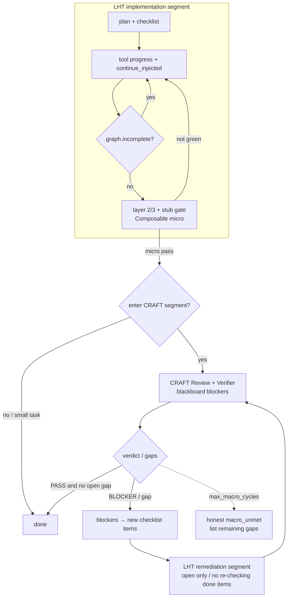
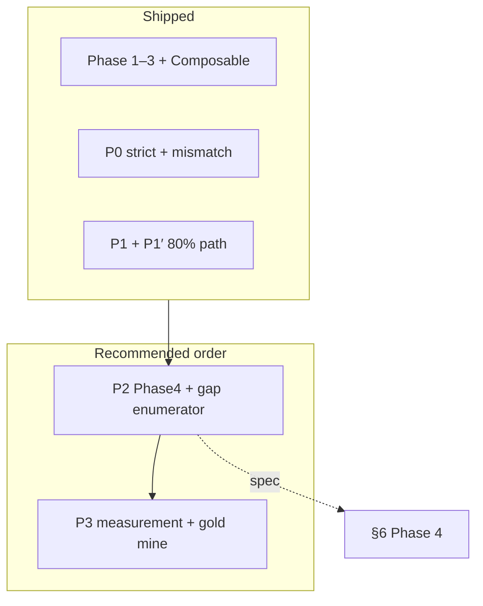
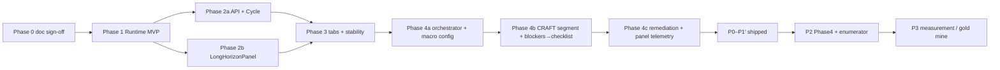

# Long-Horizon Code Tasks Harness Design

**Status:** **Implemented** (Phase 1 / 2 / 2.x / 3 substantially shipped; **§6 product iteration P0 / P1 / P1′ shipped**; **Phase 4 spec finalized**) — see §6 and overview below  
**Date:** 2026-05-28 (created) · 2026-05-29 (implementation status update) · 2026-06-01 (Phase 4 macro loop + **product iteration roadmap** + **P0–P1′ alignment revision**)  
**Scope:** Multi-step code tasks — **generation**, **fixing**, **refactoring** — Phase 4 spec includes **LHT↔CRAFT composable macro loop** (see §6 Phase 4); **excludes** full-repo audit scratchpad as the main line  
**Upstream:** Composable Harness vision (maintainer-only: `doc_Private/docs/harness/Agent+Harness组合式编程方案.md`)  
**Related:** CRAFT review plan (`doc_Private/docs/agent-reliability-craft-plan.md`), [`craft-v2-improvements.md`](../craft-v2-improvements.md), `crates/runtime-server/src/prompts/base.md`

### Implementation status overview (2026-06-01)

| Phase | Theme | Status | Key landing points |
|-------|-------|--------|-------------------|
| **0** | Documentation + two-round review sign-off | ✅ Done | §13 / §14 |
| **1** | Forced-continue MVP (gate + NudgeTracker + config + events) | ✅ Shipped | `long_horizon/{mod,graph,nudge,objective}.rs`, `no_tool_uses.rs` branch 6 |
| **2** | Task-graph API + Cycle integration + handoff + lower-left panel | ✅ Shipped | `harness/task-graph` · `cycles`, `LongHorizonPanel`, `[verify:]`, warning-band cycle |
| **2.x** | Objective progress signals (git) + nudge telemetry | ✅ Shipped this cycle | `progress.rs`, `progress_via_git`, `telemetry`, `nudge_outcome` events (§4.8 / §4.9) |
| **3** | In-cell tabs + Context threshold line + Handoff + sidecar recovery | ✅ Substantially shipped | `LongHorizonPanel` tabs, `.zagens/handoff.md` auto block |
| **4** | **LHT↔CRAFT composable macro loop** (implementation segment ↔ QA segment alternation) | 📋 Spec finalized | §6 Phase 4; upstream [`COMPOSABLE_HARNESS.md`](./COMPOSABLE_HARNESS.md) §3.1 / §6.7 |
| **P0** | Stricter trust + mismatch false-green | ✅ Shipped | §6 · P0a/P0b (`strict_completion_gate`, mismatch nudge, conditional UI completion) |
| **P1** | Large refactor checklist / manifest / toolchain / cross-layer acceptance | ✅ Shipped | §6 · P1a–P1d |
| **P1′** | ~80% path hardening (shim / electron enforce / lib.rs IPC / cargo build) | ✅ Shipped | §6 · P1′ implementation checklist |
| **P2** | Macro loop implementation + gap enumerator | 📋 Spec finalized | §6 Phase 4 + §6 product iteration · P2 |
| **P3** | Scale measurement + gold-mine backlog | 📋 Spec finalized | §6 product iteration · P3 |

**Fixed defects (during implementation):** progress bar fill, qualified-progress misjudgment (read-only exec), `max_nudges_per_item` hard cap reachable, stop-steer relaxed matching. See [`../../CHANGELOG.md`](../../CHANGELOG.md) `[Unreleased]`.

**Deferred until data accumulates:** §4.9 telemetry `conversion_pct` threshold tuning (measure first, tune later); Phase 4 orchestration layer; cross-session telemetry persistence; Desktop **LHT advanced settings** (`LhtSettingsPanel`) and batch regression automation.

**Empirical baseline (2026-06 · label_rust first run ~35min):** Harness observations driving P0→P1′ are in §6 product iteration · **empirical summary** (historical; corresponding items fixed in P0/P1/P1′; **second-round stress test** validates ~80% path).

**Gold-mine backlog (merged into §6 P3-5):** ① design review upfront; ② traceability matrix — see `doc_Private/docs/agent-reliability-craft-plan.md` §11.5. Parallel generation: [`PARALLEL_FRESH_GENERATION.md`](./PARALLEL_FRESH_GENERATION.md) (P0.5 / P1.5).

---

## 0. TL;DR

| Question | Position |
|----------|----------|
| Models often end refactor / generation / fix phases with prose-only output | **Harness does not trust self-declaration**; checklist/plan not empty → forced continue |
| Can CRAFT be reused directly? | **Not as the LHT main line**; Phase 4 acts as a **QA segment** **macro-alternating** with LHT (blockers→checklist→LHT again), see §6 Phase 4 |
| New fourth persistence layer? | **No**. Task graph **derived** from `update_plan` + `checklist_write`; behavior same family as audit `maybe_continue_incomplete_audit` |
| First code change? | `no_tool_uses.rs` add **`maybe_continue_incomplete_code_task`** + config switch + Desktop sidebar progress |

**Long-horizon three pillars (this design backbone):** **Cycle** (same thread, fresh brain) → **Handoff** (StructuredState + `<carry_forward>`) → **Visualization** (task graph + cycle timeline). Within the same cycle, "no early stop" relies on **forced continue** (§4).

**Product name (internal):** **LHT** — Long-Horizon Task harness for **Code** (alongside CRAFT and Audit Scratchpad, no brand collision).

---

## 1. Background and Problem

### 1.1 Phenomenon

Under Code TaskType, models for non-trivial requests typically can:

1. Call `checklist_write` / `update_plan` to break down steps (`base.md` already requires this);
2. Complete several `edit_file` / `apply_patch` operations;
3. Output "done / summary" prose, **without further tool calls**, and the turn ends.

For the user, the sidebar still shows pending items, or plan phases are not all `completed`, but the session has stopped — **long-horizon tasks terminate early at the cognitive layer**.

Root cause (aligned with composable design §4.1): attention decay on the initial objective; the model continues "the summary it just wrote" rather than checking against the task graph.

### 1.2 Boundaries with CRAFT / Audit

| Subsystem | Typical user intent | Completion criteria | Existing hard gates |
|-----------|---------------------|---------------------|---------------------|
| **Audit scratchpad** | Full-repo / broad **review** | inventory area closed + P2 gate | ✅ `maybe_continue_incomplete_audit` |
| **CRAFT** | Review → fix **closed loop** | review/verifier structured verdict | ✅ `<deepseek:craft.fix_loop>` |
| **LHT (this design)** | **Write** code: generate / fix bugs / refactor | checklist + plan **not all completed** + completion/stub gates (Composable) | ✅ continue / verify / completion gates |
| **LHT + CRAFT macro loop (Phase 4)** | Large refactor **multi-round closure** (~80%→~90%+) | LHT segment checklist cleared + machine gates green → CRAFT enumerates gaps → remediation segment | ✅ Shipped: `macro_loop.rs` / `spawn_macro_craft_review` / `auto_continue` / Desktop panel |

**No duplicate construction:**

- Do not bind CRAFT **verdict as** the sole judge of `graph_complete` (consistent with [`COMPOSABLE_HARNESS.md`](./COMPOSABLE_HARNESS.md) §3 iron rule);
- Do not apply audit inventory to refactor;
- Small tasks / bugfix **need not** go through CRAFT segment (see §7.2); large refactor uses **LHT→CRAFT→LHT** macro loop (§7.4).

### 1.3 Non-goals (not promised in first version)

- DAG task graph, cross-file hard locks, git worktree isolation (Proposal Phase 3+);
- Replace human final sign-off on requirements and merge;
- New Engine struct fields: Phase 1 **exception** — `long_horizon_continue_injected_this_turn` at audit parity (**Option A**, §13.1); everything else still follows [D17 Architecture Freeze](../tech/adr/D17_ARCHITECTURE_FREEZE.md).
- New top-level `/v1/*` paths (expand `threads/{id}/harness/*` before D8 is sufficient).

---

## 2. Design Principles

1. **Source of truth > model declaration** — Task completion is determined by **structured checklist/plan state**, not assistant prose.
2. **Consolidation first** — Task graph = read-only view of `SharedPlanState` ⊕ `SharedTodoList` ([`HARNESS_INTEGRATION_PROPOSAL.md`](./HARNESS_INTEGRATION_PROPOSAL.md) §3).
3. **Reuse audit continue template** — `scratchpad_flow::maybe_continue_incomplete_audit` already proves the "no tool call → inject user message → `TurnLoopControl::Continue`" path works.
4. **Closable, tiered** — Trivial single-step tasks should not be mistakenly continued; controlled via heuristics + `[long_horizon]` config.
5. **Visibility** — Desktop sidebar Plan/Todos and Harness gates use the same snapshot, avoiding "panel empty but engine working" or the reverse.

---

## 3. Long-Horizon Three Pillars: Cycle · Handoff · Visualization

LHT is not just "kick the model when it stops." Multi-hour code tasks rely on three layered capabilities:

```
                    ┌─────────────────┐
                    │ Visualization   │  Human: progress, cycle, handoff summary visible
                    └────────┬────────┘
                             │ same snapshot
                    ┌────────▼────────┐
                    │ Handoff         │  Across cycles: task graph + carry_forward
                    └────────┬────────┘
                             │ same runtime_thread_id
                    ┌────────▼────────┐
                    │ Cycle           │  Fresh brain, same chat; archive searchable
                    └────────┬────────┘
                             │ within same cycle
                    ┌────────▼────────┐
                    │ Forced continue │  checklist not empty → no prose-only finish
                    │ (§4)            │
                    └─────────────────┘
```

| Pillar | What it solves | Repo status | LHT increment |
|--------|----------------|-------------|---------------|
| **Cycle** | 1M window still insufficient / deep-window retrieval decay | ✅ `cycle_manager` + `cycle_hooks` | Schedule linked to checklist **breakpoints**; LHT context strategy (§10.2) |
| **Handoff** | After brain swap, "still remembers what to do" | ✅ Two layers: `StructuredState` + `<carry_forward>` | Briefing template **explicitly carries CodeTaskGraph**; LHT objective pin |
| **Visualization** | Black-box anxiety, inability to steer | ✅ `LongHorizonPanel` (task graph / Cycle / Context / Nodes) + Composer LHT chip | completion_gate summary, conditional completion state (P0/P1′) |

---

### 3.1 Cycle (checkpoint-restart)

**Definition:** Within the same `runtime_thread_id`, when the **next request's** live input estimate crosses the threshold, archive the current transcript, clear the message buffer, start a new cycle with **seed messages** — the user remains in the same chat.

**Implementation SSOT:** [`cycle_manager.rs`](../../crates/runtime-server/src/cycle_manager.rs), [`cycle_hooks.rs`](../../crates/runtime-server/src/core/engine/cycle_hooks.rs).

#### 3.1.1 Trigger conditions

| Condition | Description |
|-----------|-------------|
| `[cycle].enabled` | Default on (see config) |
| `active_input_tokens ≥ threshold` | Default **768K** (~1M window **75%**); `[cycle.per_model]` can override |
| **Clean boundary** | No in-flight tool / stream / approval (`should_advance_cycle(..., in_flight: false)`) |
| **LHT enhancement (Phase 2)** | In "warning band" (~75–85%), **prefer** `maybe_advance_cycle` immediately after checklist/plan item `completed`, avoiding brain swap mid-edit |

**Division of labor with compact:** compact = lossy summary in same buffer; cycle = **full archive + new buffer**. LHT **primary path is cycle** (§10.2).

#### 3.1.2 What happens inside a cycle (engine)

```mermaid
sequenceDiagram
  participant E as Engine
  participant LLM as Briefing LLM
  participant Disk as ~/.zagens/sessions/.../cycles/

  E->>E: should_advance_cycle (threshold)
  E->>LLM: produce_briefing (cycle_handoff.md)
  LLM-->>E: carry_forward text
  E->>Disk: archive_cycle → {n}.jsonl
  E->>E: StructuredState.capture (plan/todo/ws/subagents)
  E->>E: build_seed_messages → session.messages =
  Note over E: [CYCLE STATE] + [CYCLE BRIEFING] + pending user
  E->>E: cycle_count += 1; refresh system prompt
```

#### 3.1.3 Archive and retrieval

| Artifact | Path / tool | Purpose |
|----------|-------------|---------|
| Cycle JSONL | `~/.zagens/sessions/{session_id}/cycles/{n}.jsonl` | Full transcript cold storage |
| `recall_archive` | [`tools/recall_archive.rs`](../../crates/runtime-server/src/tools/recall_archive.rs) | BM25 search old cycles within new cycle (when briefing misses details) |
| `session.cycle_briefings` | In-memory + session persistence path | Chain of past `<carry_forward>` summaries |

**LHT convention:** Model writes **failed approaches / constraints / open checklist ids** in carry_forward; do not repeat tool output bytes (see [`cycle_handoff.md`](../../crates/runtime-server/src/prompts/cycle_handoff.md)).

#### 3.1.4 Failure and degradation

| Situation | Behavior |
|-----------|----------|
| Briefing LLM fails | **Do not advance**; status "cycle handoff failed"; stay in current cycle |
| Archive write fails | Still swap (briefing + StructuredState sufficient to continue) |
| Threshold reached but boundary not clean | Wait for next clean turn |
| Repeated cycle failures + context full | Fallback `compact_messages_safe` (§10.2) |

---

### 3.2 Cross-Cycle Handoff

Handoff has **two layers** — the deterministic layer does not depend on model judgment; the model layer only supplements "non-structurable" context.

#### 3.2.1 Layer 1: Auto-preserved (StructuredState)

`StructuredState::capture` snapshots at each cycle boundary (**already in production**):

| Field | Source | Form in new cycle |
|-------|--------|-------------------|
| mode / workspace / cwd | session | `## Cycle State` markdown |
| **plan** | `SharedPlanState` | `[ ] / [~] / [x]` phase list |
| **checklist** | `SharedTodoList` | Completion % + items |
| working set | `WorkingSet` | Summary of recently read/edited paths |
| Running sub-agent | `SubAgentManager` | agent_id + role + objective |
| audit scratchpad (if any) | `scratchpad_handoff_line` | run_id + resume area |

Rendered into the first seed user message: `[CYCLE STATE — auto-preserved ...]` (see `build_seed_messages`).

**LHT requirement:** plan + checklist are the **cross-cycle task graph SSOT** — as long as the model maintains the sidebar before brain swap, **open items are not lost** after handoff.

#### 3.2.2 Layer 2: Model handoff (carry_forward)

| Item | Description |
|------|-------------|
| Template | [`prompts/cycle_handoff.md`](../../crates/runtime-server/src/prompts/cycle_handoff.md) |
| Limit | Default ~3000 tokens (`briefing_max_for(model)`) |
| Must write | Decisions + rationale, constraints, hypotheses under test, **failed approaches**, pending user clarification |
| Must not write | Full tool output, full file contents, step-by-step operation log |
| Seed form | `[CYCLE BRIEFING — written by you on cycle N]` + `<carry_forward>...</carry_forward>` |

**LHT Phase 2 — briefing prompt enhancement (no change to cycle main flow):**

Append to `CYCLE_HANDOFF_TEMPLATE` or LHT overlay:

```markdown
Also include in <carry_forward>:
- Long-horizon objective (one line)
- Open checklist/plan item ids or labels still pending
- Last verification command and outcome (pass/fail/not run)
- Files currently being edited (paths only)
```

#### 3.2.3 Layer 3: LHT task graph injection (Phase 2)

After `StructuredState.to_system_block()` **and before** archive, merge derived `CodeTaskGraph` JSON or progress bar — same view as §4.1, ensuring **machine-readable** open items remain when briefing is sparse.

#### 3.2.4 Handoff acceptance criteria

| # | Acceptance |
|---|------------|
| H1 | After cycle N→N+1, sidebar checklist/plan **matches pre-swap state** (unless model just updated before boundary) |
| H2 | First turn of new cycle can continue **in_progress** items without repeating completed items |
| H3 | carry_forward contains at least 1 **failed approach** or **constraint** (manual spot-check) |
| H4 | User **does not** need a new chat; `runtime_thread_id` unchanged |
| H5 | `recall_archive` can find a `cargo test` output keyword from cycle N (optional regression) |

---

### 3.3 Visualization

**Principle (composable design §2.2):** Harness produces facts, visualization makes them visible — without task graph + cycle timeline for long-horizon tasks, users only see prose and inevitably steer too early or mistakenly think work is done.

#### 3.3.1 Current state (2026-06-01, aligned with repo)

| Capability | Desktop | Runtime events / API |
|------------|---------|---------------------|
| Checklist progress bar | ✅ [`ChecklistPanel.tsx`](../../crates/desktop/web-ui/src/components/ChecklistPanel.tsx) — **AuditGrid top-left** | `panel_checklist` / poll |
| Audit scratchpad | ✅ [`AuditScratchpadPanel.tsx`](../../crates/desktop/web-ui/src/components/AuditScratchpadPanel.tsx) — **AuditGrid top-right** | `GET …/scratchpad/status` |
| Sub-agents / CRAFT | ✅ [`AgentPanel.tsx`](../../crates/desktop/web-ui/src/components/AgentPanel.tsx) — **AuditGrid bottom-right** | `/v1/blackboards` |
| **LHT task graph** | ✅ [`LongHorizonPanel.tsx`](../../crates/desktop/web-ui/src/components/LongHorizonPanel.tsx) — **AuditGrid bottom-left** | `GET …/harness/task-graph` + SSE |
| Plan phases | ✅ LongHorizonPanel "Plan" section + faded plan outline | derived from `SharedPlanState` |
| Context usage | ✅ Composer footer / Context tab 768K line | `contextUsage.ts` |
| Cycle index / timeline | ✅ LongHorizonPanel Cycle tab | `GET …/harness/cycles` |
| carry_forward preview | ✅ Cycle tab briefing preview | cycle archive + API |
| LHT continue / gate nodes | ✅ Nodes tab + Composer chip | `long_horizon.*` status events |
| LHT strict toggle | ✅ [`LhtModeToggle.tsx`](../../crates/desktop/web-ui/src/components/LhtModeToggle.tsx) (Composer) | `get/set_lht_strict` → `settings.toml` |
| LHT advanced gates | ✅ [`LhtSettingsPanel.tsx`](../../crates/desktop/web-ui/src/components/LhtSettingsPanel.tsx) (sidebar) | `get/save_lht_settings` → completion sub-gates |
| Workspace deliverable override | ✅ Optional `{workspace}/.zagens/lht-deliverables.toml` | `merge_runtime_deliverables` |

**Still missing / follow-up:** §6.7 adversarial gap enumerator (independent adversarial auditor subagent, P2-2); 4e regression baseline (Phase 4); cross-session telemetry persistence (P3).

**Gap in one sentence:** The right-side **2×2 Harness grid** ([`AuditGridPanel.tsx`](../../crates/desktop/web-ui/src/components/AuditGridPanel.tsx)) already hosts checklist / audit / sub-agents; the **bottom-left reserved cell** is the LHT visualization landing point — symmetric with audit, no separate top-level panel.

#### 3.3.2 UI placement (sign-off: aligned with audit grid, 2026-05-28)

**Conclusion:** LHT visualization goes in **Composer right-side `AuditGridPanel` bottom-left GridCell** (i18n key `auditGrid.reserved` → Phase 2 becomes `Long-horizon`), **not** a new standalone sidebar or full-screen Harness page.

```
┌─ Right Harness Grid (AuditGridPanel, matches screenshot) ────┐
│ [Checklist]         │ [Audit scratchpad]    ← review sessions │
│ ChecklistPanel      │ AuditScratchpadPanel                    │
├─────────────────────┼───────────────────────────────────────┤
│ [Long-horizon] ★ LHT│ [Sub-agents / CRAFT]                  │
│ LongHorizonPanel    │ AgentPanel                              │
│ (Phase 2 replaces   │                                         │
│  reserved cell)     │                                         │
└──────────────────────────────────────────────────────────────┘
```

| Cell | Component | LHT relationship |
|------|-----------|------------------|
| Top-left | `ChecklistPanel` | **Shared** — checklist leaf progress (same source as LHT derived view) |
| Top-right | `AuditScratchpadPanel` | **Mutually exclusive** — LHT engine off when active scratchpad (§4.4); audit still shown in cell |
| **Bottom-left** | **`LongHorizonPanel` (new, Phase 2)** | **LHT primary visualization** — plan phases, objective, completion %, in_progress highlight, nudge/blocked |
| Bottom-right | `AgentPanel` | Shared — implementer / verifier sub-agents |

**Grid visibility:** Reuse [`useAuditGridData`](../../crates/desktop/web-ui/src/lib/useAuditGridData.ts) — any of checklist / audit / agents → `hasAnyData`. Phase 2 extends to `useHarnessGridData`, adding `hasLongHorizon` (graph incomplete + LHT enabled + not audit-only).

**Phase tiers (correcting original "HarnessPanel three-tab standalone panel" wording):**

| Phase | UI deliverable |
|-------|----------------|
| **1** | No bottom-left full panel; Composer footer or status chip shows `long_horizon.continue_injected` / `blocked` (optional) |
| **2** | Bottom-left **`LongHorizonPanel`** — single-view task graph (plan + checklist + objective + nudge count); poll `GET …/harness/task-graph` |
| **3** | Bottom-left cell **sub-tabs**: `[Task Graph] [Cycle] [Context]` — Cycle timeline + carry_forward preview + 768K threshold line (**not** a fourth grid cell) |

**Relationship to HARNESS_INTEGRATION_PROPOSAL:** Proposal's "AuditScratchpadPanel → HarnessPanel rename" **downgraded to Phase 3 optional** — LHT takes priority in the **reserved cell**, avoiding Phase 2 large refactor. Audit cell keeps `AuditScratchpadPanel` naming until grid-wide rename (`HarnessGridPanel`).

**Bottom-left cell Phase 2 content (task graph view):**

```
  · Plan phases (3–6 lines, status markers)
  · Checklist summary (same source as top-left; emphasizes plan↔todo hierarchy here)
  · Completion % · in_progress highlight · LHT nudge / blocked state
  · One-line objective (§4.5 derive_objective)
```

**Phase 3 bottom-left cell tabs (within cell, not new panel):**

```
│ [Task Graph] [Cycle] [Context]  ← Phase 3 only: tabs inside LongHorizonPanel │
│ Cycle: cycle #N, timeline, carry_forward collapsed preview                  │
│ Context: 768K threshold line vs 1M cap, next brain-swap hint                 │
```

#### 3.3.3 Runtime → UI contract (shipped + follow-up)

| Event / API | Payload highlights | Status |
|-------------|-------------------|--------|
| `GET /v1/threads/{id}/harness/task-graph` | §4.1 `CodeTaskGraph` JSON + `completion_gate` | ✅ |
| `GET /v1/threads/{id}/harness/cycles` | Cycle list + briefing summary | ✅ |
| SSE `harness.task_graph` | Panel push | ✅ |
| `long_horizon.continue_injected` / `blocked` / `gate_skip` / `integration_gate` / … | Harness node stream | ✅ |
| `panel_plan` (optional) | Plan snapshot emit symmetric with checklist | 🔶 Not done (derived view sufficient) |

**Persistence:** Cycle boundary writes thread event (`kind: cycle_advance`) for **replay** and cross-day resume timeline rendering (D7 JSONL derived, no new table).

#### 3.3.4 Visualization and steer closed loop

| User action | Harness response |
|-------------|------------------|
| Task graph shows stuck on a checklist item | Steer "skip X, do Y first" → working_set + LHT next nudge aligned |
| Cycle timeline shows briefing missed a constraint | Steer supplement; manually `/compact` **or** trigger re-brief if needed (P3 exploration) |
| Click "Pause LHT" | `long_horizon_paused` (§4.4) |

---

## 4. Architecture Overview (Forced Continue)

```
┌─────────────────────────────────────────────────────────────────┐
│  User: "Refactor this module into …"                            │
└────────────────────────────┬────────────────────────────────────┘
                             ▼
┌─────────────────────────────────────────────────────────────────┐
│  Agent turn loop                                                 │
│  1. checklist_write / update_plan (soft guidance, existing)      │
│  2. Tool execution (edit / test / read …)                        │
│  3. Model returns 0 tool calls                                   │
│       ↓                                                          │
│  handle_no_tool_uses_turn_loop                                   │
│       ├─ audit continue (existing, review-only)                  │
│       └─ ★ maybe_continue_incomplete_code_task (new)             │
│              · Read plan + checklist snapshot                    │
│              · Incomplete → inject continue nudge → Continue       │
│              · Complete / exempt → Break                           │
└────────────────────────────┬────────────────────────────────────┘
                             ▼
┌─────────────────────────────────────────────────────────────────┐
│  Optional: periodic objective re-injection (Phase 2)             │
│  · Every N turns or each checklist item completed                │
│  · cycle_hooks / carry_forward carry plan summary + progress bar │
└─────────────────────────────────────────────────────────────────┘
```

### 4.1 Task graph (derived view)

**Input sources (existing, in-memory + optional task SQLite):**

| Source | Type | Granularity |
|--------|------|-------------|
| `PlanState` / `update_plan` | 3–6 phases | Strategic |
| `TodoList` / `checklist_*` | Leaf steps | Verifiable |
| `plan.explanation` (if any) | One-line strategic note | Summary (not a separate struct field) |

**Derived `CodeTaskGraph` (read-only, no new table):**

```json
{
  "objective": "Refactor auth module to trait-based backend",
  "objective_source": "plan_in_progress",
  "phases": [
    { "step": "Inventory call sites", "status": "completed" },
    { "step": "Introduce AuthBackend trait", "status": "in_progress" }
  ],
  "checklist": [
    { "id": 3, "content": "Update tests", "status": "pending" }
  ],
  "completion_pct": 42,
  "open_items": 4,
  "in_progress_id": 2
}
```

`objective` is resolved by **fallback chain** (§4.5), **not** a `StructuredState` field (that struct only holds plan/todo snapshot, see [`cycle_manager.rs`](../../crates/runtime-server/src/cycle_manager.rs)).

**Completion criteria (LHT gate, basic):**

```
incomplete := ∃ plan step ∈ {pending, in_progress}
           ∨ ∃ checklist item ∈ {pending, in_progress}
```

When graph is doubly empty → **LHT not activated**.

### 4.2 Forced continue (core mechanism)

**Trigger conditions (all must hold):** No tool calls; LHT enabled; graph incomplete (§4.3); not injected this turn; not exempt. Gate / NudgeTracker details in §4.3.

**Injected message (example):**

```markdown
Long-horizon code task incomplete — do **not** end this turn with prose-only output.

Objective: Refactor auth module to trait-based backend
Progress: ████░░░░░░ 42% (plan 1/3 phases done; checklist 2/5 items open)

Still open:
- [plan ◎] Introduce AuthBackend trait
- [todo ○] Update integration tests
- [todo ○] Run scoped cargo test -p auth

Continue with tools: complete the current in-progress item, verify (e.g. cargo check/test), then checklist_update / update_plan before summarizing again.
```

**Nudge language:** Follows session `lang` (consistent with `base.md` Environment) — `zh-Hans` / `zh` → Chinese template; otherwise English. Phase 1 ships at least Chinese and English versions.

<details><summary>zh-Hans template example</summary>

```markdown
长程代码任务尚未完成 — 请勿仅用文字总结结束本轮。

目标：将 auth 模块重构为基于 trait 的后端
进度：████░░░░░░ 42%（plan 1/3 阶段；checklist 2/5 项未完成）

仍待完成：
- [plan ◎] 引入 AuthBackend trait
- [todo ○] 更新集成测试

请继续用工具完成当前 in_progress 项，验证（如 cargo check/test），再 checklist_update / update_plan。
```

</details>

#### 4.2.1 `no_tool_uses` full branch chain (code SSOT)

LHT inserts **after audit_continue, before Break** (second review 🔴#2):

```
1. scratchpad_summary + pending steers     → Continue
2. pending steers (alone)                  → Continue
3. sub-agent completions (drain / wait)    → Continue
4. REPL blocks                             → Continue or Break
5. maybe_inject_incomplete_audit_continue  → Continue   ← audit exclusive
6. ★ maybe_continue_incomplete_code_task   → Continue   ← LHT
7. Break
```

Anchor: [`no_tool_uses.rs`](../../crates/runtime-server/src/core/engine/turn_loop/host_impl/no_tool_uses.rs) (audit ≈ L306; LHT inserts before L309).

**Implementation anchors:**

| File | Action |
|------|--------|
| `long_horizon/{mod,nudge,graph}.rs` | graph, continue, **NudgeTracker** |
| `no_tool_uses.rs` | Branch 6 (§4.2.1: audit #5 → LHT #6 → Break) |
| `core/src/engine/runtime.rs` | **`long_horizon_continue_injected_this_turn`** (**Option A**, §13.1) |
| `message_handlers.rs` | Reset audit + LHT one-shot each turn |

### 4.3 Completion criteria and NudgeTracker

**Basis:** See §4.1 `incomplete` formula.

| Rule | Behavior |
|------|----------|
| Explicit finish | Snapshot all **completed** → no nudge |
| Blocked | Same `in_progress_id` **3** nudges without **qualified progress** (§4.3.1) → `long_horizon_blocked` |
| Item change reset | `in_progress_id` changes → reset counts |
| **Stale checklist** | Same `in_progress_id` for **8** consecutive assistant turns without tool call → nudge becomes "please steer or update checklist", no mechanical continue (🟡#7) |
| max_nudges | Same item ≥ **5** → stop nudging; **next user message** clears `long_horizon_blocked` / paused (acceptance 🟡#6) |

#### 4.3.1 Qualified progress ("no progress" determination, second review 🔴#3; Phase 2.x upgraded to objective signals)

**Design philosophy (evidence-based):** "Whether there is progress" should not be **subjectively asserted** by command regex alone, but should rely on **objective traces** (did files actually change, did tests actually pass). Phase 1 regex whitelist is a pragmatic "get it running" starting point; Phase 2.x adds **git working-tree changes** as a language-agnostic objective signal — regex is one signal among many, no longer the sole judge.

`had_progress` (progress since last nudge) = any of the following is true:

| Signal | Counts as progress iff | Nature | Phase |
|--------|------------------------|--------|-------|
| `edit_file` / `write_file` / `apply_patch` | tool result **success** | Objective (write succeeded) | 1 |
| `exec_shell` / `run_tests` | Command matches `VERIFICATION_CMD_RE` and exit 0 | Heuristic (whitelist) | 1 |
| `checklist_update` / `update_plan` | Successful state transition | Objective | 1 |
| **git working-tree change** | `git status --porcelain` signature differs from **last nudge** | **Objective, language-agnostic** | **2.x** |
| Other read-only (`ls`/`echo`/`cat`…) | — | **Never** counts as progress | 1 |

```rust
// Phase 1 — coarse but testable (whitelist retained for "tests passed" progress without file changes)
const VERIFICATION_CMD_RE: &str =
    r"(?i)\b(cargo\s+(test|check|build|clippy)|npm\s+test|pnpm\s+test|yarn\s+test|pytest|go\s+test)\b";
```

**git objective signal (Phase 2.x, §4.8):** Addresses regex whitelist distortion for `make` / custom scripts / non-Rust-JS-Go projects — as long as the working tree **actually changed** since last nudge (tracked file add/modify/delete, new untracked files), regardless of which command caused it, counts as progress. gitignore-only artifacts (compiled binaries, etc.) are excluded, matching "no source change = no substantive progress". Can be disabled via `[long_horizon] progress_via_git` (non-git repos auto-degrade to pure Phase 1 determination).

NudgeTracker checks for qualified progress since last nudge (including git signal) before each nudge.

```rust
struct NudgeTracker {
    no_progress_streak: HashMap<u32, u32>, // drives blocked (cleared on progress)
    total_per_item: HashMap<u32, u32>,     // drives max hard cap (not cleared on progress, §4.3 #5)
    last_in_progress_id: Option<u32>,
    blocked: bool,
}
```

Plan-only: key = `0xFFFF_0000 | plan_index`.

**`had_progress` scope boundary (DEMO2 empirical fix, 2026-05):** Qualified progress **only** clears `no_progress_streak` (protects actively working models from mistaken `blocked` abandonment), **does not** skip nudge. Rationale: gate triggers only when "model makes no tool calls, prose finish, task incomplete", and "wrote something then dropped mid-way" is exactly the cognitive early-stop pattern LHT targets — `had_progress` is almost always true in that round. Early implementation had `had_progress=true` directly `SkipProgressReset` (no nudge), letting models write files, checklist stuck at 0%, and finish. After fix: progress rounds still nudge normally, `max_nudges_per_item` hard cap as backstop; only `!had_progress` rounds accumulate streak toward `blocked`. Empirical evidence: thread `thr_0eda7dcc` (`long_horizon.gate_skip: reason=nudge_skip_progress_reset`, turn `Completed` with `incomplete=true`).

**"Acceptance collapsed to creation item" false-green (DEMO3 empirical fix, 2026-05):** In a 20K-line Go interpreter stress test, the task **ran to completion, checklist fully checked, turn `Completed`**, but post-hoc example scripts: 4 run, 2 crash (`%` modulo unimplemented, lexer rejects numeric identifiers like `counter1`). Root cause is not model lying, but **decomposition downgrading "runnable acceptance" semantics to "create file" items**: acceptance "REPL runs all examples" became checklist item 13 "create example scripts (.monkey)" — creating files counts as done; only `go build/vet/test` items had `[verify:]` gates, and unit tests didn't cover those two features, so `go test` truly green → all checked → finish. `max_tokens=393216` held throughout, zero length truncation (truncation fix effective), so this is a **pure verification loop gap**, not truncation or early stop. Two fixes: ① (root cause) `base.md` checklist discipline adds `[verify: <command>]` teaching — any "run/build/test pass/run examples" acceptance **must** be written as `[verify: cmd] <label>`, explicitly "creating files ≠ verification passed"; ② `verify::unverified_acceptance_suffix` + `host_impl` gate hardening: items marked `completed` that **read like runnable acceptance but lack `[verify:]` prefix** get hard hint appended after `checklist_update`/`todo_update` results, catching this false-green. Former gets models to actually use `[verify:]`; latter catches missed tags.

**Step-budget exhaustion silent early stop (DEMO4 empirical fix, 2026-05):** A 20K-line Go interpreter stress test ran ~29 minutes then **stuck at 40%, turn spinning idle**. `sidecar.log` proves **not stream/length truncation**: `[stream-probe]` **exactly 100 entries**, all `stop_reason=tool_calls`, `stream_errors=0`, `chunk_timeout=0`, `max_tokens=393216`, `rx_backlog` single digits — i.e. hit the **default `max_steps: 100`** tool-step budget; `run.rs` terminated with a single `break` (`Reached maximum steps`). This is the **third silent early stop** after length truncation and prose early stop: LHT continue nudge only hooks the *no-tool-uses* path, while tool-dense turns hitting the step budget **completely bypass harness**, task halts (hence no `[lht-probe]`, no checklist completions). Fix in §4.6 "step-budget auto-continue": `maybe_continue_at_step_limit` hook at cap gives long-horizon tasks **another budget window + continue injection**, bounded by `MAX_STEP_LIMIT_CONTINUATIONS=3`. Key lesson: **every turn-termination exit must pass the LHT continue gate**, otherwise it is a new silent early-stop leak (length / prose / step exhaustion are three exits of the same class).

**plan/checklist double-counting → progress stuck + false `incomplete_stop` (DEMO5 empirical fix, 2026-05):** A fresh Go project (Monkey dual-backend interpreter) generation task **actually fully completed, artifact builds**, but UI progress bar stuck at **61%**, showing **12 open items**, finish also reported `incomplete_stop` false-positive abandon signal. Field data: model called `update_plan` once creating 12 plan items, then abandoned them all `pending`; `checklist_update` multiple times, 19 items all `completed`. Progress = `19/(12+19) ≈ 61%`. Root cause: `long_horizon/graph.rs::from_snapshots` treated plan count and checklist count as **disjoint workload summed directly** (`total = phases.len() + checklist.len()`, `open_items`/`incomplete()` OR both sides). 12 pending plan items became "zombie open items": progress stuck, `incomplete()` wrongly true, after checklist finish `in_progress_id` fell back to plan (then → `None`) → nudge gate `Skip` (`reason=nudge_skip`, `continue_injected` never triggered) → final landing misjudged true completion as abandonment. Fix (Option 1 — **checklist as completion authority**): when checklist non-empty, completion/`open_items`/`incomplete()`/`in_progress_id` **only** from checklist (no longer fall back to zombie plan InProgress), plan for outline display only not workload; only when checklist empty fall back to plan (plan-only behavior unchanged). Acceptance: DEMO5 snapshot (12 plan pending + 19 checklist completed) → 100% / 0 open / not incomplete / `in_progress_id=None`. Change `graph.rs` + unit tests. Soft supplement: `base.md` adds "plan and checklist are the same work, not two copies" discipline, preventing models from "build plan then abandon, only push checklist" creating zombie items.

**verify_gate all `mismatch` false-green noise (DEMO5 empirical fix, 2026-05):** In the same DEMO5 run, `[lht-probe] verify_gate` for items 12–19 (with `[verify:]` tags: `go build`/`go vet`/`gofmt`/`go test`/`go test -cover`/`bash scripts/run_examples.sh`/`bash scripts/conformance.sh`/`./monkey run …`) **all `verdict=mismatch`**, but thread proves model **actually ran** verification (`go test ./...` all packages `ok`, `go test -cover` coverage, all exit 0). Classified as **(a) overly strict matcher false mismatch** (not (b) marked complete without running). Root cause: **two stacked bugs**: ① **`result_contains_success` checks wrong strings** — gate recording verification commands besides `success` boolean (already exit 0) also required result **text** to contain `"exit code: 0"`/`"success: true"`; but `exec_shell` **success** path returns bare stdout (`ok  monkey/lexer 0.078s`), **no** exit code line (only failures print `Command failed (exit code: …)`), so record gate false for every success → `recent_verification_cmds` **always empty** → all `[verify:]` items necessarily mismatch (language-agnostic). ② **`VERIFICATION_CMD_RE` too narrow** — Go only recognizes `go test`, not `go build/vet/run`, `gofmt`, `bash` scripts, `./monkey`; even fixing ① these 6 items wouldn't record. Fix: remove redundant wrong `result_contains_success` from record gate and qualified-progress (rely on `success`, delete function); expand `VERIFICATION_CMD_RE` with `go build|vet|run`, `gofmt`, `make`, `bash …`/`sh …`/`./…`; LRU `MAX_RECENT_VERIFICATION_CMDS` 12→24 (batch complete at finish still matches earlier runs). Change `nudge.rs`/`verify.rs`/`mod.rs`/`host_impl` + unit tests. **Lesson: `success` is already exit-0 authority; don't double-confirm success via result text — success path never prints exit code.**

**Cycle threshold only evaluated "between turns", not periodically within long turns (DEMO5 empirical fix, 2026-05):** Checkpoint-restart cycle gate (`should_advance_cycle` threshold + long-horizon early brain-swap warning band) has **single repo-wide evaluation point** at inter-turn `maybe_advance_cycle` (`message_handlers.rs`, after turn returns `Completed`). A long-horizon turn running hundreds of tool steps inside turn loop without returning — gate **never evaluated** — even when live context exceeds ~75% warning band, **clean early brain swap won't happen within turn**, only backlog C hard overflow fallback (swap at model hard cap, not clean breakpoint); warning-band checklist completion's `pending_cycle_at_checkpoint` flag also waits forever for turn boundary to consume. Fix: new bounded hook `TurnLoopHost::maybe_advance_cycle_at_checkpoint`, at each tool step's **safe breakpoint** (stream + tool execution complete, before `next_step()` → `in_flight=false`, no mid-edit/stream cut) reuses same threshold gate + `perform_cycle_advance` body; after swap loop re-requests with small briefing seed. Gated to LHT code tasks (`cycle.enabled`+`long_horizon.enabled`+code surface; plan mode no swap), `MAX_IN_TURN_CYCLE_ADVANCES=8` backstop against pathological seed. Complements backlog C: **#5 is clean, early; backlog C is at-cap, emergency**. `maybe_advance_cycle` now returns `bool` (inter-turn callers ignore). Change `streaming.rs` (const)/`turn_loop/{host,run}.rs`/`cycle_hooks.rs`/`host_impl`. DEMO5 itself only reached 34% untriggered, but any long turn crossing 77% hits this.

**LHT panel "Nodes" tab — decision flow into UI (DEMO5 empirical improvement, 2026-05):** This diagnosis required offline grep of `sidecar.log` to see `continue_injected` never triggered — `long_horizon.*` node decision flow (`continue_injected`/`gate_skip`/`incomplete_stop`/`blocked`/`context_warning`/`step_limit_continue`/`loop_guard_continue`/`cycle_advanced`/`verify_gate`) was previously invisible in UI. These status events **were already persisted** (monitor stores each `long_horizon.*` as Status-type `TurnItemRecord`), so harness telemetry cache (`HarnessTelemetryCacheEntry`) adds bounded ring (`MAX_HARNESS_NODE_RECORDS=80`) recording recent node decisions, attached to panel's **already polling** `harness/task-graph` payload (`recent_nodes` field) — **no new backend endpoint**. Frontend adds **Nodes** tab, reverse chronological render, color coding: continue/brain-swap green, skip/blocked/warning yellow, `incomplete_stop`/halt red, verify `mismatch` orange, showing `reason`/`open_items`/`nudge_count`/`verdict` key fields. `verify_gate` verdict (formerly only `eprintln`) now also emits `long_horizon.verify_gate` status event, entering node stream. Change `manager.rs`/`host_impl` + `LongHorizonPanel.tsx`/`types/longHorizon.ts`/`i18n/locales/*`.

**DEMO6 empirical validation + verify gate `checklist_write` blind spot fix (2026-05-30):** Clean rerun of same problem as DEMO5 (20K-line Go Monkey dual-backend interpreter, fresh empty directory generation), validating DEMO5 #1/#5 fixes, 45:39 task passed. **Node stream evidence (finally data):** ① `step_limit_continue open_items=10` — hitting 100-step budget within turn correctly **continued not stalled** (#5/§4.6 effective); ② finish `gate_skip reason=graph_complete open_items=0` — completion gate saw 0 open items (checklist authority = #1 effective) correctly skipped forced continue, clean turn `Completed`; ③ **no `incomplete_stop` throughout** — DEMO5's stuck-at-61% false positive P1 gone, direct evidence for #1. **Offline verification (ran all `[verify:]` in `F:\DEMO6`):** `go build`/`go vet`/`gofmt -l`/`go test ./...`/`bash scripts/run_examples.sh` (40/40 dual-backend)/`bash scripts/conformance.sh`/`./monkey run … --engine=vm` (=55) **all exit 0**; only miss was `go test -cover` "per-package ≥80%" (ast 37.5% / object 47.1% / evaluator 77.2% / compiler 77.9% / vm 78.1% below, cmd/repl no tests) — command exit 0 but **semantic threshold unmet, gate cannot block on exit code** (inherent harness verify gate boundary: can only confirm "command ran and exit 0", not human-readable thresholds like "≥80%"). **Only code fix this round: verify gate `checklist_write` blind spot.** DEMO6 node stream had **zero `verify_gate`** — model used bulk `checklist_write` (full table replace) to mark complete, but gate previously only hooked per-item `checklist_update`/`todo_update`, verdict logic never ran on that path (#2 fix never triggered). Fix: gate now also triggers on `checklist_write` — after any of three tools succeeds, **scan `Completed` items in post-write checklist snapshot**, run verdict per **new** completion, session-level `gated_completed_ids` dedup (bulk write resending full table triggers each item once). Verdict logic extracted to testable pure function `verify::verify_gate_verdict` (verified/mismatch/unverified_acceptance/untagged_ok). Change `long_horizon/{verify.rs,nudge.rs,mod.rs}` + `host_impl` + unit tests. **Follow-up candidate (not done):** Change coverage acceptance to script "any package <80% → non-zero exit" so exit code reflects threshold and gate can block.

**Turn termination exit audit (systematic review after DEMO4, 2026-05):** Following the lesson above, walked **all turn termination exits** in `core/engine/turn_loop/{run,streaming_phase,tool_phase}.rs`. Structural conclusion: **all outer-loop `break` paths converge to same `Completed` landing in `run.rs`** (unless `turn_error` set → `Failed`) — so criterion is simple: **any exit that "breaks bypassing no-tool-uses LHT continue gate without setting `turn_error`" = false-green marking `Completed` while task incomplete**. Per-exit conclusions: ① top cancel → `Interrupted` (reasonable); ② `at_max_steps` → continue fix (above); ③ context overflow recovery exhausted → original `Failed` suggesting `/compact` (throws up, not false-green, but long task hard-interrupted, missing LHT-aware cycle handoff — **backlog C fixed**: before hard fail, run `maybe_cycle_handoff_on_context_overflow` forced cycle handoff, see §4.6 "context overflow cycle handoff"); ④ in-stream duration/overflow/stream-error exhausted → set `turn_error` → `Failed` (reasonable); ⑤ chunk_timeout thinking-chain idle truncation → no-tool-uses path → LHT gate continue (covered); ⑥ `stop_after_plan_tool` → only `is_plan_mode && update_plan`, LHT in agent mode, **not a gap**; ⑦ **loop_guard halt → `break` → `Completed`, fully bypasses LHT gate = fourth silent early stop** (below). **Fourth: loop_guard halt early stop.** Same tool failing `FAILURE_HALT_THRESHOLD=8` consecutive times, `LoopGuard` uses `OutcomeDecision::Halt` to interrupt turn, `tool_phase` directly `break_outer_loop`, not via no-tool-uses path. Fix in §4.6 "loop_guard halt continue": `tool_phase` outcome adds `loop_guard_halted` flag, `run.rs` at that exit via `maybe_continue_after_loop_guard_halt` hook, for incomplete long-horizon tasks **clear per-tool failure counts** (`LoopGuard::reset_failures`, identical-call block retained) and inject "you're stuck repeating the same failing tool — change approach: different tool/params, read error first, don't stop" nudge, `MAX_LOOP_GUARD_CONTINUATIONS=2` backstop. **Defense layer: observable probe on abandon exits.** Root cause: "all breaks look like clean `Completed`, no distinction true complete vs abandon". `run.rs` final landing adds `note_incomplete_stop_if_lht` hook: if finish is `Completed` but LHT graph still incomplete (nudge budget exhausted / continue rounds exhausted / REPL / no-tool break …), emit `long_horizon.incomplete_stop: {open_items:n}` probe (via `[lht-probe]` tee to `sidecar.log`), letting stress tests and UI distinguish "truly done" vs "gave up". Observation only, no outcome type change.

### 4.4 Exemptions

| Scenario | Behavior |
|----------|----------|
| steer stop / pause first | `long_horizon_paused` |
| graph empty | No injection |
| trivial single step | No injection |
| Plan mode | Defer to `should_stop_after_plan_tool` |
| Office | LHT off |
| audit scratchpad | **Only** audit continue (§4.2.1 #5) |
| **approval_mode ≠ Auto** | LHT **still injects** nudge; model-initiated writes needing approval follow existing approval flow. Approval **rejected/timeout** ends turn → **no** further nudge this turn; **next user message** or after approval completes can re-evaluate incomplete (🔴#4) |

### 4.5 Objective — `derive_objective` spec (second review 🔴#1)

Phase 1 must implement:

```rust
/// Returns (objective_one_line, source_tag)
pub fn derive_objective(
    plan: &PlanSnapshot,
    checklist: &TodoListSnapshot,
    messages: &[Message],
) -> (String, &'static str)
```

**Algorithm (sequential, return on first match):**

| Step | Condition | Output | Truncation |
|------|-----------|--------|------------|
| 1 | `plan.explanation` non-empty | First sentence (split on `.` / `。` / `\n`, take first) | ≤ **120** chars |
| 2 | plan has `in_progress` step | **That step's full `text`** (not concatenate all pending) | ≤ **120** chars |
| 3 | No plan in_progress, has `pending` step | **First** pending step's `text` | ≤ **120** chars |
| 4 | checklist has `in_progress` item | That item's `content` (strip `[verify: …]` prefix) | ≤ **80** chars |
| 5 | Most recent **user** message (scan backward) | `summarize_text(text, 280)` | Already truncated |
| 6 | fallback | `"Long-horizon code task"` / `"长程代码任务"` (by lang) | — |

**Do not** use first user message; **must** use **most recent** user message (step 5).

### 4.6 max_steps and nudge

- **`LoopGuard`** ([`loop_guard.rs`](../../crates/core/src/engine/loop_guard.rs)): Same turn same tool+args — **no direct conflict** with LHT.
- **`max_steps` (default 100):** LHT harness nudge path **does not bump** step (`continue_without_step_bump` or equivalent).
- **Boundary (🔵#12):** **Normal tool calls** after nudge **still bump** step. When `turn.steps_remaining() ≤ 3` and graph incomplete, nudge template appends: `Approaching turn step limit — consider cycle refresh or steer.` / Chinese equivalent.
- **Distinction from blocked:** User seeing `Reached maximum steps` means **step budget exhausted**, not `long_horizon_blocked`; UI should distinguish.
- **Step-budget auto-continue (DEMO4 empirical fix, 2026-05):** `at_max_steps` no longer blindly `break`. Before termination, via `TurnLoopHost::maybe_continue_at_step_limit` hook: if **LHT enabled + code task-surface + task graph still incomplete and not trivial**, inject focused continue nudge and **issue another step budget window** (`turn.max_steps += original budget`), bounded by `MAX_STEP_LIMIT_CONTINUATIONS=3` (≤4× baseline, e.g. 100→400) against runaway. Plan mode no continue; non-LHT host defaults `false` preserving original cap behavior. Emit `Step budget reached; continuing long-horizon task (n/N)` status + `long_horizon.step_limit_continue` event. See DEMO4 evidence above.
- **loop_guard halt continue (turn termination exit audit, 2026-05):** Same tool failing 8 consecutive times, `LoopGuard::Halt` makes `tool_phase` directly `break`, originally bypassing LHT gate marking `Completed` (fourth silent early stop). Now `tool_phase` outcome carries `loop_guard_halted` flag, `run.rs` at that exit via `TurnLoopHost::maybe_continue_after_loop_guard_halt` hook: for incomplete long-horizon tasks **clear per-tool failure counts** (`reset_failures`, identical-call block retained) and inject "change approach, don't repeat" nudge, `MAX_LOOP_GUARD_CONTINUATIONS=2` backstop. Emit `Loop-guard halt; nudging long-horizon task to change approach (n/N)` status + `long_horizon.loop_guard_continue` event. Plan mode and non-LHT host keep original halt (default `false`).
- **Abandon exit observability (same audit):** `run.rs` final `Completed` landing adds `note_incomplete_stop_if_lht`: if LHT graph still incomplete at finish, emit `long_horizon.incomplete_stop: {open_items:n}` (via `[lht-probe]` to `sidecar.log`), distinguishing true complete vs abandon. Observation only, no outcome change.
- **Context overflow cycle handoff (turn termination exit audit backlog C, 2026-05):** When in-turn dialogue exceeds model input budget, original `recover_context_overflow` (emergency compression: keep recent messages + summary) failing after `MAX_CONTEXT_RECOVERY_ATTEMPTS=2` then `Failed` blaming `/compact`. Root cause: what truly resets context to "tiny briefing seed" — **cycle handoff (`maybe_advance_cycle`) only runs between turns** (`message_handlers.rs`, after turn returns `Completed`) — long-horizon tasks running many steps inside turn loop without returning, cycle never gets a turn, and emergency compression can't shrink "buffer bloated by large tool results". Fix: before hard fail, via `TurnLoopHost::maybe_cycle_handoff_on_context_overflow` hook **force one cycle handoff within turn** — `cycle_hooks.rs` extracts swap body as `perform_cycle_advance` (normal `maybe_advance_cycle` still uses threshold gate), `force_cycle_handoff_for_overflow` skips gate swapping buffer for small briefing seed + preserved plan/todos/working-set/handoff.md, then reset recovery budget and retry. `MAX_CONTEXT_CYCLE_HANDOFFS=2` backstop; briefing call reserved output much smaller than full turn, usually fits even when full turn overflows; only when even small seed won't fit fall back to original hard Failed. Gated `cycle.enabled` (plan mode no handoff; default hook `false`).

### 4.7 Objective re-injection (Phase 2)

Audit relies on scratchpad L0 line; LHT relies on **plan/checklist summary**:

| Trigger | Injection point | Content |
|---------|-----------------|---------|
| Each checklist item → `completed` | tool result metadata partially exists | Strengthen: next pending item + remaining count |
| Every **K** assistant steps (default K=8) | `cycle_hooks` / pre-request | Compressed plan + checklist progress bar |
| After compaction | `<carry_forward>` | open checklist ids + last failed verification command |

**Align wording** with [`capacity_flow/replay.rs`](../../crates/runtime-server/src/core/engine/capacity_flow/replay.rs) `open_loops`, avoiding two "incomplete" semantics.

### 4.8 Objective progress signal — git working-tree changes (Phase 2.x, "let facts speak")

**Motivation:** §4.3.1 regex whitelist is subjective assertion of "progress", distorting for `make` / custom scripts / C·C++ / non-mainstream language projects — exec never counts as verification progress there, so `blocked` may misjudge. More evidence-based criterion: **did the working tree actually change**.

**Spec:**

| Item | Convention |
|------|------------|
| Signal source | `git status --porcelain=v1` (reuse [`runtime_api::workspace::run_git`](../../crates/runtime-server/src/runtime_api/workspace.rs), no new git wrapper) |
| Signature | Stable hash of full porcelain (`workspace_change_signature`); `None` = non-git repo / git unavailable |
| Determination | At nudge gate evaluation, current signature ≠ **signature stored at last nudge** → `git_progress = true` |
| Baseline | Store current signature after each **actual nudge emitted**; first nudge has no baseline (no false positive) |
| Call timing | **Only** when LHT gate triggers (no-tool-call finish round), once via `spawn_blocking`; **not** on every tool result |
| Merge | `had_progress = progress_since_last_nudge(Phase 1 tool signals) ∨ git_progress` |
| Switch | `[long_horizon] progress_via_git` (default true); non-git repos auto-degrade |
| Boundary | gitignore-only artifacts (compiled binaries) absent from porcelain → no progress (no source change = no substantive progress, as expected) |

**Why not run git on every tool result:** Cost + noise. Finish rounds (gate trigger) are infrequent, once per round suffices, semantics match "before this finish round, relative to last nudge, did code actually move".

### 4.9 Nudge telemetry — measure first, tune later (Phase 2.x, "practice yields truth")

**Motivation:** §4.3 thresholds (stale=8, blocked=3, max=5, warning band 75–85%) are currently a priori guesses, **no data** backing. Before tuning must **measure** whether nudge actually helps — "after nudging, was there qualified progress".

**Minimal telemetry (in-memory derived, no new persistence):**

| Metric | Meaning | Collection point |
|--------|---------|------------------|
| `nudges_emitted` | Continue nudges actually emitted this session | Decision = Nudge and injection succeeded |
| `nudges_converted` | Count where "qualified progress observed before next evaluation" | Gate evaluates `had_progress` with pending nudge |
| `nudges_blocked` | Times `blocked` (give up) triggered | Decision = Blocked |
| `conversion_pct` | `converted / emitted` (derived) | task-graph JSON computation |

**Exposure:**

| Channel | Content |
|---------|---------|
| `long_horizon.continue_injected` event | Append `emitted` / `converted` running values |
| `long_horizon.nudge_outcome` (new, optional) | On conversion detected emit `{ item_id, turns_to_progress }` |
| `GET …/harness/task-graph` JSON | Append `telemetry: { emitted, converted, blocked, conversion_pct }` |

**Use:** After several real long-horizon sessions, use conversion_pct to infer threshold reasonableness (e.g. long-term <30% means nudge is useless work, raise blocked threshold or change nudge copy). **This phase instruments only, no tuning** — tuning waits for data, which is "practice yields truth".

**Not doing (deferred):** Persist telemetry to thread events (cross-session aggregation), Desktop telemetry panel — validate in-memory signal useful first.

### 4.9.1 Offline node log `[lht-probe]` (debug/test)

Telemetry goes to UI panel + DB, **not `sidecar.log`** — offline replay of stuck/false-green run with panel closed, DB hard to read directly, no grep-able LHT footprint. Add two `eprintln!` probes (sidecar has no `tracing` subscriber, stderr → `sidecar.log` is only sink, same convention as `[stream-probe]`/`[thinking-probe]`, low frequency ≈1–2 lines/round, no gating, diagnostic only):

| Probe | Location | Output |
|-------|----------|--------|
| **Central tee** | `runtime-orchestrator/.../monitor.rs` (`long_horizon.*` choke point) | `[lht-probe] long_horizon.<kind>: {…} thread=… turn=…` — mirrors each node: `gate_skip` (which guard suppressed nudge)/`continue_injected` (nudge sent + emitted/converted/open_items)/`blocked`/`context_warning`/`nudge_outcome` |
| **verify gate verdict** | `runtime-server/.../host_impl/mod.rs` (each checklist/todo marked `completed`) | `[lht-probe] verify_gate tool=… item=<id> verdict=<verified\|mismatch\|unverified_acceptance\|untagged_ok\|no_item> content="…"` — prints per-item false-green guard verdict |

**Usage:** `Select-String -Path $env:USERPROFILE\.zagens\logs\sidecar.log -Pattern '\[lht-probe\]'` (PowerShell) replays full harness decision loop chronologically. In DEMO4 "all `[verify:]` items" stress test, check `verdict=` for `untagged_ok` (missing tag) or `mismatch` (tagged but not run).

---

## 5. Configuration and Harness Presets

### 5.1 `config.toml` draft

**Phase 1 (MVP):**

```toml
[long_horizon]
enabled = true
max_nudges_per_item = 5
blocked_nudges_without_progress = 3   # same in_progress item without qualified progress (§4.3.1)
```

**Phase 2 (additive, do not mix with Phase 1):**

```toml
reinject_every_steps = 8              # Phase 2 — objective re-injection (§4.7)
require_checklist_for_writes = false  # Phase 2 — optional warning
```

**Run to completion (C1+C2, cross-phase continuous push):**

```toml
auto_continue = true                  # enable "continue past give-up" fallback (default false)
max_auto_continue_rounds = 16         # per-turn auto-continue hard cap (prevent true deadlock spin)
```

- **C1 (default on):** Within same turn, after each quality tool progress, prose-only early stop gets nudged again (no longer once per turn only); caps still from `max_nudges_per_item` / `blocked_nudges_without_progress` with progress backstop.
- **C2 (`auto_continue=true` only):** When regular nudge gateway has given up but task graph still truly incomplete, clear give-up and re-inject stronger continue message, keep turn alive, up to `max_auto_continue_rounds`; telemetry via `long_horizon.auto_continue` / `long_horizon.auto_continue_exhausted`.
- Model-side discipline from `prompts/base.md` "Run to completion" section: handoff / cycle / checklist cleared / objective re-injection **are not stop signals**; only "real user-decision blockers" and "all complete with verification passed" stop.

**Phase 2.x (objective signals + telemetry):**

```toml
progress_via_git = true               # Phase 2.x — git working-tree change as objective progress signal (§4.8)
                                      # non-git repos auto-degrade to pure Phase 1 determination
```

> Telemetry (§4.9) needs no config — collected by default when LHT enabled (in-memory derived).

**Verification item convention (Phase 1 design, Phase 2 automation):** No checklist body regex. checklist `content` optional prefix **`[verify: cargo test -p auth]`** — **Phase 2** engine parses prefix, UI hides; on `completed` compare against recent qualified `exec_shell` (§4.3.1, §13.6).

### 5.2 Desktop Harness presets (aligned with DEV_NOTES P1)

| Preset id | Use case | Overlay config |
|-----------|----------|----------------|
| `code-default` | General coding | LHT on, max_nudges=5 |
| `long-refactor` | Large refactor | LHT on, reinject_every_steps=5, suggest `update_plan` first |
| `long-fix` | Multi-file bug fix | LHT on, verification hint emphasizes test |
| `craft-audit` | Full-repo review | LHT **off**, use scratchpad + CRAFT |

Presets only change config + prompt overlay pointer, no new binary.

---

## 6. Phased Delivery

### Phase 0 — This document + review (NOW)

- [x] Maintainer review (§13, 2026-05-28)  
- [x] Second review 🔴 spec written (§14, 2026-05-28)  
- [x] Phase 1 field placement (Option A) and gate enhancement sign-off  
- [x] Update [`harness/README.md`](./README.md) index  
- [x] `base.md` add LHT one-liner (when Phase 1 merges)

### Phase 1 — Forced continue MVP (P0, ~1 PR) — ✅ **Shipped**

**Deliverables (~200–300 LOC + config + tests):**

- [x] `long_horizon/{mod,nudge,graph,objective}.rs`  
- [x] `no_tool_uses.rs` branch 6 + `NudgeTracker`  
- [x] `core::Engine::long_horizon_continue_injected_this_turn` (Option A)  
- [x] `TurnContext::steps_remaining()`; LHT nudge does not bump step (§4.6)  
- [x] `[long_horizon]` config  
- [x] Events: `long_horizon.continue_injected`, `long_horizon.blocked`

**Acceptance (manual + unit) — unit tests cover graph / tracker / objective / templates / progress:**

1. 5-step checklist, prose after 2 done → **auto continue**  
2. All completed then prose → **normal end**  
3. Audit session **unchanged** (audit priority, no double injection)  
4. Same `in_progress` **3** nudges without qualified progress → `long_horizon_blocked` + Event  
5. Same `in_progress` **5** nudges (max) → stop; **next user message** can reactivate (§4.3)  
6. steer "stop" → `long_horizon_paused`  
7. `in_progress_id` changes → nudge count reset  
8. `exec_shell ls` **does not** count as progress; `cargo test` exit 0 **does** (§4.3.1)  
9. When `max_steps` remaining ≤3, nudge includes turn limit warning (§4.6)

**Tests:** unit (graph, gate, tracker, derive_objective) + mock turn loop integration (`no_tool_uses` injection path); Phase 2 adds mock LLM full chain.

**Step-by-step implementation:** See **§15 Phase 1 Playbook** (recommended Step 1→9 merge order, single PR multiple commits OK).

### Phase 2 — Cycle integration + handoff enhancement + task-graph API (P1) — ✅ **Shipped**

- [x] `GET /v1/threads/{id}/harness/task-graph` + `Op::QueryHarnessTaskGraph` (live engine)  
- [x] SSE `harness.task_graph` + panel push  
- [x] `update_plan` → `task_updates.plan` + in-memory plan cache  
- [x] `[verify:]` prefix parsing and UI display  
- [x] `StructuredState` cycle block LHT open summary  
- [x] Desktop `LongHorizonPanel` + `useHarnessGridData`  
- [x] Warning-band checklist breakpoint proactive `maybe_advance_cycle` (Phase 2 remainder)  
- [x] `reinject_every_steps` objective re-injection (§4.7); `[long_horizon] reinject_every_steps`  
- [x] On completed, exec cross-check `[verify:]` automation (§5.1 Phase 2 remainder)

### Phase 2 — Cycle integration + handoff enhancement + task-graph API (P1) — spec

**Cycle / handoff:**

- [x] LHT at ~75% **warning band** + checklist item completed **proactively** `maybe_advance_cycle` (§10.2 — **early brain swap**, not duplicate trigger with `cycle_manager` 768K threshold)  
- [x] `StructuredState` cycle block injects LHT open summary (§3.2.3; briefing template enhancement deferred)  
- [x] Thread event `cycle.advanced` + SSE `harness.cycle_advanced`  
- [x] `GET /v1/threads/{id}/harness/task-graph` — **not new top-level `/v1/*`** (§13.7, aligned with [`HARNESS_INTEGRATION_PROPOSAL.md`](./HARNESS_INTEGRATION_PROPOSAL.md) §5 Phase 2)  
- [x] Optional `panel.plan` emit  
- [x] **`[verify: …]`** prefix + exec cross-check on completed (§5.1 Phase 2)

**Visualization (§3.3.2):** Phase 2 bottom-left **`LongHorizonPanel`** (replaces `AuditGridPanel` reserved cell); Cycle / Context → Phase 3 in-cell tabs.

### Phase 2.x — Objective progress signals + nudge telemetry (P1, evidence-based hardening) — **shipped this cycle**

- [x] `[long_horizon] progress_via_git` (core config + toml + runtime merge)  
- [x] `workspace_change_signature` (reuse `run_git`, `git status --porcelain` hash)  
- [x] git working-tree change wired into LHT gate (`had_progress` merge, `spawn_blocking` once only on gate trigger, §4.8)  
- [x] nudge telemetry `{ emitted, converted, blocked, conversion_pct }` (in-memory derived, §4.9)  
- [x] `long_horizon.nudge_outcome` event + `continue_injected` appends telemetry values  
- [x] task-graph JSON appends `telemetry` field  

> This cycle **instruments only, no tuning**: threshold adjustment waits for real-session conversion_pct data (practice yields truth).

### Phase 3 — Visualization + long-run stability (P1, L3 productization) — ✅ **Substantially shipped**

- [x] `GET /v1/threads/{id}/harness/cycles` + `Op::QueryHarnessCycles`  
- [x] `LongHorizonPanel` in-cell tabs: task graph / Cycle / Context (§3.3.2 Phase 3)  
- [x] LHT Composer footer chip (`long_horizon.continue_injected` / blocked / context_warning)  
- [x] Handoff Report carries open checklist + cycle # (3b — `.zagens/handoff.md` `<!-- lht-handoff:auto -->` on cycle advance)

**Visualization (§3.3):**

- Harness sidebar: **Cycle timeline** + carry_forward read-only preview (task graph tab in Phase 2; in-cell Cycle tab wired to API)  
- [x] Context panel: cycle threshold line (768K) vs 1M cap + LHT 75–85% warning band (`LongHorizonPanel` Context tab)  
- [x] LHT chip: `blocked` includes `reason` (`max_nudges_without_progress`)  

**Stability:**

- [x] Panel B-channel recovery after sidecar ready (`sidecar://ready` → `deepseek-sidecar-ready`; harness / LHT poll refresh)  
- Sidecar supervisor architecture hardening (see [`SIDECAR_SUPERVISOR_HARDENING_PLAN.md`](../desktop/SIDECAR_SUPERVISOR_HARDENING_PLAN.md) — v1 shipped, not LHT-specific)  
- [x] Handoff Report carries incomplete checklist + current cycle # (cross-day resume — cycle advance writes handoff)

### Phase 4 — LHT↔CRAFT composable macro loop (✅ shipped, ~2026-06)

**Motivation (2026-06 design conversation + label_rust empirical):** A single LHT long turn (strict + Composable layers 2/3) realistically caps at ~**70–80%** feature coverage — main path runs, edges and under-decomposed items still leak. To reach **85–90%+**, need **macro multi-round**: after implementation segment finishes, enter QA segment, **write gaps back to checklist**, then open remediation segment; not relying only on in-turn `continue_injected`.

**Relationship to Composable Harness:** Phase 1–3 + [`COMPOSABLE_HARNESS.md`](./COMPOSABLE_HARNESS.md) **layers 1–3** solve **micro closed loop** (same turn / same graph_complete candidate reinject). Phase 4 solves **macro closed loop** (implementation round ↔ QA round). They **compose**, not replace each other:

| Layer | Mechanism | Arbiter |
|-------|-----------|---------|
| **Micro** | Layer 1 nudge / layer 2 exit 0 / layer 3 manifest / stub gate | **Machine oracle** |
| **Macro** | LHT implementation segment → CRAFT QA segment → LHT remediation segment | CRAFT = **gap enumerator**; green still from machine gates |

> **Composable Harness full form (product narrative):** `Layer₁(LHT execution) ⊕ Layer₂₋₃(machine completion gates) ⊕ Macro(LHT↔CRAFT alternation)`. See COMPOSABLE §3.1 "judge vs gap enumerator".

#### 4.1 Macro flow



**Segment transition SSOT:**

| Persistence | Writer | Purpose |
|-------------|--------|---------|
| plan + checklist | LHT segments | Task graph SSOT; remediation segment **appends** gap items, does not delete completed history |
| `.zagens/blackboards/{task_id}` | CRAFT | structured verdict, blockers, rounds[] |
| `.zagens/handoff.md` `<!-- lht-handoff:auto -->` | cycle / segment boundary | open items + cycle # (Phase 3b already) |
| completion_gate telemetry | Composable | micro gate results; **does not** replace CRAFT segment |

#### 4.2 CRAFT role boundaries (must be fixed)

Aligned with [`COMPOSABLE_HARNESS.md`](./COMPOSABLE_HARNESS.md) §3.1 / §6.7:

| | Forbidden (judge) | Allowed (gap enumerator) |
|---|-------------------|---------------------------|
| CRAFT Review/Verifier | Directly `pass`/`fail` to release `graph_complete` | Produce `blockers[]`, coverage gaps, IPC migration miss lists |
| Final completion | ❌ CRAFT verdict alone | ✅ blockers → checklist + **`[verify:]`** then still exit 0 / stub gate arbiter |

**Review input (large refactor must feed):** Operator or Phase 1 artifacts — Electron IPC list / architecture comparison table / stub scan summary / this round's git diff scope. Otherwise Review can only generic prose, cannot enumerate testable gaps.

**Verifier scope:** Remediation round can shrink to **Verifier + light Review (delta only)**, need not run full Explorer→Implementer chain every round (control token / latency).

#### 4.3 blockers → checklist conversion (orchestrator responsibility)

Phase 4 **adds orchestration layer** (not new Engine fields; state on `long_horizon_state` or separate `harness_orchestrator` module, TBD at implementation):

1. CRAFT segment ends → read blackboard `blockers[]` + structured verdict  
2. Per blocker: **idempotent** write to checklist (`pending`), content includes `[verify: <cmd>]` or deliverable path (machine-reconcilable)  
3. Inject synthetic user message: "Remediation segment: complete only these open items, do not re-mark completed items"  
4. Switch back to **LHT remediation segment** (`long_horizon.enabled` + same thread; optional `macro_phase = "remediation"` telemetry tag)

**Division with existing fix-loop:** `craft_fix_loop_hint` / `<deepseek:craft.fix_loop>` can still drive implementer sub-agent **within CRAFT segment**; Phase 4 macro loop at **segment end** **batch**-lands unresolved blockers to checklist, **main agent LHT** remediates (suited for 20K-line migration, avoids sub-agent and main agent dual-track editing same file).

#### 4.4 Termination conditions and bounds

| Counter | Suggested default | Exhausted behavior |
|---------|-------------------|-------------------|
| `max_macro_cycles` | 2–3 | Emit `long_horizon.macro_unmet` + list remaining blockers; **no false-green** |
| `max_craft_rounds_per_cycle` | 2 | CRAFT re-review cap within same macro cycle |
| Existing `manifest_gate_rounds` / `audit_rounds` | unchanged | micro gate independent counting |

**Legal end:** ① CRAFT PASS **and** micro layers 2/3 green **and** checklist open=0; ② user accepts "macro_unmet"; ③ real L3/L4 blocker (mutually exclusive options need human decision).

**Completion expectation (honest):**

| Combination | Realistic upper bound |
|-------------|----------------------|
| LHT + Composable micro only | ~70–80% |
| + Phase 4 macro 1–2 rounds | ~85–90% |
| 98%+ | Still needs human QA + real user scenarios; not single-harness promise |

#### 4.5 Config draft (land when Phase 4 implements)

```toml
[long_horizon.macro_loop]
enabled = false              # opt-in; large-refactor preset can default true
max_macro_cycles = 3
max_craft_rounds_per_cycle = 2
auto_enter_craft = "on_micro_pass"   # on_micro_pass | user_confirm | off
craft_on_small_tasks = false         # bugfix / <N checklist items skip CRAFT segment
```

**Desktop preset alignment §5.2:** `long-refactor` preset can set `macro_loop.enabled = true`; `code-default` / `long-fix` stay false.

#### 4.6 Telemetry and panel (Phase 4)

| Event | Payload highlights |
|-------|-------------------|
| `long_horizon.macro_phase` | `{phase:"implement"|"craft"|"remediation", cycle, macro_cycle}` |
| `long_horizon.macro_craft_start` | `{task_id, review_scope}` |
| `long_horizon.macro_craft_result` | `{verdict, blockers_count, converted_to_checklist}` |
| `long_horizon.macro_unmet` | `{remaining_blockers[], macro_cycles_used}` |

`LongHorizonPanel`: Nodes stream distinguishes micro (existing) vs macro segment; optional Composer chip "review round / remediation round".

#### 4.7 Implementation checklist (Phase 4)

- [x] **4a Orchestrator** — `macro_loop` config; micro pass → trigger CRAFT segment; `blockers_to_checklist` pure function + unit tests (`long_horizon/macro_loop.rs`, `evaluate_macro_loop`, `on_craft_review_complete`, `try_resume_pending_macro_remediation`)  
- [x] **4b CRAFT segment** — spawn review/verifier + blackboard write; `spawn_macro_craft_review` in `subagent_spawn.rs`; `emit_craft_events` reuse  
- [x] **4c LHT remediation segment** — synthetic nudge + `macro_phase=remediation`; `maybe_auto_continue_incomplete_lht` + `build_auto_continue_message`; `max_auto_continue_rounds` guard  
- [x] **4d Desktop** — `macro_loop` settings in `LhtSettingsPanel.tsx`; `LongHorizonPanel.tsx` macro nodes (`MacroLoopSummary`, `macro_phase`/`macro_craft_*`/`macro_unmet`); i18n  
- [ ] **4e Regression** — label_rust-class migration: baseline "LHT only" vs "LHT+1 macro round" gap count / Rust LOC / verify hit rate  

**Non-blocking:** Before Phase 4 lands, user can **manually** trigger CRAFT sub-agent in same thread, then steer "only fix blockers" — equivalent to Phase 4 automation but no orchestrator.

### Product iteration roadmap (2026-06 · label_rust-class large refactor empirical driver)

**Target completion (honest product expectation):**

| Combination | Realistic upper bound | Notes |
|-------------|----------------------|-------|
| LHT micro only (continue + checklist) | ~70–80% | Early-stop prevention effective, checklist can false-green |
| LHT + Composable micro (layers 2/3 observe) | ~65–75% **runnable surface** | Records gaps but no forced rework |
| LHT + Composable **enforce** + P0 | ~75–80% | Finish oracle actually blocks |
| + P1 fine checklist / IPC manifest | ~78–83% | Reduces under-decomposition |
| + **P1′** shim / `electron/` enforce / `cargo build` | ~**80–85%** | label_rust-class second-round target |
| + P2 macro LHT↔CRAFT 1–2 rounds | ~85–90% | Fills systemic misses |
| 98%+ | Multi-round + human QA | Not single-harness promise |

**Composable full form:** `Layer₁(LHT execution) ⊕ Layer₂₋₃(machine completion gates) ⊕ Macro(LHT↔CRAFT)` — see [`COMPOSABLE_HARNESS.md`](./COMPOSABLE_HARNESS.md) §4 macro fourth dimension.

#### Empirical summary (label_rust first run · historical drivers, **fixed in P0/P1/P1′**)

One **Electron→Tauri · strict LHT · ~35min** long turn harness-side conclusions (log + artifact oracle only, not model prose):

| Observation | Conclusion | Fix |
|-------------|------------|-----|
| `plan_gate` enforce, `continue_injected`×2, `nudge_outcome converted=1` | **micro continue chain normal** | — |
| P2 item 5/6 `verify_gate mismatch` still completed | mismatch did not block false-green | **P0-2** |
| Finish `toolchain_npm_test` exit 1, `enforced_failing=0` | strict did not link layer-2 sub-gates | **P0-1** |
| checklist 100%, plan gray pending | checklist/plan semantic mismatch | **P1-5** |
| Coarse checklist, IPC not in checklist | Under-decomposition | **P1b/P1c** |
| Deleted old stack + frontend missing adapter layer | No cross-layer acceptance | **P1d → P1′ enforce** |
| `electron/` still present + shim false observe | Integration false-green | **P1′ integration′** |
| Monolithic `lib.rs` IPC not in manifest | Layer 3 scan miss | **P1c+** |
| `cargo test` 0 tests empty-green | Toolchain false-green | **P1′ toolchain′** |
| enforce gap but UI pure green | Misleading prose 100% | **P0-3+** |
| `stub_gate` blocking=0 | stub gate per design | — |

---

#### P0 — Strict trustworthiness + verify false-green (✅ shipped)

**Original problem (label_rust first run):** Strict only raised `completion_gate.mode` + `stub_gate`, layer-2 sub-sources still observe → checklist 100% but gaps still end turn.

**Implementation highlights:** `strict_completion_gate()` under `LhtMode::Strict` promotes **already enabled** (`observe` or `enforce`) `auto_verify_replay` / `toolchain_gate` to `enforce`; default `off` sub-gates not silently opened — must explicitly enable observe/enforce in `~/.zagens/config.toml` or **`LhtSettingsPanel`**.

| ID | Improvement | Landing | Acceptance |
|----|-------------|---------|------------|
| P0-1 | **Strict full-chain enforce** (sub-gates must be `on`) | `long_horizon/mod.rs` · `strict_completion_gate` | strict + sub-gate on → `enforced_failing>0` reinject |
| P0-2 | **`verify_gate mismatch` blocks graph_complete** | `verify.rs` · `mod.rs` · `no_tool_uses.rs` | tagged but not run → no clean `graph_complete` |
| P0-3 | **UI state with gaps** (P0-3+ extended to any gap) | `LongHorizonPanel.tsx` · i18n | `first_gap_count` / `integration_gap_count` → amber |
| P0-4 | **Composer strict explanation** | `LhtModeToggle` · docs | tooltip covers plan/stub/completion sub-gates |

**Implementation checklist:**

- [x] **P0a Runtime** — `strict_completion_gate` extension + mismatch nudge variant + unit tests  
- [x] **P0b Desktop** — conditional completion state + strict explanation copy  

---

#### P1 — Large refactor completion (✅ shipped)

| ID | Improvement | Landing | Acceptance |
|----|-------------|---------|------------|
| P1-1 | **Module-level checklist template** | `base.md` · prompt overlay | long-refactor discipline section (P1b) |
| P1-2 | **IPC / deliverable manifest (layer 3)** | `deliverable_manifest.rs` · `.zagens/lht-deliverables.toml` | `commands/*.rs` + operator overlay |
| P1-3 | **Toolchain gate task-aware** | `generic_gate.rs` | polyglot: `cargo check` + **`cargo build`** (P1′), skip root `npm test` |
| P1-4 | **Cross-layer integration acceptance** | `integration_gate.rs` | observe heuristic + **P1′ strict `electron/` enforce** |
| P1-5 | **Plan and checklist consistency** | `plan_drift.rs` · `LongHorizonPanel` | plan gray + checklist all checked → nudge |

**Gold-mine backlog relationship:** P1-1 carries **② traceability matrix**; P1-1 can precede **① design review upfront** (0.8+).

**Implementation checklist:**

- [x] **P1a** — Toolchain gate task-aware + unit tests  
- [x] **P1b** — `long-refactor` checklist template / prompt section  
- [x] **P1c** — IPC manifest (`.zagens/lht-deliverables.toml` + `commands/*.rs` auto-discovery)  
- [x] **P1d** — Cross-layer integration gate (observe + plan consistency; **P1′** adds enforce)  

---

#### P1′ — 80% path hardening (label_rust second round)

**Problem:** After P1 shipped, single enforce run still ~70%: monolithic `lib.rs` IPC not in manifest, `electron/` remnants, shim false positives, `cargo test` empty-green, enforce gap but UI still pure green.

| ID | Improvement | Acceptance |
|----|-------------|------------|
| P1c+ | Scan `lib.rs` `#[tauri::command]` + migration deliverable | Monolithic Tauri also has layer-3 IPC entries |
| integration′ | shim recognition + `electron/` enforce | strict + old stack remnant → reinject |
| P0-3+ | any gap → UI conditional completion | enforce + `first_gap_count>0` also amber |
| toolchain′ | polyglot `cargo build` replaces `cargo test` | no empty-test false-green |

**Implementation checklist:**

- [x] **P1c+** — lib.rs command scan + migration deliverables  
- [x] **integration′** — shim-aware + electron/ enforce + nudge  
- [x] **P0-3+** — UI conditional completion (not limited to observe)  
- [x] **toolchain′** — polyglot cargo build  
- [x] **round2 fixture** — `fixtures/harness/lht-refactor-round2-checklist.md` (maintainer-local; see also `doc_Private/`)  

---

#### P2 — 90%+ path (macro loop + gap enumeration)

**Problem:** Single LHT turn even with P0+P1 realistically still ~80–85%; **systemic misses** (architecture-level, off-checklist) need **QA segment**.

| ID | Improvement | Relationship | Status |
|----|-------------|--------------|--------|
| P2-1 | **Phase 4 orchestrator landing** (§6 Phase 4.7 4a–4d) | LHT → CRAFT → LHT bounded loop | ✅ shipped |
| P2-2 | **§6.7 adversarial reviewer** (gap enumerator, not judge) | [`COMPOSABLE_HARNESS.md`](./COMPOSABLE_HARNESS.md) · blockers→checklist | 🔲 pending implementation |
| P2-3 | **`auto_continue` aligned with strict preset** | `maybe_auto_continue_incomplete_lht`; `long-refactor` preset can set `auto_continue=true` (document risks) | ✅ shipped (opt-in, default off) |

**Implementation checklist:** P2-1 ✅; COMPOSABLE §6.7 adversarial auditor as separate pending item.

---

#### P3 — Scale and measurement

| ID | Improvement | Notes |
|----|-------------|-------|
| P3-1 | **conversion_pct data-driven tuning** | §4.9 instrumentation exists; tune `max_nudges` / blocked after accumulation |
| P3-2 | **Cross-session telemetry persistence** | 10-run/N-run pass rate statistics |
| P3-3 | **Headless regression batch** | `doc_Private/docs/harness/LHT_TEST_SUITE.md` · Cursor SDK / scripts + oracle |
| P3-4 | **Long-turn stress scenario set** | 35min+ refactor in regression: continue count, cycle, manifest, step_limit |
| P3-5 | **Gold mine ① design review upfront · ② traceability matrix** | See header backlog · [`PARALLEL_FRESH_GENERATION.md`](./PARALLEL_FRESH_GENERATION.md) P0.5/P1.5 |
| P3-6 | **Built-in `coverage-gate` subcommand** | COMPOSABLE §6.1 H2 · cross-platform coverage gate |

---

#### Iteration order overview



**Relationship to Phase 4:** P2-1 = Phase 4 code landing; P0/P1/P1′ already validated micro false-green fixes in production path; macro rounds still await Phase 4.

---

## 7. Scenario Walkthroughs

### 7.1 Multi-file refactor

1. `update_plan`: Inventory → Trait introduction → Migrate call sites → Tests  
2. `checklist_write`: 3–8 leaf items per phase  
3. During implementation: LHT pulls back on prose early stop  
4. Final phase checklist includes `cargo test -p crate` → Phase 2 verification hint  
5. All completed → turn ends normally  

### 7.2 Bug fix (multi-round)

1. checklist: reproduce → locate → fix → regression test  
2. Model fixes one spot then summarizes → LHT continue points to "regression test" pending item  
3. No CRAFT unless user requests review sub-agent  

### 7.3 Generate new feature

1. plan + checklist includes "interface / implementation / tests / docs"  
2. Sub-agents parallel read-only exploration (existing `agent_spawn`) — LHT **does not** replace sub-agent join  
3. Optional final CRAFT verifier (user opt-in); after Phase 4 lands see §7.4 macro loop  

### 7.4 Large refactor + composable macro loop (Phase 4 target scenario)

**Typical:** Electron→Tauri, 1.5–20K line backend migration (label_rust class).

1. **LHT implementation segment:** 8-phase plan + module-level checklist (with `[verify: cargo check …]`); strict `plan_gate` + `continue_injected` push through P1/P2…  
2. **Micro gates:** checklist cleared candidate → layer 2 `[verify:]` rerun + toolchain gate + stub gate (Composable)  
3. **CRAFT QA segment (Phase 4):** Review against IPC list + Verifier runs smoke; blockers written to blackboard  
4. **LHT remediation segment:** blockers → new checklist items; main agent only fills gaps, **forbidden** to re-check completed items  
5. **CRAFT again / micro gates again** — at most `max_macro_cycles`; PASS → end (~85–90%); else `macro_unmet` honest stop  

**Difference from §7.1:** §7.1 assumes completion within single turn; §7.4 assumes **multiple macro rounds** to be realistic.

---

## 8. Test Strategy

| Level | Content |
|-------|---------|
| **Unit** | `CodeTaskGraph::incomplete()` — empty/plan only/checklist only/all completed |
| **Unit** | Exemptions: Plan mode stop, max_nudges, Office disabled |
| **Integration** | mock turn loop: 0 tools + incomplete checklist → second user message contains "prose-only" |
| **Regression** | audit `maybe_continue_incomplete_audit` priority **higher than** LHT (review sessions no double injection) |
| **Regression** | §6 P0: `strict` + layer-2 enforce; mismatch → no clean `graph_complete` |
| **Regression** | §6 P1/P1′: polyglot `cargo build`; `lib.rs` IPC manifest; `electron/` enforce; shim noise reduction |
| **Manual** | 10+ checklist item refactor script; record whether turn stops mid-way |
| **Manual** | Large refactor 35min+ stress test (§6 product iteration · empirical summary) — record `first_gap_count` / conversion |

---

## 9. Risks and Open Questions

| # | Risk | Mitigation |
|---|------|------------|
| R1 | Continue loop annoying | max_nudges + user pause |
| R2 | checklist never created | Phase 2 `require_checklist_for_writes` optional warning |
| R3 | Activated alongside audit | Review mode detects scratchpad run → **audit continue only** |
| R4 | Plan mode semantic conflict | LHT explicitly skips `should_stop_after_plan_tool` path |
| R5 | Freeze-period Engine fields | State in `EngineRuntimeExt` / session flags |
| R6 | Strict on but layer-2 sub-gates still observe | ✅ P0-1 (sub-gates must be `on`); `LhtSettingsPanel` configurable |
| R7 | `[verify:]` tagged but not run (mismatch) | ✅ P0-2 |
| R8 | Large refactor coarse checklist / cross-layer false-green | ✅ P1 + P1′ |

**Open questions (review TBD):**

1. checklist **empty** but plan has pending — continue? (**Recommendation: yes**)  
2. User deletes sidebar checklist — treat as abandoning LHT? (**Recommendation: yes, empty graph → no injection**)  
3. Persist graph to thread events in Phase 1? (**Recommendation: no**, Phase 2 uses derived view)

---

## 10. Design Decisions (confirmed)

### 10.1 Add dedicated "generate / fix / refactor" sub-agents?

**Conclusion: Phase 1–2 do not add `SubAgentType`; reuse existing roles + main agent LHT orchestration.**

| Approach | Decision | Rationale |
|----------|----------|-----------|
| Add `refactor` / `fix` / `generator` types | ❌ No | Overlaps `implementer`; extra prompt/tool surface/test matrix, high maintenance |
| Main agent + checklist/plan + LHT forced continue | ✅ Backbone | Long-horizon "no early stop" via Harness, not sub-agent taxonomy |
| `explore` | ✅ As needed | Parallel read-only: blast radius, call sites, test location (`base.md` already recommends) |
| `implementer` | ✅ As needed | **Clearly partitioned** independent leaf items (different crate/module); main agent integrates + `cargo check` |
| `verifier` | 🔶 Optional | Checklist final item "run tests"; **lightweight** call, not default full CRAFT review chain |
| `review` / CRAFT blackboard | 🔶 End opt-in | High-risk large refactor when user explicitly requests |
| `custom` + Harness preset | Phase 3+ | Only when extremely narrow tool surface needed (e.g. "run tests only, no writes") |

**Orchestration principles (write into LHT prompt / presets):**

```
Main agent = integrator + task graph owner (update_plan / checklist_*)
Sub-agents = parallel leaf workers, not "one permanent role per phase"
Write path defaults to main agent serial or single implementer; do not default multiple implementers parallel-writing same repo (see agent-reliability §3.2.4)
```

Difference from CRAFT: CRAFT uses multi-role **serial pipeline + blackboard**; LHT uses **single main-thread task graph + optional parallel leaves**, review not default.

### 10.2 Context &gt;80%: compression vs "new session"?

**Conclusion: Prefer same-thread cycle (checkpoint-restart); do not create new Desktop session; compact only as fallback.**

First distinguish three concepts (user says "session must not interrupt" = **same chat thread / same `runtime_thread_id` continuous**):

| Method | User feels "new session"? | LHT task graph | Codebase facts |
|--------|---------------------------|----------------|----------------|
| **Cycle** (`cycle_manager`) | No — same thread, status bar "context refreshing" | ✅ `StructuredState` keeps plan/todo/working_set | Default **768K** input estimate trigger (~1M window **75%**) |
| **`/compact` summary compression** | No — same thread | ⚠️ Relies on summary + open loops, easy to lose non-summarizable detail | `capacity_flow` lossy; **breaks prefix cache** |
| **New Desktop session / thread** | Yes — new chat | ❌ Unless Handoff MVP | **LHT forbids** as mid-task default strategy |

**LHT strategy under V4 1M window (Harness automatic, no reliance on user remembering `/compact`):**

```
Context pressure
  │
  ├─ ~60–75%  "Normal band" — append turns; LHT objective re-injection (Phase 2); no compact
  │
  ├─ ~75–85%  "Warning band" — Event + Desktop chip
  │              └─► LHT **proactively** at checklist/plan item **completed** breakpoint schedule `maybe_advance_cycle`
  │                  · **Early brain swap** — don't wait for `cycle_manager` fixed 768K threshold at arbitrary point
  │                  · Consistent with cycle_manager phase guard; **not** duplicate same cycle trigger
  │                  · Archive old cycle JSONL → new cycle: system + StructuredState + `<carry_forward>`
  │                  · plan/todo **not lost** (cycle design § Auto-preserved)
  │
  └─ cycle unavailable (no API / briefing failed) or emergency capacity
         └─► compact_messages_safe (fallback), pin LHT-related paths (open checklist summary, recent edit paths)
```

**Why not use "compression" as primary path?**

- `cycle_manager.rs` header comment: lossy compaction creates "half-original half-summary" Frankenstein context, model hallucinates at gaps — conflicts with long-horizon **fix/refactor** (depends on exact paths, versions, failed attempts).  
- [`KV_CACHE_OBSERVABILITY.md`](../tech/KV_CACHE_OBSERVABILITY.md): `/compact` breaks prefix cache; **don't compress frequently for small token savings** — 80% for V4 still in "deep window usable zone" (`base.md` Degradation curve).

**Why not use "new session"?**

- Breaks `runtime_thread_id`, event replay, sidebar checklist binding; violates L3 "resumable, progress visible".  
- Cross-day resume should use **Handoff Report** (DEV_NOTES P2) + same thread resume, not mid-task new chat.

**Relationship to `base.md` "~80% suggest `/compact`":** For user **general coding** still soft hint; when **LHT active** Harness **prioritizes scheduling cycle**, compact only if cycle fails, with UI explanation.

**Phase 2 deliverable:** LHT in warning band **augments** `cycle_manager` (breakpoint proactive cycle), not **duplicate** cycle cut at 768K; inject `CodeTaskGraph` into `StructuredState` / briefing template before `maybe_advance_cycle`.

**vs cycle_manager fixed threshold:** 768K (75%) remains **fallback** — if no suitable breakpoint in warning band, `cycle_manager` still cuts at threshold; LHT warning band duty is **early when breakpoint exists**, not replace fallback.

---

## 11. Related Documents and Code Index

| Document | Purpose |
|----------|---------|
| [`COMPOSABLE_HARNESS.md`](./COMPOSABLE_HARNESS.md) | Layers 2/3 completion gates · macro fourth dimension · §6.7 gap enumerator |
| [`craft-v2-improvements.md`](../craft-v2-improvements.md) | CRAFT v2 reliability improvements |
| [`prompt-architecture.md`](../prompt-architecture.md) | Prompt stack overview |
| [`task-type-prompt-architecture.md`](../task-type-prompt-architecture.md) | Code task type prompts · checklist discipline |
| `crates/runtime-server/src/prompts/base.md` | Hallucination guard sub-rules (Capability / Architecture claims) |
| `doc_Private/.../LHT_TEST_SUITE.md` | DEMO2–5 regression · non-determinism · batch infrastructure (§6 P3-3) |
| `doc_Private/.../agent-reliability-craft-plan.md` | CRAFT · Phase 4 QA segment (maintainer-only) |
| **§6 product iteration P0–P3** | **2026-06 roadmap SSOT** (takes priority over scattered backlog lines) |

| Resource | Relationship |
|----------|--------------|
| `doc_Private/docs/harness/Agent+Harness组合式编程方案.md` §4 | Theoretical SSOT (maintainer-only) |
| [`HARNESS_INTEGRATION_PROPOSAL.md`](./HARNESS_INTEGRATION_PROPOSAL.md) §3 | Term mapping, phase piggyback |
| [`scratchpad_flow.rs`](../../crates/runtime-server/src/core/engine/scratchpad_flow.rs) | audit continue **template** |
| [`no_tool_uses.rs`](../../crates/runtime-server/src/core/engine/turn_loop/host_impl/no_tool_uses.rs) | Integration point |
| [`tools/todo.rs`](../../crates/runtime-server/src/tools/todo.rs) | checklist state source |
| [`tools/plan.rs`](../../crates/runtime-server/src/tools/plan.rs) | plan state source |
| [`prompts/base.md`](../../crates/runtime-server/src/prompts/base.md) | Soft constraints § Checklist discipline |
| [`cycle_manager.rs`](../../crates/runtime-server/src/cycle_manager.rs) | checkpoint-restart (LHT context primary path) |
| [`cycle_hooks.rs`](../../crates/runtime-server/src/core/engine/cycle_hooks.rs) | cycle trigger and briefing |
| [`prompts/cycle_handoff.md`](../../crates/runtime-server/src/prompts/cycle_handoff.md) | carry_forward template |
| [`tools/recall_archive.rs`](../../crates/runtime-server/src/tools/recall_archive.rs) | Cross-cycle archive retrieval |
| [`ChecklistPanel.tsx`](../../crates/desktop/web-ui/src/components/ChecklistPanel.tsx) | Visualization status (checklist) |
| [`loop_guard.rs`](../../crates/core/src/engine/loop_guard.rs) | Same turn same tool+args (≠ max_steps) |
| [`KV_CACHE_OBSERVABILITY.md`](../tech/KV_CACHE_OBSERVABILITY.md) | compact and cache cost |

---

## 12. Maintenance

| Change | Action |
|--------|--------|
| Phase 1 merge | Update this doc §6 checkboxes + CHANGELOG |
| Align with D8 task-graph API | Update §4.1 JSON schema |
| Harness preset release | Update §5.2 + DEV_NOTES P1 table |
| §10 decision change | Sync sub-agent / context strategy |
| §3 three pillars change | Sync Cycle / handoff / visualization contract |
| §13–§14 review conclusions | Sync Phase 1 gates and sign-off items |
| §15 Playbook change | Sync Step table and phase boundaries |

**Changelog:** Root [CHANGELOG.md](../../CHANGELOG.md) `[Unreleased]` → Docs.

---

## 13. Design Review and Sign-off (2026-05-28)

**Overall:** Direction correct; **Phase 1 approved to start** (first review). **Second review (§14)** requires completing 4 🔴 specs before coding; 🟡 items non-blocking.

| Dimension | Assessment |
|-----------|------------|
| Problem definition | ✅ Long-horizon code task cognitive early stop — precise |
| Architecture | ✅ `no_tool_uses` + derived view |
| Freeze compliance | ⚠️ → **Option A** (§13.1) |
| Completion criteria | ⚠️ → **§4.3 + §4.3.1** |
| max_steps | ⚠️ → **§4.6** (not loop_guard) |
| Verification hints | ⚠️ → **`[verify:]` prefix** (§13.6, Phase 2 parsing) |
| Phase 1 feasibility | ✅ ~200–300 LOC |

### 13.1 🔴 Engine field placement — **sign-off: Option A**

`scratchpad_audit_continue_injected_this_turn` already on [`core::Engine`](../../crates/core/src/engine/runtime.rs:57). LHT adds **`long_horizon_continue_injected_this_turn` at same level**, no longer insisting "EngineRuntimeExt only".

- **Rationale:** audit already broke "zero Engine fields"; splitting to ext layer only disperses guards.  
- **P2 debt:** Merge to `TurnContinueGuards { audit, long_horizon }` or migrate to session extension, document as `#[doc(hidden)]` interim.

### 13.2 🔴 `no_tool_uses` insertion point — **confirmed: §4.2.1 branch 6**

Full chain: `steer → sub-agent → REPL → audit_continue (#5) → LHT_continue (#6) → Break`. LHT **must** come after audit (avoid review session double injection).

### 13.3 🟡 Binary completion gate — **Phase 1 enhancement §4.3 + §4.3.1**

Add explicit finish, 3 times without **qualified** progress blocked, item-change reset, stale checklist (8 rounds), `NudgeTracker` per-item counting.

### 13.4 🟡 Objective source — **§4.5 `derive_objective` spec**

Correction: no `StructuredState.objective`; precise fallback chain in §4.5 (second review 🔴#1 written).

### 13.5 🟡 loop_guard / max_steps — **clarification + §4.6**

- **`LoopGuard`:** Same turn same tool+args ≥3 times block — **no direct conflict** with LHT nudge.  
- **`max_steps` (default 100):** LHT nudge **does not bump** step; normal tool calls still bump; append turn limit warning when remaining ≤3 (§4.6).

### 13.6 🟡 Verification hints — **deprecate hint_patterns regex**

Phase 1 doc convention **`[verify: cmd]`** checklist prefix; Phase 2 engine parsing + UI hides prefix.

### 13.7 🟢 `/v1/threads/{id}/harness/*` — **not a violation**

[`HARNESS_INTEGRATION_PROPOSAL.md`](./HARNESS_INTEGRATION_PROPOSAL.md) Phase 2 already defines **threads sub-path expansion**, not new top-level `/v1/*`. Phase 2 PR description explicitly references this clause.

### 13.8 ✅ Retained items (review approved)

Derived view, exemption matrix, no sub-agent taxonomy expansion, cycle>compact>forbid new session, Phase 1 scope tightened, audit/LHT priority.

---

## 14. Second Review Sign-off (2026-05-28)

**Overall:** Direction correct, Phase 1 scope pragmatic; **4 🔴 items written in §4–§6**, Phase 1 code can start. 🟡 / 🔵 absorbed or marked Phase, non-blocking for PR.

| # | Level | Topic | Disposition | Doc anchor |
|---|-------|-------|-------------|------------|
| 1 | 🔴 | `derive_objective` precise algorithm | ✅ Written | §4.5 |
| 2 | 🔴 | `no_tool_uses` full branch chain | ✅ Written | §4.2.1, §13.2 |
| 3 | 🔴 | NudgeTracker qualified progress | ✅ Written | §4.3.1 |
| 4 | 🔴 | `approval_mode` interaction | ✅ Written | §4.4 |
| 5 | 🟡 | LHT warning band vs cycle_manager | ✅ Written | §10.2 |
| 6 | 🟡 | Acceptance #6 replacement | ✅ Written | §6 Phase 1 #6 |
| 7 | 🟡 | stale checklist | ✅ Written | §4.3 |
| 8 | 🟡 | nudge i18n | ✅ Written | §4.2 |
| 9 | 🔵 | Phase 1/2 config split | ✅ Written | §5.1 |
| 10 | 🔵 | Phase 2 task-graph tab only | ✅ Written — **bottom-left reserved cell** `LongHorizonPanel` (§3.3.2) | §3.3.2, §6 Phase 2 |
| 11 | 🔵 | D17 path | ✅ No change needed — [`D17_ARCHITECTURE_FREEZE.md`](../tech/adr/D17_ARCHITECTURE_FREEZE.md) exists | §1.3 |
| 12 | 🔵 | max_steps boundary warning | ✅ Written | §4.6 |

**Phase 1 start gate:** 4 🔴 items in §14 table = **satisfied** (documentation layer). Implementation PR must cover §4.2.1, §4.3.1, §4.5, §4.6 unit tests; **step order see §15**.

---

## 15. Implementation Steps (Playbook)

This section expands §6 deliverables into **executable PR order**. Phase 1 recommended **single PR, 9-step commits** (or 9 stacked PRs); Phase 2–3 list milestones only, details split into tickets after Phase 1 lands.

### 15.1 Phase 1 — Runtime forced continue (~200–300 LOC)

**Dependencies:** No new crate; reuse `SharedPlanState` / `SharedTodoList` (Engine already references, see `tool_setup.rs`).

| Step | Task | File / action | Done when |
|------|------|---------------|-----------|
| **1** | Config types | `long_horizon/config.rs` or merge into `engine/types.rs` — `LongHorizonConfig { enabled, max_nudges_per_item, blocked_nudges_without_progress }`; parse from `config.toml` `[long_horizon]` | `Config::default()` has sensible default; missing section = enabled false |
| **2** | Derived graph | `long_horizon/graph.rs` — `CodeTaskGraph::from_snapshots(plan, todo)`, `incomplete()`, `completion_pct`, `in_progress_id` | unit: empty / plan-only / checklist-only / all completed |
| **3** | Objective | Same file or `objective.rs` — `derive_objective(plan, checklist, messages, lang)` per §4.5 six steps | unit: each fallback step + 120/80 char truncation |
| **4** | NudgeTracker | `long_horizon/nudge.rs` — per-item counting, blocked, stale (8 rounds), `record_qualified_progress(tool, result)` + `VERIFICATION_CMD_RE` | unit: 3 no-progress blocked, item reset, 5 max stop |
| **5** | Message templates | `long_horizon/nudge.rs` — `build_nudge_message(graph, objective, lang, turn_limit_warning)` Chinese + English (§4.2) | snapshot test or string contains key fields |
| **6** | Continue entry | `long_horizon/mod.rs` — `maybe_continue_incomplete_code_task(engine_snapshot) -> Option<Message>`: read config, exemption matrix §4.4, graph, tracker; return user message | unit: audit active → None; graph empty → None |
| **7** | Engine wiring | `core/src/engine/runtime.rs` — `long_horizon_continue_injected_this_turn: bool`; `message_handlers.rs` reset at turn start; `long_horizon/mod.rs` register in `engine/mod` | compiles; same level as audit field |
| **8** | no_tool_uses | `no_tool_uses.rs` — `maybe_inject_incomplete_lht_continue()` mirroring audit pattern; insert between L306–309; **no** `turn.next_step()` (§4.6, unlike audit) | integration: 0 tools + incomplete → inject + Continue; audit path regression |
| **9** | Events + docs | `Event::…` — `long_horizon.continue_injected` / `long_horizon.blocked` payload; `prompts/base.md` one checklist discipline line; `harness/README.md` index; CHANGELOG | manual: §6 acceptance 1–9 |

**Step 8 detail (difference from audit):**

```rust
// no_tool_uses.rs — after audit, before Break
if self.maybe_inject_incomplete_lht_continue(turn).await {
    // LHT harness nudge: Continue but don't bump step (audit would next_step here)
    return TurnLoopControl::Continue;
}
```

If `TurnContext` lacks `continue_without_step_bump`, Step 7 adds `steps_remaining()` in `zagens-core/src/turn.rs` + caller skips `next_step` (minimal diff).

**Step 6 snapshot read pattern (recommended):**

```rust
let plan = engine.config_ext().plan_state.lock().await.snapshot();
let todo = engine.config_ext().todos.lock().await.snapshot();
let graph = CodeTaskGraph::from_snapshots(&plan, &todo);
```

Exact lock API per existing `PlanSnapshot` / `TodoListSnapshot` methods (`tools/plan.rs`, `tools/todo.rs`).

**Not recommended in Phase 1:**

- `GET …/harness/task-graph` (Phase 2)  
- Desktop `LongHorizonPanel` (Phase 2)  
- `reinject_every_steps` / `[verify:]` parsing (Phase 2)  
- Persist graph to thread events (Phase 2)

### 15.2 Phase 2 — API + Cycle + bottom-left UI (2–3 PRs)

| PR | Scope | Key files |
|----|-------|-----------|
| **2a Runtime** | `GET /v1/threads/{id}/harness/task-graph`; `harness.task_graph` SSE; cycle warning band + checklist breakpoint `maybe_advance_cycle`; `StructuredState` inject graph; `[verify:]` prefix parsing | `runtime_threads/`, `cycle_hooks.rs`, `cycle_manager.rs` |
| **2b Desktop** | `LongHorizonPanel.tsx` replaces `AuditGridPanel` bottom-left reserved cell; `useHarnessGridData` (with `hasLongHorizon`); i18n `longHorizon.*` | `AuditGridPanel.tsx`, `web-ui/src/components/LongHorizonPanel.tsx`, `useAuditGridData.ts` → rename |
| **2c optional** | `panel_plan` emit; Composer footer chip wired to Phase 1 events | `monitor_host.rs`, `AppShell.tsx` |

**2b UI minimum view:** one-line objective + plan phase list + checklist summary + completion bar + nudge/blocked badge (aligned §3.3.2, no Cycle tab).

### 15.3 Phase 3 — In-cell tabs + stability (2 PRs)

| PR | Scope |
|----|-------|
| **3a** | `LongHorizonPanel` in-cell `[Task Graph][Cycle][Context]` tabs; `GET …/harness/cycles`; cycle timeline + carry_forward collapse |
| **3b** | [x] Handoff + [x] panel `sidecar://ready` recovery; supervisor hardening see SIDECAR doc (not this PR) |

### 15.4 Implementation order overview



### 15.5 Phase 4 — LHT↔CRAFT macro loop (2–3 PRs, spec see §6 Phase 4)

| PR | Scope | Key files (draft) |
|----|-------|-------------------|
| **4a** | `[long_horizon.macro_loop]` config; micro pass trigger; `macro_phase` telemetry | `long_horizon/mod.rs`, `config` crate, `nudge.rs` |
| **4b** | CRAFT segment spawn + blackboard; `blockers_to_checklist()` unit tests | `long_horizon/macro_loop.rs` (new), `tools/subagent/craft.rs` |
| **4c** | Desktop presets + `LongHorizonPanel` macro nodes; label_rust-class regression notes | `web-ui`, `completion_gate_panel` extension |

**Review checkpoint:** Before Phase 4 merge run §7.4 script + prove CRAFT verdict **does not** directly bind `graph_complete` (§4.2 boundary unit test).

### 15.6 Product iteration P0–P3 (Playbook summary, SSOT see §6 product iteration)

| Priority | Topic | Status |
|----------|-------|--------|
| **P0** | strict full enforce + mismatch block + UI conditional completion | ✅ P0a/P0b |
| **P1** | toolchain-aware · IPC manifest · cross-layer gate · plan consistency | ✅ P1a–P1d |
| **P1′** | lib.rs IPC · shim · electron enforce · cargo build · UI gap | ✅ see §6 P1′ |
| **P2** | Phase 4 orchestration + COMPOSABLE §6.7 | 📋 |
| **P3** | conversion tuning · batch runs · gold mine ①② | 📋 |
