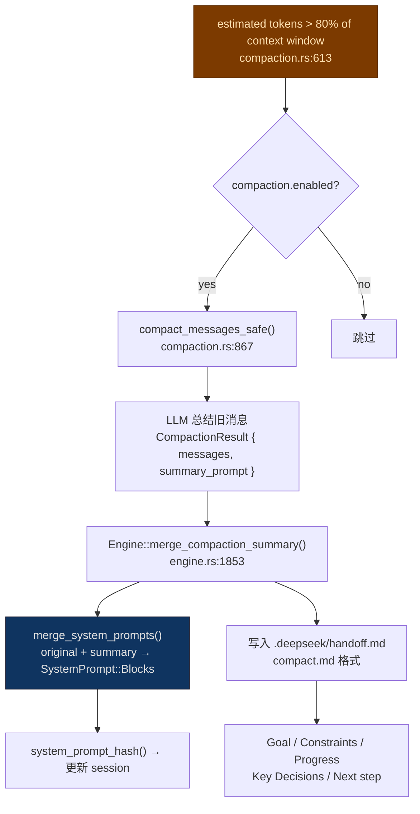
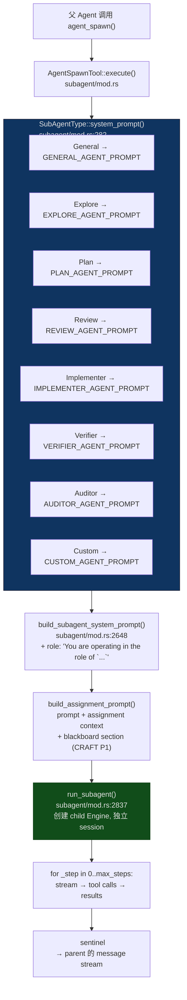
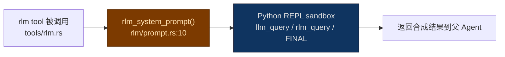
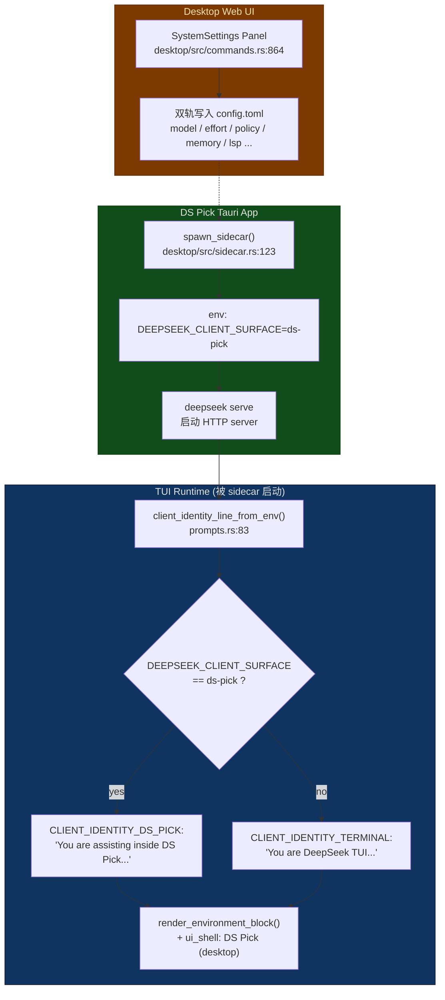

# Prompt System Architecture

本文档用 Mermaid 图描述 DS Pick / DeepSeek TUI 的 prompt 系统完整架构。所有函数名、文件路径、模块名均与源码严格对应。

---

## 1. 系统 Prompt 组装层次

```mermaid
flowchart TD
    subgraph COMPILE["compile-time 嵌入 (include_str!)"]
        direction LR
        F1["prompts/base.md<br/>核心契约 · 工具规则"]
        F2["prompts/personalities/calm.md<br/>voice overlay"]
        F3["prompts/modes/agent.md<br/>mode delta"]
        F4["prompts/approvals/suggest.md<br/>approval policy"]
        F5["prompts/compact.md<br/>handoff template"]
        F6["prompts/modes/plan.md"]
        F7["prompts/modes/yolo.md"]
        F8["prompts/approvals/auto.md"]
        F9["prompts/approvals/never.md"]
    end

    subgraph ASSEMBLY["prompts.rs"]
        direction TB
        A0["compose_base_prompt_layer()<br/>client_identity_line + base.md"]
        A1["compose_prompt_with_approval()<br/>base + personality + mode + approval"]
        A2["compose_mode_prompt_with_approval()<br/>Calm personality wrapper"]
    end

    subgraph RUNTIME["运行时 IO 层"]
        direction TB
        B1["load_project_context_with_parents()<br/>AGENTS.md → .claude/... → CLAUDE.md"]
        B2["render_environment_block()<br/>lang / ui_shell / platform / shell / pwd"]
        B3["merge_instruction_paths_with_pick_rules()<br/>.deepseek/pick-rules.md + config.toml"]
        B4["render_instructions_block()<br/>&lt;instructions&gt; blocks"]
        B5["compose_block() → memory.rs<br/>&lt;user_memory&gt; block"]
        B6["render_available_skills_context_for_workspace()<br/>skills catalog"]
        B7["Context Management<br/>inline const (Agent/YOLO only)"]
        B8["COMPACT_TEMPLATE<br/>compile-time"]
        B9["load_handoff_block()<br/>.deepseek/handoff.md"]
    end

    ENTRY["system_prompt_for_mode_with_context_skills_session_and_approval()<br/>prompts.rs:445"]
    FINAL["SystemPrompt::Text(full_prompt)"]

    F1 --> A0
    A0 --> A1
    F2 --> A1
    F3 --> A1
    F6 --> A1
    F7 --> A1
    F4 --> A1
    F8 --> A1
    F9 --> A1
    A1 --> A2

    A2 --> ENTRY
    B1 --> ENTRY
    B2 --> ENTRY
    B3 --> B4
    B4 --> ENTRY
    B5 --> ENTRY
    B6 --> ENTRY
    B7 --> ENTRY
    B8 --> ENTRY
    B9 --> ENTRY

    ENTRY --> FINAL

    style COMPILE fill:#1a1a2e,stroke:#16213e,color:#e0e0e0
    style ASSEMBLY fill:#0f3460,stroke:#1a1a2e,color:#e0e0e0
    style RUNTIME fill:#114d1a,stroke:#0a3a10,color:#e0e0e0
    style FINAL fill:#7c3a00,stroke:#5c2a00,color:#ffe0b0
```



## 2. KV Cache 分层 (静态 → 易变)

```
┌── compile-time constants ──────────────────────────────────────┐  ← cache hit
│  client_identity  →  base.md  →  personality  →  mode  →  approval  │
├── workspace-static ────────────────────────────────────────────┤  ← cache hit
│  project_context  →  environment  →  instructions  →  memory   │
│  →  session_goal  →  skills  →  context_mgmt  →  compact_tmpl │
├── VOLATILE BOUNDARY ───────────────────────────────────────────┤  ← cache BUST
│  handoff_block  (.deepseek/handoff.md — rewritten on /compact) │
│  working_set    (injected into user message, NOT system prompt)│
└────────────────────────────────────────────────────────────────┘
```

---

## 3. 运行时整体流向

```mermaid
flowchart TD
    subgraph INIT["启动"]
        E1["Engine::new()<br/>engine.rs:402"]
        E2["refresh_system_prompt(mode)<br/>engine.rs:1827"]
        E3["merge_system_prompts()<br/>compaction.rs:1413"]
        E4["system_prompt_hash()<br/>hash 去重检测"]
    end

    subgraph TURN["Turn Loop (turn_loop.rs)"]
        T0["每轮开始"]
        T1["refresh_system_prompt(mode)<br/>turn_loop.rs:78"]
        T2{"compaction.enabled<br/>&& should_compact()?"}
        T3["compact_messages_safe()<br/>点击压缩旧消息"]
        T4["merge_compaction_summary()<br/>summary 合并入 system prompt"]
        T5["messages_with_turn_metadata()<br/>turn_loop.rs:1819"]
        T6["<turn_meta> 注入最新 user msg<br/>working set + today date"]
        T7["MessageRequest 组装<br/>model + messages + system + tools"]
        T8["build_chat_messages_for_request()<br/>client/chat.rs:403"]
        T9["build_chat_messages_with_reasoning()<br/>system → role: system JSON"]
        T10["POST /v1/chat/completions<br/>DeepSeek API"]
        T11["parse SSE stream → ContentBlock"]
        T12["下一轮"]
    end

    E1 --> E2
    E2 --> E3
    E3 --> E4

    T0 --> T1
    T1 --> T2
    T2 -->|yes| T3
    T3 --> T4
    T2 -->|no| T5
    T4 --> T5
    T5 --> T6
    T6 --> T7
    T7 --> T8
    T8 --> T9
    T9 --> T10
    T10 --> T11
    T11 --> T12
    T12 --> T0

    style INIT fill:#0f3460,stroke:#1a1a2e,color:#e0e0e0
    style TURN fill:#114d1a,stroke:#0a3a10,color:#e0e0e0
```



---

## 4. Compaction 详细流程



---

## 5. Sub-Agent Prompt 系统



### Sub-Agent 类型与工具权限

| Agent Type | 系统 Prompt 常量 | 权限 |
|------------|------------------|------|
| **General** | `GENERAL_AGENT_PROMPT` | 全工具 (继承父级) |
| **Explore** | `EXPLORE_AGENT_PROMPT` | read-only: read_file, grep_files, list_dir, file_search |
| **Plan** | `PLAN_AGENT_PROMPT` | 分析工具: read_file, grep_files, file_search |
| **Review** | `REVIEW_AGENT_PROMPT` | 代码审查: read + analysis |
| **Implementer** | `IMPLEMENTER_AGENT_PROMPT` | 写代码: write_file, edit_file, apply_patch, + CRAFT git stash |
| **Verifier** | `VERIFIER_AGENT_PROMPT` | 运行测试: exec_shell, task_gate_run |
| **Auditor** | `AUDITOR_AGENT_PROMPT` | 机械事实核查: read_file, grep_files only |
| **Custom** | `CUSTOM_AGENT_PROMPT` | spawn 时指定 |

---

## 6. RLM (Recursive Language Model) 独立路径



> RLM 使用**完全独立**的 prompt，不继承父级 system prompt。模型只能通过 `llm_query` / `rlm_query` / `FINAL` 与 REPL 交互。

---

## 7. DS Pick (Desktop) 身份切换



---

## 8. 核心文件与职责

```mermaid
flowchart LR
    subgraph PROMPT["prompt 组装"]
        P1["prompts.rs<br/>主入口 · 分层 compose"]
        P2["prompts/base.md<br/>核心系统 prompt"]
        P3["prompts/personalities/<br/>calm / playful"]
        P4["prompts/modes/<br/>agent / plan / yolo"]
        P5["prompts/approvals/<br/>auto / suggest / never"]
        P6["prompts/compact.md<br/>handoff 模板"]
    end

    subgraph CTX["上下文注入"]
        C1["project_context.rs<br/>AGENTS.md 加载"]
        C2["memory.rs<br/>user_memory block"]
        C3["skills/mod.rs<br/>skills catalogue"]
    end

    subgraph ENGINE["Engine"]
        E1["engine.rs<br/>refresh / merge / hash"]
        E2["turn_loop.rs<br/>turn_meta 注入 · API 请求"]
        E3["compaction.rs<br/>compact / merge / should"]
    end

    subgraph API["API 序列化"]
        A1["client/chat.rs<br/>build_chat_messages → JSON"]
        A2["models.rs<br/>SystemPrompt / Message / ContentBlock"]
    end

    subgraph CHILD["子 Agent"]
        C4["subagent/mod.rs<br/>8 种 agent type prompts"]
        C5["rlm/prompt.rs<br/>RLM 独立 prompt"]
    end

    subgraph DESK["Desktop"]
        D1["desktop/src/sidecar.rs<br/>DEEPSEEK_CLIENT_SURFACE"]
        D2["desktop/src/commands.rs<br/>SystemSettings 双轨"]
    end

    PROMPT --> CTX
    CTX --> ENGINE
    ENGINE --> API
    ENGINE --> CHILD
    DESK -.->|env| PROMPT

    style PROMPT fill:#0f3460,stroke:#1a1a2e,color:#e0e0e0
    style CTX fill:#114d1a,stroke:#0a3a10,color:#e0e0e0
    style ENGINE fill:#7c3a00,stroke:#5c2a00,color:#ffe0b0
    style API fill:#0f3460,stroke:#1a1a2e,color:#e0e0e0
    style CHILD fill:#114d1a,stroke:#0a3a10,color:#e0e0e0
    style DESK fill:#7c3a00,stroke:#5c2a00,color:#ffe0b0
```



---

## 9. 关键设计决策

1. **KV Cache 优化** — 系统 prompt 按"compile-time → workspace-static → session-volatile"分层排列，最大化 DeepSeek prefix cache 命中率
2. **Working Set 外置** — 工作集摘要注入 user message (`<turn_meta>`) 而非 system prompt，避免 per-turn 写入破坏 prefix cache
3. **Hash 去重** — `system_prompt_hash()` 避免相同 prompt 重复设置（减少不必要的 `SessionUpdated` 事件）
4. **Compile-time 嵌入** — base / personality / mode / approval / compact 在编译时 `include_str!`，启动零 IO
5. **配置驱动的分层注入** — Project context、instructions、user memory、skills 各自独立模块，通过 `PromptSessionContext` 传入
6. **Client identity env-driven** — `DEEPSEEK_CLIENT_SURFACE` 控制 TUI vs DS Pick 身份切换，无需重新编译
7. **Sub-agent 独立 session** — 子 agent 获得全新 Engine session，带独立 system prompt 和工具集，通过 `<deepseek:subagent.done>` sentinel 报告结果
8. **RLM 完全独立** — RLM 有自己的 prompt (REPL 模式)，不使用父级 system prompt
