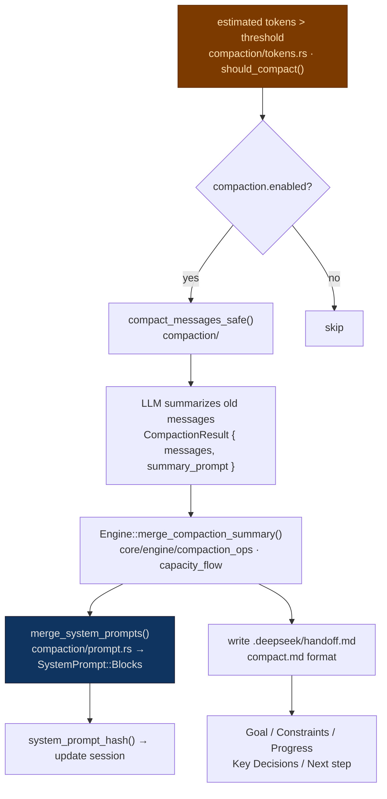
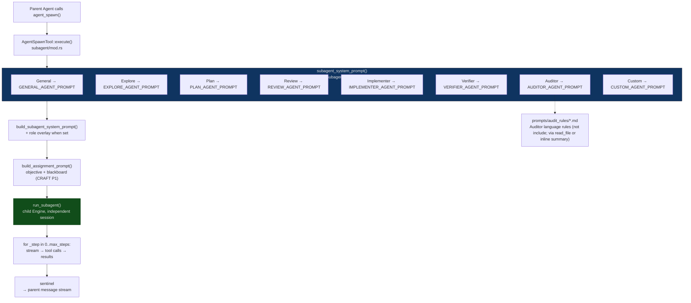
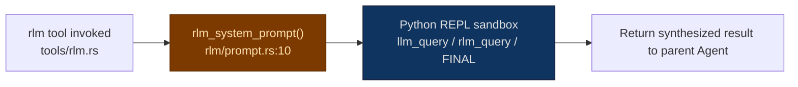
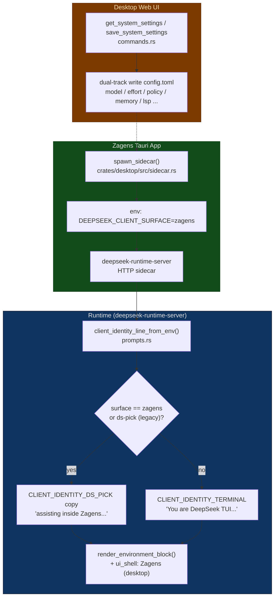

# Prompt System Architecture

This document describes the complete prompt system architecture for **Zagens desktop** (via sidecar-launched `deepseek-runtime-server`) using Mermaid diagrams. Function and module names match source code; **line numbers are approximate anchors** — use symbol search for authoritative locations.

**Source root (after D6 Phase B):** `crates/runtime-server/src/` — main entry `prompts.rs`, layered Markdown in `prompts/`, sub-agents in `tools/subagent/mod.rs`. Historical path `crates/tui/src/prompts/` has been removed.

**Last aligned:** 2026-05-26 (`DEEPSEEK_CLIENT_SURFACE=zagens` + legacy `ds-pick`).

---

## 1. System Prompt Assembly Layers

```mermaid
flowchart TD
    subgraph COMPILE["compile-time embed (include_str!)"]
        direction LR
        F0a["prompts/base.md · base-office.md<br/>Code / Office core contract"]
        F0b["prompts/tasks/code.md · office.md<br/>task overlay"]
        F2["prompts/personalities/calm.md<br/>voice overlay"]
        F3["prompts/modes/agent.md<br/>mode delta"]
        F4["prompts/approvals/suggest.md<br/>approval policy"]
        F5["prompts/compact.md<br/>handoff template"]
        F6["prompts/modes/plan.md"]
        F7["prompts/modes/yolo.md"]
        F8["prompts/approvals/auto.md"]
        F9["prompts/approvals/never.md"]
    end

    subgraph ASSEMBLY["prompts.rs"]
        direction TB
        A0["compose_base_prompt_layer_for_task()<br/>client_identity + base.md | base-office.md"]
        A1["compose_prompt_with_approval()<br/>base + personality + mode + task + approval"]
        A2["compose_mode_prompt_with_approval()<br/>Calm personality wrapper"]
    end

    subgraph RUNTIME["runtime IO layer"]
        direction TB
        B1["load_project_context_with_parents()<br/>AGENTS.md → .claude/... → CLAUDE.md"]
        B2["render_environment_block()<br/>lang / ui_shell / platform / shell / pwd"]
        B3["merge_instruction_paths_with_pick_rules()<br/>.deepseek/pick-rules.md + config.toml"]
        B4["render_instructions_block()<br/>&lt;instructions&gt; blocks"]
        B5["memory::compose_block()<br/>&lt;user_memory&gt; block"]
        B5b["topic_memory::compose_block()<br/>B2 topic graph (cadence)"]
        B6["render_available_skills_context_for_workspace()<br/>skills catalog"]
        B7["Context Management<br/>inline const (Agent/YOLO only)"]
        B8["COMPACT_TEMPLATE<br/>compile-time"]
        B9["load_handoff_block()<br/>.deepseek/handoff.md"]
    end

    ENTRY["system_prompt_for_mode_with_context_skills_session_and_approval()<br/>prompts.rs"]
    FINAL["SystemPrompt::Text(full_prompt)"]

    F0a --> A0
    F0b --> A1
    A0 --> A1
    F2 --> A1
    F3 --> A1
    F6 --> A1
    F7 --> A1
    F4 --> A1
    F8 --> A1
    F9 --> A1
    A1 --> A2

    A2 --> ENTRY
    B1 --> ENTRY
    B2 --> ENTRY
    B3 --> B4
    B4 --> ENTRY
    B5 --> ENTRY
    B5b --> ENTRY
    B6 --> ENTRY
    B7 --> ENTRY
    B8 --> ENTRY
    B9 --> ENTRY

    ENTRY --> FINAL

    style COMPILE fill:#1a1a2e,stroke:#16213e,color:#e0e0e0
    style ASSEMBLY fill:#0f3460,stroke:#1a1a2e,color:#e0e0e0
    style RUNTIME fill:#114d1a,stroke:#0a3a10,color:#e0e0e0
    style FINAL fill:#7c3a00,stroke:#5c2a00,color:#ffe0b0
```



## 2. KV Cache Layering (static → volatile)

```
┌── compile-time constants ──────────────────────────────────────┐  ← cache hit
│  client_identity  →  base.md  →  personality  →  mode  →  task  →  approval  │
├── workspace-static ────────────────────────────────────────────┤  ← cache hit
│  project_context  →  environment  →  instructions  →  memory   │
│  →  session_goal  →  skills  →  context_mgmt  →  compact_tmpl │
├── VOLATILE BOUNDARY ───────────────────────────────────────────┤  ← cache BUST
│  handoff_block  (.deepseek/handoff.md — rewritten on /compact) │
│  working_set    (injected into user message, NOT system prompt)│
└────────────────────────────────────────────────────────────────┘
```

---

## 3. Runtime End-to-End Flow

```mermaid
flowchart TD
    subgraph INIT["startup"]
        E1["Engine::new()<br/>core/engine/build.rs"]
        E2["refresh_system_prompt()<br/>core/engine/cycle_hooks.rs"]
        E3["merge_system_prompts()<br/>compaction/prompt.rs"]
        E4["system_prompt_hash()<br/>cycle_hooks · hash dedup"]
    end

    subgraph TURN["Turn Loop"]
        T0["start of each turn"]
        T1["refresh_system_prompt()<br/>turn_loop/host_impl · capacity_flow"]
        T2{"compaction.enabled<br/>&& should_compact()?"}
        T3["compact_messages_safe()<br/>compaction/ · compress old messages"]
        T4["merge_compaction_summary()<br/>summary merged into system prompt"]
        T5["messages_with_turn_metadata()<br/>core/engine/turn_loop/mod.rs"]
        T6["<turn_meta> injected into latest user msg<br/>working set + today date"]
        T7["MessageRequest assembly<br/>model + messages + system + tools"]
        T8["build_chat_messages_for_request()<br/>client/chat.rs"]
        T9["build_chat_messages_with_reasoning()<br/>system → role: system JSON"]
        T10["POST /v1/chat/completions<br/>DeepSeek API"]
        T11["parse SSE stream → ContentBlock"]
        T12["next turn"]
    end

    E1 --> E2
    E2 --> E3
    E3 --> E4

    T0 --> T1
    T1 --> T2
    T2 -->|yes| T3
    T3 --> T4
    T2 -->|no| T5
    T4 --> T5
    T5 --> T6
    T6 --> T7
    T7 --> T8
    T8 --> T9
    T9 --> T10
    T10 --> T11
    T11 --> T12
    T12 --> T0

    style INIT fill:#0f3460,stroke:#1a1a2e,color:#e0e0e0
    style TURN fill:#114d1a,stroke:#0a3a10,color:#e0e0e0
```



---

## 4. Compaction Detailed Flow



---

## 5. Sub-Agent Prompt System



### Sub-Agent Types and Tool Permissions

| Agent Type | System Prompt Constant | Permissions |
|------------|------------------------|-------------|
| **General** | `GENERAL_AGENT_PROMPT` | Full tools (inherits parent) |
| **Explore** | `EXPLORE_AGENT_PROMPT` | read-only: read_file, grep_files, list_dir, file_search |
| **Plan** | `PLAN_AGENT_PROMPT` | Analysis tools: read_file, grep_files, file_search |
| **Review** | `REVIEW_AGENT_PROMPT` | Code review: read + analysis |
| **Implementer** | `IMPLEMENTER_AGENT_PROMPT` | Write code: write_file, edit_file, apply_patch, + CRAFT git stash |
| **Verifier** | `VERIFIER_AGENT_PROMPT` | Run tests: exec_shell, task_gate_run |
| **Auditor** | `AUDITOR_AGENT_PROMPT` | Mechanical fact checking (default inherits full tool surface; rules in `prompts/audit_rules/`) |
| **Custom** | `CUSTOM_AGENT_PROMPT` | Specified at spawn |

---

## 6. RLM (Recursive Language Model) Independent Path



> RLM uses a **fully independent** prompt and does not inherit the parent system prompt. The model interacts with the REPL only via `llm_query` / `rlm_query` / `FINAL`.

---

## 7. Zagens (Desktop) Identity Switch



---

## 8. Core Files and Responsibilities

```mermaid
flowchart LR
    subgraph PROMPT["crates/runtime-server · prompt assembly"]
        P1["src/prompts.rs<br/>main entry · layered compose"]
        P2["src/prompts/base.md · base-office.md"]
        P2b["src/prompts/tasks/<br/>code · office overlay"]
        P3["src/prompts/personalities/<br/>calm / playful"]
        P4["src/prompts/modes/<br/>agent / plan / yolo"]
        P5["src/prompts/approvals/<br/>auto / suggest / never"]
        P6["src/prompts/compact.md<br/>handoff template"]
        P7["src/prompts/audit_rules/<br/>Auditor language rules (source files)"]
    end

    subgraph CTX["context injection"]
        C1["project_context.rs<br/>AGENTS.md loading"]
        C2["memory.rs<br/>user_memory block"]
        C3["skills/mod.rs<br/>skills catalogue"]
        C4b["topic_memory.rs<br/>topic graph block"]
    end

    subgraph ENGINE["core/engine/"]
        E1["build.rs · cycle_hooks.rs<br/>refresh / merge / hash"]
        E2["turn_loop/<br/>turn_meta · API request"]
        E3["compaction/ + compaction_ops<br/>compact / merge / should"]
    end

    subgraph API["API serialization"]
        A1["client/chat.rs<br/>build_chat_messages → JSON"]
        A2["models.rs<br/>SystemPrompt / Message / ContentBlock"]
    end

    subgraph CHILD["sub-agents"]
        C4["tools/subagent/mod.rs<br/>8 types + subagent_output_format.md"]
        C5["rlm/prompt.rs<br/>RLM independent prompt"]
    end

    subgraph DESK["crates/desktop"]
        D1["src/sidecar.rs<br/>DEEPSEEK_CLIENT_SURFACE=zagens"]
        D2["src/commands.rs<br/>SystemSettings dual-track"]
    end

    PROMPT --> CTX
    CTX --> ENGINE
    ENGINE --> API
    ENGINE --> CHILD
    DESK -.->|env| PROMPT

    style PROMPT fill:#0f3460,stroke:#1a1a2e,color:#e0e0e0
    style CTX fill:#114d1a,stroke:#0a3a10,color:#e0e0e0
    style ENGINE fill:#7c3a00,stroke:#5c2a00,color:#ffe0b0
    style API fill:#0f3460,stroke:#1a1a2e,color:#e0e0e0
    style CHILD fill:#114d1a,stroke:#0a3a10,color:#e0e0e0
    style DESK fill:#7c3a00,stroke:#5c2a00,color:#ffe0b0
```



---

## 9. Key Design Decisions

1. **KV cache optimization** — System prompt ordered "compile-time → workspace-static → session-volatile" to maximize DeepSeek prefix cache hit rate
2. **Working set externalized** — Working set summary injected into user message (`<turn_meta>`) not system prompt, avoiding per-turn writes that bust prefix cache
3. **Hash dedup** — `system_prompt_hash()` avoids resetting identical prompts (reduces unnecessary `SessionUpdated` events)
4. **Compile-time embed** — base / personality / mode / approval / compact embedded at compile time via `include_str!`, zero IO at startup
5. **Config-driven layered injection** — Project context, instructions, user memory, skills each in independent modules, passed via `PromptSessionContext`
6. **Client identity env-driven** — `DEEPSEEK_CLIENT_SURFACE` (Zagens: `zagens`; legacy alias `ds-pick`) controls terminal vs desktop identity and `ui_shell` without recompile
7. **Sub-agent independent session** — Sub-agents get fresh Engine sessions with independent system prompts and tool sets; report via `<deepseek:subagent.done>` sentinel
8. **RLM fully independent** — RLM has its own prompt (REPL mode), does not use parent system prompt
