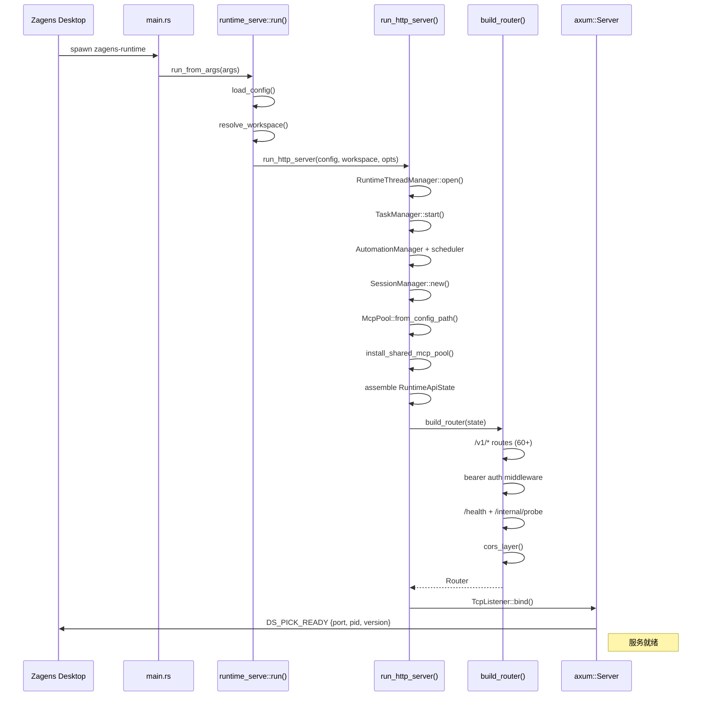

# runtime-server 启动时序架构

> Zagens headless HTTP sidecar — 替代 `deepseek-tui serve --http`。
> 基于 `crates/runtime-server` (binary: `zagens-runtime`)，源码覆盖 main → axum router → tool/MCP 注册。

---

## 启动链路总览

```
main()
  └─ run_from_args(args)
      └─ run_or_exit(cli)
          └─ run(cli)
              ├─ 配置加载
              ├─ workspace 解析
              ├─ 基础设施初始化
              ├─ RuntimeApiState 装配
              ├─ build_router(state) → axum::Router
              ├─ TcpListener::bind
              └─ 输出 DS_PICK_READY
```

---

## 阶段 1 — 入口与 CLI 解析

**文件:** `runtime-server/src/main.rs` (第 10–14 行)

```rust
#[tokio::main]
async fn main() {
    dotenvy::dotenv().ok();
    let args = std::env::args();
    zagens_runtime::runtime_serve::run_from_args(args).await;
}
```

- 单行入口，直接委托给 `run_from_args`。
- `RuntimeServeCli` 使用 clap 解析 (`runtime_serve/mod.rs:18-57`)：
  - `--config` / `--profile` / `--workspace`
  - `--host` (默认 127.0.0.1) / `--port` (默认 7878, 0=ephemeral)
  - `--workers` (1-16) / `--cors-origin` (重复) / `--auth-token`

**出口:** `run_or_exit` (`mod.rs:177-186`) — `run()` 成功 → exit(0)，失败 → exit(1)。

---

## 阶段 2 — 配置加载与基础设施

**函数:** `run(cli)` (`mod.rs:95-170`)

```
run(cli)
  ├─ configure_windows_console_utf8()
  ├─ logging::set_verbose(...)
  ├─ config::ensure_config_file_exists()
  ├─ load_config(&cli)                  ← Config::load()
  ├─ resolve_workspace(&cli)           ← $DOCUMENTS/Zagens / cwd
  ├─ symbol_index::warmup_if_needed()
  ├─ skills::install_system_skills()   ← tokio::spawn (后台)
  └─ run_http_server(config, workspace, RuntimeApiOptions{...})
```

---

## 阶段 3 — 依赖注入 (DI Assembly)

**文件:** `runtime_serve/http.rs`，`run_http_server()` 函数 (第 60–242 行)

按**创建顺序**的初始化管道：

| # | 组件 | 代码位置 | 说明 |
|---|------|---------|------|
| 1 | `CancellationToken` | `http.rs:59` | 关闭信号 |
| 2 | `RuntimeThreadManager::open()` | `http.rs:68` | 工作线程池 |
| 3 | `TaskManager::start_with_runtime_manager()` | `http.rs:75` | 后台任务调度 |
| 4 | `AutomationManager` | `http.rs:80-88` | 自动化引擎 + scheduler |
| 5 | `SessionManager` | `http.rs:104` | 会话持久化 |
| 6 | `McpPool::from_config_path()` | `http.rs:107` | MCP 服务连接池 |
| 7 | `install_shared_mcp_pool()` | `http.rs:116` | 全局单例注入 |
| 8 | `RuntimeApiState::new(...)` | `http.rs:118-133` | axum 状态 (13 fields) |
| 9 | `build_router(state)` | `http.rs:135` | 路由树构建 |
| 10 | `TcpListener::bind(addr)` | `http.rs:139` | 绑定端口 |
| 11 | `DS_PICK_READY` 信号 | `http.rs:170` | stdout 协议通知 supervisor |

---

## 阶段 4 — 路由注册

### `build_router(state: RuntimeApiState) -> Router`

**文件:** `runtime_api/router.rs` (第 36-176 行)

分为两层：

**第一层: `api_routes` — 所有 `/v1/*` 端点**

~60 条路由，按模块分组：

| 模块 | 端点示例 |
|------|---------|
| **sessions** | `GET /v1/sessions`, `GET/DELETE /v1/sessions/{id}`, `POST /v1/sessions/{id}/resume-thread` |
| **threads** | `GET/POST /v1/threads`, `GET/PATCH /v1/threads/{id}`, `POST /v1/threads/{id}/turns`, `POST /v1/threads/{id}/turns/{turn_id}/steer` |
| **tasks** | `GET/POST /v1/tasks`, `POST /v1/tasks/clear`, `GET /v1/tasks/{id}`, `POST /v1/tasks/{id}/cancel` |
| **MCP** | `GET/POST /v1/apps/mcp/servers`, `PUT/DELETE /v1/apps/mcp/servers/{name}`, `GET /v1/apps/mcp/tools`, `POST /v1/apps/mcp/reload` |
| **automations** | `GET/POST /v1/automations`, `PATCH/DELETE /v1/automations/{id}`, `POST /v1/automations/{id}/run` |
| **skills** | `GET/POST /v1/skills`, `POST /v1/skills/import`, `POST /v1/skills/install` |
| **blackboards** | `GET /v1/blackboards`, `GET /v1/blackboards/{id}` |
| **workspace** | `GET /v1/workspace/status`, `GET /v1/workspace/browse`, `GET /v1/workspace/file` |
| **usage** | `GET /v1/usage` |
| **symbol-index** | `POST /v1/symbol-index/rebuild` |
| **streaming** | `POST /v1/stream`, `GET /v1/threads/{id}/events` |

```rust
api_routes.route_layer(middleware::from_fn_with_state(
    state.clone(),
    require_runtime_token::<RuntimeApiState>,
));
```

**第二层: `compose_router` — 外层包装**

**文件:** `crates/runtime-api/src/router.rs` (第 17–31 行)

```rust
pub fn compose_router<S>(state: S, cors_origins: &[String], api_routes: Router<S>) -> Router
{
    Router::new()
        .route("/health", get(health))
        .route("/internal/probe", get(internal_probe::<S>))
        .merge(api_routes)
        .layer(cors_layer(cors_origins))
        .with_state(state)
}
```

- `/health` / `/internal/probe` — 健康检查（无认证）
- `/v1/*` 已带 bearer auth middleware
- CORS 层：默认 `localhost:{3000,1420}` + `tauri://localhost` + 自定义源

---

## 阶段 5 — Tool / MCP 注册

Tool 注册**不直接挂在 axum router 上**，而是在 DI 阶段完成：

### MCP 服务注册

```rust
// http.rs:107-115
let mut shared_mcp_pool = McpPool::from_config_path(&config.mcp_config_path())?;
// 可选网络策略
shared_mcp_pool = shared_mcp_pool.with_network_policy(decider);
let shared_mcp_pool = Arc::new(tokio::sync::Mutex::new(shared_mcp_pool));
crate::mcp_shared::install_shared_mcp_pool(Arc::clone(&shared_mcp_pool));
```

- 从 `mcp_config_path` 解析 JSON/YAML MCP server 定义
- 注入全局 `mcp_shared::POOL`
- 运行时通过 `POST /v1/apps/mcp/reload` 触发热重载
- Tool 调用路径：`POST /v1/stream` + `POST /v1/threads/{id}/turns` → agent dispatch → McpPool::call_tool

### Thread 内工具调度

- `start_thread_turn` → agent 内部解析 tool_calls → 通过 `shared_mcp_pool` 转发
- 非 MCP 工具（shell、filesystem）由 `RuntimeThreadManager` 内嵌的 agent sandbox 管理

---

## 启动时序图 (Mermaid)



---

## 关键文件索引

| 路径 | 职责 |
|------|------|
| `runtime-server/src/main.rs` | 二进制入口 |
| `runtime-server/src/runtime_serve/mod.rs` | CLI 定义 + `run()` 编排 |
| `runtime-server/src/runtime_serve/http.rs` | DI 装配 + axum serve 循环 |
| `runtime-server/src/runtime_api/mod.rs` | `RuntimeApiState` 结构体 + module re-exports |
| `runtime-server/src/runtime_api/router.rs` | `build_router()` — 路由表定义 |
| `runtime-server/src/runtime_api/state.rs` | `RuntimeApiAuthState` + `RuntimeApiProbeState` impl |
| `runtime-server/src/runtime_api/stream.rs` | SSE `POST /v1/stream` 端点 |
| `runtime-server/src/runtime_api/threads.rs` | thread CRUD + turn dispatch |
| `runtime-server/src/runtime_api/mcp.rs` | MCP server CRUD + tool listing |
| `runtime-server/src/mcp.rs` | `McpPool` 连接池实现 |
| `runtime-api/src/router.rs` | `compose_router()` — 公共路由 + CORS |
| `runtime-api/src/health.rs` | `/health` `/internal/probe` handler |
| `runtime-api/src/cors.rs` | CORS 默认层 |
