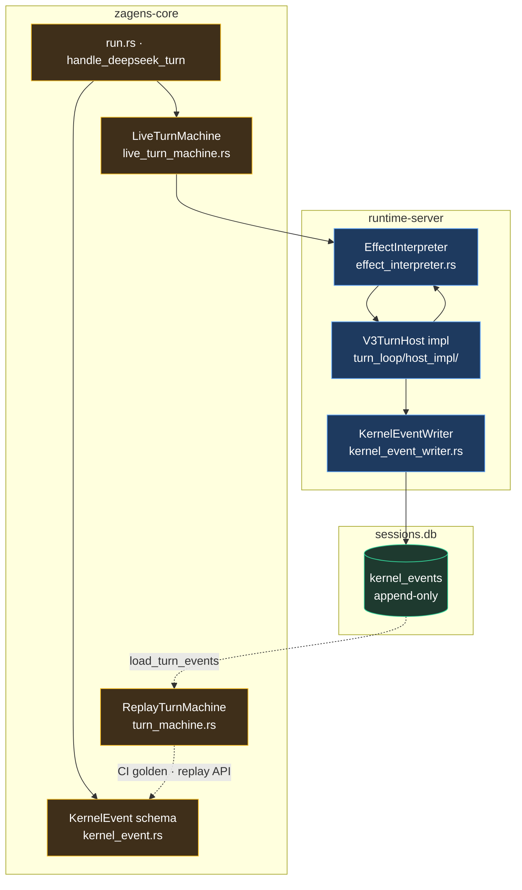

# Agent Kernel V3 (event-sourced turn engine)

> **Status:** **Landed** (2026-06-16) — sole production turn path  
> **Runtime SSOT:** [RUNTIME_ARCHITECTURE.md](./RUNTIME_ARCHITECTURE.md) §2.1  
> **Persistence:** [PERSISTENCE.md](./PERSISTENCE.md) (`kernel_events` in `sessions.db`)  
> **Golden fixtures:** [`fixtures/harness/kernel-v3-replay/`](../../fixtures/harness/kernel-v3-replay/)  
> **Maintainer design (full schema / batch history):** `doc_Private/docs/tech/AGENT_KERNEL_V3_PHASE3_DESIGN.md`

---

## 0. TL;DR

Kernel V3 replaces the legacy imperative turn loop with an **event-sourced** engine:

| Layer | Role |
|-------|------|
| **`KernelEvent` log** | Append-only audit of everything that happened in a turn (model, tools, guards, memory injections) |
| **`LiveTurnMachine`** | Production planner — outer step-frame / pre-inner / inner / post-inner / boundary grants |
| **`EffectInterpreter`** | Executes planned `Effect`s (CallModel, ExecuteBatch, InjectSteer, QueryMemory, …) via runtime IO |
| **`V3TurnHost`** | Host trait bound for turn-loop IO (streaming, tools, LHT hooks, kernel event sink) |
| **`ReplayTurnMachine`** | CI / diagnostics — rebuilds state from the log and verifies coherence |

**Removed in the final switch:** legacy inner step, `TurnLoopHost` alias, `KernelMachineMode::Shadow`, runtime shadow bake modules, and `GET /v1/runtime/kernel-shadow`. Verification now uses **golden replay fixtures** + lightweight turn-end replay checks.

---

## 1. Production turn path

```text
handle_deepseek_turn (crates/core/src/engine/turn_loop/run.rs)
  └─ LiveTurnMachine
       ├─ outer: step-frame → pre-inner → inner → post-inner → boundary grants
       └─ inner: inner_step_live_plan → EffectInterpreter
            └─ InnerStepHost IO (streaming · tool execution · LSP notify)

Turn end (runtime-server host_impl):
  finish_kernel_turn → kernel_turn_replay_verify + projection compare (no shadow bake)

Resume:
  log-first transcript repair (default on) · optional session JSON byte-parity gates
```



**Key source files:**

| Area | Path |
|------|------|
| Turn entry | [`crates/core/src/engine/turn_loop/run.rs`](../../crates/core/src/engine/turn_loop/run.rs) |
| Live state machine | [`crates/core/src/engine/turn_loop/live_turn_machine.rs`](../../crates/core/src/engine/turn_loop/live_turn_machine.rs) |
| Outer / inner drivers | [`live_turn_outer_driver.rs`](../../crates/core/src/engine/turn_loop/live_turn_outer_driver.rs) · [`live_turn_inner_driver.rs`](../../crates/core/src/engine/turn_loop/live_turn_inner_driver.rs) |
| Event schema + projection | [`kernel_event.rs`](../../crates/core/src/engine/kernel_event.rs) · [`turn_machine.rs`](../../crates/core/src/engine/turn_machine.rs) |
| Effect planning + replay | [`turn_machine.rs`](../../crates/core/src/engine/turn_machine.rs) (`ReplayTurnMachine`, `Effect` enum) |
| Host trait | [`crates/core/src/engine/turn_loop/host.rs`](../../crates/core/src/engine/turn_loop/host.rs) (`V3TurnHost`) |
| Effect IO | [`crates/runtime-server/src/core/engine/effect_interpreter.rs`](../../crates/runtime-server/src/core/engine/effect_interpreter.rs) |
| Turn-end hooks | [`crates/runtime-server/src/core/engine/turn_loop/host_impl/mod.rs`](../../crates/runtime-server/src/core/engine/turn_loop/host_impl/mod.rs) |
| Kernel mode config | [`crates/core/src/engine/kernel_mode.rs`](../../crates/core/src/engine/kernel_mode.rs) |
| Event log (SQLite) | [`crates/runtime-adapters/src/persist/kernel_event_log.rs`](../../crates/runtime-adapters/src/persist/kernel_event_log.rs) |
| Async writer | [`crates/runtime-adapters/src/persist/kernel_event_writer.rs`](../../crates/runtime-adapters/src/persist/kernel_event_writer.rs) |
| Session resume repair | [`crates/runtime-server/src/core/engine/kernel_log_session_repair.rs`](../../crates/runtime-server/src/core/engine/kernel_log_session_repair.rs) |
| Core-only test fallback | [`crates/core/src/engine/turn_loop/v3_step.rs`](../../crates/core/src/engine/turn_loop/v3_step.rs) |

---

## 2. KernelEvent log

Every production turn **double-writes** structured events to `sessions.db`:

```sql
CREATE TABLE kernel_events (
    id      INTEGER PRIMARY KEY AUTOINCREMENT,
    seq     INTEGER NOT NULL,
    ts_ms   INTEGER NOT NULL,
    kind    TEXT    NOT NULL,
    turn_id TEXT,
    payload TEXT    NOT NULL  -- JSON KernelEvent (tag = "event_type")
);
```

**Rules:**

- **Additive-only** schema — new event variants use `#[non_exhaustive]`; old readers ignore unknown kinds.
- **Monotonic `seq`** — restart-safe via `KernelEventWriter` peek/next-seq.
- **Projection** — `TurnKernelProjection` rebuilds host-visible state (scratchpad counters, active tools, LHT continuation counts, steer injections, capacity checkpoints) from the log alone.
- **Resume** — with `[kernel] log_transcript_repair = true` (default), thread resume prefers log-driven transcript repair; session JSON is a projection/export format, not the SSOT for turn semantics.

Event families (22 variants in v1 schema): turn lifecycle · model request/delta/message · tool planned/started/finished · approvals · context overflow/compaction · memory plane (steer, scratchpad, cycle briefing, queries) · guard decisions (loop-guard, capacity, step-limit/LHT continuation).

---

## 3. Effect interpreter

The live path plans **effects** instead of calling streaming/tool phases inline:

| Effect | Purpose |
|--------|---------|
| `CallModel` | Streaming LLM step |
| `ExecuteBatch` | Tool wave execution (DAG scheduler when enabled) |
| `InjectSteer` | Steer / LHT nudge injection |
| `RunCompaction` | Auto or manual compaction artifact |
| `RunLayeredContextCheckpoint` | Flash L2 seam checkpoint |
| `QueryMemory` | WorkingSet / TopicMemory reads (`MemoryPlaneQueried` event) |
| `RefreshSystemPrompt` | System prompt refresh chain |
| `EmitArtifact` | Scratchpad snapshot/reminder artifacts |
| `NotifyLsp` | Post-mutating-tool LSP refresh |
| `RequestApproval` | Policy-gated approval flow |
| `Sleep` | Bounded delay (replay anchor) |

`ReplayTurnMachine` interprets the same effect enum from recorded events — used by `verify_turn_replay_coherence` and CI golden tests.

---

## 4. Host layering (`V3TurnHost`)

Production IO is split into composable host seams (≈60 methods, baseline-tested):

| Seam | Responsibility |
|------|----------------|
| `InnerStepHost` | Streaming phase, tool phase, deferred tools |
| `TurnLoopOuterHost` | Outer-loop grants, capacity holds, pre-inner baseline, `end_turn` |
| `KernelTurnHost` | Kernel event sink, turn frame sync, replay verify hooks |

`V3TurnHost` combines these for `handle_deepseek_turn` and `EffectInterpreter` bounds. The deprecated monolithic `TurnLoopHost` alias was **removed** in the final switch.

Long-horizon task hooks (`maybe_continue_at_step_limit`, `maybe_advance_cycle_at_checkpoint`, `maybe_cycle_handoff_on_context_overflow`, etc.) live on this host surface — see [LONG_HORIZON_CODE_TASKS.md](../harness/LONG_HORIZON_CODE_TASKS.md).

---

## 5. Context compiler integration

Phase 2 **ContextCompiler V2** is the sole production path for request assembly. Kernel V3 Phase D aligned compiler inputs with the log:

- `QueryMemory` emits `MemoryPlaneQueried`; force-include / budget overrides derive from **log projection** (`compiler_queried_sources_from_projection`), not a side channel.
- Scratchpad injects route through `Effect::EmitArtifact` + `memory_plane_artifact_ops` (not spurious `SteerInjected`).
- Compaction still uses `RunCompaction` + `CompactionArtifactCreated` (not yet merged into `EmitArtifact`).

Prefix fingerprints (`static_prefix_sha256`, `full_prefix_sha256`) are emitted per model step — see [KV_CACHE_OBSERVABILITY.md](./KV_CACHE_OBSERVABILITY.md).

---

## 6. Configuration

In `~/.deepseek/config.toml` (or Zagens-equivalent):

```toml
[kernel]
# Optional — default is v3; only V3 exists at runtime
# machine = "v3"

# Log-first session resume (default true)
log_transcript_repair = true

# Write repaired transcript back to session JSON (opt-in)
# log_transcript_repair_persist = false
```

**`[kernel] machine` is a no-op** (forward-compat parse only). Any value maps to `v3`;
a non-`v3` value (e.g. historical `"legacy"` / `"shadow"`) logs a single "ignored" startup
warning. The deprecated `legacy` / `shadow` parse branches were removed.

---

## 7. Verification & diagnostics

| Mechanism | Purpose |
|-----------|---------|
| **Golden replay** | 17 fixtures under `fixtures/harness/kernel-v3-replay/` — `cargo test -p zagens-core golden_replay` |
| **Turn-end replay verify** | `kernel_turn_replay_verify` / `kernel_v3_step_verify` on production turns |
| **Session byte parity** | `*.session.json` paired fixtures for log-first resume |
| **Thread replay API** | Resume flow exposes `kernel_replay` anchors in OpenAPI (`ResumeSessionKernelReplay`) |

**Removed:** `GET /v1/runtime/kernel-shadow` and all `kernel_*_shadow.rs` runtime bake modules. Do not rely on shadow diff counters in new tooling.

Suggested CI / local gate:

```bash
cargo test -p zagens-core golden_replay_coherence live_turn_machine kernel_mode v3_turn_host
cargo test -p zagens-runtime-server effect_interpreter replay
cargo check --workspace
```

---

## 8. Relationship to architecture freeze (D17)

[D17](./adr/D17_ARCHITECTURE_FREEZE.md) closed the **HTTP/desktop crate split** refactor mainline (2026-05-27). Kernel V3 is an **in-place evolution** of `zagens-core` turn logic — it does not change L2/L3 boundaries, OpenAPI routes (except removing the diagnostic shadow endpoint), or the sidecar monolith acceptance. Upstream CodeWhale turn-engine merge is **no longer possible** after batch 5 closure — see [NOTICE.md](../../NOTICE.md).

---

## 9. Optional follow-ups (non-blocking)

Documented in maintainer design §6.2:

- Merge compaction into `Effect::EmitArtifact` (touches `manual_compaction` / `scratchpad_compaction` golden fixtures + replay effect counts — needs its own change)
- Sidecar smoke after rebuild (LHT + short turn) — covered by `scripts/lht-harness-smoke.ps1 -Full`

---

*Last updated: 2026-06-16 · aligns with Kernel V3 final switch + Phase D (EmitArtifact, compiler projection)*
