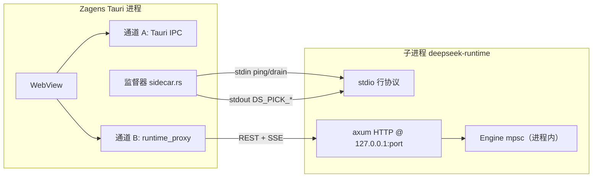

# Zagens 架构边界分析

> **关联文档：**
> [RUNTIME_ARCHITECTURE.md](./RUNTIME_ARCHITECTURE.md)（运行时总览与附图） ·
> [API_DESIGN.md](./API_DESIGN.md)（HTTP / IPC 契约） ·
> [adr/D17_ARCHITECTURE_FREEZE.md](./adr/D17_ARCHITECTURE_FREEZE.md)（架构冻结 v1） ·
> [adr/ARCHITECTURE_ASSESSMENT_2026-05-25.md](./adr/ARCHITECTURE_ASSESSMENT_2026-05-25.md)（定型评估）
>
> **最后更新：** 2026-06-05

本文档回答两个问题：

1. **Zagens 壳与 sidecar（`deepseek-runtime`）之间有几条连接通道？各自承担什么？**
2. **这套架构的硬边界与软边界在哪里？什么场景会先撞墙？**

---

## 1. 概念对齐

| 术语 | 含义 |
|------|------|
| **Zagens 壳** | `crates/desktop` — Tauri 宿主 + WebView，**不**内嵌 Engine |
| **Sidecar** | 子进程 `deepseek-runtime`（`crates/runtime-server` bin），**即** Agent 唯一执行面 |
| **底层** | 在本文中指 sidecar 进程内的 orchestrator / adapters / core 栈，**不是**另一个独立服务 |
| **L2 契约** | `127.0.0.1:{port}` HTTP `/v1/*` + Bearer；桌面经 `runtime_proxy` 转发 |

**硬约束（D17）：** Desktop **不得** path-depend `core` / `runtime-server`；所有 turn 只在 sidecar 内执行。见 [`architecture_boundary.rs`](../../crates/desktop/tests/architecture_boundary.rs)。

---

## 2. 连接通道全景

从 **Tauri 进程 ↔ sidecar 子进程** 视角，存在 **3 条逻辑通道**（非 3 条固定 TCP 长连接）：



### 2.1 通道 A — Tauri IPC

| 属性 | 说明 |
|------|------|
| 机制 | `invoke()` → `#[tauri::command]` |
| 是否直连 sidecar | **否**，仅在 Tauri Rust 进程内 |
| 典型用途 | API Key、设置、符号索引、终端 PTY、文件二进制读取、多窗口、sidecar 重启 |
| 代码 | [`commands.rs`](../../crates/desktop/src/commands.rs)、[`window_registry.rs`](../../crates/desktop/src/window_registry.rs)、[`terminal.rs`](../../crates/desktop/src/terminal.rs) |

### 2.2 通道 B — Runtime HTTP/SSE 代理

| 属性 | 说明 |
|------|------|
| 机制 | WebView `invoke('runtime_http' \| 'runtime_post_stream' \| 'runtime_get_sse')` → Rust 注入 Bearer → `127.0.0.1:{port}` |
| TCP 形态 | **1 个 listener**；REST 多为短连接，SSE 为长连接，复用同一端口 |
| 路径白名单 | 仅 `/health` 与 `/v1/*`（[`validate_runtime_path`](../../crates/desktop/src/runtime_proxy.rs)） |
| Token 安全 | Bearer **不进** WebView storage / DevTools（H06） |
| 代码 | [`runtime_proxy.rs`](../../crates/desktop/src/runtime_proxy.rs)、[`web-ui/src/api/client.ts`](../../crates/desktop/web-ui/src/api/client.ts) |

### 2.3 监督通道 — stdio 行协议

| 属性 | 说明 |
|------|------|
| 方向 | 父进程 stdin → 子进程；子进程 stdout → 父进程 |
| 启动握手 | 子进程输出 `DS_PICK_READY {port, pid, token_fp, version}` |
| 运行期心跳 | 父进程 stdin 写 `{"op":"ping","seq":N}` → 子进程 stdout `DS_PICK_PONG` |
| 优雅退出 | 父进程 stdin 写 `{"op":"drain"}` → 子进程 `DS_PICK_DRAIN` |
| 频率 | 心跳默认 **5s** 一次；与 HTTP 栈**物理独立** |
| 代码 | [`sidecar.rs`](../../crates/desktop/src/sidecar.rs)、[`runtime_serve/http.rs`](../../crates/runtime-server/src/runtime_serve/http.rs) |

### 2.4 Sidecar 进程内（不经 HTTP 的关键路径）

HTTP handler 收到 turn 请求后，向 Engine 发 **`Op::SendMessage`（同进程 mpsc）**，不经第二条 HTTP。事件经 `tokio::sync::broadcast` 同时喂给 SSE handler 与持久化 monitor。详见 [RUNTIME_ARCHITECTURE.md §8](./RUNTIME_ARCHITECTURE.md)。

---

## 3. 硬边界一览

以下为代码中**显式编码**的上限或阈值。

### 3.1 进程与实例

| 边界 | 值 | 说明 |
|------|-----|------|
| Sidecar 实例数 | **1** | 整个桌面应用 spawn 一个 `deepseek-runtime` 子进程 |
| Desktop ↔ runtime 库依赖 | **禁止** | `architecture_boundary` 测试强制壳与 Engine crate 解耦 |

### 3.2 内存中活跃 Engine

| 边界 | 值 | 常量 / 配置 | 行为 |
|------|-----|-------------|------|
| `max_active_threads` | **8** | `MAX_ACTIVE_THREADS_DEFAULT` | LRU 驱逐**空闲** engine；有 `active_turn` 的 thread 受保护 |
| 磁盘 thread 数 | **无硬限** | — | 超出内存上限的 thread 仍在 store，下次 turn 需重新 load engine |

代码：[`runtime-orchestrator/src/runtime_threads/mod.rs`](../../crates/runtime-orchestrator/src/runtime_threads/mod.rs)、[`active.rs` `enforce_lru_capacity`](../../crates/runtime-orchestrator/src/runtime_threads/active.rs)。

### 3.3 Engine 内部 mpsc 队列（背压点）

每个 Engine 在 core 侧创建 **7 组有界 channel**：

| Channel | 容量 | 用途 |
|---------|------|------|
| `tx_op` / `rx_op` | **32** | 主操作（SendMessage、Interrupt 等） |
| `tx_event` / `rx_event` | **256** | Engine → 外部事件 |
| `tx_approval` / `rx_approval` | **64** | 工具审批 |
| `tx_user_input` / `rx_user_input` | **32** | 用户输入 |
| `tx_steer` / `rx_steer` | **64** | Steer 注入 |

队列满时 `send().await` 阻塞，构成进程内背压。代码：[`core/src/engine/runtime_new.rs`](../../crates/core/src/engine/runtime_new.rs)。

### 3.4 运行时事件广播

| 边界 | 值 | 行为 |
|------|-----|------|
| `EVENT_CHANNEL_CAPACITY` | **4096** | `broadcast::channel` 槽位 |
| Lagged 消费 | 有恢复 | SSE 落后时从 store `events_since` catch-up，并合并 delta（B3.3） |

代码：[`runtime-orchestrator/.../manager.rs`](../../crates/runtime-orchestrator/src/runtime_threads/manager.rs)、[`runtime_api/stream.rs`](../../crates/runtime-server/src/runtime_api/stream.rs)。

### 3.5 后台任务与 Sub-agent

| 边界 | 默认值 | 硬顶 | 说明 |
|------|--------|------|------|
| TaskManager workers | **2** | **8**（`MAX_WORKERS`） | CLI `--workers` 可传 1–16，但 TaskManager 实际 clamp 到 8 |
| Sub-agent 并发 | **10** | **20**（`MAX_SUBAGENTS`） | `[subagents].max_concurrent` 或顶层 `max_subagents` |
| Engine `max_steps` | **100** | — | 每 turn 步数上限（spawn 时写入 `EngineConfig`） |

### 3.6 SSE 与取消（桌面 UX）

| 边界 | 值 | 说明 |
|------|-----|------|
| 每 WebView 窗口活跃 SSE | **1** | 新 `runtime_get_sse` 会 cancel 同 `window.label()` 的旧流 |
| 取消两层（D9） | — | 上层 `runtime_cancel_sse` 仅断 WebView↔proxy SSE；下层 `interrupt` API 才真正停 turn |
| SSE 代理超时 | **3600s** | `runtime_get_sse` / `runtime_post_stream` |
| REST 代理超时 | **120s** | `runtime_http` |

### 3.7 Sidecar 监督器重启阈值

| 条件 | 阈值 | 后果 |
|------|------|------|
| 连接拒绝（端口死） | **2** 次 | 重启 sidecar |
| HTTP 繁忙超时 | **12** 次（约 60s 量级） | 重启 sidecar |
| 快速崩溃 | **3** 次 / **60s** | 暂停自动重启，通知用户 |
| 配置变更重启去抖 | **450ms** | `RESTART_DEBOUNCE_MS` |
| 启动健康探测 | 最多 **60** 次 | 失败则 bail |

代码：[`sidecar.rs`](../../crates/desktop/src/sidecar.rs) 顶部常量。

---

## 4. 软边界（无硬编码上限，但会先于硬限成为瓶颈）

| 维度 | 现状 | 典型瓶颈表现 |
|------|------|--------------|
| HTTP 并发连接数 | axum 单 listener，**无** `max_connections` | OS fd、内存、单进程 CPU |
| `runtime_http` 连接复用 | **每次请求新建** `reqwest::Client` | 高频 REST 额外握手/分配开销 |
| 多窗口并行 turn | 支持（不同 thread 可并发） | 共享单 sidecar → CPU/IO/LLM 速率先饱和 |
| 单 thread 并行 turn | **不支持** | 同一 thread 仅一个 `active_turn` |
| SSE → Tauri event 中转 | 每帧多 3–4 次拷贝 + JSON 解析 | 高速 token 流时延迟与 CPU 上升（**有意安全权衡**，见架构评估 §3.7） |
| MCP 连接 | 共享 `McpPool`（`Mutex`） | 多 server / 慢 stdio 启动时串行化与超时 |
| 持久化 I/O | SQLite + JSONL 事件 | 高事件率时长磁盘写入与 broadcast Lagged 联动 |

---

## 5. 场景化边界评估

### 5.1 多窗口同时跑 Agent

```text
窗口数 N  →  每窗口最多 1 条 SSE  →  N 条 HTTP 长连接（无全局计数器）
           →  每窗口 1 个 thread（window_registry 归属）
           →  内存中最多 8 个 Engine（LRU）
```

| N | 预期 |
|---|------|
| 2–4 | 设计目标内；测试 `sidecar_parallel_turns_on_two_threads` 覆盖双 thread 并发 |
| 5–8 | 全部 thread 可同时驻留内存；turn 可并行 |
| >8 | 空闲 thread 的 engine 被 LRU 卸载；下次发送需 **重新 load engine**（延迟↑，功能仍可用） |
| 很多窗口 + 高频 REST | proxy 无连接池、SSE 中转拷贝 → **CPU / 延迟**先于硬限触发 |

### 5.2 单窗口长对话 / 高速流式

| 风险点 | 缓解 |
|--------|------|
| broadcast Lagged | store catch-up + delta 合并 |
| mpsc `tx_event`(256) 满 | 背压阻塞 producer |
| 用户点停止只断 SSE | 须调用下层 `interrupt` 才真正停 LLM/工具（D9） |

### 5.3 大量 MCP 服务器

| 风险点 | 说明 |
|--------|------|
| 连接超时 | 默认 `connect_timeout` 30s；`npx -y` 首次下载可能仍慢 |
| 共享池 `Mutex` | 并发 connect/list/call 串行化 |
| 进程外 MCP | stdio 子进程数随 server 配置增长，受 OS 进程/句柄限制 |

### 5.4 配置热重载

保存 API Key / 设置 → `sidecar_restart.notify_one()` → **整个 sidecar 重启**。重启期间 `port_tx.send(0)`，IPC 会 await 新端口。这是**全实例级**边界，非增量热更新。

### 5.5 Sidecar 过载 vs 死亡

监督器区分两类探测失败：

- **Refused**（端口死）→ 快速重启（2 次）
- **Timeout**（进程活着但忙）→ 宽限 12 次，避免误杀重 I/O 场景

设计意图：避免 Windows 上 AV 扫描、git restore 等导致的误重启与 `ERR_CONNECTION_RESET`。

---

## 6. 边界矩阵（速查）

| 资源 | 硬限 | 软限 / 实际瓶颈 | 超限后果 |
|------|------|-----------------|----------|
| Sidecar 进程 | 1 | — | 架构固定 |
| 内存 Engine | 8 | — | LRU 卸载，reload 延迟 |
| 磁盘 Thread | ∞ | 列表/搜索 UX | 功能可用，体验下降 |
| 同 thread 并发 turn | 1 | — | 需等当前 turn 结束或 interrupt |
| 跨 thread 并发 turn | ∞（代码层） | CPU / LLM QPS | 变慢、超时、监督器 busy 计数 |
| HTTP 连接 | ∞（代码层） | OS / 内存 | 连接失败或极慢 |
| SSE / 窗口 | 1 活跃 / 窗口 | Tauri emit 吞吐 | 延迟、丢帧感（有 catch-up） |
| Sub-agent | 20 | LLM 成本 | clamp 到 20 |
| Task worker | 8 | 队列深度 | 后台任务排队 |
| Engine op 队列 | 32 | — | 背压阻塞 |
| Event broadcast | 4096 槽 | 慢消费者 | Lagged → store 回补 |

---

## 7. 已知架构权衡（非缺陷，需知情使用）

1. **单 sidecar 单体**：简化部署与安全面，但所有窗口共享 fate（崩溃/重启影响全局）。
2. **Bearer 不出 WebView**：SSE 必须经 Tauri event 中转 → 拷贝成本换安全。
3. **监督通道与 HTTP 分离**：ping/pong 可判定「进程活着但 HTTP 忙」，减少误重启。
4. **8 个活跃 Engine**：平衡内存与多对话体验；历史 thread 无限但冷启动有成本。
5. **配置变更全量重启 sidecar**：实现简单、状态一致；短暂不可用窗口需 UI 配合 `sidecar://restarting`。

---

## 8. 扩展方向（超出当前冻结架构时需重新评估）

| 方向 | 触及边界 | 备注 |
|------|----------|------|
| 多 sidecar / 分片 | 进程数、端口、token、监督器 | 需重新定义 L2 路由与 window 归属 |
| WebView 直连 HTTP | Token 暴露面 | 违背 H06，需替代鉴权模型 |
| 连接池化 `runtime_proxy` | 软限 REST 吞吐 | 改动小，收益在中高频 REST |
| 提高 `max_active_threads` | 内存线性增长 | 需压测与默认值评审 |
| Engine 热更新 / 增量配置 | 全量重启边界 | 需状态迁移与 MCP pool 生命周期设计 |
| 跨机器 runtime | localhost 假设 | 需 TLS、网络策略与产品定位变更 |

---

## 9. 代码索引

| 关注点 | 路径 |
|--------|------|
| 架构边界测试（D17 I1） | [`crates/desktop/tests/architecture_boundary.rs`](../../crates/desktop/tests/architecture_boundary.rs) |
| Sidecar 监督 / 健康阈值 | [`crates/desktop/src/sidecar.rs`](../../crates/desktop/src/sidecar.rs) |
| Runtime HTTP/SSE 代理 | [`crates/desktop/src/runtime_proxy.rs`](../../crates/desktop/src/runtime_proxy.rs) |
| 多窗口 thread 归属 | [`crates/desktop/src/window_registry.rs`](../../crates/desktop/src/window_registry.rs) |
| HTTP 启动 / stdio 协议 | [`crates/runtime-server/src/runtime_serve/http.rs`](../../crates/runtime-server/src/runtime_serve/http.rs) |
| SSE + Lagged 恢复 | [`crates/runtime-server/src/runtime_api/stream.rs`](../../crates/runtime-server/src/runtime_api/stream.rs) |
| 活跃 Engine LRU | [`crates/runtime-orchestrator/src/runtime_threads/active.rs`](../../crates/runtime-orchestrator/src/runtime_threads/active.rs) |
| Engine mpsc 容量 | [`crates/core/src/engine/runtime_new.rs`](../../crates/core/src/engine/runtime_new.rs) |
| 事件广播容量 | [`crates/runtime-orchestrator/src/runtime_threads/manager.rs`](../../crates/runtime-orchestrator/src/runtime_threads/manager.rs) |
| Sub-agent / worker 上限 | [`crates/runtime-server/src/config/mod.rs`](../../crates/runtime-server/src/config/mod.rs)、[`task_manager/mod.rs`](../../crates/runtime-server/src/task_manager/mod.rs) |

---

## 10. 修订记录

| 日期 | 说明 |
|------|------|
| 2026-06-05 | 初版：通道全景、硬/软边界、场景评估、矩阵速查 |
