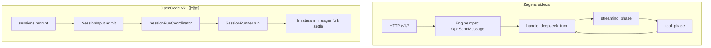
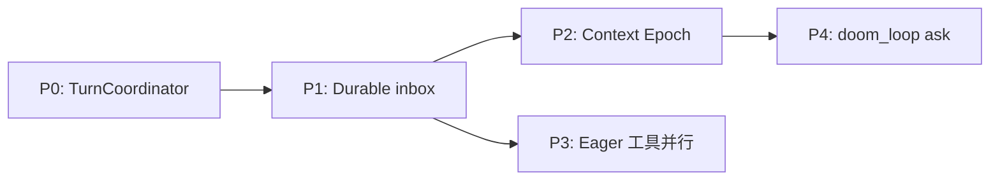

# OpenCode Agent 核心对标分析

| 字段 | 值 |
|------|-----|
| **日期** | 2026-06-06 |
| **范围** | [OpenCode](https://github.com/anomalyco/opencode)（`dev` 分支）agent 核心 vs Zagens / `deepseek-runtime` |
| **状态** | P0+P1 **已实施**（2026-06-06）；P2–P4 **冻结**（见 §8.2） |
| **读者** | runtime 维护者、桌面 Agent 排期、架构评审 |
| **关联** | [`ARCHITECTURE_BOUNDARY_ANALYSIS.md`](./ARCHITECTURE_BOUNDARY_ANALYSIS.md) · [`RUNTIME_ARCHITECTURE.md`](./RUNTIME_ARCHITECTURE.md) · [`SUBAGENT_STABILITY_ANALYSIS.md`](./SUBAGENT_STABILITY_ANALYSIS.md) · [`RUNTIME_EVOLUTION_ROADMAP.md`](./RUNTIME_EVOLUTION_ROADMAP.md) |

**如何读本文：** §1 架构对照；§2 已借鉴项；§3 高价值可借鉴点（按 ROI）；§4 Zagens 优势（不必照搬）；§5 OpenCode 参考索引；§6 对照矩阵；§7 风险与边界；§8 落地路线图。

**调研方法：** 对照 [OpenCode `dev` 分支](https://github.com/anomalyco/opencode/tree/dev) 的 `CONTEXT.md`、`specs/v2/session.md` 及 `packages/core` / `packages/opencode` 源码；Zagens 侧对照 `crates/core`、`runtime-orchestrator`、`runtime-server`。**借鉴边界：** 只吸收 harness 契约与可测语义，不引入 Effect、不改 D17/H06、不照搬 OpenCode 桌面形态。

> **结论先行：** OpenCode 最值得学的是 agent harness 的**形式化契约**（prompt 生命周期、Session drain 串行化、Context Epoch、工具输出边界、子 Session 权限派生）。Zagens 在**执行层韧性**（LHT、流式、子代理审计）已领先；差距主要在**准入层与上下文版本化的显式建模**。若只选一件事先做，建议 **P0+P1：TurnCoordinator + durable inbox（含 steer/queue）**。

---

## 1. 架构对照

### 1.1 一句话对比

| 维度 | OpenCode | Zagens |
|------|----------|--------|
| 语言 / 形态 | TypeScript / Bun；CLI + Desktop；**V1 生产 + V2 迁移中** | Rust；Tauri 壳 + `deepseek-runtime` sidecar |
| Agent 核心 | `packages/core`（V2）+ `packages/opencode`（V1 循环） | `crates/core`（`TurnLoopHost` + turn loop）+ `runtime-server`（L2 工具 / 子代理） |
| 会话模型 | Event-sourced Session；durable inbox | Engine mpsc + SQLite / JSONL 持久化；thread 级 LRU（8 个活跃 Engine） |
| 执行边界 | 单进程多 Location | 单 sidecar 单体（D17 冻结） |

OpenCode 正在向 **「prompt 准入与执行分离 + 每 Session 串行 drain + Context Epoch」** 演进。Zagens 在 **长时任务（LHT）、流式韧性、子代理审计链** 上更成熟，但 prompt / 上下文版本化更偏工程实现，缺少一层形式化 spec。

**竞争注记（非本文实施范围）：** 截至调研日，OpenCode 已发布 [Desktop App Beta](https://github.com/anomalyco/opencode/releases)（稳定线 v1.16.x，2026-06-05）。桌面端产品排期与之竞争，但本文**仅对标 agent 核心 harness**，不讨论 UI 或分发策略。

### 1.2 OpenCode 双轨说明

| 轨道 | 路径 | 状态 |
|------|------|------|
| **V1（当前生产主路径）** | `packages/opencode/src/session/prompt.ts` + `processor.ts` | 完整可用 |
| **V2（目标架构）** | `packages/core/src/session/` + `specs/v2/session.md` | 部分落地；MCP 过滤、手动 compaction API、steering reminders 等多为 `missing` / `partial` |

**借鉴原则：** 优先学 V2 **设计原则与 spec**，勿直接抄 V1 实现细节。V1 中已验证的行为（如 doom loop `ask`、arity）可作对照，但落地时以 V2 契约为准。

### 1.3 Zagens turn loop 概览

主循环在 `crates/core/src/engine/turn_loop/run.rs` 的 `handle_deepseek_turn`，通过 `TurnLoopHost` trait 由 sidecar 注入 L2 能力（工具注册表、MCP、LHT、子代理等）。



---

## 2. 已从 OpenCode 借鉴的实现

| 能力 | OpenCode 来源 | Zagens 落点 | 说明 |
|------|---------------|-------------|------|
| Shell 命令 arity 分类 | `packages/opencode/src/permission/arity.ts` | `crates/runtime-server/src/command_safety.rs` | 前缀匹配、忽略 flag；`git status` 匹配 `git status -s` |
| 大工具输出落盘 | Managed Tool Output File（`CONTEXT.md`） | `crates/runtime-server/src/tools/truncate.rs` | spillover 至 `~/.deepseek/tool_outputs/`；模型看 bounded preview |
| Plan / Agent 模式分工 | `build` / `plan` 内置 agent | `TurnLoopMode::Agent` / `Plan` / `Yolo` | plan 模式限制 edit、defer 部分工具 |
| Doom loop 防护 | V1：连续 3 次相同 tool+input → `permission.ask("doom_loop")` | `crates/core/src/engine/loop_guard.rs` | 我们**硬 block**（第 3 次）+ 连续失败 halt（第 8 次）；策略更硬；V2 无等价 native 路径 |

---

## 3. 高价值可借鉴点（按 ROI 排序）

### 3.1 Durable Prompt Admission（admit → promote）— 优先级最高

**OpenCode 做法（V2）：**

- `SessionInput.admit`：用户输入先写入 durable inbox，**不可见**
- `promote`：在 **safe provider-turn boundary** 才提升为 model-visible user message
- 投递语义：
  - **`steer`**：下一 safe boundary 插队到当前 activity
  - **`queue`**：FIFO；当前 activity 结束后才提升**一条**

**权威文档：** `CONTEXT.md`、`specs/v2/session.md`、`packages/core/src/session/input.ts`

**Zagens 现状：**

- `Op::SendMessage` 经 mpsc 直接进入 turn（`crates/core/src/engine/op.rs`）
- steer 经 `rx_steer` 在流式阶段 `try_recv` 排队（`streaming_phase.rs`），无 durable inbox，无显式 **queue** 语义
- 崩溃时「已发送但未 promote」的输入无独立恢复点

**建议：**

1. 在 `runtime-orchestrator` thread/turn 层加轻量 inbox 表（SQLite 一行即可）
2. API / `Op` 区分 `steer` vs `queue`
3. `promote` 放在每步 provider call 前的 safe boundary（与 OpenCode `CONTEXT.md` 一致）

**收益：** 桌面「中途改方向」「排队下一条」「崩溃恢复」；不改 D17 壳 / sidecar 边界。

**改动面：** `runtime-orchestrator`、`runtime-api`、可选 WebView 发送语义。

---

### 3.2 Per-Session Run Coordinator — 优先级高

**OpenCode 做法：**

`SessionRunCoordinator`（`packages/core/src/session/run-coordinator.ts`）保证：

- 同 Session **单 drain 链**（`run` / `wake` 合并）
- 多 Session 可并发
- `interrupt` 建立 ownership 边界；interrupt 前的 wake 被抑制

**Zagens 现状：**

- 每 thread 一个 Engine；同 thread 仅一个 `active_turn`（见 [`ARCHITECTURE_BOUNDARY_ANALYSIS.md` §3.2](./ARCHITECTURE_BOUNDARY_ANALYSIS.md)）
- interrupt 分两层（D9）：上层断 SSE ≠ 下层停 turn
- `wake` / `run` / `interrupt` 语义分散在 HTTP handler、mpsc、cancel token

**建议：** 在 `runtime-orchestrator/src/runtime_threads/manager.rs` 抽 `TurnCoordinator` 状态机：

```text
idle → draining → (coalesced rerun) → draining → idle
```

统一 `SendMessage` / `Steer` / `Interrupt` 竞态；不必引入 Effect。

**收益：** 「狂点发送 + 立刻停止」类 bug 根因收敛；interrupt 语义可测试化。

---

### 3.3 Context Epoch + System Context Registry — 优先级中高

**OpenCode 做法（V2）：**

- **Context Epoch**：每个 epoch 有 immutable baseline + snapshot
- **Context Source**：AGENTS.md、日期、skill 列表等独立 source；在 safe boundary 懒加载
- 变更合并为 **Mid-Conversation System Message**（durable 审计历史，投影历史可裁剪）
- compaction / 换 model / 换 agent → 新 epoch；不破坏 provider cache 前缀

**权威文档：** `CONTEXT.md`、`packages/core/src/session/context-epoch.ts`、`packages/core/src/system-context/`

**Zagens 现状：**

- 每步 `refresh_system_prompt`（`TurnLoopHost`）
- compaction summary 进 stable prefix；LHT 有 `carry_forward` / in-turn cycle advance
- **无**「epoch + source 注册表」形式化层

**建议（渐进）：**

1. 定义 `ContextSource` trait：`load` / `render_baseline` / `render_delta`
2. compaction 时显式 **结束当前 epoch**，新 baseline 用结构化模板
3. 借鉴 OpenCode **7 段 compaction 模板**：Goal / Constraints / Progress / Key Decisions / Next Steps / Critical Context / Relevant Files

**收益：** 长对话续作可预测；换 agent / 换 model 时系统提示词版本可审计。

---

### 3.4 Stream 内 Eager 并行工具结算 — 优先级中

**OpenCode V2（`specs/v2/session.md` + `SessionRunner`）：**

- stream 消费到**完整** local `tool-call` 后，先 durable 投影，再 **fork child 执行**（Effect fiber）
- stream 结束后 **await** 全部已启动的 tool settlement
- reload projected history 一次后再进下一 provider turn
- 注：`FiberSet` 用于 drain 链调度（`run-coordinator.ts`），**不是** tool settle 的入口 API

**Zagens 现状：** **先完整消费 stream，再** `tool_phase` 批量执行。已有 `should_parallelize_tool_batch`（`dispatch.rs`），但触发点在 stream 结束之后。

**建议：** 在 `streaming_phase` 识别完整 `tool_use` block 后，对 read-only 且无需审批的批次 **提前 spawn**（Rust `tokio::spawn` / 现有 dispatch 路径）；approval 门禁不变。

**收益：** 多 read-only 工具步骤的 wall-clock 降低。

**风险：** 与 steer / interrupt / promote 边界交互需回归；OpenCode V2 当前 slice 对 eager 工具**无界并行**，实施前须加 backpressure；见 §7。

---

### 3.5 Subagent = Child Session + 权限派生 — 优先级中（战略）

**OpenCode：** `task` 工具创建带 `parentID` 的子 Session；`deriveSubagentSessionPermission` 继承父 agent + 父 session deny；默认 deny 嵌套 `task` / `todowrite`。

**Zagens：** 进程内 `SubAgentManager`（见 [`SUBAGENT_STABILITY_ANALYSIS.md`](./SUBAGENT_STABILITY_ANALYSIS.md)）；审计链、structured findings 强，但**非独立 Session**，后台化 / 权限审计粒度较弱。

**建议：** 短期不重写；中期「子代理 turn = 轻量 child thread」，复用 thread store + LRU。优先移植 **权限派生** 防 plan 模式 bypass。

---

### 3.6 Doom Loop → Ask（而非纯 Block）— 优先级中低

| | OpenCode V1 | Zagens |
|---|-------------|--------|
| 触发 | 3 次相同 tool+input | 3 次相同 → **block**；8 次连续失败 → **halt** |
| 用户选择 | `permission.ask("doom_loop")` | LHT 可 grant 最多 2 次 loop-guard continuation |

V2 spec 尚无 native doom loop 等价物；此处借鉴的是 **V1 产品策略**，不是 V2 已落地能力。

**建议：** block 前增加 `approval_policy` 分支，办公场景「故意重试同一 grep」可经用户确认继续。

---

### 3.7 崩溃后 `failInterruptedTools` — 优先级中低

**OpenCode V2：** drain 启动前将 `running` 工具标为 `"Tool execution interrupted"`，**不静默重放副作用**。

**Zagens：** 子代理 panic→Failed（P0 已落地）；主 turn 内 in-flight 工具恢复语义可对齐。

**建议：** turn 恢复路径显式标记 interrupted tool parts，避免模型误判已成功。

---

### 3.8 Tool Registry 撤销语义文档化 — 优先级低

OpenCode `packages/core/src/tool/AGENTS.md` 明确 **immediate revocation vs pinned turn** trade-off。

**建议：** 新增 [`TOOL_REGISTRY_SEMANTICS.md`](./TOOL_REGISTRY_SEMANTICS.md)（或并入 [`TOOLS_PRINCIPLES.md`](./TOOLS_PRINCIPLES.md)），描述 MCP defer、eager load、mid-turn 激活规则。

---

## 4. Zagens 优势（不必照搬）

| 能力 | 说明 |
|------|------|
| **长时任务（LHT）** | step 耗尽 continuation、loop-guard continuation、context cycle handoff、in-turn cycle advance、manifest gate — OpenCode V2 spec 多处仍为 `missing` |
| **流式韧性** | chunk timeout、transparent retry、stream truncation probe、`finish_reason=length` 续写 — 针对 DeepSeek 流式 quirks |
| **Compaction 经济学** | `token_threshold = 800_000` + `MINIMUM_AUTO_COMPACTION_TOKENS = 500_000` 硬地板，保护 KV prefix cache（`crates/core/src/compaction.rs`） |
| **子代理审计链** | structured findings / verdict、scratchpad、adaptive join |
| **Durable Task** | `task_*` 与 sub-agent 分离，适合办公自动化流水线 |
| **架构边界** | D17 壳 / sidecar 硬隔离；Bearer 不进 WebView（H06） |
| **桌面安全模型** | sidecar Bearer + 壳 IPC；不照搬 OpenCode CLI/桌面一体进程的权限边界 |

### 4.1 实证对标案例（同一 prompt · 记录表）

用 **同一 prompt + 同一 oracle** 跑 Zagens 与 OpenCode，记录终态而非输出逐字一致（见 [`LHT_TEST_SUITE.md`](../harness/LHT_TEST_SUITE.md) §5.1）。

| 案例 ID | 任务族 | 规模档 | 规格 | 对标关注点 |
|---------|--------|--------|------|------------|
| **MICROSTACK** | 从零搭建 Go 框架 | L（1.5–4W 行目标） | [`microstack-framework.md`](../harness/test-cases/microstack-framework.md) | manifest 门禁、欠拆解假绿、CRAFT macro_loop |
| **CMS-AUDIT（CMS02）** | 存量全库审计 + 审修闭环 | **M**（221 文件） | [`cms-full-code-audit.md`](../harness/test-cases/cms-full-code-audit.md) | 并行 Explore、scratchpad、5 项 verify 真跑、P0 修复接力 |
| **CMS-L** | 同上 | L（>500 文件） | 沿用 CMS 规格 §7 | 区域分批策略、墙钟/token |
| **CMS-XL** | 同上 | XL（多仓/monorepo） | 待补 | 跨仓 inventory、并发上限 |

**CMS02 终态摘要（Zagens，`F:\CMS框架`，✅ 全链路）：** 19 区域 · 12 Explore · 5/5 verify（多轮真跑）· HIGH×13 · 报告 `doc/CODE_AUDIT_V2.44.4.docx` · 类型清理 19 处 · **P0×5+P1×3 修复** · checklist **9/9·100%** · 终验 `tsc` exit 0。P2/部分 HIGH 诚实未收口。OpenCode 对照跑使用 [`cms-full-code-audit.md`](../harness/test-cases/cms-full-code-audit.md) §1-A prompt 原样，记录表 §7。

---

## 5. OpenCode 参考索引

### 5.1 Agent 核心

| 关注点 | OpenCode 路径 |
|--------|---------------|
| V2 Session 权威 spec | `specs/v2/session.md` |
| 术语与关系 | `CONTEXT.md` |
| Prompt admit / promote | `packages/core/src/session/input.ts` |
| Run coordinator | `packages/core/src/session/run-coordinator.ts` |
| Turn 主循环（V2） | `packages/core/src/session/runner/llm.ts` |
| Turn 主循环（V1） | `packages/opencode/src/session/prompt.ts`、`processor.ts` |
| Context Epoch | `packages/core/src/session/context-epoch.ts` |
| Compaction | `packages/core/src/session/compaction.ts` |
| Permission V2 | `packages/core/src/permission.ts` |
| Subagent | `packages/opencode/src/tool/task.ts`、`agent/subagent-permissions.ts` |
| Tool registry | `packages/core/src/tool/registry.ts`、`tool/AGENTS.md` |
| Command arity | `packages/opencode/src/permission/arity.ts` |

### 5.2 Zagens 代码索引

| 关注点 | 路径 |
|--------|------|
| Turn 主循环 | `crates/core/src/engine/turn_loop/run.rs` |
| 流式阶段 + steer | `crates/core/src/engine/turn_loop/streaming_phase.rs` |
| 工具阶段 | `crates/core/src/engine/turn_loop/tool_phase.rs` |
| Loop guard | `crates/core/src/engine/loop_guard.rs` |
| 并行批次策略 | `crates/core/src/engine/dispatch.rs` |
| Engine 操作 | `crates/core/src/engine/op.rs` |
| Compaction 配置 | `crates/core/src/compaction.rs` |
| 工具输出 spillover | `crates/runtime-server/src/tools/truncate.rs` |
| Shell arity（已移植） | `crates/runtime-server/src/command_safety.rs` |
| 子代理管道 | `crates/runtime-server/src/tools/subagent/` |
| 活跃 Engine LRU | `crates/runtime-orchestrator/src/runtime_threads/active.rs` |
| 架构边界 | `crates/desktop/tests/architecture_boundary.rs` |

---

## 6. 对照矩阵（速查）

| 维度 | OpenCode | Zagens | 借鉴建议 |
|------|----------|--------|----------|
| Prompt 生命周期 | admit → promote | 直接 SendMessage | **P1：inbox** |
| steer / queue | 显式语义 | 仅 steer 队列 | **P1** |
| Session 串行化 | RunCoordinator | active_turn + mpsc | **P0：TurnCoordinator** |
| Provider turn | 1× `llm.stream` / turn | 流式 phase + tool phase | 保持；可选 eager 工具 |
| 步数上限 | 25 步硬顶 | `max_steps` 默认 100 + LHT continuation | 保持 LHT；不必降到 25 |
| 上下文版本化 | Context Epoch | refresh + compaction marker | **P2** |
| Compaction 触发 | token 比例 + overflow | 80 万阈值 + 50 万地板 | 保持地板；借 7 段模板 |
| 工具输出过大 | Managed file + preview | spillover | 已对齐 |
| 相同调用循环 | V1 ask doom_loop | block @ 3 | **P4：可选 ask** |
| 子代理模型 | child Session | in-process manager | 中期 child thread |
| 工具并行 | stream 内 eager | stream 后 batch | **P3** |
| 崩溃工具恢复 | failInterruptedTools | 子代理 P0 | **P4** |
| 桌面安全 | CLI + Desktop Beta | sidecar + Bearer 隔离 | **不照搬** WebView 直连 |

---

## 7. 风险与架构边界

实施 §8 路线图时须遵守：

1. **D17：** Desktop 不得 path-depend `core` / `runtime-server`；turn 只在 sidecar 内执行。
2. **H06：** Bearer 不进 WebView；inbox / coordinator 逻辑落在 orchestrator + sidecar，不经壳内嵌 Engine。
3. **单 sidecar 单体：** 不做多 sidecar 分片除非另开 ADR。
4. **Eager 工具与 steer：** promote / steer 必须在 safe boundary；避免 tool 执行中与 steer 竞态。
5. **OpenCode V2 不完整：** MCP 过滤、clustered ownership、post-crash activity recovery 等勿假设已在 OpenCode 生产可用。
6. **Eager 工具 backpressure：** OpenCode V2 当前 local slice 对 stream 内 eager 结算**刻意无界**；Zagens 若做 P3，须保留 approval 门禁并限制并发，避免与 steer/interrupt 竞态。
7. **不引入 Effect：** `SessionRunCoordinator` 的语义可对等移植为 Rust 状态机 + `tokio`/`mpsc`，勿为对标而换运行时范式。

---

## 8. 落地路线图



| 阶段 | 内容 | 改动面 | 风险 | 验收要点 |
|------|------|--------|------|----------|
| **P0** | `TurnCoordinator` 统一 interrupt / wake / run | `runtime-orchestrator` | 低 | 双发 + 立刻 interrupt 无竞态；单测覆盖状态机 |
| **P1** | SQLite inbox + promote；steer / queue API | orchestrator + `runtime-api` | 中 | 崩溃后 admit 可重试；queue FIFO |
| **P2** | Context Source 注册表 + 7 段 compaction 模板 | `core` system prompt 路径 | 中 | compaction 后 epoch 切换可观测 |
| **P3** | streaming 内提前并行 read-only 工具 | `turn_loop/streaming_phase` | 中 | approval 回归；与 steer 边界测试 |
| **P4** | doom_loop ask + interrupted tool 标记 | `loop_guard` + `tool_phase` | 低 | 用户可确认继续；恢复不误判成功 |

**推荐首批：** P0 + P1（准入层与执行解耦，桌面体验 ROI 最高）— **已完成**。

### 8.2 实施状态与冻结决策（2026-06-06）

| 阶段 | 状态 | 落点 |
|------|------|------|
| **P0** TurnCoordinator | ✅ 已实施 | `runtime-orchestrator/.../turn_coordinator.rs`；`interrupt` 接入 coordinator |
| **P1** Durable inbox | ✅ 已实施 | SQLite `session_input`；`StartTurnRequest.delivery`；`prompt.admitted` / `prompt.promoted` 事件 |
| **P2** Context Epoch | ⏸ 冻结 | 待长对话/LHT harness 数据门控 |
| **P3** Eager 工具并行 | ⏸ 冻结 | 避免与 steer/interrupt 交叉回归 |
| **P4** doom_loop ask | ⏸ 冻结 | 现有硬 block + LHT continuation 够用 |

**API 行为（P1）：**

- `POST /v1/threads/{id}/turns` 无 `delivery`、thread 空闲 → 行为与旧版相同（立即开 turn），但会先 **admit** 再 **promote**（崩溃可恢复）。
- `delivery: "queue"` 且 thread 有 active turn → **202 Accepted**，响应含 `queued` 与当前 active `turn`；turn 结束后自动 promote 下一条 queue。
- `POST .../steer` → admit（`steer`）+ promote + 引擎 steer（与旧版对外行为一致，多了 durable 记录）。

**刻意不做（本批）：** WebView 默认改 queue、P2–P4 特性、子代理 child thread 重写。

### 8.1 Issue 拆分模板（P0 示例）

```markdown
Title: runtime: TurnCoordinator for per-thread drain serialisation

Scope:
- Add TurnCoordinator state machine in runtime-orchestrator
- Route SendMessage / Steer / Interrupt through coordinator
- Document semantics alongside D9 two-layer cancel

Out of scope:
- Durable inbox (P1)
- WebView API changes unless required for interrupt tests

Tests:
- Unit: coalesce run+wake, interrupt suppresses pending wake
- Integration: sidecar_parallel_turns_on_two_threads unchanged
```

---

## 9. 修订记录

| 日期 | 说明 |
|------|------|
| 2026-06-06 | 初版：OpenCode `dev` 分支调研；agent 核心对标、矩阵、路线图 |
| 2026-06-06 | 审核修订：修正 §3.4 eager 工具表述（fork settle ≠ FiberSet）；区分 V1/V2 doom loop；补充 Desktop Beta 竞争注记、调研方法与 §7 backpressure/Effect 边界 |
| 2026-06-05 | §4.1 实证对标表：CMS-AUDIT（CMS02）存量审计 + CMS-L/XL 规模梯度；交叉引用 `cms-full-code-audit.md` |
| 2026-06-05 | §4.1 CMS02 终态签收：全链路跑通（verify+类型清理+P0/P1+9/9 checklist） |
| 2026-06-06 | P0+P1 落地；P2–P4 冻结（§8.2） |
