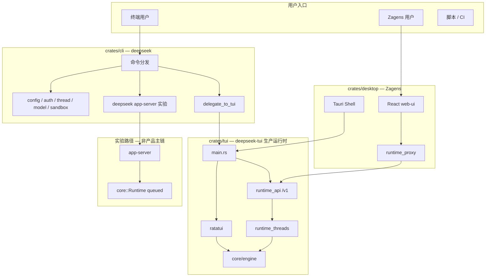
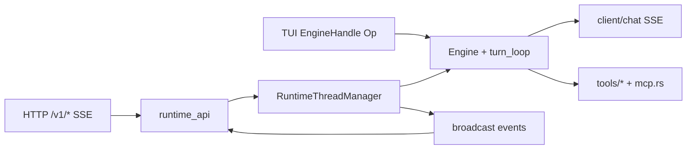
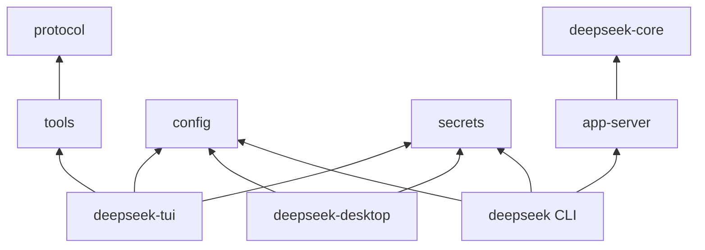

# 运行时架构（SSOT 附图）

> **叙述与排期：** 见 [RUNTIME_EVOLUTION_ROADMAP.md](./RUNTIME_EVOLUTION_ROADMAP.md)（**v2.0-final**；门控 **A → A+ → P2 → F**）  
> **HTTP 契约：** [API_DESIGN.md](./API_DESIGN.md)  
> **最后更新：** 2026-05-22（§17 审核：P2 类型部分入 `deepseek-core`，Engine 仍在 tui）

## 0. 三层模型（融合但不合并）

| 层 | 仓库落点 | 职责 |
|----|----------|------|
| **L1 底层** | 今：`crates/tui`；**P2 后：** `deepseek-core` + tui 适配 | Agent turn、会话 — **先 A+A+，再 P2** |
| **L2 契约** | `runtime_api` `/v1/*`、SSE 子集、`runtime_proxy`、Tauri IPC | 桌面/TUI **融合面** |
| **L3 壳** | `crates/desktop` WebView + Tauri；`tui/` ratatui | 只消费 L2，**不**内嵌 L1 |

---

## 1. 系统总览

**图例：** 绿色路径 = 生产；`app-server` = 仅 `deepseek app-server` 子命令。

---

## 2. 生产路径内部（deepseek-tui）

---

## 3. Workspace crate 依赖

`deepseek-tui` **不依赖** `deepseek-core`。

---

## 4. CLI 子命令路由

| 类型 | 示例命令 | 路径 |
|------|----------|------|
| 转调 tui | `run`, `exec`, `serve`, `resume`, … | `deepseek-tui` 生产链 |
| CLI 内建 | `config`, `thread list`, `model`, `sandbox` | workspace 库 |
| 实验 | `app-server` | `core::Runtime` |
