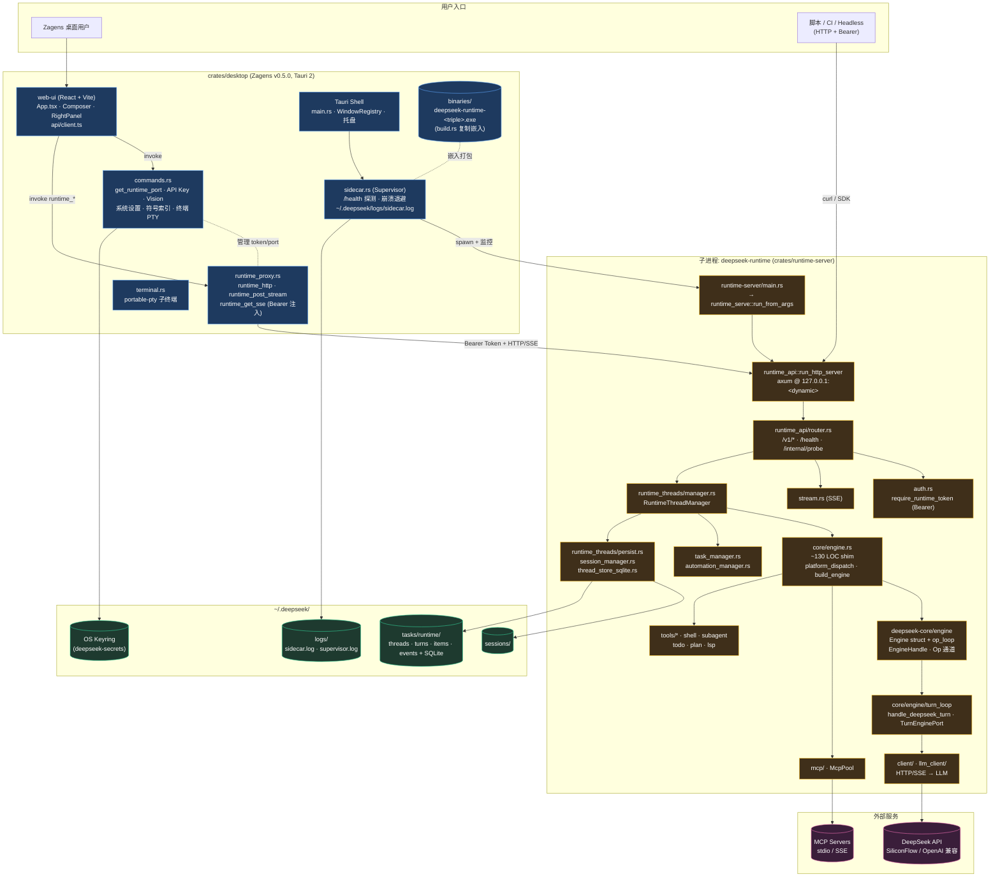
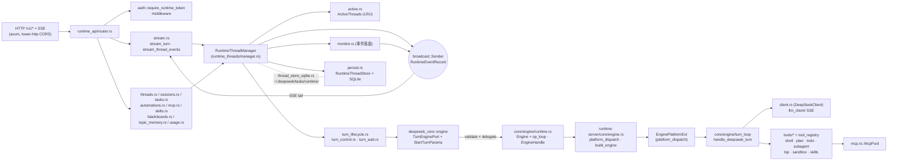
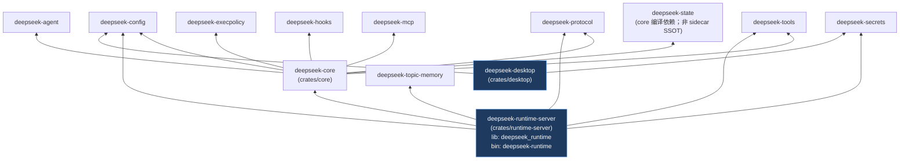
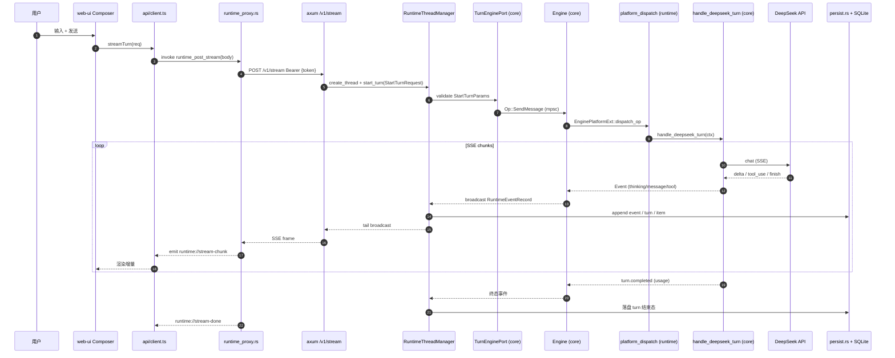

# 运行时架构（SSOT 附图）

> **叙述与排期：** [RUNTIME_EVOLUTION_ROADMAP.md](./RUNTIME_EVOLUTION_ROADMAP.md)（**v2.0-final**；门控 **A → A+ → P2 → F** 已闭合；**§3 现状快照**）  
> **HTTP / IPC 契约：** [API_DESIGN.md](./API_DESIGN.md)  
> **架构评估 / 定型判定：** [adr/ARCHITECTURE_ASSESSMENT_2026-05-25.md](./adr/ARCHITECTURE_ASSESSMENT_2026-05-25.md)（**§1 = 10/10 架构定型**，2026-05-26 — M-series + D6–D8 + D1 闭合）  
> **OpenAPI / TS 类型：** [openapi/zagens-runtime-v1.openapi.json](./openapi/zagens-runtime-v1.openapi.json) · [adr/D8_OPENAPI_TS_GENERATION.md](./adr/D8_OPENAPI_TS_GENERATION.md)  
> **实施后快照：** [adr/IMPLEMENTATION_SUMMARY_2026-05-24.md](./adr/IMPLEMENTATION_SUMMARY_2026-05-24.md)  
> **D6 Phase B：** [adr/D6_PHASE_B_CLI_SUNSET.md](./adr/D6_PHASE_B_CLI_SUNSET.md) — runtime 单 crate（`deepseek-runtime-server` / lib `deepseek_runtime`）；CLI + ratatui TUI 已移除（2026-05-26）  
> **最后更新：** 2026-05-26（D6 Phase B **已落地**：`crates/runtime-server` 单 crate；CLI + ratatui TUI 已删除）

> **如何读这份文档：** §1 是**顶层系统总览**（一张图把外部世界 → 桌面壳 → sidecar → LLM 一次看完）；§2 是**Sidecar 内部数据流**（HTTP → Manager → Engine → turn_loop）；§5 是**L2 双通道**（Tauri IPC vs Runtime HTTP/SSE）；§8 是**典型发消息时序图**。其余小节为旁注（crate 依赖、持久化、监督、模块索引）。所有图节点上的源文件路径均可直接对照代码核验。

---

## 0. 三层模型（融合但不合并）

| 层 | 仓库落点 | 职责 |
|----|----------|------|
| **L1 底层** | `deepseek-core`（`Engine` struct、`op_loop`、`turn_loop`、Session、`TurnEnginePort`）+ **`deepseek_runtime` lib**（`crates/runtime-server`：工具/MCP/LSP 宿主、`platform_dispatch` shim、`runtime_api` / `runtime_threads`） | Agent turn 逻辑在 core；runtime lib 提供平台侧接线与 HTTP 服务实现 |
| **L1 生产 binary** | **`deepseek-runtime`**（`crates/runtime-server` bin）— **无** ratatui / CLI | Zagens 嵌入 sidecar；见 [D6_RUNTIME_SERVER.md](./adr/D6_RUNTIME_SERVER.md) · [D6_PHASE_B_CLI_SUNSET.md](./adr/D6_PHASE_B_CLI_SUNSET.md) |
| **L2 契约** | `runtime_api/`、`runtime_proxy`、Tauri IPC（`commands.rs`）、OpenAPI | 桌面 **融合面**；Bearer 不出 WebView |
| **L3 壳** | **Zagens** `crates/desktop`（唯一用户产品） | 只消费 L2，**不**内嵌 L1 |

**硬约束：** Agent turn 只在 sidecar 内执行；**生产 binary 为 `deepseek-runtime`**（Zagens `externalBin`）。~~`app-server`~~ 已于 D7 C5 **删除**；~~`crates/cli`~~、~~ratatui TUI~~ 已于 D6 Phase B **删除**（见 [D4_APPSERVER_DEPRECATED.md](./adr/D4_APPSERVER_DEPRECATED.md) · [D6_PHASE_B_CLI_SUNSET.md](./adr/D6_PHASE_B_CLI_SUNSET.md)）。

---

## 1. 系统总览



**图例：** 蓝 = Zagens 产品壳；橙 = 嵌入式 sidecar（独立进程）；紫 = 外部服务；绿 = 本地持久化。实线 = 数据/控制流；虚线 = 弱关联（token 管理、二进制嵌入、握手）。

**关键代码出处（按节点）：**

| 节点 | 文件 | 说明 |
|------|------|------|
| 端口动态化 + Bearer Token UUID | [`crates/desktop/src/main.rs`](../../crates/desktop/src/main.rs) | `tokio::sync::watch::channel::<u16>` 初始 0；supervisor 解析 `DS_PICK_READY.port` 后发布；初始建议端口 7878；`uuid::Uuid::new_v4()` 每次启动新 token，仅注入 sidecar 子进程环境 |
| Sidecar 二进制嵌入 | [`crates/desktop/build.rs`](../../crates/desktop/build.rs) | 构建期复制为 `binaries/deepseek-runtime-<triple>(.exe)`，作为 Tauri `externalBin` |
| Sidecar 入口 | [`crates/runtime-server/src/main.rs`](../../crates/runtime-server/src/main.rs) → [`runtime_serve.rs`](../../crates/runtime-server/src/runtime_serve.rs) | `deepseek-runtime --host … --port …`（无 `serve` 子命令） |
| Tauri IPC handlers | [`crates/desktop/src/commands.rs`](../../crates/desktop/src/commands.rs) | 密钥/设置/平台/符号索引/导出 等 30+ 命令 |
| HTTP 代理（Bearer 注入） | [`crates/desktop/src/runtime_proxy.rs`](../../crates/desktop/src/runtime_proxy.rs) | `runtime_http` / `runtime_post_stream` / `runtime_get_sse` + path 白名单 |
| Sidecar 监督 | [`crates/desktop/src/sidecar.rs`](../../crates/desktop/src/sidecar.rs) | spawn/重启/退避/`DS_PICK_READY` 行协议；生产 **`deepseek-runtime`**；可选识别磁盘上遗留 `deepseek-tui` 二进制 |
| HTTP 入口（库） | [`crates/runtime-server/src/runtime_api/mod.rs`](../../crates/runtime-server/src/runtime_api/mod.rs) | `run_http_server` — `deepseek_runtime` lib |
| 路由表 | [`crates/runtime-server/src/runtime_api/router.rs`](../../crates/runtime-server/src/runtime_api/router.rs) | 全部 `/v1/*` 路由集中注册；`/health` `/internal/probe` 不走鉴权 |
| 线程管理 | [`crates/runtime-server/src/runtime_threads/manager.rs`](../../crates/runtime-server/src/runtime_threads/manager.rs) | `RuntimeThreadManager` + LRU 活跃线程 + 事件 broadcast |
| Engine struct + op loop | [`crates/core/src/engine/runtime.rs`](../../crates/core/src/engine/runtime.rs) + [`op_loop.rs`](../../crates/core/src/engine/op_loop.rs) | M7/M8：`Engine::with_hosts` / `Engine::run()` 在 core |
| runtime Engine shim | [`crates/runtime-server/src/core/engine.rs`](../../crates/runtime-server/src/core/engine.rs) | ~130 LOC newtype + `build_engine` + `platform_dispatch` |
| turn_loop | [`crates/core/src/engine/turn_loop/mod.rs`](../../crates/core/src/engine/turn_loop/mod.rs) | `handle_deepseek_turn` / `TurnEnginePort` / `Session` |
| Web 客户端 | [`crates/desktop/web-ui/src/api/client.ts`](../../crates/desktop/web-ui/src/api/client.ts) | `useTauriRuntimeProxy`；D10 `filterThreadStreamEvents`；D9 `turnControl.ts` |

**版本线：** runtime workspace **0.8.15**（Rust 1.88+）；Zagens desktop **0.5.0**（独立 SemVer）。  
**~~CLI / TUI~~ 已删除（D6 Phase B）：** ~~`crates/cli`~~、~~`crates/tui`~~、~~ratatui TUI~~；headless / CI 直接对 **`deepseek-runtime`** 发 HTTP。  
**~~实验路径~~ 已删除（D7 C5）：** ~~`deepseek app-server`~~ / ~~`crates/app-server`~~ — 见 [`adr/D4_APPSERVER_DEPRECATED.md`](./adr/D4_APPSERVER_DEPRECATED.md)。

---

## 2. Sidecar 内部数据流（`deepseek-runtime` / `deepseek_runtime` lib）



**路径要点：** HTTP 请求 → `RuntimeThreadManager::start_turn` 经 `TurnEnginePort`（core）校验 → 向 `EngineHandle` 发 `Op::SendMessage`（同进程 mpsc）→ `Engine::run()`（core `op_loop`）经 `EnginePlatformExt` 分发平台 op → runtime `platform_dispatch` 接线 → `handle_deepseek_turn`（core）→ 事件经 `broadcast` 既回流 SSE 又由 `monitor.rs` 持久化。

**定型后拆分现状（2026-05-26，D6 Phase B ✅）：**

| 组件 | 落点 | 说明 |
|------|------|------|
| `Engine` struct、`Engine::run()` op loop、`EngineHandle`、`Op` 通道 | [`crates/core/src/engine/`](../../crates/core/src/engine/) | M-series M7/M8 ✅ |
| `handle_deepseek_turn`、Session 类型、`TurnEnginePort` | [`crates/core/src/engine/turn_loop/`](../../crates/core/src/engine/turn_loop/) | core 库层 |
| runtime newtype shim + `build_engine` + `platform_dispatch` | [`crates/runtime-server/src/core/engine.rs`](../../crates/runtime-server/src/core/engine.rs) + 子模块 | ~130 LOC 入口 + engine-flow 编排 |
| 生产 sidecar binary + lib | [`crates/runtime-server/`](../../crates/runtime-server/) | **`deepseek-runtime`** bin + **`deepseek_runtime`** lib — **无** ratatui |
| HTTP 线程/回合生命周期 | [`crates/runtime-server/src/runtime_threads/`](../../crates/runtime-server/src/runtime_threads/) | D6 Phase B 已迁入 runtime-server |
| HTTP 路由 | [`crates/runtime-server/src/runtime_api/`](../../crates/runtime-server/src/runtime_api/) | `router.rs` 注册全部 `/v1/*`；OpenAPI 导出见 D8 |

---

## 3. Workspace crate 依赖



| Crate | 路径 | 角色 |
|-------|------|------|
| **deepseek-desktop** | `crates/desktop/` | Zagens Tauri 壳；**只**依赖 `config` + `secrets` + Tauri/reqwest/portable-pty |
| **deepseek-runtime-server** | `crates/runtime-server/` | 生产 sidecar **lib + bin**：`deepseek_runtime` + **`deepseek-runtime`**；含 `runtime_api` / `runtime_threads` / tools / Engine shim |
| **deepseek-core** | `crates/core/` | `Engine` + `op_loop` + `turn_loop` / Session / `TurnEnginePort` / 工具目录 |
| ~~**deepseek-app-server**~~ | — | **已删除**（D7 C5）；见 [D4_APPSERVER_DEPRECATED.md](./adr/D4_APPSERVER_DEPRECATED.md) |
| ~~**deepseek-tui** / ~~**deepseek CLI**~~ | — | **已删除**（D6 Phase B）；见 [D6_PHASE_B_CLI_SUNSET.md](./adr/D6_PHASE_B_CLI_SUNSET.md) |
| **deepseek-state** | `crates/state/` | `StateStore` 等类型；**`deepseek-core` 仍编译依赖**；**非** sidecar HTTP SSOT（生产用 `sessions.db` + `runtime.db`） |
| **deepseek-topic-memory** | `crates/topic-memory/` | B2 话题记忆 + `/v1/topic-memory` |

**关键事实（与各 `Cargo.toml` 一一核对）：**

- `deepseek-desktop` **只**依赖 `deepseek-config` + `deepseek-secrets`（加上 Tauri/reqwest/portable-pty/sha2/dirs），**不**直接依赖 `core` 或 runtime lib —— 所有 Agent 能力通过嵌入式 **`deepseek-runtime`** 子进程 + HTTP/IPC 获得。
- `deepseek-runtime-server` 单 crate：**无** ratatui/crossterm（D6 Phase B ✅；`cargo tree -p deepseek-runtime-server -i ratatui` → 无匹配）。
- `deepseek_runtime` lib 直接依赖 `deepseek-core`；`Engine` struct + `Engine::run()` 在 core，runtime 保留 ~130 LOC shim + 工具/MCP/LSP 宿主实现。
- ~~`deepseek-tui-core` legacy crate~~ **已于 2026-05-25 删除**。
- ~~`deepseek-app-server`~~ **已于 2026-05-26 删除**（D7 C5）。
- ~~`crates/cli` / `crates/tui`~~ **已于 2026-05-26 删除**（D6 Phase B）。

---

## 4. 持久化（D7 ✅）

生产 sidecar 内 **Sessions** 与 **Runtime threads** 双 SQLite，由 `runtime_thread_id` 链接；完整路径、环境变量与 HTTP 读写表见 **[PERSISTENCE.md](./PERSISTENCE.md)**（D7 SSOT，2026-05-26 落地）。

| 轨 | 语义 | 代码 | 默认目录 |
|----|------|------|----------|
| **Sessions** | 桌面侧栏会话、消息快照、`runtime_thread_id` | [`session_manager.rs`](../../crates/runtime-server/src/session_manager.rs) + [`session_store_sqlite.rs`](../../crates/runtime-server/src/session_store_sqlite.rs) | `~/.deepseek/sessions/` |
| **Runtime threads** | HTTP `/v1/threads/*`、回合、事件、SSE | [`runtime_threads/persist.rs`](../../crates/runtime-server/src/runtime_threads/persist.rs) + [`thread_store_sqlite.rs`](../../crates/runtime-server/src/thread_store_sqlite.rs) | `~/.deepseek/tasks/runtime/`（`DEEPSEEK_RUNTIME_DIR` / `DEEPSEEK_TASKS_DIR`） |
| **StateStore legacy** | `deepseek-core` 内 `ThreadManager` 等历史类型；**非** sidecar HTTP 路径 | [`deepseek-state`](../../crates/state/) | `~/.deepseek/state.db`（旧 CLI 时代；**非** 生产 SSOT） |

**Runtime 数据布局**（schema v2）：`threads/`、`turns/`、`items/`、`events/` + `runtime.db` SQLite；路由规则 `routing_rules.json`。

---

## 5. L2 契约：双通道

Zagens WebView 通过 **两条通道** 访问运行时（详见 [API_DESIGN.md](./API_DESIGN.md)）：


| 通道 | 机制 | 典型用途 | 代码出处 |
|------|------|----------|----------|
| **A — Tauri IPC** | `invoke()` → `#[tauri::command]` | 端口/token、密钥、设置、符号索引、平台/系统/终端 PTY、文件二进制读取、sidecar 重启、多窗口 | [`crates/desktop/src/commands.rs`](../../crates/desktop/src/commands.rs)、[`window_registry.rs`](../../crates/desktop/src/window_registry.rs)、[`terminal.rs`](../../crates/desktop/src/terminal.rs) |
| **B — Runtime HTTP/SSE** | `runtime_proxy.rs` 转发 + Bearer 注入 | 对话、线程、SSE、MCP、任务、用量、自动化、技能 | [`crates/desktop/src/runtime_proxy.rs`](../../crates/desktop/src/runtime_proxy.rs)；客户端 [`web-ui/src/api/client.ts`](../../crates/desktop/web-ui/src/api/client.ts) · [`turnControl.ts`](../../crates/desktop/web-ui/src/api/turnControl.ts) |

**安全约束（H06）+ 桌面 UX（D9/D10）：**

- `runtime_http` / `runtime_get_sse` / `runtime_post_stream` 都在 Rust 侧注入 `Authorization: Bearer {token}`，**token 不进** WebView storage / DevTools。
- 路径白名单（[`runtime_proxy::validate_runtime_path`](../../crates/desktop/src/runtime_proxy.rs)）：仅允许 `/health` 与 `/v1/*`，拒绝 `..` 与非 `/v1` 前缀。
- **取消/打断两层（D9）：** 上层 `runtime_cancel_sse`（`SSE_CANCEL_FLAGS` 按 `window.label()` 维度；断开 WebView ↔ sidecar SSE）；下层 `POST /v1/threads/{id}/turns/{turn_id}/interrupt`（真正取消 turn，发 `Op::Interrupt`）。UI 统一经 `turnControl.ts`。
- **跨窗口 SSE 过滤（D10）：** `filterThreadStreamEvents` 按 thread owner 过滤，避免多窗口「幽灵渲染」。
- 配置改动 ⇒ 重启 sidecar：`AppContext::sidecar_restart: Arc<Notify>`，写入密钥/设置后 `notify_one()`，由 `sidecar::start_and_monitor` 监听并按 `RESTART_DEBOUNCE_MS` 去抖。
- 握手协议：sidecar 启动后向 stdout 输出 `DS_PICK_READY {...}`（含 `port`、`pid`、`token_fp`、`version`），supervisor 据此判定就绪；运行期通过 stdin `op: ping | drain` 做心跳/优雅退出。

Sidecar 内 **`Op::SendMessage` 是同进程 mpsc**（不经 HTTP）；见 §8 时序图。

---

## 6. Zagens sidecar 监督

`crates/desktop/src/sidecar.rs` 启动嵌入二进制：

```text
deepseek-runtime --host 127.0.0.1 --port {port}
  --cors-origin http(s)://tauri.localhost
环境变量:
  DEEPSEEK_RUNTIME_TOKEN=<UUID from main.rs>
  DEEPSEEK_CLIENT_SURFACE=zagens
  DEEPSEEK_API_KEY=<OS keyring>
  DEEPSEEK_BUNDLED_PYTHON=<Office 工具，可选>
```

**遗留二进制（可选）：** 若 PATH 上仍存在旧 `deepseek-tui`，`sidecar.rs` 可识别并改用 `serve --http` argv；Zagens 打包 **仅** 嵌入 `deepseek-runtime-*`。

监督能力：`/health` 探测、崩溃退避、rapid restart 限制、日志 `~/.deepseek/logs/sidecar.log` + `supervisor.log`。

---

## 7. ~~CLI 子命令路由~~（已删除，D6 Phase B）

~~`crates/cli`（`deepseek` 分发器）与 ratatui TUI~~ 已于 2026-05-26 移除。Headless / CI / 开发者请直接对 **`deepseek-runtime`** 使用 HTTP `/v1/*` + Bearer，或经 Zagens Desktop 的 Tauri proxy。详见 [D6_PHASE_B_CLI_SUNSET.md](./adr/D6_PHASE_B_CLI_SUNSET.md)。

---

## 8. 典型 Desktop 发消息时序



**关键点（容易混淆的两处）：**

- **`Op::SendMessage` 是同进程 mpsc**，不是 HTTP；Engine 后台 task 长期持有 `rx_op`，并向 `tx_event` 发事件。`RuntimeThreadManager` 用 `tokio::sync::broadcast` 把事件**同时**喂给 SSE handler 与持久化 monitor。
- **取消/打断有两层**：上层 `runtime_cancel_sse`（仅断开 WebView ↔ sidecar 的 SSE）；下层 `POST /v1/threads/{id}/turns/{turn_id}/interrupt`（真正取消 turn loop，发 `Op::Interrupt`，触发 `CancellationToken`）。前者断流后 turn 仍在跑；后者才停止 LLM/工具调用。

---

## 9. 关键模块索引

| 关注点 | 路径 |
|--------|------|
| Tauri 主入口 / token UUID / 7878 端口 | [`crates/desktop/src/main.rs`](../../crates/desktop/src/main.rs) |
| Sidecar spawn / supervisor / 退避 | [`crates/desktop/src/sidecar.rs`](../../crates/desktop/src/sidecar.rs) |
| Tauri IPC handlers（通道 A） | [`crates/desktop/src/commands.rs`](../../crates/desktop/src/commands.rs) |
| Runtime HTTP/SSE 代理（通道 B） | [`crates/desktop/src/runtime_proxy.rs`](../../crates/desktop/src/runtime_proxy.rs) |
| 多窗口注册 | [`crates/desktop/src/window_registry.rs`](../../crates/desktop/src/window_registry.rs) |
| 终端 PTY | [`crates/desktop/src/terminal.rs`](../../crates/desktop/src/terminal.rs) |
| Sidecar 二进制嵌入 | [`crates/desktop/build.rs`](../../crates/desktop/build.rs) |
| Sidecar 入口 / `deepseek-runtime` | [`crates/runtime-server/src/main.rs`](../../crates/runtime-server/src/main.rs) · [`runtime_serve.rs`](../../crates/runtime-server/src/runtime_serve.rs) |
| HTTP 路由表 + Bearer 中间件 | [`crates/runtime-server/src/runtime_api/router.rs`](../../crates/runtime-server/src/runtime_api/router.rs) + [`auth.rs`](../../crates/runtime-server/src/runtime_api/auth.rs) |
| SSE handlers | [`crates/runtime-server/src/runtime_api/stream.rs`](../../crates/runtime-server/src/runtime_api/stream.rs) |
| HTTP server 装配 | [`crates/runtime-server/src/runtime_api/mod.rs`](../../crates/runtime-server/src/runtime_api/mod.rs)（`run_http_server`） |
| 线程管理 / LRU / broadcast | [`crates/runtime-server/src/runtime_threads/manager.rs`](../../crates/runtime-server/src/runtime_threads/manager.rs) |
| 持久化（事件/线程） | [`crates/runtime-server/src/runtime_threads/persist.rs`](../../crates/runtime-server/src/runtime_threads/persist.rs) + [`monitor.rs`](../../crates/runtime-server/src/runtime_threads/monitor.rs) |
| Engine struct + op loop (core) | [`crates/core/src/engine/runtime.rs`](../../crates/core/src/engine/runtime.rs) · [`op_loop.rs`](../../crates/core/src/engine/op_loop.rs) |
| runtime Engine shim + platform dispatch | [`crates/runtime-server/src/core/engine.rs`](../../crates/runtime-server/src/core/engine.rs) · [`platform_dispatch.rs`](../../crates/runtime-server/src/core/engine/platform_dispatch.rs) |
| Turn loop / Port / Session (core) | [`crates/core/src/engine/`](../../crates/core/src/engine/) |
| Web 客户端 | [`crates/desktop/web-ui/src/api/client.ts`](../../crates/desktop/web-ui/src/api/client.ts) · [`turnControl.ts`](../../crates/desktop/web-ui/src/api/turnControl.ts) |
| OpenAPI / TS 类型 | [`docs/tech/openapi/zagens-runtime-v1.openapi.json`](./openapi/zagens-runtime-v1.openapi.json) · `export-runtime-openapi` bin（`crates/runtime-server`） |
| Sidecar 契约测（lib / in-proc） | [`crates/runtime-server/src/runtime_api/tests.rs`](../../crates/runtime-server/src/runtime_api/tests.rs) · `sidecar_contract_full_lifecycle` |
| Sidecar 契约测（binary / D6 A+） | [`crates/runtime-server/tests/sidecar_binary_contract.rs`](../../crates/runtime-server/tests/sidecar_binary_contract.rs) · CI ubuntu |

---

## 10. 产品定位与架构稳定性

自 **2026-05-24** 战略签收（[DEV_NOTES.md](../desktop/DEV_NOTES.md)）：

- **D12 Desktop-only：** Zagens 为唯一用户产品壳；~~ratatui TUI~~ **已删除**（D6 Phase B，2026-05-26）。
- **Sidecar 执行面：** 生产 binary 为 **`deepseek-runtime`**；`runtime_api` + `runtime_threads` + tools 均在 **`crates/runtime-server`**（lib `deepseek_runtime`）。
- **D6 闭合（2026-05-26）：** Phase A（不链 ratatui）+ Phase A+（binary 契约测）+ **Phase B**（单 crate 合并、删 CLI/TUI）— [D6_PHASE_B_CLI_SUNSET.md](./adr/D6_PHASE_B_CLI_SUNSET.md) · [D6_IMPLEMENTATION_PLAN §4](./adr/D6_IMPLEMENTATION_PLAN.md)。
- **架构定型（2026-05-26）：** [ARCHITECTURE_ASSESSMENT §1 = 10/10](./adr/ARCHITECTURE_ASSESSMENT_2026-05-25.md) — M-series、D6–D8、D7、D1 均已闭合；**可正常推进产品功能**，仍须遵守 Assessment §7.1 红线（`/v1/*` 须 OpenAPI、`desktop` 不链 `core`/runtime lib 等）。
- **D10 已解除（2026-05-24）：** P2 后桌面 GAP 解冻；见 [P2_D10_UNFREEZE_RECORD.md](./adr/P2_D10_UNFREEZE_RECORD.md)。

**剩余非阻塞债（定型后）：** `deepseek-core` 对 `deepseek-state` 的编译期依赖清理；§6 冷启动 profiling；P2（D11–D14）。
