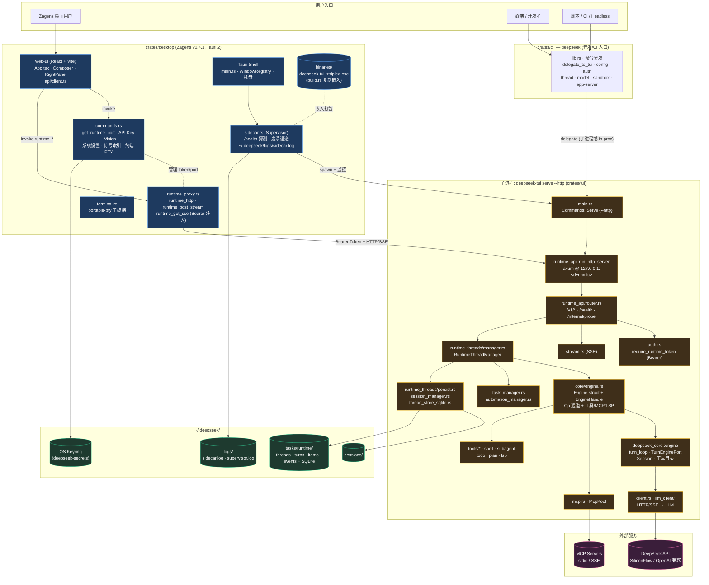
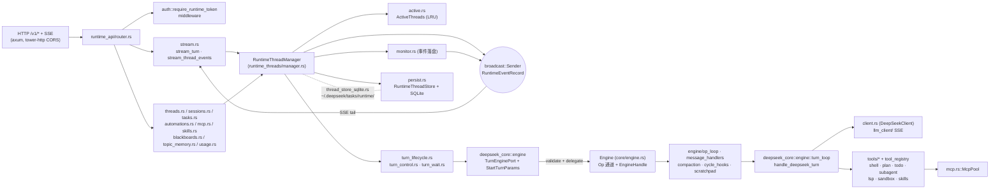
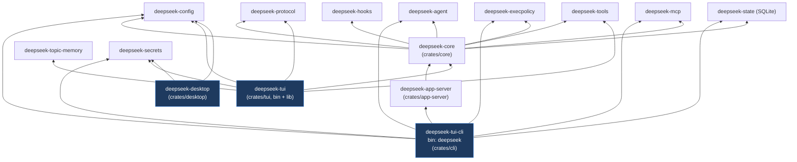
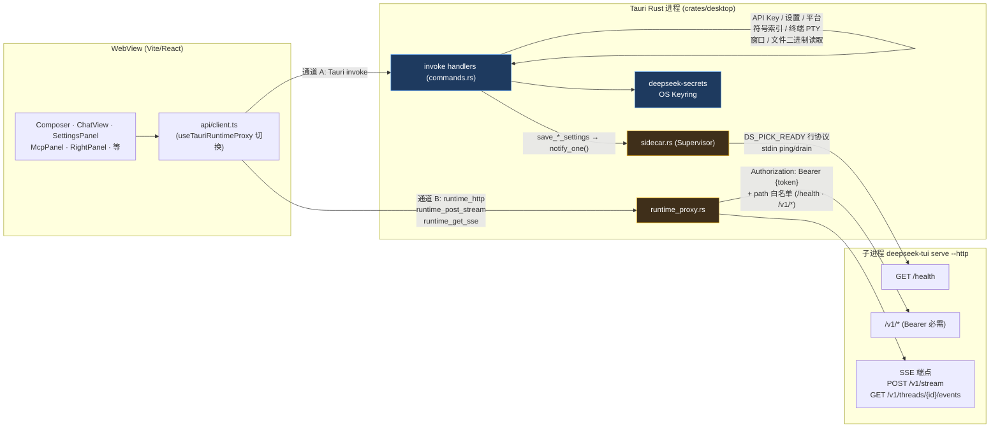
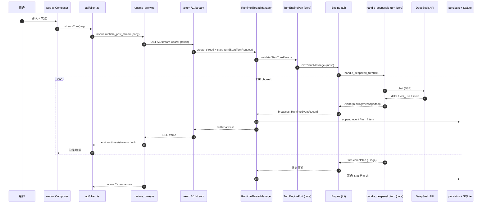

# 运行时架构（SSOT 附图）

> **叙述与排期：** [RUNTIME_EVOLUTION_ROADMAP.md](./RUNTIME_EVOLUTION_ROADMAP.md)（**v2.0-final**；门控 **A → A+ → P2 → F** 已闭合；**§3 现状快照**）  
> **HTTP / IPC 契约：** [API_DESIGN.md](./API_DESIGN.md)  
> **架构评估 / 功能冻结期判定：** [adr/ARCHITECTURE_ASSESSMENT_2026-05-25.md](./adr/ARCHITECTURE_ASSESSMENT_2026-05-25.md)（**"先定型，再迭代功能"** — §1 定型 checklist 3/10）  
> **实施后快照：** [adr/IMPLEMENTATION_SUMMARY_2026-05-24.md](./adr/IMPLEMENTATION_SUMMARY_2026-05-24.md)  
> **产品战略：** [../desktop/DEV_NOTES.md](../desktop/DEV_NOTES.md)（D12 Desktop-only）  
> **最后更新：** 2026-05-25（与仓库代码对齐；图表细化第二轮；新增架构评估交叉链接）

> **如何读这份文档：** §1 是**顶层系统总览**（一张图把外部世界 → 桌面壳 → sidecar → LLM 一次看完）；§2 是**Sidecar 内部数据流**（HTTP → Manager → Engine → turn_loop）；§5 是**L2 双通道**（Tauri IPC vs Runtime HTTP/SSE）；§8 是**典型发消息时序图**。其余小节为旁注（crate 依赖、持久化、监督、CLI、模块索引）。所有图节点上的源文件路径均可直接对照代码核验。

---

## 0. 三层模型（融合但不合并）

| 层 | 仓库落点 | 职责 |
|----|----------|------|
| **L1 底层** | `deepseek-core`（turn_loop、Session 类型、策略）+ `deepseek-tui`（Engine struct、工具实现、MCP 池） | Agent turn — **P2 已部分迁入 core**；Engine 整 struct 仍留 tui（见 [BACKLOG_ENGINE_STRUCT_IN_CORE.md](./adr/BACKLOG_ENGINE_STRUCT_IN_CORE.md)） |
| **L2 契约** | `runtime_api/`、`runtime_proxy`、Tauri IPC（`commands.rs`） | 桌面/TUI **融合面**；Bearer 不出 WebView |
| **L3 壳** | **Zagens** `crates/desktop`（唯一用户产品）；`crates/tui/src/tui/` ratatui（**maintenance/freeze**）；CLI `deepseek`（dev/headless） | 只消费 L2，**不**内嵌 L1 |

**硬约束：** Agent turn 只在 sidecar（`deepseek-tui serve --http`）内执行；**不**换 `app-server` 作生产 binary。

---

## 1. 系统总览



**图例：** 蓝 = Zagens 产品壳；橙 = 嵌入式 sidecar（独立进程）；紫 = 外部服务；绿 = 本地持久化。实线 = 数据/控制流；虚线 = 弱关联（token 管理、二进制嵌入、握手）。

**关键代码出处（按节点）：**

| 节点 | 文件 | 说明 |
|------|------|------|
| 端口动态化 + Bearer Token UUID | [`crates/desktop/src/main.rs`](../../crates/desktop/src/main.rs) | `tokio::sync::watch::channel::<u16>` 初始 0；supervisor 解析 `DS_PICK_READY.port` 后发布；初始建议端口 7878；`uuid::Uuid::new_v4()` 每次启动新 token，仅注入 sidecar 子进程环境 |
| Sidecar 二进制嵌入 | [`crates/desktop/build.rs`](../../crates/desktop/build.rs) | 构建期复制为 `binaries/deepseek-tui-<triple>(.exe)`，作为 Tauri `externalBin` |
| Tauri IPC handlers | [`crates/desktop/src/commands.rs`](../../crates/desktop/src/commands.rs) | 密钥/设置/平台/符号索引/导出 等 30+ 命令 |
| HTTP 代理（Bearer 注入） | [`crates/desktop/src/runtime_proxy.rs`](../../crates/desktop/src/runtime_proxy.rs) | `runtime_http` / `runtime_post_stream` / `runtime_get_sse` + path 白名单 |
| Sidecar 监督 | [`crates/desktop/src/sidecar.rs`](../../crates/desktop/src/sidecar.rs) | spawn/重启/退避/`DS_PICK_READY` 行协议握手 |
| HTTP 入口 | [`crates/tui/src/main.rs`](../../crates/tui/src/main.rs) → `Commands::Serve {--http}` → [`runtime_api::run_http_server`](../../crates/tui/src/runtime_api/mod.rs) |
| 路由表 | [`crates/tui/src/runtime_api/router.rs`](../../crates/tui/src/runtime_api/router.rs) | 全部 `/v1/*` 路由集中注册；`/health` `/internal/probe` 不走鉴权 |
| 线程管理 | [`crates/tui/src/runtime_threads/manager.rs`](../../crates/tui/src/runtime_threads/manager.rs) | `RuntimeThreadManager` + LRU 活跃线程 + 事件 broadcast |
| Engine struct | [`crates/tui/src/core/engine.rs`](../../crates/tui/src/core/engine.rs) | Engine + EngineHandle + Op 通道（tui crate） |
| turn_loop | [`crates/core/src/engine/mod.rs`](../../crates/core/src/engine/mod.rs) | `handle_deepseek_turn` / `TurnEnginePort` / `Session`（core crate） |
| Web 客户端 | [`crates/desktop/web-ui/src/api/client.ts`](../../crates/desktop/web-ui/src/api/client.ts) | `useTauriRuntimeProxy` 切换 Tauri/Vite-dev 两种调用形态 |

**版本线：** runtime/CLI workspace **0.8.15**（Rust 1.88+）；Zagens desktop **0.4.3**（独立 SemVer）。
**CLI 不内嵌 L1：** `deepseek` 通过 `delegate_to_tui` 转调同一 `deepseek-tui` 二进制（[`crates/cli/src/lib.rs`](../../crates/cli/src/lib.rs)）。
**实验路径（不在图内）：** `deepseek app-server` 子命令 → `crates/app-server` + `core::Runtime` + `deepseek-state` SQLite；与生产 sidecar **不**互通，仅 dev/headless。

---

## 2. Sidecar 内部数据流（deepseek-tui）



**路径要点：** HTTP 请求 → `RuntimeThreadManager::start_turn` 经 `TurnEnginePort`（core 库）校验 → 向 `EngineHandle` 发 `Op::SendMessage`（同进程 mpsc）→ Engine 后台 task 跑 `handle_deepseek_turn`（core）→ 事件经 `broadcast` 既回流 SSE 又由 `monitor.rs` 持久化。**ratatui** 路径同样持 `EngineHandle`（`spawn_engine`），不走 HTTP；现处 freeze（用户产品已切到 Zagens）。

**P2 拆分现状（2026-05-25）：**

| 组件 | 落点 | 说明 |
|------|------|------|
| `handle_deepseek_turn`、Session 类型、`TurnEnginePort` | [`crates/core/src/engine/`](../../crates/core/src/engine/) | core 库层 |
| `Engine` struct、`EngineHandle`、`Op` 通道、工具/MCP/LSP 宿主 | [`crates/tui/src/core/engine.rs`](../../crates/tui/src/core/engine.rs) + 子模块 | tui 薄壳（`engine.rs` ~209 行 + `op_loop` / `op_handlers` / `dispatch` / `turn_loop` / `tool_execution` 等） |
| HTTP 线程/回合生命周期 | [`crates/tui/src/runtime_threads/`](../../crates/tui/src/runtime_threads/) | `manager.rs`、`persist.rs`、`monitor.rs`、`turn_lifecycle.rs`、`turn_control.rs` 等 |
| HTTP 路由 | [`crates/tui/src/runtime_api/`](../../crates/tui/src/runtime_api/) | `router.rs` 注册全部 `/v1/*`；`auth.rs` Bearer 中间件；`stream.rs` SSE 处理 |

---

## 3. Workspace crate 依赖



| Crate | 路径 | 角色 |
|-------|------|------|
| **deepseek-desktop** | `crates/desktop/` | Zagens Tauri 壳；**只**依赖 `config` + `secrets` + Tauri/reqwest/portable-pty |
| **deepseek-tui** | `crates/tui/` | 生产 sidecar（HTTP/SSE）+ ratatui（freeze）；依赖 `core` |
| **deepseek-tui-cli** | `crates/cli/` | `deepseek` 二进制；dev/headless 入口；`delegate_to_tui` |
| **deepseek-core** | `crates/core/` | `turn_loop` / Session / `TurnEnginePort` / 工具目录 |
| **deepseek-app-server** | `crates/app-server/` | 实验 HTTP/stdio（仅 `deepseek app-server` 使用） |
| **deepseek-state** | `crates/state/` | CLI/app-server 线程元数据 SQLite（**不是** sidecar 持久化） |
| **deepseek-topic-memory** | `crates/topic-memory/` | B2 话题记忆 + `/v1/topic-memory` |

**关键事实（与各 `Cargo.toml` 一一核对）：**

- `deepseek-desktop` **只**依赖 `deepseek-config` + `deepseek-secrets`（加上 Tauri/reqwest/portable-pty/sha2/dirs），**不**直接依赖 `core` 或 `tui` —— 所有 Agent 能力通过嵌入式 sidecar 子进程 + HTTP/IPC 获得。
- `deepseek-tui` 依赖 `deepseek-core`（P2 闭合）；turn_loop / Session / Port 已迁入 core，但 `Engine` struct 仍留在 tui crate（[`crates/tui/src/core/engine.rs`](../../crates/tui/src/core/engine.rs)）。
- ~~`deepseek-tui-core` legacy crate~~ **已于 2026-05-25 删除**（[`adr/ARCHITECTURE_ASSESSMENT_2026-05-25.md`](./adr/ARCHITECTURE_ASSESSMENT_2026-05-25.md) §1 第 8 项 D3）。

---

## 4. 双持久化模型

生产 sidecar 内并存两套语义，**勿混用**：

| 轨 | 语义 | 代码 | 默认目录 |
|----|------|------|----------|
| **Sessions** | TUI/桌面"会话"列表、标题、恢复点 | [`session_manager.rs`](../../crates/tui/src/session_manager.rs) + [`session_store_sqlite.rs`](../../crates/tui/src/session_store_sqlite.rs) | `~/.deepseek/sessions/` |
| **Runtime threads** | HTTP `/v1/threads/*`、回合、事件、SSE | [`runtime_threads/persist.rs`](../../crates/tui/src/runtime_threads/persist.rs) + [`thread_store_sqlite.rs`](../../crates/tui/src/thread_store_sqlite.rs) | `~/.deepseek/tasks/runtime/`（`DEEPSEEK_RUNTIME_DIR` 可覆盖） |
| **实验轨（并行）** | CLI `thread list` / `app-server` 元数据 | [`deepseek-state`](../../crates/state/) 的 `StateStore` | 与生产 sidecar **不**互通 |

**Runtime 数据布局**（schema v2）：`threads/`、`turns/`、`items/`、`events/` + SQLite；路由规则 `routing_rules.json`。

**TUI 异步落盘：** [`tui/persistence_actor.rs`](../../crates/tui/src/tui/persistence_actor.rs)；阻塞 I/O 策略见 [`A1_PERSIST_BLOCKING_AUDIT.md`](./adr/A1_PERSIST_BLOCKING_AUDIT.md)。

---

## 5. L2 契约：双通道

Zagens WebView 通过 **两条通道** 访问运行时（详见 [API_DESIGN.md](./API_DESIGN.md)）：



| 通道 | 机制 | 典型用途 | 代码出处 |
|------|------|----------|----------|
| **A — Tauri IPC** | `invoke()` → `#[tauri::command]` | 端口/token、密钥、设置、符号索引、平台/系统/终端 PTY、文件二进制读取、sidecar 重启、多窗口 | [`crates/desktop/src/commands.rs`](../../crates/desktop/src/commands.rs)、[`window_registry.rs`](../../crates/desktop/src/window_registry.rs)、[`terminal.rs`](../../crates/desktop/src/terminal.rs) |
| **B — Runtime HTTP/SSE** | `runtime_proxy.rs` 转发 + Bearer 注入 | 对话、线程、SSE、MCP、任务、用量、自动化、技能 | [`crates/desktop/src/runtime_proxy.rs`](../../crates/desktop/src/runtime_proxy.rs)；客户端 [`web-ui/src/api/client.ts`](../../crates/desktop/web-ui/src/api/client.ts) |

**安全约束（H06）：**

- `runtime_http` / `runtime_get_sse` / `runtime_post_stream` 都在 Rust 侧注入 `Authorization: Bearer {token}`，**token 不进** WebView storage / DevTools。
- 路径白名单（[`runtime_proxy::validate_runtime_path`](../../crates/desktop/src/runtime_proxy.rs)）：仅允许 `/health` 与 `/v1/*`，拒绝 `..` 与非 `/v1` 前缀。
- SSE 取消按 `window.label()` 维度持久化（`SSE_CANCEL_FLAGS`），`runtime_cancel_sse` 可中断进行中的 `runtime_get_sse`。
- 配置改动 ⇒ 重启 sidecar：`AppContext::sidecar_restart: Arc<Notify>`，写入密钥/设置后 `notify_one()`，由 `sidecar::start_and_monitor` 监听并按 `RESTART_DEBOUNCE_MS` 去抖。
- 握手协议：sidecar 启动后向 stdout 输出 `DS_PICK_READY {...}`（含 `port`、`pid`、`token_fp`、`version`），supervisor 据此判定就绪；运行期通过 stdin `op: ping | drain` 做心跳/优雅退出。

**TUI 同进程路径（非 HTTP）：** `spawn_engine` → `EngineHandle` → `Op`，直接走 mpsc，不经 HTTP（除非 `--http` sidecar 模式）。

---

## 6. Zagens sidecar 监督

`crates/desktop/src/sidecar.rs` 启动嵌入二进制：

```text
deepseek-tui serve --http --host 127.0.0.1 --port {port}
  --cors-origin http(s)://tauri.localhost
环境变量:
  DEEPSEEK_RUNTIME_TOKEN=<UUID from main.rs>
  DEEPSEEK_CLIENT_SURFACE=zagens
  DEEPSEEK_API_KEY=<OS keyring>
  DEEPSEEK_BUNDLED_PYTHON=<Office 工具，可选>
```

监督能力：`/health` 探测、崩溃退避、rapid restart 限制、日志 `~/.deepseek/logs/sidecar.log` + `supervisor.log`。

---

## 7. CLI 子命令路由

| 类型 | 示例命令 | 路径 |
|------|----------|------|
| 转调 tui | `run`, `exec`, `serve`, `resume`, `sessions`, … | `delegate_to_tui` → **deepseek-tui** 生产链 |
| CLI 内建 | `config`, `thread list`, `model`, `sandbox`, `auth` | workspace 库（含 `deepseek-state`） |
| 实验 | `app-server` | `core::Runtime` + `app-server` |

---

## 8. 典型 Desktop 发消息时序



**关键点（容易混淆的两处）：**

- **`Op::SendMessage` 是同进程 mpsc**，不是 HTTP；Engine 后台 task 长期持有 `rx_op`，并向 `tx_event` 发事件。`RuntimeThreadManager` 用 `tokio::sync::broadcast` 把事件**同时**喂给 SSE handler 与持久化 monitor。
- **取消/打断有两层**：上层 `runtime_cancel_sse`（仅断开 WebView ↔ sidecar 的 SSE）；下层 `POST /v1/threads/{id}/turns/{turn_id}/interrupt`（真正取消 turn loop，发 `Op::Interrupt`，触发 `CancellationToken`）。前者断流后 turn 仍在跑；后者才停止 LLM/工具调用。

---

## 9. 关键模块索引

| 关注点 | 路径 |
|--------|------|
| Tauri 主入口 / token UUID / 7878 端口 | [`crates/desktop/src/main.rs`](../../crates/desktop/src/main.rs) |
| Sidecar spawn / supervisor / 退避 | [`crates/desktop/src/sidecar.rs`](../../crates/desktop/src/sidecar.rs) |
| Tauri IPC handlers（通道 A） | [`crates/desktop/src/commands.rs`](../../crates/desktop/src/commands.rs) |
| Runtime HTTP/SSE 代理（通道 B） | [`crates/desktop/src/runtime_proxy.rs`](../../crates/desktop/src/runtime_proxy.rs) |
| 多窗口注册 | [`crates/desktop/src/window_registry.rs`](../../crates/desktop/src/window_registry.rs) |
| 终端 PTY | [`crates/desktop/src/terminal.rs`](../../crates/desktop/src/terminal.rs) |
| Sidecar 二进制嵌入 | [`crates/desktop/build.rs`](../../crates/desktop/build.rs) |
| Sidecar 入口 / `Serve --http` | [`crates/tui/src/main.rs`](../../crates/tui/src/main.rs) |
| HTTP 路由表 + Bearer 中间件 | [`crates/tui/src/runtime_api/router.rs`](../../crates/tui/src/runtime_api/router.rs) + [`auth.rs`](../../crates/tui/src/runtime_api/auth.rs) |
| SSE handlers | [`crates/tui/src/runtime_api/stream.rs`](../../crates/tui/src/runtime_api/stream.rs) |
| HTTP server 装配 | [`crates/tui/src/runtime_api/mod.rs`](../../crates/tui/src/runtime_api/mod.rs)（`run_http_server`） |
| 线程管理 / LRU / broadcast | [`crates/tui/src/runtime_threads/manager.rs`](../../crates/tui/src/runtime_threads/manager.rs) |
| 持久化（事件/线程） | [`crates/tui/src/runtime_threads/persist.rs`](../../crates/tui/src/runtime_threads/persist.rs) + [`monitor.rs`](../../crates/tui/src/runtime_threads/monitor.rs) |
| Engine struct + Op 通道 | [`crates/tui/src/core/engine.rs`](../../crates/tui/src/core/engine.rs) + [`core/engine/`](../../crates/tui/src/core/engine/) 子模块 |
| Turn loop / Port / Session (core) | [`crates/core/src/engine/`](../../crates/core/src/engine/) |
| Web 客户端 | [`crates/desktop/web-ui/src/api/client.ts`](../../crates/desktop/web-ui/src/api/client.ts) |
| CLI 转调 | [`crates/cli/src/lib.rs`](../../crates/cli/src/lib.rs)（`delegate_to_tui`） |
| 实验 Runtime（app-server） | [`crates/app-server/`](../../crates/app-server/) + [`crates/core/src/lib.rs`](../../crates/core/src/lib.rs) |

---

## 10. 产品定位（架构相关）

自 **2026-05-24** 战略签收（[DEV_NOTES.md](../desktop/DEV_NOTES.md)）：

- **D12 Desktop-only：** Zagens 为唯一用户产品壳；ratatui TUI 进入 **freeze**（维护/回归，不做 parity 新特性）。
- **Sidecar 不变：** `deepseek-tui serve --http` + `runtime_api` + `runtime_threads` 仍是 L1 执行面。
- **D10 已解除（2026-05-24）：** P2 后桌面 GAP 解冻；见 [P2_D10_UNFREEZE_RECORD.md](./adr/P2_D10_UNFREEZE_RECORD.md)。

CLI 保留为 **dev / headless / CI** 入口，与 Zagens 共享同一 sidecar 语义。
