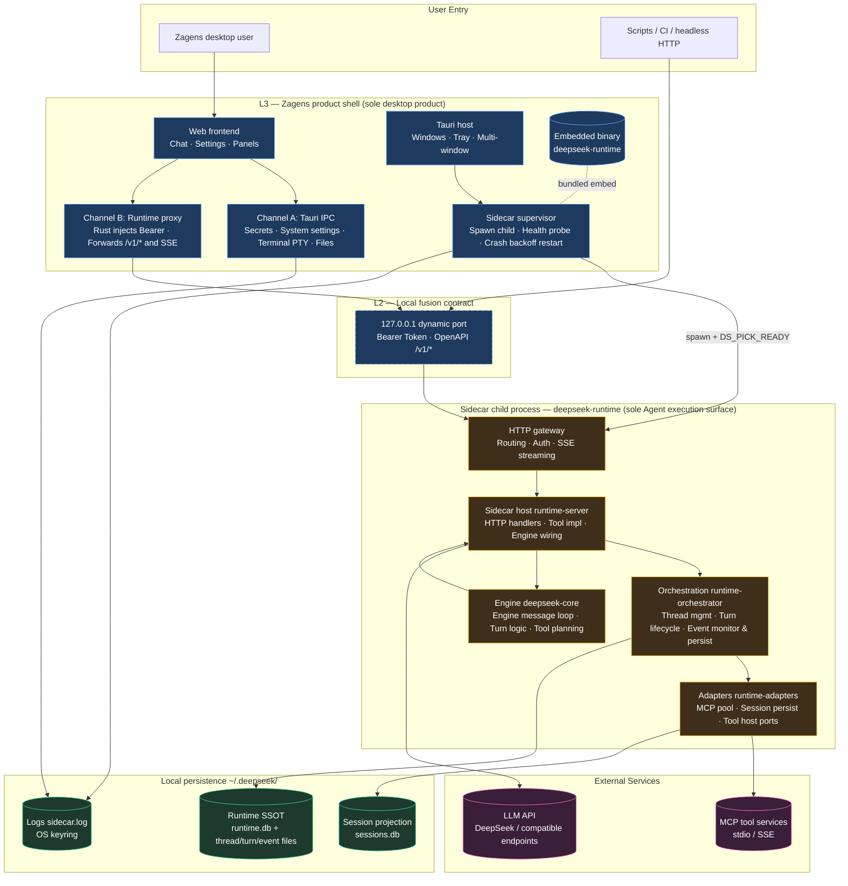
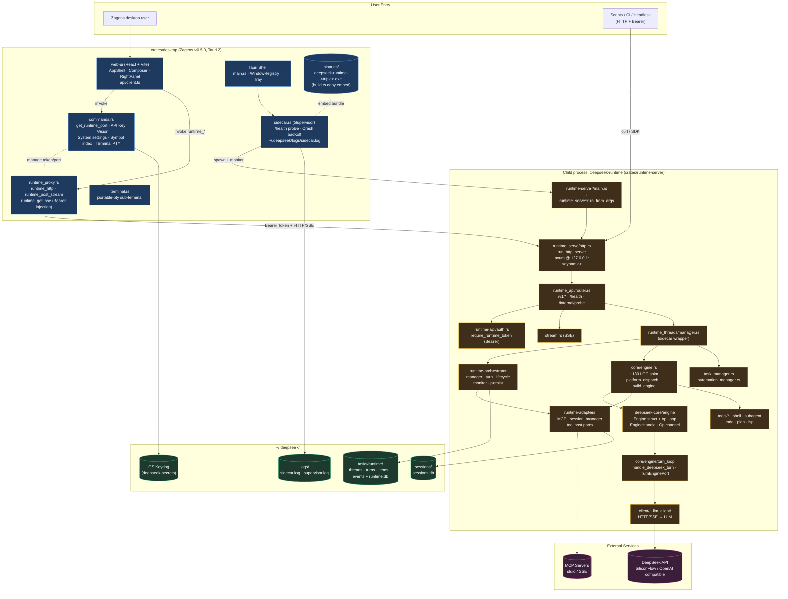
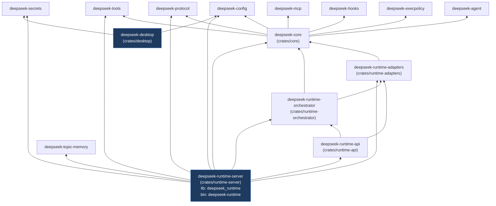
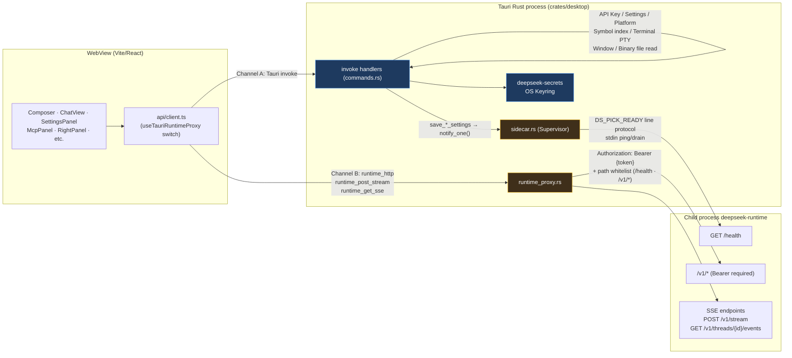
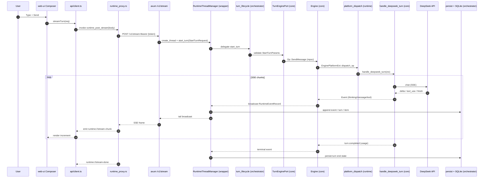

# Runtime Architecture (SSOT Diagrams)

> **Narrative & scheduling:** [RUNTIME_EVOLUTION_ROADMAP.md](./RUNTIME_EVOLUTION_ROADMAP.md) (**v2.0-final**; gates **A → A+ → P2 → F** closed; **§3 current snapshot**)  
> **HTTP / IPC contract:** [API_DESIGN.md](./API_DESIGN.md)  
> **Architecture assessment / finalization:** [adr/ARCHITECTURE_ASSESSMENT_2026-05-25.md](./adr/ARCHITECTURE_ASSESSMENT_2026-05-25.md) (**§1 = 10/10 architecture finalized**)  
> **Architecture freeze (execution deadline):** [adr/D17_ARCHITECTURE_FREEZE.md](./adr/D17_ARCHITECTURE_FREEZE.md) — **Architecture Freeze v1** (2026-05-27)  
> **Architecture boundary analysis:** [ARCHITECTURE_BOUNDARY_ANALYSIS.md](./ARCHITECTURE_BOUNDARY_ANALYSIS.md) — channel count, hard/soft limits, scenario evaluation  
> **OpenAPI / TS types:** [openapi/zagens-runtime-v1.openapi.json](./openapi/zagens-runtime-v1.openapi.json) · [adr/D8_OPENAPI_TS_GENERATION.md](./adr/D8_OPENAPI_TS_GENERATION.md)  
> **Post-implementation snapshot:** [adr/IMPLEMENTATION_SUMMARY_2026-05-24.md](./adr/IMPLEMENTATION_SUMMARY_2026-05-24.md)  
> **D6 Phase B:** [adr/D6_PHASE_B_CLI_SUNSET.md](./adr/D6_PHASE_B_CLI_SUNSET.md) — production binary is **`deepseek-runtime`**; CLI + ratatui TUI removed  
> **D16 maintainability split:** [adr/D16_PHASE_E_MAINTAINABILITY.md](./adr/D16_PHASE_E_MAINTAINABILITY.md) — **Closed (Checkpoint)**  
> **Last updated:** 2026-05-27 (aligned with **D16 Checkpoint + D17 Freeze** code: `runtime-api` / `runtime-orchestrator` / `runtime-adapters` three-crate skeleton + `runtime-server` HTTP host)

> **How to read this document:** §1 is the **top-level system overview** (§1.1 conceptual diagram + §1.2 code-path detail diagram); §2 is **Sidecar internal data flow** (HTTP → Manager → Engine → turn_loop, including orchestrator core); §5 is **L2 dual-channel** (Tauri IPC vs Runtime HTTP/SSE); §8 is a **typical send-message sequence diagram**. Remaining sections are side notes (crate deps, persistence, supervision, module index). All source file paths on diagram nodes can be verified directly against the code.

---

## 0. Three-Layer Model (Fused but Not Merged)

| Layer | Repo location | Responsibility |
|-------|---------------|----------------|
| **L1 bottom — core** | `deepseek-core` (`Engine` struct, `op_loop`, `turn_loop`, Session, `TurnEnginePort`) | Agent turn logic; **no** HTTP / MCP / tool host |
| **L1 bottom — orchestrator** | `deepseek-runtime-orchestrator` (`RuntimeThreadManager` core, `turn_lifecycle`, `monitor`, `persist`, `thread_store_sqlite`) | Thread/Turn orchestration, event persistence, SQLite thread store |
| **L1 bottom — adapters** | `deepseek-runtime-adapters` (MCP, `persist/session_manager`, snapshot, tool host ports and pure helpers) | Platform adapters; re-exported via `runtime-server` to keep `crate::` paths stable |
| **L1 bottom — sidecar host** | **`deepseek_runtime` lib** (`crates/runtime-server`: `runtime_api` handlers, `runtime_serve`, tools/*, Engine shim, `platform_dispatch`) | HTTP gateway + tool/MCP/LSP host + orchestrator/adapters assembly; **~100k LOC, accepted as sidecar monolith per D17** |
| **L1 production binary** | **`deepseek-runtime`** (`crates/runtime-server` bin) — **no** ratatui / CLI | Zagens embeds sidecar; see [D6_RUNTIME_SERVER.md](./adr/D6_RUNTIME_SERVER.md) |
| **L2 contract** | `runtime-api` (OpenAPI / wire / auth), `runtime_proxy`, Tauri IPC (`commands.rs`) | Desktop **fusion surface**; Bearer never enters WebView |
| **L3 shell** | **Zagens** `crates/desktop` (sole user product) | Consumes L2 only; **does not** embed L1 |

**Hard constraint:** Agent turns execute only inside the sidecar; **production binary is `deepseek-runtime`** (Zagens `externalBin`). ~~`app-server`~~ deleted in D7 C5; ~~`crates/cli`~~, ~~ratatui TUI~~ deleted in D6 Phase B. Desktop **must not** path-depend on `core` / `runtime-server` (see [`architecture_boundary.rs`](../../crates/desktop/tests/architecture_boundary.rs)).

---

## 1. System Overview

### 1.1 Conceptual Diagram (Three Layers + Sidecar Stack)

> For quick understanding: **who sits on which layer, where data flows**. Crate / source file paths in §1.2.



**Reading the diagram:**

| Color | Meaning |
|-------|---------|
| Blue | Zagens desktop product (L3) |
| Blue dashed box | L2 contract (localhost HTTP + Bearer; Bearer **does not enter** WebView) |
| Orange | Sidecar child process (L1 execution surface; turns **run only here**) |
| Purple | External network services |
| Green | Local disk / keyring |

**One-line data flow:** User → Web UI → (Channel B) Runtime proxy → Sidecar HTTP gateway → orchestration layer starts turn → engine layer calls LLM / tools → events return to UI via SSE, persisted to `runtime.db`; desktop sidebar sessions are `sessions.db` projections linked via `runtime_thread_id` to runtime SSOT.

---

### 1.2 Code-Path Detail Diagram (Repo Cross-Reference)



**Legend:** Blue = Zagens product shell; Orange = embedded sidecar (independent process, three-crate stack); Purple = external services; Green = local persistence. Solid = data/control flow; dashed = weak association (token management, binary embed, handshake).

**Key code references (by node):**

| Node | File | Notes |
|------|------|-------|
| Dynamic port + Bearer Token UUID | [`crates/desktop/src/main.rs`](../../crates/desktop/src/main.rs) | `tokio::sync::watch::channel::<u16>` init 0; supervisor publishes after parsing `DS_PICK_READY.port`; suggested initial port 7878; `uuid::Uuid::new_v4()` new token each start, injected only into sidecar child env |
| Sidecar binary embed | [`crates/desktop/build.rs`](../../crates/desktop/build.rs) | Build-time copy to `binaries/deepseek-runtime-<triple>(.exe)`, Tauri `externalBin` |
| Sidecar entry | [`crates/runtime-server/src/main.rs`](../../crates/runtime-server/src/main.rs) → [`runtime_serve/http.rs`](../../crates/runtime-server/src/runtime_serve/http.rs) | `deepseek-runtime --host … --port …` (no `serve` subcommand) |
| Tauri IPC handlers | [`crates/desktop/src/commands.rs`](../../crates/desktop/src/commands.rs) | Keys/settings/platform/symbol index/export etc. 30+ commands |
| HTTP proxy (Bearer injection) | [`crates/desktop/src/runtime_proxy.rs`](../../crates/desktop/src/runtime_proxy.rs) | `runtime_http` / `runtime_post_stream` / `runtime_get_sse` + path whitelist |
| Sidecar supervision | [`crates/desktop/src/sidecar.rs`](../../crates/desktop/src/sidecar.rs) | spawn **`deepseek-runtime`**; `DS_PICK_READY` line protocol; no `deepseek-tui` binary branch; HTTP probe fallback when old sidecar lacks ready line |
| HTTP entry (lib) | [`crates/runtime-server/src/runtime_serve/http.rs`](../../crates/runtime-server/src/runtime_serve/http.rs) | `deepseek_runtime::run_http_server` / `RuntimeApiOptions` (crate root re-export) |
| OpenAPI / shared wire types | [`crates/runtime-api/`](../../crates/runtime-api/) | `compose_router`, `ApiError`, OpenAPI `paths`/`schemas` (incl. [`task.rs`](../../crates/runtime-api/src/task.rs)); handlers remain in `runtime-server` |
| Route table | [`crates/runtime-server/src/runtime_api/router.rs`](../../crates/runtime-server/src/runtime_api/router.rs) | All `/v1/*` routes centrally registered; `/health` `/internal/probe` skip auth |
| Thread management (wrapper → core) | [`crates/runtime-server/src/runtime_threads/manager.rs`](../../crates/runtime-server/src/runtime_threads/manager.rs) → [`orchestrator/.../manager.rs`](../../crates/runtime-orchestrator/src/runtime_threads/manager.rs) | Sidecar injects policy/engine; core logic in orchestrator |
| Engine struct + op loop | [`crates/core/src/engine/runtime.rs`](../../crates/core/src/engine/runtime.rs) + [`op_loop.rs`](../../crates/core/src/engine/op_loop.rs) | M7/M8: `Engine::with_hosts` / `Engine::run()` in core |
| Runtime Engine shim | [`crates/runtime-server/src/core/engine.rs`](../../crates/runtime-server/src/core/engine.rs) | ~130 LOC newtype + `build_engine` + `platform_dispatch` |
| turn_loop | [`crates/core/src/engine/turn_loop/mod.rs`](../../crates/core/src/engine/turn_loop/mod.rs) | `handle_deepseek_turn` / `TurnEnginePort` / `Session` |
| Session persistence | [`crates/runtime-adapters/src/persist/session_manager.rs`](../../crates/runtime-adapters/src/persist/session_manager.rs) | Re-exported via `runtime-server` lib as `crate::session_manager` |
| Web client | [`crates/desktop/web-ui/src/api/client.ts`](../../crates/desktop/web-ui/src/api/client.ts) | `useTauriRuntimeProxy`; D10 `filterThreadStreamEvents`; D9 `turnControl.ts` |

**Version line:** runtime workspace **0.8.15** (Rust 1.88+); Zagens desktop **0.5.0** (independent SemVer).  
**~~CLI / TUI~~ removed (D6 Phase B):** ~~`crates/cli`~~, ~~`crates/tui`~~, ~~ratatui TUI~~; headless / CI use HTTP directly against **`deepseek-runtime`**.  
**~~Experimental path~~ removed (D7 C5):** ~~`deepseek app-server`~~ / ~~`crates/app-server`~~ — see [`adr/D4_APPSERVER_DEPRECATED.md`](./adr/D4_APPSERVER_DEPRECATED.md).

---

## 2. Sidecar Internal Data Flow (`deepseek-runtime` / `deepseek_runtime` lib)

```mermaid
flowchart LR
    HTTP["HTTP /v1/* + SSE<br/>(axum, tower-http CORS)"]
    ROUTER["runtime_api/router.rs<br/>+ runtime-api wire/auth"]
    AUTH["require_runtime_token<br/>(runtime-api)"]
    STREAM_H["stream.rs<br/>stream_turn · stream_thread_events"]
    THREADS["threads.rs / sessions.rs / tasks.rs<br/>automations.rs / mcp.rs / skills.rs<br/>blackboards.rs / topic_memory.rs / usage.rs"]

    MGR_W["RuntimeThreadManager<br/>(runtime-server wrapper)"]
    MGR_C["RuntimeThreadManager core<br/>(runtime-orchestrator)"]
    ACTIVE["active.rs (LRU)"]
    LIFE_W["turn_lifecycle.rs (wrapper)"]
    LIFE_C["turn_lifecycle::start_turn<br/>(orchestrator)"]
    MONITOR["monitor.rs + monitor_host.rs<br/>(orchestrator + sidecar host)"]
    PERSIST_M["persist.rs + thread_store_sqlite<br/>(orchestrator)"]
    SESS_M["session_manager<br/>(runtime-adapters/persist)"]
    BCAST(("broadcast::Sender<br/>RuntimeEventRecord"))

    PORT["deepseek_core::engine<br/>TurnEnginePort + StartTurnParams"]
    ENG["core/engine/runtime.rs<br/>Engine + op_loop · EngineHandle"]
    ENG_SHIM["runtime-server/core/engine.rs<br/>platform_dispatch · build_engine"]
    OP_EXT["EnginePlatformExt<br/>(platform_dispatch)"]
    TURN["core/engine/turn_loop<br/>handle_deepseek_turn"]
    LLM_C["client.rs (DeepSeekClient)<br/>llm_client/ SSE"]
    TOOL_REG["tools/* + tool_registry<br/>shell · plan · todo · subagent<br/>lsp · sandbox · skills"]
    MCP_POOL["mcp.rs::McpPool<br/>(adapters, re-export)"]

    HTTP --> ROUTER
    ROUTER --> AUTH
    ROUTER --> STREAM_H
    ROUTER --> THREADS

    STREAM_H --> MGR_W
    THREADS --> MGR_W
    THREADS --> SESS_M

    MGR_W --> MGR_C
    MGR_C --> ACTIVE
    MGR_C --> LIFE_W
    LIFE_W --> LIFE_C
    MGR_C --> MONITOR
    MGR_C --> PERSIST_M
    MGR_C --> BCAST

    LIFE_C --> PORT
    PORT -- "validate + delegate" --> ENG
    ENG --> ENG_SHIM
    ENG_SHIM --> OP_EXT
    OP_EXT --> TURN
    TURN --> LLM_C
    TURN --> TOOL_REG
    TOOL_REG --> MCP_POOL

    MONITOR --> BCAST
    BCAST -- "SSE tail" --> STREAM_H
    PERSIST_M -. "runtime.db<br/>~/.deepseek/tasks/runtime/" .- MGR_C
    SESS_M -. "sessions.db<br/>~/.deepseek/sessions/" .- THREADS
```



**Sole production turn path (D17 freeze, non-bypassable):**

```text
HTTP handler
  → RuntimeThreadManager::start_turn (sidecar thin wrapper)
  → runtime-orchestrator::turn_lifecycle::start_turn
  → TurnEnginePort::start_turn (deepseek-core: EngineHandle → Op::SendMessage)
  → runtime-server: EnginePlatformExt::dispatch_op → handle_send_message (host glue)
  → deepseek-core::handle_deepseek_turn (turn / streaming / tool planning & results)
```

**Path summary:** HTTP request → sidecar `RuntimeThreadManager::start_turn` delegates to orchestrator → `TurnEnginePort` (core) validates → sends `Op::SendMessage` to `EngineHandle` (same-process mpsc) → `Engine::run()` (core `op_loop`) dispatches platform ops via `EnginePlatformExt` → runtime `platform_dispatch` wiring → `handle_deepseek_turn` (core) → events via `broadcast` feed both SSE and orchestrator `monitor.rs` persistence.

**Post-finalization split status (D16 Checkpoint + D17 Freeze, 2026-05-27):**

| Component | Location | Notes |
|-----------|----------|-------|
| `Engine` struct, `Engine::run()` op loop, `EngineHandle`, `Op` channel | [`crates/core/src/engine/`](../../crates/core/src/engine/) | M-series M7/M8 ✅ |
| `handle_deepseek_turn`, Session types, `TurnEnginePort` | [`crates/core/src/engine/turn_loop/`](../../crates/core/src/engine/turn_loop/) | core library layer |
| Runtime newtype shim + `build_engine` + `platform_dispatch` | [`crates/runtime-server/src/core/engine.rs`](../../crates/runtime-server/src/core/engine.rs) + submodules | ~130 LOC entry + engine-flow orchestration |
| Production sidecar binary + lib | [`crates/runtime-server/`](../../crates/runtime-server/) | **`deepseek-runtime`** bin + **`deepseek_runtime`** lib — handlers, tools, Engine host |
| Thread/Turn orchestration core | [`crates/runtime-orchestrator/src/runtime_threads/`](../../crates/runtime-orchestrator/src/runtime_threads/) | manager, turn_lifecycle, monitor, persist, thread_store_sqlite |
| Sidecar thin wrapper | [`crates/runtime-server/src/runtime_threads/`](../../crates/runtime-server/src/runtime_threads/) | manager/turn_lifecycle/monitor_host/engine_spawn inject policy and engine |
| MCP / Session / tool host ports | [`crates/runtime-adapters/`](../../crates/runtime-adapters/) | Re-exported via `runtime-server` lib; **tools/* package remains in runtime-server** (E1 phase 2 paused) |
| HTTP contract / OpenAPI | [`crates/runtime-api/`](../../crates/runtime-api/) | auth/health/cors, task wire, OpenAPI SSOT |
| HTTP route handlers | [`crates/runtime-server/src/runtime_api/`](../../crates/runtime-server/src/runtime_api/) | `router.rs` registers all `/v1/*` |

---

## 3. Workspace Crate Dependencies



| Crate | Path | Role |
|-------|------|------|
| **deepseek-desktop** | `crates/desktop/` | Zagens Tauri shell; **only** depends on `config` + `secrets` + Tauri/reqwest/portable-pty |
| **deepseek-runtime-server** | `crates/runtime-server/` | Production sidecar **lib + bin**: HTTP handlers, tools/*, Engine shim, orchestrator/adapters assembly |
| **deepseek-runtime-api** | `crates/runtime-api/` | HTTP contract layer: OpenAPI export, `ApiError`, auth/health/cors, shared wire types (incl. task) |
| **deepseek-runtime-orchestrator** | `crates/runtime-orchestrator/` | Turn orchestration core: `RuntimeThreadManager`, `turn_lifecycle`, `monitor`, `persist`, `thread_store_sqlite` |
| **deepseek-runtime-adapters** | `crates/runtime-adapters/` | Platform adapters: MCP, persist/session, snapshot, tool host ports and pure helpers |
| **deepseek-core** | `crates/core/` | `Engine` + `op_loop` + `turn_loop` / Session / `TurnEnginePort` / tool catalog |
| ~~**deepseek-app-server**~~ | — | **Deleted** (D7 C5); see [D4_APPSERVER_DEPRECATED.md](./adr/D4_APPSERVER_DEPRECATED.md) |
| ~~**deepseek-tui** / ~~**deepseek CLI**~~ | — | **Deleted** (D6 Phase B); see [D6_PHASE_B_CLI_SUNSET.md](./adr/D6_PHASE_B_CLI_SUNSET.md) |
| ~~**deepseek-state**~~ | — | **Deleted** (D15); see [D15_FINAL_ARCHITECTURE_CONVERGENCE.md](./adr/D15_FINAL_ARCHITECTURE_CONVERGENCE.md) |
| **deepseek-topic-memory** | `crates/topic-memory/` | B2 topic memory + `/v1/topic-memory` |

**Key facts (verified against each `Cargo.toml`):**

- `deepseek-desktop` **only** depends on `deepseek-config` + `deepseek-secrets` (plus Tauri/reqwest/portable-pty/sha2/dirs), **does not** directly depend on `core`, `runtime-server`, `runtime-api`, etc. — all Agent capabilities come via embedded **`deepseek-runtime`** child process + HTTP/IPC ([`architecture_boundary.rs`](../../crates/desktop/tests/architecture_boundary.rs)).
- Sidecar stack is **four crates cooperating**: `runtime-server` (host) → `runtime-api` + `runtime-orchestrator` + `runtime-adapters` → `deepseek-core`.
- `runtime-orchestrator` depends on `runtime-adapters` and `deepseek-core`; `runtime-api` depends on orchestrator + adapters (shared wire types and router assembly).
- `deepseek-runtime-server` has **no** ratatui/crossterm (D6 Phase B ✅).
- `deepseek_runtime` lib exposes HTTP assembly entry: `run_http_server` / `RuntimeApiOptions` (crate root re-export; impl in `runtime_serve/http.rs`).
- `Engine` struct + `Engine::run()` in core; runtime keeps ~130 LOC shim + tool/MCP/LSP host implementation.
- **`runtime-server` lib ~100k LOC, `client.ts` monolith** — accepted per D17, no longer an architecture KPI.

---

## 4. Persistence (D7 ✅)

Production sidecar uses dual SQLite for **Sessions** and **Runtime threads**, linked by `runtime_thread_id`; full paths, env vars, and HTTP read/write table in **[PERSISTENCE.md](./PERSISTENCE.md)** (D7 SSOT).

| Track | Semantics | Code | Default directory |
|-------|-----------|------|-------------------|
| **Sessions** | Desktop sidebar sessions, message snapshots, `runtime_thread_id` | [`runtime-adapters/src/persist/session_manager.rs`](../../crates/runtime-adapters/src/persist/session_manager.rs) + [`session_store_sqlite.rs`](../../crates/runtime-adapters/src/persist/session_store_sqlite.rs) (re-exported via `runtime-server`) | `~/.deepseek/sessions/` (`sessions.db`) |
| **Runtime threads** | HTTP `/v1/threads/*`, turns, events, SSE | [`runtime-orchestrator/src/runtime_threads/persist.rs`](../../crates/runtime-orchestrator/src/runtime_threads/persist.rs) + [`thread_store_sqlite.rs`](../../crates/runtime-orchestrator/src/thread_store_sqlite.rs) | `~/.deepseek/tasks/runtime/` (`runtime.db`; `DEEPSEEK_RUNTIME_DIR` / `DEEPSEEK_TASKS_DIR`) |

**Runtime data layout** (schema v2): `threads/`, `turns/`, `items/`, `events/` + `runtime.db` SQLite; routing rules `routing_rules.json`.

---

## 5. L2 Contract: Dual Channel

Zagens WebView accesses the runtime via **two channels** (see [API_DESIGN.md](./API_DESIGN.md)):



| Channel | Mechanism | Typical use | Code reference |
|---------|-----------|-------------|----------------|
| **A — Tauri IPC** | `invoke()` → `#[tauri::command]` | Port/token, secrets, settings, symbol index, platform/system/terminal PTY, binary file read, sidecar restart, multi-window | [`crates/desktop/src/commands.rs`](../../crates/desktop/src/commands.rs), [`window_registry.rs`](../../crates/desktop/src/window_registry.rs), [`terminal.rs`](../../crates/desktop/src/terminal.rs) |
| **B — Runtime HTTP/SSE** | `runtime_proxy.rs` forward + Bearer injection | Chat, threads, SSE, MCP, tasks, usage, automations, skills | [`crates/desktop/src/runtime_proxy.rs`](../../crates/desktop/src/runtime_proxy.rs); client [`web-ui/src/api/client.ts`](../../crates/desktop/web-ui/src/api/client.ts) · [`turnControl.ts`](../../crates/desktop/web-ui/src/api/turnControl.ts) |

**Security constraints (H06) + desktop UX (D9/D10):**

- `runtime_http` / `runtime_get_sse` / `runtime_post_stream` all inject `Authorization: Bearer {token}` on the Rust side; **token does not enter** WebView storage / DevTools.
- Path whitelist ([`runtime_proxy::validate_runtime_path`](../../crates/desktop/src/runtime_proxy.rs)): only `/health` and `/v1/*` allowed; rejects `..` and non-`/v1` prefixes.
- **Cancel/interrupt two layers (D9):** upper `runtime_cancel_sse` (`SSE_CANCEL_FLAGS` per `window.label()`; disconnects WebView ↔ sidecar SSE); lower `POST /v1/threads/{id}/turns/{turn_id}/interrupt` (actually cancels turn, sends `Op::Interrupt`). UI unified via `turnControl.ts`.
- **Cross-window SSE filtering (D10):** `filterThreadStreamEvents` filters by thread owner to avoid multi-window "ghost rendering".
- Config changes ⇒ restart sidecar: `AppContext::sidecar_restart: Arc<Notify>`, after writing keys/settings `notify_one()`, listened by `sidecar::start_and_monitor` with `RESTART_DEBOUNCE_MS` debounce.
- Handshake protocol: sidecar writes `DS_PICK_READY {...}` to stdout on start (includes `port`, `pid`, `token_fp`, `version`); supervisor uses this for readiness; runtime heartbeat/graceful exit via stdin `op: ping | drain`.

Inside sidecar, **`Op::SendMessage` is same-process mpsc** (not HTTP); see §8 sequence diagram.

---

## 6. Zagens Sidecar Supervision

`crates/desktop/src/sidecar.rs` spawns the embedded binary:

```text
deepseek-runtime --host 127.0.0.1 --port {port}
  --cors-origin http(s)://tauri.localhost
Environment variables:
  DEEPSEEK_RUNTIME_TOKEN=<UUID from main.rs>
  DEEPSEEK_CLIENT_SURFACE=zagens
  DEEPSEEK_API_KEY=<OS keyring>
  DEEPSEEK_BUNDLED_PYTHON=<Office tools, optional>
```

**Spawn candidate:** only **`deepseek-runtime`** (Tauri `externalBin` embeds `deepseek-runtime-<triple>`). If sidecar does not emit `DS_PICK_READY`, supervisor falls back to HTTP probe (`/health` + token validation), compatible with legacy sidecar behavior; **no longer** spawns legacy `deepseek-tui` binary.

Supervision capabilities: `/health` probe, crash backoff, rapid restart limit, logs `~/.deepseek/logs/sidecar.log` + `supervisor.log`.

---

## 7. ~~CLI Subcommand Routing~~ (Removed, D6 Phase B)

~~`crates/cli` (`deepseek` dispatcher) and ratatui TUI~~ removed 2026-05-26. Headless / CI / developers should use HTTP `/v1/*` + Bearer directly against **`deepseek-runtime`**, or via Zagens Desktop Tauri proxy. See [D6_PHASE_B_CLI_SUNSET.md](./adr/D6_PHASE_B_CLI_SUNSET.md).

---

## 8. Typical Desktop Send-Message Sequence



**Key points (two commonly confused areas):**

- **`Op::SendMessage` is same-process mpsc**, not HTTP; Engine background task holds `rx_op` long-term and sends events to `tx_event`. Orchestrator `RuntimeThreadManager` uses `tokio::sync::broadcast` to feed events **both** to SSE handlers and `monitor.rs` persistence.
- **Cancel/interrupt has two layers:** upper `runtime_cancel_sse` (only disconnects WebView ↔ sidecar SSE); lower `POST /v1/threads/{id}/turns/{turn_id}/interrupt` (actually cancels turn loop, sends `Op::Interrupt`, triggers `CancellationToken`). After upper-layer disconnect, turn still runs; only lower layer stops LLM/tool calls.

---

## 9. Key Module Index

| Concern | Path |
|---------|------|
| Tauri main entry / token UUID / port 7878 | [`crates/desktop/src/main.rs`](../../crates/desktop/src/main.rs) |
| Sidecar spawn / supervisor / backoff | [`crates/desktop/src/sidecar.rs`](../../crates/desktop/src/sidecar.rs) |
| Tauri IPC handlers (Channel A) | [`crates/desktop/src/commands.rs`](../../crates/desktop/src/commands.rs) |
| Runtime HTTP/SSE proxy (Channel B) | [`crates/desktop/src/runtime_proxy.rs`](../../crates/desktop/src/runtime_proxy.rs) |
| Multi-window registration | [`crates/desktop/src/window_registry.rs`](../../crates/desktop/src/window_registry.rs) |
| Terminal PTY | [`crates/desktop/src/terminal.rs`](../../crates/desktop/src/terminal.rs) |
| Sidecar binary embed | [`crates/desktop/build.rs`](../../crates/desktop/build.rs) |
| Desktop architecture boundary test (D17 I1) | [`crates/desktop/tests/architecture_boundary.rs`](../../crates/desktop/tests/architecture_boundary.rs) |
| Sidecar entry / `deepseek-runtime` | [`crates/runtime-server/src/main.rs`](../../crates/runtime-server/src/main.rs) · [`runtime_serve/http.rs`](../../crates/runtime-server/src/runtime_serve/http.rs) |
| Lib re-export (adapters / orchestrator / HTTP entry) | [`crates/runtime-server/src/lib.rs`](../../crates/runtime-server/src/lib.rs) |
| HTTP route table + Bearer middleware | [`crates/runtime-server/src/runtime_api/router.rs`](../../crates/runtime-server/src/runtime_api/router.rs) + [`crates/runtime-api/src/auth.rs`](../../crates/runtime-api/src/auth.rs) |
| SSE handlers | [`crates/runtime-server/src/runtime_api/stream.rs`](../../crates/runtime-server/src/runtime_api/stream.rs) |
| HTTP server assembly | [`crates/runtime-server/src/runtime_serve/http.rs`](../../crates/runtime-server/src/runtime_serve/http.rs) · handler wiring [`runtime_api/mod.rs`](../../crates/runtime-server/src/runtime_api/mod.rs) |
| OpenAPI export / task wire types | [`crates/runtime-api/src/openapi/`](../../crates/runtime-api/src/openapi/) · [`task.rs`](../../crates/runtime-api/src/task.rs) |
| Orchestrator core (manager / turn_lifecycle / monitor / persist) | [`crates/runtime-orchestrator/src/runtime_threads/`](../../crates/runtime-orchestrator/src/runtime_threads/) |
| Sidecar wrapper (manager / turn_lifecycle / engine_spawn) | [`crates/runtime-server/src/runtime_threads/`](../../crates/runtime-server/src/runtime_threads/) |
| Session persistence | [`crates/runtime-adapters/src/persist/session_manager.rs`](../../crates/runtime-adapters/src/persist/session_manager.rs) |
| MCP / snapshot / tool host ports | [`crates/runtime-adapters/src/`](../../crates/runtime-adapters/src/) |
| Tool host ports / pure tool helpers | [`crates/runtime-adapters/src/tools/`](../../crates/runtime-adapters/src/tools/) |
| Engine struct + op loop (core) | [`crates/core/src/engine/runtime.rs`](../../crates/core/src/engine/runtime.rs) · [`op_loop.rs`](../../crates/core/src/engine/op_loop.rs) |
| Runtime Engine shim + platform dispatch | [`crates/runtime-server/src/core/engine.rs`](../../crates/runtime-server/src/core/engine.rs) · [`platform_dispatch.rs`](../../crates/runtime-server/src/core/engine/platform_dispatch.rs) |
| Turn loop / Port / Session (core) | [`crates/core/src/engine/`](../../crates/core/src/engine/) |
| Web client | [`crates/desktop/web-ui/src/api/client.ts`](../../crates/desktop/web-ui/src/api/client.ts) · [`turnControl.ts`](../../crates/desktop/web-ui/src/api/turnControl.ts) |
| OpenAPI / TS types | [`docs/tech/openapi/zagens-runtime-v1.openapi.json`](./openapi/zagens-runtime-v1.openapi.json) · `export-runtime-openapi` · CI / `./scripts/check-openapi-contract.{sh,ps1}` |
| Architecture freeze local check (D17 F2) | [`scripts/check-architecture-freeze.{sh,ps1}`](../../scripts/check-architecture-freeze.sh) |
| Sidecar contract test (lib / in-proc) | [`crates/runtime-server/src/runtime_api/tests.rs`](../../crates/runtime-server/src/runtime_api/tests.rs) · `sidecar_contract_full_lifecycle` |
| Sidecar contract test (binary / D6 A+) | [`crates/runtime-server/tests/sidecar_binary_contract.rs`](../../crates/runtime-server/tests/sidecar_binary_contract.rs) · CI ubuntu |
| Sidecar architecture invariants | [`crates/runtime-server/tests/architecture_invariants.rs`](../../crates/runtime-server/tests/architecture_invariants.rs) |

---

## 10. Product Positioning & Architecture Stability

Since **2026-05-24** strategic sign-off (maintainer notes, not published):

- **D12 Desktop-only:** Zagens is the sole user product shell; ~~ratatui TUI~~ **deleted** (D6 Phase B, 2026-05-26).
- **Sidecar execution surface:** production binary is **`deepseek-runtime`**; HTTP handlers + tools in **`runtime-server`**; orchestration core in **`runtime-orchestrator`**; MCP/persist in **`runtime-adapters`**; contract in **`runtime-api`**.
- **D6 closed (2026-05-26):** Phase A (no ratatui link) + Phase A+ (binary contract tests) + **Phase B** (delete CLI/TUI, single sidecar binary) — [D6_PHASE_B_CLI_SUNSET.md](./adr/D6_PHASE_B_CLI_SUNSET.md).
- **Architecture finalized (2026-05-26):** [ARCHITECTURE_ASSESSMENT §1 = 10/10](./adr/ARCHITECTURE_ASSESSMENT_2026-05-25.md) — M-series, D6–D8, D7, D1 all closed; **product features can proceed normally**, still must obey Assessment §7.1 red lines (`/v1/*` must have OpenAPI, `desktop` must not link `core`/runtime lib, etc.).
- **D10 unfrozen (2026-05-24):** post-P2 desktop GAP thaw; see [P2_D10_UNFREEZE_RECORD.md](./adr/P2_D10_UNFREEZE_RECORD.md).
- **D15 architecture finale (2026-05-26):** deleted `deepseek-state` and `core::Runtime`; sidecar is only `deepseek-runtime` — [D15_FINAL_ARCHITECTURE_CONVERGENCE.md](./adr/D15_FINAL_ARCHITECTURE_CONVERGENCE.md).
- **D16 maintainability split (Closed Checkpoint, 2026-05-27):** E2/E3/E5 + E1 phase 1 Landed; E1 phase 2 (full tools package migrate to adapters) / E4 **will not execute** — [D16_PHASE_E_MAINTAINABILITY.md](./adr/D16_PHASE_E_MAINTAINABILITY.md).
- **D17 Architecture Freeze v1 (2026-05-27):** refactor mainline closed; turn path frozen; `architecture_boundary` + `check-architecture-freeze` — [D17_ARCHITECTURE_FREEZE.md](./adr/D17_ARCHITECTURE_FREEZE.md).

**Remaining non-blocking debt (post-finalization; requires separate ADR to start):** §6 cold-start profiling; P2 enhancements (D11–D14); Harness vision ([docs/harness/](../../harness/README.md)).
