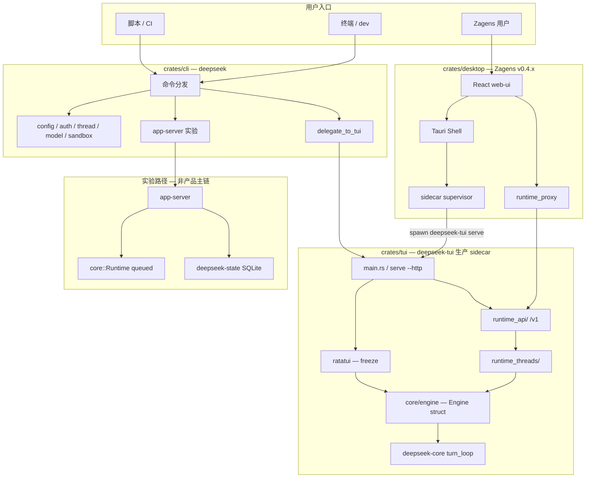
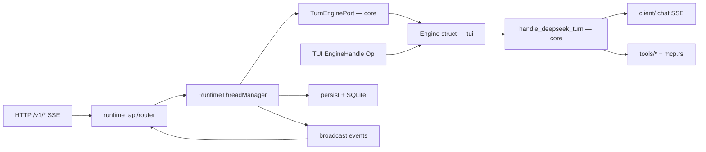
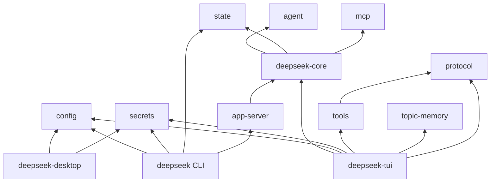

# 运行时架构（SSOT 附图）

> **叙述与排期：** [RUNTIME_EVOLUTION_ROADMAP.md](./RUNTIME_EVOLUTION_ROADMAP.md)（**v2.0-final**；门控 **A → A+ → P2 → F** 已闭合；**§3 现状快照**）  
> **HTTP / IPC 契约：** [API_DESIGN.md](./API_DESIGN.md)  
> **实施后快照：** [adr/IMPLEMENTATION_SUMMARY_2026-05-24.md](./adr/IMPLEMENTATION_SUMMARY_2026-05-24.md)  
> **产品战略：** [../desktop/DEV_NOTES.md](../desktop/DEV_NOTES.md)（D12 Desktop-only）  
> **最后更新：** 2026-05-25（与仓库代码对齐）

---

## 0. 三层模型（融合但不合并）

| 层 | 仓库落点 | 职责 |
|----|----------|------|
| **L1 底层** | `deepseek-core`（turn_loop、Session 类型、策略）+ `deepseek-tui`（Engine struct、工具实现、MCP 池） | Agent turn — **P2 已部分迁入 core**；Engine 整 struct 仍留 tui（见 [BACKLOG_ENGINE_STRUCT_IN_CORE.md](./adr/BACKLOG_ENGINE_STRUCT_IN_CORE.md)） |
| **L2 契约** | `runtime_api/`、`runtime_proxy`、Tauri IPC（`commands.rs`） | 桌面/TUI **融合面**；Bearer 不出 WebView |
| **L3 壳** | **Zagens** `crates/desktop`（唯一用户产品）；`crates/tui/src/tui/` ratatui（**maintenance/freeze**）；CLI `deepseek`（dev/headless） | 只消费 L2，**不**内嵌 L1 |

**硬约束：** Agent turn 只在 sidecar（`deepseek-tui serve --http`）内执行；**不**换 `app-server` 作生产 binary。

---

## 1. 系统总览



**图例：** 实线 = 生产主链；`app-server` = 仅 `deepseek app-server` 子命令；ratatui = 维护态，非用户产品面。

**版本线：** runtime/CLI workspace **0.8.15**（Rust 1.88+）；Zagens desktop **0.4.3**（独立 SemVer）。

---

## 2. 生产路径内部（deepseek-tui）



**P2 拆分现状（2026-05-25）：**

| 组件 | 落点 | 说明 |
|------|------|------|
| `handle_deepseek_turn`、Session 类型、`TurnEnginePort` | `crates/core/src/engine/` | core 库层 |
| `Engine` struct、`EngineHandle`、`Op` 通道、工具/MCP/LSP 宿主 | `crates/tui/src/core/engine/` | tui 薄壳 + 子模块（`engine.rs` ~209 行） |
| HTTP 线程/回合生命周期 | `crates/tui/src/runtime_threads/` | 含 `manager.rs`、`persist.rs`、`monitor.rs` |
| HTTP 路由 | `crates/tui/src/runtime_api/` | `router.rs` 注册全部 `/v1/*` |

---

## 3. Workspace crate 依赖



| Crate | 路径 | 角色 |
|-------|------|------|
| **deepseek-tui** | `crates/tui/` | 生产 sidecar + ratatui |
| **deepseek-desktop** | `crates/desktop/` | Zagens Tauri 壳 |
| **deepseek-tui-cli** | `crates/cli/` | `deepseek` 二进制 |
| **deepseek-core** | `crates/core/` | turn_loop、Session、实验 `Runtime` |
| **deepseek-app-server** | `crates/app-server/` | 实验 HTTP/stdio |
| **deepseek-state** | `crates/state/` | CLI/app-server 线程元数据 SQLite |
| **deepseek-topic-memory** | `crates/topic-memory/` | B2 话题记忆 + `/v1/topic-memory` |
| **deepseek-tui-core** | `crates/tui-core/` | **Legacy**，未接入生产链 |

`deepseek-tui` **已依赖** `deepseek-core`（P2 闭合）；`deepseek-desktop` **不**依赖 core/tui，仅通过 HTTP + 打包 sidecar 二进制（`crates/desktop/build.rs` → `binaries/`）。

---

## 4. 双持久化模型

生产 sidecar 内并存两套语义，勿混用：

| 轨 | 语义 | 代码 | 默认目录 |
|----|------|------|----------|
| **Sessions** | TUI/桌面「会话」列表、标题、恢复 | `session_manager.rs`、`session_store_sqlite.rs` | `~/.deepseek/sessions/` |
| **Runtime threads** | HTTP `/v1/threads/*`、回合、事件、SSE | `runtime_threads/persist.rs`、`thread_store_sqlite.rs` | `~/.deepseek/tasks/runtime/`（`DEEPSEEK_RUNTIME_DIR` 可覆盖） |

**Runtime 数据布局**（schema v2）：`threads/`、`turns/`、`items/`、`events/` + SQLite；路由规则 `routing_rules.json`。

**TUI 异步落盘：** `tui/persistence_actor.rs`；阻塞 I/O 策略见 [A1_PERSIST_BLOCKING_AUDIT.md](./adr/A1_PERSIST_BLOCKING_AUDIT.md)。

**实验轨（并行）：** `deepseek-state` 的 `StateStore` 供 `app-server` / CLI `thread list`，**不是** sidecar 生产持久化。

---

## 5. L2 契约：双通道

Zagens WebView 通过 **两条通道** 访问运行时（详见 [API_DESIGN.md](./API_DESIGN.md)）：

| 通道 | 机制 | 典型用途 |
|------|------|----------|
| **A — Tauri IPC** | `invoke()` → `commands.rs` | 端口/token、密钥、设置、符号索引、sidecar 重启 |
| **B — Runtime HTTP** | `runtime_proxy.rs` 转发 | 对话、线程、SSE、MCP、任务、用量 |

`runtime_proxy`（H06）：`runtime_http`、`runtime_get_sse`、`runtime_post_stream` 在 Rust 侧注入 `Authorization: Bearer {token}`，**不进** WebView storage。实现：`crates/desktop/src/runtime_proxy.rs`；客户端：`crates/desktop/web-ui/src/api/client.ts`。

TUI **同进程**路径：`spawn_engine` → `EngineHandle` → `Op`，不经 HTTP（除非 `--http` sidecar 模式）。

---

## 6. Zagens sidecar 监督

`crates/desktop/src/sidecar.rs` 启动嵌入二进制：

```text
deepseek-tui serve --http --host 127.0.0.1 --port {port}
  --cors-origin http(s)://tauri.localhost
环境变量:
  DEEPSEEK_RUNTIME_TOKEN=<UUID from main.rs>
  DEEPSEEK_CLIENT_SURFACE=zagens
  DEEPSEEK_API_KEY=<OS keyring>
  DEEPSEEK_BUNDLED_PYTHON=<Office 工具，可选>
```

监督能力：`/health` 探测、崩溃退避、rapid restart 限制、日志 `~/.deepseek/logs/sidecar.log` + `supervisor.log`。

---

## 7. CLI 子命令路由

| 类型 | 示例命令 | 路径 |
|------|----------|------|
| 转调 tui | `run`, `exec`, `serve`, `resume`, `sessions`, … | `delegate_to_tui` → **deepseek-tui** 生产链 |
| CLI 内建 | `config`, `thread list`, `model`, `sandbox`, `auth` | workspace 库（含 `deepseek-state`） |
| 实验 | `app-server` | `core::Runtime` + `app-server` |

---

## 8. 典型 Desktop 发消息流

1. `Composer` → `client.ts` → `runtime_post_stream` 或 `/v1/stream`
2. `runtime_api/stream.rs` → `RuntimeThreadManager::start_turn`
3. Manager 经 `deepseek_core::TurnEnginePort` 校验 → `EngineHandle` 发 `Op::SendMessage`
4. `handle_deepseek_turn`（core）→ LLM SSE → 工具 → 事件
5. `monitor.rs` 持久化 turn/item/event
6. SSE 推回 WebView（直接或经 `runtime_get_sse` 代理）

---

## 9. 关键模块索引

| 关注点 | 路径 |
|--------|------|
| Sidecar spawn | `crates/desktop/src/sidecar.rs` |
| Runtime token | `crates/desktop/src/main.rs` |
| HTTP 路由表 | `crates/tui/src/runtime_api/router.rs` |
| 线程管理 | `crates/tui/src/runtime_threads/manager.rs` |
| Engine struct | `crates/tui/src/core/engine.rs` + `core/engine/` |
| Turn loop (core) | `crates/core/src/engine/turn_loop/` |
| Web 客户端 | `crates/desktop/web-ui/src/api/client.ts` |
| CLI 转调 | `crates/cli/src/lib.rs`（`delegate_to_tui`） |
| 实验 Runtime | `crates/core/src/lib.rs` |

---

## 10. 产品定位（架构相关）

自 **2026-05-24** 战略签收（[DEV_NOTES.md](../desktop/DEV_NOTES.md)）：

- **D12 Desktop-only：** Zagens 为唯一用户产品壳；ratatui TUI 进入 **freeze**（维护/回归，不做 parity 新特性）。
- **Sidecar 不变：** `deepseek-tui serve --http` + `runtime_api` + `runtime_threads` 仍是 L1 执行面。
- **D10 已解除（2026-05-24）：** P2 后桌面 GAP 解冻；见 [P2_D10_UNFREEZE_RECORD.md](./adr/P2_D10_UNFREEZE_RECORD.md)。

CLI 保留为 **dev / headless / CI** 入口，与 Zagens 共享同一 sidecar 语义。
