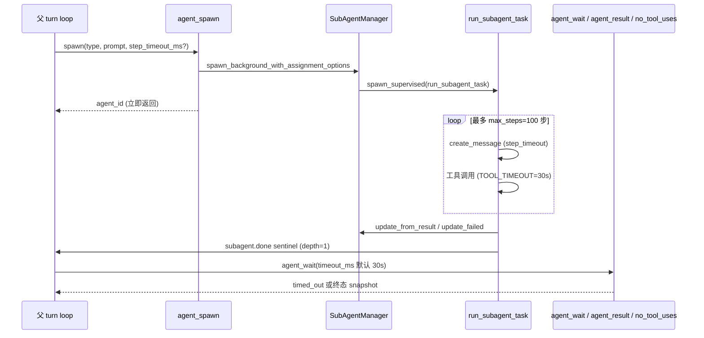
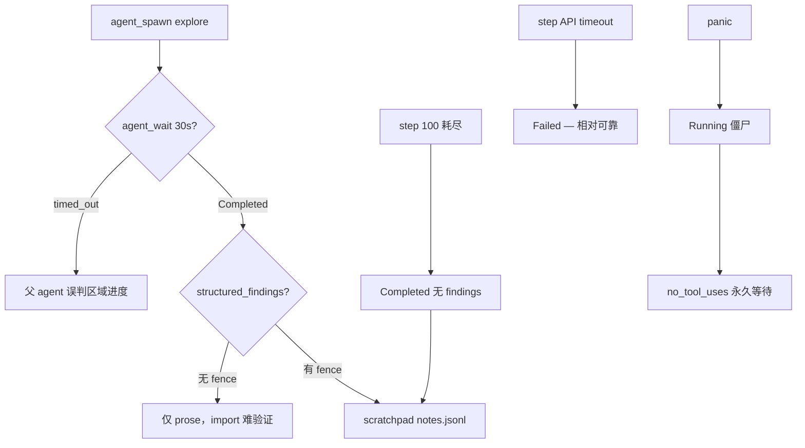
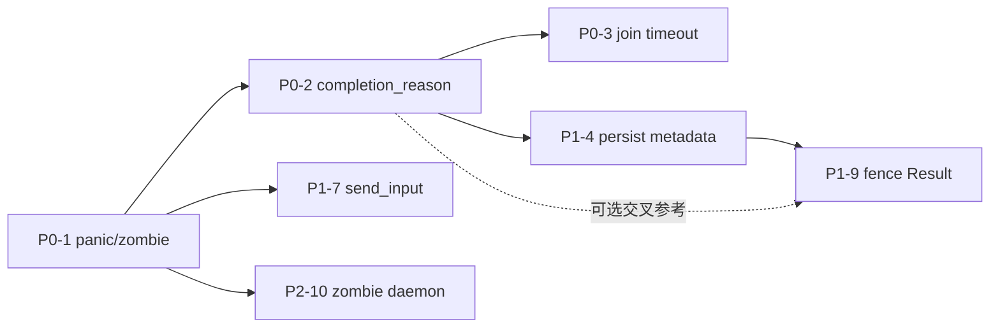

# 子代理稳定性分析

| 字段 | 值 |
|------|-----|
| **日期** | 2026-05-28 |
| **修订** | 2026-05-28（Zagens 评估反馈并入）；2026-05-28（二次审核修订） |
| **范围** | `crates/runtime-server` 子代理管道（spawn → execute → join）及 audit-repo / scratchpad 集成 |
| **状态** | 分析文档；P0/P1 修复项尚未落地 |
| **读者** | runtime 维护者、audit 链路排期 |
| **关联** | [`RUNTIME_ARCHITECTURE.md`](RUNTIME_ARCHITECTURE.md)、[`../desktop/auditor-subagent-design.md`](../desktop/auditor-subagent-design.md)、[`../desktop/audit-scratchpad-design.md`](../desktop/audit-scratchpad-design.md) |

**如何读本文：** §2–§3 架构与超时层叠；§4–§6 Join / 终态 / 持久化；§7 audit 链路；§9 测试缺口；**§9b 六项未覆盖风险**；§10 代码级修复方案；**§11 改进实施步骤**；§15 已知并发限制。代码引用路径均相对仓库根目录。

**代码引用审核（2026-05-28）：** 文档 §3–§6 所列行号与实现逐一核对，**全部准确**；二次审核补充 §11 阶段 3 前置缺口（`SubAgent` 缺 `step_timeout`/`max_steps`）已写入实施步骤。

---

## 1. 摘要

子代理 **Execute 层**（单步 API `step_timeout`、默认 600s、失败显式 `Failed`）近期已加强；主要不稳定源集中在 **Join 层、终态判定与持久化/解析边界**：

| # | 问题 | 典型表现 | 优先级 |
|---|------|----------|--------|
| 1 | Join 默认 **30s** vs Execute 默认 **600s** 不对齐 | 长 audit 中 `agent_wait` 返回 `timed_out`，子 agent 仍 `Running` | P0 |
| 2 | 步数耗尽（`max_steps=100`）无条件标 **`Completed`** | 未完成审计被 scratchpad / 父 agent 当作成功 | P0 |
| 3 | panic 后 manager 状态仍为 **`Running`** | 僵尸 agent；`agent_wait` 永不结束；`no_tool_uses` 可能永久挂起 | P0 |
| 4 | `structured_findings` / `structured_verdict` **不落盘** | 重启或 `resume` 后 verify 链不可靠 | P1 |
| 5–10 | 见 **§9b**（persist / structured 一致性等六项缺口） | 低频但可级联 | P1–P2 |

**最高 ROI 修复方向：** 消除假 Completed、消除假 Running、对齐 wait 与 step 超时、持久化 completion 元数据 + blackboard 引用、补齐 fence 解析诊断。

---

## 2. 架构与生命周期

### 2.1 三阶段管道

| 阶段 | 入口 | 核心实现 |
|------|------|----------|
| **Spawn** | `agent_spawn` | `crates/runtime-server/src/tools/subagent/tools/spawn.rs` → `manager.rs::spawn_background_with_assignment_options` |
| **Execute** | 后台 task | `executor.rs::run_subagent_task` / `run_subagent`（最多 `DEFAULT_MAX_STEPS=100` 步） |
| **Join** | `agent_result` / `agent_wait` / 引擎 `no_tool_uses` | `tools/result.rs`、`tools/wait.rs`、`core/engine/turn_loop/host_impl/no_tool_uses.rs` |

### 2.2 时序（简图）



### 2.3 关键源文件

| 关注点 | 路径 |
|--------|------|
| 执行循环 | `crates/runtime-server/src/tools/subagent/executor.rs` |
| 状态管理 | `crates/runtime-server/src/tools/subagent/manager.rs` |
| 超时常量 | `crates/runtime-server/src/tools/subagent/constants.rs` |
| Spawn 工具 | `crates/runtime-server/src/tools/subagent/tools/spawn.rs` |
| Wait / Result | `crates/runtime-server/src/tools/subagent/tools/wait.rs`、`tools/result.rs` |
| Fence 解析 | `crates/runtime-server/src/tools/subagent/prompts.rs` |
| Panic 监督 | `crates/runtime-server/src/utils.rs::spawn_supervised` |
| 父 turn 等待 | `crates/runtime-server/src/core/engine/turn_loop/host_impl/no_tool_uses.rs` |
| 磁盘状态 | `{workspace}/.deepseek/state/subagents.v1.json`（见 `factory.rs::default_state_path`） |
| Audit skill | `crates/runtime-server/assets/skills/audit-repo/SKILL.md` |

> **路径说明：** 子 agent 状态文件在 **workspace 本地** `.deepseek/state/`；panic crash dump 在 **用户目录** `~/.zagens/crashes/`。勿与 `~/.zagens/config.toml` 混淆。

---

## 3. 超时层叠

系统存在 **五层独立超时/等待**，默认值与失败语义不一致。

| 层 | 常量/参数 | 默认 | 超时/结束行为 | 稳定性影响 |
|----|-----------|------|---------------|------------|
| **工具** | `TOOL_TIMEOUT` | **30s** | 步内 `Error: Tool … timed out`，循环继续 | 单步可多次失败仍算「进行中」 |
| **单步 API** | `step_timeout` / `step_timeout_ms` | **600s**（clamp **120–1800s**） | `Failed` + `step_api_timeout_error` | 正确失败；父 agent 可能已误判进度 |
| **Join 等待** | `agent_wait` / `agent_result` 的 `timeout_ms` | **30s**（clamp 10s–3600s） | `timed_out: true`，子 agent 仍 `Running` | **全库 audit 最易踩坑** |
| **步数上限** | `DEFAULT_MAX_STEPS` | **100** | 循环结束 → 无条件 **`Completed`** | **静默假成功** |
| **父 turn 阻塞** | `no_tool_uses` completion channel | **无 wall-clock 上限** | 等到子 agent 完成、用户 cancel 或 steer | 僵尸 `Running` 可导致 **永久挂起** |

配置权威来源：`crates/runtime-server/src/config/types.rs`（`MIN/MAX/DEFAULT_SUBAGENT_STEP_TIMEOUT_SECS`）。

### 3.1 单步 API 超时（相对可靠）

```394:396:crates/runtime-server/src/tools/subagent/executor.rs
            api = tokio::time::timeout(runtime.step_timeout, runtime.client.create_message(request)) => {
                api.map_err(|_| step_api_timeout_error(runtime.step_timeout.as_secs()))??
            }
```

失败路径会调用 `manager.update_failed`，并生成 failed sentinel。错误文案已引导父 agent 缩小 scope 或提高 `step_timeout_ms`，**不应**仅凭 timeout 将 scratchpad inventory 标为 done。

### 3.2 Join 默认 30s vs Execute 600s+

```24:26:crates/runtime-server/src/tools/subagent/constants.rs
pub(crate) const DEFAULT_RESULT_TIMEOUT_MS: u64 = 30_000;
pub(crate) const MIN_WAIT_TIMEOUT_MS: u64 = 10_000;
pub(crate) const MAX_RESULT_TIMEOUT_MS: u64 = 3_600_000;
```

**典型失稳场景（全库 audit）：** 父 agent 默认 30s `agent_wait` → `timed_out` → 误判区域进度 → 子 agent 后续 step limit 或 API timeout。

audit-repo skill 已要求分档 `step_timeout_ms`（600000–1800000 ms），但 **`agent_wait.timeout_ms` 对称约束较弱**。

### 3.3 步数耗尽 → 静默 Completed

```525:531:crates/runtime-server/src/tools/subagent/executor.rs
    Ok(SubAgentResult {
        agent_id,
        agent_type,
        assignment,
        model: runtime.model.clone(),
        nickname: None,
        status: SubAgentStatus::Completed,
```

| 情况 | 循环行为 | 当前 status |
|------|----------|-------------|
| **natural complete** | 无 tool call 且无 pending input → `break` | `Completed`（合理） |
| **step limit** | 100 步均有 tool call → 循环自然结束 | `Completed`（**应显式区分**） |

### 3.4 工具超时累积效应（定量）

§3 表已列 `TOOL_TIMEOUT=30s` 且步内可多次失败，但未量化对 `step_timeout` 的消耗：

| 单步内重试次数 | 累积工具等待 | 占 step_timeout=600s 比例 |
|----------------|-------------|---------------------------|
| 10 次 | ~300s | 50% |
| 20 次 | ~600s | **100%**（步内时间被工具超时耗尽） |

模型在同一步连续重试慢工具（如大文件 `read_file`）时，可能在 **未触发 step API timeout** 的情况下浪费整步预算。建议见 **§10 P1-6**（per-step 工具总超时预算）。

**边界说明：** 上表假设 **同一步内对同一或同类慢工具连续重试**（每次独立受 `TOOL_TIMEOUT` 约束，串行累积）。若模型在同一步内 **换用不同工具**（如 `read_file` 超时后改 `grep_files`），每次调用仍各计最多 30s，但 **不会** 因换工具而重置整步的 API 等待窗口——`create_message` 的 `step_timeout` 仍覆盖整步（含所有 tool round-trip）。P1-6 的 per-step 工具预算应对 **该步内所有工具调用总和** 设 cap，而非按「同一工具名」单独累计。

---

## 4. 终态与并发边界

### 4.1 Panic → 僵尸 Running（P0）

```223:239:crates/runtime-server/src/utils.rs
        let result = std::panic::AssertUnwindSafe(future).catch_unwind().await;
        if let Err(panic_info) = result {
            ...
            let _ = write_panic_dump(name, location, &msg);
        }
```

`run_subagent_task` 仅在 future **正常返回**时调用 `update_from_result` / `update_failed`；panic 后 **status 仍为 Running**，`task_handle.is_finished()` 已为 true。

| 观测点 | 行为 |
|--------|------|
| `running_count()` | 排除 finished handle → 计数可能正确 |
| `agent_list` / snapshot | status 仍 **Running** |
| `agent_wait` | 可能 **永远等不到终态** |
| `no_tool_uses` | 僵尸可导致 **永久挂起** |

### 4.2 进程重启 → Interrupted（较好）

```142:145:crates/runtime-server/src/tools/subagent/manager.rs
            if matches!(status, SubAgentStatus::Running) {
                status = SubAgentStatus::Interrupted(SUBAGENT_RESTART_REASON.to_string());
            }
```

### 4.3 工具失败不终止任务

```472:482:crates/runtime-server/src/tools/subagent/executor.rs
            let result = match tokio::time::timeout(TOOL_TIMEOUT, async { ... }).await {
                Ok(Ok(output)) => output,
                Ok(Err(e)) => format!("Error: {e}"),
                Err(_) => format!("Error: Tool {tool_name} timed out"),
            };
```

### 4.4 Cancel 传播（较好）

子 agent 使用 `cancel_token`；步间与 API 请求中与 cancel race。父 cancel 可中断子 step。

---

## 5. 父 turn 协调

### 5.1 `no_tool_uses` 无限等待

父模型无 tool call 但有 running 子 agent 时，引擎阻塞等待 completion channel 或 steer。无 wall-clock 上限；僵尸 Running 可永久挂起。

### 5.2 仅 depth=1 唤醒父 turn

```176:177:crates/runtime-server/src/tools/subagent/executor.rs
    if runtime.spawn_depth != 1 {
        return false;
    }
```

### 5.3 完成通知双通道与时序保证

子 agent 结束时（`run_subagent_task` 内 **严格顺序**）：

1. `manager.update_from_result` / `update_failed`（内存 + `persist_state`）
2. `write_blackboard_partition`（若有 `task_id`）
3. 构建 `<deepseek:subagent.done>` sentinel（含 structured 若解析成功）
4. `MailboxMessage::Completed` / `Failed`
5. `emit_parent_completion` → `SubAgentCompletion`（depth=1）
6. `Event::AgentComplete`

**时序保证：** sentinel 与 `SubAgentCompletion` 均在 **步骤 1 之后** 发送，故父 agent 收到 sentinel 后调用 `agent_result`，`get_result` 读取的内存 snapshot **已含完整 `result` 与 structured 字段**。sentinel 为摘要 + 结构化元数据；完整 prose 仍需 `agent_result`。

**未覆盖风险：** completion channel 与 `running_count` 之间的竞态（§9b 缺口 3）；sentinel 经 mailbox 异步注入，不受该竞态影响，但 `SubAgentCompletion` 可能漏收。

---

## 6. 持久化与 structured 输出

### 6.1 磁盘 schema 不含 structured 字段

```93:106:crates/runtime-server/src/tools/subagent/types.rs
pub(crate) struct PersistedSubAgent {
    ...
    pub(crate) result: Option<String>,
    pub(crate) steps_taken: u32,
    ...
}
```

```168:169:crates/runtime-server/src/tools/subagent/manager.rs
                structured_verdict: None,
                structured_findings: None,
```

### 6.2 resume 不清 structured

```423:428:crates/runtime-server/src/tools/subagent/manager.rs
            agent.status = SubAgentStatus::Running;
            agent.result = None;
            agent.steps_taken = 0;
            ...
            agent.task_handle = Some(handle);
```

### 6.3 内存路径与双写（单次 session）

`update_from_result` 写入内存 structured 并 `persist_state`（但 persist 不含 structured）。blackboard 分区（CRAFT `task_id` 路径）为 **另一份** structured 副本，见 **§9b 缺口 1**（表现 B）。

---

## 7. audit-repo / scratchpad 链路热点



| 环节 | 当前防护 | 缺口 |
|------|----------|------|
| inventory 分档 timeout | skill + spawn clamp 120–1800s | wait 默认仍 30s |
| findings 硬格式 | `<!-- audit-findings -->` | fence 静默 None；步数耗尽仍 Completed |
| scratchpad verify | notes `status=verified` | 不区分 Completed vs StepLimit |
| 多 run 隔离 | per-thread binding（已修） | agent → area / run_id 映射（§9b 缺口 6） |
| auditor spawn | base.md P3 | 上游 explore 假成功会级联 |

---

## 8. 可观测性与复现

| 症状 | 日志 / 工具信号 | 根因候选 |
|------|-----------------|----------|
| 区域 marked done 但 findings 空 | scratchpad + `agent_result` 无 fence | Join 30s / step limit / fence 解析 None |
| 子 agent UI 一直 Running | `agent_list` Running + task 已结束 | panic 僵尸 |
| 父 turn 长时间无响应 | 「Waiting on N sub-agent(s)…」 | `no_tool_uses` + 僵尸或极慢子 agent |
| 重启后 verify 失败 | `subagents.v1.json` 有 result 无 structured | persist schema 缺口 |
| 同会话第二 run 导入错乱 | notes 写入错误 area | run_id 未校验（§9b 缺口 6） |

**本地排查：** `{workspace}/.deepseek/state/subagents.v1.json` → sidecar 日志 `target: "panic"` → `agent_wait` metadata → transcript sentinel。

---

## 9. 测试覆盖缺口

| 场景 | 现有测试 | 缺口 |
|------|----------|------|
| `agent_wait` timeout | `wait_for_result` 10ms `timed_out` | 无 step_timeout 联动回归 |
| panic → Failed | — | **无** |
| step limit 终态 | — | **无** natural break 区分 |
| persist structured | load/save round-trip | **无** structured / blackboard 引用 |
| resume 清 structured | — | **无** |
| 僵尸检测 | `running_count` 排除 finished handle | **无** agent_list 一致性 |
| fence 解析失败模式 | `parse_structured_findings_reads_fence` | **无** 截断 / 非法 JSON 分级 |
| no_tool_uses 竞态 | — | **无** |
| send_input 僵尸 | schema 测试 | **无** finished handle 拒绝 |
| persist 并发 / crash | — | **无** |

---

## 9b. 未覆盖稳定性风险（六项）

以下缺口在初版文档中未展开；Zagens 二次审核已对照代码确认。**原「缺口 1」与「缺口 6」为同一根因的两个表现**（持久化模型未定义 structured 权威源），合述如下。

### 缺口 1：持久化与 structured 权威源（合述：原缺口 1 + 6）

**共同根因：** manager 内存态、全量 `subagents.v1.json`、blackboard 文件 **三者无统一 SSOT**；structured 数据尤甚。

**表现 A — 全量 persist 与崩溃窗口**

`persist_state` 序列化 **所有** agent 到单一 `subagents.v1.json`：

```82:114:crates/runtime-server/src/tools/subagent/manager.rs
    pub(crate) fn persist_state(&self) -> Result<()> {
        ...
        for agent in self.agents.values() {
            agents.push(PersistedSubAgent { ... });
        }
        ...
        write_json_atomic(path, &payload)
    }
```

`write_json_atomic`（`factory.rs`）为 tmp + rename，单写原子；进程内由 `RwLock` 串行化写入。但 **多 agent 连续完成** 时，若在 agent A persist 后、agent B persist 前进程崩溃，B 的终态可能丢失。

**表现 B — structured 双写不一致**

| 存储 | 写入时机 | 持久化 |
|------|----------|--------|
| `manager.agent.structured_*` | `update_from_result` | 否（persist 不含） |
| blackboard `{task_id}.json` | `write_blackboard_partition` | 是 |

内存更新成功但 blackboard 写入失败（磁盘满/权限）→ 崩溃后 **两处皆失**。重启后 scratchpad 已标 done，但 `agent_result` 无 structured → verify 假阴性。

**统一建议（P1-4 + P2-11）：**

1. **不**将 structured JSON 嵌入 `subagents.v1.json`（体积）；persist 仅存 `completion_reason` + `blackboard_task_id` 引用
2. blackboard 为 structured **authoritative**；`agent_result` 三级 fallback（内存 → blackboard → prose）
3. 长期：per-agent 文件或 append-only journal（P2-11）缩小崩溃窗口

### 缺口 2：`parse_structured_findings` 静默失败链

**现状：** 返回 `Option<T>`，三种路径均映射为 `None`：

| 失败原因 | 后果 |
|----------|------|
| 输出无 `<!-- audit-findings -->` | 无法区分「无发现」与「未按格式输出」 |
| fence 后 JSON 非法 | 同上 |
| 步数耗尽导致 fence 截断 | 部分数据不可恢复 |

```159:161:crates/runtime-server/src/tools/subagent/prompts.rs
pub(crate) fn parse_structured_findings(text: &str) -> Option<StructuredFindings> {
    parse_json_fence_after_marker(text, "<!-- audit-findings -->")
}
```

**建议（P1-9）：** 改为 `Result<T, ParseFailureReason>`（`NoMarker` / `Truncated` / `InvalidJson`），sentinel 携带诊断。与 P0-2 `completion_reason` 可交叉参考（如 `StepLimitReached` + `Truncated` 同现时表示步数截断）。

### 缺口 3：`no_tool_uses` completion channel 竞态

**现状（`no_tool_uses.rs:68–84`）：**

1. `try_recv` drain completion channel
2. 若 `completions.is_empty()`，读 `running_count()`
3. `running == 0` → **不再等待**，直接走后续分支

**时间窗口：** 步骤 1 与 2 之间，最后一个子 agent 可能已完成并 `send` 到 channel，但 drain 未收到；同时 `running_count()` 已为 0 → **漏收 `SubAgentCompletion`**。

**影响：** 估计低频（<1%）；sentinel 经 mailbox 仍可见，但若父 turn 提前结束，completion 通知永久丢失。

**建议（P1-8）：** `running_count() == 0` 后 **再次 drain** `rx_subagent_completion`。

### 缺口 4：工具超时累积

见 **§3.4**。建议 **§10 P1-6**。

### 缺口 5：`agent_send_input` 僵尸交互

**现状：** `send_input` 仅检查 `status == Running`，不检查 `task_handle.is_finished()`：

```445:463:crates/runtime-server/src/tools/subagent/manager.rs
    pub fn send_input(&mut self, agent_id: &str, text: String, interrupt: bool) -> Result<()> {
        ...
        if agent.status != SubAgentStatus::Running {
            return Err(...);
        }
        tx.send(SubAgentInput { text, interrupt })?;
```

panic 僵尸：`input_tx` 仍 open，`send` 成功，但 task 已结束 → input **永不被消费**。

**建议（P1-7）：** `task_handle.is_finished()` 时返回 `"Agent task ended (possible panic)"`。

### 缺口 6：多 run scratchpad 的 agent → area 映射

同会话第二 run 使用不同 `run_id` / inventory，但 **agent manager 为会话单例**。若 explore prompt 含旧 `area_id`，`scratchpad_import_agent` 可能 **错误导入新 run**。

**建议：** `agent_spawn` 注入 `run_id` metadata；`scratchpad_import_agent` 校验 run_id 一致。

---

## 10. 修复优先级与实现方案

### 10.1 优先级矩阵

| 级别 | 编号 | 修复项 | 工作量 | 覆盖 |
|------|------|--------|--------|------|
| **P0** | 1a | Panic → Failed（`run_subagent_task` 内层 `catch_unwind`） | 小 ~20 行 | §4.1 |
| **P0** | 1b | Zombie 自动检测（`ensure_consistency`） | 小 ~15 行 | §4.1 |
| **P0** | 2a | `completion_reason` 枚举 + `natural_break` 记录 | 中 ~40 行 | §3.3 |
| **P0** | 2b | sentinel 携带 `completion_reason` | 小 ~10 行 | §3.3 |
| **P0** | 3 | Join 自适应超时 + `timed_out` 进度上下文 | 中 ~50 行 | §3.2 |
| **P1** | 4 | persist `completion_reason` + `blackboard_task_id`（方案 A，不 bump version） | 中 ~60 行 | §9b 缺口 1 |
| **P1** | 5 | resume 清 structured | 极小 ~3 行 | §6.2 |
| **P1** | 6 | per-step 工具总超时预算 | 小 ~20 行 | 缺口 4 |
| **P1** | 7 | `send_input` 僵尸检测 | 极小 ~5 行 | 缺口 5 |
| **P1** | 8 | `no_tool_uses` 双次 drain | 极小 ~5 行 | 缺口 3 |
| **P1** | 9 | `parse_structured_findings` → `Result` | 中 ~40 行 | 缺口 2 |
| **P2** | 10 | 守护任务周期性僵尸扫描 | 小 ~30 行 | 缺口 5 |
| **P2** | 11 | per-agent 独立持久化 | 大 ~120 行 | 缺口 1 |
| **P2** | 12 | depth>1 completion 中继 | 文档/实现 | §5.2 |
| **P2** | 13 | progress 节流 | 小 | §13 |

---

### 10.2 P0-1：Panic → Failed（双层防护）

**层 A — `run_subagent_task` 内层 catch（推荐主路径）：**

`spawn_supervised` 不含 `agent_id`，不宜单独改；在 `executor.rs` 包裹 `run_subagent`：

```rust
let result = std::panic::AssertUnwindSafe(run_subagent(...))
    .catch_unwind()
    .await;

match result {
    Ok(Ok(res)) => manager.update_from_result(&agent_id, res),
    Ok(Err(err)) => manager.update_failed(&agent_id, err.to_string()),
    Err(panic_info) => {
        write_panic_dump(...);
        manager.update_failed(&agent_id, format!("panic: {panic_msg}"));
    }
}
```

**层 B — 兜底 `ensure_consistency`：**

在 `agent_list`、`running_count`、`agent_wait` 入口调用：

```rust
fn ensure_consistency(&mut self) {
    for agent in self.agents.values_mut() {
        if matches!(agent.status, SubAgentStatus::Running)
            && agent.task_handle.as_ref().is_some_and(|h| h.is_finished())
        {
            agent.status = SubAgentStatus::Failed(
                "Zombie: task ended without status update".into(),
            );
            agent.task_handle = None;
        }
    }
}
```

**验收：** panic 后 `agent_list` = Failed；`agent_wait` 可结束；crash dump 仍写入。

---

### 10.3 P0-2：`completion_reason` 显式终态

**推荐：** 不扩展 `SubAgentStatus` enum，增加字段：

```rust
pub enum CompletionReason {
    NaturalBreak,
    StepLimitReached,
    Cancelled,
    StepApiTimeout,
    Panic(String),
}
```

循环内记录 `natural_break: bool`；步数耗尽且非 natural break 时 `completion_reason = StepLimitReached`（status 可仍为 `Completed` 或改为 `Failed`，由产品决定）。

**sentinel 示例：**

```json
{"agent_id":"…","status":"completed","completion_reason":"StepLimitReached","steps":100}
```

**scratchpad 门禁：**

```
can_mark_area_done(agent) :=
    agent.completion_reason == NaturalBreak
    AND (structured_findings.is_some() OR result.contains("no findings"))
```

---

### 10.4 P0-3：Join 自适应超时（方案 C）

不改 `DEFAULT_RESULT_TIMEOUT_MS` 常量；`agent_wait` / `agent_result` 在未传 `timeout_ms` 时：

```rust
let effective_timeout = explicit_timeout_ms.unwrap_or_else(|| {
    let step_ms = agent.step_timeout.as_millis() as u64;
    let remaining = agent.max_steps.saturating_sub(agent.steps_taken);
    (step_ms * remaining as u64).clamp(30_000, 3_600_000)
});
```

**`timed_out` 响应增强：**

```json
{"timed_out": true, "steps_done": 45, "max_steps": 100, "estimated_remaining_ms": 330000}
```

**验收：** 全库 audit 不传 wait timeout 时不出现 30s 假超时。

---

### 10.5 P1-4：持久化（混合方案）

**不**将 structured JSON 嵌入 `subagents.v1.json`（体积风险）：

```rust
pub(crate) struct PersistedSubAgent {
    // ... existing ...
    pub(crate) completion_reason: Option<CompletionReason>,
    pub(crate) blackboard_task_id: Option<String>,
}
```

**`agent_result` 三级 fallback：**

1. 内存 `agent.structured_findings`
2. `load_blackboard_partition(blackboard_task_id)`
3. `parse_structured_findings(result prose)`

**Schema 兼容策略（二次审核明确）：**

| 方案 | 做法 | 推荐 |
|------|------|------|
| **A — 不 bump version** | `completion_reason`、`blackboard_task_id` 均为 `Option` + `#[serde(default)]`；保持 `SUBAGENT_STATE_SCHEMA_VERSION = 1` | **✅ 推荐** |
| **B — bump + migration** | version → 2；`load_state` 对 v1 做显式迁移分支 | 仅当需区分「旧文件」与「新字段语义」时 |

**选 A 的理由：** 缺字段 → `None` 语义已足够（运行中 / 旧 agent / 尚未产生 reason）；**避免** v1 磁盘文件因 version 不匹配被 `load_state` 整体拒绝（当前实现对 `schema_version != SUBAGENT_STATE_SCHEMA_VERSION` 直接 `Err`）。

**不**将 structured JSON  bulk 写入 `subagents.v1.json`（体积风险不变）。

---

### 10.6 P1-5 ~ P1-9（摘要）

| 编号 | 实现要点 |
|------|----------|
| **P1-5** | `resume` 时 `structured_verdict = None; structured_findings = None` |
| **P1-6** | 每步 `step_tool_budget = step_timeout × 0.8`；**该步内所有工具**调用共享预算，`min(TOOL_TIMEOUT, remaining_budget)` | 见 §3.4 边界 |
| **P1-7** | `send_input` 前 `task_handle.is_finished()` → 明确错误 |
| **P1-8** | `no_tool_uses`：`running_count()==0` 后再 `try_recv` 一轮 |
| **P1-9** | `ParseFailureReason` + sentinel 诊断字段 |

---

### 10.7 P2-10 ~ P2-13（摘要）

| 编号 | 实现要点 |
|------|----------|
| **P2-10** | 30s 周期 `spawn_with_zombie_detector` 扫描 finished handle + Running status |
| **P2-11** | per-agent 持久化或 journal |
| **P2-12** | depth>1 completion 冒泡或文档化中继 |
| **P2-13** | 合并同 step `AgentProgress` 事件 |

---

## 11. 改进实施步骤

本节将 §10 方案拆为 **可合并的小 PR 序列**，从 P0 开始。原则：**每步独立可测、可回滚**；类型变更优先落在 `deepseek-core`（`SubAgentResult` / wire 类型），runtime-server 跟进实现。

### 11.0 实施前准备

| 步骤 | 动作 |
|------|------|
| 1 | 基线：`cargo test -p deepseek-runtime-server tools::subagent`（108 项）全绿 |
| 2 | 记录当前 audit 复现路径（可选）：spawn explore → 默认 `agent_wait` → 观察 30s `timed_out` |
| 3 | 在 [CHANGELOG.md](../../CHANGELOG.md) `[Unreleased]` 预留 **Runtime / sub-agent stability** 条目 |

**依赖关系（简图）：**



> **隐含依赖：** P1-9（fence `Result`）与 P0-2 非强制阻塞，但 fence 截断诊断可与 `completion_reason`（如 `StepLimitReached`）交叉引用。

---

### 阶段 1 — P0-1：消除假 Running（PR #1）

**目标：** panic / 异常退出不再留下 `Running` 僵尸；父 turn 不再因此永久挂起。

| 顺序 | 任务 | 主要文件 | 估时 |
|------|------|----------|------|
| 1.1 | `run_subagent_task` 内层 `catch_unwind` 包裹 `run_subagent` | `executor.rs` | 0.5d |
| 1.2 | panic 分支：`write_panic_dump` + `update_failed("panic: …")` | `executor.rs`, `utils.rs` | — |
| 1.3 | `SubAgentManager::ensure_consistency()` | `manager.rs` | 0.25d |
| 1.4 | 在 `list()`、`running_count()`、`get_result()`、`wait_for_result` 读路径入口调用 `ensure_consistency` | `manager.rs`, `executor.rs` | 0.25d |
| 1.5 | 单元测试：模拟 finished handle + Running status → 修正为 Failed | `tests.rs` | 0.25d |

**验收清单：**

- [ ] 注入 panic 的子 agent 在 `agent_list` 中为 `Failed`
- [ ] `agent_wait` 不再对已完成 task 无限 poll
- [ ] `~/.zagens/crashes/` 仍有 dump
- [ ] 现有 108 个 subagent 测试仍绿

**合并门槛：** 仅 runtime-server + 测试；**不**改 OpenAPI / web-ui。

---

### 阶段 2 — P0-2：消除假 Completed（PR #2）

**目标：** 区分 natural complete 与 step limit；sentinel 与 scratchpad 可据此门禁。

| 顺序 | 任务 | 主要文件 | 估时 |
|------|------|----------|------|
| 2.1 | 在 `deepseek-core` 新增 `CompletionReason` enum | `crates/core/src/subagent/types.rs` | 0.25d |
| 2.2 | `SubAgentResult` 增加 `completion_reason: Option<CompletionReason>`（serde 默认 None 兼容旧 wire） | `core`, runtime re-export | 0.25d |
| 2.3 | `run_subagent` 循环：`natural_break` flag；step limit 路径设 `StepLimitReached` | `executor.rs` | 0.5d |
| 2.4 | cancel / API timeout / panic 路径分别设对应 reason | `executor.rs` | 0.25d |
| 2.5 | `subagent_done_sentinel` / failed sentinel 写入 `completion_reason` | `executor.rs` | 0.25d |
| 2.6 | 单元测试：100 步全 tool call → `StepLimitReached`；natural break → `NaturalBreak` | `tests.rs` | 0.5d |

**产品决策（实施前确认）：**

- step limit 时 `SubAgentStatus` 保持 `Completed` **还是** 改为 `Failed`？  
  - 推荐：**status 仍 Completed**，scratchpad 门禁只看 `completion_reason`（破坏性更小）。

**验收清单：**

- [ ] step 100 耗尽 → sentinel 含 `"completion_reason":"StepLimitReached"`
- [ ] natural break → `"completion_reason":"NaturalBreak"`
- [ ] OpenAPI / TS 类型若引用 `SubAgentResult`，同步 regen（见 D8 流程）

---

### 阶段 3 — P0-3：Join 自适应超时（PR #3）

**目标：** 长 audit 在不传 `timeout_ms` 时不被 30s 误伤。

**前置缺口（已验证）：** 自适应公式需 `step_timeout × remaining_steps`，但 wait 路径 **当前不可读**：

| 字段 | 所在位置 | wait 路径可读？ |
|------|----------|----------------|
| `step_timeout` | `SubAgentRuntime`（spawn 时写入） | ❌ 不在 `SubAgent` / snapshot |
| `max_steps` | `SubAgentManager.max_steps` | ❌ 未暴露给 wait |
| `steps_taken` | `SubAgent.steps_taken` | ✅ 已在 snapshot |

因此步骤 3.1 不仅是「暴露」，需在 **`SubAgent` 持久化 spawn 参数**。

| 顺序 | 任务 | 主要文件 | 估时 |
|------|------|----------|------|
| 3.1 | `SubAgent` 增加 `step_timeout: Duration`、`max_steps: u32`；spawn 时从 `SubAgentRuntime` / manager 写入；`snapshot()` / `SubAgentResult` 对外可读 | `runtime.rs`, `manager.rs`, `core/subagent/types.rs` | **0.5d** |
| 3.2 | `AgentWaitTool` / `AgentResultTool`：未传 `timeout_ms` 时用 §10.4 自适应公式 | `tools/wait.rs`, `tools/result.rs` | 0.5d |
| 3.3 | `timed_out` metadata 增加 `steps_done`、`max_steps`、`estimated_remaining_ms` | `wait.rs`, `result.rs` | 0.25d |
| 3.4 | 草稿更新 `audit-repo/SKILL.md` 与 `prompts/base.md`（完整收口见阶段 4） | `assets/skills/`, `prompts/` | 0.25d |
| 3.5 | 测试：mock 慢 agent + 省略 timeout_ms → 不在 30s 误超时 | `tests.rs` | 0.5d |

**验收清单：**

- [ ] 单 agent、600s step、50 步已跑 → 默认 wait ≥ 300000ms 量级
- [ ] 显式 `timeout_ms=30000` 行为不变
- [ ] metadata 含进度字段

---

### 阶段 4 — P0 收口与文档（PR #3 或独立 docs PR）

| 任务 | 说明 |
|------|------|
| 更新本文档文首 **状态** →「P0 已落地（日期）」 | 勾选 §11 阶段 1–3 验收项 |
| CHANGELOG `[Unreleased]` | 三条 P0 用户可见摘要 |
| **`audit-repo/SKILL.md`** | 自适应 `agent_wait` 默认行为；`completion_reason` 语义；scratchpad mark done 门禁（`NaturalBreak` + findings） |
| **`prompts/base.md`** | §3.2 wait 指引：**默认自适应**，显式 `timeout_ms` 仍优先（不再要求「必须显式传 wait timeout」） |
| 可选 smoke | 本地 workspace audit 1 区域 explore → wait → import |

**P0 完成定义：** 阶段 1–3 验收全绿 + 上述 prompt/skill 文档合入 + CI `tools::subagent` + 无新增 clippy warning。

---

### 阶段 5 — P1 第一批：低风险边界修复（PR #4）

**可并行，建议同一 PR（改动小、无 schema 版本）：**

| 编号 | 任务 | 文件 |
|------|------|------|
| P1-5 | resume 清 `structured_*` | `manager.rs` |
| P1-7 | `send_input` 检查 `task_handle.is_finished()` | `manager.rs` |
| P1-8 | `no_tool_uses`：`running_count()==0` 后再 drain completion | `no_tool_uses.rs` |

**验收清单：**

- [ ] **P1-5：** `resume` 后 `structured_findings` / `structured_verdict` 均为 `None`（旧值不残留）
- [ ] **P1-7：** finished `task_handle` + `Running` status → `send_input` 返回明确错误（非 silent success）
- [ ] **P1-8：** 模拟 completion 落在 `running_count()==0` 窗口 → 双次 drain 仍能注入 `SubAgentCompletion`
- [ ] 108 + 3 新测试全绿

---

### 阶段 6 — P1 第二批：数据与解析（PR #5）

**依赖 P0-2（`CompletionReason` 已存在）：**

| 顺序 | 编号 | 任务 | 估时 |
|------|------|------|------|
| 6.1 | P1-6 | per-step 工具总超时预算（该步内所有 tool 共享 cap） | 0.5d |
| 6.2 | P1-9 | `parse_structured_findings` → `Result<_, ParseFailureReason>`；sentinel 诊断 | 1d |
| 6.3 | P1-4 | `PersistedSubAgent` 增字段：`completion_reason` + `blackboard_task_id`（**方案 A：不 bump schema version**） | 1d |
| 6.4 | — | `agent_result` 三级 fallback（内存 → blackboard → prose） | 0.5d |
| 6.5 | — | scratchpad 门禁：`completion_reason == NaturalBreak` + findings 存在 | 0.5d |

**Schema 策略：** 采用 **§10.5 方案 A**——新字段 `Option` + `#[serde(default)]`，**保持** `SUBAGENT_STATE_SCHEMA_VERSION = 1`；勿 bump 至 2（否则现有 v1 文件会被 `load_state` 拒绝）。

**验收清单：**

- [ ] 新完成 agent persist 后磁盘 JSON 含 `completion_reason` / `blackboard_task_id`（若适用）
- [ ] **无** `blackboard_task_id` 键的旧 JSON 行 → load 成功，新字段为 `None`
- [ ] `agent_result` fallback：仅 blackboard 有数据 → 仍返回 structured
- [ ] blackboard 写入失败（测试 mock）→ 内存 + prose 解析仍可服务单次 session
- [ ] fence 截断输出 → `ParseFailureReason::Truncated` + sentinel 含诊断字段

---

### 阶段 7 — P1 第三批：多 run 映射（PR #6）

| 任务 | 说明 |
|------|------|
| 缺口 6 | `agent_spawn` 注入当前 scratchpad `run_id`；`scratchpad_import_agent` 校验 |
| 测试 | 同会话两 run，旧 area_id 不得写入新 run notes |

可与 PR #5 解耦，但 **audit 多 run 场景** 建议 P1 内完成。

---

### 阶段 8 — P2（按需排期）

| 优先级 | 编号 | 建议时机 |
|--------|------|----------|
| 1 | P2-10 僵尸守护任务 | P0-1 上线后观察 1–2 周；若仍有漏网僵尸再加 |
| 2 | P2-13 progress 节流 | UI 压力明显时 |
| 3 | P2-12 depth>1 中继 | 有 nested spawn 产品需求时 |
| 4 | P2-11 per-agent persist | 崩溃丢状态复现频繁时（大改） |

---

### 11.1 总排期参考

| 里程碑 | 内容 | 累计估时 |
|--------|------|----------|
| **M1** | 阶段 1 P0-1 | ~1.5d |
| **M2** | 阶段 2 P0-2 | ~2d |
| **M3** | 阶段 3 P0-3 + 收口 | ~**2d**（3.1 含 SubAgent 字段扩展） |
| **M4** | 阶段 5 P1 第一批 | ~0.5d |
| **M5** | 阶段 6–7 P1 第二、三批 | ~3.5d |
| **P2** | 阶段 8 | 按需 |

> **建议首发范围：** 仅 **M1–M3（P0 全部）** 即可显著改善 audit 挂死与假成功；P1 可在下一 sprint 按 PR #4–#6 分批合入。

---

## 12. 非目标（本文不覆盖）

- 子 agent 模型选型与 prompt 质量
- `max_concurrent` 调度策略优化（仅列于 §13）
- CRAFT / scratchpad 产品 UX
- 跨 workspace 子 agent 迁移
- 历史故障频率统计（无生产 telemetry 基线）

---

## 13. 其他稳定性因素

| 项 | 说明 |
|----|------|
| **max_concurrent（默认 10）** | 全库多区域并行 explore 易撞 cap |
| **resident file lease** | 同文件并行 explore 可能冲突 |
| **COMPLETED_AGENT_RETENTION（1h）** | cleanup 后旧 agent 不可见 |
| **AgentProgress 高频** | 每 tool 两条 progress（P2-13） |
| **session_boot_id** | 过滤 prior-session agent |

---

## 14. 结论

子代理 **Execute 层** 已明显优于 Join / 终态 / 解析层。边界稳定性 **最高 ROI**：

1. 消除 **假 Completed**（`completion_reason`）
2. 消除 **假 Running**（panic + zombie 检测）
3. **自适应 Join 超时**（长 audit）
4. **blackboard 引用 + completion 元数据** 持久化
5. 补齐 **§9b 六项** 低频但级联风险

本文档随 P0/P1 落地更新文首「状态」、§11 验收清单与 [CHANGELOG.md](../../CHANGELOG.md)。

---

## 15. 已知限制与并发语义

本文 **明确不保证** 以下并发性质；实现与测试应据此设预期：

| 主题 | 现状 | 含义 |
|------|------|------|
| **Manager 锁粒度** | `SharedSubAgentManager` = `Arc<RwLock<SubAgentManager>>` | 读路径（`agent_list`）与写路径（`update_from_result`）可并发；长时间读锁可能延迟 persist |
| **persist 模型** | 全量 snapshot + 单文件 atomic rename | 进程内写锁串行化更新；**崩溃窗口** 见 §9b 缺口 1，非 TOCTOU 覆盖写 |
| **completion channel** | unbounded mpsc，`try_recv` + 阻塞 `recv` 混用 | 无背压；竞态见 §9b 缺口 3 |
| **structured 权威源** | 内存 vs blackboard **未定义 SSOT** | 重启后可能分歧，见 §9b 缺口 1 |
| **定量影响** | 无生产故障统计 | 竞态 / 僵尸等标注为 engineering judgment（如 <1%），待 telemetry 验证 |

---

## 附录 A：相关提交（分析时点）

| Commit | 说明 |
|--------|------|
| `97707f3` | structured audit findings 管道 |
| `5d0efad` | scratchpad 隔离、多 run UI、step_timeout 600s |
| `508b665` | 2026-05-28 audit 四条 HIGH 安全修复 |

## 附录 B：术语

| 术语 | 含义 |
|------|------|
| **natural complete** | 某步无 tool call 且无 pending input，循环 break |
| **step limit** | 达到 `max_steps` 仍无 natural break |
| **Join** | 父 agent 通过 `agent_wait` / `agent_result` 或引擎等待子 agent 终态 |
| **sentinel** | `<deepseek:subagent.done>{json}</deepseek:subagent.done>` |
| **僵尸 agent** | `task_handle.is_finished()` 且 `status == Running` |
| **completion_reason** | 提议中的终态原因枚举（§10.3） |
