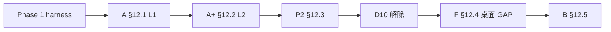

# 运行时演进 — 实施总结（截至 2026-05-25）

> **SSOT 路线图：** [RUNTIME_EVOLUTION_ROADMAP.md](../RUNTIME_EVOLUTION_ROADMAP.md) v2.0-final + §17  
> **受众：** 维护者、新会话 Agent、桌面/TUI 开发  
> **说明：** 本文据 **仓库现状 + ADR/CHANGELOG**，不重复路线图全文；门控以 §1.6 链为准。

---

## 1. 一句话结论

**Phase 1 harness ✅ → A+ / P2 ✅ → D10 ✅ → 阶段 F §12.4 ✅ → B-L1 CRAFT ✅ → B2 记忆地图 MVP ✅（2026-05-25 文档对齐）。**

**门控链已闭合。** 余项：**§12.1 A 全量**（维护者签收 #2/#3、live ToolCell 同构）、**§12.5 #3 GAP 表**（产品 polish）、**Backlog ADR**（Engine 整包入 core 等）。

§12.1 **#2/#3** 已签收 [A2_A3_SIGNOFF.md](./A2_A3_SIGNOFF.md)（2026-05-25）。**全量完成线** 仍为 **🟡**（#1 live ToolCell 同构；不阻塞门控）。

**硬约束未变：** DS Pick = Tauri 壳 + `deepseek-tui` sidecar；Agent turn **不**进 WebView；**不**换 app-server 生产 binary。

---

## 2. 门控链实况（§1.6）



| 门控 | 路线图要求 | **实际状态** | 关键证据 |
|------|------------|--------------|----------|
| Phase 1 | DS Pick harness | **✅** | CHANGELOG Phase 1、多窗口计划 |
| **A §12.1** | L1 五项（长跑、可观测、错误、A4、A5） | **🟡 部分** | #2/#3 ✅ [A2_A3_SIGNOFF.md](./A2_A3_SIGNOFF.md)；#1/#4 ✅；**不阻塞**门控 |
| **A+ §12.2** | 契约 v1、CI 契约测、审批回归 | **✅** | [G2_GATE_ACCEPTANCE.md](./G2_GATE_ACCEPTANCE.md) |
| **P2 §12.3** | turn_loop 在 core；`engine.rs` <300；sidecar 不变 | **✅ L2 终态 + PR6** | [P2_G3_ENGINE_L2_SIGNOFF.md](./P2_G3_ENGINE_L2_SIGNOFF.md)；`engine.rs` ~193 行 |
| **D10** | P2 后解除桌面 freeze | **✅ 已签收** | [P2_D10_UNFREEZE_RECORD.md](./P2_D10_UNFREEZE_RECORD.md) §4 |
| **F §12.4** | F0–F4 + 行为抽样 | **✅**（2026-05-24 手测） | [TUI_DS_PICK_GAP.md](../../desktop/TUI_DS_PICK_GAP.md)、G2 §8–§9 |
| **B §12.5** | CRAFT + 记忆地图 + GAP 表 | **🟡** — **#1/#2 ✅**；**#3 GAP ◐** | G2 §10；B2.1/B2.5/`TopicMemoryPanel` |

---

## 3. 分阶段交付摘要

### 3.1 阶段 0 — 治理

| 项 | 状态 |
|----|------|
| 路线图 v2.0-final、§4.2 D4–D9 签收 | ✅ |
| app-server 冻结、壳运分离文档 | ✅ |
| D10 freeze 规则（§10.6） | ✅ 已解除（见 §4） |

### 3.2 阶段 A — 底层（L1）

| 子项 | 交付要点 | 状态 |
|------|----------|------|
| **A1** 容量/会话 | `context_partition` 热/冷；`large_output_router` + `artifact_refs`；`history_isomorphism`；R-015 RSS ~29 MB + `-Gate`；`events_since_async` | **🟡 MVP+**，§12.1 全勾待签收 |
| **A2** 可观测 | `TurnSummary`、`turn.completed`、tracing span | **✅** §12.1 #2 — [A2_A3_SIGNOFF.md](./A2_A3_SIGNOFF.md) |
| **A3** 错误 | `error_taxonomy`、HTTP wire envelope、36 golden | **✅** §12.1 #3 — 同上；A3.4 边缘 UI → backlog |
| **A4** 模块化 | `runtime_api` 根 `mod.rs` ~100 行 | **✅** |
| **A5** 可测 | `lib` target、mock LLM、回放 fixture 15 步 | **✅**（G2 硬门槛） |
| **A6** 沙箱诚实 | 能力矩阵文档、非 macOS 降级文案 | **✅** |

**债务：** live `ToolCell` 与 `session.messages` 生产级全同构（[A1_PERSIST_BLOCKING_AUDIT.md](./A1_PERSIST_BLOCKING_AUDIT.md) follow-up）。

### 3.3 阶段 A+ — 契约（L2）

| 项 | 状态 |
|----|------|
| `event_schema_version` + `/health` + SSE | ✅ |
| `sidecar_contract_full_lifecycle`（CI） | ✅ |
| A+.7 审批（含多窗口竞态修复） | ✅ 自动化；弹窗手测可复测 |
| A5.5 回放 15 步 | ✅ |

### 3.4 阶段 P2 — Engine→core（绞杀者）

| PR/切片 | 内容 | 状态 |
|---------|------|------|
| PR0 | Spike、[P2_MIGRATION_SPIKE.md](./P2_MIGRATION_SPIKE.md) | ✅ |
| PR1–2 | 类型、`session`、`working_set` 等入 core | ✅ 局部 |
| PR3 | `TurnEnginePort`、`start_turn` 委托 | ✅ |
| PR4 | `handle_deepseek_turn`、`TurnLoopHost`；`engine.rs` 薄壳 | ✅ |
| PR5 | 双 thread 并行测 | ✅ 局部 |
| **PR6a–d** | turn_loop L2 阶段入 core | ✅ [P2_PR6_TURN_LOOP_L2_MIGRATION_PLAN.md](./P2_PR6_TURN_LOOP_L2_MIGRATION_PLAN.md) |
| G3 | L2 终态 ADR 签收 | ✅ 2026-05-23 |

**明确不做（已 ADR）：** 整包 `Engine` struct 进 core；工具实现整体搬迁；换 app-server sidecar。

### 3.5 阶段 F — 桌面融合（D10 后）

| 波次 | 状态 | 备注 |
|------|------|------|
| F0–F4 | **✅** | 路由、xterm、diff、导出、a11y、内联编辑 |
| GAP 表 | **◐** | 定时自动化 UI 暂缓；TUI `/` 深度等 |

### 3.6 阶段 B — 差异化

| 子轨 | 状态 | 证据 |
|------|------|------|
| **B-L1** CRAFT runtime | **✅** | 黑板、角色白名单、`craft.*` SSE；G2 §10 |
| **B-L3** AgentPanel + 记忆地图 UI | **✅** | `AgentPanel`；`TopicMemoryPanel` + `/v1/topic-memory` |
| **B2** 记忆地图 runtime | **✅ MVP** | `deepseek-topic-memory`；[B2_INJECTION_ARBITRATION.md](./B2_INJECTION_ARBITRATION.md)；`topic-memory-eval.ps1` |
| **B3** TUI 体验 | **✅ / 🟡** | `cli/` + `event_coalesce` ✅；`main.rs` 可选再瘦身 |

---

## 4. 治理签收索引

| 文档 | 含义 | 日期 |
|------|------|------|
| [P2_G3_ENGINE_L2_SIGNOFF.md](./P2_G3_ENGINE_L2_SIGNOFF.md) | P2 L2 终态 / §12.3 | 2026-05-23 |
| [G2_GATE_ACCEPTANCE.md](./G2_GATE_ACCEPTANCE.md) | A+ 自动化门控 | 2026-05-23 |
| [P2_D10_UNFREEZE_RECORD.md](./P2_D10_UNFREEZE_RECORD.md) | D10 解除 freeze | Jason **2026-05-24** |
| [G2_PR5_MANUAL_SMOKE_CHECKLIST.md](./G2_PR5_MANUAL_SMOKE_CHECKLIST.md) | F + B-L1 + G2 §11 | **2026-05-24** |
| [B2_INJECTION_ARBITRATION.md](./B2_INJECTION_ARBITRATION.md) | B2.1 注入仲裁 SSOT | **2026-05-24** |
| [A2_A3_SIGNOFF.md](./A2_A3_SIGNOFF.md) | §12.1 #2/#3 A2 可观测 + A3 错误分类 | **2026-05-25** |

---

## 5. 建议后续优先序（2026-05-25）

1. **A1** — live ToolCell 与 `session.messages` 全同构  
2. **GAP 表** — 定时自动化 UI、TUI 斜杠深度、通知触发（非门控）  
3. **R-015** — 全量 `-Gate` 重跑（可选）  
4. **Backlog** — `Engine` 整 struct 入 core；`StateStore` vs JSONL；A6.3 沙箱实现  

**勿重复立项：** B2.1、B-L3 UI、B2.5 评测脚本、`events_since_async`、B3.3 背压 — 均已落地（见 CHANGELOG `[Unreleased]`）。

---

## 6. 回归命令（新会话首选）

```powershell
cd F:\DeepSeek-TUI-desktop
cargo test -p deepseek-core --lib capacity_policy
cargo test -p deepseek-tui --lib history_isomorphism
cargo test -p deepseek-tui config::tests::instructions_paths --lib
cargo test -p deepseek-tui tools::subagent::tests::resident_file --lib
cargo test -p deepseek-tui core::engine::tests::build_tool_context_wires_lsp --lib
cargo test -p deepseek-tui --lib capacity_escalation
cargo test -p deepseek-tui --test protocol_recovery
cargo test -p deepseek-tui --lib sidecar_contract_full_lifecycle
cd crates/desktop/web-ui && npm run test:f3 && npm run build
```

---

## 7. 与 CHANGELOG 关系

未发布变更见根目录 **[CHANGELOG.md](../../CHANGELOG.md) `[Unreleased]`** — 本总结不替代逐条 changelog，仅作阶段归档视图。

---

*维护：重大门控（G2/G3/D10）或 §12.x 状态变化时更新本文 §2–§5。*
