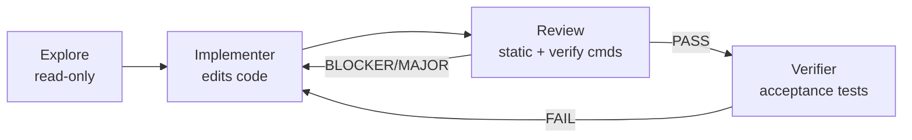

# CRAFT multi-agent

**CRAFT** (Code Review And Fix Task) is Zagens **Code mode** multi-role sub-agent orchestration: the main agent spawns **Explore / Implementer / Review / Verifier** workers via `agent_spawn`, uses **structured verdicts** (PASS / BLOCKER / MAJOR / FAIL), and a **P1 blackboard** for handoffs in an **implement → review → fix** loop.

> **Office mode has no CRAFT.** Sub-agents and blackboards exist only in Code sessions.

---

## When to use it

| Good fit | Poor fit |
|----------|----------|
| Security-sensitive or independently reviewed changes | Single-file typos |
| Cross-crate / large API reshapes | Office DOCX deliverables |
| Refactors with test gaps | One-shot Q&A |
| Full-repo audits (with [audit scratchpad](/docs/code/audit-scratchpad)) | Tiny obvious patches |

Relation to [LHT](/docs/code/lht):

- **LHT** drives long-horizon **checklists + completion gates + optional macro loop** ([LHT settings](/docs/settings/lht)).
- **CRAFT** drives **role split + blackboard + review verdicts**.
- **Large refactor preset** can auto-enter **LHT↔CRAFT macro loop** in strict mode; **craft-audit preset** **disables LHT nudges** and uses Scratchpad + CRAFT audit instead.

---

## Roles and pipeline

Typical fix-loop (implementation tasks):



| Role | `agent_spawn` type | Tool surface (runtime clip) | Blackboard partition |
|------|-------------------|----------------------------|----------------------|
| **Explore** | `explore` | Read-only: `list_dir`, `read_file`, `grep_files`, `glob_files`, `file_search`, `web_search`, `web.run`, `note` | `explorer` — findings, coverage, `files_examined` |
| **Implementer** | `implementer` | **Inherits parent tools** (writes, shell, …, sandbox-bound) | `implementer` — **`rounds[]`** per iteration |
| **Review** | `review` | Read-only + **`exec_shell` (verify)**: `list_dir`, `read_file`, `grep_files`, `glob_files`, `file_search`, `exec_shell`, `note` | `reviewer` — **`verdict`** + blockers |
| **Verifier** | `verifier` | Inherits parent tools | `verifier` — verdict + failures + summary |
| **Auditor** | `auditor` | Audit-focused mechanical checks | `auditor` — verdict + details |
| **Plan** | `plan` | Planning / checklist | No blackboard write |
| **General** | `general` | Full parent inheritance | No blackboard write |

Explore must emit **`## Coverage Report`**; Review emits **`<!-- craft-verdict -->`** JSON for Implementer consumption.

---

## Verdict levels

Review / Verifier / Auditor share **`VerdictLevel`**:

| Verdict | Meaning | Typical follow-up |
|---------|---------|-------------------|
| **PASS** | Accepted | Verifier or finish |
| **BLOCKER** | Must fix to proceed | New Implementer round; LHT macro may write checklist items |
| **MAJOR** | Important, not always hard-stop | Depends on prompt |
| **FAIL** | Verification failed | Back to Implementer or mark unmet |

UI colors: **BLOCKER / FAIL** red, **MAJOR** amber, **PASS** green.

Items may include `file`, `line`, `description`, `rule`, `suggestion`, `severity`.

---

## P1 blackboard

Structured conclusions live on disk, not only in chat:

```
{workspace}/.zagens/blackboards/{task_id}.json
```

(Legacy reads may fall back to `.deepseek/blackboards/`.)

| Field | Role |
|-------|------|
| `schema_version` | Currently `1` |
| `task_id` | Matches spawn `task_id` |
| `explorer` / `implementer` / `reviewer` / `verifier` / `auditor` | Each role merges its partition on completion |

**Rules:**

- Child reads the board **once at spawn** — no live reload.
- Each Implementer completion **appends** to `implementer.rounds[]`.
- Use a consistent **`task_id`** across one fix-loop.

**Composer workspace must equal the repo root** under audit, or [sub-agents panel](/docs/code/subagents) CRAFT tasks and scratchpad paths will mismatch.

---

## LHT macro loop

With [macro review loop](/docs/settings/lht) enabled in **strict** mode, harness may **auto-spawn CRAFT Review** when the checklist graph completes, map **BLOCKER** items back to the checklist, and run a remediation segment.

Same blackboard/verdict model as manual `agent_spawn(type=review)` — different **trigger** (harness vs you/main agent).

---

## Desktop UI

### Sub-agents panel

Sidebar → **Agents** ([sub-agents panel](/docs/code/subagents)).

Header stats: **running / completed / interrupted**. Cards show type, objective, steps, timeout, tool count, duration; expand for tool trace and summary.

**Stuck suspected** amber hint: parent may cancel and defer scratchpad areas.

### CRAFT tasks section

Bottom **CRAFT tasks** when blackboard files exist:

| Row | Meaning |
|-----|---------|
| **Explorer** | Explorer partition written |
| **Implementer rounds** | `implementer.rounds` length |
| **Reviewer** | Latest **verdict** |
| **Verifier** | **summary** if present |

From `GET /v1/blackboards` + detail, polled.

### Audit grid

Title bar **Show audit grid** (Code, when checklist/scratchpad/agents data exists) opens **2×2**:

| Quadrant | Content |
|----------|-----------|
| Checklist | [Checklist](/docs/code/checklist) |
| **Audit** | [Audit scratchpad](/docs/code/audit-scratchpad) |
| Long horizon | [LHT panel](/docs/code/lht) |
| Agents | Same agent panel |

Width is draggable; persisted in localStorage.

---

## Settings

**Settings → System → Security** ([execution policy](/docs/settings/exec-policy)):

| Field | Role |
|-------|------|
| **Sub-agents enabled** | Master switch |
| **Max sub-agents** | Concurrency 1–20 |
| **Step timeout** | Per LLM step 120–1800s (default 600s) |

`[features] subagents = false` in config disables entirely.

Spawn **`step_timeout_ms`** overrides one job (large audits: 600000–1800000 ms).

---

## LHT preset: repo audit (craft-audit)

**Settings → LHT → Harness presets → Repo audit**:

- `[long_horizon].enabled = false` — no harness nudges
- Flow: **init scratchpad** → Explore by area → optional Implementer → Review/Auditor

Composer chip may stay **LHT·off** or **LHT** since harness is off in config.

---

## Recommended usage

1. State **goal + definition of done** in the first message.
2. Reuse one **`task_id`** per fix-loop.
3. Let review finish before new scope in the same macro cycle.
4. Full-repo audit: scratchpad `template=workspace_audit` or panel **Init scratchpad** — see [audit scratchpad](/docs/code/audit-scratchpad).
5. For enforced finish: LHT gates [Observe → Enforce](/docs/settings/lht).

### Example (implement + review)

> Refactor error handling in `crates/foo`, task_id=`foo-error-refactor`. Spawn Explore for that crate, then Implementer, Review must run `cargo test -p foo`; fix-loop until PASS.

### Example (repo audit)

> Read-only security audit. Init scratchpad (workspace_audit template), Explore per inventory area, scratchpad_append findings, scratchpad_set_area(done). Final report: verified findings only.

---

## FAQ

**Panel empty but chat says spawned?**  
Possible **narrative spawn** (no `agent_spawn` tool). Scratchpad quadrant shows a warning.

**Can Review edit files?**  
Read-only tools + verification shell only.

**Empty blackboard rounds?**  
Need at least one **completed** Implementer round.

**Scratchpad vs blackboard?**  
Scratchpad = audit **external memory** (inventory + notes, per thread). Blackboard = **one CRAFT task** role handoff JSON. Full audits often use both.

---

Related: [Sub-agents panel](/docs/code/subagents) · [Audit scratchpad](/docs/code/audit-scratchpad) · [LHT settings](/docs/settings/lht) · [UI tour](/docs/ui-tour)
