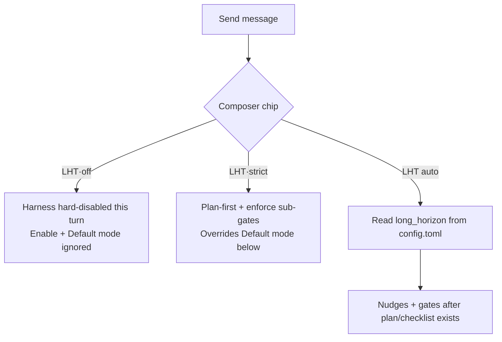

# LHT settings

**LHT** (Long-Horizon Task harness) keeps **Code** sessions on track after the model produces a plan or checklist: **nudges** to continue, **completion gates** before finishing, and an optional **CRAFT macro review loop** for large refactors.

> **Office mode does not use LHT.** Sidebar **Settings → LHT settings** appears only in Code sessions.

## Open the panel

Sidebar → **Settings** → **LHT settings**.

The intro line states that values persist to **`~/.zagens/config.toml`** under **`[long_horizon]`**, separate from the composer chip (below).

---

## Two control surfaces: who wins

LHT behavior comes from the **composer chip** (per turn) and the **LHT settings panel** (persistent). **For the active turn, the composer wins.**



| Surface | Location | Persists to | When it applies |
|---------|----------|-------------|-----------------|
| **Composer LHT chip** | Top bar above the message box; click to cycle | `~/.zagens/settings.toml` → `lht_composer_mode` | **Next turn**; **no** sidecar restart |
| **LHT settings panel** | Settings → LHT | `~/.zagens/config.toml` → `[long_horizon]` | After **Save**; prompts **sidecar restart** if a turn is streaming |

### Composer tri-state

| Chip label | Internal value | Effect this turn |
|------------|----------------|------------------|
| **LHT** | `auto` | After the model plans and a checklist exists, use `[long_horizon]` from config |
| **LHT·strict** | `strict` | **Plan required first**; completion sub-gates forced to **Enforce**; macro-loop UI needs strict |
| **LHT·off** | `off` | **Hard-disable** harness — no nudges or gates; **Enable LHT** and **Default mode** are greyed out |

Hover tooltips explain each state; click cycles **auto → strict → off → auto**.

### Panel banner (composer override)

| Composer | Banner |
|----------|--------|
| **LHT·off** | Yellow: harness hard-disabled; Enable and Default mode do not apply this turn |
| **LHT·strict** | Blue: overrides Default mode below and forces enforce sub-gates |

---

## Save and presets

| Action | Behavior |
|--------|----------|
| **Save** | Writes `config.toml`; if a **streaming turn** is active, confirms sidecar restart |
| **Apply harness preset** | One-click overlay on `[long_horizon]`; **preserves** custom `verify` / `deliverable` rows in config |
| **Save with any gate on Enforce** | Confirms: enforce can block turn completion and extend runtime |

---

## ① Harness presets

Four cards map to one-click `config.toml` overlays (custom completion_gate lists **kept**).

| Card | ID | What gets written |
|------|-----|-------------------|
| **General coding** | `code-default` | LHT **on** · mode **auto** · `reinject_every_steps=0` · macro loop **off** |
| **Large refactor** | `long-refactor` | LHT **on** · mode **strict** · **`reinject_every_steps=5`** · macro loop **on**, enter CRAFT default **when checklist complete** |
| **Multi-file fix** | `long-fix` | Same values as general coding; use for bug hunts — tighten verify / toolchain gates manually |
| **Repo audit** | `craft-audit` | LHT **off** · use [audit scratchpad](/docs/code/audit-scratchpad) + [CRAFT](/docs/code/craft) without harness nudges |

**Large refactor + macro loop:** preset enables macro loop, but the UI requires **composer LHT·strict** or **Default mode Strict** below — otherwise macro fields stay disabled.

> `reinject_every_steps` is preset-only today; no panel slider — edit `config.toml` to tune.

---

## ② Long-horizon harness

Panel section **Long-horizon harness**.

### Enable LHT harness

- **Meaning:** Once a **plan / checklist** exists, enable continue nudges and completion constraints.
- **Default:** on (general coding preset).
- **Disabled when:** composer is **LHT·off**.

### Default mode

| Option | Meaning |
|--------|---------|
| **Auto** | Harness engages only **after** the model plans and produces a checklist |
| **Strict** | **Plan required first** before large edits — best for wide refactors |

- **Default:** auto.
- **Disabled when:** composer is **LHT·off** or **LHT·strict** (strict chip already sets mode).

### Git progress signal

- **Meaning:** Git **working-tree changes** between nudges count as qualified progress.
- **Default:** on.
- **Tip:** keep on inside git repos; optional off for non-git folders.

### Max nudges per checklist item

- **Meaning:** How many times the runtime nudges a **single checklist item**.
- **Range:** 1–20 · **default 5**.

### Blocked nudges without progress

- **Meaning:** After this many nudges **without qualified progress**, LHT marks the turn **blocked** (composer may show “LHT paused”).
- **Range:** 1–10 · **default 3**.

### Auto-continue after gate gives up (experimental)

- **Meaning:** When completion gates exhaust retries but the **task graph is incomplete**, reset nudge counts and **keep the turn alive**.
- **Default:** off.
- **Sub-field — Max auto-continue rounds per turn:** shown only when enabled · range 1–64 · **default 16**.

---

## ③ Completion gate (task-agnostic)

Panel section **Completion gate (task-agnostic)**. Three gates apply to **all** code tasks — no per-repo panel setup.

> Recommended path: **Off / Observe** first → **Enforce** when your team is ready.

### The three gates

| Panel label | Config key | What it checks | Example |
|-------------|------------|----------------|---------|
| **[verify:] replay** | `auto_verify_replay` | Re-runs verification commands declared on **completed** checklist items | Item says “run `cargo test -p foo`” → must run before finish |
| **Toolchain build/test gate** | `toolchain_gate` | Detects **go / cargo / npm**, runs canonical build or test at completion | `cargo test --workspace` before closing a refactor |
| **Stub / incomplete scan** | `stub_gate` | Scans for `todo!()`, `unimplemented!()`, `NotImplementedError`, … | Blocks “done” with placeholders left |

Each gate:

| Level | Behavior |
|-------|----------|
| **Off** | No check |
| **Observe** | Telemetry only — **does not block** completion |
| **Enforce** | **Blocks** turn completion until pass |

- **Stub gate default:** Observe (other gates default off unless your config differs).

### Round and failure limits

| Panel label | Range | Default | Role |
|-------------|-------|---------|------|
| **Max manifest gate rounds** | 1–32 | 5 | Cap manifest-style completion checks |
| **Max deliverable audit rounds** | 1–32 | 5 | Cap audits of declared deliverables |
| **Max infra strikes** | 1–16 | 3 | Consecutive infra failures before giving up on a gate |

### Custom verify / deliverable rows

If you hand-wrote in `config.toml`:

```toml
[[long_horizon.completion_gate.verify]]
# ...

[[long_horizon.completion_gate.deliverable]]
# ...
```

The panel **does not edit** them but **preserves** them on save. A amber hint appears when counts are non-zero — edit the file directly.

---

## ④ Macro review loop (experimental)

Panel section **Macro review loop (experimental)**. Under LHT **strict**, optionally inserts a **CRAFT review segment**:

```text
Implement → CRAFT sub-agent review (gap list) → update checklist → main agent remediation → …
```

**Requirements (both):**

1. **Enable macro review loop** checked below, and  
2. **Composer LHT·strict** or **Default mode Strict**

Otherwise fields are disabled with: macro loop is available only in strict mode.

Enabling shows a **cost warning**: extra review sub-agents — higher token use and API cost than LHT alone.

### Enable macro review loop

- **Default:** off (large refactor preset turns it on).

### Enter CRAFT when

| Option | When to use |
|--------|-------------|
| **User confirm (recommended)** | Confirm before review — cost control |
| **When checklist complete (micro may fail)** | MicroStack-style: graph done but micro verify not all green |
| **When manifest rounds exhausted** | Narrower trigger |
| **Only after micro gates pass** | Conservative |
| **Off (manual only)** | CRAFT only when you trigger it |

- **Large refactor preset default:** when checklist complete.

Remediation keeps fixing CRAFT gaps; **micro gates must still pass** to finish.

### Cycles and small tasks

| Panel label | Range | Default | Meaning |
|-------------|-------|---------|---------|
| **Max macro cycles** | 1–8 | 3 | Top-level implement → review → remediate loops |
| **Max CRAFT rounds per cycle** | 1–4 | 2 | CRAFT spawns per macro cycle |
| **CRAFT on small tasks** | checkbox | off | When on, short checklists still get CRAFT |
| **Small-task threshold (checklist items)** | 1–32 | 3 | Shown when “CRAFT on small tasks” is **off** — skip CRAFT below this count |

---

## config.toml field map

Main keys the panel writes (for hand-editing):

```toml
[long_horizon]
enabled = true
mode = "auto"          # "auto" | "strict"
progress_via_git = true
max_nudges_per_item = 5
blocked_nudges_without_progress = 3
reinject_every_steps = 0   # preset / manual only — no panel control
auto_continue = false
max_auto_continue_rounds = 16

[long_horizon.completion_gate]
auto_verify_replay = "off"   # off | observe | enforce
toolchain_gate = "off"
stub_gate = "observe"
max_manifest_rounds = 5
max_audit_rounds = 5
max_infra_strikes = 3

[long_horizon.macro_loop]
enabled = false
auto_enter_craft = "user_confirm"
max_macro_cycles = 3
max_craft_rounds_per_cycle = 2
craft_on_small_tasks = false
min_checklist_items_for_craft = 3
```

Composer chip writes **`~/.zagens/settings.toml`**:

```toml
lht_composer_mode = "auto"   # auto | strict | off
```

---

## Recommended workflows

| Goal | Composer | Preset / panel |
|------|----------|----------------|
| Daily coding | **LHT** | General coding; gates **Observe** or off |
| Wide refactor + auto CRAFT | **LHT·strict** | Large refactor preset; review macro timing |
| Multi-file bug hunt | **LHT** | Multi-file fix; tighten verify + toolchain gates |
| Repo audit without nudges | **LHT·off** | craft-audit preset + scratchpad + CRAFT |
| One quick question without LHT | **LHT·off** | Per-turn override — no config change |

---

## Watch progress in the UI

| Location | What to watch |
|----------|---------------|
| Composer bar | **LHT continue** / **LHT paused** / context warning |
| [Checklist](/docs/code/checklist) sidebar | Item completion |
| [LHT panel](/docs/code/lht) / audit grid | Macro/micro progress |
| [Sub-agents](/docs/code/subagents) | CRAFT during macro loop |

---

## FAQ

**Changed the panel but this turn didn’t change?**  
Composer overrides the active turn; you may need **Save** and (if streaming) sidecar restart. Chip tri-state applies on the **next turn**.

**LHT·off vs craft-audit preset?**  
Off disables harness **for one turn**; craft-audit persistently sets `enabled=false` and pairs with scratchpad workflow.

**Enforce gates won’t let the turn finish?**  
Expected. Switch gates to Observe, set composer **LHT·off**, or fix failing verify / stub / build items.

**Macro loop enabled but no CRAFT?**  
Check **strict mode**, small-task threshold, and whether enter timing is manual-only.

---

Related: [LHT overview](/docs/code/lht) · [CRAFT](/docs/code/craft) · [Execution policy](/docs/settings/exec-policy) · [Context usage](/docs/chat/context)
