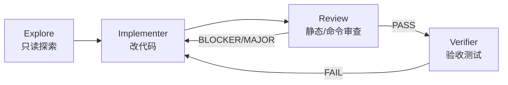

# CRAFT 多代理

**CRAFT**（Code Review And Fix Task）是 Zagens **代码模式**下的多角色子代理编排：主 Agent 通过 `agent_spawn` 派出 **Explore / Implementer / Review / Verifier** 等 worker，用**结构化裁决**（PASS / BLOCKER / MAJOR / FAIL）和 **P1 黑板**交接上下文，形成 **实现 → 审查 → 修复** 闭环。

> **办公模式无 CRAFT。** 子代理与黑板仅在代码会话启用。

---

## 适用场景

| 适合 | 不适合 |
|------|--------|
| 安全敏感模块、需独立审查的变更 | 单文件 typo |
| 跨多 crate / 大 API  reshape | 办公 DOCX 交付 |
| 测试缺口大的重构 | 一句话问答 |
| 全库审计（配合 [审计 Scratchpad](/zh-Hans/docs/code/audit-scratchpad)） | 已很小且自明的 patch |

与 [LHT](/zh-Hans/docs/code/lht) 的关系：

- **LHT** 管长程 **checklist + 完成门禁 + 可选宏观循环**（见 [LHT 设置](/zh-Hans/docs/settings/lht)）。
- **CRAFT** 管 **子代理角色分工 + 黑板 + 审查裁决**。
- **大重构预置** 可在 LHT 严格模式下自动进入 **LHT↔CRAFT 宏观循环**；**craft-audit 预置** 则 **关闭 LHT nudge**，改走 Scratchpad + CRAFT 审计路径。

---

## 角色与流水线

典型 fix-loop（实现类任务）：



| 角色 | `agent_spawn` 类型 | 工具面（runtime 裁剪） | 黑板分区 |
|------|-------------------|------------------------|----------|
| **Explore** | `explore` | 只读：`list_dir`, `read_file`, `grep_files`, `glob_files`, `file_search`, `web_search`, `web.run`, `note` | `explorer` — findings、覆盖率、`files_examined` |
| **Implementer** | `implementer` | **继承主 Agent 工具面**（含写文件、shell 等，受沙箱约束） | `implementer` — **`rounds[]`** 每轮变更与审查结论 |
| **Review** | `review` | 只读 + **`exec_shell`（验证命令）**：`list_dir`, `read_file`, `grep_files`, `glob_files`, `file_search`, `exec_shell`, `note` | `reviewer` — **`verdict`** + blockers |
| **Verifier** | `verifier` | 继承主 Agent 工具面（跑测试/构建） | `verifier` — verdict + failures + summary |
| **Auditor** | `auditor` | 审计专用（机械事实核对） | `auditor` — verdict + details |
| **Plan** | `plan` | 规划 / checklist | 不写黑板 |
| **General** | `general` | 继承主 Agent 全量工具 | 不写黑板 |

Explore 完成时需输出 **`## Coverage Report`**（已读文件、未读但相关文件、置信度）；Review 输出 **`<!-- craft-verdict -->`** JSON 围栏供 Implementer 消费。

---

## 裁决等级

Review / Verifier / Auditor 使用统一 **`VerdictLevel`**：

| 裁决 | 含义 | 典型后续 |
|------|------|----------|
| **PASS** | 通过 | 进入 Verifier 或收尾 |
| **BLOCKER** | 必须修复才能继续 | Implementer 新一轮；LHT 宏观循环可写回 checklist |
| **MAJOR** | 重要但非硬阻断 | 视 prompt 决定是否必须修 |
| **FAIL** | 验收失败（Verifier/Auditor） | 回到 Implementer 或标记未满足 |

面板与黑板卡片用颜色区分：**BLOCKER / FAIL** 红色，**MAJOR** 琥珀色，**PASS** 绿色。

每条裁决项可含：`file`, `line`, `description`, `rule`, `suggestion`, `severity`。

---

## P1 黑板（Blackboard）

CRAFT 代理间**不依赖聊天历史**传递结构化结论，而写入工作区元数据目录：

```
{工作区}/.zagens/blackboards/{task_id}.json
```

（若存在旧目录，runtime 读取时也会回退 `.deepseek/blackboards/`。）

| 字段 | 说明 |
|------|------|
| `schema_version` | 当前为 `1` |
| `task_id` | 与 spawn 时 `task_id` 一致 |
| `explorer` / `implementer` / `reviewer` / `verifier` / `auditor` | 各角色完成时**追加/合并**自己的分区 |

**规则：**

- 子代理 **spawn 时读取一次**黑板快照注入 prompt；**无热更新**。
- Implementer 每完成一轮，向 `implementer.rounds[]` **追加**记录（prompt、变更文件、上一轮 `reviewer_verdict`）。
- 下一角色 spawn 前，主 Agent 应使用**新** `task_id` 或等待上一角色写完黑板。

**Composer 工作区必须等于被改/被审项目根**，否则 [子代理面板](/zh-Hans/docs/code/subagents) 的 CRAFT 任务列表与 Scratchpad 路径会对不上。

---

## 与 LHT 宏观循环

在 [LHT 设置](/zh-Hans/docs/settings/lht) 开启 **宏观审查循环** 且为 **严格模式** 时，harness 可在 checklist 图完成等时机 **自动 spawn CRAFT Review**，将 **BLOCKER** 写回 checklist，主 Agent 进入补全段。

这与手动 `agent_spawn(type=review)` 共用同一黑板与裁决模型，区别在 **触发方**（harness vs 你/主 Agent）。

---

## 桌面界面

### 子代理面板

侧栏 → **子代理**（代码会话）。见 [子代理面板](/zh-Hans/docs/code/subagents)。

顶部统计：**运行中 / 已完成 / 已中断**。每张卡片显示：类型标签、目标摘要、步数 `done/max`、单步超时、工具调用数、耗时；展开可看工具链与 `resultSummary`。

**「长时间无进展」** 琥珀提示：父 Agent 可 cancel 并将对应 Scratchpad 区域标为 `deferred`。

### CRAFT 任务区

面板底部 **「CRAFT 任务」**（有黑板文件时显示），每张卡摘要：

| 行 | 含义 |
|----|------|
| **探索** | Explorer 分区是否已写入 |
| **实现轮次** | `implementer.rounds` 长度 |
| **审查** | 最新 Reviewer **verdict** |
| **验收** | Verifier **summary**（若有） |

数据来自 `GET /v1/blackboards` + 详情接口，轮询刷新。

### 审计网格

标题栏 **显示审计网格**（代码会话且已有 checklist / scratchpad / 子代理数据时出现）打开 **2×2 网格**：

| 象限 | 内容 |
|------|------|
| 清单 | [Checklist](/zh-Hans/docs/code/checklist) |
| **审计** | [审计 Scratchpad](/zh-Hans/docs/code/audit-scratchpad) |
| 长程任务 | [LHT 面板](/zh-Hans/docs/code/lht) |
| 子代理 | 同上 Agent 面板 |

网格宽度可拖拽，状态存入 localStorage。

---

## 设置与开关

**设置 → 系统 → 安全**（见 [执行策略](/zh-Hans/docs/settings/exec-policy)）：

| 项 | 作用 |
|----|------|
| **Sub-agents enabled** | 总开关；关则无法 spawn |
| **Max sub-agents** | 并发上限 1–20 |
| **Step timeout** | 每个 LLM 步 API 超时 120–1800 秒（默认 600s） |

`config.toml` 可设 `[features] subagents = false` 彻底禁用。

spawn 时可传 **`step_timeout_ms`** 覆盖单次子代理（全库审计建议按仓库规模设 600000–1800000 ms）。

---

## LHT 预置：全库审查（craft-audit）

**设置 → LHT → Harness 预置 → 全库审查**：

- `[long_horizon].enabled = false` — **不用** harness nudge
- 推荐工作流：**初始化 Scratchpad** → Explore 分区审计 → 可选 Implementer 修 → Review/Auditor

Composer 芯片可保持 **LHT·关** 或 **LHT**（自动），因 harness 本身已关。

---

## 推荐使用方式

1. **首条消息写清**：目标、完成定义、是否允许改测试、审查严格度。
2. **固定 `task_id`**：同一 fix-loop 内 Explore / Implementer / Review 共用黑板文件名。
3. **等审查结束再改需求**：同一宏观周期内追加 scope 会导致轮次与裁决混乱。
4. **全库审计**：用 Scratchpad `template=workspace_audit` 或面板 **初始化 scratchpad**，再 spawn Explore；见 [审计 Scratchpad](/zh-Hans/docs/code/audit-scratchpad)。
5. **需要 enforce 收尾**：配合 LHT 完成门禁 [Observe → Enforce](/zh-Hans/docs/settings/lht#③-完成门禁任务无关)。

### 示例 prompt（实现 + 审查）

> 重构 `crates/foo` 的错误处理，task_id=`foo-error-refactor`。先 spawn Explore 覆盖该 crate，再 Implementer 改代码，Review 必须跑 `cargo test -p foo` 验证，BLOCKER 则继续 fix-loop 直到 PASS。

### 示例 prompt（全库审计）

> 对当前工作区做只读安全审计。初始化 scratchpad（workspace_audit 模板），按 inventory 区域逐个 Explore，发现写入 scratchpad_append，区域完成用 scratchpad_set_area(done)。最后汇总 verified findings 写报告。

---

## 常见问题

**Q：子代理面板空，但聊天里说 spawn 了？**  
可能为 **口述 spawn**（未走 `agent_spawn` 工具）。Scratchpad 象限会显示 **「口述 spawn / 子代理面板无数据」** 警告。

**Q：Review 能改文件吗？**  
工具面为只读 + 验证用 shell；系统 prompt 约束为审查而非修改。

**Q：黑板 rounds 为空？**  
需 Implementer **完成**至少一轮才会 append；仅 Explore 不会增加 rounds。

**Q：CRAFT 与 Scratchpad 区别？**  
Scratchpad = **审计外部记忆**（inventory + notes，按 thread 绑定）；黑板 = **单次 CRAFT 任务**的角色交接 JSON。全库审计两者常一起用。

---

相关：[子代理面板](/zh-Hans/docs/code/subagents) · [审计 Scratchpad](/zh-Hans/docs/code/audit-scratchpad) · [LHT 设置](/zh-Hans/docs/settings/lht) · [界面导览](/zh-Hans/docs/ui-tour)
