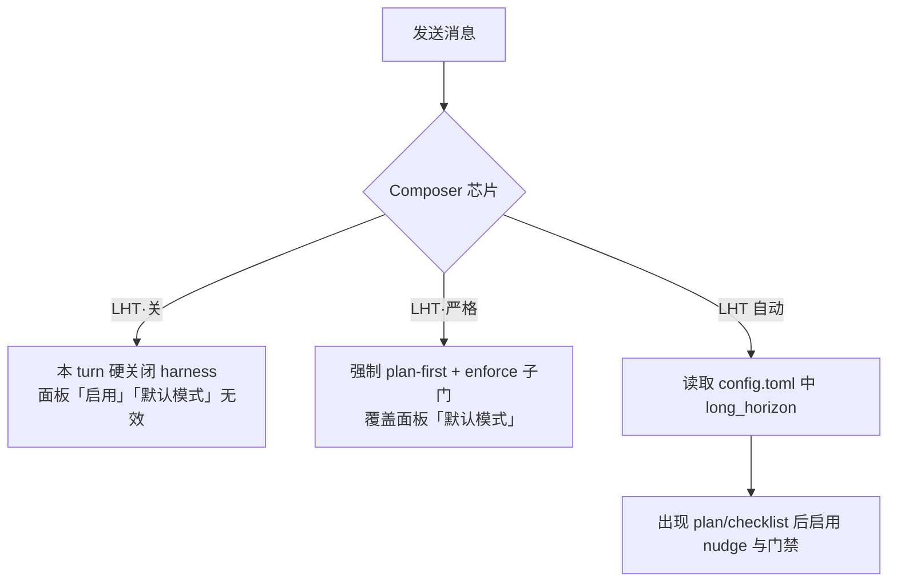

# LHT 设置

**LHT**（Long-Horizon Task，长程任务 harness）在**代码模式**下，当模型产出 plan / checklist 后，用 **nudge（续写提醒）**、**完成门禁** 与可选的 **CRAFT 宏观循环**，把多文件重构、测试清扫等长任务「拉住」不提前收尾。

> **办公模式不使用 LHT。** 侧栏 **设置 → LHT** 仅在代码会话可见。

## 打开面板

侧栏 → **设置** → **LHT 配置**。

面板顶部说明：持久化写入 **`~/.zagens/config.toml`** 的 **`[long_horizon]`** 段；与 Composer 顶栏芯片是**两套控制**（见下）。

---

## 两层控制：谁覆盖谁

LHT 行为由 **Composer 芯片**（按 turn）与 **LHT 配置面板**（持久化）共同决定。**同一 turn 内，Composer 优先。**



| 控制面 | 位置 | 写入文件 | 生效时机 |
|--------|------|----------|----------|
| **Composer LHT 芯片** | 输入框上方顶栏，点击循环 | `~/.zagens/settings.toml` → `lht_composer_mode` | **下一 turn**；**无需**重启 sidecar |
| **LHT 配置面板** | 设置 → LHT | `~/.zagens/config.toml` → `[long_horizon]` | 点击**保存**后；流式回合中会提示**重启 sidecar** |

### Composer 三态

| 芯片显示 | 内部值 | 本 turn 行为 |
|----------|--------|--------------|
| **LHT** | `auto` | 模型规划并出现 checklist 后，按下方 `[long_horizon]` 配置运行 |
| **LHT·严格** | `strict` | **必须先有 plan**；完成门禁子项强制 **Enforce**；宏观循环 UI 在严格模式下可用 |
| **LHT·关** | `off` | **硬关闭** runtime harness — 无 nudge、无完成门禁；面板里「启用 LHT harness」「默认模式」**灰色无效** |

芯片悬停提示会说明三态含义；点击在 **自动 → 严格 → 关 → 自动** 间循环。

### 面板顶部提示条

与 Composer 状态联动（与你截图中黄条一致）：

| Composer 状态 | 提示 |
|---------------|------|
| **LHT·关** | 黄条：「Composer 当前为 LHT·关 — runtime harness 已硬关闭，下方『启用』与『默认模式』在此 turn 不生效。」 |
| **LHT·严格** | 蓝条：「Composer 当前为 LHT·严格 — 覆盖下方『默认模式』并强制 enforce 子门。」 |

---

## 保存与预置

| 操作 | 行为 |
|------|------|
| **保存** | 写入 `config.toml`；若当前有**流式回合**，会二次确认是否重启 sidecar |
| **应用 Harness 预置** | 一键覆盖 `[long_horizon]` 主字段；**保留**你在 config 里手写的自定义 `verify` / `deliverable` 行 |
| **任一门禁设为 Enforce 后保存** | 弹出确认：「Enforce 可能阻断 turn 收尾并显著延长运行时间」 |

---

## ① Harness 预置

四张卡片对应 `config.toml` 一键覆盖（自定义 completion_gate 列表**不删**）。

| 预置卡片 | ID | 写入要点 |
|----------|-----|----------|
| **一般编码** | `code-default` | LHT **开** · 模式 **自动** · `reinject_every_steps=0` · 宏观循环 **关** |
| **大重构** | `long-refactor` | LHT **开** · 模式 **严格** · **`reinject_every_steps=5`**（每 5 步重注入上下文）· 宏观循环 **开**，进入 CRAFT 时机默认 **checklist 完成时** |
| **多文件修复** | `long-fix` | 与「一般编码」同数值；适合排障场景，建议手动把 verify / 工具链门调到 **Observe** 或 **Enforce** |
| **全库审查** | `craft-audit` | LHT **关** · 走 [审计 Scratchpad](/zh-Hans/docs/code/audit-scratchpad) + [CRAFT](/zh-Hans/docs/code/craft)，不用 harness nudge |

**大重构预置 + 宏观循环：** 预置会打开宏观循环，但 UI 要求 **Composer 为 LHT·严格** 或下方「默认模式」为 **严格**，否则宏观循环相关控件为灰色不可改。

> `reinject_every_steps` 仅预置写入，面板暂无单独滑块；需手改 `config.toml` 微调。

---

## ② 长程 harness

对应面板 **「长程 harness」** 区块。

### 启用 LHT harness

- **含义：** 代码长任务在出现 **plan / checklist** 后，启用续写 nudge 与完成度约束。
- **默认：** 勾选（预置「一般编码」为开）。
- **何时不可用：** Composer 为 **LHT·关** 时复选框禁用。

### 默认模式

| 选项 | 含义 |
|------|------|
| **自动** | 仅在模型**自行规划**并产出 checklist 后，harness 才介入 |
| **严格** | **必须先有 plan**，再允许大量改代码；适合大重构 |

- **默认：** 自动。
- **何时不可用：** Composer 为 **LHT·关** 或 **LHT·严格** 时，下拉框禁用（严格芯片已覆盖模式）。

### Git 进展信号

- **含义：** 两次 nudge 之间若 **git 工作区有变化**，计为「有客观进展」，避免误判卡住。
- **默认：** 开。
- **建议：** 在 git 仓库内开发时保持开启；非 git 目录可关。

### 每项 checklist 最大 nudge 次数

- **含义：** 对**单个 checklist 项**，runtime 最多提醒模型继续几次。
- **范围：** 1–20 · **默认 5**。

### 无进展 blocked 阈值

- **含义：** 连续多少次 nudge **仍无合格进展** 后，LHT 将 turn 标为 **blocked**（Composer 可能显示「LHT paused」）。
- **范围：** 1–10 · **默认 3**。

### gate 放弃后自动续跑（实验性）

- **含义：** 完成门禁用尽重试轮次，但**任务图仍未完成**时，重置 nudge 计数并**继续本 turn**（而非直接收尾）。
- **默认：** 关。
- **展开项 — 每 turn 最大 auto-continue 轮次：** 仅在上项勾选后出现 · 范围 1–64 · **默认 16**。

---

## ③ 完成门禁（任务无关）

对应面板 **「完成门禁（任务无关）」** 区块。三门对**所有代码任务**生效，**无需** per-repo 配置。

> 建议路径：**关闭 / Observe 观测** → 团队习惯后再 **Enforce**。

### 三门说明

| 面板名称 | config 键 | 检查什么 | 典型例子 |
|----------|-----------|----------|----------|
| **[verify:] 复跑** | `auto_verify_replay` | 复跑模型在**已完成** checklist 项上声明的验证命令 | checklist 写了「跑 `cargo test -p foo`」→ 收尾前真的跑一遍 |
| **工具链 build/test 门** | `toolchain_gate` | 探测 **go / cargo / npm** 等，收尾时跑 canonical build 或 test | monorepo 收尾前 `cargo test --workspace` |
| **Stub / 半成品扫描** | `stub_gate` | 扫描 `todo!()`、`unimplemented!()`、`NotImplementedError` 等 | 防止带占位符就宣布完成 |

每门三档：

| 档位 | 行为 |
|------|------|
| **关闭** | 不检查 |
| **Observe（仅遥测）** | 记录结果，**不阻断**收尾 |
| **Enforce（阻断收尾）** | 未通过则**不允许** turn 结束，模型需继续修 |

- **Stub 门默认：** Observe（其余门默认关闭，以你 config 为准）。

### 轮次与失败上限

| 面板名称 | 范围 | 默认 | 作用 |
|----------|------|------|------|
| **manifest 门最大轮次** | 1–32 | 5 | manifest 类「交付物清单」完成检查最多几轮 |
| **交付物 audit 最大轮次** | 1–32 | 5 | 对声明交付物做 audit 的上限 |
| **infra 连续失败上限** | 1–16 | 3 | 基础设施类命令连续失败几次后放弃该门 |

### 自定义 verify / deliverable

若在 `config.toml` 手写了：

```toml
[[long_horizon.completion_gate.verify]]
# ...

[[long_horizon.completion_gate.deliverable]]
# ...
```

面板**不会编辑**这些行，但**保存时保留**。检测到非零条数时，面板底部显示琥珀色提示，请直接编辑文件修改列表。

---

## ④ 宏观审查循环（实验性）

对应面板 **「宏观审查循环（实验性）」** 区块。在 LHT **严格** 模式下，可选插入 **CRAFT 审查段**：

```text
实现段 → CRAFT 子代理审查（枚举缺口）→ 写回 checklist → 主 Agent 补全段 → …
```

**启用条件（缺一不可）：**

1. 下方勾选 **启用宏观审查循环**，且  
2. **Composer 为 LHT·严格** 或 **默认模式为严格**

否则相关控件灰色，并提示：「宏观循环仅在 Composer『LHT·严格』或下方默认模式为『严格』时可用。」

勾选宏观循环后会显示**成本警告**：额外 spawn 审查子代理，token 与 API 费用通常高于单用 LHT。

### 启用宏观审查循环

- **默认：** 关（「大重构」预置会打开）。

### 进入 CRAFT 时机

| 选项 | 适用场景 |
|------|----------|
| **用户确认（推荐）** | 审查前弹确认，成本可控 |
| **checklist 完成时（微观可未绿）** | MicroStack 类：图完成但微观 verify 未全绿也可进 CRAFT |
| **manifest 轮次耗尽时** | 更窄触发条件 |
| **仅微观门全绿后** | 保守：微观门禁全部通过才审查 |
| **关闭（仅手动）** | 只在你手动触发时进 CRAFT |

- **大重构预置默认：** checklist 完成时。

补全段会继续修 CRAFT 指出的缺口；**最终仍须微观门全绿** 才能收尾。

### 轮次与小任务

| 面板名称 | 范围 | 默认 | 含义 |
|----------|------|------|------|
| **最大宏观轮数** | 1–8 | 3 | 顶层「实现→审查→补全」循环次数 |
| **每轮最大 CRAFT 审查次数** | 1–4 | 2 | 单轮宏观内 spawn CRAFT 的上限 |
| **小任务也跑 CRAFT** | 勾选 | 关 | 开则短 checklist 也审查 |
| **小任务阈值（checklist 项数）** | 1–32 | 3 | **关闭**「小任务也跑 CRAFT」时出现；项数少于此值则跳过 CRAFT |

---

## config.toml 字段对照

面板保存时写入的主要键（高级用户手改参考）：

```toml
[long_horizon]
enabled = true
mode = "auto"          # "auto" | "strict"
progress_via_git = true
max_nudges_per_item = 5
blocked_nudges_without_progress = 3
reinject_every_steps = 0   # 仅预置/手改，面板无控件
auto_continue = false
max_auto_continue_rounds = 16

[long_horizon.completion_gate]
auto_verify_replay = "off"   # off | observe | enforce
toolchain_gate = "off"
stub_gate = "observe"
max_manifest_rounds = 5
max_audit_rounds = 5
max_infra_strikes = 3

[long_horizon.macro_loop]
enabled = false
auto_enter_craft = "user_confirm"
max_macro_cycles = 3
max_craft_rounds_per_cycle = 2
craft_on_small_tasks = false
min_checklist_items_for_craft = 3
```

Composer 芯片写入 **`~/.zagens/settings.toml`**：

```toml
lht_composer_mode = "auto"   # auto | strict | off
```

---

## 推荐组合

| 你的目标 | Composer | 预置 / 面板建议 |
|----------|----------|-----------------|
| 日常小改、功能开发 | **LHT** | 一般编码；三门 **Observe** 或关闭 |
| 跨 crate 大重构 + 自动 CRAFT | **LHT·严格** | 大重构预置；确认宏观循环与进入时机 |
| 多文件 bug 排查 | **LHT** | 多文件修复；收紧 **[verify:] 复跑** 与工具链门 |
| 全库审计、不要 nudge | **LHT·关** | craft-audit 预置 + Scratchpad + CRAFT |
| 临时关掉 LHT 问一个问题 | **LHT·关** | 单 turn 覆盖，无需改 config |

---

## 在界面观察 LHT 进度

| 位置 | 看什么 |
|------|--------|
| Composer 顶栏 | **LHT continue** / **LHT paused** / 上下文预警 |
| [清单侧栏](/zh-Hans/docs/code/checklist) | checklist 项完成度 |
| [LHT 长程面板](/zh-Hans/docs/code/lht) / 审计网格 | 宏/微进度、周期图 |
| [子代理](/zh-Hans/docs/code/subagents) | 宏观循环中的 CRAFT 审查 |

---

## 常见问题

**Q：改了面板但本 turn 没变化？**  
Composer 芯片覆盖本 turn；或需点**保存**并（流式时）重启 sidecar。芯片三态**下一 turn** 即生效。

**Q：LHT·关 和 craft-audit 预置有什么区别？**  
关是**单 turn** 硬禁用；craft-audit 把 config 里 `enabled=false` **持久化**，并配合 Scratchpad 工作流。

**Q：Enforce 后门禁一直不让我结束？**  
预期行为。可改回 Observe、Composer 切 **LHT·关**，或让模型修完 verify / stub / build 失败项。

**Q：宏观循环开了但没进 CRAFT？**  
检查是否 **严格模式**、checklist 项数是否低于小任务阈值、进入时机是否设为「仅手动」。

---

相关：[LHT 概览](/zh-Hans/docs/code/lht) · [CRAFT](/zh-Hans/docs/code/craft) · [执行策略](/zh-Hans/docs/settings/exec-policy) · [上下文用量](/zh-Hans/docs/chat/context)
